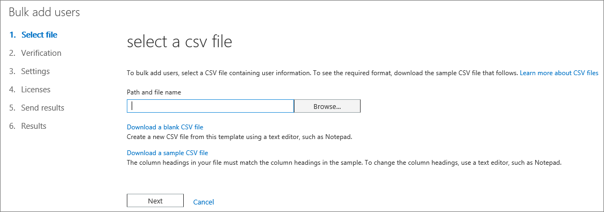

# <a name="add-several-users-at-the-same-time-to-office-365---admin-help"></a><span data-ttu-id="a3248-105">同时向 Office 365 添加多个用户 - 管理员帮助</span><span class="sxs-lookup"><span data-stu-id="a3248-105">Add several users at the same time to Office 365 - Admin Help</span></span>

<span data-ttu-id="a3248-106">团队中的每个人都需要用户帐户，才能登录并访问 Office 365 服务（如电子邮件和 Office）。</span><span class="sxs-lookup"><span data-stu-id="a3248-106">Each person on your team needs a user account before they can sign in and access Office 365 services, such as email and Office.</span></span> <span data-ttu-id="a3248-107">如果有很多人，则可以从 Excel 电子表格或以 CSV 格式保存的其他文件中一次添加所有帐户。</span><span class="sxs-lookup"><span data-stu-id="a3248-107">If you have a lot of people, you can add their accounts all at once from an Excel spreadsheet or other file saved in CSV format.</span></span> [<span data-ttu-id="a3248-108">不确定哪种 CSV 格式？</span><span class="sxs-lookup"><span data-stu-id="a3248-108">Not sure what CSV format is?</span></span>](add-several-users-at-the-same-time.md#__toc316652088)
  
## <a name="add-multiple-users-to-office-365-in-the-microsoft-365-admin-center"></a><span data-ttu-id="a3248-109">将多个用户添加到 Microsoft 365 管理中心中的 Office 365</span><span class="sxs-lookup"><span data-stu-id="a3248-109">Add multiple users to Office 365 in the Microsoft 365 admin center</span></span>

1. <span data-ttu-id="a3248-110">使用工作或学校帐户登录 Office 365。</span><span class="sxs-lookup"><span data-stu-id="a3248-110">Sign in to Office 365 with your work or school account.</span></span> 
    
2. <span data-ttu-id="a3248-111">在 "管理中心" 中，选择 "**用户** \> **活动用户**"。</span><span class="sxs-lookup"><span data-stu-id="a3248-111">In the admin center, choose **Users** \> **Active users**.</span></span>
    
    
  
    
3. <span data-ttu-id="a3248-113">在 "**导入多个用户**" 面板上，您可以选择下载带有或不带填充样本数据的示例 CSV 文件。</span><span class="sxs-lookup"><span data-stu-id="a3248-113">On the **Import multiple users** panel, you can optionally download a sample CSV file with or without sample data filled in.</span></span> 
    
    
  
    <span data-ttu-id="a3248-115">您的电子表格需要包含与样本1（用户名、名字等）**完全相同的列标题**。如果使用模板，请在文本编辑工具（如记事本）中打开它，并考虑仅保留第1行中的所有数据，并且仅在第2行和更低的行中输入数据。</span><span class="sxs-lookup"><span data-stu-id="a3248-115">Your spreadsheet needs to include the **exact same column headings** as the sample one (User Name, First Name, etc...). If you use the template, open it in a text editing tool, like Notepad, and consider leaving all the data in row 1 alone, and only entering data in rows 2 and below.</span></span> 
    
    <span data-ttu-id="a3248-116">您的电子表格还需要包含用户名的值（如 bob@contoso.com）和每个用户的显示名称（如 Bob 凯利）。</span><span class="sxs-lookup"><span data-stu-id="a3248-116">Your spreadsheet also needs to include values for the user name (like bob@contoso.com) and a display name (like Bob Kelly) for each user.</span></span> 
    
  ```
  User Name,First Name,Last Name,Display Name,Job Title,Department,Office Number,Office Phone,Mobile Phone,Fax,Address,City,State or Province,ZIP or Postal Code,Country or Region
  chris@contoso.com,Chris,Green,Chris Green,IT Manager,Information Technology,123451,123-555-1211,123-555-6641,123-555-9821,1 Microsoft way,Redmond,Wa,98052,United States
  ben@contoso.com,Ben,Andrews,Ben Andrews,IT Manager,Information Technology,123452,123-555-1212,123-555-6642,123-555-9822,1 Microsoft way,Redmond,Wa,98052,United States
  david@contoso.com,David,Longmuir,David Longmuir,IT Manager,Information Technology,123453,123-555-1213,123-555-6643,123-555-9823,1 Microsoft way,Redmond,Wa,98052,United States
  cynthia@contoso.com,Cynthia,Carey,Cynthia Carey,IT Manager,Information Technology,123454,123-555-1214,123-555-6644,123-555-9824,1 Microsoft way,Redmond,Wa,98052,United States
  melissa@contoso.com,Melissa,MacBeth,Melissa MacBeth,IT Manager,Information Technology,123455,123-555-1215,123-555-6645,123-555-9825,1 Microsoft way,Redmond,Wa,98052,United States
  
  ```

4. <span data-ttu-id="a3248-117">在框中输入文件路径，或选择 "**浏览**" 浏览 CSV 文件位置，然后选择 "**验证**"。</span><span class="sxs-lookup"><span data-stu-id="a3248-117">Enter a file path into the box, or choose **Browse** to browse to the CSV file location, then choose **Verify**.</span></span>
    
    
  
    <span data-ttu-id="a3248-119">如果文件有问题，则会在面板中显示该问题。</span><span class="sxs-lookup"><span data-stu-id="a3248-119">If there are problems with the file, the problem is displayed in the panel.</span></span> <span data-ttu-id="a3248-120">您还可以下载日志文件。</span><span class="sxs-lookup"><span data-stu-id="a3248-120">You can also download a log file.</span></span>
    
5. <span data-ttu-id="a3248-121">在 "**设置用户选项**" 对话框中，您可以设置登录状态，并选择将分配给所有用户的产品许可证。</span><span class="sxs-lookup"><span data-stu-id="a3248-121">On the **Set user options** dialog you can set the sign-in status and choose the product license that will be assigned to all users.</span></span> 
    
6. <span data-ttu-id="a3248-122">在 "**查看您的结果**" 对话框中，您可以选择将结果发送给您自己或其他用户（密码将为纯文本），您可以查看创建的用户数，以及是否需要购买更多许可证以分配给某些新用户。</span><span class="sxs-lookup"><span data-stu-id="a3248-122">On the **View your result** dialog you can choose to send the results to either yourself or other users (passwords will be in plain text) and you can see how many users were created, and if you need to purchase more licenses to assign to some of the new users.</span></span> 
    
## <a name="watch-the-video"></a><span data-ttu-id="a3248-123">观看视频</span><span class="sxs-lookup"><span data-stu-id="a3248-123">Watch the video</span></span>
<span data-ttu-id="a3248-124"><a name="bk_preview"> </a></span><span class="sxs-lookup"><span data-stu-id="a3248-124"></span></span>

 <span data-ttu-id="a3248-125">观看说明如何批量添加用户的简短视频。</span><span class="sxs-lookup"><span data-stu-id="a3248-125">Watch a short video that shows you how to bulk add users.</span></span> 
  
> [!VIDEO https://www.microsoft.com/videoplayer/embed/f4e7f161-8ae6-4264-a429-9297b539a8de?autoplay=false]
  
## <a name="next-steps"></a><span data-ttu-id="a3248-126">后续步骤</span><span class="sxs-lookup"><span data-stu-id="a3248-126">Next steps</span></span>
<span data-ttu-id="a3248-127"><a name="bk_preview"> </a></span><span class="sxs-lookup"><span data-stu-id="a3248-127"></span></span>

- <span data-ttu-id="a3248-128">现在，这些人具有帐户，需要在[电脑或 Mac 上下载并安装或重新安装 office 365 或 office 2016](https://support.office.com/article/4414eaaf-0478-48be-9c42-23adc4716658)。</span><span class="sxs-lookup"><span data-stu-id="a3248-128">Now that these people have accounts, they need to [Download and install or reinstall Office 365 or Office 2016 on a PC or Mac](https://support.office.com/article/4414eaaf-0478-48be-9c42-23adc4716658).</span></span> <span data-ttu-id="a3248-129">您的团队中的每个人都可以在最高5台电脑或 Mac 上安装 Office 365。</span><span class="sxs-lookup"><span data-stu-id="a3248-129">Each person on your team can install Office 365 on up to 5 PCs or Macs.</span></span> 
    
- <span data-ttu-id="a3248-130">每个人还可以在最大5个平板电脑和5个电话（例如 Iphone、Ipad 和 Android 电话和平板电脑）上的[移动设备上设置 Office 应用和电子邮件](https://support.office.com/article/7dabb6cb-0046-40b6-81fe-767e0b1f014f)。</span><span class="sxs-lookup"><span data-stu-id="a3248-130">Each person can also [Set up Office apps and email on a mobile device](https://support.office.com/article/7dabb6cb-0046-40b6-81fe-767e0b1f014f) on up to 5 tablets and 5 phones, such as iPhones, iPads, and Android phones and tablets.</span></span> <span data-ttu-id="a3248-131">这样一来，他们就可以从任何位置编辑 Office 文件。</span><span class="sxs-lookup"><span data-stu-id="a3248-131">This way they can edit Office files from anywhere.</span></span> 
    
    <span data-ttu-id="a3248-132">有关安装步骤的端到端列表，请参阅[设置 Office 365 for business](https://support.office.com/article/6a3a29a0-e616-4713-99d1-15eda62d04fa) 。</span><span class="sxs-lookup"><span data-stu-id="a3248-132">See [Set up Office 365 for business](https://support.office.com/article/6a3a29a0-e616-4713-99d1-15eda62d04fa) for an end-to-end list of the setup steps.</span></span> 
    
## <a name="more-information-about-how-to-add-users-to-office-365"></a><span data-ttu-id="a3248-133">有关如何将用户添加到 Office 365 的详细信息</span><span class="sxs-lookup"><span data-stu-id="a3248-133">More information about how to add users to Office 365</span></span>
<span data-ttu-id="a3248-134"><a name="bk_preview"> </a></span><span class="sxs-lookup"><span data-stu-id="a3248-134"></span></span>

### <a name="not-sure-what-csv-format-is"></a><span data-ttu-id="a3248-135">不确定哪种 CSV 格式？</span><span class="sxs-lookup"><span data-stu-id="a3248-135">Not sure what CSV format is?</span></span>
<span data-ttu-id="a3248-136"><a name="__toc316652088"> </a></span><span class="sxs-lookup"><span data-stu-id="a3248-136"></span></span>

<span data-ttu-id="a3248-137">CSV 文件是一个包含以逗号分隔的值的文件。</span><span class="sxs-lookup"><span data-stu-id="a3248-137">A CSV file is a file with comma separated values.</span></span> <span data-ttu-id="a3248-138">您可以使用任何文本编辑器或电子表格程序（如 Excel）创建或编辑此类文件。</span><span class="sxs-lookup"><span data-stu-id="a3248-138">You can create or edit a file like this with any text editor or spreadsheet program, such as Excel.</span></span>
  
<span data-ttu-id="a3248-139">您可以将[此示例电子表格](https://www.microsoft.com/download/details.aspx?id=45485)作为起始点下载。</span><span class="sxs-lookup"><span data-stu-id="a3248-139">You can download [this sample spreadsheet](https://www.microsoft.com/download/details.aspx?id=45485) as a starting point.</span></span> <span data-ttu-id="a3248-140">请记住，Office 365 需要列标题在第一行中，因此不要将其替换为其他内容。</span><span class="sxs-lookup"><span data-stu-id="a3248-140">Remember that Office 365 requires column headings in the first row so don't replace them with something else.</span></span> 
  
<span data-ttu-id="a3248-141">使用新名称保存该文件，并指定 CSV 格式。</span><span class="sxs-lookup"><span data-stu-id="a3248-141">Save the file with a new name, and specify CSV format.</span></span>
  

  
<span data-ttu-id="a3248-143">保存文件时，您可能会收到提示，如果您以 CSV 格式保存文件，则工作簿中的某些功能将丢失。</span><span class="sxs-lookup"><span data-stu-id="a3248-143">When you save the file, you'll probably get a prompt that some features in your workbook will be lost if you save the file in CSV format.</span></span> <span data-ttu-id="a3248-144">这没关系。</span><span class="sxs-lookup"><span data-stu-id="a3248-144">This is okay.</span></span> <span data-ttu-id="a3248-145">单击" **是**"即可继续。</span><span class="sxs-lookup"><span data-stu-id="a3248-145">Click **Yes** to continue.</span></span> 
  

  
### <a name="tips-for-formatting-your-spreadsheet"></a><span data-ttu-id="a3248-147">有关设置电子表格格式的提示</span><span class="sxs-lookup"><span data-stu-id="a3248-147">Tips for formatting your spreadsheet</span></span>
<span data-ttu-id="a3248-148"><a name="__toc314595848"> </a></span><span class="sxs-lookup"><span data-stu-id="a3248-148"></span></span>

- <span data-ttu-id="a3248-149">**是否需要与示例电子表格中的列标题相同？**</span><span class="sxs-lookup"><span data-stu-id="a3248-149">**Do I need the same column headings as in the sample spreadsheet?**</span></span> <span data-ttu-id="a3248-150">是。</span><span class="sxs-lookup"><span data-stu-id="a3248-150">Yes.</span></span> <span data-ttu-id="a3248-151">示例电子表格在第一行中包含列标题。</span><span class="sxs-lookup"><span data-stu-id="a3248-151">The sample spreadsheet contains column headings in the first row.</span></span> <span data-ttu-id="a3248-152">这些标题是必需的。</span><span class="sxs-lookup"><span data-stu-id="a3248-152">These headings are required.</span></span> <span data-ttu-id="a3248-153">对于要添加到 Office 365 中的每个用户，在标题下创建一行。</span><span class="sxs-lookup"><span data-stu-id="a3248-153">For each user you want to add to Office 365, create a row under the heading.</span></span> <span data-ttu-id="a3248-154">如果添加、更改或删除任何列标题，Office 365 可能无法从文件中的信息创建用户。</span><span class="sxs-lookup"><span data-stu-id="a3248-154">If you add, change, or delete any of the column headings, Office 365 might not be able to create users from the information in the file.</span></span> 
    
- <span data-ttu-id="a3248-155">**如果我没有每个用户所需的全部信息，该怎么办？**</span><span class="sxs-lookup"><span data-stu-id="a3248-155">**What if I don't have all the information required for each user?**</span></span> <span data-ttu-id="a3248-156">用户名和显示名称是必需的，并且您无法添加不包含此信息的新用户。</span><span class="sxs-lookup"><span data-stu-id="a3248-156">The user name and display name are required, and you cannot add a new user without this information.</span></span> <span data-ttu-id="a3248-157">如果没有其他信息（如传真），您可以使用空格加上逗号，以指示该字段应保留为空。</span><span class="sxs-lookup"><span data-stu-id="a3248-157">If you don't have some of the other information, such as the fax, you can use a space plus a comma to indicate that the field should remain blank.</span></span> 
    
- <span data-ttu-id="a3248-158">\* \* 电子表格是否可以小或大？</span><span class="sxs-lookup"><span data-stu-id="a3248-158">\*\* How small or large can the spreadsheet be?</span></span> <span data-ttu-id="a3248-159">\* \* 电子表格必须至少有两行。</span><span class="sxs-lookup"><span data-stu-id="a3248-159">\*\* The spreadsheet must have at least two rows.</span></span> <span data-ttu-id="a3248-160">一个用于列标题（用户数据列标签），另一个用于用户。</span><span class="sxs-lookup"><span data-stu-id="a3248-160">One is for the column headings (the user data column label) and one for the user.</span></span> <span data-ttu-id="a3248-161">行数不能超过251。</span><span class="sxs-lookup"><span data-stu-id="a3248-161">You cannot have more than 251 rows.</span></span> <span data-ttu-id="a3248-162">如果需要导入多于250个用户，可以创建多个电子表格。</span><span class="sxs-lookup"><span data-stu-id="a3248-162">If you need to import more than 250 users, you can create more than one spreadsheet.</span></span> 
    
- <span data-ttu-id="a3248-163">\* \* 我可以使用哪些语言？</span><span class="sxs-lookup"><span data-stu-id="a3248-163">\*\* What languages can I use?</span></span> <span data-ttu-id="a3248-164">\* \* 创建电子表格时，可以输入任何语言或字符形式的用户数据列标签，但不能更改标签的顺序，如示例中所示。</span><span class="sxs-lookup"><span data-stu-id="a3248-164">\*\* When you create your spreadsheet, you can enter user data column labels in any language or characters, but you must not change the order of the labels, as shown in the sample.</span></span> <span data-ttu-id="a3248-165">然后，可以使用任何语言或字符将条目输入到字段中，并将文件保存为 Unicode 或 UTF-8 格式。</span><span class="sxs-lookup"><span data-stu-id="a3248-165">You can then make entries into the fields, using any language or characters, and save your file in a Unicode or UTF-8 format.</span></span> 
    
- <span data-ttu-id="a3248-166">**如果我要从不同的国家或地区添加用户，该怎么办？**</span><span class="sxs-lookup"><span data-stu-id="a3248-166">**What if I'm adding users from different countries or regions?**</span></span> <span data-ttu-id="a3248-167">为每个区域创建单独的电子表格。</span><span class="sxs-lookup"><span data-stu-id="a3248-167">Create a separate spreadsheet for each area.</span></span> <span data-ttu-id="a3248-168">您需要逐步完成每个电子表格的 "批量添加用户" 向导，为所使用的文件中包含的所有用户提供一个位置。</span><span class="sxs-lookup"><span data-stu-id="a3248-168">You'll need to step through the Bulk add users wizard which each spreadsheet, giving a single location of all users included in the file that you're working with.</span></span> 
    
- <span data-ttu-id="a3248-169">**对我可以使用的字符数是否有限制？**</span><span class="sxs-lookup"><span data-stu-id="a3248-169">**Is there a limit to the number of characters I can use?**</span></span> <span data-ttu-id="a3248-170">下表显示了示例电子表格中每个用户数据列标签和最大字符长度。</span><span class="sxs-lookup"><span data-stu-id="a3248-170">The following table shows the user data column labels and the maximum character length for each in the sample spreadsheet.</span></span> 
    
|<span data-ttu-id="a3248-171">**用户数据列标签**</span><span class="sxs-lookup"><span data-stu-id="a3248-171">**User data column label**</span></span>|<span data-ttu-id="a3248-172">**最大字符长度**</span><span class="sxs-lookup"><span data-stu-id="a3248-172">**Maximum character length**</span></span>|
|:-----|:-----|
|<span data-ttu-id="a3248-173">User Name （必需）</span><span class="sxs-lookup"><span data-stu-id="a3248-173">User Name (Required)</span></span>  <br/> |<span data-ttu-id="a3248-174">79，其中包含 name@domain 格式的 at 符号（@）。\<扩展\>。</span><span class="sxs-lookup"><span data-stu-id="a3248-174">79 including the at sign (@), in the format name@domain.\<extension\>.</span></span> <span data-ttu-id="a3248-175">用户的别名不能超过30个字符，并且域名不能超过48个字符。</span><span class="sxs-lookup"><span data-stu-id="a3248-175">The user's alias cannot exceed 30 characters, and the domain name cannot exceed 48 characters.</span></span>  <br/> |
|<span data-ttu-id="a3248-176">名字</span><span class="sxs-lookup"><span data-stu-id="a3248-176">First Name</span></span>  <br/> |<span data-ttu-id="a3248-177">64</span><span class="sxs-lookup"><span data-stu-id="a3248-177">64</span></span>  <br/> |
|<span data-ttu-id="a3248-178">姓氏</span><span class="sxs-lookup"><span data-stu-id="a3248-178">Last Name</span></span>  <br/> |<span data-ttu-id="a3248-179">64</span><span class="sxs-lookup"><span data-stu-id="a3248-179">64</span></span>  <br/> |
|<span data-ttu-id="a3248-180">显示名称（必需）</span><span class="sxs-lookup"><span data-stu-id="a3248-180">Display Name (required)</span></span>  <br/> |<span data-ttu-id="a3248-181">256</span><span class="sxs-lookup"><span data-stu-id="a3248-181">256</span></span>  <br/> |
|<span data-ttu-id="a3248-182">职务</span><span class="sxs-lookup"><span data-stu-id="a3248-182">Job Title</span></span>  <br/> |<span data-ttu-id="a3248-183">64</span><span class="sxs-lookup"><span data-stu-id="a3248-183">64</span></span>  <br/> |
|<span data-ttu-id="a3248-184">部门</span><span class="sxs-lookup"><span data-stu-id="a3248-184">Department</span></span>  <br/> |<span data-ttu-id="a3248-185">64</span><span class="sxs-lookup"><span data-stu-id="a3248-185">64</span></span>  <br/> |
|<span data-ttu-id="a3248-186">办公室号码</span><span class="sxs-lookup"><span data-stu-id="a3248-186">Office Number</span></span>  <br/> |<span data-ttu-id="a3248-187">128</span><span class="sxs-lookup"><span data-stu-id="a3248-187">128</span></span>  <br/> |
|<span data-ttu-id="a3248-188">办公室电话</span><span class="sxs-lookup"><span data-stu-id="a3248-188">Office Phone</span></span>  <br/> |<span data-ttu-id="a3248-189">64</span><span class="sxs-lookup"><span data-stu-id="a3248-189">64</span></span>  <br/> |
|<span data-ttu-id="a3248-190">Mobile Phone － 移动电话</span><span class="sxs-lookup"><span data-stu-id="a3248-190">Mobile Phone</span></span>  <br/> |<span data-ttu-id="a3248-191">64</span><span class="sxs-lookup"><span data-stu-id="a3248-191">64</span></span>  <br/> |
|<span data-ttu-id="a3248-192">传真</span><span class="sxs-lookup"><span data-stu-id="a3248-192">Fax</span></span>  <br/> |<span data-ttu-id="a3248-193">64</span><span class="sxs-lookup"><span data-stu-id="a3248-193">64</span></span>  <br/> |
|<span data-ttu-id="a3248-194">Address</span><span class="sxs-lookup"><span data-stu-id="a3248-194">Address</span></span>  <br/> |<span data-ttu-id="a3248-195">1023</span><span class="sxs-lookup"><span data-stu-id="a3248-195">1023</span></span>  <br/> |
|<span data-ttu-id="a3248-196">城市</span><span class="sxs-lookup"><span data-stu-id="a3248-196">City</span></span>  <br/> |<span data-ttu-id="a3248-197">128</span><span class="sxs-lookup"><span data-stu-id="a3248-197">128</span></span>  <br/> |
|<span data-ttu-id="a3248-198">省/自治区/直辖市</span><span class="sxs-lookup"><span data-stu-id="a3248-198">State or Province</span></span>  <br/> |<span data-ttu-id="a3248-199">128</span><span class="sxs-lookup"><span data-stu-id="a3248-199">128</span></span>  <br/> |
|<span data-ttu-id="a3248-200">邮政编码</span><span class="sxs-lookup"><span data-stu-id="a3248-200">ZIP or Postal Code</span></span>  <br/> |<span data-ttu-id="a3248-201">40</span><span class="sxs-lookup"><span data-stu-id="a3248-201">40</span></span>  <br/> |
|<span data-ttu-id="a3248-202">国家或地区</span><span class="sxs-lookup"><span data-stu-id="a3248-202">Country or Region</span></span>  <br/> |<span data-ttu-id="a3248-203">128</span><span class="sxs-lookup"><span data-stu-id="a3248-203">128</span></span>  <br/> |
   
### <a name="still-having-problems-when-adding-users-to-office-365"></a><span data-ttu-id="a3248-204">将用户添加到 Office 365 时仍遇到问题？</span><span class="sxs-lookup"><span data-stu-id="a3248-204">Still having problems when adding users to Office 365?</span></span>

- <span data-ttu-id="a3248-205">**请仔细检查电子表格的格式是否正确。**</span><span class="sxs-lookup"><span data-stu-id="a3248-205">**Double-check that the spreadsheet is formatted correctly.**</span></span> <span data-ttu-id="a3248-206">检查列标题以确保它们与示例文件中的标题相匹配。</span><span class="sxs-lookup"><span data-stu-id="a3248-206">Check the column headings to make sure they match the headings in the sample file.</span></span> <span data-ttu-id="a3248-207">请确保遵循字符长度的规则，并使用逗号分隔每个字段。</span><span class="sxs-lookup"><span data-stu-id="a3248-207">Make sure you're following the rules for character lengths and that each field is separated by a comma.</span></span> 
    
- <span data-ttu-id="a3248-208">\* \* 如果你没有立即在 Office 365 中看到新用户，请稍等几分钟。</span><span class="sxs-lookup"><span data-stu-id="a3248-208">\*\* If you don't see the new users in Office 365 right away, wait a few minutes.</span></span> <span data-ttu-id="a3248-209">\* \* Office 365 中的所有服务所做的更改可能需要一些时间。</span><span class="sxs-lookup"><span data-stu-id="a3248-209">\*\* It can take a little while for changes to go across all the services in Office 365.</span></span> 
    
## <a name="add-multiple-users-to-office-365-in-the-old-admin-center"></a><span data-ttu-id="a3248-210">将多个用户添加到旧管理中心中的 Office 365</span><span class="sxs-lookup"><span data-stu-id="a3248-210">Add multiple users to Office 365 in the old admin center</span></span>

1. <span data-ttu-id="a3248-211">下载[此示例电子表格](https://www.microsoft.com/download/details.aspx?id=45485)并在 Excel 中打开它。</span><span class="sxs-lookup"><span data-stu-id="a3248-211">Download [this sample spreadsheet](https://www.microsoft.com/download/details.aspx?id=45485) and open it in Excel.</span></span> 
    
    <span data-ttu-id="a3248-212">您的电子表格需要包含与样本1（用户名、名字等）**完全相同的列标题**。如果使用模板，请考虑仅将行1中的所有数据保留，并且仅在第2行和更低的行中输入数据。</span><span class="sxs-lookup"><span data-stu-id="a3248-212">Your spreadsheet needs to include the **exact same column headings** as the sample one (User Name, First Name, etc...). If you use the template, consider leaving all the data in row 1 alone, and only entering data in rows 2 and below.</span></span> 
    
    <span data-ttu-id="a3248-213">您的电子表格还需要包含用户名的值（如 bob@contoso.com）和每个用户的显示名称（如 Bob 凯利）。</span><span class="sxs-lookup"><span data-stu-id="a3248-213">Your spreadsheet also needs to include values for the user name (like bob@contoso.com) and a display name (like Bob Kelly) for each user.</span></span> <span data-ttu-id="a3248-214">若要将其他字段保留为空，请在字段中输入空格以及逗号，如下图所示。</span><span class="sxs-lookup"><span data-stu-id="a3248-214">To leave other fields blank, enter a space plus a comma in the field as shown in the following figure.</span></span> 
    
    
  
    <span data-ttu-id="a3248-216">如果用户在不同的国家/地区工作，则需要为每个国家/地区的用户创建一个电子表格。</span><span class="sxs-lookup"><span data-stu-id="a3248-216">If you have people working in different countries, you'll need to create one spreadsheet for users in each country.</span></span> <span data-ttu-id="a3248-217">例如，一个电子表格，列出所有在美国工作的人，另一个列出所有在日本工作的人。</span><span class="sxs-lookup"><span data-stu-id="a3248-217">For example, one spreadsheet that lists everyone who works in the US, and another that lists everyone who works in Japan.</span></span> <span data-ttu-id="a3248-218">这是因为 Office 365 服务的可用性因地区而异。</span><span class="sxs-lookup"><span data-stu-id="a3248-218">This is because the availability of Office 365 services varies by region.</span></span> 
    
    <span data-ttu-id="a3248-219">**提示：** 将多个用户添加到 Office 365 之前，可能需要使用示例电子表格进行练习。</span><span class="sxs-lookup"><span data-stu-id="a3248-219">**Tip:** Before you add many users to Office 365, you might want to practice with the sample spreadsheet.</span></span> <span data-ttu-id="a3248-220">例如，编辑示例电子表格，其中包含几个用户的数据，如5或10，并使用新名称保存该文件。</span><span class="sxs-lookup"><span data-stu-id="a3248-220">For example, edit the sample spreadsheet with data for a few of your users, say 5 or 10, and save the file with a new name.</span></span> <span data-ttu-id="a3248-221">运行此过程中描述的步骤，检查结果，然后删除新帐户并再次重新启动。</span><span class="sxs-lookup"><span data-stu-id="a3248-221">Run through steps described in this procedure, check the results, and then delete the new accounts and start over again.</span></span> <span data-ttu-id="a3248-222">通过这种方式，您可以练习获取适合您的情况的所有数据。</span><span class="sxs-lookup"><span data-stu-id="a3248-222">This way you can practice getting all of the data right for your situation.</span></span> <span data-ttu-id="a3248-223">此外，请查看[设置电子表格格式的提示](add-several-users-at-the-same-time.md#__toc314595848)。</span><span class="sxs-lookup"><span data-stu-id="a3248-223">Also check out [Tips for formatting your spreadsheet](add-several-users-at-the-same-time.md#__toc314595848).</span></span>
    
2. <span data-ttu-id="a3248-224">使用工作或学校帐户登录 Office 365。</span><span class="sxs-lookup"><span data-stu-id="a3248-224">Sign in to Office 365 with your work or school account.</span></span> 
    
3. <span data-ttu-id="a3248-225">转到管理中心。</span><span class="sxs-lookup"><span data-stu-id="a3248-225">Go to the admin center.</span></span>
    
4. <span data-ttu-id="a3248-226">对于要使用 Office 365 服务的人员，需要为他们分配许可证。</span><span class="sxs-lookup"><span data-stu-id="a3248-226">For people to use Office 365 services, they need to be assigned a license.</span></span> <span data-ttu-id="a3248-227">在继续之前，你可能需要检查你的电子表格中列出的所有用户是否有足够的许可证。</span><span class="sxs-lookup"><span data-stu-id="a3248-227">Before continuing, you might want to check that you have enough licenses for everyone listed in your spreadsheet.</span></span> <span data-ttu-id="a3248-228">选择 "**计费** \> **订阅**" 以查看是否有足够的空间。</span><span class="sxs-lookup"><span data-stu-id="a3248-228">Choose **Billing** \> **Subscriptions** to see if you have enough.</span></span> <span data-ttu-id="a3248-229">如果需要购买更多许可证，请选择 "\* \* 更改许可证数量 \* \*"。</span><span class="sxs-lookup"><span data-stu-id="a3248-229">If you need to buy more licenses, choose \*\* Change license quantity \*\*.</span></span> <span data-ttu-id="a3248-230">或者，您可以运行向导并分配您拥有的许可证，稍后再购买更多许可证并重新运行向导。</span><span class="sxs-lookup"><span data-stu-id="a3248-230">Or, you can run the wizard and assign the licenses you have, then buy more licenses later and rerun the wizard.</span></span> 
    
5. <span data-ttu-id="a3248-231">现在，转到 "批量添加用户" 向导：选择 "**用户** \> **活动用户**"。</span><span class="sxs-lookup"><span data-stu-id="a3248-231">Now go to the Bulk add users wizard: choose **Users** \> **Active Users**.</span></span> <span data-ttu-id="a3248-232">选择的图标，如下图所示。</span><span class="sxs-lookup"><span data-stu-id="a3248-232">Choose  as shown in the following figure.</span></span> 
    
    
  
    <span data-ttu-id="a3248-234">此时将显示 "批量添加用户" 向导，并逐步介绍如何将一组用户添加到 Office 365。</span><span class="sxs-lookup"><span data-stu-id="a3248-234">The Bulk add users wizard appears and steps you through adding a group of users to Office 365.</span></span> 
    
6. <span data-ttu-id="a3248-235">在第1步-选择 CSV 文件中，指定您自己的电子表格，如下图所示。</span><span class="sxs-lookup"><span data-stu-id="a3248-235">In Step 1 - Select a CSV file, specify your own spreadsheet as shown in the following figure.</span></span>
    
    
  
7. <span data-ttu-id="a3248-237">在第2步-验证中，向导将告诉您电子表格中的内容格式是否正确。</span><span class="sxs-lookup"><span data-stu-id="a3248-237">In Step 2 - Verification, the wizard tells you whether the content in the spreadsheet is formatted correctly.</span></span>
    
    
  
8. <span data-ttu-id="a3248-239">在 "步骤 3-设置" 中，选择 "**允许**"，以便电子表格中列出的人员能够使用 Office 365。</span><span class="sxs-lookup"><span data-stu-id="a3248-239">In Step 3 - Settings, choose **Allowed** so that the people listed in your spreadsheet will be able to use Office 365.</span></span> <span data-ttu-id="a3248-240">此外，选择这些用户将使用 Office 365 的国家/地区。</span><span class="sxs-lookup"><span data-stu-id="a3248-240">Also choose the country in which these people will use Office 365.</span></span> <span data-ttu-id="a3248-241">请记住，如果组织中的某些人要在不同的国家/地区使用 Office 365，请使用其名称创建一个单独的电子表格，并再次运行 "批量添加用户" 向导以添加它们。</span><span class="sxs-lookup"><span data-stu-id="a3248-241">Remember if some people in your organization are going to use Office 365 in a different country, create a separate spreadsheet with their names and run the Bulk add users wizard again to add them.</span></span> 
    
    
  
9. <span data-ttu-id="a3248-243">"分配许可证" 页面告诉您有多少个可用的许可证。</span><span class="sxs-lookup"><span data-stu-id="a3248-243">The assign licenses page tells you how many licenses are available.</span></span> 
    
    
  
    <span data-ttu-id="a3248-245">可以选择 "**购买更多许可证**"，但你将离开批量添加用户向导，并转到 Microsoft 365 管理中心中的 "**帐单**"。</span><span class="sxs-lookup"><span data-stu-id="a3248-245">You can choose **Buy more licenses**, but you'll leave the Bulk add users wizard and go to **Billing** in the Microsoft 365 admin center.</span></span> <span data-ttu-id="a3248-246">在购买更多许可证后，你需要等待几分钟才能处理订单，然后从开头批量启动批量添加用户向导。</span><span class="sxs-lookup"><span data-stu-id="a3248-246">After buying more licenses, you'll have to wait a few minutes for the order to be processed and then start the Bulk add users wizard from the beginning.</span></span> 
    
    <span data-ttu-id="a3248-247">如果不购买更多许可证，则不会为电子表格中列出的所有用户创建帐户。</span><span class="sxs-lookup"><span data-stu-id="a3248-247">If you don't buy more licenses, accounts won't be created for everyone listed in your spreadsheet.</span></span> 
    
    <span data-ttu-id="a3248-248">在此示例中，我们不会购买任何更多许可证，而是继续批量添加用户向导。</span><span class="sxs-lookup"><span data-stu-id="a3248-248">In this example, we don't buy any more licenses and continue with the Bulk add users wizard.</span></span>
    
10. <span data-ttu-id="a3248-249">在 "步骤 5-发送结果" 中，键入您想要获取其电子邮件的人员的电子邮件地址，该电子邮件列出电子表格中的人员的*所有*Office 365 用户名和临时密码。</span><span class="sxs-lookup"><span data-stu-id="a3248-249">In Step 5 - Send Results, type the email addresses of the people who you want to get an email that lists  *all*  of the Office 365 user names and temporary passwords for the people in the spreadsheet.</span></span> 
    
    
  
    <span data-ttu-id="a3248-251">以下电子邮件将发送到您在步骤 5-发送结果中指定的所有电子邮件地址。</span><span class="sxs-lookup"><span data-stu-id="a3248-251">The following email is sent to all the email addresses you specified in Step 5 - Send results.</span></span> <span data-ttu-id="a3248-252">此电子邮件指示已创建的帐户。</span><span class="sxs-lookup"><span data-stu-id="a3248-252">This email indicates which accounts were created.</span></span> <span data-ttu-id="a3248-253">请注意，由于没有足够的许可证，因此没有为某些人创建帐户。</span><span class="sxs-lookup"><span data-stu-id="a3248-253">Notice that accounts weren't created for some people because there weren't enough licenses.</span></span> 
    
    
  
    <span data-ttu-id="a3248-255">你可以在以后购买更多许可证，然后使用同一个电子表格重新运行批量添加用户向导。</span><span class="sxs-lookup"><span data-stu-id="a3248-255">You can buy more licenses later and rerun the Bulk add users wizard with the same spreadsheet.</span></span> <span data-ttu-id="a3248-256">向导跳过已拥有帐户的用户;在结果报告中，它将显示 "复制用户名"，以指示具有该信息的人已拥有帐户。</span><span class="sxs-lookup"><span data-stu-id="a3248-256">The wizard skips over the users that already have accounts; on the results report, it will say "duplicate user name" to indicate someone with that information already has an account.</span></span>
    
11. <span data-ttu-id="a3248-257">批量添加用户向导中的最后一页列出用户名和临时密码，如下图中所示。</span><span class="sxs-lookup"><span data-stu-id="a3248-257">The final page in the Bulk add users wizard lists the user names and temporary passwords, as shown in the following figure.</span></span>
    
    
  
12. <span data-ttu-id="a3248-259">将用户添加到 Office 365 后，需要告诉他们 Office 365 帐户信息。</span><span class="sxs-lookup"><span data-stu-id="a3248-259">After you've added users to Office 365, you need to tell them about their Office 365 account information.</span></span> <span data-ttu-id="a3248-260">使用正常的过程传递新密码。</span><span class="sxs-lookup"><span data-stu-id="a3248-260">Use your normal process for communicating new passwords.</span></span>
    

