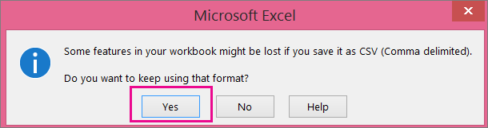
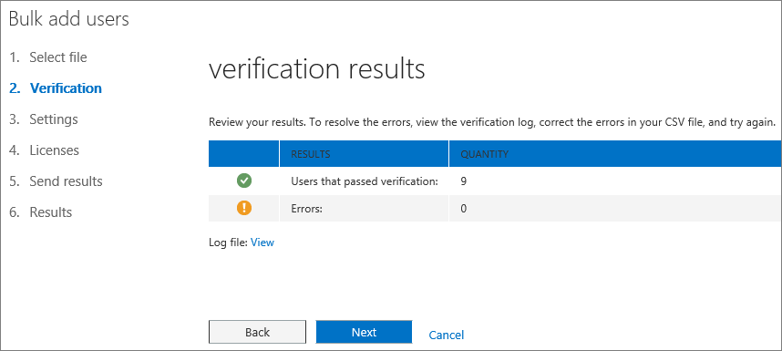
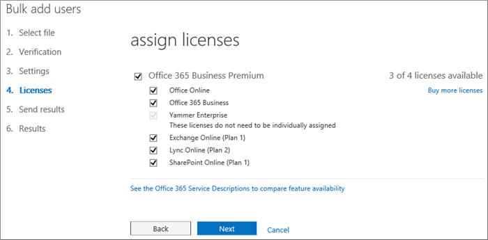

# <a name="add-several-users-at-the-same-time-to-office-365---admin-help"></a>同时向 Office 365 添加多个用户 - 管理员帮助

团队中的每个人他们可以登录和访问 Office 365 服务，如电子邮件和办公室之前需要用户帐户。如果您有很多人，您可以从 Excel 电子表格或其他文件的保存 CSV 格式一次性彻底添加其帐户。[不确定哪种 CSV 格式是？](add-several-users-at-the-same-time.md#__toc316652088)
  
## <a name="add-multiple-users-to-office-365-in-the-office-365-admin-center"></a>将多个用户添加到 Office 365 管理中心中的 Office 365

1. 使用您的工作或学校帐户登录 Office 365。 
    
2. 在 Office 365 管理中心中，选择**用户** \> **活动用户**。
    
    
  
3. 在**详细**下拉列表，选择**多个用户导入**。
    
4. 在**导入多个用户**面板中，您可以 （可选） 下载示例 CSV 文件使用或不示例数据填充。 
    
    
  
    电子表格需要作为一个示例包括**完全相同的列标题**(用户名称、 名字、 等。...)。如果您使用的模板，在文本编辑工具，如记事本中打开它，并考虑离开第 1 行中的所有数据，仅仅在行 2 和下方输入数据。 
    
    电子表格还需要包括用户名 （例如 bob@contoso.com) 和每个用户的显示名称 （如 Bob Kelly) 的值。 
    
  ```
  User Name,First Name,Last Name,Display Name,Job Title,Department,Office Number,Office Phone,Mobile Phone,Fax,Address,City,State or Province,ZIP or Postal Code,Country or Region
  chris@contoso.com,Chris,Green,Chris Green,IT Manager,Information Technology,123451,123-555-1211,123-555-6641,123-555-9821,1 Microsoft way,Redmond,Wa,98052,United States
  ben@contoso.com,Ben,Andrews,Ben Andrews,IT Manager,Information Technology,123452,123-555-1212,123-555-6642,123-555-9822,1 Microsoft way,Redmond,Wa,98052,United States
  david@contoso.com,David,Longmuir,David Longmuir,IT Manager,Information Technology,123453,123-555-1213,123-555-6643,123-555-9823,1 Microsoft way,Redmond,Wa,98052,United States
  cynthia@contoso.com,Cynthia,Carey,Cynthia Carey,IT Manager,Information Technology,123454,123-555-1214,123-555-6644,123-555-9824,1 Microsoft way,Redmond,Wa,98052,United States
  melissa@contoso.com,Melissa,MacBeth,Melissa MacBeth,IT Manager,Information Technology,123455,123-555-1215,123-555-6645,123-555-9825,1 Microsoft way,Redmond,Wa,98052,United States
  
  ```

5. 在框中，输入文件路径，或选择**浏览**以浏览到 CSV 文件位置，然后选择**验证**。
    
    
  
    如果文件的问题，面板中显示问题。您还可以下载日志文件。
    
6. 在**设置用户选项**对话框可以设置的登录状态，并选择将分配给所有用户的产品许可证。 
    
7. 在**查看您的结果**对话框，可以选择要将结果发送给您自己或其他用户 （密码将以纯文本），您可以看到多少用户创建，且您需要购买更多许可证分配给新用户的一些。 
    
## <a name="watch-the-video"></a>观看视频
<a name="bk_preview"> </a>

 观看演示如何批量添加用户的简短视频。 
  
> [!VIDEO https://www.microsoft.com/videoplayer/embed/f4e7f161-8ae6-4264-a429-9297b539a8de?autoplay=false]
  
## <a name="next-steps"></a>后续步骤
<a name="bk_preview"> </a>

- 现在，这些人有帐户，它们需要[下载并安装或重新安装 Office 365 或 Office 2016 PC 或 Mac 上](https://support.office.com/article/4414eaaf-0478-48be-9c42-23adc4716658)。您的团队每个人都可以安装最多 5 Pc 或 Mac 上的 Office 365。 
    
- 每个用户还可以最多 5 平板电脑和 5 电话，如 Iphone、 Ipad，和 Android 电话和平板电脑上[设置 Office 应用程序和移动设备上的电子邮件](https://support.office.com/article/7dabb6cb-0046-40b6-81fe-767e0b1f014f)。这样，他们只能编辑 Office 文件从任何位置。 
    
    有关安装步骤的端到端列表，请参阅[设置 Office 365 的业务](https://support.office.com/article/6a3a29a0-e616-4713-99d1-15eda62d04fa)。 
    
## <a name="more-information-about-how-to-add-users-to-office-365"></a>有关如何将用户添加到 Office 365 的详细信息
<a name="bk_preview"> </a>

### <a name="not-sure-what-csv-format-is"></a>不确定哪种 CSV 格式是？
<a name="__toc316652088"> </a>

CSV 文件是以逗号分隔值的文件。您可以创建或编辑的任何文本编辑器或电子表格程序，例如 Excel 文件如下所示。
  
作为起点，您可以下载[此示例电子表格](https://www.microsoft.com/en-us/download/details.aspx?id=45485)。请记住，Office 365 要求第一行中的列标题，以便不将它们替换为其他内容。 
  
使用新名称，保存该文件，并指定 CSV 格式。
  

  
当保存该文件时，您可能将获取提示，如果 CSV 格式保存文件，您的工作簿中的某些功能都将丢失。这是正常。单击**是**以继续。 
  

  
### <a name="tips-for-formatting-your-spreadsheet"></a>格式电子表格的提示
<a name="__toc314595848"> </a>

- **是否需要如示例电子表格中所示相同的列标题？** 是的。示例电子表格中包含的第一行中的列标题。这些标题是必需的。对于每个用户，您想要添加到 Office 365，创建标题下的一行。如果您添加、 更改或删除任何列标题，Office 365 可能不能创建用户从文件中的信息。 
    
- **如果我没有所需的每个用户的所有信息？** 用户名称和显示名称是必需的并不能添加新用户如果没有此信息。如果您没有一些其他信息，例如传真，可以使用空间，外加逗号以指示字段应保留为空。 
    
- * * 如何小型或大型可以是在电子表格？* * 在电子表格必须至少两行。一个适用于列标题 （用户数据列标签），另一个用于用户。不能具有多个 251 行。如果您需要导入超过 250 名用户，您可以创建多个电子表格。 
    
- * * 可以使用哪些语言？* * 在创建电子表格时，您可以在任何语言或字符为单位输入用户数据列标签，但您必须更改的标签顺序示例中所示。然后可以进行条目字段中，使用任何语言或字符为单位，以 Unicode 或 utf-8 格式保存文件。 
    
- **从不同的国家或地区如果我添加用户？** 创建单独的电子表格的每个区域。您需要单步执行批量添加用户向导的每个电子表格，授予权限的所有用户的文件中包含您正在使用的一个位置。 
    
- **是否有到我可以使用的字符数限制？** 下表显示示例电子表格中的每个用户数据列标签和最大字符长度。 
    
|**用户数据列标签**|**最大字符长度**|
|:-----|:-----|
|用户名 （必需）  <br/> |79 包括 at 符号 (@)，在格式 name@domain。\<扩展\>。用户的别名不能超过 30 个字符，并且域名不能超过 48 个字符。  <br/> |
|名字  <br/> |64  <br/> |
|姓氏  <br/> |64  <br/> |
|显示名称 （必需）  <br/> |256  <br/> |
|职务  <br/> |64  <br/> |
|Department  <br/> |64  <br/> |
|办公室号码  <br/> |128  <br/> |
|办公室电话  <br/> |64  <br/> |
|移动电话  <br/> |64  <br/> |
|传真  <br/> |64  <br/> |
|地址  <br/> |1023  <br/> |
|城市  <br/> |128  <br/> |
|省/市/自治区  <br/> |128  <br/> |
|邮政编码  <br/> |40  <br/> |
|国家或地区  <br/> |128  <br/> |
   
### <a name="still-having-problems-when-adding-users-to-office-365"></a>仍遇到问题时将用户添加到 Office 365？

- **仔细检查电子表格格式正确。** 检查以确保它们匹配示例文件中的标题的列标题。请确保您按照字符长度的规则和每个字段并用逗号分隔。 
    
- * * 如果您没有立即看到 Office 365 中的新用户，请等待几分钟。* * 它可以有点时用于更改转跨 Office 365 中的所有服务。 
    
## <a name="add-multiple-users-to-office-365-in-the-old-office-365-admin-center"></a>将多个用户添加到旧的 Office 365 管理中心中的 Office 365

1. 下载[此示例电子表格](https://www.microsoft.com/en-us/download/details.aspx?id=45485)，并在 Excel 中打开。 
    
    电子表格需要作为一个示例包括**完全相同的列标题**(用户名称、 名字、 等。...)。如果您使用的模板，请考虑离开本身，第 1 行中的所有数据和行 2 中和下方仅输入数据。 
    
    电子表格还需要包括用户名 （例如 bob@contoso.com) 和每个用户的显示名称 （如 Bob Kelly) 的值。若要将其他字段保留为空，空间，外加逗号分隔的字段中输入下图中所示。 
    
    
  
    如果必须在不同的国家/地区的人员，您将需要在每个国家/地区中创建一个用户的电子表格。例如，一个电子表格列出了在美国，适用于所有人以及另一个列出的每个人都适用于日本。这是因为 Office 365 服务的可用性随区域。 
    
    **提示：** 将多个用户添加到 Office 365 之前，您可能需要与示例电子表格的做法。例如，编辑为几个您的用户的数据的示例电子表格、 说 5 或 10，并使用新名称保存该文件。通过此过程中所述步骤运行、 检查结果，然后删除新帐户和重新开始。这样可以练习获取所有数据右您的具体情况。此外签出[的格式将电子表格的提示](add-several-users-at-the-same-time.md#__toc314595848)。
    
2. 使用您的工作或学校帐户登录 Office 365。 
    
3. 转到 Office 365 管理中心。
    
4. 使用 Office 365 服务的人员，他们需要分配许可证。在继续之前，您可能想要检查您的电子表格中列出的所有人都有足够的许可证。选择**帐单** \> ，看是否有足够的**订阅**。如果您需要购买更多许可证，请选择 * * 更改许可证数量 * *。或者，您可以运行向导和分配的许可证，然后购买更多许可证更高版本中，并重新运行该向导。 
    
5. 现在转到批量添加用户向导： 选择**用户** \> **活动用户**。选择下图中所示。 
    
    
  
    批量添加的用户向导将显示，并通过将一组用户添加到 Office 365 的操作。 
    
6. 在步骤 1-选择 CSV 文件，如下图所示指定自己的电子表格。
    
    
  
7. 步骤 2-验证，请在该向导会告诉您电子表格中的内容的格式正确。
    
    
  
8. 在步骤 3-设置，选择**允许**，以便在电子表格中列出的人员将能够使用 Office 365。此外可以选择这些人员将在其中使用 Office 365 的国家或地区。请记住是否您的组织中的某些人打算在不同的国家/地区使用 Office 365，请使用其名称创建一个单独的电子表格和运行批量添加用户向导再次以将他们添加。 
    
    
  
9. 分配许可证页上告诉您多少许可证可用。 
    
    
  
    您可以选择**购买更多许可证**，但您要保留批量添加用户向导，并转到 Office 365 管理中心中的**帐单**。后购买更多许可证，您将需要等待几分钟时间才能处理，然后开始批量添加用户向导从头开始。 
    
    如果您不购买更多许可证，不会在电子表格中列出的每个人创建帐户。 
    
    本示例中，我们不购买任何更多许可证和继续批量添加用户向导。
    
10. 在步骤 5-将结果发送，键入您希望获取列出*所有*Office 365 用户的用户名和临时密码的电子表格中的人员的电子邮件的人员的电子邮件地址。 
    
    
  
    以下电子邮件发送给您在步骤 5-发送结果中指定的所有电子邮件地址。此电子邮件指示已创建的帐户。请注意，帐户或者没有为一些人员创建，因为没有足够的许可。 
    
    
  
    您可以购买更多许可证更高版本和重新运行批量添加用户向导使用相同的电子表格。该向导跳过用户已具有帐户;在结果报告中，则它会显示"重复的用户名称"以指示该信息已经具有都有一个帐户。
    
11. 批量中的最后一页添加用户向导列出的用户的用户名和临时密码，如下图所示。
    
    
  
12. 用户添加到 Office 365 后，您需要告知他们有关其 Office 365 帐户信息。用于正常进程通信新密码。
    

