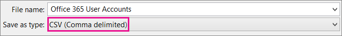
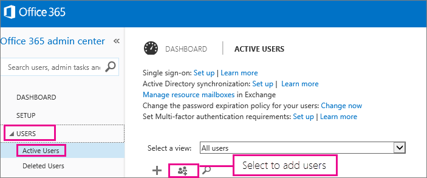

# <a name="add-several-users-at-the-same-time-to-office-365---admin-help"></a>同时向 Office 365 添加多个用户 - 管理员帮助

团队中的每个人都需要用户帐户, 才能登录并访问 Office 365 服务 (如电子邮件和 Office)。 如果有很多人, 则可以从 Excel 电子表格或以 CSV 格式保存的其他文件中一次添加所有帐户。 [不确定哪种 CSV 格式？](add-several-users-at-the-same-time.md#__toc316652088)
  
## <a name="add-multiple-users-to-office-365-in-the-office-365-admin-center"></a>将多个用户添加到 Office 365 管理中心中的 Office 365

1. 使用工作或学校帐户登录 Office 365。 
    
2. 在 Office 365 管理中心中, 选择 "**用户** \> **活动用户**"。
    
    
  
3. 在 "**更多**" 下拉中, 选择 "**导入多个用户**"。
    
4. 在 "**导入多个用户**" 面板上, 您可以选择下载带有或不带填充样本数据的示例 CSV 文件。 
    
    
  
    您的电子表格需要包含与样本 1 (用户名、名字等)**完全相同的列标题**。如果使用模板, 请在文本编辑工具 (如记事本) 中打开它, 并考虑仅保留第1行中的所有数据, 并且仅在第2行和更低的行中输入数据。 
    
    您的电子表格还需要包含用户名的值 (如 bob@contoso.com) 和每个用户的显示名称 (如 Bob 凯利)。 
    
  ```
  User Name,First Name,Last Name,Display Name,Job Title,Department,Office Number,Office Phone,Mobile Phone,Fax,Address,City,State or Province,ZIP or Postal Code,Country or Region
  chris@contoso.com,Chris,Green,Chris Green,IT Manager,Information Technology,123451,123-555-1211,123-555-6641,123-555-9821,1 Microsoft way,Redmond,Wa,98052,United States
  ben@contoso.com,Ben,Andrews,Ben Andrews,IT Manager,Information Technology,123452,123-555-1212,123-555-6642,123-555-9822,1 Microsoft way,Redmond,Wa,98052,United States
  david@contoso.com,David,Longmuir,David Longmuir,IT Manager,Information Technology,123453,123-555-1213,123-555-6643,123-555-9823,1 Microsoft way,Redmond,Wa,98052,United States
  cynthia@contoso.com,Cynthia,Carey,Cynthia Carey,IT Manager,Information Technology,123454,123-555-1214,123-555-6644,123-555-9824,1 Microsoft way,Redmond,Wa,98052,United States
  melissa@contoso.com,Melissa,MacBeth,Melissa MacBeth,IT Manager,Information Technology,123455,123-555-1215,123-555-6645,123-555-9825,1 Microsoft way,Redmond,Wa,98052,United States
  
  ```

5. 在框中输入文件路径, 或选择 "**浏览**" 浏览 CSV 文件位置, 然后选择 "**验证**"。
    
    
  
    如果文件有问题, 则会在面板中显示该问题。 您还可以下载日志文件。
    
6. 在 "**设置用户选项**" 对话框中, 您可以设置登录状态, 并选择将分配给所有用户的产品许可证。 
    
7. 在 "**查看您的结果**" 对话框中, 您可以选择将结果发送给您自己或其他用户 (密码将为纯文本), 您可以查看创建的用户数, 以及是否需要购买更多许可证以分配给某些新用户。 
    
## <a name="watch-the-video"></a>观看视频
<a name="bk_preview"> </a>

 观看说明如何批量添加用户的简短视频。 
  
> [!VIDEO https://www.microsoft.com/videoplayer/embed/f4e7f161-8ae6-4264-a429-9297b539a8de?autoplay=false]
  
## <a name="next-steps"></a>后续步骤
<a name="bk_preview"> </a>

- 现在, 这些人具有帐户, 需要在[电脑或 Mac 上下载并安装或重新安装 office 365 或 office 2016](https://support.office.com/article/4414eaaf-0478-48be-9c42-23adc4716658)。 您的团队中的每个人都可以在最高5台电脑或 Mac 上安装 Office 365。 
    
- 每个人还可以在最大5个平板电脑和5个电话 (例如 Iphone、Ipad 和 Android 电话和平板电脑) 上的[移动设备上设置 Office 应用和电子邮件](https://support.office.com/article/7dabb6cb-0046-40b6-81fe-767e0b1f014f)。 这样一来, 他们就可以从任何位置编辑 Office 文件。 
    
    有关安装步骤的端到端列表, 请参阅[设置 Office 365 for business](https://support.office.com/article/6a3a29a0-e616-4713-99d1-15eda62d04fa) 。 
    
## <a name="more-information-about-how-to-add-users-to-office-365"></a>有关如何将用户添加到 Office 365 的详细信息
<a name="bk_preview"> </a>

### <a name="not-sure-what-csv-format-is"></a>不确定哪种 CSV 格式？
<a name="__toc316652088"> </a>

CSV 文件是一个包含以逗号分隔的值的文件。 您可以使用任何文本编辑器或电子表格程序 (如 Excel) 创建或编辑此类文件。
  
您可以将[此示例电子表格](https://www.microsoft.com/en-us/download/details.aspx?id=45485)作为起始点下载。 请记住, Office 365 需要列标题在第一行中, 因此不要将其替换为其他内容。 
  
使用新名称保存该文件, 并指定 CSV 格式。
  

  
保存文件时, 您可能会收到提示, 如果您以 CSV 格式保存文件, 则工作簿中的某些功能将丢失。 这没关系。 单击" **是**"即可继续。 
  

  
### <a name="tips-for-formatting-your-spreadsheet"></a>有关设置电子表格格式的提示
<a name="__toc314595848"> </a>

- **是否需要与示例电子表格中的列标题相同？** 是。 示例电子表格在第一行中包含列标题。 这些标题是必需的。 对于要添加到 Office 365 中的每个用户, 在标题下创建一行。 如果添加、更改或删除任何列标题, Office 365 可能无法从文件中的信息创建用户。 
    
- **如果我没有每个用户所需的全部信息, 该怎么办？** 用户名和显示名称是必需的, 并且您无法添加不包含此信息的新用户。 如果没有其他信息 (如传真), 您可以使用空格加上逗号, 以指示该字段应保留为空。 
    
- * * 电子表格是否可以小或大？ * * 电子表格必须至少有两行。 一个用于列标题 (用户数据列标签), 另一个用于用户。 行数不能超过251。 如果需要导入多于250个用户, 可以创建多个电子表格。 
    
- * * 我可以使用哪些语言？ * * 创建电子表格时, 可以输入任何语言或字符形式的用户数据列标签, 但不能更改标签的顺序, 如示例中所示。 然后, 可以使用任何语言或字符将条目输入到字段中, 并将文件保存为 Unicode 或 UTF-8 格式。 
    
- **如果我要从不同的国家或地区添加用户, 该怎么办？** 为每个区域创建单独的电子表格。 您需要逐步完成每个电子表格的 "批量添加用户" 向导, 为所使用的文件中包含的所有用户提供一个位置。 
    
- **对我可以使用的字符数是否有限制？** 下表显示了示例电子表格中每个用户数据列标签和最大字符长度。 
    
|**用户数据列标签**|**最大字符长度**|
|:-----|:-----|
|User Name (必需)  <br/> |79, 其中包含格式名 @ 域中的 at 符号 (@)。\<扩展\>。 用户的别名不能超过30个字符, 并且域名不能超过48个字符。  <br/> |
|名字  <br/> |64  <br/> |
|姓氏  <br/> |64  <br/> |
|显示名称 (必需)  <br/> |256  <br/> |
|职务  <br/> |64  <br/> |
|部门  <br/> |64  <br/> |
|办公室号码  <br/> |128  <br/> |
|办公室电话  <br/> |64  <br/> |
|Mobile Phone － 移动电话  <br/> |64  <br/> |
|传真  <br/> |64  <br/> |
|Address  <br/> |1023  <br/> |
|城市  <br/> |128  <br/> |
|省/自治区/直辖市  <br/> |128  <br/> |
|邮政编码  <br/> |40  <br/> |
|国家或地区  <br/> |128  <br/> |
   
### <a name="still-having-problems-when-adding-users-to-office-365"></a>将用户添加到 Office 365 时仍遇到问题？

- **请仔细检查电子表格的格式是否正确。** 检查列标题以确保它们与示例文件中的标题相匹配。 请确保遵循字符长度的规则, 并使用逗号分隔每个字段。 
    
- * * 如果你没有立即在 Office 365 中看到新用户, 请稍等几分钟。 * * Office 365 中的所有服务所做的更改可能需要一些时间。 
    
## <a name="add-multiple-users-to-office-365-in-the-old-office-365-admin-center"></a>将多个用户添加到旧版 Office 365 管理中心中的 Office 365

1. 下载[此示例电子表格](https://www.microsoft.com/en-us/download/details.aspx?id=45485)并在 Excel 中打开它。 
    
    您的电子表格需要包含与样本 1 (用户名、名字等)**完全相同的列标题**。如果使用模板, 请考虑仅将行1中的所有数据保留, 并且仅在第2行和更低的行中输入数据。 
    
    您的电子表格还需要包含用户名的值 (如 bob@contoso.com) 和每个用户的显示名称 (如 Bob 凯利)。 若要将其他字段保留为空, 请在字段中输入空格以及逗号, 如下图所示。 
    
    
  
    如果用户在不同的国家/地区工作, 则需要为每个国家/地区的用户创建一个电子表格。 例如, 一个电子表格, 列出所有在美国工作的人, 另一个列出所有在日本工作的人。 这是因为 Office 365 服务的可用性因地区而异。 
    
    **提示:** 将多个用户添加到 Office 365 之前, 可能需要使用示例电子表格进行练习。 例如, 编辑示例电子表格, 其中包含几个用户的数据, 如5或 10, 并使用新名称保存该文件。 运行此过程中描述的步骤, 检查结果, 然后删除新帐户并再次重新启动。 通过这种方式, 您可以练习获取适合您的情况的所有数据。 此外, 请查看[设置电子表格格式的提示](add-several-users-at-the-same-time.md#__toc314595848)。
    
2. 使用工作或学校帐户登录 Office 365。 
    
3. 转到 Office 365 管理中心。
    
4. 对于要使用 Office 365 服务的人员, 需要为他们分配许可证。 在继续之前, 你可能需要检查你的电子表格中列出的所有用户是否有足够的许可证。 选择 "**计费** \> **订阅**" 以查看是否有足够的空间。 如果需要购买更多许可证, 请选择 "* * 更改许可证数量 * *"。 或者, 您可以运行向导并分配您拥有的许可证, 稍后再购买更多许可证并重新运行向导。 
    
5. 现在, 转到 "批量添加用户" 向导: 选择 "**用户** \> **活动用户**"。 选择的图标, 如下图所示。 
    
    
  
    此时将显示 "批量添加用户" 向导, 并逐步介绍如何将一组用户添加到 Office 365。 
    
6. 在第1步-选择 CSV 文件中, 指定您自己的电子表格, 如下图所示。
    
    
  
7. 在第2步-验证中, 向导将告诉您电子表格中的内容格式是否正确。
    
    
  
8. 在 "步骤 3-设置" 中, 选择 "**允许**", 以便电子表格中列出的人员能够使用 Office 365。 此外, 选择这些用户将使用 Office 365 的国家/地区。 请记住, 如果组织中的某些人要在不同的国家/地区使用 Office 365, 请使用其名称创建一个单独的电子表格, 并再次运行 "批量添加用户" 向导以添加它们。 
    
    
  
9. "分配许可证" 页面告诉您有多少个可用的许可证。 
    
    
  
    可以选择 "**购买更多许可证**", 但你将离开批量添加用户向导, 并转到 Office 365 管理中心中的 "**帐单**"。 在购买更多许可证后, 你需要等待几分钟才能处理订单, 然后从开头批量启动批量添加用户向导。 
    
    如果不购买更多许可证, 则不会为电子表格中列出的所有用户创建帐户。 
    
    在此示例中, 我们不会购买任何更多许可证, 而是继续批量添加用户向导。
    
10. 在 "步骤 5-发送结果" 中, 键入您想要获取其电子邮件的人员的电子邮件地址, 该电子邮件列出电子表格中的人员的*所有*Office 365 用户名和临时密码。 
    
    
  
    以下电子邮件将发送到您在步骤 5-发送结果中指定的所有电子邮件地址。 此电子邮件指示已创建的帐户。 请注意, 由于没有足够的许可证, 因此没有为某些人创建帐户。 
    
    
  
    你可以在以后购买更多许可证, 然后使用同一个电子表格重新运行批量添加用户向导。 向导跳过已拥有帐户的用户;在结果报告中, 它将显示 "复制用户名", 以指示具有该信息的人已拥有帐户。
    
11. 批量添加用户向导中的最后一页列出用户名和临时密码, 如下图中所示。
    
    
  
12. 将用户添加到 Office 365 后, 需要告诉他们 Office 365 帐户信息。 使用正常的过程传递新密码。
    

