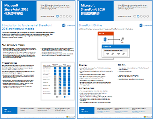
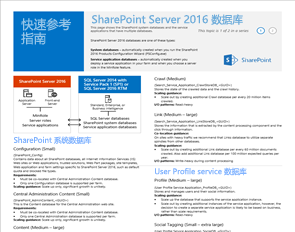
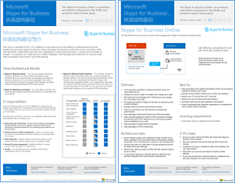
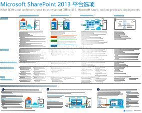
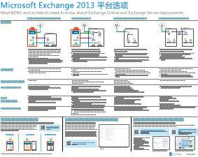
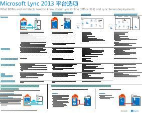
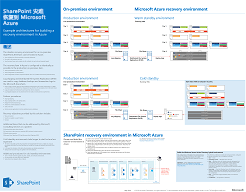

# SharePoint、Exchange、Skype for Business 和 Lync 的体系结构模型

 **摘要：** 获取介绍体系结构模型、 部署和 SharePoint、 Exchange、 Skype for Business 和 Lync 的平台选项 IT 海报。
  
这些 IT 海报介绍了 SharePoint、Exchange、Skype for Business 和 Lync 的体系结构模型和部署选项，并提供了在 Microsoft Azure 中部署 SharePoint 的设计信息。
  
与 Office 365，您可以提供您的用户熟悉作为基于云的服务的协作和通信服务。少数例外的用户体验保持不变是否要维护内部部署或使用 Office 365。此统一的用户体验使其不变得非常简单决定放置每个工作负载的位置，并如引发问题：
  
- 如何确定选择哪个平台选项用于各个工作负载？
    
- 将任何服务保留在内部部署是否有意义？
    
- 混合部署合适的方案是什么样的？
    
- Microsoft Azure 中图片适合如何？
    
- Azure 中的 Office 服务器工作负载所支持的配置是什么？
    
> [!TIP]
> 此页上的大多数海报都有多种语言，包括中文、英语、法语、德语、意大利语、日语、朝鲜语、葡萄牙语、俄语和西班牙语。若要下载其中一种语言的海报，请单击相应海报的**更多语言**链接。
  
请将想法告诉我们！向我们 ([cloudadopt@microsoft.com](mailto:cloudadopt@microsoft.com)) 发送电子邮件。 
  
此页面链接到下列海报：
  
- **体系结构模型海报**这些资源可用于确定您的理想平台和 SharePoint 2016 和业务 2015年的 Skype 的配置。
    
  - [Microsoft SharePoint 2016 体系结构模型](architectural-models-for-sharepoint-exchange-skype-for-business-and-lync.md#SP2016_ArchModel)
    
  - [OneDrive 和 Office 365 中的 SharePoint Online 中的多地理位置功能](architectural-models-for-sharepoint-exchange-skype-for-business-and-lync.md#MultiGeoO365ODB)
    
  - [SharePoint Server 2016 数据库](architectural-models-for-sharepoint-exchange-skype-for-business-and-lync.md#SP2016_Databases)
    
  - [Microsoft Skype 的业务 2015年体系结构模型](architectural-models-for-sharepoint-exchange-skype-for-business-and-lync.md#SfB2015_ArchModel)
    
- **平台选项海报**这些资源可用于确定您的理想平台和 SharePoint 2013、 Exchange 2013 和 Lync 2013 的配置。
    
  - [SharePoint 2013 平台选项](architectural-models-for-sharepoint-exchange-skype-for-business-and-lync.md#SP2013_Options)
    
  - [Exchange 2013 平台选项](architectural-models-for-sharepoint-exchange-skype-for-business-and-lync.md#Exch2013_options)
    
  - [Lync 2013 平台选项](architectural-models-for-sharepoint-exchange-skype-for-business-and-lync.md#Lync2013_Options)
    
- **SharePoint Server 2013 in Azure 解决方案海报**您可以使用这些 IT 海报确定设计和配置 SharePoint Server 2013 Azure 基础结构服务中的工作负荷。
    
  - [使用 SharePoint Server 2013 的 Microsoft Azure 中的 Internet 网站](architectural-models-for-sharepoint-exchange-skype-for-business-and-lync.md#Azure_sharepoint2013)
    
  - [设计示例： SharePoint 2013 的 Microsoft Azure 中的 Internet 网站](architectural-models-for-sharepoint-exchange-skype-for-business-and-lync.md#DesignSampleInternetSites)
    
  - [SharePoint 灾难恢复到 Microsoft Azure](architectural-models-for-sharepoint-exchange-skype-for-business-and-lync.md#sharepoint_recovery_Azure)
    
## 体系结构模型海报

这些 SharePoint 2016 和 Skype for Business 2015 的新 IT 海报，提供了一种以轻松打印形式比较各种部署方法的方式。每张海报都提供了所有配置或平台的可用选项列表，并针对每个选项提供了以下信息：
  
- **概述 （英文)** 平台，包括概念图简要概述。
    
- **最适用于**非常适用于特定平台的常见方案。
    
- **许可要求**部署所需的许可证。
    
- **体系结构任务**您需要为架构师做出决策。
    
- **IT 专业人员的任务或职责**您的 IT 员工需要规划每日责任。
    

### Microsoft 2016 SharePoint 体系结构模型

|**项**|**说明**|
|:-----|:-----|
|[          ](https://www.microsoft.com/download/details.aspx?id=52650)   [PDF](https://download.microsoft.com/download/4/F/A/4FA0F94B-EE2F-41DB-A047-D9864FEF41E9/SharePoint2016ArchitecturalModels.pdf)  \| [Visio](https://download.microsoft.com/download/4/F/A/4FA0F94B-EE2F-41DB-A047-D9864FEF41E9/SharePoint2016ArchitecturalModels.vsdx)  \| [更多语言](https://www.microsoft.com/download/details.aspx?id=52650)   | 此 IT 海报介绍了业务决策者和解决方案架构师需要了解的 SharePoint Online、Microsoft Azure 和 SharePoint 本地配置。    - **SharePoint Online (SaaS)** 软件作为服务 (SaaS) 订阅模型通过使用 SharePoint。   - **SharePoint 混合**-移到您自己的步调云中的 SharePoint 网站和应用程序。   - **Azure (IaaS) 中的 SharePoint** -扩展到 Microsoft Azure 内部部署环境和部署 SharePoint 2016 服务器存在。（这被推荐用于高可用性/灾难恢复和开发/测试环境。）  - **SharePoint 内部部署**-规划、 部署、 维护和自定义您保留对数据中心中的 SharePoint 环境。   |
   

### OneDrive 和 Office 365 中的 SharePoint Online 中的多地理位置功能

|**项**|**说明**|
|:-----|:-----|
|[          ](http://download.microsoft.com/download/0/5/9/0594634F-7893-4201-938A-C2FF2F21B655/Multi-Geo-ODB.pdf)   [PDF](http://download.microsoft.com/download/0/5/9/0594634F-7893-4201-938A-C2FF2F21B655/Multi-Geo-ODB.pdf)  \| [Visio](http://download.microsoft.com/download/0/5/9/0594634F-7893-4201-938A-C2FF2F21B655/Multi-Geo-ODB.vsdx)   | 此海报概述 OneDrive 中的多地理位置功能和 Office 365 中 SharePoint Online 之间的一页。此模型包括：   -好处   -部署步骤   -配置示例     有关 OneDrive 中的多地理位置功能和 Office 365 中 SharePoint Online 的详细信息，请单击[此处](https://aka.ms/onedrivemultigeo)。    |
   

### SharePoint Server 2016 数据库

|**项**|**说明**|
|:-----|:-----|
|[          ](https://www.microsoft.com/download/details.aspx?id=55041)   [PDF](https://download.microsoft.com/download/D/5/D/D5DC1121-8BC5-4953-834F-1B5BB03EB691/DBrefguideSPS2016_tabloid.pdf)  \| [Visio](https://download.microsoft.com/download/D/5/D/D5DC1121-8BC5-4953-834F-1B5BB03EB691/DBrefguideSPS2016_tabloid.vsdx)  \| [更多语言](https://www.microsoft.com/download/details.aspx?id=55041)   | 此 IT 海报是 SharePoint Server 2016 数据库的快速参考指南。每个数据库都包含以下详细信息：   大小   缩放指南   -I/O 模式   -要求     第一页包含了 SharePoint 系统数据库和有多个数据库的服务应用程序。第二页显示所有服务应用程序具有单个数据库。    有关 SharePoint Server 2016 数据库的详细信息，请参阅[数据库类型和 SharePoint Server 2016 中的说明](https://technet.microsoft.com/en-us/library/cc678868%28v=office.16%29.aspx)   |
   

### Microsoft Skype for Business 2015 体系结构模型

|**项**|**说明**|
|:-----|:-----|
|[          ](https://www.microsoft.com/download/details.aspx?id=55022)   [PDF](https://download.microsoft.com/download/7/7/4/7741262C-A60D-41F7-863B-99BF5964FBFE/Skype%20for%20Business%20Architectural%20Models.pdf)  \| [Visio](https://download.microsoft.com/download/7/7/4/7741262C-A60D-41F7-863B-99BF5964FBFE/Skype%20for%20Business%20Architectural%20Models.vsd)  \| [更多语言](https://www.microsoft.com/download/details.aspx?id=55022)   |此海报介绍 Skype 的业务 Online 中，本地、 混合和云 PBX，以及与 Exchange 和 SharePoint 配置集成的业务决策者解决方案架构师需要了解的有关。    这被专为 IT 专业人员的访问群体认知度通过其业务 online Skype 和 Skype 的本地业务可使用的不同基本体系结构模型。   开始与最佳无论配置适合您组织的需要和将来的计划。考虑，根据需要使用其他人。例如，您可能需要考虑与 Exchange 和 SharePoint 或利用 Microsoft 的云 PBX 产品的解决方案的集成。    |
   
## 平台选项海报

这些 SharePoint 2013、Exchange 2013 和 Lync 2013 的 IT 海报以大型海报形式提供了一种总体比较各种部署方法的方式。每张海报都提供了所有配置或平台的可用选项列表，并针对每个选项提供了以下信息：
  
- **概述 （英文)** 平台，包括概念图简要概述。
    
- **最适用于**非常适用于特定平台的常见方案。
    
- **许可要求**部署所需的许可证。
    
- **体系结构任务**您需要为架构师做出决策。
    
- **IT 专业人员的任务或职责**您的 IT 员工需要规划每日责任。
    

## SharePoint 2013 平台选项

****

|**项**|**说明**|
|:-----|:-----|
|[          ](https://www.microsoft.com/download/details.aspx?id=40332)   [PDF](http://go.microsoft.com/fwlink/p/?LinkId=324594)  \| [Visio](https://go.microsoft.com/fwlink/p/?LinkId=324593)  \| [更多语言](https://www.microsoft.com/download/details.aspx?id=40332)   |对于业务决策者 (Bdm) 和架构师，该模型演示用于 SharePoint 2013，Office 365 中的内部部署与 Office 365 和 Azure，仅本地部署的混合 SharePoint 的平台选项。它包括概述每个体系结构、 建议、 许可要求和架构师和每个平台的 IT 专业人员任务的列表。突出显示在 Azure 上的多个 SharePoint 解决方案。  此海报的辅助功能的文本版本，请参阅[访问关系图-Microsoft SharePoint 2013 平台选项](accessible-diagrammicrosoft-sharepoint-2013-platform-options.md)。    |
   

## Exchange 2013 平台选项

****

|**项**|**说明**|
|:-----|:-----|
|[          ](https://www.microsoft.com/download/details.aspx?id=42676)   [PDF](https://go.microsoft.com/fwlink/p/?LinkID=398740)  \| [Visio](https://go.microsoft.com/fwlink/p/?LinkID=398742)  \| [更多语言](https://www.microsoft.com/download/details.aspx?id=42676)   |对于 Bdm 和架构师，此模型描述 Exchange 2013 的可用的平台选项。从 Exchange Online 与 Office 365，混合 Exchange、 Exchange Server 内部部署和托管 Exchange，客户可以选择。海报包括每个体系结构选项，包括每个、 的许可证要求和 IT 专业人员的职责最理想的方案的详细信息。  此海报的辅助功能的文本版本，请参阅[访问关系图-Microsoft Exchange 2013 平台选项](accessible-diagrammicrosoft-exchange-2013-platform-options.md)。    |
   

## Lync 2013 平台选项

****

|**项**|**说明**|
|:-----|:-----|
|[          ](https://www.microsoft.com/download/details.aspx?id=41677)   [PDF](https://go.microsoft.com/fwlink/p/?LinkID=391837)  \| [Visio](https://go.microsoft.com/fwlink/p/?LinkID=391839)  \| [更多语言](https://www.microsoft.com/download/details.aspx?id=41677)   |此模型面向 BDM 和架构师，说明了 Lync 2013 的可用平台选项。客户可以从使用 Office 365 的 Lync Online、混合 Lync、Lync Server 内部部署和托管 Lync 中进行选择。此 IT 海报包括每个体系结构选项的详细信息，包括每个选项最理想的方案、许可要求和 IT 专业人员的职责。    |
   

## 在 Azure 解决方案海报中的 SharePoint

这些 IT 海报显示在大型海报格式中使用 SharePoint Server 2013 的基于 Azure 的解决方案。
  

### Microsoft Azure 中使用 SharePoint Server 2013 的 Internet 站点

****

|**项**|**说明**|
|:-----|:-----|
|[          ](https://www.microsoft.com/download/details.aspx?id=41992)   [PDF](https://go.microsoft.com/fwlink/p/?LinkId=392552)  \| [Visio](https://go.microsoft.com/fwlink/p/?LinkId=392551)  \| [更多语言](https://www.microsoft.com/download/details.aspx?id=41992)   |此海报 （英文） 概述了关键设计活动和建议的 Azure 中的面向 Internet 的网站体系结构选项。此海报的辅助功能的文本版本，请参阅[访问关系图-在 SharePoint 2013 的 Microsoft Azure 中的 Internet 网站](accessible-diagraminternet-sites-in-microsoft-azure-for-sharepoint-2013.md)。   有关详细信息，请参阅下列文章：     - [使用 SharePoint Server 2013 的 Microsoft Azure 中的 Internet 网站](internet-sites-in-microsoft-azure-using-sharepoint-server-2013.md)   - [Microsoft Azure Architectures for SharePoint 2013](microsoft-azure-architectures-for-sharepoint-2013.md)   |
   

### 设计示例：Microsoft Azure 中的 SharePoint 2013 Internet 站点

****

|**项**|**说明**|
|:-----|:-----|
|[          ](https://www.microsoft.com/download/details.aspx?id=41991)   [PDF](https://go.microsoft.com/fwlink/p/?LinkId=392549)  \| [Visio](https://go.microsoft.com/fwlink/p/?LinkId=392548)  \| [更多语言](https://www.microsoft.com/download/details.aspx?id=41991)   |此设计示例作为起点用于您自己使用 SharePoint Server 2013 的 Azure 中的体系结构面向 Internet 的网站。此海报的辅助功能的文本版本，请参阅[可访问的关系图-设计示例： SharePoint 2013 的 Microsoft Azure 中的 Internet 站点](accessible-diagramdesign-sample-internet-sites-in-microsoft-azure-for-sharepoint.md)。   有关详细信息，请参阅下列文章：     - [使用 SharePoint Server 2013 的 Microsoft Azure 中的 Internet 网站](internet-sites-in-microsoft-azure-using-sharepoint-server-2013.md)   - [Microsoft Azure Architectures for SharePoint 2013](microsoft-azure-architectures-for-sharepoint-2013.md)   |
   

### SharePoint 灾难恢复到 Microsoft Azure

****

|**项**|**说明**|
|:-----|:-----|
|[          ](https://www.microsoft.com/download/details.aspx?id=41993)   [PDF](https://go.microsoft.com/fwlink/p/?LinkId=392555)  \| [Visio](https://go.microsoft.com/fwlink/p/?LinkId=392554)  \| [更多语言](https://www.microsoft.com/download/details.aspx?id=41993)   |此 IT 海报说明了在 Azure 中的灾难恢复环境的体系结构原则。此海报的辅助功能的文本版本，请参阅[访问关系图-SharePoint 灾难恢复到 Microsoft Azure](accessible-diagramsharepoint-disaster-recovery-to-microsoft-azure.md)。   有关详细信息，请参阅下列文章：     - [Microsoft Azure 中的 SharePoint Server 2013 灾难恢复](sharepoint-server-2013-disaster-recovery-in-microsoft-azure.md)   - [Microsoft Azure Architectures for SharePoint 2013](microsoft-azure-architectures-for-sharepoint-2013.md)   |
   

## 另请参阅

[云应用和混合解决方案](cloud-adoption-and-hybrid-solutions.md)
  
[Microsoft 云 IT 体系结构资源](microsoft-cloud-it-architecture-resources.md)
  
[云应用测试实验室指南 (TLGs)](cloud-adoption-test-lab-guides-tlgs.md)
  
[混合解决方案](hybrid-solutions.md)

