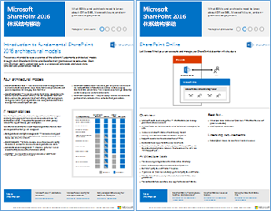
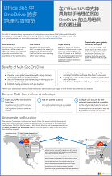
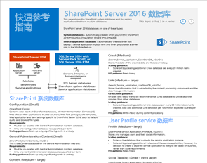
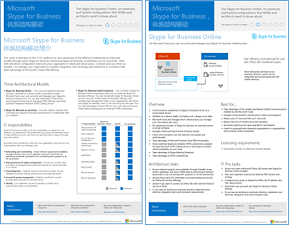
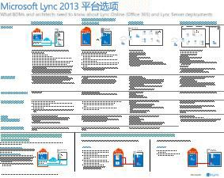
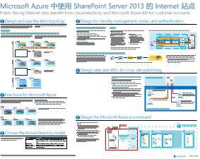
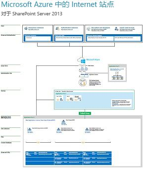

# SharePoint、Exchange、Skype for Business 和 Lync 的体系结构模型Architectural models for SharePoint, Exchange, Skype for Business, and Lync

 **摘要：** 获取介绍 SharePoint、Exchange、Skype for Business 和 Lync 的体系结构模型、部署和平台选项的 IT 海报。**Summary:** Get the IT posters that describe the architectural models, deployment, and platform options for SharePoint, Exchange, Skype for Business, and Lync.
  
这些 IT 海报介绍了 SharePoint、Exchange、Skype for Business 和 Lync 的体系结构模型和部署选项，并提供了在 Microsoft Azure 中部署 SharePoint 的设计信息。These IT posters describe the architectural models and deployment options for SharePoint, Exchange, Skype for Business, and Lync, and they provide design information for deploying SharePoint in Microsoft Azure.
  
通过 Office 365，可以将用户熟悉的协作和通信服务作为基于云的服务提供。不论是维护本地部署还是使用 Office 365，用户体验保持不变，但存在一些例外。此统一的用户体现使得决定在何处放置每个工作负载以及在何处提出问题变得简单直接，例如：With Office 365, you can provide the collaboration and communication services your users are familiar with as a cloud-based service. With a few exceptions, the user experience remains the same whether you are maintaining an on-premises deployment or using Office 365. This unified user experience makes it less straightforward to decide where to place each workload and raises questions such as:
  
- 如何确定选择哪个平台选项用于各个工作负载？How do you determine which platform option to choose for your individual workloads?
    
- 将任何服务保留在内部部署是否有意义？Does it make sense to keep any service on-premises?
    
- 混合部署合适的方案是什么样的？What is a scenario where a hybrid deployment is appropriate?
    
- Microsoft Azure 如何适应图片？How does Microsoft Azure fit in the picture?
    
- Azure 中的 Office 服务器工作负载所支持的配置是什么？What are the supported configurations for Office Server workloads in Azure?
    
> [!TIP]
> 此页上的大多数海报都有多种语言，包括中文、英语、法语、德语、意大利语、日语、朝鲜语、葡萄牙语、俄语和西班牙语。若要下载其中一种语言的海报，请单击相应海报的**更多语言**链接。Most of the posters on this page are available in multiple languages, including Chinese, English, French, German, Italian, Japanese, Korean, Portuguese, Russian, and Spanish. To download a poster in one of these languages, click the **More languages** link for that poster.
  
请将你的想法告诉我们！向我们 ([cloudadopt@microsoft.com](mailto:cloudadopt@microsoft.com)) 发送电子邮件。Let us know what you think! Send us email at [cloudadopt@microsoft.com](mailto:cloudadopt@microsoft.com). 
  
此页面链接到下列海报：This page links you to the following posters:
  
- **体系结构模型海报** 可以使用这些资源确定 SharePoint 2016 和 Skype for Business 2015 的理想平台和配置。**Architectural models posters** You can use these resources to determine your ideal platform and configuration for SharePoint 2016 and Skype for Business 2015.
    
  - [Microsoft 2016 SharePoint 体系结构模型Microsoft SharePoint 2016 Architectural Models](architectural-models-for-sharepoint-exchange-skype-for-business-and-lync.md#SP2016_ArchModel)
    
  - [Office 365 的 OneDrive 和 SharePoint Online 中的多地理位置功能Multi-Geo Capabilities in OneDrive and SharePoint Online in Office 365](architectural-models-for-sharepoint-exchange-skype-for-business-and-lync.md#MultiGeoO365ODB)
    
  - [SharePoint Server 2016 数据库SharePoint Server 2016 Databases](architectural-models-for-sharepoint-exchange-skype-for-business-and-lync.md#SP2016_Databases)
    
  - [Microsoft Skype for Business 2015 体系结构模型Microsoft Skype for Business 2015 Architectural Models](architectural-models-for-sharepoint-exchange-skype-for-business-and-lync.md#SfB2015_ArchModel)
    
- **平台选项海报** 可使用这些资源确定 SharePoint 2013、Exchange 2013 和Lync 2013 的理想平台和配置。**Platform options posters** You can use these resources to determine your ideal platform and configuration for SharePoint 2013, Exchange 2013, and Lync 2013.
    
  - [SharePoint 2013 平台选项SharePoint 2013 Platform Options](architectural-models-for-sharepoint-exchange-skype-for-business-and-lync.md#SP2013_Options)
    
  - [Exchange 2013 平台选项Exchange 2013 Platform Options](architectural-models-for-sharepoint-exchange-skype-for-business-and-lync.md#Exch2013_options)
    
  - [Lync 2013 平台选项Lync 2013 Platform Options](architectural-models-for-sharepoint-exchange-skype-for-business-and-lync.md#Lync2013_Options)
    
- **Azure 解决方案海报中的 SharePoint Server 2013** 可以使用 IT 海报确定 Azure 基础结构服务中 SharePoint Server 2013 工作负载的设计和配置。**SharePoint Server 2013 in Azure solutions posters** You can use these IT posters to determine the design and configuration for SharePoint Server 2013 workloads in Azure infrastructure services.
    
  - [Microsoft Azure 中使用 SharePoint Server 2013 的 Internet 站点Internet sites in Microsoft Azure using SharePoint Server 2013](architectural-models-for-sharepoint-exchange-skype-for-business-and-lync.md#Azure_sharepoint2013)
    
  - [设计示例：Microsoft Azure 中的 SharePoint 2013 Internet 站点Design sample: Internet sites in Microsoft Azure for SharePoint 2013](architectural-models-for-sharepoint-exchange-skype-for-business-and-lync.md#DesignSampleInternetSites)
    
  - [SharePoint 灾难恢复到 Microsoft AzureSharePoint Disaster Recovery to Microsoft Azure](architectural-models-for-sharepoint-exchange-skype-for-business-and-lync.md#sharepoint_recovery_Azure)
    
## 体系结构模型海报Architectural models posters

这些 SharePoint 2016 和 Skype for Business 2015 的新 IT 海报，提供了一种以轻松打印形式比较各种部署方法的方式。每张海报都提供了所有配置或平台的可用选项列表，并针对每个选项提供了以下信息：These new IT posters for SharePoint 2016 and Skype for Business 2015 provide a way to compare the various deployment methods in an easy-to-print format. Each poster provides a list of all the configurations or platform options available and gives you the following information for each option:
  
- **概述** 平台的简短摘要，包括概念图。**Overview** A brief summary of the platform, including a conceptual diagram.
    
- **最适用于** 非常适用于特定平台的常见方案。**Best for** Common scenarios that are ideally suited for the particular platform.
    
- **许可要求** 部署所需的许可证。**License requirements** The licenses you need for deployment.
    
- **体系结构任务** 架构师需要做出的决定。**Architecture tasks** The decisions you need to make as an architect.
    
- **IT 专业人员任务或职责** IT 员工需履行的日常职责。**IT Pro tasks or responsibilities** The daily responsibilities that your IT staff needs to plan for.
    

### Microsoft SharePoint 2016 体系结构模型Microsoft SharePoint 2016 Architectural Models

|**项****Item**|**说明****Description**|
|:-----|:-----|
|[          ](https://www.microsoft.com/download/details.aspx?id=52650)[          ](https://www.microsoft.com/download/details.aspx?id=52650)   [PDF](https://download.microsoft.com/download/4/F/A/4FA0F94B-EE2F-41DB-A047-D9864FEF41E9/SharePoint2016ArchitecturalModels.pdf)  \| [Visio](https://download.microsoft.com/download/4/F/A/4FA0F94B-EE2F-41DB-A047-D9864FEF41E9/SharePoint2016ArchitecturalModels.vsdx)  \| [更多语言](https://www.microsoft.com/download/details.aspx?id=52650)[PDF](https://download.microsoft.com/download/4/F/A/4FA0F94B-EE2F-41DB-A047-D9864FEF41E9/SharePoint2016ArchitecturalModels.pdf)  \| [Visio](https://download.microsoft.com/download/4/F/A/4FA0F94B-EE2F-41DB-A047-D9864FEF41E9/SharePoint2016ArchitecturalModels.vsdx)  \| [More languages](https://www.microsoft.com/download/details.aspx?id=52650)   | 此 IT 海报介绍了业务决策者和解决方案架构师需要了解的 SharePoint Online、Microsoft Azure 和 SharePoint 本地配置。This IT poster describes the SharePoint Online, Microsoft Azure, and SharePoint on-premises configurations that business decision makers and solutions architects need to know about.    - **SharePoint Online (SaaS)** – 通过服务型软件 (SaaS) 订阅模型使用 SharePoint。- **SharePoint Online (SaaS)** - Consume SharePoint through a Software as a Service (SaaS) subscription model.   - **SharePoint 混合** – 按你自己的步调将 SharePoint 网站和应用移到云。- **SharePoint Hybrid** - Move your SharePoint sites and apps to the cloud at your own pace.   - **Azure 中的 SharePoint (IaaS)** – 将你的本地环境扩展到 Microsoft Azure 中并在其中部署 SharePoint 2016 服务器。（建议用于高可用性/灾难恢复和开发/测试环境。）- **SharePoint in Azure (IaaS)** - You extend your on-premises environment into Microsoft Azure and deploy SharePoint 2016 Servers there. (This is recommended for High Availability/Disaster Recovery and dev/test environments.)   - **SharePoint 本地部署** – 规划、部署、维护和自定义你维护的数据中心中的 SharePoint 环境。- **SharePoint On-premises** - You plan, deploy, maintain and customize your SharePoint environment in a datacenter that you maintain.   |
   

### Office 365 的 OneDrive 和 SharePoint Online 中的多地理位置功能Multi-Geo Capabilities in OneDrive and SharePoint Online in Office 365

|**项****Item**|**说明****Description**|
|:-----|:-----|
|[          ](https://github.com/MicrosoftDocs/OfficeDocs-Enterprise/raw/live/Enterprise/media/Multi-Geo-ODB.pdf)[          ](https://github.com/MicrosoftDocs/OfficeDocs-Enterprise/raw/live/Enterprise/media/Multi-Geo-ODB.pdf)   [PDF](https://github.com/MicrosoftDocs/OfficeDocs-Enterprise/raw/live/Enterprise/media/Multi-Geo-ODB.pdf)  \| [Visio](https://github.com/MicrosoftDocs/OfficeDocs-Enterprise/raw/live/Enterprise/media/Multi-Geo-ODB.vsdx)[PDF](https://github.com/MicrosoftDocs/OfficeDocs-Enterprise/raw/live/Enterprise/media/Multi-Geo-ODB.pdf)  \| [Visio](https://github.com/MicrosoftDocs/OfficeDocs-Enterprise/raw/live/Enterprise/media/Multi-Geo-ODB.vsdx)   | 此海报是 Office 365 中 OneDrive 和 SharePoint Online 中的多地理位置功能的一页概述。此模型包括：This poster is a one-page overview of Multi-Geo Capabilities in OneDrive and SharePoint Online in Office 365. This model includes:    - 优势- Benefits   - 部署步骤- Steps for deployment   - 示例配置- An example configuration     有关 Office 365 中 OneDrive 和 SharePoint Online 中的多地理位置功能的详细信息，请单击[此处](https://aka.ms/onedrivemultigeo)。For more information about Multi-Geo Capabilities in OneDrive and SharePoint Online in Office 365, click [here](https://aka.ms/onedrivemultigeo).    |
   

### SharePoint Server 2016 数据库SharePoint Server 2016 Databases

|**项****Item**|**说明****Description**|
|:-----|:-----|
|[          ](https://www.microsoft.com/download/details.aspx?id=55041)[          ](https://www.microsoft.com/download/details.aspx?id=55041)   [PDF](https://download.microsoft.com/download/D/5/D/D5DC1121-8BC5-4953-834F-1B5BB03EB691/DBrefguideSPS2016_tabloid.pdf)  \| [Visio](https://download.microsoft.com/download/D/5/D/D5DC1121-8BC5-4953-834F-1B5BB03EB691/DBrefguideSPS2016_tabloid.vsdx)  \| [更多语言](https://www.microsoft.com/download/details.aspx?id=55041)[PDF](https://download.microsoft.com/download/D/5/D/D5DC1121-8BC5-4953-834F-1B5BB03EB691/DBrefguideSPS2016_tabloid.pdf)  \| [Visio](https://download.microsoft.com/download/D/5/D/D5DC1121-8BC5-4953-834F-1B5BB03EB691/DBrefguideSPS2016_tabloid.vsdx)  \| [More languages](https://www.microsoft.com/download/details.aspx?id=55041)   | 此 IT 海报是 SharePoint Server 2016 数据库的快速参考指南。每个数据库都包含以下详细信息：This IT poster is a quick reference guide for SharePoint Server 2016 databases. Each database has the following details:    - 大小- Size   - 扩展指南- Scaling guidance   - I/O 模式- I/O patterns   - 要求：- Requirements     第一页包含 SharePoint 系统数据库和具有多个数据库的服务应用程序。第二页显示了具有单个数据库的所有服务应用程序。The first page has the SharePoint system databases and the service applications that have multiple databases. The second page shows all of the service applications that have single databases.     有关 SharePoint Server 2016 数据库的详细信息，请参阅 [SharePoint Server 2016 中的数据库类型和说明](https://technet.microsoft.com/en-us/library/cc678868%28v=office.16%29.aspx)For more information about the SharePoint Server 2016 databases, see [Database types and descriptions in SharePoint Server 2016](https://technet.microsoft.com/en-us/library/cc678868%28v=office.16%29.aspx)   |
   

### Microsoft Skype for Business 2015 体系结构模型Microsoft Skype for Business 2015 Architectural Models

|**项****Item**|**说明****Description**|
|:-----|:-----|
|[          ](https://www.microsoft.com/download/details.aspx?id=55022)[          ](https://www.microsoft.com/download/details.aspx?id=55022)   [PDF](https://download.microsoft.com/download/7/7/4/7741262C-A60D-41F7-863B-99BF5964FBFE/Skype%20for%20Business%20Architectural%20Models.pdf)  \| [Visio](https://download.microsoft.com/download/7/7/4/7741262C-A60D-41F7-863B-99BF5964FBFE/Skype%20for%20Business%20Architectural%20Models.vsd)  \| [更多语言](https://www.microsoft.com/download/details.aspx?id=55022)[PDF](https://download.microsoft.com/download/7/7/4/7741262C-A60D-41F7-863B-99BF5964FBFE/Skype%20for%20Business%20Architectural%20Models.pdf)  \| [Visio](https://download.microsoft.com/download/7/7/4/7741262C-A60D-41F7-863B-99BF5964FBFE/Skype%20for%20Business%20Architectural%20Models.vsd)  \| [More languages](https://www.microsoft.com/download/details.aspx?id=55022)   |本海报介绍了业务决策制定者和解决方案架构师需要了解的 Skype for Business Online、本地、混合、云 PBX 及与 Exchange 和 SharePoint 配置的集成。This poster describes the Skype for Business Online, on-premises, hybrid, cloud PBX, and integration with Exchange and SharePoint configurations that business decision makers and solutions architects need to know about.    它旨在使 IT 专业受众了解使用 Skype for Business Online 和 Skype for Business 本地可以利用的不同的基本体系结构模型。It is intended for the IT Pro audience to raise awareness of the different fundamental architectural models through which Skype for Business Online and Skype for Business on premises can be consumed.   从最适合组织需求和未来计划的配置开始。根据需要考虑并使用其他配置。例如，你可能要考虑与 Exchange 和 SharePoint 集成，或者考虑与利用 Microsoft 云 PBX 产品/服务的解决方案集成。Start with whichever configuration best suits your organization's needs and future plans. Consider and use others as needed. For example, you might want to consider integration with Exchange and SharePoint or a solution that takes advantage of Microsoft's Cloud PBX offering.    |
   
## 平台选项海报Platform options posters

这些 SharePoint 2013、Exchange 2013 和 Lync 2013 的 IT 海报以大型海报形式提供了一种总体比较各种部署方法的方式。每张海报都提供了所有配置或平台的可用选项列表，并针对每个选项提供了以下信息：These IT posters for SharePoint 2013, Exchange 2013, and Lync 2013 provide a way to compare the various deployment methods at a single glance in a large poster format. Each poster provides a list of all the configurations or platform options available and gives you the following information for each option:
  
- **概述** 平台的简短摘要，包括概念图。**Overview** A brief summary of the platform, including a conceptual diagram.
    
- **最适用于** 非常适用于特定平台的常见方案。**Best for** Common scenarios that are ideally suited for the particular platform.
    
- **许可要求** 部署所需的许可证。**License requirements** The licenses you need for deployment.
    
- **体系结构任务** 架构师需要做出的决定。**Architecture tasks** The decisions you need to make as an architect.
    
- **IT 专业人员任务或职责** IT 员工需履行的日常职责。**IT Pro tasks or responsibilities** The daily responsibilities that your IT staff needs to plan for.
    

## SharePoint 2013 平台选项SharePoint 2013 Platform Options

****

|**项****Item**|**说明****Description**|
|:-----|:-----|
|[          ](https://www.microsoft.com/download/details.aspx?id=40332)[          ](https://www.microsoft.com/download/details.aspx?id=40332)   [PDF](http://go.microsoft.com/fwlink/p/?LinkId=324594)  \| [Visio](https://go.microsoft.com/fwlink/p/?LinkId=324593)  \| [更多语言](https://www.microsoft.com/download/details.aspx?id=40332)[PDF](http://go.microsoft.com/fwlink/p/?LinkId=324594)  \| [Visio](https://go.microsoft.com/fwlink/p/?LinkId=324593)  \| [More languages](https://www.microsoft.com/download/details.aspx?id=40332)   |对于业务决策者 (BDM) 和架构师，此模型介绍了 SharePoint 2013、Office 365 中的 SharePoint、与 Office 365 的本地混合、Azure 以及仅本地部署的平台选项。它包括每个体系结构的概述、建议、许可证要求，以及每个平台的架构师和 IT 专业人员任务列表。重点介绍了有关 Azure 的多个 SharePoint 解决方案。For business decision makers (BDMs) and architects, this model shows the platform options for SharePoint 2013, SharePoint in Office 365, on-premises hybrid with Office 365, Azure, and on-premises only deployments. It includes an overview of each architecture, recommendations, license requirements, and lists of architect and IT Pro tasks for each platform. Several SharePoint solutions on Azure are highlighted.   有关此海报的可访问文本版本，请访问[可访问关系图 - Microsoft SharePoint 2013 平台选项](accessible-diagrammicrosoft-sharepoint-2013-platform-options.md).For an accessible text version of this poster, see [Accessible diagram - Microsoft SharePoint 2013 Platform Options](accessible-diagrammicrosoft-sharepoint-2013-platform-options.md).    |
   

## Exchange 2013 平台选项Exchange 2013 Platform Options

****

|**项****Item**|**说明****Description**|
|:-----|:-----|
|[          ](https://www.microsoft.com/download/details.aspx?id=42676)[          ](https://www.microsoft.com/download/details.aspx?id=42676)   [PDF](https://go.microsoft.com/fwlink/p/?LinkID=398740)  \| [Visio](https://go.microsoft.com/fwlink/p/?LinkID=398742)  \| [更多语言](https://www.microsoft.com/download/details.aspx?id=42676)[PDF](https://go.microsoft.com/fwlink/p/?LinkID=398740)  \| [Visio](https://go.microsoft.com/fwlink/p/?LinkID=398742)  \| [More languages](https://www.microsoft.com/download/details.aspx?id=42676)   |此模型面向 BDM 和架构师，说明了 Exchange 2013 的可用平台选项。客户可以从使用 Office 365 的 Exchange Online、混合 Exchange、Exchange Server 本地和托管 Exchange 中进行选择。此海报包括每个体系结构选项的详细信息，包括每个选项最理想的方案、许可要求和 IT 专业人员的职责。For BDMs and architects, this model describes the available platform options for Exchange 2013. Customers can choose from Exchange Online with Office 365, Hybrid Exchange, Exchange Server on-premises and Hosted Exchange. The poster includes details of each architectural option, including the most ideal scenarios for each, the license requirements and IT Pro responsibilities.   有关此海报的可访问文本版本，请访问[可访问关系图 - Microsoft Exchange 2013 平台选项](accessible-diagrammicrosoft-exchange-2013-platform-options.md).For an accessible text version of this poster, see [Accessible diagram - Microsoft Exchange 2013 Platform Options](accessible-diagrammicrosoft-exchange-2013-platform-options.md).    |
   

## Lync 2013 平台选项Lync 2013 Platform Options

****

|**项****Item**|**说明****Description**|
|:-----|:-----|
|[          ](https://www.microsoft.com/download/details.aspx?id=41677)[          ](https://www.microsoft.com/download/details.aspx?id=41677)   [PDF](https://go.microsoft.com/fwlink/p/?LinkID=391837)  \| [Visio](https://go.microsoft.com/fwlink/p/?LinkID=391839)  \| [更多语言](https://www.microsoft.com/download/details.aspx?id=41677)[PDF](https://go.microsoft.com/fwlink/p/?LinkID=391837)  \| [Visio](https://go.microsoft.com/fwlink/p/?LinkID=391839)  \| [More languages](https://www.microsoft.com/download/details.aspx?id=41677)   |此模型面向 BDM 和架构师，说明了 Lync 2013 的可用平台选项。客户可以从使用 Office 365 的 Lync Online、混合 Lync、Lync Server 内部部署和托管 Lync 中进行选择。此 IT 海报包括每个体系结构选项的详细信息，包括每个选项最理想的方案、许可要求和 IT 专业人员的职责。For BDMs and architects, this model describes the available platform options for Lync 2013. Customers can choose from Lync Online with Office 365, Hybrid Lync, Lync Server on-premises and Hosted Lync. The IT poster includes details of each architectural option, including the most ideal scenarios for each, the license requirements and IT Pro responsibilities.    |
   

## Azure 解决方案中的 SharePoint 海报SharePoint in Azure solutions posters

这些 IT 海报以大型海报形式说明了使用 SharePoint Server 2013 的基于 Azure 的解决方案。These IT posters show Azure-based solutions using SharePoint Server 2013 in a large poster format.
  

### Microsoft Azure 中使用 SharePoint Server 2013 的 Internet 站点Internet sites in Microsoft Azure using SharePoint Server 2013

****

|**项****Item**|**说明****Description**|
|:-----|:-----|
|[          ](https://www.microsoft.com/download/details.aspx?id=41992)[          ](https://www.microsoft.com/download/details.aspx?id=41992)   [PDF](https://go.microsoft.com/fwlink/p/?LinkId=392552)  \| [Visio](https://go.microsoft.com/fwlink/p/?LinkId=392551)  \| [更多语言](https://www.microsoft.com/download/details.aspx?id=41992)[PDF](https://go.microsoft.com/fwlink/p/?LinkId=392552)  \| [Visio](https://go.microsoft.com/fwlink/p/?LinkId=392551)  \| [More languages](https://www.microsoft.com/download/details.aspx?id=41992)   |此海报概述了 Azure 中面向 Internet 的站点的关键设计活动和建议体系结构选择。有关此海报的可访问文本版本，请参阅[可访问关系图 - Microsoft Azure for SharePoint 2013 中的 Internet 站点](accessible-diagraminternet-sites-in-microsoft-azure-for-sharepoint-2013.md)。This poster outlines key design activities and recommended architecture choices for Internet-facing sites in Azure. For an accessible text version of this poster, see [Accessible diagram - Internet sites in Microsoft Azure for SharePoint 2013](accessible-diagraminternet-sites-in-microsoft-azure-for-sharepoint-2013.md).     有关详细信息，请参阅以下文章：For more information, see the following articles:     - [Microsoft Azure 中使用 SharePoint Server 2013 的 Internet 站点](internet-sites-in-microsoft-azure-using-sharepoint-server-2013.md)- [Internet Sites in Microsoft Azure using SharePoint Server 2013](internet-sites-in-microsoft-azure-using-sharepoint-server-2013.md)   - [用于 SharePoint 2013 的 Microsoft Azure 体系结构](microsoft-azure-architectures-for-sharepoint-2013.md)- [Microsoft Azure Architectures for SharePoint 2013](microsoft-azure-architectures-for-sharepoint-2013.md)   |
   

### 设计示例：Microsoft Azure 中的 SharePoint 2013 Internet 站点Design sample: Internet sites in Microsoft Azure for SharePoint 2013

****

|**项****Item**|**说明****Description**|
|:-----|:-----|
|[          ](https://www.microsoft.com/download/details.aspx?id=41991)[          ](https://www.microsoft.com/download/details.aspx?id=41991)   [PDF](https://go.microsoft.com/fwlink/p/?LinkId=392549)  \| [Visio](https://go.microsoft.com/fwlink/p/?LinkId=392548)  \| [更多语言](https://www.microsoft.com/download/details.aspx?id=41991)[PDF](https://go.microsoft.com/fwlink/p/?LinkId=392549)  \| [Visio](https://go.microsoft.com/fwlink/p/?LinkId=392548)  \| [More languages](https://www.microsoft.com/download/details.aspx?id=41991)   |使用此设计示例作为起点，在 Azure 中使用 SharePoint Server 2013 构建你自己的面向 Internet 的站点。有关此海报的可访问文本版本，请参阅[可访问关系图 - 设计示例：Microsoft Azure for SharePoint 2013 中的 Internet 站点](accessible-diagramdesign-sample-internet-sites-in-microsoft-azure-for-sharepoint.md)。Use this design sample as a starting point for your own architecture Internet-facing site in Azure using SharePoint Server 2013. For an accessible text version of this poster, see [Accessible diagram - Design sample: Internet sites in Microsoft Azure for SharePoint 2013](accessible-diagramdesign-sample-internet-sites-in-microsoft-azure-for-sharepoint.md).     有关详细信息，请参阅以下文章：For more information, see the following articles:     - [Microsoft Azure 中使用 SharePoint Server 2013 的 Internet 站点](internet-sites-in-microsoft-azure-using-sharepoint-server-2013.md)- [Internet Sites in Microsoft Azure using SharePoint Server 2013](internet-sites-in-microsoft-azure-using-sharepoint-server-2013.md)   - [用于 SharePoint 2013 的 Microsoft Azure 体系结构](microsoft-azure-architectures-for-sharepoint-2013.md)- [Microsoft Azure Architectures for SharePoint 2013](microsoft-azure-architectures-for-sharepoint-2013.md)   |
   

### SharePoint 灾难恢复到 Microsoft AzureSharePoint Disaster Recovery to Microsoft Azure

****

|**项****Item**|**说明****Description**|
|:-----|:-----|
|[          ](https://www.microsoft.com/download/details.aspx?id=41993)[          ](https://www.microsoft.com/download/details.aspx?id=41993)   [PDF](https://go.microsoft.com/fwlink/p/?LinkId=392555)  \| [Visio](https://go.microsoft.com/fwlink/p/?LinkId=392554)  \| [更多语言](https://www.microsoft.com/download/details.aspx?id=41993)[PDF](https://go.microsoft.com/fwlink/p/?LinkId=392555)  \| [Visio](https://go.microsoft.com/fwlink/p/?LinkId=392554)  \| [More languages](https://www.microsoft.com/download/details.aspx?id=41993)   |此 IT 海报显示了 Azure 中的灾难恢复环境的体系结构原则。有关此海报的可访问文本版本，请参阅[可访问关系图 - Microsoft Azure 的 SharePoint 灾难恢复](accessible-diagramsharepoint-disaster-recovery-to-microsoft-azure.md)。This IT poster shows architecture principles for a disaster recovery environment in Azure. For an accessible text version of this poster, see [Accessible diagram - SharePoint Disaster Recovery to Microsoft Azure](accessible-diagramsharepoint-disaster-recovery-to-microsoft-azure.md).     有关详细信息，请参阅以下文章：For more information, see the following articles:     - [Microsoft Azure 中的 SharePoint Server 2013 灾难恢复](sharepoint-server-2013-disaster-recovery-in-microsoft-azure.md)- [SharePoint Server 2013 Disaster Recovery in Microsoft Azure](sharepoint-server-2013-disaster-recovery-in-microsoft-azure.md)   - [用于 SharePoint 2013 的 Microsoft Azure 体系结构](microsoft-azure-architectures-for-sharepoint-2013.md)- [Microsoft Azure Architectures for SharePoint 2013](microsoft-azure-architectures-for-sharepoint-2013.md)   |
   

## 另请参阅See Also

[云应用和混合解决方案Cloud adoption and hybrid solutions](cloud-adoption-and-hybrid-solutions.md)
  
[Microsoft 云 IT 体系结构资源Microsoft Cloud IT architecture resources](microsoft-cloud-it-architecture-resources.md)
  
[云采用测试实验室指南 (TLG)Cloud adoption Test Lab Guides (TLGs)](cloud-adoption-test-lab-guides-tlgs.md)
  
[混合解决方案Hybrid solutions](hybrid-solutions.md)

