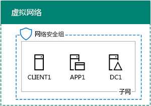
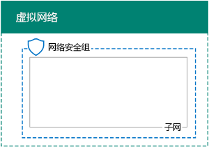
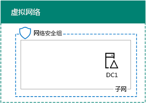
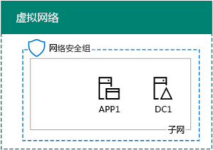

# <a name="base-configuration-devtest-environment"></a><span data-ttu-id="fa406-103">基础配置开发/测试环境</span><span class="sxs-lookup"><span data-stu-id="fa406-103">Base Configuration dev/test environment</span></span>

 <span data-ttu-id="fa406-104">**摘要：**作为 Microsoft Azure 中的开发/测试环境中创建简化的内联网。</span><span class="sxs-lookup"><span data-stu-id="fa406-104">**Summary:** Create a simplified intranet as a dev/test environment in Microsoft Azure.</span></span>
  
<span data-ttu-id="fa406-105">本文提供了在 Azure 中创建以下基础配置开发/测试环境的分步说明：</span><span class="sxs-lookup"><span data-stu-id="fa406-105">This article provides you with step-by-step instructions to create the following Base Configuration dev/test environment in Azure:</span></span>
  
<span data-ttu-id="fa406-106">**图 1： 基本配置开发/测试环境**</span><span class="sxs-lookup"><span data-stu-id="fa406-106">**Figure 1: The Base Configuration dev/test environment**</span></span>


  
<span data-ttu-id="fa406-p101">在图 1 中的基本配置开发/测试环境由仅云 Azure 虚拟网络命名测试实验室模拟简化、 专用内联网连接到 Internet 的企业网络子网组成。它包含三个 Azure 的虚拟机：</span><span class="sxs-lookup"><span data-stu-id="fa406-p101">The Base Configuration dev/test environment in Figure 1 consists of the Corpnet subnet in a cloud-only Azure virtual network named TestLab that simulates a simplified, private intranet connected to the Internet. It contains three Azure virtual machines:</span></span>
  
- <span data-ttu-id="fa406-110">DC1 被配置为一个内部网域控制器和域名系统 (DNS) 服务器</span><span class="sxs-lookup"><span data-stu-id="fa406-110">DC1 is configured as an intranet domain controller and Domain Name System (DNS) server</span></span>
    
- <span data-ttu-id="fa406-111">APP1 被配置为常规应用程序和 Web 服务器</span><span class="sxs-lookup"><span data-stu-id="fa406-111">APP1 is configured as a general application and web server</span></span>
    
- <span data-ttu-id="fa406-112">	CLIENT 1 用作内部网客户端</span><span class="sxs-lookup"><span data-stu-id="fa406-112">CLIENT1 acts as an intranet client</span></span>
    
<span data-ttu-id="fa406-113">这种配置使得 DC1、APP1、CLIENT 1 以及其他企业网络子网计算机得以： </span><span class="sxs-lookup"><span data-stu-id="fa406-113">This configuration allows DC1, APP1, CLIENT1, and additional Corpnet subnet computers to be:</span></span> 
  
- <span data-ttu-id="fa406-114">连接到 Internet 来安装更新程序，访问实时互联网资源，并且参与公有云技术，如 Microsoft Office 365 和其他 Azure 服务。</span><span class="sxs-lookup"><span data-stu-id="fa406-114">Connected to the Internet to install updates, access Internet resources in real time, and participate in public cloud technologies such as Microsoft Office 365 and other Azure services.</span></span>
    
- <span data-ttu-id="fa406-115">	使用连接至 Internet 或组织网络的计算机中的远程桌面连接进行远程管理。</span><span class="sxs-lookup"><span data-stu-id="fa406-115">Remotely managed using Remote Desktop connections from your computer that is connected to the Internet or your organization network.</span></span>
    
<span data-ttu-id="fa406-116">可以使用生成的测试环境：</span><span class="sxs-lookup"><span data-stu-id="fa406-116">You can use the resulting test environment:</span></span>
  
- <span data-ttu-id="fa406-117">用于应用程序开发和测试。</span><span class="sxs-lookup"><span data-stu-id="fa406-117">For application development and testing.</span></span>
    
- <span data-ttu-id="fa406-118">为自己设计一个长的测试环境的初始配置，包括附加的虚拟机、 Azure 服务或其他 Microsoft 云产品如 Office 365 和企业安全 + 移动 (EMS)。</span><span class="sxs-lookup"><span data-stu-id="fa406-118">As the initial configuration of an extended test environment of your own design that includes additional virtual machines, Azure services, or other Microsoft cloud offerings such as Office 365 and Enterprise Security + Mobility (EMS).</span></span>
    
<span data-ttu-id="fa406-119">在 Azure 中设置基本配置测试环境的四个阶段：</span><span class="sxs-lookup"><span data-stu-id="fa406-119">There are four phases to setting up the Base Configuration test environment in Azure:</span></span>
  
1. <span data-ttu-id="fa406-120">	创建虚拟网络。</span><span class="sxs-lookup"><span data-stu-id="fa406-120">Create the virtual network.</span></span>
    
2. <span data-ttu-id="fa406-121">	配置 DC1。</span><span class="sxs-lookup"><span data-stu-id="fa406-121">Configure DC1.</span></span>
    
3. <span data-ttu-id="fa406-122">	配置 APP1。</span><span class="sxs-lookup"><span data-stu-id="fa406-122">Configure APP1.</span></span>
    
4. <span data-ttu-id="fa406-123">	配置 CLIENT1。</span><span class="sxs-lookup"><span data-stu-id="fa406-123">Configure CLIENT1.</span></span>
    
<span data-ttu-id="fa406-p102">如果您已经没有 Azure 的订阅，您可以注册在[尝试 Azure](https://azure.microsoft.com/pricing/free-trial/)的免费试用版。如果您订阅了 MSDN 或 Visual Studio，请参见[为 Visual Studio 订户每月 Azure 信用](https://azure.microsoft.com/pricing/member-offers/msdn-benefits-details/)。</span><span class="sxs-lookup"><span data-stu-id="fa406-p102">If you do not already have an Azure subscription, you can sign up for a free trial at [Try Azure](https://azure.microsoft.com/pricing/free-trial/). If you have an MSDN or Visual Studio subscription, see [Monthly Azure credit for Visual Studio subscribers](https://azure.microsoft.com/pricing/member-offers/msdn-benefits-details/).</span></span>
  
> [!NOTE]
> <span data-ttu-id="fa406-p103">在 Azure 中的虚拟机运行时招来持续的货币成本。此成本记帐针对免费试用版，MSDN 订阅，或付款订购。运行虚拟机 Azure 的成本的详细信息，请参阅[虚拟机定价详细信息](https://azure.microsoft.com/pricing/details/virtual-machines/)和[Azure 定价计算器](https://azure.microsoft.com/pricing/calculator/)。为了降低成本，请参阅[测试环境在 Azure 中的虚拟机的成本降至最低](base-configuration-dev-test-environment.md#mincost)。</span><span class="sxs-lookup"><span data-stu-id="fa406-p103">Virtual machines in Azure incur an ongoing monetary cost when they are running. This cost is billed against your free trial, MSDN subscription, or paid subscription. For more information about the costs of running Azure virtual machines, see [Virtual Machines Pricing Details](https://azure.microsoft.com/pricing/details/virtual-machines/) and [Azure Pricing Calculator](https://azure.microsoft.com/pricing/calculator/). To keep costs down, see [Minimizing the costs of test environment virtual machines in Azure](base-configuration-dev-test-environment.md#mincost).</span></span> 
  

  
> [!TIP]
> <span data-ttu-id="fa406-131">单击[此处](http://aka.ms/catlgstack)为可视化映射到一个 Microsoft 云测试实验室指南堆栈中的所有项目。</span><span class="sxs-lookup"><span data-stu-id="fa406-131">Click [here](http://aka.ms/catlgstack) for a visual map to all the articles in the One Microsoft Cloud Test Lab Guide stack.</span></span>
  
## <a name="phase-1-create-the-virtual-network"></a><span data-ttu-id="fa406-132">第 1 阶段：创建虚拟网络</span><span class="sxs-lookup"><span data-stu-id="fa406-132">Phase 1: Create the virtual network</span></span>

<span data-ttu-id="fa406-133">首先，从 Azure PowerShell 提示符开始。</span><span class="sxs-lookup"><span data-stu-id="fa406-133">First, start an Azure PowerShell prompt.</span></span>
  
> [!NOTE]
> <span data-ttu-id="fa406-p104">下面的命令设置使用 Azure PowerShell 的最新版本。请参阅[开始使用 Azure PowerShell cmdlet](https://docs.microsoft.com/en-us/powershell/azureps-cmdlets-docs/)。</span><span class="sxs-lookup"><span data-stu-id="fa406-p104">The following command sets use the latest version of Azure PowerShell. See [Get started with Azure PowerShell cmdlets](https://docs.microsoft.com/en-us/powershell/azureps-cmdlets-docs/).</span></span> 
  
<span data-ttu-id="fa406-136">使用以下命令登录 Azure 帐户。</span><span class="sxs-lookup"><span data-stu-id="fa406-136">Sign in to your Azure account with the following command.</span></span>
  
```
Login-AzureRMAccount
```

> [!TIP]
> <span data-ttu-id="fa406-137">单击[此处](https://gallery.technet.microsoft.com/PowerShell-commands-for-ba957d3d)以获取包含本文中的所有 PowerShell 命令的文本文件。</span><span class="sxs-lookup"><span data-stu-id="fa406-137">Click [here](https://gallery.technet.microsoft.com/PowerShell-commands-for-ba957d3d) to get a text file that contains all the PowerShell commands in this article.</span></span>
  
<span data-ttu-id="fa406-138">使用以下命令获得订阅名称。</span><span class="sxs-lookup"><span data-stu-id="fa406-138">Get your subscription name using the following command.</span></span>
  
```
Get-AzureRMSubscription | Sort Name | Select Name
```

<span data-ttu-id="fa406-p105">设置 Azure 订阅。使用正确的名称替换引号内的所有内容（包括 < 和 > 字符）。</span><span class="sxs-lookup"><span data-stu-id="fa406-p105">Set your Azure subscription. Replace everything within the quotes, including the < and > characters, with the correct name.</span></span>
  
```
$subscr="<subscription name>"
Get-AzureRmSubscription -SubscriptionName $subscr | Select-AzureRmSubscription
```

<span data-ttu-id="fa406-p106">接下来，为基础配置测试实验室创建一个新的资源组。要确定一个唯一的资源组名称，请使用此命令列出现有的资源组。</span><span class="sxs-lookup"><span data-stu-id="fa406-p106">Next, create a new resource group for your Base Configuration test lab. To determine a unique resource group name, use this command to list your existing resource groups.</span></span>
  
```
Get-AzureRMResourceGroup | Sort ResourceGroupName | Select ResourceGroupName
```

<span data-ttu-id="fa406-p107">使用这些命令创建新的资源组。使用正确的名称替换引号内的所有内容（包括 < 和 > 字符）。</span><span class="sxs-lookup"><span data-stu-id="fa406-p107">Create your new resource group with these commands. Replace everything within the quotes, including the < and > characters, with the correct names.</span></span>
  
```
$rgName="<resource group name>"
$locName="<location name, such as West US>"
New-AzureRMResourceGroup -Name $rgName -Location $locName
```

<span data-ttu-id="fa406-145">接下来，创建 TestLab 虚拟网络，它将托管基础配置的企业网络子网并通过网络安全组对其进行保护。</span><span class="sxs-lookup"><span data-stu-id="fa406-145">Next, you create the TestLab virtual network that will host the Corpnet subnet of the base configuration and protect it with a network security group.</span></span>
  
```
$rgName="<name of your new resource group>"
$locName=(Get-AzureRmResourceGroup -Name $rgName).Location
$corpnetSubnet=New-AzureRMVirtualNetworkSubnetConfig -Name Corpnet -AddressPrefix 10.0.0.0/24
New-AzureRMVirtualNetwork -Name TestLab -ResourceGroupName $rgName -Location $locName -AddressPrefix 10.0.0.0/8 -Subnet $corpnetSubnet -DNSServer 10.0.0.4
$rule1=New-AzureRMNetworkSecurityRuleConfig -Name "RDPTraffic" -Description "Allow RDP to all VMs on the subnet" -Access Allow -Protocol Tcp -Direction Inbound -Priority 100 -SourceAddressPrefix Internet -SourcePortRange * -DestinationAddressPrefix * -DestinationPortRange 3389
New-AzureRMNetworkSecurityGroup -Name Corpnet -ResourceGroupName $rgName -Location $locName -SecurityRules $rule1
$vnet=Get-AzureRMVirtualNetwork -ResourceGroupName $rgName -Name TestLab
$nsg=Get-AzureRMNetworkSecurityGroup -Name Corpnet -ResourceGroupName $rgName
Set-AzureRMVirtualNetworkSubnetConfig -VirtualNetwork $vnet -Name Corpnet -AddressPrefix "10.0.0.0/24" -NetworkSecurityGroup $nsg
```

<span data-ttu-id="fa406-146">这是你的当前配置。</span><span class="sxs-lookup"><span data-stu-id="fa406-146">This is your current configuration.</span></span>
  

  
## <a name="phase-2-configure-dc1"></a><span data-ttu-id="fa406-148">第 2 阶段：配置 DC1</span><span class="sxs-lookup"><span data-stu-id="fa406-148">Phase 2: Configure DC1</span></span>

<span data-ttu-id="fa406-149">在此阶段，我们需要创建 DC1 虚拟机，并将它配置为 corp.contoso.com Windows Server Active Directory (AD) 域的域控制器，并配置为 TestLab 虚拟网络中虚拟机的 DNS 服务器。</span><span class="sxs-lookup"><span data-stu-id="fa406-149">In this phase, we create the DC1 virtual machine and configure it as a domain controller for the corp.contoso.com Windows Server Active Directory (AD) domain and a DNS server for the virtual machines of the TestLab virtual network.</span></span>
  
<span data-ttu-id="fa406-150">要为 DC1 创建 Azure 的虚拟机，请填入您的资源组并在 Azure PowerShell 命令提示符下运行这些命令，您的本地计算机上。</span><span class="sxs-lookup"><span data-stu-id="fa406-150">To create an Azure virtual machine for DC1, fill in the name of your resource group and run these commands at the Azure PowerShell command prompt on your local computer.</span></span>
  
```
$rgName="<resource group name>"
$locName=(Get-AzureRmResourceGroup -Name $rgName).Location
$vnet=Get-AzureRMVirtualNetwork -Name TestLab -ResourceGroupName $rgName
$pip=New-AzureRMPublicIpAddress -Name DC1-PIP -ResourceGroupName $rgName -Location $locName -AllocationMethod Dynamic
$nic=New-AzureRMNetworkInterface -Name DC1-NIC -ResourceGroupName $rgName -Location $locName -SubnetId $vnet.Subnets[0].Id -PublicIpAddressId $pip.Id -PrivateIpAddress 10.0.0.4
$vm=New-AzureRMVMConfig -VMName DC1 -VMSize Standard_A1
$cred=Get-Credential -Message "Type the name and password of the local administrator account for DC1."
$vm=Set-AzureRMVMOperatingSystem -VM $vm -Windows -ComputerName DC1 -Credential $cred -ProvisionVMAgent -EnableAutoUpdate
$vm=Set-AzureRMVMSourceImage -VM $vm -PublisherName MicrosoftWindowsServer -Offer WindowsServer -Skus 2016-Datacenter -Version "latest"
$vm=Add-AzureRMVMNetworkInterface -VM $vm -Id $nic.Id
$vm=Set-AzureRmVMOSDisk -VM $vm -Name "DC1-OS" -DiskSizeInGB 128 -CreateOption FromImage -StorageAccountType "StandardLRS"
$diskConfig=New-AzureRmDiskConfig -AccountType "StandardLRS" -Location $locName -CreateOption Empty -DiskSizeGB 20
$dataDisk1=New-AzureRmDisk -DiskName "DC1-DataDisk1" -Disk $diskConfig -ResourceGroupName $rgName
$vm=Add-AzureRmVMDataDisk -VM $vm -Name "DC1-DataDisk1" -CreateOption Attach -ManagedDiskId $dataDisk1.Id -Lun 1
New-AzureRMVM -ResourceGroupName $rgName -Location $locName -VM $vm
```

<span data-ttu-id="fa406-p108">系统将提示你为 DC1 上的本地管理员帐户输入用户名和密码。使用强密码，并在安全位置记录名称和密码。</span><span class="sxs-lookup"><span data-stu-id="fa406-p108">You will be prompted for a user name and password for the local administrator account on DC1. Use a strong password and record both the name and password in a secure location.</span></span>
  
<span data-ttu-id="fa406-153">接下来，连接到 DC1 虚拟机。</span><span class="sxs-lookup"><span data-stu-id="fa406-153">Next, connect to the DC1 virtual machine.</span></span>
  
### <a name="connect-to-dc1-using-local-administrator-account-credentials"></a><span data-ttu-id="fa406-154">使用本地管理员帐户凭据连接到 DC1。</span><span class="sxs-lookup"><span data-stu-id="fa406-154">Connect to DC1 using local administrator account credentials</span></span>

1. <span data-ttu-id="fa406-155">在[Azure 门户](https://portal.azure.com)，单击**资源组 >** [新的资源组的名称] **> DC1 > 连接**。</span><span class="sxs-lookup"><span data-stu-id="fa406-155">In the [Azure portal](https://portal.azure.com), click **Resource Groups >** [the name of your new resource group] **> DC1 > Connect**.</span></span>
    
2. <span data-ttu-id="fa406-156">打开已下载的 DC1.rdp 文件，然后单击**连接**。</span><span class="sxs-lookup"><span data-stu-id="fa406-156">Open the DC1.rdp file that is downloaded, and then click **Connect**.</span></span>
    
3. <span data-ttu-id="fa406-157">指定 DC1 本地管理员帐户名称：</span><span class="sxs-lookup"><span data-stu-id="fa406-157">Specify the DC1 local administrator account name:</span></span>
    
  - <span data-ttu-id="fa406-158">对于 Windows 7：</span><span class="sxs-lookup"><span data-stu-id="fa406-158">For Windows 7:</span></span>
    
    <span data-ttu-id="fa406-p109">在**Windows 安全**对话框中，单击**使用另一个帐户**。在**用户名称**中键入**DC1\\**[本地管理员帐户名称]。</span><span class="sxs-lookup"><span data-stu-id="fa406-p109">In the **Windows Security** dialog box, click **Use another account**. In **User name**, type **DC1\\**[Local administrator account name].</span></span>
    
  - <span data-ttu-id="fa406-161">对于 Windows 8 或 Windows 10：</span><span class="sxs-lookup"><span data-stu-id="fa406-161">For Windows 8 or Windows 10:</span></span>
    
    <span data-ttu-id="fa406-p110">在**Windows 安全**对话框中，单击**更多的选择**，，然后单击**使用不同的帐户**。在**用户名称**中键入**DC1\\**[本地管理员帐户名称]。</span><span class="sxs-lookup"><span data-stu-id="fa406-p110">In the **Windows Security** dialog box, click **More choices**, and then click **Use a different account**. In **User name**, type **DC1\\**[Local administrator account name].</span></span>
    
4. <span data-ttu-id="fa406-164">在**密码**框中，键入本地管理员帐户的密码，然后单击**确定**。</span><span class="sxs-lookup"><span data-stu-id="fa406-164">In **Password**, type the password of the local administrator account, and then click **OK**.</span></span>
    
5. <span data-ttu-id="fa406-165">出现提示时，请单击**是**。</span><span class="sxs-lookup"><span data-stu-id="fa406-165">When prompted, click **Yes**.</span></span>
    
<span data-ttu-id="fa406-166">接下来，添加额外的数据磁盘作为新卷驱动器号 f： 使用此命令在 DC1 上的 Windows PowerShell 命令提示符管理员级别。</span><span class="sxs-lookup"><span data-stu-id="fa406-166">Next, add an extra data disk as a new volume with the drive letter F: with this command at an administrator-level Windows PowerShell command prompt on DC1.</span></span>
  
```
Get-Disk | Where PartitionStyle -eq "RAW" | Initialize-Disk -PartitionStyle MBR -PassThru | New-Partition -AssignDriveLetter -UseMaximumSize | Format-Volume -FileSystem NTFS -NewFileSystemLabel "WSAD Data"
```

<span data-ttu-id="fa406-p111">接下来，将 DC1 配置为 corp.contoso.com 域的域控制器和 DNS 服务器。在管理员级别 Windows PowerShell 命令提示符中，运行这些命令。</span><span class="sxs-lookup"><span data-stu-id="fa406-p111">Next, configure DC1 as a domain controller and DNS server for the corp.contoso.com domain. Run these commands at an administrator-level Windows PowerShell command prompt.</span></span>
  
```
Install-WindowsFeature AD-Domain-Services -IncludeManagementTools
Install-ADDSForest -DomainName corp.contoso.com -DatabasePath "F:\NTDS" -SysvolPath "F:\SYSVOL" -LogPath "F:\Logs"
```

<span data-ttu-id="fa406-p112">需指定安全模式管理员密码。在安全的位置存储该密码。</span><span class="sxs-lookup"><span data-stu-id="fa406-p112">You will need to specify a safe mode administrator password. Store this password in a secure location.</span></span>
  
<span data-ttu-id="fa406-171">请注意，这些命令可能会花几分钟才能完成。</span><span class="sxs-lookup"><span data-stu-id="fa406-171">Note that these commands can take a few minutes to complete.</span></span>
  
<span data-ttu-id="fa406-172">DC1 重启后，重新连接到 DC1 虚拟机。</span><span class="sxs-lookup"><span data-stu-id="fa406-172">After DC1 restarts, reconnect to the DC1 virtual machine.</span></span>
  
### <a name="connect-to-dc1-using-domain-credentials"></a><span data-ttu-id="fa406-173">使用域凭据连接到 DC1</span><span class="sxs-lookup"><span data-stu-id="fa406-173">Connect to DC1 using domain credentials</span></span>

1. <span data-ttu-id="fa406-174">在[Azure 门户](https://portal.azure.com)，单击**资源组 >** [资源组名称] **> DC1 > 连接**。</span><span class="sxs-lookup"><span data-stu-id="fa406-174">In the [Azure portal](https://portal.azure.com), click **Resource Groups >** [your resource group name] **> DC1 > Connect**.</span></span>
    
2. <span data-ttu-id="fa406-175">运行已下载的 DC1.rdp 文件，然后单击**连接**。</span><span class="sxs-lookup"><span data-stu-id="fa406-175">Run the DC1.rdp file that is downloaded, and then click **Connect**.</span></span>
    
3. <span data-ttu-id="fa406-p113">在**Windows 安全**中，单击**使用其他帐户**。在**用户名称**中键入**CORP\\**[本地管理员帐户名称]。</span><span class="sxs-lookup"><span data-stu-id="fa406-p113">In **Windows Security**, click **Use another account**. In **User name**, type **CORP\\**[Local administrator account name].</span></span>
    
4. <span data-ttu-id="fa406-178">在**密码**框中，键入本地管理员帐户的密码，然后单击**确定**。</span><span class="sxs-lookup"><span data-stu-id="fa406-178">In **Password**, type the password of the local administrator account, and then click **OK**.</span></span>
    
5. <span data-ttu-id="fa406-179">出现提示时，请单击**是**。</span><span class="sxs-lookup"><span data-stu-id="fa406-179">When prompted, click **Yes**.</span></span>
    
<span data-ttu-id="fa406-p114">接下来，在 Active Directory 中创建一个用户帐户，将使用该帐户登录到 CORP 域成员计算机。在管理员级别 Windows PowerShell 命令提示符中，运行此命令。</span><span class="sxs-lookup"><span data-stu-id="fa406-p114">Next, create a user account in Active Directory that will be used when logging in to CORP domain member computers. Run this command at an administrator-level Windows PowerShell command prompt.</span></span>
  
```
New-ADUser -SamAccountName User1 -AccountPassword (read-host "Set user password" -assecurestring) -name "User1" -enabled $true -PasswordNeverExpires $true -ChangePasswordAtLogon $false
```

<span data-ttu-id="fa406-p115">请注意，此命令会提示你提供用户 1 帐户密码。由于此帐户将用于所有 CORP 域成员计算机的远程桌面连接，请选择强密码。记录 User1 帐户密码并将其存储在安全位置。</span><span class="sxs-lookup"><span data-stu-id="fa406-p115">Note that this command prompts you to supply the User1 account password. Because this account will be used for remote desktop connections for all CORP domain member computers, choose a strong password. Record the User1 account password and store it in a secured location.</span></span>
  
<span data-ttu-id="fa406-p116">接下来，配置新的 User1 帐户作为企业管理员。在管理员级别 Windows PowerShell 命令提示符中，运行此命令。</span><span class="sxs-lookup"><span data-stu-id="fa406-p116">Next, configure the new User1 account as an Enterprise Administrator. Run this command at the administrator-level Windows PowerShell command prompt.</span></span>
  
```
Add-ADPrincipalGroupMembership -Identity "CN=User1,CN=Users,DC=corp,DC=contoso,DC=com" -MemberOf "CN=Enterprise Admins,CN=Users,DC=corp,DC=contoso,DC=com","CN=Domain Admins,CN=Users,DC=corp,DC=contoso,DC=com","CN=Schema Admins,CN=Users,DC=corp,DC=contoso,DC=com"
```

<span data-ttu-id="fa406-187">关闭与 DC1 的远程桌面会话，然后重新连接使用 CORP\\User1 帐户。</span><span class="sxs-lookup"><span data-stu-id="fa406-187">Close the Remote Desktop session with DC1 and then reconnect using the CORP\\User1 account.</span></span>
  
<span data-ttu-id="fa406-188">接下来，若要允许 Ping 工具使用流量，请在管理员级别 Windows PowerShell 命令提示符中，运行此命令。</span><span class="sxs-lookup"><span data-stu-id="fa406-188">Next, to allow traffic for the Ping tool, run this command at an administrator-level Windows PowerShell command prompt.</span></span>
  
```
Set-NetFirewallRule -DisplayName "File and Printer Sharing (Echo Request - ICMPv4-In)" -enabled True
```

<span data-ttu-id="fa406-189">这是你的当前配置。</span><span class="sxs-lookup"><span data-stu-id="fa406-189">This is your current configuration.</span></span>
  

  
## <a name="phase-3-configure-app1"></a><span data-ttu-id="fa406-191">第 3 阶段：配置 APP1</span><span class="sxs-lookup"><span data-stu-id="fa406-191">Phase 3: Configure APP1</span></span>

<span data-ttu-id="fa406-192">APP1 提供 Web 和文件共享服务。</span><span class="sxs-lookup"><span data-stu-id="fa406-192">APP1 provides web and file sharing services.</span></span>
  
<span data-ttu-id="fa406-193">若要创建 APP1 Azure 的虚拟机，填入您的资源组，Azure PowerShell 命令提示符下运行这些命令，您的本地计算机上。</span><span class="sxs-lookup"><span data-stu-id="fa406-193">To create an Azure Virtual Machine for APP1, fill in the name of your resource group and run these commands at the Azure PowerShell command prompt on your local computer.</span></span>
  
```
$rgName="<resource group name>"
$locName=(Get-AzureRmResourceGroup -Name $rgName).Location
$vnet=Get-AzureRMVirtualNetwork -Name TestLab -ResourceGroupName $rgName
$pip=New-AzureRMPublicIpAddress -Name APP1-PIP -ResourceGroupName $rgName -Location $locName -AllocationMethod Dynamic
$nic=New-AzureRMNetworkInterface -Name APP1-NIC -ResourceGroupName $rgName -Location $locName -SubnetId $vnet.Subnets[0].Id -PublicIpAddressId $pip.Id
$vm=New-AzureRMVMConfig -VMName APP1 -VMSize Standard_A1
$cred=Get-Credential -Message "Type the name and password of the local administrator account for APP1."
$vm=Set-AzureRMVMOperatingSystem -VM $vm -Windows -ComputerName APP1 -Credential $cred -ProvisionVMAgent -EnableAutoUpdate
$vm=Set-AzureRMVMSourceImage -VM $vm -PublisherName MicrosoftWindowsServer -Offer WindowsServer -Skus 2016-Datacenter -Version "latest"
$vm=Add-AzureRMVMNetworkInterface -VM $vm -Id $nic.Id
$vm=Set-AzureRmVMOSDisk -VM $vm -Name "APP1-OS" -DiskSizeInGB 128 -CreateOption FromImage -StorageAccountType "StandardLRS"
New-AzureRMVM -ResourceGroupName $rgName -Location $locName -VM $vm
```

<span data-ttu-id="fa406-194">接下来，使用 APP1 本地管理员帐户名称和密码连接到 APP1 虚拟机，然后打开 Windows PowerShell 命令提示符。</span><span class="sxs-lookup"><span data-stu-id="fa406-194">Next, connect to the APP1 virtual machine using the APP1 local administrator account name and password, and then open a Windows PowerShell command prompt.</span></span>
  
<span data-ttu-id="fa406-195">若要检查 APP1 和 DC1 之间的名称解析和网络通信，请运行**ping dc1.corp.contoso.com**命令，验证存在四个答复。</span><span class="sxs-lookup"><span data-stu-id="fa406-195">To check name resolution and network communication between APP1 and DC1, run the **ping dc1.corp.contoso.com** command and verify that there are four replies.</span></span>
  
<span data-ttu-id="fa406-196">接下来，通过 Windows PowerShell 提示符下的这些命令将 APP1 虚拟机加入 CORP 域。</span><span class="sxs-lookup"><span data-stu-id="fa406-196">Next, join the APP1 virtual machine to the CORP domain with these commands at the Windows PowerShell prompt.</span></span>
  
```
Add-Computer -DomainName corp.contoso.com
Restart-Computer
```

<span data-ttu-id="fa406-197">请注意，您必须提供 CORP\\User1 域帐户凭据后运行**添加计算机**命令。</span><span class="sxs-lookup"><span data-stu-id="fa406-197">Note that you must supply the CORP\\User1 domain account credentials after running the **Add-Computer** command.</span></span>
  
<span data-ttu-id="fa406-198">App1 发出重新启动后，连接到该公司\\User1 帐户，然后打开管理员级 Windows PowerShell 命令提示符。</span><span class="sxs-lookup"><span data-stu-id="fa406-198">After APP1 restarts, connect to it using the CORP\\User1 account, and then open an administrator-level Windows PowerShell command prompt.</span></span>
  
<span data-ttu-id="fa406-199">下一步，使用此命令在 APP1 的 Windows PowerShell 命令提示符处将 APP1 设置为 Web 服务器。</span><span class="sxs-lookup"><span data-stu-id="fa406-199">Next, make APP1 a web server with this command at the Windows PowerShell command prompt on APP1.</span></span>
  
```
Install-WindowsFeature Web-WebServer -IncludeManagementTools
```

<span data-ttu-id="fa406-200">下一步，使用这些 PowerShell 命令在 APP1 的文件夹中创建一个共享文件夹和文本文件。</span><span class="sxs-lookup"><span data-stu-id="fa406-200">Next, create a shared folder and a text file within the folder on APP1 with these PowerShell commands.</span></span>
  
```
New-Item -path c:\files -type directory
Write-Output "This is a shared file." | out-file c:\files\example.txt
New-SmbShare -name files -path c:\files -changeaccess CORP\User1
```

<span data-ttu-id="fa406-201">这是你的当前配置。</span><span class="sxs-lookup"><span data-stu-id="fa406-201">This is your current configuration.</span></span>
  

  
## <a name="phase-4-configure-client1"></a><span data-ttu-id="fa406-203">第 4 阶段：配置 CLIENT1</span><span class="sxs-lookup"><span data-stu-id="fa406-203">Phase 4: Configure CLIENT1</span></span>

<span data-ttu-id="fa406-204">CLIENT 1 可在 Contoso 内部网上充当典型的笔记本电脑、平板电脑或台式计算机。</span><span class="sxs-lookup"><span data-stu-id="fa406-204">CLIENT1 acts as a typical laptop, tablet, or desktop computer on the Contoso intranet.</span></span>
  
<span data-ttu-id="fa406-205">若要创建的客户端 1 Azure 的虚拟机，填充您的资源组的名称和在 Azure PowerShell 命令提示符下运行这些命令，您的本地计算机上。</span><span class="sxs-lookup"><span data-stu-id="fa406-205">To create an Azure Virtual Machine for CLIENT1, fill in the name of your resource group and run these commands at the Azure PowerShell command prompt on your local computer.</span></span>
  
```
$rgName="<resource group name>"
$locName=(Get-AzureRmResourceGroup -Name $rgName).Location
$vnet=Get-AzureRMVirtualNetwork -Name TestLab -ResourceGroupName $rgName
$pip=New-AzureRMPublicIpAddress -Name CLIENT1-PIP -ResourceGroupName $rgName -Location $locName -AllocationMethod Dynamic
$nic=New-AzureRMNetworkInterface -Name CLIENT1-NIC -ResourceGroupName $rgName -Location $locName -SubnetId $vnet.Subnets[0].Id -PublicIpAddressId $pip.Id
$vm=New-AzureRMVMConfig -VMName CLIENT1 -VMSize Standard_A1
$cred=Get-Credential -Message "Type the name and password of the local administrator account for CLIENT1."
$vm=Set-AzureRMVMOperatingSystem -VM $vm -Windows -ComputerName CLIENT1 -Credential $cred -ProvisionVMAgent -EnableAutoUpdate
$vm=Set-AzureRMVMSourceImage -VM $vm -PublisherName MicrosoftWindowsDesktop -Offer Windows-10 -Skus RS3-Pro -Version "latest"
$vm=Add-AzureRMVMNetworkInterface -VM $vm -Id $nic.Id
$vm=Set-AzureRmVMOSDisk -VM $vm -Name "CLIENT1-OS" -DiskSizeInGB 128 -CreateOption FromImage -StorageAccountType "StandardLRS"
New-AzureRMVM -ResourceGroupName $rgName -Location $locName -VM $vm
```

<span data-ttu-id="fa406-206">接下来，使用 CLIENT1 本地管理员帐户名称和密码连接到 CLIENT1 虚拟机，然后打开管理员级别 Windows PowerShell 命令提示符。</span><span class="sxs-lookup"><span data-stu-id="fa406-206">Next, connect to the CLIENT1 virtual machine using the CLIENT1 local administrator account name and password, and then open an administrator-level Windows PowerShell command prompt.</span></span>
  
<span data-ttu-id="fa406-207">要检查 CLIENT1 DC1 之间的名称解析和网络通信，请在 Windows PowerShell 命令提示符运行**ping dc1.corp.contoso.com**命令并验证存在四个答复。</span><span class="sxs-lookup"><span data-stu-id="fa406-207">To check name resolution and network communication between CLIENT1 and DC1, run the **ping dc1.corp.contoso.com** command at a Windows PowerShell command prompt and verify that there are four replies.</span></span>
  
<span data-ttu-id="fa406-208">接下来，通过 Windows PowerShell 提示符下的这些命令将 CLIENT1 虚拟机加入 CORP 域。</span><span class="sxs-lookup"><span data-stu-id="fa406-208">Next, join the CLIENT1 virtual machine to the CORP domain with these commands at the Windows PowerShell prompt.</span></span>
  
```
Add-Computer -DomainName corp.contoso.com
Restart-Computer
```

<span data-ttu-id="fa406-209">请注意，您必须提供您公司\\User1 域帐户凭据后运行**添加计算机**命令。</span><span class="sxs-lookup"><span data-stu-id="fa406-209">Note that you must supply your CORP\\User1 domain account credentials after running the **Add-Computer** command.</span></span>
  
<span data-ttu-id="fa406-210">客户端 1 重新启动后，连接到该公司\\User1 帐户名称和密码，然后再打开管理员级别的 Windows PowerShell 命令提示符。</span><span class="sxs-lookup"><span data-stu-id="fa406-210">After CLIENT1 restarts, connect to it using the CORP\\User1 account name and password, and then open an administrator-level Windows PowerShell command prompt.</span></span>
  
<span data-ttu-id="fa406-211">接下来，验证是否可以从 CLIENT1 访问 APP1 上的 Web 和文件共享资源。</span><span class="sxs-lookup"><span data-stu-id="fa406-211">Next, verify that you can access web and file share resources on APP1 from CLIENT1.</span></span>
  
### <a name="verify-client-access-to-app1"></a><span data-ttu-id="fa406-212">验证 CLIENT 是否可以访问 APP1</span><span class="sxs-lookup"><span data-stu-id="fa406-212">Verify CLIENT access to APP1</span></span>

1. <span data-ttu-id="fa406-213">在服务器管理器中，在树窗格中，单击**本地服务器**命令。</span><span class="sxs-lookup"><span data-stu-id="fa406-213">In Server Manager, in the tree pane, click **Local Server**.</span></span>
    
2. <span data-ttu-id="fa406-214">在**客户端 1 的属性**中，单击**在**旁边**IE 增强的安全配置**。</span><span class="sxs-lookup"><span data-stu-id="fa406-214">In **Properties for CLIENT1**, click **On** next to **IE Enhanced Security Configuration**.</span></span>
    
3. <span data-ttu-id="fa406-215">在**Internet Explorer 增强的安全配置**，**管理员**和**用户**，单击**关闭**，然后单击**确定**。</span><span class="sxs-lookup"><span data-stu-id="fa406-215">In **Internet Explorer Enhanced Security Configuration**, click **Off** for **Administrators** and **Users**, and then click **OK**.</span></span>
    
4. <span data-ttu-id="fa406-216">从开始屏幕中，单击**Internet Explorer**，，然后单击**确定**。</span><span class="sxs-lookup"><span data-stu-id="fa406-216">From the Start screen, click **Internet Explorer**, and then click **OK**.</span></span>
    
5. <span data-ttu-id="fa406-p117">在地址栏中，键入**http://app1.corp.contoso.com/**，然后按 enter 键。您应该看到 APP1 默认 Internet Information Services 网页。</span><span class="sxs-lookup"><span data-stu-id="fa406-p117">In the Address bar, type **http://app1.corp.contoso.com/**, and then press ENTER. You should see the default Internet Information Services web page for APP1.</span></span>
    
6. <span data-ttu-id="fa406-219">从桌面任务栏中，单击文件资源管理器图标。</span><span class="sxs-lookup"><span data-stu-id="fa406-219">From the desktop taskbar, click the File Explorer icon.</span></span>
    
7. <span data-ttu-id="fa406-p118">在地址栏中，键入**\\ \\app1\\文件**，然后按 enter 键。您会看到文件的共享文件夹中的内容的文件夹窗口。</span><span class="sxs-lookup"><span data-stu-id="fa406-p118">In the address bar, type **\\\\app1\\Files**, and then press ENTER. You should see a folder window with the contents of the Files shared folder.</span></span>
    
8. <span data-ttu-id="fa406-p119">在**文件**共享的文件夹窗口中，双击**Example.txt**文件。您应该看到 Example.txt 文件的内容。</span><span class="sxs-lookup"><span data-stu-id="fa406-p119">In the **Files** shared folder window, double-click the **Example.txt** file. You should see the contents of the Example.txt file.</span></span>
    
9. <span data-ttu-id="fa406-224">**Example.txt-记事本**和共享**文件**文件夹窗口关闭。</span><span class="sxs-lookup"><span data-stu-id="fa406-224">Close the **example.txt - Notepad** and the **Files** shared folder windows.</span></span>
    
<span data-ttu-id="fa406-225">这就是你的最终配置。</span><span class="sxs-lookup"><span data-stu-id="fa406-225">This is your final configuration.</span></span>
  

  
<span data-ttu-id="fa406-227">Azure 中的基本配置现在已准备就绪，可用于应用程序开发和测试或用于构建其他测试环境。</span><span class="sxs-lookup"><span data-stu-id="fa406-227">Your Base Configuration in Azure is now ready for application development and testing or for building additional test environments.</span></span> 
  
> [!TIP]
> <span data-ttu-id="fa406-228">单击[此处](http://aka.ms/catlgstack)可直观映射到 One Microsoft 云测试实验室指南堆栈中的所有文章。</span><span class="sxs-lookup"><span data-stu-id="fa406-228">Click [here](http://aka.ms/catlgstack) for a visual map to all of the articles in the One Microsoft Cloud Test Lab Guide stack.</span></span>
  
<span data-ttu-id="fa406-229"><a name="mincost"> </a></span><span class="sxs-lookup"><span data-stu-id="fa406-229"></span></span>
## <a name="minimizing-the-costs-of-test-environment-virtual-machines-in-azure"></a><span data-ttu-id="fa406-230">将 Azure 中的测试环境虚拟机成本降至最低</span><span class="sxs-lookup"><span data-stu-id="fa406-230">Minimizing the costs of test environment virtual machines in Azure</span></span>

<span data-ttu-id="fa406-231">若要将运行测试环境虚拟机的成本降至最低，可以执行以下任一操作：</span><span class="sxs-lookup"><span data-stu-id="fa406-231">To minimize the cost of running the test environment virtual machines, you can do one of the following:</span></span>
  
- <span data-ttu-id="fa406-p120">创建测试环境，并尽快执行所需的测试和演示。完成后，删除测试环境的资源组。</span><span class="sxs-lookup"><span data-stu-id="fa406-p120">Create the test environment and perform your needed testing and demonstration as quickly as possible. When complete, delete the resource group for the test environment.</span></span>
    
- <span data-ttu-id="fa406-234">	关闭测试环境虚拟机，进入已取消分配状态。</span><span class="sxs-lookup"><span data-stu-id="fa406-234">Shut down your test environment virtual machines into a deallocated state.</span></span>
    
<span data-ttu-id="fa406-235">若要使用 Azure PowerShell 关闭虚拟机，请填写资源组名称并运行这些命令。</span><span class="sxs-lookup"><span data-stu-id="fa406-235">To shut down the virtual machines with Azure PowerShell, fill in the resource group name and run these commands.</span></span>
  
```
$rgName="<your resource group name>"
Stop-AzureRMVM -ResourceGroupName $rgName -Name "CLIENT1" -Force
Stop-AzureRMVM -ResourceGroupName $rgName -Name "APP1" -Force
Stop-AzureRMVM -ResourceGroupName $rgName -Name "DC1" -Force
```

<span data-ttu-id="fa406-236">若要确保所有虚拟机在从停止（已取消分配）状态启动时可以正常工作，则应按以下顺序进行启动：</span><span class="sxs-lookup"><span data-stu-id="fa406-236">To ensure that your virtual machines work properly when starting all of them from the Stopped (Deallocated) state, you should start them in the following order:</span></span>
  
1. <span data-ttu-id="fa406-237">DC1</span><span class="sxs-lookup"><span data-stu-id="fa406-237">DC1</span></span>
2. <span data-ttu-id="fa406-238">APP1</span><span class="sxs-lookup"><span data-stu-id="fa406-238">APP1</span></span>
3. <span data-ttu-id="fa406-239">客户端 1</span><span class="sxs-lookup"><span data-stu-id="fa406-239">CLIENT1</span></span>
    
<span data-ttu-id="fa406-240">若要使用 Azure PowerShell 按顺序启动虚拟机，请填写资源组名称并运行这些命令。</span><span class="sxs-lookup"><span data-stu-id="fa406-240">To start the virtual machines in order with Azure PowerShell, fill in the resource group name and run these commands.</span></span>
  
```
$rgName="<your resource group name>"
Start-AzureRMVM -ResourceGroupName $rgName -Name "DC1"
Start-AzureRMVM -ResourceGroupName $rgName -Name "APP1"
Start-AzureRMVM -ResourceGroupName $rgName -Name "CLIENT1"
```

## <a name="see-also"></a><span data-ttu-id="fa406-241">另请参阅</span><span class="sxs-lookup"><span data-stu-id="fa406-241">See Also</span></span>

- [<span data-ttu-id="fa406-242">Office 365 开发/测试环境</span><span class="sxs-lookup"><span data-stu-id="fa406-242">Office 365 dev/test environment</span></span>](office-365-dev-test-environment.md)
- [<span data-ttu-id="fa406-243">用于 Office 365 开发/测试环境的 DirSync</span><span class="sxs-lookup"><span data-stu-id="fa406-243">DirSync for your Office 365 dev/test environment</span></span>](dirsync-for-your-office-365-dev-test-environment.md)
- [<span data-ttu-id="fa406-244">Office 365 开发/测试环境的云应用程序安全性</span><span class="sxs-lookup"><span data-stu-id="fa406-244">Cloud App Security for your Office 365 dev/test environment</span></span>](cloud-app-security-for-your-office-365-dev-test-environment.md)
- [<span data-ttu-id="fa406-245">为您的 Office 365 开发/测试环境高级威胁防护</span><span class="sxs-lookup"><span data-stu-id="fa406-245">Advanced Threat Protection for your Office 365 dev/test environment</span></span>](advanced-threat-protection-for-your-office-365-dev-test-environment.md)
- [<span data-ttu-id="fa406-246">云应用和混合解决方案</span><span class="sxs-lookup"><span data-stu-id="fa406-246">Cloud adoption and hybrid solutions</span></span>](cloud-adoption-and-hybrid-solutions.md)
