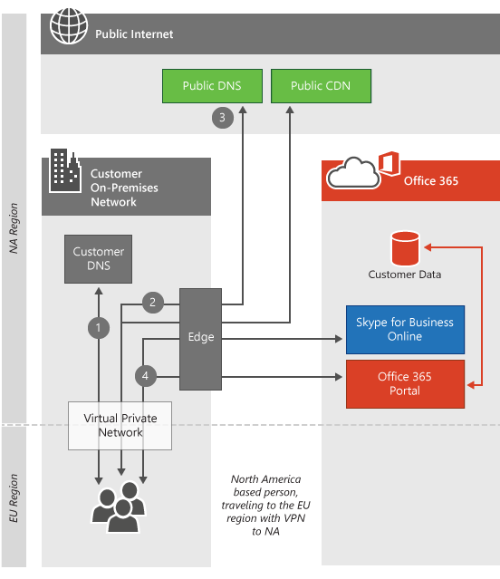

# 客户端连接Client connectivity

 **摘要:** 介绍了客户端计算机如何连接到 Office 365 租户, 具体取决于客户端计算机和 Office 365 租户数据中心的位置。**Summary:** Explains how client computers connect to Office 365 tenants, depending on the location of the client computer and Office 365 tenant datacenter.
  
Office 365 位于世界各地的 Microsoft 数据中心, 可帮助保持服务正常运行, 即使一个区域中存在重大问题 (例如地震或断电) 也是如此。Office 365 resides in Microsoft datacenters around the world which help keep the service up and running even when there's a major problem in one region, such as an earthquake or a power outage. 当您连接到 Office 365 租户时, 客户端连接将定向到承载租户的相应数据中心。When you connect to your Office 365 tenant, the client connection will be directed to the appropriate datacenter where your tenant is being hosted. 确定租户的托管位置的规则是由与 Microsoft 的协议定义的。The rules that determine where your tenant can be hosted are defined by your agreement with Microsoft. 确定客户端从该数据中心位置获取数据的方式取决于您所使用的服务的体系结构的规则。The rules that determine how your client acquires the data from that datacenter location depend on the architecture of the service you're using.
  
例如, 当您登录到 Office 365 门户时, 通常是连接到客户端的最接近的数据中心, 然后根据您下一步使用的服务进行定向。For example, when you log on to the Office 365 portal, you're usually connected to the closest datacenter to the client and then directed depending on the service you use next. 如果你启动电子邮件, 则显示 UI 的初始连接可能仍来自最近的数据中心, 但在最近的数据中心和你的租户所在的数据中心之间可能会打开第二个连接, 以向你显示阅读的电子邮件中的内容。If you launch email, the initial connection to display the UI may still come from the nearest datacenter, but a second connection might be opened between the nearest datacenter and the datacenter where your tenant is located to show you what's in the emails you read. Microsoft 在世界上十大网络中的一种, 这导致数据中心到数据中心之间的连接速度非常惊人。Microsoft operates one of the top ten networks in the world, resulting in incredibly fast datacenter-to-datacenter connections.
  
阅读本文后, 您很可能了解为什么我们不提供每个数据中心的[Office 365 url 和 IP 地址范围](https://support.office.com/article/8548a211-3fe7-47cb-abb1-355ea5aa88a2), 它们只是相互互联且相互依赖以使这一点成为可行的。After you read the article, you'll likely understand why we don't provide [Office 365 URLs and IP address ranges](https://support.office.com/article/8548a211-3fe7-47cb-abb1-355ea5aa88a2) per datacenter, they are simply too interconnected and reliant on each other to make that feasible.
  
如果您使用的是适用于 Office 365 的 Azure ExpressRoute, 在大多数情况下, 连接将通过与 Office 365 的专用连接 (而不是此处介绍的公用连接) 进行。If you're using Azure ExpressRoute for Office 365, in most cases your connectivity will go over a private connection to Office 365 instead of the public connection described here. 有关客户端连接方式的原则仍是准确的。The principles about how clients connect are still accurate. 了解有关[Office 365 的 Azure ExpressRoute 的](azure-expressroute.md)详细信息。Learn more about [Azure ExpressRoute for Office 365](azure-expressroute.md).
  
有关 Skype for business 网络请求的更多详细信息, 请阅读[skype For Business Online 中的文章媒体质量和网络连接性能](https://support.office.com/article/Media-Quality-and-Network-Connectivity-Performance-in-Skype-for-Business-Online-5fe3e01b-34cf-44e0-b897-b0b2a83f0917)。For more depth on Skype for Business network requests, read the article [Media Quality and Network Connectivity Performance in Skype for Business Online](https://support.office.com/article/Media-Quality-and-Network-Connectivity-Performance-in-Skype-for-Business-Online-5fe3e01b-34cf-44e0-b897-b0b2a83f0917).

||
|:-----|
| 本文是[Office 365 的网络规划和性能调整](https://aka.ms/tune)的一部分。This article is part of [Network planning and performance tuning for Office 365](https://aka.ms/tune).|

> [!NOTE]
> 我们非常重视管理客户数据, 因此它在我们的数据中心中是安全且保密的。We take great care to manage customer data so it's secure and private in our datacenters. 有关管理隐私所需步骤的详细信息包括在[信任中心](https://go.microsoft.com/fwlink/?LinkID=397383)中。Details about the steps we take to manage privacy are included in the [Trust Center](https://go.microsoft.com/fwlink/?LinkID=397383).
  
## 连接到最接近的数据中心Connecting to the nearest datacenter

这是最常见的连接类型, 由 Office 365 门户和 Exchange Online 使用。This is the most common type of connection, and it's used by both the Office 365 portal and Exchange Online. 在这种情况下, 当客户端尝试连接到 Office 365 时, 其计算机的 DNS 查询将确定其计算机的来源区域, 而 Office 365 会将请求重定向到最近的数据中心。In this situation, when clients attempt to connect to Office 365, their computer's DNS query determines the region of the world their computer is coming from, and Office 365 redirects the request to the nearest datacenter.
  
与门户的连接在最近的数据中心停止, 客户端计算机会在该位置显示有关客户端的租户的信息。Connections to the portal stop at the nearest datacenter, and the client computer is presented with information about the client's tenant from that location.
  
Exchange Online 将进一步执行操作。Exchange Online goes a step further. 将客户端计算机连接到最接近的数据中心后, 该数据中心内的 Exchange 服务器将连接到租户实际所在的数据中心, 如下面的 "*如何实现此操作" 部分*所示。Once the client computer is connected to the nearest datacenter, an Exchange server in that datacenter connects to the datacenter where the tenant is actually located as illustrated in the  *How does this work section*  below. 然后, 在最近的数据中心中的 Exchange Online 服务器将来自客户端计算机的请求代理到邮箱服务器。The Exchange Online servers in the nearest datacenter then proxy the requests from the client computer to the mailbox server. 这将通过将电子邮件和日历项目检索到 Microsoft 网络的大量提升来提高客户端计算机的体验速度。This speeds up the experience for the client computer by moving the heavy lifting of retrieving emails and calendar items to the Microsoft network.
  
## 这对标准云产品的功能有何作用？How does this work for standard cloud offerings?

此连接过程是高流量的标准, 高价值 web 应用程序 (如 Office 365)。This connection process is standard for high traffic, high value web applications like Office 365. 在本节中, 我们将概述并说明过程中的步骤。In this section, we outline and illustrate the steps in the process. 当客户端计算机与租户不在同一区域中时, 连接的外观会有所不同, 具体取决于客户端连接到的服务。When the client computer is not in the same region as the tenant, the connection looks much different depending on the service the client is connecting to.
  
 此图描述了使用标准 Office 365 产品和北美的租户的客户。This diagram depicts a customer using a standard Office 365 offering with a tenant in North America. 在这种情况下, 发出请求的人员将向欧洲旅行, 并从该位置使用 Office 365。In this scenario, the person making the request has traveled to Europe and is using Office 365 from that location.
  
1. 客户端计算机将为与 Office 365 关联的 IP 地址请求本地 DNS 服务器。The client computer asks the local DNS servers for the IP address associated with Office 365.

2. 客户端计算机的本地 DNS 服务器会向 Microsoft DNS 服务器询问与 Office 365 关联的 IP 地址。The client computer's local DNS servers ask the Microsoft DNS servers for the IP address associated with Office 365.

3. Microsoft 的 DNS 服务器返回区域服务器名称 (基于客户端的 DNS 服务器的位置), 客户端计算机重复步骤1和步骤 2, 以获取区域 Office 365 数据中心的 IP 地址。Microsoft's DNS servers return the regional server name (based on the location of the client's DNS servers), and the client computer repeats steps 1 and 2 to obtain the IP address of the regional Office 365 datacenter.

4. 客户端计算机连接到区域数据中心 IP 地址。The client computer connects to the regional datacenter IP address.

5. Exchange Online 服务器将建立与客户租户驻留的活动数据中心的连接。The Exchange Online servers establish a connection to the active datacenter where the customer's tenant resides.

  
## 如何使用 sovereign 云产品？How does this work for sovereign cloud offerings?

此连接在 sovereign 云产品 (如由 21 Vianet 运营的 Office 365) 中略有不同。This connection is slightly different for sovereign cloud offerings such as Office 365 operated by 21 Vianet. 使用 Office 365 的 sovereign 实例中的租户, 将接受门户连接的最近的 Office 365 服务器是租户驻留的 sovereign 区域内的服务器。With the tenant in a sovereign instance of Office 365, the nearest Office 365 servers that will accept portal connections are the servers within the sovereign region where the tenant resides. 同样, 在我们的 sovereign 云或标准产品中访问 SharePoint Online 的客户将被定向到租户所在的前端服务器。Similarly, customers accessing SharePoint Online in our sovereign cloud or standard offerings will be directed to front end servers where the tenant resides. 请参阅下面的连接到活动数据中心。See connecting to the active datacenter below.
  
1. 客户端计算机将为与 Office 365 关联的 IP 地址请求本地 DNS 服务器。The client computer asks the local DNS servers for the IP address associated with Office 365.

2. 客户端计算机的本地 DNS 服务器会向 Microsoft DNS 服务器询问与 Office 365 关联的 IP 地址。The client computer's local DNS servers ask the Microsoft DNS servers for the IP address associated with Office 365.

3. Microsoft 的 DNS 服务器返回区域服务器名称 (基于客户端的 DNS 服务器的位置), 客户端计算机重复步骤1和步骤 2, 以获取区域 Office 365 数据中心的 IP 地址。Microsoft's DNS servers return the regional server name (based on the location of the client's DNS servers), and the client computer repeats steps 1 and 2 to obtain the IP address of the regional Office 365 datacenter.

4. 客户端计算机连接到区域数据中心 IP 地址。The client computer connects to the regional datacenter IP address.

5. Exchange Online 服务器将建立与客户租户驻留的活动数据中心的连接。The Exchange Online servers establish a connection to the active datacenter where the customer's tenant resides.

  
## 连接到活动数据中心Connecting to the active datacenter

连接到活动数据中心是为了进行更厚的数据传输工作负载, 目前由 SharePoint Online 使用。Connecting to the active datacenter is designed for heavier data transfer workloads and is currently used by SharePoint Online. 在这种情况下, 当客户端尝试连接到 Office 365 时, 其浏览器会重定向到其 SharePoint Online 租户的活动数据中心。In this situation, when clients attempt to connect to Office 365, their browser is redirected to the active datacenter for their SharePoint Online tenant.
  
## 这是如何工作的？How does this work?

当客户端计算机从不同的区域连接到 SharePoint Online 时, 该连接将重定向到活动的 SharePoint Online 数据中心。When the client computer is connecting to SharePoint Online from a different region, the connection is redirected to the active SharePoint Online datacenter. 在这种情况下, 客户使用的是标准产品, 导致门户连接保持在本地, 并且 SharePoint Online 连接将定向到活动数据中心。In this scenario, the customer is using a standard offering, resulting in the portal connections remaining local and the SharePoint Online connections being directed to the active datacenter.
  
1. 客户端计算机将为与 Office 365 关联的 IP 地址请求本地 DNS 服务器。The client computer asks the local DNS servers for the IP address associated with Office 365.

2. 客户端计算机的本地 DNS 服务器会向 Microsoft DNS 服务器询问与 Office 365 关联的 IP 地址。The client computer's local DNS servers ask the Microsoft DNS servers for the IP address associated with Office 365.

3. Microsoft 的 DNS 服务器返回活动 SharePoint Online datacenter 的服务器名称 (基于客户端的 Office 365 租户的位置), 客户端计算机重复步骤1和步骤2以获取活动 Office 365 数据中心的 IP 地址。Microsoft's DNS servers return the server name of the active SharePoint Online datacenter (based on the location of the client's Office 365 tenant), and the client computer repeats steps 1 and 2 to obtain the IP address of the active Office 365 datacenter.

4. 客户端计算机连接到活动数据中心 IP 地址。The client computer connects to the active datacenter IP address.

  
## 通过虚拟专用网络 (Vpn) 连接Connecting over Virtual Private Networks (VPNs)

仅当客户端计算机使用虚拟专用网络 (VPN) 时, 此类型的连接才适用。This type of connection applies only when a virtual private network (VPN) is used by client computers. 实际上, 由于使用了 VPN, Office 365 的行为不会发生更改, 但 Vpn 通常用于控制客户端计算机如何建立到 Office 365 的连接, 并且通常会导致性能下降, 因此必须进行覆盖。In reality, Office 365 behavior isn't changed simply because a VPN is used, but VPNs are commonly used to control how client computers establish connections to Office 365 and usually results in a degraded experience, so it's important to cover.
  
## 这是如何工作的？How does this work?

当客户端计算机在不同区域建立与企业办公室的 VPN 连接时, 将使用该办公室中的 DNS 服务器, 而不是客户端计算机位置的 DNS 服务器。When the client computer establishes a VPN connection to a corporate office in a different region, the DNS servers at that office are used instead of the DNS servers at the client computer's location. 在大多数情况下, 此额外的 VPN 连接会降低 Office 365 体验。In most cases, this extra connection over the VPN will degrade the Office 365 experience. Office 365 服务已经过优化, 可尽可能接近最终用户的服务客户连接。The Office 365 services are optimized to service customer connections as close to the end user as possible. 许多服务利用 Azure edge 网络、内容传递网络以及 Microsoft 网络上的可靠网络容量, 在对 Office 365 服务的网络请求在客户端计算机附近的接近时提供最佳的用户体验尽可能。Many services leverage the Azure edge network, Content Delivery Networks, and the reliable network capacity on the Microsoft network to deliver the best possible user experience when network requests for Office 365 services are made as close to the client computer as possible.
  
1. 客户端计算机会向 VPN DNS 服务器请求与 Office 365 关联的 IP 地址。The client computer asks the VPN DNS servers for the IP address associated with Office 365.

2. 客户端计算机的 VPN DNS 服务器会向 Microsoft DNS 服务器询问与 Office 365 关联的 IP 地址。The client computer's VPN DNS servers ask the Microsoft DNS servers for the IP address associated with Office 365.

3. Microsoft 的 DNS 服务器返回区域服务器名称 (基于 VPN DNS 服务器的位置), 客户端计算机重复步骤1和步骤 2, 以获取区域 Office 365 数据中心的 IP 地址信息。Microsoft's DNS servers return the regional server name (based on the location of the VPN DNS servers), and the client computer repeats steps 1 and 2 to obtain the IP address information of the regional Office 365 datacenter.

4. 客户端计算机连接到与公司办公室最接近的数据中心 IP 地址。它们与之建立了 VPN 连接。The client computer connects to the datacenter IP address that's closest to the corporate office they established a VPN connection with.

  
以下是可以用于返回的简短链接：[https://aka.ms/o365clientconnectivity](https://aka.ms/o365clientconnectivity)Here's a short link you can use to come back: [https://aka.ms/o365clientconnectivity](https://aka.ms/o365clientconnectivity)
  
## 另请参阅See also

[管理 Office 365 终结点Managing Office 365 endpoints](https://support.office.com/article/99cab9d4-ef59-4207-9f2b-3728eb46bf9a)
  
[评估 Office 365 网络连接Assessing Office 365 network connectivity](assessing-network-connectivity.md)
