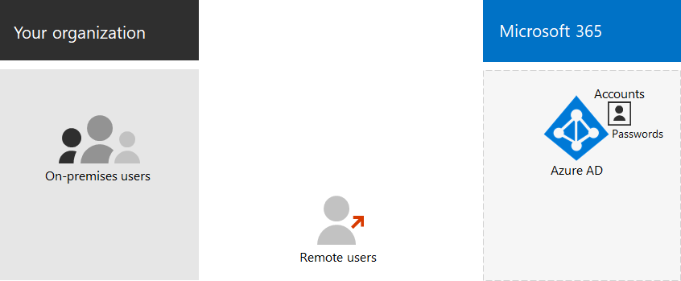

# Office 365 仅限云身份标识

对于仅限云的标识, 所有用户、组和联系人都存储在 Office 365 订阅的 Azure Active Directory (Azure AD) 租户中。 下面是仅限云身份的基本组件。
 

可以通过多种方式对组织中的用户及其用户帐户进行分类。 例如, 一些是员工, 且具有永久状态。 有些是具有临时状态的供应商、承包商或合作伙伴。 有些外部用户没有用户帐户, 但仍必须被授予对特定服务和资源的访问权限, 以支持交互和协作。 例如：

- 租户帐户表示组织中许可访问云服务的用户。

- 企业到企业 (B2B) 帐户表示您的组织外部的用户, 您邀请参与协作的用户可以向您的组织中的用户类型进行分组。 分组是什么？ 例如, 您可以将用户按高级功能或目标分组到您的组织。

此外，可以将某些云服务与组织外部没有任何用户帐户的用户共享，而且你还需要标识这些用户组。

您可以使用 Azure AD 中的组来实现多种目的, 从而简化云环境的管理。 例如, 使用 Azure AD 组, 您可以执行以下操作:

- 使用基于组的许可将 Office 365 的许可证在添加后立即自动分配给用户帐户。
- 根据用户帐户属性（如部门）将用户帐户动态添加到特定组。
- 自动预配软件即服务 (SaaS) 应用程序的用户，并通过多重身份验证和其他条件访问规则来保护对这些应用程序的访问。
- 为 SharePoint Online 团队网站设置权限和访问权限级别。

您可以使用以下内容创建新***用户***:

- [Microsoft 365 管理中心](https://docs.microsoft.com/office365/admin/add-users/add-users)
- [Office 365 PowerShell](https://docs.microsoft.com/office365/enterprise/powershell/create-user-accounts-with-office-365-powershell)

您可以使用以下内容创建新***组***:

- [Microsoft 365 管理中心](https://docs.microsoft.com/office365/admin/create-groups/create-groups)
- [Office 365 PowerShell](https://docs.microsoft.com/office365/enterprise/powershell/manage-office-365-groups-with-powershell)

## 仅限云标识的下一步

[向用户帐户分配许可证](assign-licenses-to-user-accounts.md)
