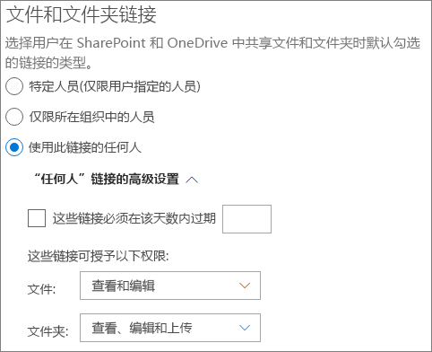

# 在网站中与来宾协作Collaborate with guests in a site

如果需要在文档、数据和列表之间与来宾进行协作，则可以使用 SharePoint 网站。If you need to collaborate with guests across documents, data, and lists, you can use a SharePoint site. 新式 SharePoint 网站连接到可管理网站成员身份的 Office 365 组，并提供其他协作工具（如共享邮箱和日历）。Modern SharePoint sites are connected to Office 365 Groups which can manage the site membership and provide additional collaboration tools such as a shared mailbox and calendar.

在本文中，我们将逐步完成为与来宾协作设置 SharePoint 网站所必需的 Microsoft 365 配置步骤。In this article, we'll walk through the Microsoft 365 configuration steps necessary to set up a SharePoint site for collaboration with guests.

## Azure 组织关系设置Azure Organizational relationships settings

Microsoft 365 中的共享受 Azure Active Directory 中的组织关系设置的最高级别的管辖。Sharing in Microsoft 365 is governed at its highest level by the organizational relationships settings in Azure Active Directory. 如果在 Azure AD 中禁用或限制来宾共享，这将替代您在 Microsoft 365 中配置的任何共享设置。If guest sharing is disabled or restricted in Azure AD, this will override any sharing settings that you configure in Microsoft 365.

检查组织关系设置以确保不会阻止与来宾共享。Check the organizational relationships settings to ensure that sharing with guests is not blocked.

设置组织关系设置To set organizational relationship settings

1. 登录到 Microsoft Azure [https://portal.azure.com](https://portal.azure.com)。Log in to Microsoft Azure at [https://portal.azure.com](https://portal.azure.com).
2. 在左侧导航中，单击 " **Azure Active Directory**"。In the left navigation, click **Azure Active Directory**.
3. 在 "**概述**" 窗格中，单击 "**组织关系**"。In the **Overview** pane, click **Organizational relationships**.
4. 在 "**组织关系**" 窗格中，单击 "**设置**"。In the **Organizational relationships** pane, click **Settings**.
5. 确保**来宾邀请者角色中的管理员和用户可以邀请**和**成员**都可以邀请都设置为 **"是"**。Ensure that **Admins and users in the guest inviter role can invite** and **Members can invite** are both set to **Yes**.
6. 如果进行了更改，请单击 "**保存**"。If you made changes, click **Save**.

请注意 "**协作限制**" 部分中的设置。Note the settings in the **Collaboration restrictions** section. 确保不会阻止您要与之进行协作的来宾域。Make sure that the domains of the guests that you want to collaborate with aren't blocked.

## Office 365 组来宾设置Office 365 Groups guest settings

新式 SharePoint 网站使用 Office 365 组来控制网站访问。Modern SharePoint sites use Office 365 Groups to control site access. 必须打开 Office 365 组来宾设置，才能使 SharePoint 网站中的来宾访问能够正常工作。The Office 365 Groups guest settings must be turned on in order for guest access in SharePoint sites to work.

设置 Office 365 组来宾设置To set Office 365 Groups guest settings

1. 在 Microsoft 365 管理中心的左侧导航栏中，展开 "**设置**"。In the Microsoft 365 admin center, in the left navigation, expand **Settings**.
2. 单击 "**服务" & 外接程序**。Click **Services & add-ins**.
3. 在列表中，单击 " **Office 365 组**"。In the list, click **Office 365 Groups**.
4. 确保将**组织外部的成员访问组内容**和**允许组所有者将组织外部的人员添加到组**复选框均选中。Ensure that the **Let group members outside your organization access group content** and **Let group owners add people outside your organization to groups** check boxes are both checked.
5. 如果进行了更改，请单击 "**保存更改**"。If you made changes, click **Save changes**.

## SharePoint 组织级别的共享设置SharePoint organization level sharing settings

为使来宾能够访问 SharePoint 网站，SharePoint 组织级别的共享设置必须允许与来宾共享。In order for guests to have access to SharePoint sites, the SharePoint organization-level sharing settings must allow for sharing with guests.

组织级别设置确定了哪些设置可用于单个网站。The organization-level settings determine what settings are available for individual sites. 网站设置不能比组织级别设置更具有更好的许可。Site settings cannot be more permissive than the organization-level settings.

如果要允许与匿名用户共享文件和文件夹，请选择 "**任何人**"。If you want to allow file and folder sharing with anonymous users, choose **Anyone**. 如果要确保所有来宾都必须进行身份验证，请选择 "**新建" 和 "现有来宾**"。If you want to ensure that all guests have to authenticate, choose **New and existing guests**. 选择组织中的任何网站将需要的 "最高" 设置。Choose the most permissive setting that will be needed by any site in your organization.

设置 SharePoint 组织级别的共享设置To set SharePoint organization level sharing settings

1. 在 Microsoft 365 管理中心的左侧导航栏中，在 "**管理中心**" 下，单击 " **SharePoint**"。In the Microsoft 365 admin center, in the left navigation, under **Admin centers**, click **SharePoint**.
2. 在 SharePoint 管理中心的左侧导航栏中，单击 "**共享**"。In the SharePoint admin center, in the left navigation, click **Sharing**.
3. 确保将 SharePoint 的 "外部共享" 设置为 "**任何人**" 或 "**新的和现有的来宾**"。Ensure that external sharing for SharePoint is set to **Anyone** or **New and existing guests**.
4. 如果进行了更改，请单击 "**保存**"。If you made changes, click **Save**.

## SharePoint 组织级别的默认链接设置SharePoint organization level default link settings

默认的文件和文件夹链接设置确定在用户共享文件或文件夹时，默认情况下向用户显示的链接选项。The default file and folder link settings determine which link option is shown to the user by default when they share a file or folder. 如果需要，用户可以在共享之前将链接类型更改为其他选项之一。Users can change the link type to one of the other options before sharing if desired.

请注意，此设置会影响组织中的所有团队和 SharePoint 网站。Keep in mind that this setting affects all teams and SharePoint sites in your organization.

选择当用户共享文件和文件夹时默认选择的链接类型：Choose the type of link that's selected by default when users share files and folders:

- **任何具有链接的人**-如果您希望与匿名用户共享大量文件和文件夹，请选择此选项。**Anyone with the link** - Choose this option if you expect to share a lot of files and folders with anonymous users. 如果您希望允许*任何人*链接，但担心意外匿名共享，请将其他选项之一作为默认值。If you want to allow *Anyone* links but are concerned about accidental anonymous sharing, consider one of the other options as the default. 仅当您已启用**任何**共享时，此链接类型才可用。This link type is only available if you've enabled **Anyone** sharing.
- **仅限组织中的人员**-如果您希望大多数文件和文件夹共享与组织内部的人员共享，请选择此选项。**Only people in your organization** - Choose this option if you expect most file and folder sharing to be with people inside your organization.
- **特定人员**-如果您希望对来宾执行大量文件和文件夹共享，请考虑此选项。**Specific people** - Consider this option if you expect to do a lot of file and folder sharing with guests. 此类型的链接可与来宾配合使用，并要求用户进行身份验证。This type of link works with guests and requires them to authenticate.
 

设置 SharePoint 组织级别的默认链接设置To set the SharePoint organization level default link settings

1. 导航到 SharePoint 管理中心中的 "共享" 页面。Navigate to the Sharing page in the SharePoint admin center.
2. 在 "**文件和文件夹链接**" 下，选择要使用的默认共享链接。Under **File and folder links**, select the default sharing link that you want to use.
3. 如果进行了更改，请单击 "**保存**"。If you made changes, click **Save**.

## 创建网站Create a site

下一步是创建您计划用于与来宾协作的网站。The next step is to create the site that you plan to use for collaborating with guests.

创建网站To create a site
1. 在 SharePoint 管理中心中的 "**网站**" 下，单击 "**活动网站**"。In the SharePoint admin center, under **Sites**, click **Active sites**.
2. 单击“**创建**”。 Click **Create**.
3. 单击 "**团队网站**"。Click **Team site**.
4. 键入网站名称并输入组所有者的名称（网站所有者）。Type a site name and enter a name for the Group owner (site owner).
5. 在 "**高级设置**" 下，选择是否希望它成为公用或专用网站。Under **Advanced settings**, choose if you want this to be a public or private site.
6. 单击"下一步"。Click **Next**.
7. 单击“完成”\*\*\*\*。Click **Finish**.

我们将稍后邀请用户。We'll invite users later. 接下来，请务必检查此网站的网站级共享设置。Next, it's important to check the site-level sharing settings for this site.

## SharePoint 网站级别共享设置SharePoint site level sharing settings

检查网站级别的共享设置以确保它们允许您对此网站所需的访问类型。Check the site-level sharing settings to make sure that they allow the type of access that you want for this site. 例如，如果将组织级别设置设置为 "**任何人**"，但希望所有来宾都对此网站进行身份验证，请确保将网站级别的共享设置设置为 "**新建" 和 "现有来宾**"。For example, if you set the organization-level settings to **Anyone**, but you want all guests to authenticate for this site, then make sure the site-level sharing settings are set to **New and existing guests**.

请注意，不能与匿名用户（**任何人**设置）共享网站，但可以对各个文件和文件夹进行共享。Note that the site cannot be shared with anonymous users (**Anyone** setting), but individual files and folders can.

设置网站级共享设置To set site-level sharing settings
1. 在 SharePoint 管理中心中，在左侧导航栏中，展开 "**网站**"，然后单击 "**活动网站**"。In the SharePoint admin center, in the left navigation, expand **Sites** and click **Active sites**.
2. 选择您刚刚创建的网站。Select the site that you just created.
3. 在功能区中，单击 "**共享**"。In the ribbon, click **Sharing**.
4. 确保将 "共享" 设置为 "**任何人**" 或 "**新的和现有的来宾**"。Ensure that sharing is set to **Anyone** or **New and existing guests**.
5. 如果进行了更改，请单击 "**保存**"。If you made changes, click **Save**.

## 邀请用户Invite users

现在已配置来宾共享设置，因此您可以开始向网站添加内部用户和来宾。Guest sharing settings are now configured, so you can start adding internal users and guests to your site. 网站访问通过关联的 Office 365 组进行控制，因此我们将在此处添加用户。Site access is controlled through the associated Office 365 Group, so we'll be adding users there.

向组邀请内部用户To invite internal users to a group
1. 导航到要在其中添加用户的网站。Navigate to the site where you want to add users.
2. 单击右上角的 "**成员**"。Click **Members** in the upper right.
3. 单击“**添加成员**”。Click **Add members**.
4. 键入要邀请到网站的用户的名称或电子邮件地址，然后单击 "**保存**"。Type the names or email addresses of the users that you want to invite to the site, and then click **Save**.

无法从网站添加来宾用户。Guest users can't be added from the site. 您需要在 web 上使用 Outlook 添加它们。You need to add them using Outlook on the web.

将来宾邀请到网站To invite guests to a site
1. 在 web 上的 Outlook 中的 "**组**" 下，单击要在其中添加成员的组。In Outlook on the web, under **Groups**, click the group where you want to add members.
2. 打开组联系人卡片，然后在 "**更多选项**（...）" 下，单击 "**添加成员**"。Open the group contact card, and then, under **More options** (...), click **Add members**.
3. 键入要邀请的来宾的电子邮件地址，然后单击 "**添加**"。Type the email addresses of the guests that you want to invite, and then click **Add**.
4. 单击“关闭”\*\*\*\*。Click **Close**.

## 另请参阅See Also
