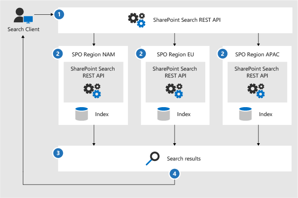
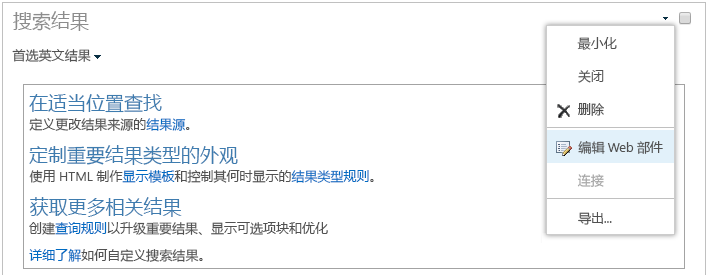

# 为 OneDrive for Business 多地理位置配置搜索Configure Search for OneDrive for Business Multi-Geo

在 OneDrive for Business 多地理位置环境中，一个组织可以具有一个 Office 365 租户，但可在多个地理位置存储其 OneDrive 内容 - 一个中央位置和一个或多个附属位置。In a Multi-Geo SharePoint Online (SPO) environment, an organization can have one Office 365 tenant, but store their SharePoint content in multiple geographical locations - one central location and one or more satellite geo locations.

每个地理位置都有其各自的搜索索引和搜索中心。在用户搜索时，查询会扇出所有索引，并合并返回的结果。Each geographical location has its own search index and Search Center. When a user searches, the query is fanned out to all the indexes, and the returned results are merged.

例如，位于一个地理位置的用户可以搜索在另一个地理位置中存储的内容，也可以搜索只限不同地理位置的 SharePoint 网站内容。如果用户有访问此内容的权限，则搜索将显示结果。For example, a user in one geo location can search for content stored in another geo location, or for content on a SharePoint site that’s restricted to a different geo location. If the user has access to this content, search will show the result.

## 在多地理位置环境中可以运行哪些搜索客户端？Which search clients work in a Multi-Geo environment?

这些客户端可以返回来自所有地理位置的结果：These clients can return results from all geo locations:

-   OneDrive for BusinessOneDrive for Business

-   DelveDelve

-   SharePoint 主页The SharePoint home page

-   搜索中心The Search Center

-   使用 SharePoint 搜索 API 的自定义搜索应用程序Custom search applications that use the SharePoint Search API

### OneDrive for BusinessOneDrive for Business

多地理位置环境一旦设置，在 OneDrive 中搜索的用户即可获得来自所有地理位置的结果。As soon as the Multi-Geo environment has been set up, users that search in OneDrive get results from all geo locations.

### DelveDelve

多地理位置环境一旦设置，在 Delve 中搜索的用户即可获得来自所有地理位置的结果。As soon as the Multi-Geo environment has been set up, users that search in Delve get results from all geo locations.

Delve 源和个人资料卡片只能显示存储在**中央**位置中的文件预览。对于存储在附属位置的文件，将改为显示文件类型的图标。The Delve feed and the profile card only show previews of files that are stored in the **central** location. For files that are stored in satellite geo locations, the icon for the file type is shown instead.

### SharePoint 主页The SharePoint home page

多地理位置环境一旦设置，用户即可在其 SharePoint 主页上看到来自多地理位置的资讯、最近访问和关注的网站。如果他们使用 SharePoint 主页上的搜索框，则他们将获得来自多地理位置的合并结果。As soon as the Multi-Geo environment has been set up, users will see news, recent and followed sites from multiple geo locations on their SharePoint home page. If they use the search box on the SharePoint home page, they'll get merged results from multiple geo locations.

### 搜索中心The Search Center

多地理位置环境设置后，每个搜索中心将继续仅显示来自其各自地理位置的结果。管理员必须[更改每个搜索中心的设置](#_Set_up_a_1)，以获取来自所有地理位置的结果。之后，在搜索中心搜索的用户将获得来自所有地理位置的结果。After the Multi-Geo environment has been set up, each Search Center continues to only show results from their own geo location. Admins must [change the settings of each Search Center](#_Set_up_a_1) to get results from all geo locations. Afterwards, users that search in the Search Center get results from all geo locations.

### 自定义搜索应用程序Custom search applications

同样，自定义搜索应用程序使用现有 SharePoint Search REST API 与搜索索引进行交互。若要获取来自所有（或部分）地理位置的结果，应用程序必须在请求中[调用 API 并包含新的多地理位置查询参数](#_Get_custom_search)。这将触发对所有地理位置的查询扇出。As usual, custom search applications interact with the search indexes by using the existing SharePoint Search REST APIs. To get results from all, or some geo locations, the application must [call the API and include the new Multi-Geo query parameters](#_Get_custom_search) in the request. This triggers a fan out of the query to all geo locations.

## 在多地理位置环境中搜索有什么不同之处？What’s different about search in a Multi-Geo environment?

你所熟悉的某些搜索功能在多地理位置环境中的工作方式可能有所不同。Some search features you might be familiar with, work differently in a Multi-Geo environment.

<table>
<thead>
<tr class="header">
<th align="left"><strong>功能</strong><strong>Feature</strong></th>
<th align="left"><strong>功能的运行方式</strong><strong>How does it work</strong></th>
<th align="left"><strong>解决方法</strong><strong>Workaround</strong></th>
</tr>
</thead>
<tbody>
<tr class="odd">
<td align="left">升级的结果Promoted results</td>
<td align="left">你可以在不同级别使用升级的结果来创建查询规则：针对整个租户、针对网站集或针对网站。在多地理位置环境中，如果想要将结果升级到<strong>所有</strong>地理位置中的搜索中心，请在<strong></strong>“租户”级别定义升级的结果。如果<strong>只</strong>想在位于网站集或网站的地理位置中的搜索中心升级结果，请在“网站集”<strong></strong>或“网站”<strong></strong>级别定义结果。You can create query rules with promoted results at different levels: for the whole tenant, for a site collection, or for a site. In a Multi-Geo environment, define promoted results at the <strong>tenant</strong> level if you want to promote the results to the Search Centers in <strong>all</strong> geo locations. If you <strong>only</strong> want to promote results in the Search Center that’s in the geo location of the site collection or site, define the results at the <strong>site collection</strong> or <strong>site</strong> level.</td>
<td align="left">如果不需要对每个地理位置使用不同的升级结果（例如，在出差时使用不同的规则），我们建议在租户级别定义升级的结果。If you don’t need different promoted results per geo location, for example different rules for traveling, we recommend defining promoted results at the tenant level.</td>
</tr>
<tr class="even">
<td align="left">搜索精简Search refiners</td>
<td align="left">搜索将返回来自租户的所有地理位置的精简内容，然后对其进行聚合。聚合是最佳做法，意味着精简计数可能并非 100% 准确。对于大部分搜索驱动的方案，此准确度已足够。 Search returns refiners from all the geo locations of a tenant and then aggregates them. The aggregation is a best effort, meaning that the refiner counts might not be 100% accurate. For most search-driven scenarios, this accuracy is sufficient. </td>
<td align="left">对于依赖于精简完整度的搜索驱动的应用程序，在不使用多地理位置扇出的情况下单独查询每个地理位置。For search-driven applications that depend on refiner completeness, query each geo location independently without using Multi-Geo fan-out.</td>
</tr>
<tr class="odd">
<td align="left"></td>
<td align="left">多地理位置搜索不支持数值精简的动态存储桶。Multi-Geo search doesn’t support dynamic bucketing for numerical refiners.</td>
<td align="left">对于数值精简，请使用<a href="https://docs.microsoft.com/en-us/sharepoint/dev/general-development/query-refinement-in-sharepoint">“Discretize”参数</a>。Use the <a href="https://docs.microsoft.com/en-us/sharepoint/dev/general-development/query-refinement-in-sharepoint">“Discretize” parameter</a> for numerical refiners.</td>
</tr>
<tr class="even">
<td align="left">文档 IDDocument IDs</td>
<td align="left">如果正在开发依赖于文档 ID 的搜索驱动的应用程序，请注意，多地理位置环境中的文档 ID 对所有地理位置来说并不是唯一的，它们只对每个地理位置来说是唯一的。If you’re developing a search-driven application that depends on document IDs, note that document IDs in a Multi-Geo environment aren’t unique across geo locations, they are unique per geo location.</td>
<td align="left">我们已添加了标识地理位置的列。使用此列来实现唯一性。此列被称为“GeoLocationSource”。We’ve added a column that identifies the geo location. Use this column to achieve uniqueness. This column is named “GeoLocationSource”.</td>
</tr>
<tr class="odd">
<td align="left">结果数Number of results</td>
<td align="left">搜索结果页将显示来自地理位置的组合结果，但该页显示的结果不能超过 500 个。The search results page shows combined results from the geo locations, but it’s not possible to page beyond 500 results.</td>
<td align="left"></td>
</tr>
</tbody>
</table>

## 在多地理位置环境中不支持的搜索有哪些？What’s not supported for search in a Multi-Geo environment?

你所熟悉的某些搜索功能在多地理位置环境中可能不受支持。Some of the search features you might be familiar with, aren’t supported in a Multi-Geo environment.

<table>
<thead>
<tr class="header">
<th align="left"><strong>搜索功能</strong><strong>Search feature</strong></th>
<th align="left"><strong>注意</strong><strong>Note</strong></th>
</tr>
</thead>
<tbody>
<tr class="odd">
<td align="left">仅应用身份验证App-only authentication</td>
<td align="left">在多地理位置搜索中不支持仅应用身份验证（来自服务的特权访问）。App-only authentication (privileged access from services) isn’t supported in Multi-Geo search.</td>
</tr>
<tr class="even">
<td align="left">来宾用户Guest users</td>
<td align="left">来宾用户仅获得其搜索的地理位置中的结果。Guest users only get results from the geo location that they’re searching from.</td>
</tr>
</tbody>
</table>

## 如何在多地理位置环境中进行搜索？How does search work in a Multi-Geo environment?

\*\*\*\* 所有搜索客户端均使用现有 SharePoint Search REST API 与搜索索引进行交互。**All** the search clients use the existing SharePoint Search REST APIs to interact with the search indexes.

1. 搜索客户端使用查询属性 EnableMultiGeoSearch= true 来调用搜索 REST 终结点。A search client calls the Search REST endpoint with the query property EnableMultiGeoSearch= true.
2. 查询将被发送到租户中的所有地理位置。The query is sent to all geo locations in the tenant.
3. 将对来自每个地理位置的搜索结果进行合并和排名。Search results from each geo location are merged and ranked.
4. 客户端将获得统一的搜索结果。The client gets unified search results.

注意：在收到来自所有地理位置的结果前，我们不会合并搜索结果。这意味着，与在仅有一个地理位置的环境中的搜索相比，多地理位置搜索具有额外的延迟性。Notice that we don’t merge the search results until we’ve received results from all the geo locations. This means that Multi-Geo searches have additional latency compared to searches in an environment with only one geo location.

## 获取搜索中心以显示来自所有地理位置的结果Get a Search Center to show results from all geo locations

每个搜索中心具有多个类别，必须单独设置每个类别。Each Search Center has several verticals and you have to set up each vertical individually.

1.  请确保执行这些步骤所使用的帐户具有编辑搜索结果页和搜索结果 Web 部件的权限。Ensure that you perform these steps with an account that has permission to edit the search results page and the Search Result Web Part.

2.  导航到搜索结果页（请参阅搜索结果页的[列表](https://support.office.com/article/174d36e0-2f85-461a-ad9a-8b3f434a4213)）Navigate to the search results page (see the [list](https://support.office.com/article/174d36e0-2f85-461a-ad9a-8b3f434a4213) of search results pages)

3.  选择要设置的类别，单击右上角的“设置”\*\*\*\* 齿轮图标，然后单击“编辑页面”\*\*\*\*。搜索结果页将在编辑模式下打开。Select the vertical to set up, click **Settings** gear icon in the upper, right corner, and then click **Edit Page**. The search results page opens in Edit mode.

     
1.  在搜索结果 Web 部件中，将指针移至 Web 部件的右上角，单击箭头，然后单击菜单上的“编辑 Web 部件”\*\*\*\*。“搜索结果 Web 部件”工具窗格将在页面右上角的功能区下方打开。In the Search Results Web Part, move the pointer to the upper, right corner of the Web Part, click the arrow, and then click **Edit Web Part** on the menu. The Search Results Web Part tool pane opens under the ribbon in the top right of the page. 

1.  在 Web 部件工具窗格中的“设置”\*\*\*\* 部分，在“结果控制设置”\*\*\*\* 下，选择“显示多地理位置结果”\*\*\*\*，获取搜索结果 Web 部件，以显示来自所有地理位置的结果。In the Web Part tool pane, in the **Settings** section, under **Results control settings**, select **Show Multi-Geo results** to get the Search Results Web Part to show results from all geo locations.

2.  单击“确定”\*\*\*\*，以保存更改并关闭 Web 部件工具窗格。Click **OK** to save your change and close the Web Part tool pane.

3.  单击主菜单“页面”选项卡上的“签入”\*\*\*\*，查看对搜索结果 Web 部件所做的更改。Check your changes to the Search Results Web Part by clicking **Check-In** on the Page tab of the main menu.

4.  使用页面顶部的注释中提供的链接来发布更改。Publish the changes by using the link provided in the note at the top of the page.

## 获取自定义搜索应用程序，以显示来自所有（或部分）地理位置的结果Get custom search applications to show results from all or some geo locations

自定义搜索应用程序通过指定对 SharePoint Search REST API 的请求的查询参数获取来自所有（或部分）地理位置的结果。根据查询参数，查询将被扇出到所有（或部分）地理位置。例如，如果只需要查询地理位置的子集来查找相关信息，可以控制仅扇出到这些子集。如果请求成功，则 SharePoint Search REST API 将返回响应数据。Custom search applications get results from all, or some, geo locations by specifying query parameters with the request to the SharePoint Search REST API. Depending on the query parameters, the query is fanned out to all geo locations, or to some geo locations. For example, if you only need to query a subset of geo locations to find relevant information, you can control the fan out to only these. If the request succeeds, the SharePoint Search REST API returns response data.

### 查询参数Query parameters

EnableMultiGeoSearch - 这是一个布尔值，指定是否应将查询扇出到多地理位置租户的其他地理位置的索引。将其设置为 **true** 可扇出查询；将其设置为 **false** 则不扇出查询。默认值为 **false**。如未包含此参数，则查询\*\*\*\* 不会被扇出到其他地理位置。如果在不是多地理位置的环境中使用该参数，则该参数将被忽略。EnableMultiGeoSearch - This is a Boolean value that specifies whether the query shall be fanned out to the indexes of other geo locations of the Multi-Geo tenant. Set it to **true** to fan out the query; **false** to not fan out the query. The default value is **false**. If you don’t include this parameter, the query is **not** fanned out to other geo locations. If you use the parameter in an environment that isn’t Multi-Geo, the parameter is ignored.

ClientType - 这是一个字符串。为每个搜索应用程序输入唯一客户端名称。如果未包含此参数，则该查询不会\*\*\*\* 被扇出到其他地理位置。ClientType - This is a string. Enter a unique client name for each search application. If you don’t include this parameter, the query is **not** fanned out to other geo locations.

MultiGeoSearchConfiguration - 这是一个可选列表，显示当 **EnableMultiGeoSearch** 为 **true** 时在多地理位置租户中要将查询扇出到的地理位置。如果未包含此参数，或将其留空，则查询将被扇出到所有地理位置。对于每个地理位置，请使用 JSON 格式输入以下项：MultiGeoSearchConfiguration - This is an optional list of which geo locations in the Multi-Geo tenant to fan the query out to when **EnableMultiGeoSearch** is **true**. If you don’t include this parameter, or leave it blank, the query is fanned out to all geo locations. For each geo location, enter the following items, in JSON format:

<table>
<thead>
<tr class="header">
<th align="left">ItemItem</th>
<th align="left">说明Description</th>
</tr>
</thead>
<tbody>
<tr class="odd">
<td align="left">DataLocationDataLocation</td>
<td align="left">地理位置，例如 NAM。The geo location, for example NAM.</td>
</tr>
<tr class="even">
<td align="left">终结点EndPoint</td>
<td align="left">要连接到的终结点，例如 https://contoso.sharepoint.comThe endpoint to connect to, for example https://contoso.sharepoint.com</td>
</tr>
<tr class="odd">
<td align="left">SourceIdSourceId</td>
<td align="left">结果源的 GUID，例如 B81EAB55-3140-4312-B0F4-9459D1B4FFEE。The GUID of the result source, for example B81EAB55-3140-4312-B0F4-9459D1B4FFEE.</td>
</tr>
</tbody>
</table>

如果省略 DataLocation 或终结点，或如果 DataLocation 是重复的，则请求将会失败。[可以使用 Microsoft Graph 获取有关租户地理位置终结点的信息](https://docs.microsoft.com/zh-CN/sharepoint/dev/solution-guidance/multigeo-discovery)。If you omit DataLocation or EndPoint, or if a DataLocation is duplicated, the request fails. [You can get information about the endpoint of a tenant's geo locations by using Microsoft Graph](https://docs.microsoft.com/zh-CN/sharepoint/dev/solution-guidance/multigeo-discovery).

### 响应数据Response data

MultiGeoSearchStatus - 这是 SharePoint Search API 响应请求返回的属性。该属性的值是一个字符串，提供有关 SharePoint Search API 所返回结果的以下信息：MultiGeoSearchStatus – This is a property that the SharePoint Search API returns in response to a request. The value of the property is a string and gives the following information about the results that the SharePoint Search API returns:

<table>
<thead>
<tr class="header">
<th align="left">值Value</th>
<th align="left">说明Description</th>
</tr>
</thead>
<tbody>
<tr class="odd">
<td align="left">完整Full</td>
<td align="left">来自所有<strong></strong>地理位置的完整结果。Full results from <strong>all</strong> the geo locations.</td>
</tr>
<tr class="even">
<td align="left">部分Partial</td>
<td align="left">来自一个或多个地理位置的部分结果。由于暂时性错误，该结果不完整。Partial results from one or more geo locations. The results are incomplete due to a transient error.</td>
</tr>

</tbody>
</table>

### 使用 REST 服务查询Query using the REST service

使用 GET 请求，指定 URL 中的查询参数。使用 POST 请求，在正文中以 JavaScript 对象表示法 (JSON) 格式传递查询参数。With a GET request, you specify the query parameters in the URL. With a POST request, you pass the query parameters in the body in JavaScript Object Notation (JSON) format.

#### 请求标头Request headers

<table>
<thead>
<tr class="header">
<th align="left">名称Name</th>
<th align="left">值Value</th>
</tr>
</thead>
<tbody>
<tr class="odd">
<td align="left">Content-TypeContent-Type</td>
<td align="left">application/json;odata=verboseapplication/json;odata=verbose</td>
</tr>
</tbody>
</table>

#### 扇出到所有\*\*\*\* 地理位置的示例 GET 请求Sample GET request that’s fanned out to **all** geo locations

https:// \<tenant\>/\_api/search/query?querytext='sharepoint'&Properties='EnableMultiGeoSearch:true'&ClientType='my\_client\_id'https:// \<tenant\>/\_api/search/query?querytext='sharepoint'&Properties='EnableMultiGeoSearch:true'&ClientType='my\_client\_id'

#### 扇出部分\*\*\*\* 地理位置的示例 GET 请求Sample GET request to fan out to **some** geo locations

https:// \<tenant\>/\_api/search/query?querytext='site'&ClientType='my_client_id'&Properties='EnableMultiGeoSearch:true, MultiGeoSearchConfiguration:[{DataLocation\\:"NAM"\\,Endpoint\\:"https\\://contosoNAM.sharepoint.com"\\,SourceId\\:"B81EAB55-3140-4312-B0F4-9459D1B4FFEE"}\\,{DataLocation\\:"CAN"\\,Endpoint\\:"https\\://contosoCAN.sharepoint-df.com"}]'https:// \<tenant\>/\_api/search/query?querytext='site'&ClientType='my_client_id'&Properties='EnableMultiGeoSearch:true, MultiGeoSearchConfiguration:[{DataLocation\\:"NAM"\\,Endpoint\\:"https\\://contosoNAM.sharepoint.com"\\,SourceId\\:"B81EAB55-3140-4312-B0F4-9459D1B4FFEE"}\\,{DataLocation\\:"CAN"\\,Endpoint\\:"https\\://contosoCAN.sharepoint-df.com"}]'

> [!NOTE]
> MultiGeoSearchConfiguration 属性的地理位置列表中的逗号和冒号前面有**反斜杠**字符。这是因为 GET 请求使用冒号将属性和逗号分隔为单独的属性参数。如果没有反斜杠作为转义字符，则系统会错误地解释 MultiGeoSearchConfiguration 属性。Commas and colons in the list of geo-locations for the MultiGeoSearchConfiguration property are preceded by the **backslash** character. This is because GET requests use colons to separate properties and commas to separate arguments of properties. Without the backslash as an escape character, the MultiGeoSearchConfiguration property is interpreted wrongly.

#### 扇出到**所有**地理位置的示例 POST 请求Sample POST request that’s fanned out to **all** geo locations

    {
        "request": {
            "__metadata": {
            "type": "Microsoft.Office.Server.Search.REST.SearchRequest"
        },
        "Querytext": "sharepoint",
        "Properties": {
            "results": [
                {
                    "Name": "EnableMultiGeoSearch",
                    "Value": {
                        "QueryPropertyValueTypeIndex": 3,
                        "BoolVal": true
                    }
                }
            ]
        },
        "ClientType": "my_client_id"
        }
    }

#### 扇出到部分\*\*\*\* 地理位置的示例 POST 请求Sample POST request that’s fanned out to **some** geo locations

    {
        "request": {
            "Querytext": "SharePoint",
            "ClientType": "my_client_id",
            "Properties": {
                "results": [
                    {
                        "Name": "EnableMultiGeoSearch",
                        "Value": {
                            "QueryPropertyValueTypeIndex": 3,
                            "BoolVal": true
                        }
                    },
                    {
                        "Name": "MultiGeoSearchConfiguration",
                        "Value": {
                        "StrVal": "[{\"DataLocation\":\"NAM\",\"Endpoint\":\"https://contoso.sharepoint.com\",\"SourceId\":\"B81EAB55-3140-4312-B0F4-9459D1B4FFEE\"},{\"DataLocation\":\"CAN\",\"Endpoint\":\"https://contosoCAN.sharepoint.com\"}]",
                            "QueryPropertyValueTypeIndex": 1
                        }
                    }
                ]
            }
        }
    }

### 使用 CSOM 查询Query using CSOM

以下是扇出到所有\*\*\*\* 地理位置的示例 CSOM 请求：Here’s a sample CSOM query that’s fanned out to **all** geo locations:

    var keywordQuery = new KeywordQuery(ctx);
    keywordQuery.QueryText = query.SearchQueryText;
    keywordQuery.ClientType = <enter a string here>;
    keywordQuery["EnableMultiGeoSearch"] = true;

