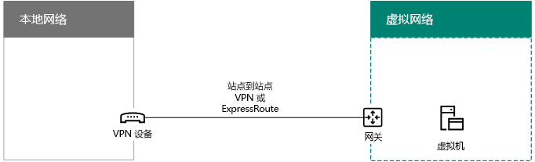

# <a name="connect-an-on-premises-network-to-a-microsoft-azure-virtual-network"></a><span data-ttu-id="3b578-103">将本地网络连接到 Microsoft Azure 虚拟网络</span><span class="sxs-lookup"><span data-stu-id="3b578-103">Connect an on-premises network to a Microsoft Azure virtual network</span></span>

 <span data-ttu-id="3b578-104">**摘要：** 了解如何为 Office 服务器工作负载配置跨界 Azure 虚拟网络。</span><span class="sxs-lookup"><span data-stu-id="3b578-104">**Summary:** Learn how to configure a cross-premises Azure virtual network for Office server workloads.</span></span>
  
<span data-ttu-id="3b578-p101">Azure 跨界虚拟网络连接到本地网络，扩展网络以包括在 Azure 基础结构服务中托管的子网和虚拟机。上述连接允许本地网络中的计算机直接访问 Azure 中的虚拟机，反之亦然。例如，在 Azure 虚拟机上运行的目录同步服务器需要查询本地域控制器获取对帐户进行的更改并将这些更改与 Office 365 订阅同步。本文介绍如何设置 Azure 跨界虚拟网络以使其为托管 Azure 虚拟机做好准备。</span><span class="sxs-lookup"><span data-stu-id="3b578-p101">A cross-premises Azure virtual network is connected to your on-premises network, extending your network to include subnets and virtual machines hosted in Azure infrastructure services. This connection allows computers on your on-premises network to directly access virtual machines in Azure and vice versa. For example, a DirSync server running on an Azure virtual machine needs to query your on-premises domain controllers for changes to accounts and synchronize those changes with your Office 365 subscription. This article shows you how to set up a cross-premises Azure virtual network that is ready to host Azure virtual machines.</span></span>
  
<span data-ttu-id="3b578-109">本文内容：</span><span class="sxs-lookup"><span data-stu-id="3b578-109">In this article:</span></span>
  
- [<span data-ttu-id="3b578-110">概述</span><span class="sxs-lookup"><span data-stu-id="3b578-110">Overview</span></span>](connect-an-on-premises-network-to-a-microsoft-azure-virtual-network.md#Overview)
    
- [<span data-ttu-id="3b578-111">规划您的 Azure 虚拟网络</span><span class="sxs-lookup"><span data-stu-id="3b578-111">Plan your Azure virtual network</span></span>](connect-an-on-premises-network-to-a-microsoft-azure-virtual-network.md#PlanningVirtual)
    
- [<span data-ttu-id="3b578-112">部署路线图</span><span class="sxs-lookup"><span data-stu-id="3b578-112">Deployment roadmap</span></span>](connect-an-on-premises-network-to-a-microsoft-azure-virtual-network.md#DeploymentRoadmap)
    
## <a name="overview"></a><span data-ttu-id="3b578-113">概述</span><span class="sxs-lookup"><span data-stu-id="3b578-113">Overview</span></span>
<span data-ttu-id="3b578-114"><a name="Overview"> </a></span><span class="sxs-lookup"><span data-stu-id="3b578-114"><a name="Overview"> </a></span></span>

<span data-ttu-id="3b578-p102">Azure 中的虚拟机无需与本地环境隔离。若要将 Azure 虚拟机连接到本地网络资源，必须配置 Azure 跨界虚拟网络。下图显示了使用 Azure 中的虚拟机部署跨部署 Azure 虚拟网络所需的组件。</span><span class="sxs-lookup"><span data-stu-id="3b578-p102">Your virtual machines in Azure don't have to be isolated from your on-premises environment. To connect Azure virtual machines to your on-premises network resources, you must configure a cross-premises Azure virtual network. The following diagram shows the required components to deploy a cross-premises Azure virtual network with a virtual machine in Azure.</span></span>
  

  
<span data-ttu-id="3b578-p103">在该图中，有两个使用站点间虚拟专用网络 (VPN) 连接进行连接的网络：本地网络和 Azure 虚拟网络。站点到站点 VPN 连接的两端分别为本地网络中的 VPN 设备和 Azure 虚拟网络中的 Azure VPN 网关。Azure 虚拟网络中具有虚拟机。从 Azure 虚拟网络上的虚拟机发出的网络流量将转发到 VPN 网关，然后通过站点间 VPN 连接将流量转发到本地网络上的 VPN 设备。随后本地网络的路由基础结构会将流量转发到其目标。</span><span class="sxs-lookup"><span data-stu-id="3b578-p103">In the diagram, there are two networks connected by a site-to-site virtual private network (VPN) connection: the on-premises network and the Azure virtual network. The site-to-site VPN connection is terminated by a VPN device on the on-premises network and an Azure VPN gateway on the Azure virtual network. The Azure virtual network has virtual machines. Network traffic originating from virtual machines on the Azure virtual network gets forwarded to the VPN gateway, which then forwards the traffic across the site-to-site VPN connection to the VPN device on the on-premises network. The routing infrastructure of the on-premises network then forwards the traffic to its destination.</span></span>
  
<span data-ttu-id="3b578-124">要设置 Azure 虚拟网络和本地网络之间的 VPN 连接，请执行以下步骤：</span><span class="sxs-lookup"><span data-stu-id="3b578-124">To set up the VPN connection between your Azure virtual network and your on-premises network, do the following steps:</span></span> 
  
1. <span data-ttu-id="3b578-125">**本地：** 为指向本地 VPN 设备的 Azure 虚拟网络的地址空间定义并创建本地网络路由。</span><span class="sxs-lookup"><span data-stu-id="3b578-125">**On-premises:** Define and create an on-premises network route for the address space of the Azure virtual network that points to your on-premises VPN device.</span></span>
    
2. <span data-ttu-id="3b578-p104">**Microsoft Azure：**创建具有网站间 VPN 连接的 Azure 虚拟网络。本文并未介绍如何使用 [ExpressRoute]((https://azure.microsoft.com/services/expressroute/))。</span><span class="sxs-lookup"><span data-stu-id="3b578-p104">**Microsoft Azure:** Create an Azure virtual network with a site-to-site VPN connection. This article does not describe the use of [ExpressRoute]((https://azure.microsoft.com/services/expressroute/)).</span></span>
    
3. <span data-ttu-id="3b578-128">**本地：** 将本地硬件或软件 VPN 设备配置为终止使用遵循 Internet 协议安全性 (IPsec) 的 VPN 连接。</span><span class="sxs-lookup"><span data-stu-id="3b578-128">**On premises:** Configure your on-premises hardware or software VPN device to terminate the VPN connection, which uses Internet Protocol security (IPsec).</span></span>
    
<span data-ttu-id="3b578-129">建立站点到站点 VPN 连接后，将 Azure 虚拟机添加到虚拟网络子网。</span><span class="sxs-lookup"><span data-stu-id="3b578-129">After you establish the site-to-site VPN connection, you add Azure virtual machines to the subnets of the virtual network.</span></span>
  
## <a name="plan-your-azure-virtual-network"></a><span data-ttu-id="3b578-130">规划您的 Azure 虚拟网络</span><span class="sxs-lookup"><span data-stu-id="3b578-130">Plan your Azure virtual network</span></span>
<span data-ttu-id="3b578-131"><a name="PlanningVirtual"> </a></span><span class="sxs-lookup"><span data-stu-id="3b578-131"><a name="PlanningVirtual"> </a></span></span>

### <a name="prerequisites"></a><span data-ttu-id="3b578-132">先决条件</span><span class="sxs-lookup"><span data-stu-id="3b578-132">Prerequisites</span></span>
<span data-ttu-id="3b578-133"><a name="Prerequisites"> </a></span><span class="sxs-lookup"><span data-stu-id="3b578-133"><a name="Prerequisites"> </a></span></span>

- <span data-ttu-id="3b578-p105">Azure 订阅。有关 Azure 订阅的信息，请转到 [Microsoft Azure 订阅页面]((https://azure.microsoft.com/pricing/purchase-options/))。</span><span class="sxs-lookup"><span data-stu-id="3b578-p105">An Azure subscription. For information about Azure subscriptions, go to the [Microsoft Azure subscription page]((https://azure.microsoft.com/pricing/purchase-options/)).</span></span>
    
- <span data-ttu-id="3b578-136">可用的专用 IPv4 地址空间，将分配给虚拟网络及其子网，具有足够的空间容纳现在和将来所需的虚拟机。</span><span class="sxs-lookup"><span data-stu-id="3b578-136">An available private IPv4 address space to assign to the virtual network and its subnets, with sufficient room for growth to accommodate the number of virtual machines needed now and in the future.</span></span>
    
- <span data-ttu-id="3b578-p106">本地网络中的可用 VPN 设备，用于终止支持 IPsec 要求的站点间 VPN 连接。有关详细信息，请参阅[有关用于站点间虚拟网络连接的 VPN 设备](https://go.microsoft.com/fwlink/p/?LinkId=393093)。</span><span class="sxs-lookup"><span data-stu-id="3b578-p106">An available VPN device in your on-premises network to terminate the site-to-site VPN connection that supports the requirements for IPsec. For more information, see [About VPN devices for site-to-site virtual network connections](https://go.microsoft.com/fwlink/p/?LinkId=393093).</span></span>
    
- <span data-ttu-id="3b578-139">对路由基础结构的变更，以便路由到 Azure 虚拟网络地址空间的流量转发到承载站点间 VPN 连接的 VPN 设备。</span><span class="sxs-lookup"><span data-stu-id="3b578-139">Changes to your routing infrastructure so that traffic routed to the address space of the Azure virtual network gets forwarded to the VPN device that hosts the site-to-site VPN connection.</span></span>
    
- <span data-ttu-id="3b578-140">Web 代理，向连接到本地网络的计算机和 Azure 虚拟网络授予 Internet 访问权限。</span><span class="sxs-lookup"><span data-stu-id="3b578-140">A web proxy that gives computers that are connected to the on-premises network and the Azure virtual network access to the Internet.</span></span>
    
### <a name="solution-architecture-design-assumptions"></a><span data-ttu-id="3b578-141">解决方案体系结构设计假设</span><span class="sxs-lookup"><span data-stu-id="3b578-141">Solution architecture design assumptions</span></span>
<span data-ttu-id="3b578-142"><a name="DesignAssumptions"> </a></span><span class="sxs-lookup"><span data-stu-id="3b578-142"><a name="DesignAssumptions"> </a></span></span>

<span data-ttu-id="3b578-143">下面的列表显示已为该解决方案体系结构做出的设计选择。</span><span class="sxs-lookup"><span data-stu-id="3b578-143">The following list represents the design choices that have been made for this solution architecture.</span></span> 
  
- <span data-ttu-id="3b578-p107">此解决方案使用具有站点间 VPN 连接的单个 Azure 虚拟网络。Azure 虚拟网络承载可能包含多个虚拟机的单个子网。</span><span class="sxs-lookup"><span data-stu-id="3b578-p107">This solution uses a single Azure virtual network with a site-to-site VPN connection. The Azure virtual network hosts a single subnet that can contain multiple virtual machines.</span></span> 
    
- <span data-ttu-id="3b578-p108">可以使用 Windows Server 2016 或 Windows Server 2012 中的路由和远程访问服务 (RRAS) 在本地网络和 Azure 虚拟网络之间建立 IPsec 站点间 VPN 连接。还可以使用其他选项，例如 Cisco 或 Juniper Networks VPN 设备。</span><span class="sxs-lookup"><span data-stu-id="3b578-p108">You can use the Routing and Remote Access Service (RRAS) in Windows Server 2016 or Windows Server 2012 to establish an IPsec site-to-site VPN connection between the on-premises network and the Azure virtual network. You can also use other options, such as Cisco or Juniper Networks VPN devices.</span></span>
    
- <span data-ttu-id="3b578-p109">本地网络可能还具有 Windows Server Active Directory 域服务 (AD)、域名系统 (DNS) 和代理服务器等网络资源。根据你的要求，它可能在将部分网络资源放到 Azure 虚拟网络中时非常有帮助。</span><span class="sxs-lookup"><span data-stu-id="3b578-p109">The on-premises network might still have network services like Windows Server Active Directory (AD), Domain Name System (DNS), and proxy servers. Depending on your requirements, it might be beneficial to place some of these network resources in the Azure virtual network.</span></span>
    
<span data-ttu-id="3b578-p110">对于具有一个或多个子网的现有 Azure 虚拟网络，确定是否还有剩余的地址空间以便附加子网托管您所需的虚拟机，具体取决于您的要求。如果您没有供附加子网使用的剩余地址空间，请创建具有站点间 VPN 连接的其他虚拟网络。</span><span class="sxs-lookup"><span data-stu-id="3b578-p110">For an existing Azure virtual network with one or more subnets, determine whether there is remaining address space for an additional subnet to host your needed virtual machines, based on your requirements. If you don't have remaining address space for an additional subnet, create an additional virtual network that has its own site-to-site VPN connection.</span></span>
  
### <a name="plan-the-routing-infrastructure-changes-for-the-azure-virtual-network"></a><span data-ttu-id="3b578-152">规划 Azure 虚拟网络的路由基础结构变更</span><span class="sxs-lookup"><span data-stu-id="3b578-152">Plan the routing infrastructure changes for the Azure virtual network</span></span>
<span data-ttu-id="3b578-153"><a name="routing"> </a></span><span class="sxs-lookup"><span data-stu-id="3b578-153"><a name="routing"> </a></span></span>

<span data-ttu-id="3b578-154">您必须将本地路由基础结构配置为将目标为 Azure 虚拟网络的地址空间的流量转发到承载站点间 VPN 连接的本地 VPN 设备。</span><span class="sxs-lookup"><span data-stu-id="3b578-154">You must configure your on-premises routing infrastructure to forward traffic destined for the address space of the Azure virtual network to the on-premises VPN device that is hosting the site-to-site VPN connection.</span></span>
  
<span data-ttu-id="3b578-155">更新路由基础结构的具体方法取决于您管理路由信息的方式，可能的选项如下：</span><span class="sxs-lookup"><span data-stu-id="3b578-155">The exact method of updating your routing infrastructure depends on how you manage routing information, which can be:</span></span>
  
- <span data-ttu-id="3b578-156">基于手动配置路由表更新。</span><span class="sxs-lookup"><span data-stu-id="3b578-156">Routing table updates based on manual configuration.</span></span>
    
- <span data-ttu-id="3b578-157">基于路由协议路由表更新，例如路由信息协议 (RIP) 或开放式最短路径优先 (OSPF) 协议。</span><span class="sxs-lookup"><span data-stu-id="3b578-157">Routing table updates based on routing protocols, such as Routing Information Protocol (RIP) or Open Shortest Path First (OSPF).</span></span>
    
<span data-ttu-id="3b578-158">咨询路由专家，确保目标为 Azure 虚拟网络的流量将转发到本地 VPN 设备。</span><span class="sxs-lookup"><span data-stu-id="3b578-158">Consult with your routing specialist to make sure that traffic destined for the Azure virtual network is forwarded to the on-premises VPN device.</span></span>
  
### <a name="plan-for-firewall-rules-for-traffic-to-and-from-the-on-premises-vpn-device"></a><span data-ttu-id="3b578-159">规划发送到本地 VPN 设备以及从本地 VPN 设备发出的流量的防火墙规则</span><span class="sxs-lookup"><span data-stu-id="3b578-159">Plan for firewall rules for traffic to and from the on-premises VPN device</span></span>
<span data-ttu-id="3b578-160"><a name="firewall"> </a></span><span class="sxs-lookup"><span data-stu-id="3b578-160"><a name="firewall"> </a></span></span>

<span data-ttu-id="3b578-161">如果您的 VPN 位于一个外围网络，且该外围网络和 Internet 之间存在防火墙，您可能需要对防火墙进行配置，以便以下规则允许站点间 VPN 连接。</span><span class="sxs-lookup"><span data-stu-id="3b578-161">If your VPN device is on a perimeter network that has a firewall between the perimeter network and the Internet, you might have to configure the firewall for the following rules to allow the site-to-site VPN connection.</span></span>
  
- <span data-ttu-id="3b578-162">到 VPN 设备的流量（从 Internet 传入）：</span><span class="sxs-lookup"><span data-stu-id="3b578-162">Traffic to the VPN device (incoming from the Internet):</span></span>
    
  - <span data-ttu-id="3b578-163">VPN 设备的目标 IP 地址和 IP 协议 50</span><span class="sxs-lookup"><span data-stu-id="3b578-163">Destination IP address of the VPN device and IP protocol 50</span></span>
    
  - <span data-ttu-id="3b578-164">VPN 设备的目标 IP 地址和 UDP 目标端口 500</span><span class="sxs-lookup"><span data-stu-id="3b578-164">Destination IP address of the VPN device and UDP destination port 500</span></span>
    
  - <span data-ttu-id="3b578-165">VPN 设备的目标 IP 地址和 UDP 目标端口 4500</span><span class="sxs-lookup"><span data-stu-id="3b578-165">Destination IP address of the VPN device and UDP destination port 4500</span></span>
    
- <span data-ttu-id="3b578-166">来自 VPN 设备的流量（传出到 Internet）：</span><span class="sxs-lookup"><span data-stu-id="3b578-166">Traffic from the VPN device (outgoing to the Internet):</span></span>
    
  - <span data-ttu-id="3b578-167">VPN 设备的源 IP 地址和 IP 协议 50</span><span class="sxs-lookup"><span data-stu-id="3b578-167">Source IP address of the VPN device and IP protocol 50</span></span>
    
  - <span data-ttu-id="3b578-168">VPN 设备的源 IP 地址和 UDP 源端口 500</span><span class="sxs-lookup"><span data-stu-id="3b578-168">Source IP address of the VPN device and UDP source port 500</span></span>
    
  - <span data-ttu-id="3b578-169">VPN 设备的源 IP 地址和 UDP 源端口 4500</span><span class="sxs-lookup"><span data-stu-id="3b578-169">Source IP address of the VPN device and UDP source port 4500</span></span>
    
### <a name="plan-for-the-private-ip-address-space-of-the-azure-virtual-network"></a><span data-ttu-id="3b578-170">规划 Azure 虚拟网络的专用 IP 地址空间</span><span class="sxs-lookup"><span data-stu-id="3b578-170">Plan for the private IP address space of the Azure virtual network</span></span>
<span data-ttu-id="3b578-171"><a name="IPAddresses"> </a></span><span class="sxs-lookup"><span data-stu-id="3b578-171"><a name="IPAddresses"> </a></span></span>

<span data-ttu-id="3b578-172">Azure 虚拟网络的专用 IP 地址空间必须能够容纳 Azure 用于承载虚拟网络的地址，且具有至少一个有足够地址供 Azure 虚拟机使用的子网。</span><span class="sxs-lookup"><span data-stu-id="3b578-172">The private IP address space of the Azure virtual network must be able to accommodate addresses used by Azure to host the virtual network and with at least one subnet that has enough addresses for your Azure virtual machines.</span></span>
  
<span data-ttu-id="3b578-173">要确定子网需要的地址数量，请计算您现在需要的虚拟机数量，估计未来增长的数量，然后使用下表确定子网大小。</span><span class="sxs-lookup"><span data-stu-id="3b578-173">To determine the number of addresses needed for the subnet, count the number of virtual machines that you need now, estimate for future growth, and then use the following table to determine the size of the subnet.</span></span>
  
|<span data-ttu-id="3b578-174">**所需的虚拟机数量**</span><span class="sxs-lookup"><span data-stu-id="3b578-174">**Number of virtual machines needed**</span></span>|<span data-ttu-id="3b578-175">**所需的主机位数**</span><span class="sxs-lookup"><span data-stu-id="3b578-175">**Number of host bits needed**</span></span>|<span data-ttu-id="3b578-176">**子网大小**</span><span class="sxs-lookup"><span data-stu-id="3b578-176">**Size of the subnet**</span></span>|
|:-----|:-----|:-----|
|<span data-ttu-id="3b578-177">1-3</span><span class="sxs-lookup"><span data-stu-id="3b578-177">1-3</span></span>  <br/> |<span data-ttu-id="3b578-178">3</span><span class="sxs-lookup"><span data-stu-id="3b578-178">3</span></span>  <br/> |<span data-ttu-id="3b578-179">/29</span><span class="sxs-lookup"><span data-stu-id="3b578-179">/29</span></span>  <br/> |
|<span data-ttu-id="3b578-180">4-11</span><span class="sxs-lookup"><span data-stu-id="3b578-180">4-11</span></span>  <br/> |<span data-ttu-id="3b578-181">4</span><span class="sxs-lookup"><span data-stu-id="3b578-181">4</span></span>  <br/> |<span data-ttu-id="3b578-182">/28</span><span class="sxs-lookup"><span data-stu-id="3b578-182">/28</span></span>  <br/> |
|<span data-ttu-id="3b578-183">12-27</span><span class="sxs-lookup"><span data-stu-id="3b578-183">12-27</span></span>  <br/> |<span data-ttu-id="3b578-184">5</span><span class="sxs-lookup"><span data-stu-id="3b578-184">5</span></span>  <br/> |<span data-ttu-id="3b578-185">/27</span><span class="sxs-lookup"><span data-stu-id="3b578-185">/27</span></span>  <br/> |
|<span data-ttu-id="3b578-186">28-59</span><span class="sxs-lookup"><span data-stu-id="3b578-186">28-59</span></span>  <br/> |<span data-ttu-id="3b578-187">6</span><span class="sxs-lookup"><span data-stu-id="3b578-187">6</span></span>  <br/> |<span data-ttu-id="3b578-188">/26</span><span class="sxs-lookup"><span data-stu-id="3b578-188">/26</span></span>  <br/> |
|<span data-ttu-id="3b578-189">60-123</span><span class="sxs-lookup"><span data-stu-id="3b578-189">60-123</span></span>  <br/> |<span data-ttu-id="3b578-190">7</span><span class="sxs-lookup"><span data-stu-id="3b578-190">7</span></span>  <br/> |<span data-ttu-id="3b578-191">/25</span><span class="sxs-lookup"><span data-stu-id="3b578-191">/25</span></span>  <br/> |
   
### <a name="planning-worksheet-for-configuring-your-azure-virtual-network"></a><span data-ttu-id="3b578-192">用于配置 Azure 虚拟网络的规划工作表</span><span class="sxs-lookup"><span data-stu-id="3b578-192">Planning worksheet for configuring your Azure virtual network</span></span>
<span data-ttu-id="3b578-193"><a name="worksheet"> </a></span><span class="sxs-lookup"><span data-stu-id="3b578-193"><a name="worksheet"> </a></span></span>

<span data-ttu-id="3b578-194">在创建托管虚拟机的 Azure 虚拟网络之前，您必须在下表中确定所需的设置。</span><span class="sxs-lookup"><span data-stu-id="3b578-194">Before you create an Azure virtual network to host virtual machines, you must determine the settings needed in the following tables.</span></span>
  
<span data-ttu-id="3b578-195">有关虚拟网络的设置，请填写表 V。</span><span class="sxs-lookup"><span data-stu-id="3b578-195">For the settings of the virtual network, fill in Table V.</span></span>
  
 <span data-ttu-id="3b578-196">**表 V：跨部署虚拟网络配置**</span><span class="sxs-lookup"><span data-stu-id="3b578-196">**Table V: Cross-premises virtual network configuration**</span></span>
  
|<span data-ttu-id="3b578-197">**项**</span><span class="sxs-lookup"><span data-stu-id="3b578-197">**Item**</span></span>|<span data-ttu-id="3b578-198">**Configuration 元素**</span><span class="sxs-lookup"><span data-stu-id="3b578-198">**Configuration element**</span></span>|<span data-ttu-id="3b578-199">**说明**</span><span class="sxs-lookup"><span data-stu-id="3b578-199">**Description**</span></span>|<span data-ttu-id="3b578-200">**值**</span><span class="sxs-lookup"><span data-stu-id="3b578-200">**Value**</span></span>|
|:-----|:-----|:-----|:-----|
|<span data-ttu-id="3b578-201">1.</span><span class="sxs-lookup"><span data-stu-id="3b578-201">1.</span></span>  <br/> |<span data-ttu-id="3b578-202">虚拟网络名称</span><span class="sxs-lookup"><span data-stu-id="3b578-202">Virtual network name</span></span>  <br/> |<span data-ttu-id="3b578-203">要分配给 Azure 虚拟网络的名称（例如，DirSyncNet）。</span><span class="sxs-lookup"><span data-stu-id="3b578-203">A name to assign to the Azure virtual network (example DirSyncNet).</span></span>  <br/> |<span data-ttu-id="3b578-204">__________________</span><span class="sxs-lookup"><span data-stu-id="3b578-204">__________________</span></span>  <br/> |
|<span data-ttu-id="3b578-205">2.</span><span class="sxs-lookup"><span data-stu-id="3b578-205">2.</span></span>  <br/> |<span data-ttu-id="3b578-206">虚拟网络位置</span><span class="sxs-lookup"><span data-stu-id="3b578-206">Virtual network location</span></span>  <br/> |<span data-ttu-id="3b578-207">将包含虚拟网络的 Azure 数据中心（如美国西部）。</span><span class="sxs-lookup"><span data-stu-id="3b578-207">The Azure datacenter that will contain the virtual network (such as West US).</span></span>  <br/> |<span data-ttu-id="3b578-208">__________________</span><span class="sxs-lookup"><span data-stu-id="3b578-208">__________________</span></span>  <br/> |
|<span data-ttu-id="3b578-209">3.</span><span class="sxs-lookup"><span data-stu-id="3b578-209">3.</span></span>  <br/> |<span data-ttu-id="3b578-210">VPN 设备 IP 地址</span><span class="sxs-lookup"><span data-stu-id="3b578-210">VPN device IP address</span></span>  <br/> |<span data-ttu-id="3b578-p111">Internet 上 VPN 设备接口的公用 IPv4 地址。与 IT 部门协作，以确定该地址。</span><span class="sxs-lookup"><span data-stu-id="3b578-p111">The public IPv4 address of your VPN device's interface on the Internet. Work with your IT department to determine this address.</span></span>  <br/> |<span data-ttu-id="3b578-213">__________________</span><span class="sxs-lookup"><span data-stu-id="3b578-213">__________________</span></span>  <br/> |
|<span data-ttu-id="3b578-214">4.</span><span class="sxs-lookup"><span data-stu-id="3b578-214">4.</span></span>  <br/> |<span data-ttu-id="3b578-215">虚拟网络地址空间</span><span class="sxs-lookup"><span data-stu-id="3b578-215">Virtual network address space</span></span>  <br/> |<span data-ttu-id="3b578-p112">虚拟网络地址空间（在一组专用地址前缀中定义）。与 IT 部门协作，以确定该地址空间。地址空间应为无类别域际路由选择 (CIDR) 格式，也称为网络前缀格式。例如，10.24.64.0/20。</span><span class="sxs-lookup"><span data-stu-id="3b578-p112">The address space (defined in a single private address prefix) for the virtual network. Work with your IT department to determine this address space. The address space should be in Classless Interdomain Routing (CIDR) format, also known as network prefix format. An example is 10.24.64.0/20.</span></span>  <br/> |<span data-ttu-id="3b578-220">__________________</span><span class="sxs-lookup"><span data-stu-id="3b578-220">__________________</span></span>  <br/> |
|<span data-ttu-id="3b578-221">5.</span><span class="sxs-lookup"><span data-stu-id="3b578-221">5.</span></span>  <br/> |<span data-ttu-id="3b578-222">IPsec 共享的密钥</span><span class="sxs-lookup"><span data-stu-id="3b578-222">IPsec shared key</span></span>  <br/> |<span data-ttu-id="3b578-p113">一组 32 位字符的随机字母数字字符串，用于对站点间 VPN 连接的两端进行身份验证。与 IT 或安全部门协作来确定此密钥值，然后将其存储在安全的位置。或者，请参阅[创建 IPsec 预共享密钥的随机字符串]((https://social.technet.microsoft.com/wiki/contents/articles/32330.create-a-random-string-for-an-ipsec-preshared-key.aspx))。</span><span class="sxs-lookup"><span data-stu-id="3b578-p113">A 32-character random, alphanumeric string that will be used to authenticate both sides of the site-to-site VPN connection. Work with your IT or security department to determine this key value and then store it in a secure location. Alternately, see [Create a random string for an IPsec preshared key]((https://social.technet.microsoft.com/wiki/contents/articles/32330.create-a-random-string-for-an-ipsec-preshared-key.aspx)).  </span></span><br/> |<span data-ttu-id="3b578-226">__________________</span><span class="sxs-lookup"><span data-stu-id="3b578-226">__________________</span></span>  <br/> |
   
<span data-ttu-id="3b578-227">此解决方案的子网请填写表 S。</span><span class="sxs-lookup"><span data-stu-id="3b578-227">Fill in Table S for the subnets of this solution.</span></span>
  
- <span data-ttu-id="3b578-p114">对于第一个子网，请为 Azure 网关子网确定 28 位的地址空间（带有 /28 前缀长度）。有关如何确定此地址空间的信息，请参阅 [Calculating the gateway subnet address space for Azure virtual networks]((https://blogs.technet.microsoft.com/solutions_advisory_board/2016/12/01/calculating-the-gateway-subnet-address-space-for-azure-virtual-networks/))（计算 Azure 虚拟网络的网关子网地址空间）。</span><span class="sxs-lookup"><span data-stu-id="3b578-p114">For the first subnet, determine a 28-bit address space (with a /28 prefix length) for the Azure gateway subnet. See [Calculating the gateway subnet address space for Azure virtual networks]((https://blogs.technet.microsoft.com/solutions_advisory_board/2016/12/01/calculating-the-gateway-subnet-address-space-for-azure-virtual-networks/)) for information about how to determine this address space.</span></span>
    
- <span data-ttu-id="3b578-230">对于第二个子网，请指定友好名称（基于虚拟网络地址空间的单一 IP 地址空间）和描述性目的。</span><span class="sxs-lookup"><span data-stu-id="3b578-230">For the second subnet, specify a friendly name, a single IP address space based on the virtual network address space, and a descriptive purpose.</span></span>
    
<span data-ttu-id="3b578-p115">与 IT 部门协作以确定这些虚拟网络地址空间中的地址空间。这两个地址空间应为 CIDR 格式。</span><span class="sxs-lookup"><span data-stu-id="3b578-p115">Work with your IT department to determine these address spaces from the virtual network address space. Both address spaces should be in CIDR format.</span></span>
  
 <span data-ttu-id="3b578-233">**表 S：虚拟网络中的子网**</span><span class="sxs-lookup"><span data-stu-id="3b578-233">**Table S: Subnets in the virtual network**</span></span>
  
|<span data-ttu-id="3b578-234">**项**</span><span class="sxs-lookup"><span data-stu-id="3b578-234">**Item**</span></span>|<span data-ttu-id="3b578-235">**子网名称**</span><span class="sxs-lookup"><span data-stu-id="3b578-235">**Subnet name**</span></span>|<span data-ttu-id="3b578-236">**子网地址空间**</span><span class="sxs-lookup"><span data-stu-id="3b578-236">**Subnet address space**</span></span>|<span data-ttu-id="3b578-237">**用途**</span><span class="sxs-lookup"><span data-stu-id="3b578-237">**Purpose**</span></span>|
|:-----|:-----|:-----|:-----|
|<span data-ttu-id="3b578-238">1.</span><span class="sxs-lookup"><span data-stu-id="3b578-238">1.</span></span>  <br/> |<span data-ttu-id="3b578-239">GatewaySubnet</span><span class="sxs-lookup"><span data-stu-id="3b578-239">GatewaySubnet</span></span>  <br/> |<span data-ttu-id="3b578-240">_____________________________</span><span class="sxs-lookup"><span data-stu-id="3b578-240">_____________________________</span></span>  <br/> |<span data-ttu-id="3b578-241">Azure 网关使用的子网。</span><span class="sxs-lookup"><span data-stu-id="3b578-241">The subnet used by the Azure gateway.</span></span>  <br/> |
|<span data-ttu-id="3b578-242">2.</span><span class="sxs-lookup"><span data-stu-id="3b578-242">2.</span></span>  <br/> |<span data-ttu-id="3b578-243">_____________________________</span><span class="sxs-lookup"><span data-stu-id="3b578-243">_____________________________</span></span>  <br/> |<span data-ttu-id="3b578-244">_____________________________</span><span class="sxs-lookup"><span data-stu-id="3b578-244">_____________________________</span></span>  <br/> |<span data-ttu-id="3b578-245">_____________________________</span><span class="sxs-lookup"><span data-stu-id="3b578-245">_____________________________</span></span>  <br/> |
   
<span data-ttu-id="3b578-p116">对于您想要让虚拟网络中的虚拟机使用的本地 DNS 服务器，请填写表 D。为 DNS 服务器提供友好名称和单一 IP 地址。此友好名称不需要与 DNS 服务器的主机名或计算机名相匹配。请注意已列出两个空白条目，但您可以添加更多。与 IT 部门协作，以确定该列表。</span><span class="sxs-lookup"><span data-stu-id="3b578-p116">For the on-premises DNS servers that you want the virtual machines in the virtual network to use, fill in Table D. Give each DNS server a friendly name and a single IP address. This friendly name does not need to match the host name or computer name of the DNS server. Note that two blank entries are listed, but you can add more. Work with your IT department to determine this list.</span></span>
  
 <span data-ttu-id="3b578-250">**表 D：本地 DNS 服务器**</span><span class="sxs-lookup"><span data-stu-id="3b578-250">**Table D: On-premises DNS servers**</span></span>
  
|<span data-ttu-id="3b578-251">**项**</span><span class="sxs-lookup"><span data-stu-id="3b578-251">**Item**</span></span>|<span data-ttu-id="3b578-252">**DNS 服务器的友好名称**</span><span class="sxs-lookup"><span data-stu-id="3b578-252">**DNS server friendly name**</span></span>|<span data-ttu-id="3b578-253">**DNS 服务器的 IP 地址**</span><span class="sxs-lookup"><span data-stu-id="3b578-253">**DNS server IP address**</span></span>|
|:-----|:-----|:-----|
|<span data-ttu-id="3b578-254">1.</span><span class="sxs-lookup"><span data-stu-id="3b578-254">1.</span></span>  <br/> |<span data-ttu-id="3b578-255">_____________________________</span><span class="sxs-lookup"><span data-stu-id="3b578-255">_____________________________</span></span>  <br/> |<span data-ttu-id="3b578-256">_____________________________</span><span class="sxs-lookup"><span data-stu-id="3b578-256">_____________________________</span></span>  <br/> |
|<span data-ttu-id="3b578-257">2.</span><span class="sxs-lookup"><span data-stu-id="3b578-257">2.</span></span>  <br/> |<span data-ttu-id="3b578-258">_____________________________</span><span class="sxs-lookup"><span data-stu-id="3b578-258">_____________________________</span></span>  <br/> |<span data-ttu-id="3b578-259">_____________________________</span><span class="sxs-lookup"><span data-stu-id="3b578-259">_____________________________</span></span>  <br/> |
   
<span data-ttu-id="3b578-p117">要通过站点间 VPN 连接将数据包从 Azure 虚拟网络传输到组织网络，你必须使用本地网络配置虚拟网络。此本地网络包含组织的本地网络上的所有位置的地址空间列表（使用 CIDR 格式），虚拟网络中的虚拟机必须能够访问这些本地网络。这可能是本地网络上的所有位置或部分位置。用于定义本地网络的地址空间列表必须是唯一的，并且不得与用于此虚拟网络或其他跨界虚拟网络的地址空间重叠。</span><span class="sxs-lookup"><span data-stu-id="3b578-p117">To route packets from the Azure virtual network to your organization network across the site-to-site VPN connection, you must configure the virtual network with a local network. This local network contains a list of the address spaces (in CIDR format) for all of the locations on your organization's on-premises network that the virtual machines in the virtual network must reach. This can be all of the locations on the on-premises network or a subset. The list of address spaces that define your local network must be unique and must not overlap with the address spaces used for this virtual network or your other cross-premises virtual networks.</span></span>
  
<span data-ttu-id="3b578-p118">对于本地网络地址空间集，请填写表 L。请注意已列出三个空白条目，但通常需要更多。与 IT 部门协作，以确定该列表。</span><span class="sxs-lookup"><span data-stu-id="3b578-p118">For the set of local network address spaces, fill in Table L. Note that three blank entries are listed but you will typically need more. Work with your IT department to determine this list.</span></span>
  
 <span data-ttu-id="3b578-266">**表 L：本地网络的地址前缀**</span><span class="sxs-lookup"><span data-stu-id="3b578-266">**Table L: Address prefixes for the local network**</span></span>
  
|<span data-ttu-id="3b578-267">**项**</span><span class="sxs-lookup"><span data-stu-id="3b578-267">**Item**</span></span>|<span data-ttu-id="3b578-268">**本地网络地址空间**</span><span class="sxs-lookup"><span data-stu-id="3b578-268">**Local network address space**</span></span>|
|:-----|:-----|
|<span data-ttu-id="3b578-269">1.</span><span class="sxs-lookup"><span data-stu-id="3b578-269">1.</span></span>  <br/> |<span data-ttu-id="3b578-270">_____________________________</span><span class="sxs-lookup"><span data-stu-id="3b578-270">_____________________________</span></span>  <br/> |
|<span data-ttu-id="3b578-271">2.</span><span class="sxs-lookup"><span data-stu-id="3b578-271">2.</span></span>  <br/> |<span data-ttu-id="3b578-272">_____________________________</span><span class="sxs-lookup"><span data-stu-id="3b578-272">_____________________________</span></span>  <br/> |
|<span data-ttu-id="3b578-273">3.</span><span class="sxs-lookup"><span data-stu-id="3b578-273">3.</span></span>  <br/> |<span data-ttu-id="3b578-274">_____________________________</span><span class="sxs-lookup"><span data-stu-id="3b578-274">_____________________________</span></span>  <br/> |
   
## <a name="deployment-roadmap"></a><span data-ttu-id="3b578-275">部署路线图</span><span class="sxs-lookup"><span data-stu-id="3b578-275">Deployment roadmap</span></span>
<span data-ttu-id="3b578-276"><a name="DeploymentRoadmap"> </a></span><span class="sxs-lookup"><span data-stu-id="3b578-276"><a name="DeploymentRoadmap"> </a></span></span>

<span data-ttu-id="3b578-277">在 Azure 中创建跨界虚拟网络并添加虚拟机包含三个阶段：</span><span class="sxs-lookup"><span data-stu-id="3b578-277">Creating the cross-premises virtual network and adding virtual machines in Azure consists of three phases:</span></span>
  
- <span data-ttu-id="3b578-278">阶段 1：准备本地网络。</span><span class="sxs-lookup"><span data-stu-id="3b578-278">Phase 1: Prepare your on-premises network.</span></span>
    
- <span data-ttu-id="3b578-279">阶段 2：在 Azure 中创建跨界虚拟网络。</span><span class="sxs-lookup"><span data-stu-id="3b578-279">Phase 2: Create the cross-premises virtual network in Azure.</span></span>
    
- <span data-ttu-id="3b578-280">阶段 3（可选）：添加虚拟机。</span><span class="sxs-lookup"><span data-stu-id="3b578-280">Phase 3 (Optional): Add virtual machines.</span></span>
    
### <a name="phase-1-prepare-your-on-premises-network"></a><span data-ttu-id="3b578-281">阶段 1：准备您的本地网络:</span><span class="sxs-lookup"><span data-stu-id="3b578-281">Phase 1: Prepare your on-premises network</span></span>
<span data-ttu-id="3b578-282"><a name="Phase1"> </a></span><span class="sxs-lookup"><span data-stu-id="3b578-282"><a name="Phase1"> </a></span></span>

<span data-ttu-id="3b578-p119">必须配置本地网络，其中路由指向目标为虚拟网络地址空间的流量并将流量提供给本地网络边缘中的路由器。请咨询你的网络管理员，以确定如何将路由添加到本地网络的路由结构。</span><span class="sxs-lookup"><span data-stu-id="3b578-p119">You must configure your on-premises network with a route that points to and ultimately delivers traffic destined for the address space of the virtual network to the router on the edge of the on-premises network. Consult with your network administrator to determine how to add the route to the routing infrastructure of your on-premises network.</span></span>
  
<span data-ttu-id="3b578-285">下面是生成的配置。</span><span class="sxs-lookup"><span data-stu-id="3b578-285">Here is your resulting configuration.</span></span>
  

  
### <a name="phase-2-create-the-cross-premises-virtual-network-in-azure"></a><span data-ttu-id="3b578-287">阶段 2：在 Azure 中创建跨部署虚拟网络</span><span class="sxs-lookup"><span data-stu-id="3b578-287">Phase 2: Create the cross-premises virtual network in Azure</span></span>
<span data-ttu-id="3b578-288"><a name="Phase2"> </a></span><span class="sxs-lookup"><span data-stu-id="3b578-288"><a name="Phase2"> </a></span></span>

<span data-ttu-id="3b578-p120">首先，请打开 Azure PowerShell 提示符。如果没有安装 Azure PowerShell，请参阅 [Azure PowerShell cmdlet 使用入门]((https://docs.microsoft.com/powershell/azureps-cmdlets-docs/))。</span><span class="sxs-lookup"><span data-stu-id="3b578-p120">First, open an Azure PowerShell prompt. If you have not installed Azure PowerShell, see [Get started with Azure PowerShell cmdlets]((https://docs.microsoft.com/powershell/azureps-cmdlets-docs/)).</span></span>
  
> [!NOTE]
> <span data-ttu-id="3b578-p121">这些命令适用于 Azure PowerShell 1.0 及更高版本。如需包含本文中的所有 PowerShell 命令的文本文件，请单击[此处]((https://gallery.technet.microsoft.com/scriptcenter/PowerShell-commands-for-5c5a7c19))。</span><span class="sxs-lookup"><span data-stu-id="3b578-p121">These commands are for Azure PowerShell 1.0 and above. For a text file that contains all the PowerShell commands in this article, click [here]((https://gallery.technet.microsoft.com/scriptcenter/PowerShell-commands-for-5c5a7c19)).</span></span> 
  
<span data-ttu-id="3b578-293">下一步，使用此命令登录 Azure 帐户。</span><span class="sxs-lookup"><span data-stu-id="3b578-293">Next, login to your Azure account with this command.</span></span>
  
```
Login-AzureRMAccount
```

<span data-ttu-id="3b578-294">使用以下命令获得订阅名称。</span><span class="sxs-lookup"><span data-stu-id="3b578-294">Get your subscription name using the following command.</span></span>
  
```
Get-AzureRMSubscription | Sort SubscriptionName | Select SubscriptionName
```

<span data-ttu-id="3b578-p122">通过这些命令设置 Azure 订阅。使用正确的订阅名称替换引号内的所有内容（包括 < 和 > 字符）。</span><span class="sxs-lookup"><span data-stu-id="3b578-p122">Set your Azure subscription with these commands. Replace everything within the quotes, including the < and > characters, with the correct subscription name.</span></span>
  
```
$subscrName="<subscription name>"
Select-AzureRMSubscription -SubscriptionName $subscrName -Current
```

<span data-ttu-id="3b578-p123">接下来，为虚拟网络创建一个新的资源组。要确定一个唯一的资源组名称，请使用此命令列出您现有的资源组。</span><span class="sxs-lookup"><span data-stu-id="3b578-p123">Next, create a new resource group for your virtual network. To determine a unique resource group name, use this command to list your existing resource groups.</span></span>
  
```
Get-AzureRMResourceGroup | Sort ResourceGroupName | Select ResourceGroupName
```

<span data-ttu-id="3b578-299">使用这些命令创建新的资源组。</span><span class="sxs-lookup"><span data-stu-id="3b578-299">Create your new resource group with these commands.</span></span>
  
```
$rgName="<resource group name>"
$locName="<Table V - Item 2 - Value column>"
New-AzureRMResourceGroup -Name $rgName -Location $locName

```

<span data-ttu-id="3b578-p124">基于资源管理器的虚拟机需要基于资源管理器的存储帐户。您必须为只包含小写字母和数字的存储帐户选择一个全局唯一名称。可以使用此命令列出现有的存储帐户。</span><span class="sxs-lookup"><span data-stu-id="3b578-p124">Resource Manager-based virtual machines require a Resource Manager-based storage account. You must pick a globally unique name for your storage account that contains only lowercase letters and numbers. You can use this command to list the existing storage accounts.</span></span>
  
```
Get-AzureRMStorageAccount | Sort Name | Select Name
```

<span data-ttu-id="3b578-303">使用此命令来测试建议的存储帐户名称是否唯一。</span><span class="sxs-lookup"><span data-stu-id="3b578-303">Use this command to test whether a proposed storage account name is unique.</span></span>
  
```
Get-AzureRmStorageAccountNameAvailability "<proposed name>"
```

<span data-ttu-id="3b578-304">若要创建新的存储帐户，请运行这些命令。</span><span class="sxs-lookup"><span data-stu-id="3b578-304">To create a new storage account, run these commands.</span></span>
  
```
$rgName="<your new resource group name>"
$locName="<the location of your new resource group>"
$saName="<unique storage account name>"
New-AzureRMStorageAccount -Name $saName -ResourceGroupName $rgName -Type Standard_LRS -Location $locName
```

<span data-ttu-id="3b578-305">接下来，请创建 Azure 虚拟网络。</span><span class="sxs-lookup"><span data-stu-id="3b578-305">Next, you create the Azure virtual network.</span></span>
  
```
# Fill in the variables from previous values and from Tables V, S, and D
$rgName="<name of your new resource group>"
$locName="<Azure location of your new resource group>"
$vnetName="<Table V - Item 1 - Value column>"
$vnetAddrPrefix="<Table V - Item 4 - Value column>"
$gwSubnetPrefix="<Table S - Item 1 - Subnet address space column>"
$SubnetName="<Table S - Item 2 - Subnet name column>"
$SubnetPrefix="<Table S - Item 2 - Subnet address space column>"
$dnsServers=@( "<Table D - Item 1 - DNS server IP address column>", "<Table D - Item 2 - DNS server IP address column>" )

# Get the shortened version of the location
$rg=Get-AzureRmResourceGroup -Name $rgName
$locShortName=$rg.Location

# Create the Azure virtual network and a network security group that allows incoming remote desktop connections to the subnet that is hosting virtual machines
$gatewaySubnet=New-AzureRmVirtualNetworkSubnetConfig -Name "GatewaySubnet" -AddressPrefix $gwSubnetPrefix
$vmSubnet=New-AzureRMVirtualNetworkSubnetConfig -Name $SubnetName -AddressPrefix $SubnetPrefix
New-AzureRMVirtualNetwork -Name $vnetName -ResourceGroupName $rgName -Location $locName -AddressPrefix $vnetAddrPrefix -Subnet $gatewaySubnet,$vmSubnet -DNSServer $dnsServers
$rule1=New-AzureRMNetworkSecurityRuleConfig -Name "RDPTraffic" -Description "Allow RDP to all VMs on the subnet" -Access Allow -Protocol Tcp -Direction Inbound -Priority 100 -SourceAddressPrefix Internet -SourcePortRange * -DestinationAddressPrefix * -DestinationPortRange 3389
New-AzureRMNetworkSecurityGroup -Name $SubnetName -ResourceGroupName $rgName -Location $locShortName -SecurityRules $rule1
$vnet=Get-AzureRMVirtualNetwork -ResourceGroupName $rgName -Name $vnetName
$nsg=Get-AzureRMNetworkSecurityGroup -Name $SubnetName -ResourceGroupName $rgName
Set-AzureRMVirtualNetworkSubnetConfig -VirtualNetwork $vnet -Name $SubnetName -AddressPrefix $SubnetPrefix -NetworkSecurityGroup $nsg
```

<span data-ttu-id="3b578-306">下面是生成的配置。</span><span class="sxs-lookup"><span data-stu-id="3b578-306">Here is your resulting configuration.</span></span>
  

  
<span data-ttu-id="3b578-308">下一步，请使用这些命令来创建站点间 VPN 连接的网关。</span><span class="sxs-lookup"><span data-stu-id="3b578-308">Next, use these commands to create the gateways for the site-to-site VPN connection.</span></span>
  
```
# Fill in the variables from previous values and from Tables V and L
$vnetName="<Table V - Item 1 - Value column>"
$localGatewayIP="<Table V - Item 3 - Value column>"
$localNetworkPrefix=@( <comma-separated, double-quote enclosed list of the local network address prefixes from Table L, example: "10.1.0.0/24", "10.2.0.0/24"> )
$vnetConnectionKey="<Table V - Item 5 - Value column>"
$vnet=Get-AzureRMVirtualNetwork -Name $vnetName -ResourceGroupName $rgName
# Attach a virtual network gateway to a public IP address and the gateway subnet
$publicGatewayVipName="PublicIPAddress"
$vnetGatewayIpConfigName="PublicIPConfig"
New-AzureRMPublicIpAddress -Name $vnetGatewayIpConfigName -ResourceGroupName $rgName -Location $locName -AllocationMethod Dynamic
$publicGatewayVip=Get-AzureRMPublicIpAddress -Name $vnetGatewayIpConfigName -ResourceGroupName $rgName
$vnetGatewayIpConfig=New-AzureRMVirtualNetworkGatewayIpConfig -Name $vnetGatewayIpConfigName -PublicIpAddressId $publicGatewayVip.Id -SubnetId $vnet.Subnets[0].Id
# Create the Azure gateway
$vnetGatewayName="AzureGateway"
$vnetGateway=New-AzureRMVirtualNetworkGateway -Name $vnetGatewayName -ResourceGroupName $rgName -Location $locName -GatewayType Vpn -VpnType RouteBased -IpConfigurations $vnetGatewayIpConfig
# Create the gateway for the local network
$localGatewayName="LocalNetGateway"
$localGateway=New-AzureRMLocalNetworkGateway -Name $localGatewayName -ResourceGroupName $rgName -Location $locName -GatewayIpAddress $localGatewayIP -AddressPrefix $localNetworkPrefix
# Create the Azure virtual network VPN connection
$vnetConnectionName="S2SConnection"
$vnetConnection=New-AzureRMVirtualNetworkGatewayConnection -Name $vnetConnectionName -ResourceGroupName $rgName -Location $locName -ConnectionType IPsec -SharedKey $vnetConnectionKey -VirtualNetworkGateway1 $vnetGateway -LocalNetworkGateway2 $localGateway
```

<span data-ttu-id="3b578-309">下面是生成的配置。</span><span class="sxs-lookup"><span data-stu-id="3b578-309">Here is your resulting configuration.</span></span>
  

  
<span data-ttu-id="3b578-p125">接下来，请将本地 VPN 设备配置为连接到 Azure VPN 网关。有关详细信息，请参阅[有关用于站点间 Azure 虚拟网络连接的 VPN 设备]((https://docs.microsoft.com/azure/vpn-gateway/vpn-gateway-about-vpn-devices))。</span><span class="sxs-lookup"><span data-stu-id="3b578-p125">Next, configure your on-premises VPN device to connect to the Azure VPN gateway. For more information, see [About VPN Devices for site-to-site Azure Virtual Network connections]((https://docs.microsoft.com/azure/vpn-gateway/vpn-gateway-about-vpn-devices)).</span></span>
  
<span data-ttu-id="3b578-313">若要配置 VPN 设备，您需要以下各项:</span><span class="sxs-lookup"><span data-stu-id="3b578-313">To configure your VPN device, you will need the following:</span></span>
  
- <span data-ttu-id="3b578-p126">您虚拟网络的 Azure VPN 网关的公共 IPv4 地址。使用 **Get-AzureRMPublicIpAddress -Name $vnetGatewayIpConfigName -ResourceGroupName $rgName** 命令显示此地址。</span><span class="sxs-lookup"><span data-stu-id="3b578-p126">The public IPv4 address of the Azure VPN gateway for your virtual network. Use the **Get-AzureRMPublicIpAddress -Name $vnetGatewayIpConfigName -ResourceGroupName $rgName** command to display this address.</span></span>
    
- <span data-ttu-id="3b578-316">站点间 VPN 连接的 IPsec 预共享密钥（表 V - 项 5 - 值列）</span><span class="sxs-lookup"><span data-stu-id="3b578-316">The IPsec pre-shared key for the site-to-site VPN connection (Table V- Item 5 - Value column).</span></span>
    
<span data-ttu-id="3b578-317">下面是生成的配置。</span><span class="sxs-lookup"><span data-stu-id="3b578-317">Here is your resulting configuration.</span></span>
  

  
### <a name="phase-3-optional-add-virtual-machines"></a><span data-ttu-id="3b578-319">阶段 3（可选）：添加虚拟机</span><span class="sxs-lookup"><span data-stu-id="3b578-319">Phase 3 (Optional): Add virtual machines</span></span>
<span data-ttu-id="3b578-320"><a name="Phase2"> </a></span><span class="sxs-lookup"><span data-stu-id="3b578-320"><a name="Phase2"> </a></span></span>

<span data-ttu-id="3b578-p127">在 Azure 中创建所需虚拟机。有关详细信息，请参阅[在 Azure 门户中创建第一个 Windows 虚拟机](https://go.microsoft.com/fwlink/p/?LinkId=393098)。</span><span class="sxs-lookup"><span data-stu-id="3b578-p127">Create the virtual machines you need in Azure. For more information, see [Create your first Windows virtual machine in the Azure portal](https://go.microsoft.com/fwlink/p/?LinkId=393098).</span></span>
  
<span data-ttu-id="3b578-323">使用以下设置：</span><span class="sxs-lookup"><span data-stu-id="3b578-323">Use the following settings:</span></span>
  
- <span data-ttu-id="3b578-p128">在" **基本信息** "窗格中，选择与虚拟网络相同的订阅和资源组。在安全的位置记录用户名和密码。你稍后将需要使用这些信息登录到虚拟机。</span><span class="sxs-lookup"><span data-stu-id="3b578-p128">On the **Basics** pane, select the same subscription and resource group as your virtual network. Record the user name and password in a secure location. You will need these later to sign in to the virtual machine.</span></span>
    
- <span data-ttu-id="3b578-327">在" **大小** "窗格中，选择合适的大小。</span><span class="sxs-lookup"><span data-stu-id="3b578-327">On the **Size** pane, choose the appropriate size.</span></span>
    
- <span data-ttu-id="3b578-p129">在" **设置** "窗格的" **存储** "部分中，选择用于设置虚拟网络的" **标准** "存储类型和存储帐户。在" **网络** "部分中，选择虚拟网络的名称和托管虚拟机（不是网关子网）的子网。其他所有设置都保留默认值。</span><span class="sxs-lookup"><span data-stu-id="3b578-p129">On the **Settings** pane, in the **Storage** section, select the **Standard** storage type and the storage account set up with your virtual network. In the **Network** section, select the name of your virtual network and the subnet for hosting virtual machines (not the GatewaySubnet). Leave all other settings at their default values.</span></span>
    
<span data-ttu-id="3b578-p130">请检查内部 DNS 验证虚拟机是否正确使用 DNS，确保已为新虚拟机添加地址 (A) 记录。要访问 Internet，必须将 Azure 虚拟机配置为使用本地网络的代理服务器。有关要在服务器上执行的其他配置步骤，请与网络管理员联系。</span><span class="sxs-lookup"><span data-stu-id="3b578-p130">Verify that your virtual machine is using DNS correctly by checking your internal DNS to ensure that Address (A) records were added for you new virtual machine. To access the Internet, your Azure virtual machines must be configured to use your on-premises network's proxy server. Contact your network administrator for additional configuration steps to perform on the server.</span></span>
  
<span data-ttu-id="3b578-334">下面是生成的配置。</span><span class="sxs-lookup"><span data-stu-id="3b578-334">Here is your resulting configuration.</span></span>
  

  
## <a name="see-also"></a><span data-ttu-id="3b578-336">另请参阅</span><span class="sxs-lookup"><span data-stu-id="3b578-336">See Also</span></span>

<span data-ttu-id="3b578-337"><a name="DeploymentRoadmap"> </a></span><span class="sxs-lookup"><span data-stu-id="3b578-337"><a name="DeploymentRoadmap"> </a></span></span>

[<span data-ttu-id="3b578-338">云应用和混合解决方案</span><span class="sxs-lookup"><span data-stu-id="3b578-338">Cloud adoption and hybrid solutions</span></span>](cloud-adoption-and-hybrid-solutions.md)
  
[<span data-ttu-id="3b578-339">在 Microsoft Azure 中部署 Office 365 目录同步 (DirSync)</span><span class="sxs-lookup"><span data-stu-id="3b578-339">Deploy Office 365 Directory Synchronization (DirSync) in Microsoft Azure</span></span>](deploy-office-365-directory-synchronization-dirsync-in-microsoft-azure.md)

[<span data-ttu-id="3b578-340">如何创建虚拟机</span><span class="sxs-lookup"><span data-stu-id="3b578-340">How to create the virtual machine</span></span>](https://go.microsoft.com/fwlink/p/?LinkId=393098)
  
<span data-ttu-id="3b578-341">[有关用于站点间 Azure 虚拟网络连接的 VPN 设备]((https://azure.microsoft.com/documentation/articles/vpn-gateway-about-vpn-devices/))</span><span class="sxs-lookup"><span data-stu-id="3b578-341">[About VPN Devices for site-to-site Azure Virtual Network connections]((https://azure.microsoft.com/documentation/articles/vpn-gateway-about-vpn-devices/))</span></span>
  
[<span data-ttu-id="3b578-342">如何安装和配置 Azure PowerShell</span><span class="sxs-lookup"><span data-stu-id="3b578-342">How to install and configure Azure PowerShell</span></span>](https://azure.microsoft.com/documentation/articles/powershell-install-configure/#how-to-install-azure-powershell)


