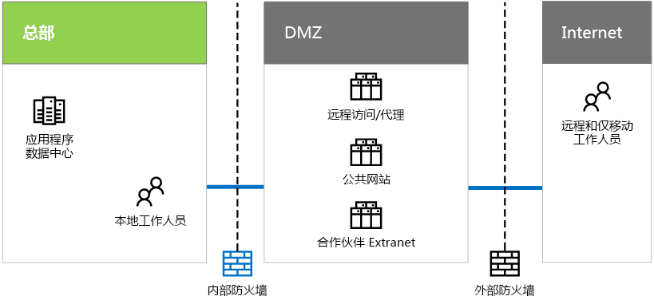

# Contoso 的 IT 基础结构和需求

 **摘要：** 了解 Contoso 的本地 IT 基础结构的基本结构，以及 Microsoft 云产品满足其业务需求的方式。
  
Contoso 正在从本地集中式 IT 基础结构转换到一个合并了基于云的个人生产率工作负载、应用程序和混合方案的包含云的 IT 基础结构。
  
## Contoso 的现有 IT 基础结构

Contoso 通过将应用程序数据中心置于巴黎总部，来使用最集中的本地 IT 基础结构。
  
**图 1：Contoso 的现有 IT 基础结构**

  
图 1 显示总部办事处的应用程序数据中心、DMZ 和 Internet。
  
在 Contoso 的 DMZ 中，不同的服务器集提供不同的功能：
  
- 巴黎总部的工作人员对 Contoso Intranet 和 Web 代理的远程访问。
    
- 对 Contoso 公共网站的托管，客户可以在其中订购产品、部件或配件。
    
- 对 Contoso 合作伙伴 Extranet 的托管，用于合作伙伴的通信和协作。
    
## Contoso 的业务需求

下面是按优先级顺序排列的 Contoso 的业务需求：
  
1. 遵守区域法规要求
    
    若要防止罚款并与地方政府保持良好的关系，Contoso 必须确保数据存储和加密规则的合规性。
    
2. 改进供应商和合作伙伴管理
    
    合作伙伴 Extranet 不断老化并且维护费用高昂。Contoso 想要将其替换为使用联合身份验证的基于云的解决方案。
    
3. 提高移动工作人员的工作效率，改善设备管理及访问
    
    Contoso 的移动工作人员不断增加，并且需要进行设备管理，以确保保护知识产权并更有效地访问资源。
    
4. 减少远程访问基础结构
    
    通过将远程工作人员经常访问的资源移动到云，Contoso 可减少远程访问解决方案的维护和支持成本以节约资金。
    
5. 缩小本地数据中心
    
    Contoso 数据中心包含数百个服务器，其中一些正在运行旧版或存档功能，这会干扰 IT 人员，使他们难以维护高业务价值工作负载。
    
6. 扩展用于季度末处理的计算和存储资源
    
    季度末财务核算和预测处理及库存管理要求短期增加服务器和存储空间。
    
## 将 Contoso 业务需求映射到 Microsoft 云产品

根据微软云产品的分析，Contoso 的 IT 部门确定了以下映射：
  
|**软件即服务 (SaaS)**|**平台即服务 (Azure PaaS )**|**基础结构即服务 (Azure IaaS )**|
|:-----|:-----|:-----|
|**Office 365：** 云中的主要个人和组工作效率应用程序。   业务需求：1 3 5    |使用基于云的应用托管销售和支持文档及信息系统。    业务需求：3    |将存档和旧系统移动到基于云的服务器。    业务需求：5    |
|**Dynamics 365：** 使用基于云的客户和供应商管理。删除 DMZ 中的合作伙伴 Extranet。   业务需求：2    |移动应用程序基于云，而不是基于巴黎数据中心。    业务需求：3 4    |将使用率较低的应用和数据迁移出本地数据中心。    业务需求：5    |
|**Intune/EMS：** 管理 iOS 和 Android 设备。   业务需求：3    ||为季度末处理需求增加临时服务器和存储空间。    业务需求：6    |
   
## See Also

#### 

[Microsoft 云中的 Contoso](contoso-in-the-microsoft-cloud.md)
  
[Microsoft 云 IT 体系结构资源](microsoft-cloud-it-architecture-resources.md)
#### 

[Microsoft 企业云路线图：IT 决策者的资源](https://sway.com/FJ2xsyWtkJc2taRD)

