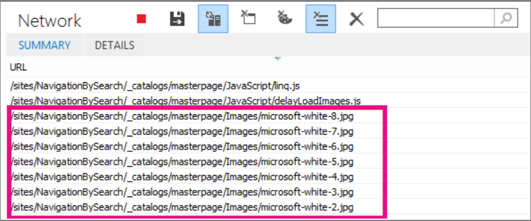

# <a name="delay-loading-images-and-javascript-in-sharepoint-online"></a><span data-ttu-id="81906-103">在 SharePoint Online 中延迟加载图像和 JavaScript</span><span class="sxs-lookup"><span data-stu-id="81906-103">Delay loading images and JavaScript in SharePoint Online</span></span>

<span data-ttu-id="81906-104">本文介绍如何通过使用 JavaScript 来延迟加载图像以及在页面加载后等待加载非基本 JavaScript，从而减少 SharePoint Online 页面的加载时间。</span><span class="sxs-lookup"><span data-stu-id="81906-104">This article describes how you can decrease the load time for SharePoint Online pages by using JavaScript to delay loading images and also by waiting to load non-essential JavaScript until after the page loads.</span></span>
  
<span data-ttu-id="81906-105">图像会对 SharePoint Online 上的页面加载速度产生负面影响。</span><span class="sxs-lookup"><span data-stu-id="81906-105">Images can negatively affect page load speeds on SharePoint Online.</span></span> <span data-ttu-id="81906-106">默认情况下，大多数新式 Internet 浏览器在加载 HTML 页面时预提取映像。</span><span class="sxs-lookup"><span data-stu-id="81906-106">By default, most modern Internet browsers pre-fetch images when loading an HTML page.</span></span> <span data-ttu-id="81906-107">如果在用户向下滚动之前图像在屏幕上不可见，则这可能会导致页面的加载速度不必要。</span><span class="sxs-lookup"><span data-stu-id="81906-107">This can cause the page to be unnecessarily slow to load if the images are not visible on the screen until the user scrolls down.</span></span> <span data-ttu-id="81906-108">图像可以阻止浏览器加载页面的可见部分。</span><span class="sxs-lookup"><span data-stu-id="81906-108">The images can block the browser from loading the visible part of the page.</span></span> <span data-ttu-id="81906-109">若要解决此问题，可以使用 JavaScript 先跳过加载图像。</span><span class="sxs-lookup"><span data-stu-id="81906-109">To work around this problem, you can use JavaScript to skip loading the images first.</span></span> <span data-ttu-id="81906-110">此外，加载非基本 JavaScript 也可能会减慢 SharePoint 页面上的下载时间。</span><span class="sxs-lookup"><span data-stu-id="81906-110">Also, loading non-essential JavaScript can slow download times on your SharePoint pages too.</span></span> <span data-ttu-id="81906-111">本主题介绍可用于在 SharePoint Online 中使用 JavaScript 改进页面加载时间的一些方法。</span><span class="sxs-lookup"><span data-stu-id="81906-111">This topic describes some methods you can use to improve page load times with JavaScript in SharePoint Online.</span></span>
  
## <a name="improve-page-load-times-by-delaying-image-loading-in-sharepoint-online-pages-by-using-javascript"></a><span data-ttu-id="81906-112">通过使用 JavaScript 延迟 SharePoint Online 页面中的图像加载，提高页面加载时间</span><span class="sxs-lookup"><span data-stu-id="81906-112">Improve page load times by delaying image loading in SharePoint Online pages by using JavaScript</span></span>

<span data-ttu-id="81906-113">您可以使用 JavaScript 阻止 web 浏览器预先获取图像。</span><span class="sxs-lookup"><span data-stu-id="81906-113">You can use JavaScript to prevent a web browser from pre-fetching images.</span></span> <span data-ttu-id="81906-114">这将加快整体文档呈现速度。</span><span class="sxs-lookup"><span data-stu-id="81906-114">This speeds up overall document rendering.</span></span> <span data-ttu-id="81906-115">若要执行此操作，请从\标记中删除 src 属性的值，并将其替换为 data 属性中的文件的路径，如 data-src。</span><span class="sxs-lookup"><span data-stu-id="81906-115">To do this you remove the value of the src attribute from the \ tag and replace it with the path to a file in a data attribute such as: data-src.</span></span> <span data-ttu-id="81906-116">例如：</span><span class="sxs-lookup"><span data-stu-id="81906-116">For example:</span></span>
  
```html

```

<span data-ttu-id="81906-117">通过使用此方法，浏览器不会立即下载图像。</span><span class="sxs-lookup"><span data-stu-id="81906-117">By using this method, the browser doesn't download the images immediately.</span></span> <span data-ttu-id="81906-118">如果图像已在视区中，JavaScript 会通知浏览器从数据属性中检索 URL，并将其作为 src 属性的值插入。</span><span class="sxs-lookup"><span data-stu-id="81906-118">If the image is already in the viewport, JavaScript tells the browser to retrieve the URL from the data attribute and insert it as the value for the src attribute.</span></span> <span data-ttu-id="81906-119">仅当用户滚动并进入视图中时，才会加载图像。</span><span class="sxs-lookup"><span data-stu-id="81906-119">The image only loads as the user scrolls and it comes into view.</span></span>
  
<span data-ttu-id="81906-120">若要执行所有操作，需要使用 JavaScript。</span><span class="sxs-lookup"><span data-stu-id="81906-120">To make all of this happen, you'll need to use JavaScript.</span></span>
  
<span data-ttu-id="81906-121">在文本文件中，定义**isElementInViewport （）** 函数，以检查元素是否位于浏览器中对用户可见的部分。</span><span class="sxs-lookup"><span data-stu-id="81906-121">In a text file, define the **isElementInViewport()** function to check whether or not an element is in the part of the browser that is visible to the user.</span></span>
  
```javascript
function isElementInViewport(el) {
  if (!el)
    return false;
  var rect = el.getBoundingClientRect();
  return (
    rect.top >= 0 &amp;&amp;
    rect.left >= 0 &amp;&amp;
    rect.bottom <= (window.innerHeight || document.documentElement.clientHeight) &amp;&amp;
    rect.right <= (window.innerWidth || document.documentElement.clientWidth)
  );
}
```

<span data-ttu-id="81906-122">接下来，在**loadItemsInView （）** 函数中使用**isElementInViewport （）** 。</span><span class="sxs-lookup"><span data-stu-id="81906-122">Next, use **isElementInViewport()** in the **loadItemsInView()** function.</span></span> <span data-ttu-id="81906-123">如果包含数据 src 属性值的所有图像位于用户可见的浏览器部分中，则**loadItemsInView （）** 函数将加载这些图像。</span><span class="sxs-lookup"><span data-stu-id="81906-123">The **loadItemsInView()** function will load all images that have a value for the data-src attribute if they are in the part of the browser that is visible to the user.</span></span> <span data-ttu-id="81906-124">将以下函数添加到文本文件中：</span><span class="sxs-lookup"><span data-stu-id="81906-124">Add the following function to the text file:</span></span>
  
```javascript
function loadItemsInView() {
  //Select elements by the row id.
  $("#row [data-src]").each(function () {
      var isVisible = isElementInViewport(this);
      if (isVisible) {
          if ($(this).attr("src") == undefined) {
              $(this).attr("src", $(this).data("src"));
          }
      }
  });
}
```

<span data-ttu-id="81906-125">最后，在**onscroll （）** 中调用**loadItemsInView （）** ，如下面的示例所示。</span><span class="sxs-lookup"><span data-stu-id="81906-125">Finally, call **loadItemsInView()** from within **window.onscroll()** as shown in the following example.</span></span> <span data-ttu-id="81906-126">这样可确保视区中的任何图像在用户需要时加载，但不会在之前加载。</span><span class="sxs-lookup"><span data-stu-id="81906-126">This ensures that any images that are in the viewport are loaded as the user needs them, but not before.</span></span> <span data-ttu-id="81906-127">将以下内容添加到文本文件中：</span><span class="sxs-lookup"><span data-stu-id="81906-127">Add the following to the text file:</span></span>
  
```javascript
//Example of calling loadItemsInView() from within window.onscroll()
$(window).on("scroll", function () {
    loadItemsInView();
});

```

<span data-ttu-id="81906-128">对于 SharePoint Online，需要将以下函数附加到 #s4-workspace \<div\>标记上的 scroll 事件。</span><span class="sxs-lookup"><span data-stu-id="81906-128">For SharePoint Online, you need to attach the following function to the scroll event on the #s4-workspace \<div\> tag.</span></span> <span data-ttu-id="81906-129">这是因为窗口事件将被重写，以确保功能区仍附加在页面顶部。</span><span class="sxs-lookup"><span data-stu-id="81906-129">This is because the window events are overridden in order to ensure the ribbon remains attached to the top of the page.</span></span>
  
```javascript
//Keep the ribbon at the top of the page
$('#s4-workspace').on("scroll", function () {
    loadItemsInView();
});
```

<span data-ttu-id="81906-130">将文本文件另存为带有扩展名 .js 的 JavaScript 文件，例如 Delayloadimages.js。</span><span class="sxs-lookup"><span data-stu-id="81906-130">Save the text file as a JavaScript file with the extension .js, for example delayLoadImages.js.</span></span>
  
<span data-ttu-id="81906-131">编写完 Delayloadimages.js 后，可以将文件的内容添加到 SharePoint Online 中的母版页。</span><span class="sxs-lookup"><span data-stu-id="81906-131">Once you've finished writing delayLoadImages.js, you can add the contents of the file to a master page in SharePoint Online.</span></span> <span data-ttu-id="81906-132">为此，请将脚本链接添加到母版页中的标头。</span><span class="sxs-lookup"><span data-stu-id="81906-132">You do this by adding a script link to the header in the master page.</span></span> <span data-ttu-id="81906-133">在母版页中，JavaScript 将应用于使用该母版页布局的 SharePoint Online 网站中的所有页面。</span><span class="sxs-lookup"><span data-stu-id="81906-133">Once it's in a master page, the JavaScript will be applied to all pages in your SharePoint Online site that use that master page layout.</span></span> <span data-ttu-id="81906-134">或者，如果您打算仅在网站的一个页面上使用此项，请使用脚本编辑器 Web 部件将 JavaScript 嵌入到页面中。</span><span class="sxs-lookup"><span data-stu-id="81906-134">Alternatively, if you intend to only use this on one page of your site, use the script editor Web Part to embed the JavaScript into the page.</span></span> <span data-ttu-id="81906-135">有关详细信息，请参阅以下主题：</span><span class="sxs-lookup"><span data-stu-id="81906-135">See these topics for more information:</span></span>
  
- [<span data-ttu-id="81906-136">如何：向 SharePoint 2013 中的网站应用母版页</span><span class="sxs-lookup"><span data-stu-id="81906-136">How to: Apply a master page to a site in SharePoint 2013</span></span>](https://go.microsoft.com/fwlink/p/?LinkId=525627)

- [<span data-ttu-id="81906-137">如何：在 SharePoint 2013 中创建页面布局</span><span class="sxs-lookup"><span data-stu-id="81906-137">How to: Create a page layout in SharePoint 2013</span></span>](https://go.microsoft.com/fwlink/p/?LinkId=525628)

### <a name="example-referencing-the-javascript-delayloadimagesjs-file-from-a-master-page-in-sharepoint-online"></a><span data-ttu-id="81906-138">示例：在 SharePoint Online 中引用母版页中的 JavaScript Delayloadimages.js 文件</span><span class="sxs-lookup"><span data-stu-id="81906-138">Example: Referencing the JavaScript delayLoadImages.js file from a master page in SharePoint Online</span></span>
  
<span data-ttu-id="81906-139">若要使其正常工作，您还需要在母版页中引用 jQuery。</span><span class="sxs-lookup"><span data-stu-id="81906-139">In order for this to work, you also need to reference jQuery in the master page.</span></span> <span data-ttu-id="81906-140">在下面的示例中，您可以在初始页面加载中看到仅加载了一个图像，但在页面上有多个。</span><span class="sxs-lookup"><span data-stu-id="81906-140">In the following example, you can see in the initial page load that there is only one image loaded but there are several more on the page.</span></span>
  

  
<span data-ttu-id="81906-142">下面的屏幕截图显示在用户滚动查看后下载的图像的其余部分。</span><span class="sxs-lookup"><span data-stu-id="81906-142">The following screenshot shows the rest of the images that are downloaded after they scroll into view.</span></span>
  

  
<span data-ttu-id="81906-144">延迟使用 JavaScript 加载图像可能是一种提高性能的有效技术;但是，如果在公共网站上应用了技术，搜索引擎将无法对图像进行爬网，这与对定期生成的图像进行爬网的方式相同。</span><span class="sxs-lookup"><span data-stu-id="81906-144">Delaying image loading by using JavaScript can be an effective technique in increasing performance; however, if the technique is applied on a public website then search engines are not able to crawl the images in the same way they would crawl a regularly formed image.</span></span> <span data-ttu-id="81906-145">这可能会影响搜索引擎上的排名，因为在页面加载之前，图像本身的元数据实际上并不在此处。</span><span class="sxs-lookup"><span data-stu-id="81906-145">This can affect rankings on search engines because metadata on the image itself is not really there until the page loads.</span></span> <span data-ttu-id="81906-146">搜索引擎爬网程序仅读取 HTML，因此不会在页面上看到图像内容。</span><span class="sxs-lookup"><span data-stu-id="81906-146">Search engine crawlers only read the HTML and therefore will not see the images as content on the page.</span></span> <span data-ttu-id="81906-147">图像是用于对搜索结果中的页面进行排名的因素之一。</span><span class="sxs-lookup"><span data-stu-id="81906-147">Images are one of the factors used to rank pages in search results.</span></span> <span data-ttu-id="81906-148">解决此种情况的一种方法是使用图像的介绍性文本。</span><span class="sxs-lookup"><span data-stu-id="81906-148">One way to work around this is to use introductory text for your images.</span></span>
  
## <a name="github-code-sample-injecting-javascript-to-improve-performance"></a><span data-ttu-id="81906-149">GitHub 代码示例：注入 JavaScript 以提高性能</span><span class="sxs-lookup"><span data-stu-id="81906-149">GitHub code sample: Injecting JavaScript to improve performance</span></span>

<span data-ttu-id="81906-150">请勿错过 GitHub 上提供的[JavaScript 注入](https://go.microsoft.com/fwlink/p/?LinkId=524759)中的文章和代码示例。</span><span class="sxs-lookup"><span data-stu-id="81906-150">Don't miss the article and code sample on [JavaScript injection](https://go.microsoft.com/fwlink/p/?LinkId=524759) provided on GitHub.</span></span>
  
## <a name="see-also"></a><span data-ttu-id="81906-151">另请参阅</span><span class="sxs-lookup"><span data-stu-id="81906-151">See also</span></span>

[<span data-ttu-id="81906-152">Office 2013 中支持的浏览器和适用于企业的 Microsoft 365 应用</span><span class="sxs-lookup"><span data-stu-id="81906-152">Supported browsers in Office 2013 and Microsoft 365 Apps for enterprise</span></span>](https://support.office.com/article/57342811-0dc4-4316-b773-20082ced8a82)
  
[<span data-ttu-id="81906-153">如何：向 SharePoint 2013 中的网站应用母版页</span><span class="sxs-lookup"><span data-stu-id="81906-153">How to: Apply a master page to a site in SharePoint 2013</span></span>](https://go.microsoft.com/fwlink/p/?LinkId=525627)
  
[<span data-ttu-id="81906-154">如何：在 SharePoint 2013 中创建页面布局</span><span class="sxs-lookup"><span data-stu-id="81906-154">How to: Create a page layout in SharePoint 2013</span></span>](https://go.microsoft.com/fwlink/p/?LinkId=525628)
