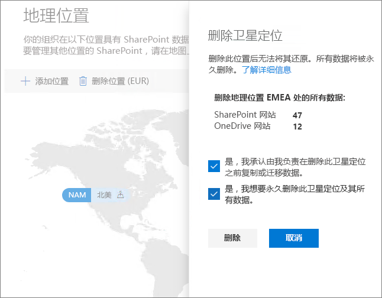

# 删除 Office 365 多地理位置中的附属位置Delete a satellite location in Office 365 Multi-Geo

如果不再需要附属位置，可以在 SharePoint 管理中心内将它从租户中删除。If you no longer need a satellite location, you can delete it from your tenant from the SharePoint admin center.

> [!WARNING]
> 附属位置中的所有用户数据都将被永久删除。All user data in the satellite location will be permanently deleted. 这包括所有 OneDrive for Business 内容、SharePoint 网站和 Exchange 邮箱（包括 Office 365 组邮箱）。This includes all OneDrive for Business content, SharePoint sites and Exchange mailboxes including Office 365 Group mailboxes. 删除附属位置前，必须先将所有数据都迁移到其他附属位置或中心位置。You must migrate any data to another satellite location or the central location before you delete the satellite location. 此操作无法撤消。This action cannot be undone.

只有全局管理员可以删除附属位置。Only global administrators can delete satellite locations.

删除附属位置的具体步骤To delete a satellite location

1. 打开 SharePoint 管理中心Open the SharePoint admin center

2. 导航到“地理位置”\*\*\*\* 选项卡。Navigate to the **Geo locations** tab.

3. 在地图上，单击要删除的地理位置。On the map, click the geo location that you want to delete.

4. 单击“删除位置”。\*\*\*\*Click **Delete location**.

5. 通过选择确认复选框来确认删除。Confirm the deletion by selecting the confirmation check boxes.

6. 单击“删除”。\*\*\*\*Click **Delete**.
