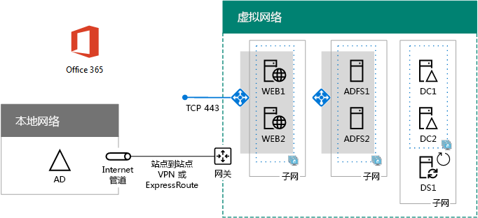

# 在 Azure 中部署 Office 365 的高可用性联合身份验证Deploy high availability federated authentication for Office 365 in Azure

 **摘要：**在 Microsoft Azure 中为 Office 365 订阅配置高可用性联合身份验证。**Summary:** Configure high availability federated authentication for your Office 365 subscription in Microsoft Azure.
  
这篇文章包含指向特定内容的链接，即通过这些虚拟机在 Azure 基础结构服务中为 Microsoft Office 365 部署高可用性联合身份验证的分步说明：This article contains links to the step-by-step instructions for deploying high availability federated authentication for Microsoft Office 365 in Azure infrastructure services with these virtual machines:
  
- 两个 Web 应用程序代理服务器Two web application proxy servers
    
- 两个 Active Directory 联合身份验证服务 (AD FS) 服务器Two Active Directory Federation Services (AD FS) servers
    
- 两个副本域控制器Two replica domain controllers
    
- 一个运行 Azure AD Connect 的目录同步 (DirSync) 服务器One directory synchronization (DirSync) server running Azure AD Connect
    
下面展示了具体配置，其中用占位符名称表示每个服务器。Here is the configuration, with placeholder names for each server.
  
**Azure 中 Office 365 基础结构的高可用性联合身份验证****A high availability federated authentication for Office 365 infrastructure in Azure**

  
所有虚拟机都位于一个跨界 Azure 虚拟网络 (VNet) 中。All of the virtual machines are in a single cross-premises Azure virtual network (VNet). 
  
> [!NOTE]
> 各个用户的联合身份验证不依赖任何本地资源。不过，如果跨界连接变得不可用，VNet 中的域控制器将无法接收本地 Windows Server AD 中执行的用户帐户和组更新。若要确保此问题不会发生，可以为跨界连接配置高可用性设置。有关详细信息，请参阅[高可用性跨界连接与 VNet 到 VNet 连接](https://docs.microsoft.com/azure/vpn-gateway/vpn-gateway-highlyavailable)Federated authentication of individual users does not rely on any on-premises resources. However, if the cross-premises connection becomes unavailable, the domain controllers in the VNet will not receive updates to user accounts and groups made in the on-premises Windows Server AD. To ensure this does not happen, you can configure high availability for your cross-premises connection. For more information, see [Highly Available Cross-Premises and VNet-to-VNet Connectivity](https://docs.microsoft.com/azure/vpn-gateway/vpn-gateway-highlyavailable)
  
用于特定角色的每对虚拟机都位于自己的子网和可用性集中。Each pair of virtual machines for a specific role is in its own subnet and availability set.
  
> [!NOTE]
> 由于此 VNet 连接到本地网络，所以此配置不包括管理子网上的跳转框或监视虚拟机。有关详细信息，请参阅 [Running Windows VMs for an N-tier architecture](https://docs.microsoft.com/azure/guidance/guidance-compute-n-tier-vm)（运行用于 N 层体系结构的 Windows VM）。Because this VNet is connected to the on-premises network, this configuration does not include jumpbox or monitoring virtual machines on a management subnet. For more information, see [Running Windows VMs for an N-tier architecture](https://docs.microsoft.com/azure/guidance/guidance-compute-n-tier-vm). 
  
此配置的结果是，将对所有 Office 365 用户使用联合身份验证，即可以使用自己的 Windows Server Active Directory 凭据（而不是 Office 365 帐户）进行登录。联合身份验证基础结构使用冗余的一组服务器，它们更易于在 Azure 基础结构服务（而非本地边缘网络）中进行部署。The result of this configuration is that you will have federated authentication for all of your Office 365 users, in which they can use their Windows Server Active Directory credentials to sign in rather than their Office 365 account. The federated authentication infrastructure uses a redundant set of servers that are more easily deployed in Azure infrastructure services, rather than in your on-premises edge network.
  
## 物料清单Bill of materials

此基线配置需要以下 Azure 服务和组件集：This baseline configuration requires the following set of Azure services and components:
  
- 七个虚拟机Seven virtual machines
    
- 一个具有四个子网的跨界虚拟网络One cross-premises virtual network with four subnets
    
- 七个存储帐户Four resource groups
    
- 四个资源组Three availability sets
    
- 三个可用性集One Azure subscription
    
这里是针对此配置的虚拟机及其默认大小。Here are the virtual machines and their default sizes for this configuration.
  
|**项目****Item**|**虚拟机说明****Virtual machine description**|**Azure 库图像****Azure gallery image**|**默认大小****Default size**|
|:-----|:-----|:-----|:-----|
|1.1.    |第一个域控制器First domain controller    |Windows Server 2016 DatacenterWindows Server 2016 Datacenter    |D2D2    |
|2.2.    |第二个域控制器Second domain controller    |Windows Server 2016 DatacenterWindows Server 2016 Datacenter    |D2D2    |
|3.3.    |Azure AD Connect 服务器Azure AD Connect server    |Windows Server 2016 DatacenterWindows Server 2016 Datacenter    |D2D2    |
|4.4.    |第一个 AD FS 服务器First AD FS server    |Windows Server 2016 DatacenterWindows Server 2016 Datacenter    |D2D2    |
|5.5.    |第二个 AD FS 服务器Second AD FS server    |Windows Server 2016 DatacenterWindows Server 2016 Datacenter    |D2D2    |
|6.6.    |第一个 Web 应用程序代理服务器First web application proxy server    |Windows Server 2016 DatacenterWindows Server 2016 Datacenter    |D2D2    |
|7.7.    |第二个 Web 应用程序代理服务器Second web application proxy server    |Windows Server 2016 DatacenterWindows Server 2016 Datacenter    |D2D2    |
   
若要计算此配置的估算成本，请参阅 [Azure 定价计算器](https://azure.microsoft.com/pricing/calculator/)To compute the estimated costs for this configuration, see the [Azure pricing calculator](https://azure.microsoft.com/pricing/calculator/)
  
## 部署阶段Phases of deployment

在以下阶段部署此工作负载：You deploy this workload in the following phases:
  
<<<<<<< 头<<<<<<< HEAD
- [高可用性联合身份验证阶段 1： 配置 Azure](high-availability-federated-authentication-phase-1-configure-azure.md)。创建资源组、 存储帐户、 可用性设置和跨内部部署的虚拟网络。[High availability federated authentication Phase 1: Configure Azure](high-availability-federated-authentication-phase-1-configure-azure.md). Create resource groups, storage accounts, availability sets, and a cross-premises virtual network.
    
- [高可用性联合身份验证阶段 2： 配置域控制器](high-availability-federated-authentication-phase-2-configure-domain-controllers.md)。创建和配置复制 Windows 服务器活动目录 (AD) 的域控制器和目录同步服务器。[High availability federated authentication Phase 2: Configure domain controllers](high-availability-federated-authentication-phase-2-configure-domain-controllers.md). Create and configure replica Windows Server Active Directory (AD) domain controllers and the DirSync server.
    
- [高可用性联合身份验证阶段 3： 配置 AD FS 服务器](high-availability-federated-authentication-phase-3-configure-ad-fs-servers.md)。创建和配置两个 AD FS 服务器。[High availability federated authentication Phase 3: Configure AD FS servers](high-availability-federated-authentication-phase-3-configure-ad-fs-servers.md). Create and configure the two AD FS servers.
    
- [高可用性联合身份验证阶段 4： 配置 web 应用程序代理服务器](high-availability-federated-authentication-phase-4-configure-web-application-pro.md)。创建和配置两个 web 应用程序代理服务器。[High availability federated authentication Phase 4: Configure web application proxies](high-availability-federated-authentication-phase-4-configure-web-application-pro.md). Create and configure the two web application proxy servers.
    
- [高可用性联合身份验证阶段 5： 配置联合身份验证针对 Office 365 提供](high-availability-federated-authentication-phase-5-configure-federated-authentic.md)。配置联合身份验证为您的 Office 365 订阅。=======[High availability federated authentication Phase 5: Configure federated authentication for Office 365](high-availability-federated-authentication-phase-5-configure-federated-authentic.md). Configure federated authentication for your Office 365 subscription. =======
- [高可用性联合身份验证阶段 1： 配置 Azure](high-availability-federated-authentication-phase-1-configure-azure.md) -创建资源组、 存储帐户、 可用性设置和跨内部部署的虚拟网络。[High availability federated authentication Phase 1: Configure Azure](high-availability-federated-authentication-phase-1-configure-azure.md) - Create resource groups, storage accounts, availability sets, and a cross-premises virtual network.
    
- [高可用性联合身份验证阶段 2： 配置域控制器](high-availability-federated-authentication-phase-2-configure-domain-controllers.md)-创建和配置复制 Windows 服务器活动目录 (AD) 的域控制器和目录同步服务器。[High availability federated authentication Phase 2: Configure domain controllers](high-availability-federated-authentication-phase-2-configure-domain-controllers.md) - Create and configure replica Windows Server Active Directory (AD) domain controllers and the DirSync server.
    
- [高可用性联合身份验证阶段 3： 配置 AD FS 服务器](high-availability-federated-authentication-phase-3-configure-ad-fs-servers.md)-创建并配置两个 AD FS 服务器。[High availability federated authentication Phase 3: Configure AD FS servers](high-availability-federated-authentication-phase-3-configure-ad-fs-servers.md) - Create and configure the two AD FS servers.
    
- [高可用性联合身份验证阶段 4： 配置 web 应用程序代理](high-availability-federated-authentication-phase-4-configure-web-application-pro.md)-创建并配置两个 web 应用程序代理服务器。[High availability federated authentication Phase 4: Configure web application proxies](high-availability-federated-authentication-phase-4-configure-web-application-pro.md) - Create and configure the two web application proxy servers.
    
- [高可用性联合身份验证阶段 5： 配置联合身份验证 Office 365](high-availability-federated-authentication-phase-5-configure-federated-authentic.md) -配置联合身份验证为您的 Office 365 订阅。[High availability federated authentication Phase 5: Configure federated authentication for Office 365](high-availability-federated-authentication-phase-5-configure-federated-authentic.md) - Configure federated authentication for your Office 365 subscription.
>>>>>>> 母版master
    
这些文章提供了预定义的体系结构的规范分阶段指南，以便在 Azure 基础结构服务中为 Office 365 Azure 创建实用的高可用性联合身份验证。请注意下列事项：These articles provide a prescriptive, phase-by-phase guide for a predefined architecture to create a functional, high availability federated authentication for Office 365 in Azure infrastructure services. Keep the following in mind:
  
- 如果你是有经验的 AD FS 实施者，则可以自由调整第 3 阶段和第 4 阶段的说明，构建最符合你需求的服务器集。If you are an experienced AD FS implementer, feel free to adapt the instructions in phases 3 and 4 and build the set of servers that best suits your needs.
    
- 如果你已经拥有现有的 Azure 混合云部署以及现有的跨界虚拟网络，则可以随意调整或跳过第 1 阶段和第 2 阶段中的说明，并将 AD FS 和 Web 应用程序代理服务器置于相应的子网上。If you already have an existing Azure hybrid cloud deployment with an existing cross-premises virtual network, feel free to adapt or skip the instructions in phases 1 and 2 and place the AD FS and web application proxy servers on the appropriate subnets.
    
若要构建开发/测试环境或此配置的概念证明，请参阅 [用于 Office 365 开发/测试环境的联合身份](federated-identity-for-your-office-365-dev-test-environment.md)。To build a dev/test environment or a proof-of-concept of this configuration, see [Federated identity for your Office 365 dev/test environment](federated-identity-for-your-office-365-dev-test-environment.md).
  
## 后续步骤Next step

使用 [高可用性联合身份验证阶段 1:配置 Azure](high-availability-federated-authentication-phase-1-configure-azure.md) 开始配置此工作负载。Start the configuration of this workload with [High availability federated authentication Phase 1: Configure Azure](high-availability-federated-authentication-phase-1-configure-azure.md). 
  
> [!TIP]
> 有关可方便在 Azure 中更快速地部署 Office 365 高可用性联合身份验证的一组文件，请参阅 [Federated Authentication for Office 365 in Azure Deployment Kit](https://gallery.technet.microsoft.com/Federated-Authentication-8a9f1664)（Azure 部署工具包中的 Office 365 联合身份验证）。For a set of files to more quickly deploy your high availability federated authentication for Office 365 in Azure, see the [Federated Authentication for Office 365 in Azure Deployment Kit](https://gallery.technet.microsoft.com/Federated-Authentication-8a9f1664). 
  
## See AlsoSee Also

[用于 Office 365 开发/测试环境的联合身份Federated identity for your Office 365 dev/test environment](federated-identity-for-your-office-365-dev-test-environment.md)
  
[云应用和混合解决方案Cloud adoption and hybrid solutions](cloud-adoption-and-hybrid-solutions.md)

[Office 365 的联合标识Federated identity for Office 365](https://support.office.com/article/Understanding-Office-365-identity-and-Azure-Active-Directory-06a189e7-5ec6-4af2-94bf-a22ea225a7a9#bk_federated)

