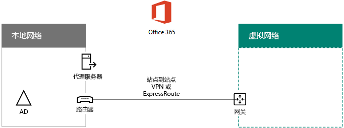
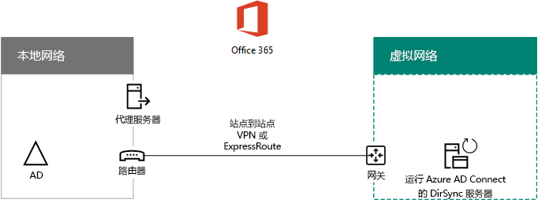

# 在 Microsoft Azure 中部署 Office 365 目录同步

 **摘要：** 在 Azure 基础结构服务中的虚拟机上部署 Azure AD Connect，以在本地目录和 Office 365 订阅的 Azure AD 租户之间同步帐户。
  
Azure Active Directory (AD) Connect（以前称为 Directory Synchronization 工具、Directory Sync 工具或 DirSync.exe 工具）是用户在加入域的服务器上安装的应用程序，用于将本地 Active Directory 域服务 (AD DS) 用户同步到 Office 365 订阅的 Azure AD 租户。Office 365 使用 Azure Active Directory (Azure AD) 作为其目录服务。Office 365 订阅包括 Azure AD 租户。此租户还可用于管理组织的标识以及其他云工作负载，包括 Azure 中的其他 SaaS 应用程序和应用。

可以在本地服务器上安装 Azure AD Connect，但也可以将其安装在 Azure 中的虚拟机上，具体原因如下：
  
- 可以更快地预配和配置基于云的服务器，使服务更快地提供给用户使用。
- Azure 可以更轻松地提供更好的网站可用性。
- 可以减少组织中本地服务器的数量。

此解决方案要求在本地网络和 Azure 虚拟网络之间建立连接。有关详细信息，请参阅[将本地网络连接到 Microsoft Azure 虚拟网络](connect-an-on-premises-network-to-a-microsoft-azure-virtual-network.md)。 
  
> [!NOTE]
> 本文介绍了单个林中单个域的同步。Azure AD Connect 将 Active Directory 林中的所有 AD DS 域与 Office 365 同步。如果你有多个 Active Directory 林要与 Office 365 同步，请参阅[使用单一登录的多林目录同步方案](https://go.microsoft.com/fwlink/p/?LinkId=393091)。 
  
## 在 Azure 中部署 Office 365 目录同步的概述

下图显示了在将本地 AD DS 林同步到 Office 365 订阅的 Azure（目录同步服务器）中的虚拟机上运行的 Azure AD Connect。
  

  
图中有两个通过站点间 VPN 或 ExpressRoute 连接进行连接的网络：一个是 AD DS 域控制器所在的本地网络，另外一个是带有目录同步服务器的 Azure 虚拟网络，目录同步服务器是一个运行 [Azure AD Connect](https://www.microsoft.com/download/details.aspx?id=47594) 的虚拟机。有两个主要通信流源自目录同步服务器：
  
-  Azure AD Connect 查询本地网络上的域控制器以获取对帐户和密码的更改。
-  Azure AD Connect 将帐户和密码的更改发送到 Office 365 订阅的 Azure AD 实例。因为目录同步服务器处于你的本地网络中的扩展部分，这些更改会通过本地网络的代理服务器进行发送。
    
> [!NOTE]
> 本解决方案描述单个 Active Directory 林中单个 Active Directory 域的同步。Azure AD Connect 将 Active Directory 林中的所有 Active Directory 域与 Office 365 同步。如果你有多个 Active Directory 林要与 Office 365 同步，请参阅[使用单一登录的多林目录同步方案](https://go.microsoft.com/fwlink/p/?LinkId=393091)。 
  
部署此解决方案时有两个主要步骤：
  
1. 创建 Azure 虚拟网络和建立到本地网络的站点间 VPN 连接。有关详细信息，请参阅[将本地网络连接到 Microsoft Azure 虚拟网络](connect-an-on-premises-network-to-a-microsoft-azure-virtual-network.md)。
    
2. 在 Azure 中加入域的虚拟机上安装 [Azure AD Connect](https://www.microsoft.com/download/details.aspx?id=47594)，然后将本地 AD DS 同步到 Office 365。这包括：
    
    创建 Azure 虚拟机以运行 Azure AD Connect。
    
    安装和配置 [Azure AD Connect](https://www.microsoft.com/download/details.aspx?id=47594)。
    
    要配置 Azure AD Connect，必须提供 Azure AD 管理员帐户和 AD DS 企业管理员帐户的凭据（用户名和密码）。Azure AD Connect 会立即运行并且会不间断地将本地 AD DS 林同步到 Office 365。
    
在生产中部署此解决方案之前，可以使用 [Office 365 开发/测试环境目录同步](dirsync-for-your-office-365-dev-test-environment.md)中的说明，将此配置设置为用于演示或实验的概念证明。
  
> [!IMPORTANT]
> Azure AD Connect 配置完成后，它不会保存 AD DS 企业管理员帐户凭据。 
  
> [!NOTE]
> 此解决方案说明如何将单个 AD DS 林同步到 Office 365。本文中讨论的拓扑只是表示实现此解决方案的一种方法。根据你的特殊网络要求和安全考虑事项，你组织的拓扑可能有所不同。 
  
## 规划将 Office 365 的目录同步服务器托管在 Azure 中

### 先决条件

开始操作之前，请查看此解决方案的以下先决条件。
  
- 查阅[规划你的 Azure 虚拟网络](connect-an-on-premises-network-to-a-microsoft-azure-virtual-network.md#plan-your-azure-virtual-network)中有关规划的内容。
    
- 确保满足配置 Azure 虚拟网络的所有[先决条件](connect-an-on-premises-network-to-a-microsoft-azure-virtual-network.md#prerequisites)。
    
- 具有包含 Active Directory 集成功能的 Office 365 订阅。有关 Office 365 订阅的信息，请转到 [Office 365 订阅页面](https://products.office.com/compare-all-microsoft-office-products?tab=2)。
    
- 预配一个运行 Azure AD Connect 的 Azure 虚拟机，以便将本地 AD DS 林与 Office 365 同步。
    
    必须具有 AD DS 企业管理员帐户和 Azure AD 管理员帐户的凭据（名称和密码）。
    
### 解决方案体系结构设计假设

下面列出了此解决方案需做出的设计选择。
  
- 此解决方案使用具有站点间 VPN 连接的单个 Azure 虚拟网络。Azure 虚拟网络托管包含一个服务器（即运行 Azure AD Connect 的目录同步服务器）的单个子网。 
    
- 在本地网络中，存在域控制器和 DNS 服务器。
    
- Azure AD Connect 执行密码哈希同步而不是单一登录。你无需部署 Active Directory 联合身份验证服务 (AD FS) 基础结构。要了解有关密码哈希同步和单一登录选项的详细信息，请参阅[为 Azure Active Directory 混合标识解决方案选择正确的身份验证方法](http://aka.ms/auth-options)。
    
下面是在环境中部署此解决方案时可能会考虑的一些其他设计选项：
  
- 如果现有的 Azure 虚拟网络中已有 DNS 服务器，请确定是否希望目录同步服务器取代本地网络的 DNS 服务器将其用于名称解析。
    
- 如果现有的 Azure 虚拟网络中存在域控制器，请确定配置 Active Directory 站点和服务是否为更好的选择。目录同步服务器可以用 Azure 虚拟网络中的域控制器查询帐户和密码的更改，而不是使用本地网络上的域控制器。
    
## 部署路线图

在 Azure 的虚拟机上部署 Azure AD Connect 的过程包含三个阶段：
  
- 阶段 1：创建和配置 Azure 虚拟网络
    
- 阶段 2：创建和配置 Azure 虚拟机
    
- 阶段 3：安装和配置 Azure AD Connect
    
部署之后，还必须为 Office 365 中的新用户帐户分配位置和许可证。

<!--  
> [!TIP]
> The [Directory Synchronization Server in Azure Deployment Kit](https://gallery.technet.microsoft.com/DirSync-Server-in-Azure-32cb2ded) has all of the Azure PowerShell blocks to build out this solution, the diagrams in Microsoft PowerPoint and Visio format, and a Microsoft Excel configuration workbook that generates Azure PowerShell command blocks customized for your settings.
-->
  
### 第 1 阶段：创建和配置 Azure 虚拟网络

要创建和配置 Azure 虚拟网络，请完成[将本地网络连接到 Microsoft Azure 虚拟网络](connect-an-on-premises-network-to-a-microsoft-azure-virtual-network.md)部署路线图中的[阶段 1：准备你的本地网络](connect-an-on-premises-network-to-a-microsoft-azure-virtual-network.md#phase-1-prepare-your-on-premises-network)和[阶段 2：在 Azure 中创建跨界虚拟网络](connect-an-on-premises-network-to-a-microsoft-azure-virtual-network.md#phase-2-create-the-cross-premises-virtual-network-in-azure)。
  
这是生成的配置。
  

  
该图显示了通过站点间 VPN 或 ExpressRoute 连接来连接到 Azure 虚拟网络的本地网络。
  
### 阶段 2：创建和配置 Azure 虚拟机

按照[在 Azure 门户中创建第一个 Windows 虚拟机](https://go.microsoft.com/fwlink/p/?LinkId=393098)中的说明在 Azure 中创建虚拟机。使用以下设置：
  
- 在“**基本信息**”窗格中，选择与虚拟网络相同的订阅、位置和资源组。在安全的位置记录用户名和密码。你稍后将需要使用这些以连接到虚拟机。
    
- 在“选择大小”**** 窗格中，请选择“A2 标准”**** 大小。
    
- 在“设置”**** 窗格的“存储”**** 部分中，选择“标准”**** 存储类型。在“网络”**** 部分中，选择虚拟网络的名称和托管目录同步服务器（不是 GatewaySubnet）的子网。其他所有设置都保留默认值。
    
通过检查内部 DNS 验证目录同步服务器是否正确使用 DNS，以确保为具有其 IP 地址的虚拟机添加地址 (A) 记录。 
  
按照[连接到虚拟机并登录](https://docs.microsoft.com/azure/virtual-machines/virtual-machines-windows-hero-tutorial?toc=%2fazure%2fvirtual-machines%2fwindows%2ftoc.json#connect-to-the-virtual-machine-and-sign-on)中的说明，使用远程桌面连接来连接到目录同步服务器。登录后，将虚拟机加入到本地 AD DS 域。
  
若要使用 Azure AD Connect 访问 Internet 资源，必须将目录同步服务器配置为使用本地网络的代理服务器。有关要执行的其他配置步骤，应与网络管理员联系。
  
这是生成的配置。
  

  
该图显示跨界 Azure 虚拟网络中的目录同步服务器虚拟机。
  
### 阶段 3：安装和配置 Azure AD Connect

请完成以下过程：
  
1. 通过远程桌面连接，使用具有本地管理员特权的 AD DS 域帐户连接到目录同步服务器。请参阅[连接到虚拟机并登录](https://docs.microsoft.com/azure/virtual-machines/virtual-machines-windows-hero-tutorial?toc=%2fazure%2fvirtual-machines%2fwindows%2ftoc.json#connect-to-the-virtual-machine-and-sign-on)。
    
2. 从目录同步服务器中打开[设置 Office 365 的目录同步](set-up-directory-synchronization.md)一文，并按照使用密码哈希同步进行目录同步的说明操作。
    
> [!CAUTION]
> 安装程序将在本地用户组织单位 (OU) 中创建 **AAD_xxxxxxxxxxxx** 帐户。请勿移动或删除该帐户，否则同步将失败。
  
这是生成的配置。
  

  
该图显示跨界 Azure 虚拟网络中具有 Azure AD Connect 的目录同步服务器。
  
### 将位置和许可证分配给 Office 365 中的用户

Azure AD Connect 将帐户从本地 AD DS 添加到 Office 365 订阅，但为了使用户能够登录到 Office 365 并使用其服务，必须使用位置和许可证配置这些帐户。使用下列步骤为适当的用户帐户添加位置和激活许可证：
  
1. 登录到 [Office 365 门户页](https://www.office.com)，然后单击“管理员”****。
    
2. 在左侧导航栏中，单击“用户”>“活动用户”****。
    
3. 在用户帐户列表中，选中你想要激活的用户旁的复选框。
    
4. 在用户页面上，单击“产品许可证”**** 的“编辑”****。
    
5. 在“产品许可证”**** 页上，为“位置”**** 选择一个用户位置，然后为用户启用合适的许可证。
    
6. 完成后，单击“保存”****，然后单击“关闭”**** 两次。
    
7. 对于其他用户，请返回步骤 3。
    
## 另请参阅

[云应用和混合解决方案](cloud-adoption-and-hybrid-solutions.md)
  
[将本地网络连接到 Microsoft Azure 虚拟网络](connect-an-on-premises-network-to-a-microsoft-azure-virtual-network.md)

[下载 Azure AD Connect](https://www.microsoft.com/download/details.aspx?id=47594)
  
[设置 Office 365 的目录同步](set-up-directory-synchronization.md)
  
<!--
[Directory Synchronization server in Azure Deployment Kit](https://gallery.technet.microsoft.com/DirSync-Server-in-Azure-32cb2ded)
-->

