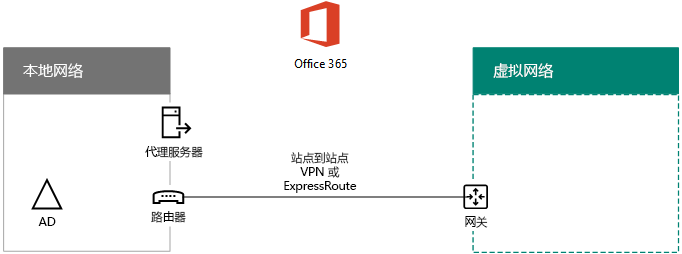
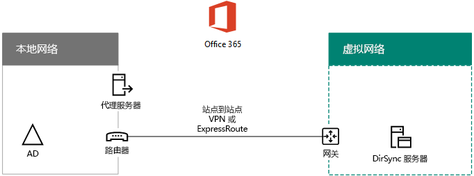

# 在 Microsoft Azure 中部署 Office 365 目录同步 (DirSync)

 **摘要：**在 Azure 同步您的内部目录和 Office 365 订购的 Azure AD 租户之间的帐户中的虚拟机上部署 Azure AD 连接 （目录同步）。
  
Azure 的活动目录 (AD) 连接 （以前称为目录同步工具、 目录同步工具或 DirSync.exe 工具） 是基于服务器的应用程序，它在加入域的服务器上安装同步您的本地 Windows 服务器活动目录用户定向到 Office 365 订购的 Azure Active Directory 租户。您可以在本地服务器上，安装 Azure AD 连接但您也可以安装它在 Azure 中的虚拟机上，原因如下：
  
- 您可以更快地设置和配置基于云的服务器，使服务更快地提供给用户使用。
    
- Azure 提供更好的网站可用性，事半功倍。
    
- 可以减少组织中内部部署服务器的数量。
    
> [!IMPORTANT]
> 此解决方案要求您的内部网络和 Azure 虚拟网络之间的连接。有关详细信息，请参阅[连接到 Microsoft Azure 虚拟网络的内部网络](connect-an-on-premises-network-to-a-microsoft-azure-virtual-network.md)。 
  
> [!IMPORTANT]
> 本文介绍了单个域中采用单目录林同步。Azure AD 连接与 Office 365 同步活动目录林中的所有 Windows 服务器 AD 域。如果您有多个活动目录林与 Office 365 进行同步，请参阅[使用单点登录方案多林目录同步](https://go.microsoft.com/fwlink/p/?LinkId=393091)。 
  
> [!NOTE]
> Office 365 的目录服务使用 Azure 活动目录 (AD Azure)。Office 365 订阅包括 Azure AD 租户。此租户还可以用于对您的组织的标识，与其他云的工作负载，在 Azure 中包括其他 SaaS 应用程序和应用程序的管理。 
  
## 在 Azure 中部署 Office 365 目录同步的概述

下图显示了 Azure AD 连接在同步到 anOffice 365 订阅内部 Windows 服务器 AD 林中的 Azure (DirSync server) 中的虚拟机上运行。
  

  
在图中，有两个网络连接的站点到站点 VPN 或 ExpressRoute 连接。没有，Windows 服务器 AD 域控制器位于和没有与目录同步服务器，这是虚拟机 Azure 虚拟网络内部网络运行[Azure AD 连接](https://www.microsoft.com/download/details.aspx?id=47594)。有来自目录同步服务器的两个主要的通信流：
  
-  Azure AD Connect 查询本地网络上的域控制器以获取对帐户和密码的更改。
    
-  Azure AD 连接发送帐户和密码的 Office 365 订阅的 Azure AD 实例所做的更改。由于目录同步服务器位于内部网络的扩展部分，都在通过内部网络的代理服务器发送这些更改。
    
> [!NOTE]
> 此解决方案说明单个 Active Directory 域，在一个单一的活动目录林同步。Azure AD 连接与 Office 365 同步活动目录林中的所有 Active Directory 域。如果您有多个活动目录林与 Office 365 进行同步，请参阅[使用单点登录方案多林目录同步](https://go.microsoft.com/fwlink/p/?LinkId=393091)。 
  
在这两种情况下，源自 Azure Azure 的虚拟机上运行的 AD 连接的通信转发到 Azure，然后转发通讯通过站点到站点 VPN 或 ExpressRoute 连接到 VPN 网关设备的虚拟网络上的网关内部网络中。内部网络的路由结构然后转发到其目的地，如域控制器或代理服务器的通信。
  
部署此解决方案时有两个主要步骤：
  
1. 创建了一个 Azure 的虚拟网络，并建立站点到站点 VPN 连接到内部网络。有关详细信息，请参阅[连接到 Microsoft Azure 虚拟网络的内部网络](connect-an-on-premises-network-to-a-microsoft-azure-virtual-network.md)。
    
2. 在 Azure，加入域的虚拟机上安装[Azure AD 连接](https://www.microsoft.com/download/details.aspx?id=47594)，然后在同步内部 Windows 服务器 AD 到 Office 365。这包括：
    
    创建运行 Azure AD 连接 Azure 虚拟机。
    
    安装和配置[Azure AD 连接](https://www.microsoft.com/download/details.aspx?id=47594)。
    
    配置 Azure AD 连接需要 Azure AD 管理员帐户和 Windows 服务器 AD 企业管理员帐户的凭据 （用户名和密码）。Azure AD 连接运行立即并持续同步到 Office 365 的内部部署 Windows 服务器 AD 林。
    
在部署此解决方案在生产环境中的之前，按照[您 Office 365 的开发/测试环境的目录同步](dirsync-for-your-office-365-dev-test-environment.md)中的说明设置此配置作为概念，用于演示，或实验验证。
  
> [!IMPORTANT]
> Azure AD Connect 配置完成后，它不会保存 Windows Server AD 企业管理员帐户凭据。 
  
> [!NOTE]
> 此解决方案说明同步单个 Windows 服务器 AD 林到 Office 365。本文中介绍的拓扑表示方法只有一种实现这一解决方案。您的组织的拓扑可能会不同，根据您独特的网络要求和安全注意事项。 
  
## 规划将 Office 365 的 DirSync 服务器托管在 Azure 中

### 先决条件

开始操作之前，请查看此解决方案的以下先决条件。
  
- 查看[计划 Azure 虚拟网络](connect-an-on-premises-network-to-a-microsoft-azure-virtual-network.md#PlanningVirtual)中的相关规划内容。
    
- 请确保您满足所有[先决条件](connect-an-on-premises-network-to-a-microsoft-azure-virtual-network.md#Prerequisites)Azure 的虚拟网络的配置。
    
- 有包括 Active Directory 集成功能的 Office 365 订阅。有关 Office 365 的订阅信息，请转到[Office 365 订阅页面](https://go.microsoft.com/fwlink/p/?LinkId=394278)。
    
- 设置运行 Azure AD 连接与 Office 365 同步内部 Windows 服务器 AD 林中的一个 Azure 虚拟机。
    
    必须具有企业管理员帐户的 Windows 服务器 AD 和 Azure 活动目录管理员帐户的凭据 （名称和密码）。
    
### 解决方案体系结构设计假设

下面列出了此解决方案需做出的设计选择。
  
- 本解决方案使用一个 Azure 虚拟网络的站点到站点 VPN 连接。在 Azure 的虚拟网络承载一个子网，其中包含一台服务器、 运行 Azure AD 连接的目录同步服务器。 
    
- 在内部部署网络中，域控制器和 DNS 服务器存在。
    
- Azure AD 连接执行而不是单一登录的密码同步。不需要部署 Active Directory 联合身份验证服务 (AD FS）) 的基础结构。若要了解有关密码同步和单一登录选项的详细信息，请参阅[确定要使用哪个目录集成方案](https://go.microsoft.com/fwlink/p/?LinkId=393094)。
    
下面是您在环境中部署此解决方案时可能会考虑的一些其他设计选项：
  
- 如果存在现有的 Azure 虚拟网络中的 DNS 服务器，请确定是否要使用它们来进行名称解析，而不是在内部网络上的 DNS 服务器的目录同步服务器。
    
- 如果现有 Azure 虚拟网络中的域控制器，请确定是否配置 Active Directory 站点和服务可能会为您更好的选择。目录同步服务器可以查询 Azure 中的帐户和密码，而不是在内部网络上的域控制器的更改虚拟网络中的域控制器。
    
## 部署路线图

部署在 Azure 中的虚拟机上的 Azure AD 连接的三个阶段包括：
  
- 阶段 1：创建和配置 Azure 虚拟网络
    
- 阶段 2：创建和配置 Azure 虚拟机
    
- 阶段 3：安装和配置 Azure AD Connect
    
部署之后，还必须为 Office 365 中的新用户帐户分配位置和许可证。
  
> [!TIP]
> [在 Azure 部署工具包中的目录同步服务器](https://gallery.technet.microsoft.com/DirSync-Server-in-Azure-32cb2ded)包含所有的 Azure PowerShell 块来构建此解决方案、 Microsoft PowerPoint 和 Visio 格式中的关系图和生成 Azure PowerShell 的 Microsoft Excel 配置工作簿为您的设置自定义的命令块。
  
### 阶段 1：创建和配置 Azure 虚拟网络

若要创建和配置的 Azure 的虚拟网络，完成[阶段 1： 准备您的内部网络](connect-an-on-premises-network-to-a-microsoft-azure-virtual-network.md#Phase1)和[第 2 阶段： 在 Azure 创建跨部署虚拟网络](connect-an-on-premises-network-to-a-microsoft-azure-virtual-network.md#Phase2)中部署路线图的[连接到内部网络Microsoft Azure 虚拟网络](connect-an-on-premises-network-to-a-microsoft-azure-virtual-network.md)。
  
这是生成的配置。
  

  
该图显示了通过站点到站点 VPN 或 ExpressRoute 连接来连接到 Azure 虚拟网络的本地网络。
  
### 阶段 2：创建和配置 Azure 虚拟机

在 Azure 使用的说明[创建第一个 Windows 虚拟机在 Azure 的门户网站中](https://go.microsoft.com/fwlink/p/?LinkId=393098)创建虚拟机。使用以下设置：
  
- 上**基本操作**窗格中，选择相同的订阅、 位置和资源组作为虚拟网络。在安全的位置，记录用户名称和密码。您将需要使用这些以后连接到虚拟机。
    
- 在**选择大小**窗格中，选择**A2 标准**大小。
    
- 在**设置**窗格中，在**存储**部分中选择**标准**的存储类型。在**网络**部分中，选择虚拟网络和子网的名称所在的目录同步服务器 (不是 GatewaySubnet)。将所有其他设置保留为其默认值。
    
通过检查内部 DNS 验证 DirSync 服务器是否正确使用 DNS，以确保为具有 IP 地址的虚拟机添加地址 (A) 记录。 
  
使用中的说明[连接到虚拟机并登录](https://docs.microsoft.com/azure/virtual-machines/virtual-machines-windows-hero-tutorial?toc=%2fazure%2fvirtual-machines%2fwindows%2ftoc.json#connect-to-the-virtual-machine-and-sign-on)到远程桌面连接的目录同步服务器连接。登录后，加入本地 Windows 服务器 AD 域虚拟机。
  
若要使用 Azure AD Connect 访问 Internet 资源，必须将 DirSync 服务器配置为使用本地网络的代理服务器。有关要执行的其他配置步骤，你应与网络管理员联系。
  
这是生成的配置。
  

  
该图显示跨界 Azure 虚拟网络中的 DirSync 服务器虚拟机。
  
### 阶段 3：安装和配置 Azure AD Connect

请完成以下过程：
  
1. 连接到远程桌面连接使用具有本地管理员权限的 Windows 服务器 AD 域帐户目录同步服务器。请参阅[连接到虚拟机并登录](https://docs.microsoft.com/azure/virtual-machines/virtual-machines-windows-hero-tutorial?toc=%2fazure%2fvirtual-machines%2fwindows%2ftoc.json#connect-to-the-virtual-machine-and-sign-on)。
    
2. 从目录同步服务器，打开[设置目录同步在 Office 365](https://support.office.com/article/Set-up-directory-synchronization-in-Office-365-1b3b5318-6977-42ed-b5c7-96fa74b08846)的文章并按照指导目录同步密码同步。
    
> [!CAUTION]
> 安装程序会在本地用户的组织单位 (OU) 创建的**AAD_xxxxxxxxxxxx**帐户。不要移动或删除该帐户或同步将失败。
  
这是生成的配置。
  

  
该图显示跨界 Azure 虚拟网络中具有 Azure AD Connect 的 DirSync 服务器。
  
### 将位置和许可证分配给 Office 365 中的用户

Azure AD Connect 将帐户从本地 Windows Server AD 添加到 Office 365 订阅，但为了使用户能够登录到 Office 365 并使用它的服务，必须使用位置和许可证配置这些帐户。使用下列步骤为适当的用户帐户添加位置和激活许可证：
  
1. [Office 365 门户页面](https://portal.office.com)时，登录，然后单击**管理**。
    
2. 在左边的导航，请单击**用户 > 活动用户**。
    
3. 在用户帐户列表中，选中你想要激活的用户旁的复选框。
    
4. 在用户的页面上，单击**产品**许可证的**编辑**。
    
5. 在**产品许可**页中，选择**位置**，用户的位置，然后启用适当许可的用户。
    
6. 完成后，单击**保存**，然后单击**关闭**两次。
    
7. 对于其他用户，请返回步骤 3。
    
## See Also

[云应用和混合解决方案](cloud-adoption-and-hybrid-solutions.md)
  
[将内部网络连接到 Microsoft Azure 虚拟网络](connect-an-on-premises-network-to-a-microsoft-azure-virtual-network.md)

[下载 Azure AD 连接](https://www.microsoft.com/download/details.aspx?id=47594)
  
[Office 365 中的目录同步设置](https://support.office.com/article/Set-up-directory-synchronization-in-Office-365-1b3b5318-6977-42ed-b5c7-96fa74b08846)
  
[在 Azure 部署工具包中的目录同步服务器](https://gallery.technet.microsoft.com/DirSync-Server-in-Azure-32cb2ded)

