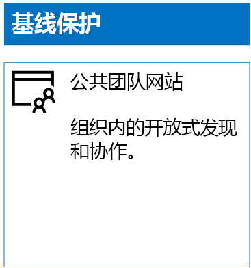
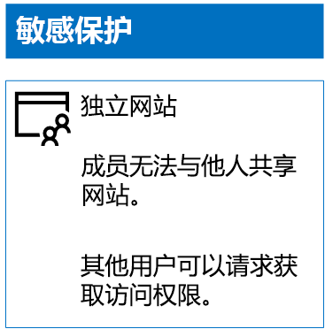
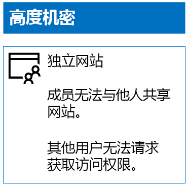

# 部署 SharePoint Online 网站的三个层次的保护

 **摘要：**创建和配置 SharePoint Online 的团队站点的各种级别的信息保护。
  
使用本文中的步骤设计和部署基线、敏感和高度机密的 SharePoint Online 团队网站。 有关三层保护的详细信息，请参阅[保护 SharePoint Online 网站和文件](secure-sharepoint-online-sites-and-files.md)。
  
## 基线 SharePoint Online 团队网站

基线保护同时包括公共和专用团队网站。 组织中的任何人均可发现并访问公共团队网站。 只有与团队网站关联的 Office 365 组的成员才可以发现并访问专用网站。 两种类型的团队网站均允许成员与他人共享网站。
  
### 公用

若要创建具有公共访问和权限的基线 SharePoint Online 团队网站，请执行以下操作：
  
1. 登录到 Office 365 门户网站也将用来管理 SharePoint Online 工作组网站 （SharePoint Online 管理员） 的帐户。有关帮助信息，请参阅[登录到 Office 365 的位置](https://support.office.com/Article/Where-to-sign-in-to-Office-365-e9eb7d51-5430-4929-91ab-6157c5a050b4)。
    
2. 在磁贴列表中，单击“SharePoint”。
    
3. 在浏览器的新“SharePoint”标签页中，单击“+ 创建网站”。
    
4. 在“创建网站”页中，单击“团队网站”。
    
5. 在“网站名称”中，键入公共团队网站的名称。 
    
6. 在“团队网站说明”中，键入关于网站用途的说明。
    
7. 在**隐私设置**选择**公用-组织中的任何人都可以访问该网站**，，然后单击**下一步**。
    
8. 在“希望添加哪些人员?”窗格中，单击“完成”。
    
下面是生成的配置。
  

  
### Private

若要创建具有私有访问和权限的基线 SharePoint Online 团队网站，请执行以下操作：
  
1. 登录到 Office 365 门户网站也将用来管理 SharePoint Online 工作组网站 （SharePoint Online 管理员） 的帐户。有关帮助信息，请参阅[登录到 Office 365 的位置](https://support.office.com/Article/Where-to-sign-in-to-Office-365-e9eb7d51-5430-4929-91ab-6157c5a050b4)。
    
2. 在磁贴列表中，单击“SharePoint”。
    
3. 在浏览器的新“SharePoint”标签页中，单击“+ 创建网站”。
    
4. 在“创建网站”页中，单击“团队网站”。
    
5. 在“网站名称”中，键入专用团队网站的名称。 
    
6. 在**团队站点的说明**中，键入网站的用途的说明。
    
7. 在**隐私设置**，选择**专用的只有成员才能访问此网站**，然后单击**下一步**。
    
8. 在“希望添加哪些人员?”窗格中的“添加成员”中，键入有权访问此专用团队网站的用户帐户的名称。
    
9. 当您完成将最初的成员集添加到该网站，单击**完成**
    
下面是生成的配置。
  

  
## 敏感 SharePoint Online 团队网站

敏感 SharePoint Online 团队网站是独立的团队网站，这意味着通过 SharePoint 组的成员身份而不是与该团队网站关联的 Office 365 组中的成员身份控制权限。
  
若要创建独立的工作组网站，有两个主要步骤。
  
### 步骤 1：设计独立网站

要设计独立的团队网站，需要确定：
  
- SharePoint 组和权限级别。
    
- 将中的 SharePoint 组成员的访问组的组。
    
     访问组的推荐的设置是站点成员之一、 网站浏览者和站点管理员。
    
- 是否会在访问组中使用嵌套组。
    
例如，建议的组结构和权限级别如下所示：
  
|**SharePoint 组**|**权限级别**|**访问组（示例）**|
|:-----|:-----|:-----|
|[网站名称] 成员    |编辑    |[网站名称] 成员    |
|[网站名称] 访问者    |读取    |[网站名称] 查看者    |
|[网站名称] 所有者    |完全控制    |[网站名称] 管理员    |
   
默认情况下，为团队网站创建了 SharePoint 组和权限级别。 需要确定访问组的名称。
  
有关设计过程的详细信息，请参阅[设计独立的 SharePoint Online 团队网站](design-an-isolated-sharepoint-online-team-site.md)。
  
### 步骤 2：部署独立网站

要部署独立网站，首先需要：
  
- 确定要添加到每个访问组的用户帐户和组。
    
- 创建访问组并添加用户和组成员。
    
有关详细步骤，请参阅[部署独立的在线 SharePoint 工作组网站](deploy-an-isolated-sharepoint-online-team-site.md)的**第一阶段**。
  
接下来，使用以下步骤创建 SharePoint Online 的工作组网站。
  
1. 登录到 Office 365 门户网站也将用来管理 SharePoint Online 工作组网站 （SharePoint Online 管理员） 的帐户。有关帮助信息，请参阅[登录到 Office 365 的位置](https://support.office.com/Article/Where-to-sign-in-to-Office-365-e9eb7d51-5430-4929-91ab-6157c5a050b4)。
    
2. 在磁贴列表中，单击“SharePoint”。
    
3. 在您的浏览器的新**SharePoint**选项卡，单击**+ 创建网站**。
    
4. 在“创建网站”页中，单击“团队网站”。
    
5. 在“网站名称”中，键入专用团队网站的名称。
    
6. 在**团队站点的说明**中，键入可选的说明。
    
7. 在**隐私设置**，选择**专用的只有成员才能访问此网站**，然后单击**下一步**。
    
8. 在“希望添加哪些人员?”窗格中，单击“完成”。
    
接下来，在新的 SharePoint Online 团队网站中，使用以下步骤配置权限。
  
1. 确定用户的 IT 管理员或其他人员将负责响应和解决对网站的访问请求主体名称 (UPN) （belindan@contoso.com 是 UPN 的示例）。编写该 UPN 此处: ___。
    
2. 在工具栏上，单击设置图标，然后单击**网站权限**。
    
3. 在“网站权限”窗格中，单击“高级权限设置”。
    
4. 在浏览器的新“权限”标签页中，单击“访问请求设置”。
    
5. 在“访问请求设置”对话框中：
    
  - 清除“允许成员共享网站和单独的文件和文件夹”和“允许成员邀请他人到网站成员组”复选框。
    
  - 在“发送所有访问请求”中键入步骤 1 中的 IT 管理员的 UPN。
    
  - 单击" **确定**"。
    
6. 在浏览器的新“权限”标签页中，单击列表中的“[网站名称] 成员”。
    
7. 在**用户和用户组**中，单击**新建**。
    
8. 在**共享**对话框中，键入此站点的站点成员访问组的名称，选择它，然后单击**共享**。
    
9. 单击浏览器上的后退按钮。
    
10. 在列表中单击**[网站名称] 所有者**。
    
11. 在**用户和用户组**中，单击**新建**。
    
12. 在**共享**对话框中，键入此站点的管理员访问权限的网站用户组的名称，选择它，然后单击**共享**。
    
13. 单击浏览器上的后退按钮。
    
14. 单击**[网站名称] 的访问者**列表中。
    
15. 在**用户和用户组**中，单击**新建**。
    
16. 在**共享**对话框中，键入此站点的站点浏览者访问组的名称，选择它，然后单击**共享**。
    
17. 关闭浏览器的“权限”选项卡。
    
这些权限设置的结果是：
  
- [网站名称] 所有者：SharePoint 组包含网站管理员访问组，其中的所有成员均具有完全控制权限级别。
    
- [网站名称] 成员：SharePoint 组包含网站成员访问组，其中的所有成员均具有编辑权限级别。
    
- [网站名称] 访问者：SharePoint 组包含网站查看者访问组，其中的所有成员均具有读取权限级别。
    
- 禁用成员邀请其他成员的功能。
    
- 启用非成员请求访问的功能。
    
下面是生成的配置。
  

  
通过其中一个访问组的组成员身份，网站成员现可对网站资源进行安全协作。
  
## 高度机密的 SharePoint Online 团队网站

高度机密的 SharePoint Online 团队网站是独立的团队网站，这意味着通过 SharePoint 组的成员身份而不是与该团队网站关联的 Office 365 组中的成员身份控制权限。
  
要针对高度机密的信息和协作创建独立的团队网站，需要完成两个主要步骤。
  
### 步骤 1：设计独立网站

要设计独立的团队网站，需要确定：
  
- SharePoint 组和权限级别。
    
- 将中的 SharePoint 组成员的访问组的组。
    
     访问组的推荐的设置是站点成员之一、 网站浏览者和站点管理员。
    
- 是否会在访问组中使用嵌套组。
    
例如，建议的组结构和权限级别如下所示：
  
|**SharePoint 组**|**权限级别**|**访问组（示例）**|
|:-----|:-----|:-----|
|[网站名称] 成员    |编辑    |[网站名称] 成员    |
|[网站名称] 访问者    |读取    |[网站名称] 查看者    |
|[网站名称] 所有者    |完全控制    |[网站名称] 管理员    |
   
默认情况下，为团队网站创建了 SharePoint 组和权限级别。 需要确定访问组的名称。
  
有关设计过程的详细信息，请参阅[设计独立的 SharePoint Online 团队网站](design-an-isolated-sharepoint-online-team-site.md)。
  
### 步骤 2：部署独立网站

要部署独立网站，首先需要：
  
- 确定每种访问组的用户和组成员
    
- 创建访问组并添加用户和组成员
    
- 创建使用访问组独立的团队站点
    
有关详细步骤，请参阅[部署独立的 SharePoint Online 团队网站](deploy-an-isolated-sharepoint-online-team-site.md)。
  
权限设置的结果是：
  
- [网站名称] 所有者：SharePoint 组包含网站管理员访问组，其中的所有成员均具有完全控制权限级别。
    
- [网站名称] 成员：SharePoint 组包含网站成员访问组，其中的所有成员均具有编辑权限级别。
    
- [网站名称] 访问者：SharePoint 组包含网站查看者访问组，其中的所有成员均具有读取权限级别。
    
- 禁用成员邀请其他成员的功能。
    
- 禁用非成员请求访问的功能。
    
生成的配置如下。
  

  
通过其中一个访问组的组成员身份，网站成员现可对网站资源进行安全协作。
  
## 后续步骤

[Office 365 标签和 DLP 与 SharePoint Online 文件保护](protect-sharepoint-online-files-with-office-365-labels-and-dlp.md)
    
## 另请参阅

[SharePoint Online 网站和文件保护](secure-sharepoint-online-sites-and-files.md)
  
[开发/测试环境中保护 SharePoint Online 站点](secure-sharepoint-online-sites-in-a-dev-test-environment.md)
  
[Microsoft 针对政治宣传活动、非营利组织和其他敏捷性组织的安全指南](microsoft-security-guidance-for-political-campaigns-nonprofits-and-other-agile-o.md)
  
[云应用和混合解决方案](cloud-adoption-and-hybrid-solutions.md)

