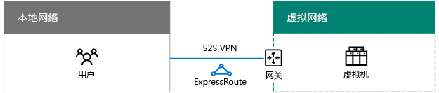
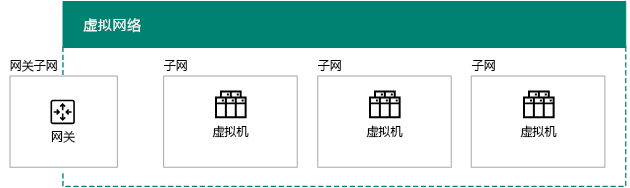
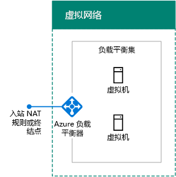
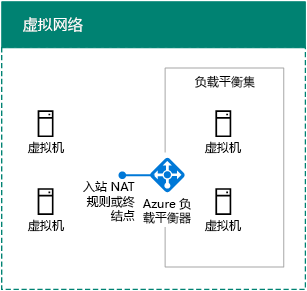
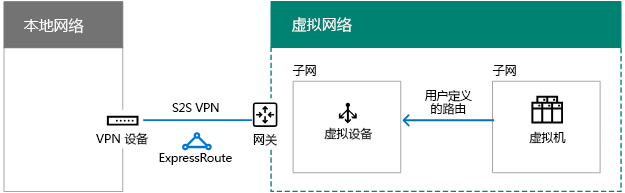
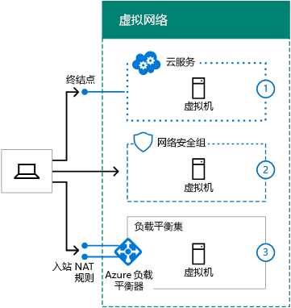
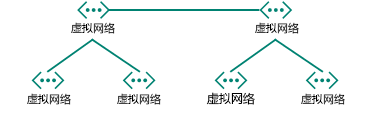
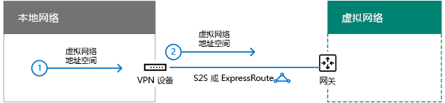
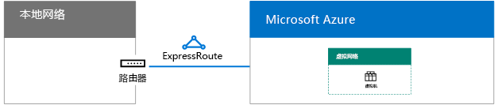
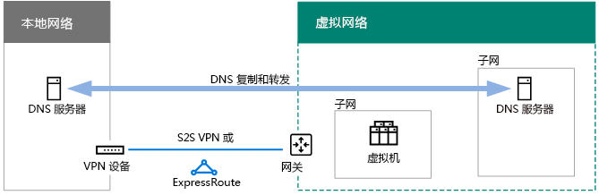

# 为 Microsoft Azure IaaS 设计网络

 **摘要：**了解如何设计用于在 Microsoft Azure IaaS 的工作负载优化的网络。
  
若要优化托管在 Azure IaaS 中的 IT 工作负载的网络，需要了解 Azure 虚拟网络 (VNet)、地址空间、路由、DNS 和负载平衡等相关知识。
  
## 任何 VNet 的规划步骤

对于任何类型的 VNet，请执行以下步骤。
  
### 步骤 1：为 Microsoft 云服务准备 Intranet。

经过[公共元素的 Microsoft 云连接](common-elements-of-microsoft-cloud-connectivity.md)中的**步骤来准备您网络上的 Microsoft 云服务**部分。
  
### 步骤 2：优化 Internet 带宽。

优化您的互联网带宽使用步骤 2-4 的设计[网络，对于 Microsoft SaaS](designing-networking-for-microsoft-saas.md)的**步骤来准备您的 Microsoft SaaS 服务的网络**部分。
  
### 步骤 3：确定 VNet 的类型（仅限云或跨界部署）。

仅限云 VNet 没有到本地网络的连接。下面是一个示例。
  
**图 1: 仅云 VNet**

  
图 1 显示了仅限云 VNet 中的一组虚拟机。
  
跨界 VNet 具有站点到站点 (S2S) VPN 或通过 Azure 网关实现的到本地网络的 ExpressRoute 连接。下面是一个示例。
  
**图 2： 跨部署 VNet**

  
图 2 显示了连接到本地网络的跨界 VNet 中的一组虚拟机。
  
请参阅其他[跨部署 VNet 的规划步骤](designing-networking-for-microsoft-azure-iaas.md#cross_prem)一节。
  
### 步骤 4：确定 VNet 的地址空间。

表 1 显示不同 VNet 类型的地址空间。
  
|**VNet 的类型**|**虚拟网络地址空间**|
|:-----|:-----|
|仅限云    |任意专用地址空间    |
|互连的仅限云类型    |任意的私钥，但不是重叠与其他连接 VNets    |
|跨界    |专用类型，但不与本地 VNet 重叠    |
|互连的跨界类型    |专用类型，但不与本地或其他连接 VNet 重叠    |
   
 **表 1: VNets 和其对应的地址空间类型**
  
DHCP 从子网的地址空间中为虚拟机分配地址配置。
  
- 地址/子网掩码
    
- 默认网关
    
- DNS 服务器 IP 地址
    
你还可以保留静态的 IP 地址。
  
还可以单独或从包含云服务中为虚拟机分配公用 IP 地址（仅适用于典型的部署计算机）。
  
### 步骤 5：确定 VNet 中的子网及分配给每个子网的地址空间。

VNet 中有两种类型的子网：网关子网和虚拟机托管的子网。
  
**图 3: 两种类型的 Azure 中的子网**

  
图 3 显示了包含网关子网（包含 Azure 网关）和一组虚拟机托管的子网（包含虚拟机）的 VNet。
  
Azure 需要 Azure 网关子网来托管 Azure 网关的两个虚拟机。指定前缀长度至少有 29 位的地址空间（例如：192.168.15.248/29）。尤其是在你计划使用 ExpressRoute 时，建议使用 28 位或更短的前缀长度。
  
如下是用来确定 Azure 网关子网的地址空间的最佳实践：
  
1. 确定网关子网的大小。
    
2. 在 VNet 地址空间的可变位中，将用于网关子网的位设置为 0，将剩余位设置为 1。
    
3. 转换为十进制并表示为一个地址空间，其中将前缀长度设置为网关子网的大小。
    
使用此方法时，网关子网的地址空间始终位于 VNet 地址空间的最远端。
  
下面是定义网关子网的地址前缀的一个示例：VNet 的地址空间是 10.119.0.0/16。该组织最初使用站点到站点的 VPN 连接，但最终采用了 ExpressRoute。表 2 显示了确定网络前缀符号（也称为 CIDR）中的网关子网地址前缀的步骤和结果。

下面是步骤和确定网关的子网的地址前缀的示例：

1. 网关网的大小决定。对于我们的示例中，我们选择了 /28。
2. 位在中设置可变部分的 VNet 地址空间 (b) 为 0 的网关子网位 (G) 其他 1 (V)。对于我们的示例中，我们使用 10.119.0.0/16 地址空间为 VNet。 
 10.119。 bbbbbbbb。bbbbbbbb 10.119。 VVVVVVVV。VVVVGGGG 10.119。 11111111。11110000  
3. 在步骤 2 中的结果转换为十进制和明确作为地址空间。对于我们的示例中，10.119。11111111。11110000 是 10.119.255.240，并使用步骤 1，（在本示例中为 28 个） 中的前缀长度，得到的网关的子网地址前缀为 10.119.255.240/28。
  
[Azure 的网关的子网的地址空间计算器](https://gallery.technet.microsoft.com/scriptcenter/Address-prefix-calculator-a94b6eed)的详细信息，请参见
  
虚拟机托管的子网用来放置 Azure 虚拟机，你可以根据典型的本地指南执行这一任务，例如公共角色、应用程序层或用于子网隔离。
  
Azure 使用每个子网的前 3 个地址。因此，可能在 Azure 的子网的地址数为 2n -5，其中 n 是主机比特数。表 3 显示的需要，虚拟机的数量范围承载位需要并相应的子网大小。
  
|**所需的虚拟机**|**主机位**|**子网大小**|
|:-----|:-----|:-----|
|1-3    |3    |/29    |
|4-11    |4    |/28    |
|12-27    |5    |/27    |
|28-59    |6    |/26    |
|60-123    |7    |/25    |
   
 **表 3： 虚拟机要求和它们的子网的大小**
  
有关子网或 VNet 上最大数量的虚拟机的详细信息，请参阅[网络限制](https://docs.microsoft.com/azure/azure-subscription-service-limits#networking-limits)。
  
有关详细信息，请参阅[规划和设计 Azure 的虚拟网络](https://azure.microsoft.com/documentation/articles/virtual-network-vnet-plan-design-arm/)。
  
### 步骤 6：确定 VNet 中分配给 VM 的 DNS 服务器配置和DNS 服务器地址。

Azure 根据 DHCP 为虚拟机分配 DNS 服务器的地址。DNS 服务器可以：
  
- 由 Azure 提供：提供本地名称注册及本地和 Internet 名称解析
    
- 由你提供：提供本地或 Intranet 名称注册及 Intranet 或 Internet 名称解析
    
表 4 显示了每种类型的 VNet 不同 DNS 服务器的配置。
    
|**VNet 的类型**|**DNS 服务器**|
|:-----|:-----|
|仅限云    |由 Azure 提供，用于本地和 Internet 名称解析    Azure 虚拟机，用于本地和 Internet 名称解析（DNS 转发）    |
|跨界    |本地，用于本地和 Intranet 名称解析    Azure 虚拟机，用于本地和 Intranet 名称解析（DNS 复制和转发）    |
   
 **表 4: VNets 的两种不同类型的 DNS 服务器选项**
  
有关详细信息，请参阅[虚拟机和角色实例的名称解析](https://docs.microsoft.com/azure/virtual-network/virtual-networks-name-resolution-for-vms-and-role-instances)。
  
### 步骤 7：确定负载平衡配置（面向 Internet 或内部）。

在某些情况下，你需要将传入流量分配给具有相同角色的一组服务器。对于面向 Internet 和内部流量负载，Azure IaaS 使用内置设备来执行此操作。
  
Azure 面向 Internet 的负载平衡功能将来自 Internet 的未经请求的传入流量随机分配给负载平衡集的成员。 
  
**图 4: 外部负载平衡器在 Azure 中**

  
图 4 显示分配站的 NAT 规则或一组虚拟机的负载平衡集中的终结点上的传入流量的 Azure 中的外部负载平衡器。
  
Azure 内部负载平衡功能将来自其他 Azure VM 或 Intranet 计算机的未经请求的传入流量随机分配给负载平衡集的成员。  
  
**图 5: 内部负载平衡器在 Azure 中**

  
图 5 显示了在分发站的 NAT 规则或一组虚拟机的负载平衡集中的终结点上的传入通信的 Azure 中的内部负载平衡器。
  
有关详细信息，请参阅[Azure 负载平衡器](https://docs.microsoft.com/azure/load-balancer/load-balancer-overview)。
  
### 步骤 8：确定使用虚拟设备和用户定义的路由。

如果需要将流量转发到你的 VNet 中的虚拟设备，你可能需要将一个或多个用户定义的路由添加到子网。
  
**图 6： 即用虚拟装置和用户定义 Azure 中的路由**

  
图 6 显示了分配给虚拟机托管的子网的跨界 VNet 和用户定义的路由，其中子网指向虚拟设备。
  
有关详细信息，请参阅[用户定义的路由和 IP 转发](https://docs.microsoft.com/azure/virtual-network/virtual-networks-udr-overview)。
  
### 步骤 9：确定 Internet 中的计算机如何连接到虚拟机。

有多种方式提供 Internet 访问 VNet 中的虚拟机的权限，这包括通过代理服务器或其他边缘服务从组织网络访问。
  
表 5 列出了筛选或检查未经请求的传入流量的方法。
  
|**方法**|**部署模型**|
|:-----|:-----|
|1.在云服务中配置的终结点和 ACL    |经典    |
|2.网络安全组    |Resource Manager 和经典    |
|3.面向 Internet 的负载平衡器，具有入站 NAT 规则    |资源经理    |
|4.网络在 Azure 中的安全装置 
 市场 （未显示）    |Resource Manager 和经典    |
   
 **表 5： 连接到虚拟机和其相应的 Azure 部署模型的方法**
  
**图 7： 通过 Internet 连接到 Azure 的虚拟机**

  
图 7 显示已连接到 Internet 的计算机使用终结点连接到云服务中的虚拟机、使用网络安全组连接到子网中的虚拟机，以及使用外部负载平衡器和入站 NAT 规则连接到子网中的虚拟机。
  
其他安全性通过以下项实现：
  
- 已验证并已加密的远程桌面和 SSH 连接。
    
- 已验证并已加密的远程 PowerShell 会话。
    
- 可用于端到端加密的 IPsec 传输模式。
    
- 有助于防止外部和内部攻击的 Azure DDOS 保护
    
有关详细信息，请参阅[Microsoft 企业架构师的云安全](https://aka.ms/cloudarchsecurity)和[Azure 网络安全](https://azure.microsoft.com/blog/azure-network-security/)。
  
### 步骤 10：为多个 VNet 确定 VNet 到 VNet 连接的拓扑。

可以使用类似于用来连接组织站点的拓扑将 VNet 彼此连接。
  
菊花链配置以串联方式连接 VNet。
  
**图 8: 菊花链形式连接配置为 VNets 的**

  
图 8 显示了五个连接使用菊花链形式连接的配置在系列中的 VNets。
  
中心辐射型配置将多个 VNet 连接到一组本身已彼此连接的中心 VNet。
  
**图 9: 分散和集中配置 VNets**

  
图 9 显示六个 VNet，其中两个是彼此相连的中心 VNet，另外各有两个分支 VNet。
  
全网状配置使每个 VNet 相互连接。
  
**图 10： 完全网状配置 VNets**

  
图 10 显示了四个全都彼此相连的 VNet，共使用六个 VNet 到 VNet 的连接。
  
## 跨界 VNet 的规划步骤

请按照以下针对跨界 VNet 的步骤操作。
  
> [!TIP]
> 若要创建一个模拟的跨内部开发/测试环境，请参阅[Simulated 跨内部 Azure 中的虚拟网络](simulated-cross-premises-virtual-network-in-azure.md)。 
  
### 步骤 1：确定与 VNet（S2S VPN 或 ExpressRoute）的跨界连接。

表 6 列出了不同类型的连接。
  
|**连接类型**|**用途**|
|:-----|:-----|
|站点到站点 (S2S) VPN    |连接到一个 VNet 的 1-10 站点 （包括其他 VNets）。    |
|ExpressRoute    |通过 Internet Exchange 提供程序 (IXP) 或网络服务提供商 (NSP) 提供的专用的安全链接。    |
|点到站点 (P2S) 的 VPN    |将一台计算机连接到 VNet。    |
|VNet 对等或 VNet 到 VNet (V2V) VPN     |将一个 VNet 连接到另一个 VNet。    |
   
 **表 6： 跨部署 VNets 的连接的类型**
  
最大连接数的详细信息，请参阅[网络限制](https://docs.microsoft.com/azure/azure-subscription-service-limits#networking-limits)。
  
VPN 设备的详细信息，请参阅[VPN 站点到站点虚拟网络连接的设备](https://docs.microsoft.com/azure/vpn-gateway/vpn-gateway-about-vpn-devices)。
  
VNet 对等有关的详细信息，请参阅[VNet 对等](https://docs.microsoft.com/azure/virtual-network/virtual-network-peering-overview)。
  
**图 11: 四种方法连接到跨部署 VNet**

  
图 11 显示的四种类型的连接与 VNet: P2S 连接从计算机、 从内部网络 S2S VPN 连接，从内部网络，连接到 ExpressRoute 和来自另一个 VNet 的 VNet 到 VNet 连接。 
  
你可以通过以下方式连接到 VNet 中的 VM：
  
- 来自本地网络或 Internet 的 VNet VM 管理
    
- 来自本地网络的 IT 工作负载访问
    
- 通过附加 VNet 的网络扩展
    
通过以下方式实现连接的安全性：
  
- P2S 使用安全套接字隧道协议 (SSTP)  
    
- S2S 和 VNet 到 VNet VPN 连接都通过 AES256 使用 IPsec 隧道模式
    
- ExpressRoute 是专用的 WAN 连接
    
有关详细信息，请参阅[Microsoft 企业架构师的云安全](https://aka.ms/cloudarchsecurity)和[Azure 网络安全](https://azure.microsoft.com/blog/azure-network-security/)。
  
### 步骤 2：确定本地 VPN 设备或路由器。

本地 VPN 设备或路由器用作：
  
- IPsec 对等方，终止来自 Azure 网关的 S2S VPN 连接。
    
- 专用的对等 ExpressRoute 连接的 BPG 对等和终止点。
    
**图 12： 内部部署 VPN 路由器或设备**

  
图 12 显示连接到本地 VPN 路由器或设备的跨界 VNet。
  
有关详细信息，请参阅[关于 VPN 网关](https://docs.microsoft.com/azure/vpn-gateway/vpn-gateway-about-vpngateways)。
  
### 步骤 3： 将路由添加到 intranet 进行 VNet 的地址空间可到达。

从本地到 VNet 的路由包含以下部分：
  
1. 指向你的 VPN 设备的 VNet 地址空间的路由。
    
2. 你的 VPN 设备上的 VNet 地址空间跨 S2S VPN 或 ExpressRoute 连接指向的路由
    
**图 13： 内部路由需要进行 VNet 可以到达**

  
图 13 显示了本地路由器和 VPN 路由器或设备所需的路由信息，VPN 路由器或设备表示 VNet 的地址空间。
  
### 步骤 4：对于 ExpressRoute，计划与你的提供程序的新连接。

通过以下三种不同的方式，你可以利用本地网络与 Microsoft 云之间的专用对等创建 ExpressRoute 连接：
  
- 在云交换中归置
    
- 点到点以太网连接
    
- 任意对任意 (IP VPN) 的网络
    
**图 14： 使用 ExpressRoute 连接到跨部署 VNet**

  
图 14 显示了跨界 VNet 以及从本地路由器到 Microsoft Azure 的 ExpressRoute 连接。
  
有关详细信息，请参阅[面向 Microsoft 云连接的 ExpressRoute](expressroute-for-microsoft-cloud-connectivity.md)。
  
### 步骤 5：确定 Azure 网关的本地网络地址空间。

对于从 VNet 到本地或其他 VNet 的路由，Azure 通过与分配给它的本地网络地址空间匹配的 Azure 网关转发流量。
  
**图 15: 本地网络的地址空间跨部署 VNet**

  
图 15 显示跨界 VNet 以及 Azure 网关中的本地网络地址空间，Azure 网关表示本地网络上可访问的地址空间。  
  
你可以按以下方式定义本地网络地址空间：
  
- 选项 1：当前所需或正在使用的地址空间的前缀列表（当你添加新的子网时可能需要更新）。
    
- 选项 2：你的整个本地地址空间（仅当你添加新的地址空间时需要更新）。
    
由于 Azure 网关不允许汇总路由，你必须定义选项 2 中的本地网络地址空间，使其不包括 VNet 地址空间。
  
**图 16: 地址空间孔创建的 VNet 地址空间**

  
图 16 显示了地址空间的表示形式，其中具有根空间和 VNet 地址空间。
  
下面是定义前缀为"洞"，由 VNet 创建的地址空间周围的本地网络地址空间的一个示例：
  
- 组织使用其本地网络中的专用地址空间（10.0.0.0/8、172.16.0.0/12 和 192.168.0.0/16）部分。他们选择选项 2 和 10.100.100.0/24 作为自己的 VNet 地址空间。
    
表 7 显示了定义此示例中的本地网络地址空间的步骤和生成前缀。
  
|**步骤**|**结果**|
|:-----|:-----|
|1.列出不属于 VNet 地址空间的根空间的前缀。    |172.16.0.0/12 和 192.168.0.0/16    |
|2.达列表变量的八位字节的非重叠前缀，但不是包括最后一次使用 
 八位字节的 VNet 地址空间中。    |10.0.0.0/16、 10.1.0.0/16...10.99.0.0/16、 10.101.0.0/16...10.254.0.0/16，10.255.0.0/16 （255 前缀，跳过 10.100.0.0/16）    |
|3.在非重叠前缀的列表 
 最后一次使用 VNet 地址空间的八位位组。    | 10.100.0.0/24、 10.100.1.0/24...10.100.99.0/24、 10.100.101.0/24...10.100.254.0/24，10.100.0.255.0/24 （255 前缀，跳过 10.100.100.0/24）    |
   
 **表 7： 示例本地地址的网络空间**
  
### 步骤 6：通过在 Azure 中托管的 DNS 服务器配置 DNS 复制的本地 DNS 服务器。

若要确保本地计算机可以解析基于 Azure 的服务器的名称，并且基于 Azure 的服务器可以解析本地计算机的名称，请配置：
  
- 你的 VNet 中的 DNS 服务器，以便转发到本地 DNS 服务器
    
- 本地和 VNet 中的 DNS 服务器之间相应区域的 DNS 复制
    
**图 17: DNS 复制和跨部署 VNet 中的 DNS 服务器的转发**

  
图 17 显示了跨界 VNet，其中 DNS 服务器位于本地网络和 VNet 中的子网中。已在这两个 DNS 服务器之间配置了 DNS 复制和转发。
  
### 步骤 7：确定使用强制隧道。

Azure 的子网的默认系统路由指向 Internet。为了确保虚拟机的所有通信都穿越跨内部连接，创建作为其下一中继站地址使用 Azure 的网关的默认路由的路由表。然后将路由表与子网关联。这被称作为强制隧道。有关详细信息，请参阅[配置强制隧道](https://docs.microsoft.com/azure/vpn-gateway/vpn-gateway-forced-tunneling-rm)。
  
**图 18： 用户定义工艺路线和跨部署 VNet 的强制隧道**

  
图 18 显示跨部署 VNet 用户定义指向 Azure 的网关的子网路由。
  
## Azure 中的 SharePoint Server 2016 场

Azure IaaS 中托管 Intranet IT 工作负荷的一个示例就是高可用性、多层 SharePoint Server 2016 场，如图 19 中所示。
  
**图 19: Azure IaaS 在一个高度可用的内联网 SharePoint 服务器 2016年场**

  
图 19 显示了部署在内部负载平衡器用于前端和数据层跨部署 VNet 的 SharePoint 服务器 2016年场的九个服务器。有关详细信息，包括分步设计和部署的说明，请参阅[Microsoft Azure 中的 SharePoint 服务器 2016年](https://technet.microsoft.com/library/mt779107%28v=office.16%29.aspx)。
  
> [!TIP]
> 在模拟的跨本地 VNet 中创建单服务器 SharePoint 服务器 2016年场，看到[Intranet SharePoint 服务器 2016 Azure 开发/测试环境中](https://technet.microsoft.com/library/mt806351%28v=office.16%29.aspx)。 
  
有关其他示例部署虚拟跨场所 Azure 中的虚拟机上的 IT 工作负荷的网络，请参阅[混合 Azure IaaS 云方案](https://technet.microsoft.com/library/mt750502.aspx)。
  
## See Also

[面向企业架构师的 Microsoft 云网络](microsoft-cloud-networking-for-enterprise-architects.md)
  
[Microsoft 云 IT 体系结构资源](microsoft-cloud-it-architecture-resources.md)

[Microsoft 企业云路线图：IT 决策者的资源](https://sway.com/FJ2xsyWtkJc2taRD)

