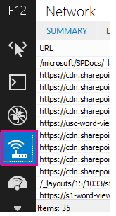
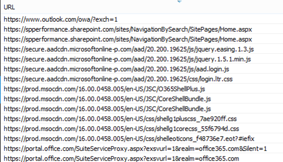

# 诊断 SharePoint Online 的性能问题

本文说明如何使用您使用 Internet Explorer 开发人员工具的 SharePoint Online 网站诊断的常见问题。
  
您可以使用三种不同的方法来识别 SharePoint Online 网站上某个页面的自定义项是否存在性能问题。
  
- F12 工具栏网络监视器
    
- 与非自定义基准的比较
    
- SharePoint Online 响应头指标
    
本主题介绍如何使用这些方法的每个诊断性能问题。一旦您已经确定问题的原因，您可以向使用提高 SharePoint 性能的上可以找到有关的文章的解决方案中处理http://aka.ms/tune。
  
## 使用 F12 工具栏来诊断 SharePoint Online 中的性能

在本文中，我们将使用 Internet Explorer 11。虽然可能看起来稍有不同，其他浏览器上的 F12 开发人员工具的各个版本也具有类似功能。有关 F12 开发人员工具的信息，请参阅：
  
- [What's new in F12 工具](https://go.microsoft.com/fwlink/p/?LinkId=522545)
    
- [使用 F12 开发人员工具](https://go.microsoft.com/fwlink/p/?LinkId=522546)
    
若要显示开发人员工具，请按“F12”****，然后单击 Wi-Fi 图标： 
 
  

  
在“网络”**** 选项卡上，按绿色播放按钮以加载页面。该工具返回浏览器请求的所有文件，以获取您要求的页面。下面的屏幕截图显示了一个此类列表。 
  

  
如该屏幕截图中所示，您还可以在文件右侧查看文件的下载时间。
  

  
这让您可以清楚地看到加载文件所用的时间。绿线表示页面何时准备好由浏览器呈现。这可以使您快速查看可能导致您的网站上页面加载较慢的各种文件。

  
## 设置 SharePoint online 的非自定义的比较基准

确定网站的性能薄弱点的最佳方式是设置 SharePoint Online 中完全--开网站集。这样可以进行比较所有您会在上无自定义的站点的各个方面。OneDrive for Business 主页是一个很好的单独的网站集可能遇到的任何自定义的示例。
  
## 查看 SharePoint 响应头信息

在 SharePoint Online 和 SharePoint Server 2013 中，您可以在每个文件的响应头中访问发回给浏览器的信息。用于诊断性能问题最有用的两个值是 SPRequestDuration 和 X-SharePointHealthScore：
  
- **SPRequestDuration**
    
    表示在服务器上处理请求所用的时间。这可以帮助确定请求是否为极重负载并会占用大量资源。这能让您最清楚地了解服务器为提供页面所完成的工作量。
    
- **X SharePointHealthScore**
    
    这指示服务器或在其运行 SharePoint 实例的 CPU 的利用率。此号码范围是从 0 到 10 其中 0 表示服务器处于空闲状态，10 表示服务器是很忙。始终 9 或 10 HealthScore 可能表明服务器正在进行的性能问题。任何其他数字指示该服务器操作系统预期范围内。
    
 **查看 SharePoint 响应头信息**
  
1. 确保您已安装的 F12 工具。有关下载和安装这些工具的详细信息，请参阅[What's new in F12 工具](https://go.microsoft.com/fwlink/p/?LinkId=522545)。
    
2. 在 F12 工具的“网络”**** 选项卡上，按绿色播放按钮以加载页面。 
    
3. 单击工具返回的一个 .aspx 文件，然后单击“详细信息”****。 
    
    
  
4. 单击“响应头”****。 
    
    
  
## 什么原因导致 SharePoint Online 中出现性能问题？

文章[SharePoint online 的导航选项](navigation-options-for-sharepoint-online.md)显示使用 SPRequestDuration 值确定复杂结构导航已导致页需要很长时间处理服务器上的示例。按照基线网站 （不带自定义项） 的值，就可以确定任何给定的文件是否花费很长时间才能加载。[导航选项 SharePoint online](navigation-options-for-sharepoint-online.md)中使用的示例是主要的.aspx 文件。该文件包含运行的页面加载的 ASP.NET 代码的大部分。根据您使用的网站模板，这可能是 start.aspx、 home.aspx、 default.aspx 或其他名称如果自定义主页。如果此号码相当高于基线网站，它是充分表明没有某些内容复杂事在导致性能问题的页面中。 
  
当您确定您的网站的特定问题后，找出导致性能不佳的原因的建议方式是消除所有可能的原因（例如页面自定义设置），然后将它们逐一添加回网站。当您删除足够的自定义项使页面运行良好之后，就可以逐一添加回特定自定义项。
  
例如，如果您有一个非常复杂的导航尝试将导航更改为不显示子网站，请检查开发人员工具查看是否有任何区别。或者，如果您有大量的内容更新汇总，请尝试从您的页面中删除，并检查性能是否有所改善。如果您消除了所有可能的原因，并将其逐一添加回页面中，您就可以轻松地识别哪些功能是最大的问题，并制定出解决方案。 

  

