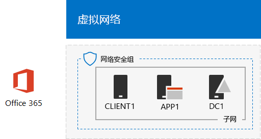

# <a name="directory-synchronization-for-your-office-365-devtest-environment"></a>Office 365 开发/测试环境的目录同步

 **摘要：** 为 Office 365 开发/测试环境配置目录同步。
  
许多组织使用 Azure AD Connect 和目录同步，将其本地 Active Directory 域服务 (AD DS) 林中的帐户集同步到 Office 365 中的帐户集。本文介绍了如何使用密码哈希同步将目录同步添加到 Office 365 开发/测试环境，从而生成以下配置。
  

  
此配置包括： 
  
- Office 365 E5 试用订阅，从你创建它起 30 天内过期。
- 连接到 Internet 的简化的组织 Intranet，包含 Azure 虚拟网络子网中的三个虚拟机（DC1、APP1 和 CLIENT1）。Azure AD Connect 在 APP1 上运行以便使 AD DS 域同步到 Office 365。
    
设置此开发/测试环境包含两个阶段：
  
1. 创建 Office 365 开发/测试环境（Azure 虚拟网络中的 DC1、APP1 和 CLIENT1 虚拟机，有 Office 365 E5 试用订阅）。
2. 在 APP1 上安装和配置 Azure AD Connect。
    
> [!TIP]
> 单击[此处](http://aka.ms/catlgstack)可直观映射到 Office 365 测试实验室指南堆栈中的所有文章。
  
## <a name="phase-1-create-an-office-365-devtest-environment"></a>第 1 阶段：创建 Office 365 开发/测试环境

按照 [Office 365 开发/测试环境](office-365-dev-test-environment.md)文章中的阶段 1、2 和 3 的说明进行操作。下面是生成的配置。
  

  
此配置包括： 
  
- Office 365 E5 试用订阅。
- 连接到 Internet 的简化的组织 Intranet，包含 Azure 虚拟网络子网中的 DC1、APP1 和 CLIENT1 虚拟机。
    
## <a name="phase-2-install-azure-ad-connect-on-app1"></a>第 2 阶段：在 APP1 上安装 Azure AD Connect

安装和配置后，Azure AD Connect 将 CORP AD DS 域中的帐户集与 Office 365 试用订阅中的帐户集同步。下面的过程将引导你完成在 APP1 上安装 Azure AD Connect 并查看它是否可以工作的步骤。
  
### <a name="install-and-configure-azure-ad-connect-on-app1"></a>在 APP1 上安装和配置 Azure AD Connect

1. 通过 CORP\\User1 帐户从 [Azure 门户](https://portal.azure.com)连接到 APP1。
    
2. 在 APP1 中，打开管理员级别的 Windows PowerShell 命令提示符，然后运行下面的命令：
    
  ```
  Set-ItemProperty -Path "HKLM:\SOFTWARE\Microsoft\Active Setup\Installed Components\{A509B1A7-37EF-4b3f-8CFC-4F3A74704073}" -Name "IsInstalled" -Value 0
Set-ItemProperty -Path "HKLM:\SOFTWARE\Microsoft\Active Setup\Installed Components\{A509B1A8-37EF-4b3f-8CFC-4F3A74704073}" -Name "IsInstalled" -Value 0
Stop-Process -Name Explorer -Force

  ```

3. 从任务栏中单击 **Internet Explorer**，然后转到 [https://aka.ms/aadconnect](https://aka.ms/aadconnect)。
    
4. 在“Microsoft Azure Active Directory Connect”页上，单击“下载”****，然后单击“运行”****。
    
5. 在“欢迎使用 Azure AD Connect”**** 页上，单击“我同意”****，然后单击“继续”****。
    
6. 在“快速设置”**** 页上，单击“使用快速设置”****。
    
7. 在“连接到 Azure AD”**** 页上，在“用户名”**** 中键入全局管理员帐户名称，在“密码”**** 中键入其密码，然后单击“下一步”****。
    
8. 在“连接到 AD DS”**** 页上，在“用户名”**** 中键入 **CORP\\User1**，在“密码”**** 中键入其密码，然后单击“下一步”****。
    
9. 在“Azure AD 登录配置”**** 页上，单击“继续而不验证域”****，然后单击“下一步”****。
    
10. 在“准备配置”**** 页上，单击“安装”****。
    
11. 在“配置完成”**** 页上，单击“退出”****。
    
12. 在 Internet Explorer 中，转至 Microsoft 365 管理中心 ([https://admin.microsoft.com](https://admin.microsoft.com)) 并使用全局管理员帐户登录至 Office 365 试用订阅。
    
13. 在主门户页上，单击“管理员”****。
    
14. 在左侧导航栏中，单击“用户”>“活动用户”****。
    
    请注意，该帐户名为 **User1**。此帐户来自 CORP AD DS 域，证明目录同步已正常工作。
    
15. 单击 **User1** 帐户。对于产品许可证，请单击“编辑”****。
    
16. 在“产品许可证”**** 中，选择你的国家/地区，然后单击“Office 365 企业版 E5”**** 的“关闭”**** 控制（切换为“打开”****）。单击页面底部的“保存”****，然后单击“关闭”****。
    
下面是生成的配置。
  

  
此配置包括： 
  
- Office 365 E5 试用订阅。
- 连接到 Internet 的简化的组织 Intranet，包含 Azure 虚拟网络子网中的 DC1、APP1 和 CLIENT1 虚拟机。Azure AD Connect 在 APP1 上运行以便每隔 30 分钟使 CORP AD DS 域同步到 Office 365。
    
## <a name="next-step"></a>后续步骤

准备好为组织部署目录同步时，请参阅[在 Microsoft Azure 中部署 Office 365 目录同步](deploy-office-365-directory-synchronization-dirsync-in-microsoft-azure.md)。

## <a name="see-also"></a>另请参阅

[云采用测试实验室指南 (TLG)](cloud-adoption-test-lab-guides-tlgs.md)

[基础配置开发/测试环境](base-configuration-dev-test-environment.md)

[Office 365 开发/测试环境](office-365-dev-test-environment.md)

[用于 Office 365 开发/测试环境的云应用安全](cloud-app-security-for-your-office-365-dev-test-environment.md)

[Office 365 开发/测试环境中的高级威胁防护](advanced-threat-protection-for-your-office-365-dev-test-environment.md)

[云应用和混合解决方案](cloud-adoption-and-hybrid-solutions.md)


