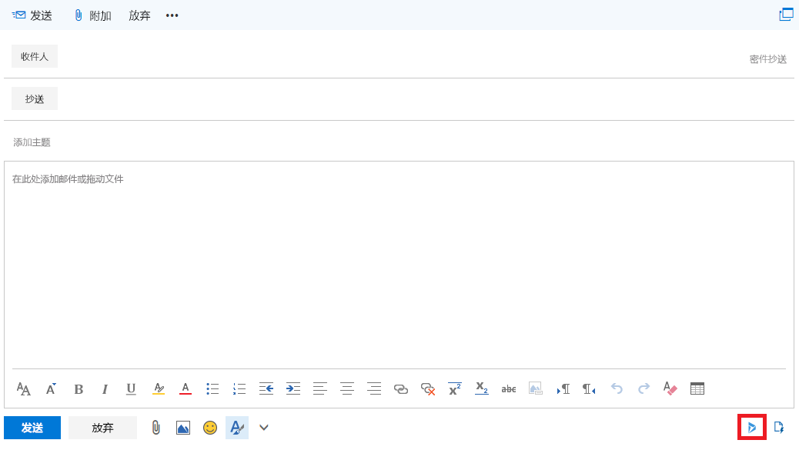

# Office 365 和 Dynamics 365 开发/测试环境的 Exchange Online 集成Exchange Online integration for your Office 365 and Dynamics 365 dev/test environment

 **摘要：**使用此测试实验室指南可以实现 Office 365 试用订阅中 Exchange Online 的 Dynamics 365 集成。**Summary:** Use this Test Lab Guide to enable Dynamics 365 integration for Exchange Online in your Office 365 trial subscription.
  
Microsoft Dynamics 365 的一个重要作用是将所有客户通信都存储在同一个位置，因此具有相应权限的任何人都可以查看所有相关的客户记录。例如，查看与特定联系人、帐户、 商机或案例关联的所有电子邮件。A valuable use of Microsoft Dynamics 365 is to store all customer communications in one place, so anyone with the appropriate permissions can see all relevant customer records. For example, view all email associated with a particular contact, account, opportunity, or case.
  
若要将电子邮件和其他邮件记录存储在 Dynamics 365 中，需要与 Dynamics 365 同步你的电子邮件系统。服务器端同步是选择电子邮件同步的方法。To store email and other messaging records in Dynamics 365, you need to synchronize your email system with Dynamics 365. Server-side synchronization is the method of choice for email synchronization.
  
此测试实验室指南用于配置和演示 Exchange Online 和 Outlook Online 客户端如何利用 Dynamics 365 中存储的信息。Use this Test Lab Guide to configure and demonstrate how Exchange Online and the Outlook Online client can leverage the information stored in Dynamics 365. 
  
## 第 1 阶段：扩展 Office 365 和 Dynamics 365 开发/测试环境Phase 1: Build out the Office 365 and Dynamics 365 dev/test environment

请按照 [Office 365 和 Dynamics 365 开发/测试环境](office-365-and-dynamics-365-dev-test-environment.md) 中的说明创建一个轻型或模拟的企业版 Office 365 和 Dynamics 365 开发/测试环境。Use the instructions in [Office 365 and Dynamics 365 dev/test environment](office-365-and-dynamics-365-dev-test-environment.md) to create either a lightweight or simulated enterprise version of an Office 365 and Dynamics 365 dev/test environment.
  
> [!NOTE]
> 本文中的配置不需要模拟的企业开发/测试环境，该环境中包括连接到 Internet 的模拟内部网和 Windows Server Active Directory (AD) 林的目录同步。它在此处作为一个选项提供，以便你可以测试 Office 365 和 Dynamics 365，并在代表典型组织的环境中对其进行试验The configuration in this article does not require the simulated enterprise dev/test environment, which includes a simulated intranet connected to the Internet and directory synchronization for a Windows Server Active Directory (AD) forest. It is provided here as an option so that you can experiment with Office 365 and Dynamics 365 in an environment that represents a typical organization 
  
## 第 2 阶段：配置和演示 Exchange Online 中的 Dynamics 365 集成Phase 2: Configure and demonstrate Dynamics 365 integration in Exchange Online

使用下列步骤配置 Dynamics 365 和 Exchange Online 集成的全局管理员邮箱：Use these steps to configure the global administrator's mailbox for Dynamics 365 and Exchange Online integration:
  
1. 使用浏览器的专用会话，转到 [(http://portal.office.com)]((http://portal.office.com))，再使用 Office 365 全局管理员帐户登录。Using a private session of your browser, go to [((http://portal.office.com))]((http://portal.office.com)) and sign in using your Office 365 global administrator account.
    
2. 在"Microsoft Office 主页"页上，单击"邮件"磁贴。On the **Microsoft Office Home** page, click the **Mail** tile.
    
3. 在浏览器中的新"邮件"选项卡上，单击"新建"并注意用于键入消息的框下方窗格的底角如何显示"我的模板"图标。On the new **Mail** tab in your browser, click **New** and notice how the bottom corner of the pane below the box for typing a message contains an icon for My Templates.
    
     
  
4. 单击"放弃"，并使"邮件"选项卡保持打开状态。Click **Discard** and leave the **Mail** tab open.
    
5. 单击浏览器中的"Microsoft Office 主页"选项卡，然后单击"管理"磁贴。Click the **Microsoft Office Home** tab in your browser, and then click the **Admin** tile.
    
6. 在"Office 管理中心"选项卡的左侧导航中，单击"管理中心">"Dynamics 365"。In the left navigation of the **Office Admin center** tab, click **Admin centers > Dynamics 365**.
    
7. 在浏览器中新的"Dynamics 365"选项卡上的 Dynamics 365 实例列表中，单击"打开"。On the new **Dynamics 365** tab in your browser, in the list of Dynamics 365 instances, click **Open**.
    
8. 在浏览器中新的"管理"选项卡中，在导航栏上单击"设置"旁边的下箭头，然后单击"系统"下方的"电子邮件配置"。On the new **Administration** tab in your browser, on the navigation bar, click the down arrow next to **Settings**, and then click **Email Configuration** under **System**.
    
9.  在"电子邮件配置"页上，单击"电子邮件配置设置"。On the **Email Configuration** page, click **Email Configuration Settings**.
    
10. 在"系统设置"对话框上的"电子邮件"选项卡中，将"约会、联系人和任务"更改为"服务器端同步"，然后单击"确定"。In the **Email** tab on the **System Settings** dialog box, change **Appointments, Contacts, and Tasks** to **Server-Side Synchronization**, and then click **OK**.
    
11. 在"电子邮件配置"页上，单击"邮箱"。On the **Email Configuration** page, click **Mailboxes**.
    
12. 在左侧复选标记列中选择 Office 365 全局管理员名称，单击工具栏上的"应用默认电子邮件设置"，然后单击"确定"。Select the Office 365 global administrator name in the left check mark column, click **Apply Default Email Settings** in the tool bar, and then click **OK**.
    
13. 单击工具栏上的"批准电子邮件"，然后单击"确定"。Click **Approve Email** in the tool bar, and then click **OK**.
    
14. 在左侧复选标记列中选择 Office 365 全局管理员名称，单击工具栏上的"测试和启用邮箱"，然后单击"确定"。Select the Office 365 global administrator name in the left check mark column, click **Test &amp; Enable Mailboxes** in the tool bar, and then click **OK**.
    
15. 单击打开"邮件"选项卡，并确认全局管理员收到一封测试邮件。Click the open **Mail** tab and confirm that the global administrator received a test message.
    
16. 返回到浏览器中的"邮箱">"我的可用邮箱"选项卡，然后刷新此页。"传入电子邮件状态"和"传出电子邮件状态"列应针对全局管理员帐户名称设置为"成功"。请注意，可能需要 15 分钟来完成这两个测试。Return to the **Mailboxes My Active Mailboxes** tab in your browser and refresh the page. The **Incoming Email Status** and **Outgoing Email Status** columns should be set to **Success** for the global administrator account name. Note that it can take up to 15 minutes to complete both tests.
    
使用以下步骤安装适用于 Outlook 的 Dynamics 365 应用并在全局管理员邮箱内演示 Dynamics 365 功能：Use these steps to install the Dynamics 365 App for Outlook and demonstrate Dynamics 365 features within the global administrator's mailbox:
  
1. 在浏览器中的"邮箱">"我的可用邮箱"选项卡上，单击"设置"旁边的下箭头，然后单击"系统"下的"适用于 Outlook 的 Dynamics 365 应用"。On the **Mailboxes My Active Mailboxes** tab in your browser, click the down arrow next to **Settings**, and then click **Dynamics 365 App for Outlook** under **System**.
    
2. 在"开始使用适用于 Outlook 的 Microsoft Dynamics 365 应用"页上，单击全局管理员名称，然后单击"将应用添加到 Outlook"。"状态"列将更改为"挂起"。On the **Getting Started with Microsoft Dynamics 365 App for Outlook** page, click the global administrator name, and then click **Add App to Outlook**. The **Status** column changes to **Pending**.
    
3. 刷新页面，直到状态更改为"添加到 Outlook"。请注意，可能需要 15 分钟来完成此配置。Refresh the page until the status changes to **Added to Outlook**. Note that it can take up to 15 minutes to complete this configuration.
    
4. 单击浏览器中的"邮件"选项卡，然后将其关闭。Click on the **Mail** tab in your browser and then close it.
    
5. 单击浏览器中的"Microsoft Office 主页"选项卡，然后单击"邮件"磁贴。Click the **Microsoft Office Home** tab in your browser, and then click the **Mail** tile.
    
6. 在浏览器中新的"邮件"选项卡上，单击"新建"。请注意，用于键入消息的框下方窗格的底角现在显示 Dynamics 365 的图标。On the new **Mail** tab in your browser, click **New**. Notice that the bottom corner of the pane below the box for typing a message now contains an icon for Dynamics 365.
    
     
  
7. 单击 Dynamics 365 图标。应该会看到"Dynamics 365" 窗格，你可以在其中跟踪此电子邮件或访问模板、销售宣传资料或文章。Click the Dynamics 365 icon. You should see a **Dynamics 365** pane, from which you can track this email or access templates, sales literature, or articles.
    
8. 在电子邮件的“收件人”****字段中，键入“alex.y.wu@outlook.com”****，再单击“Dynamics 365”****窗格中的“重试”****。在“Dynamics 365”****窗格中，应能看到“收件人”****部分，其中包含 Alex Wu（销售应用的联系人）的相关信息，此信息与试用订阅的示例数据一起提供。In the **To** field of the email message, type **alex.y.wu@outlook.com**, and then click **Retry** in the **Dynamics 365** pane. You should see a **Recipients** section in the **Dynamics 365** pane with information on Alex Wu, a contact from the sales application that was provided with the sample data for your trial subscription.
    
     
  
9. 单击"放弃"。Click **Discard**.

> [!TIP]
> 单击[此处]((http://aka.ms/catlgstack))可直观映射到 One Microsoft 云测试实验室指南堆栈中的所有文章。Click [here]((http://aka.ms/catlgstack)) for a visual map to all of the articles in the One Microsoft Cloud Test Lab Guide stack.
    
## 另请参阅See Also

[Office 365 和 Dynamics 365 开发/测试环境Office 365 and Dynamics 365 dev/test environment](office-365-and-dynamics-365-dev-test-environment.md)
  
[云采用测试实验室指南 (TLG)Cloud adoption Test Lab Guides (TLGs)](cloud-adoption-test-lab-guides-tlgs.md)
  
[基础配置开发/测试环境Base Configuration dev/test environment](base-configuration-dev-test-environment.md)
  
[Office 365 开发/测试环境Office 365 dev/test environment](office-365-dev-test-environment.md)
  
[用于 Office 365 开发/测试环境的 DirSyncDirSync for your Office 365 dev/test environment](dirsync-for-your-office-365-dev-test-environment.md)

[Dynamics 365（联机）的订阅管理]((https://technet.microsoft.com/library/jj679903.aspx))[Subscription Management for Dynamics 365 (online)]((https://technet.microsoft.com/library/jj679903.aspx))
  
[管理 Dynamics 365]((https://technet.microsoft.com/library/dn531101.aspx))[Administering Dynamics 365]((https://technet.microsoft.com/library/dn531101.aspx))

