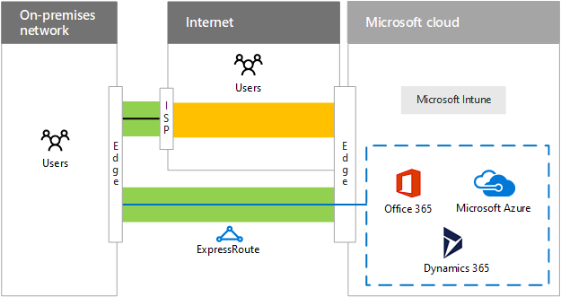
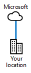
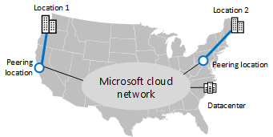

# 面向 Microsoft 云连接的 ExpressRouteExpressRoute for Microsoft cloud connectivity

 **摘要：** 了解 ExpressRoute 如何帮助你更快、更可靠地与 Microsoft 云服务和平台相连接。**Summary:** Understand how ExpressRoute can help you with faster and more reliable connections to Microsoft's cloud services and platforms.
  
ExpressRoute 提供了到 Microsoft 云的单独、专用、高吞吐量的网络连接。ExpressRoute provides a private, dedicated, high-throughput network connection to Microsoft's cloud.
  
## ExpressRoute 到 Microsoft 云ExpressRoute to the Microsoft cloud

下面是在没有 ExpressRoute 连接的情况下到 Microsoft 云的网络路径。Here is the networking path to the Microsoft cloud without an ExpressRoute connection.
  
**图 1：没有 ExpressRoute 的网络路径****Figure 1: The networking path without ExpressRoute**

  
图 1 显示内部部署网络与 Microsoft 云之间的典型路径。内部部署网络边缘通过到 ISP 的 WAN 链接连接到 Internet。然后，流量流经 Internet 到达 Microsoft 云的边缘。Microsoft 云内的云产品包括 Office 365、Microsoft Azure、Microsoft Intune 和 Dynamics 365。组织的用户可以位于内部部署网络或 Internet。Figure 1 shows the typical path between an on-premises network and the Microsoft cloud. The on-premises network edge connects to the Internet through a WAN link to an ISP. The traffic then travels across the Internet to the edge of the Microsoft cloud. Cloud offerings within the Microsoft cloud include Office 365, Microsoft Azure, Microsoft Intune, and Dynamics 365. Users of an organization can be located on the on-premises network or on the Internet.
  
如果没有 ExpressRoute 连接，你唯一可以控制的到 Microsoft 云的流量路径部分（并且与服务提供商有关系）是内部部署网络边缘与 ISP 之间的链接。Without an ExpressRoute connection, the only part of the traffic path to the Microsoft cloud that you can control (and have a relationship with the service provider) is the link between your on-premises network edge and your ISP. 
  
受限于中断、流量拥塞和恶意用户监视，ISP 与 Microsoft 云边缘之间的路径是 Internet 中尽力而为的传送系统。The path between your ISP and the Microsoft cloud edge is a best-effort delivery system on the Internet subject to outages, traffic congestion, and monitoring by malicious users.
  
Internet 中的用户，例如漫游或远程用户，通过 Internet 将他们的流量发送到 Microsoft 云。Users on the Internet, such as roaming or remote users, send their traffic to the Microsoft cloud over the Internet.
  
以下是在有 ExpressRoute 连接的情况下到 Microsoft 云的网络路径。Here are the networking paths to the Microsoft cloud with an ExpressRoute connection.
  
**图 2：有 ExpressRoute 的网络路径****Figure 2: The networking paths with ExpressRoute**

  
图 2 显示了两个网络路径。到 Microsoft Intune 的流量与普通 Internet 流量的路径相同。Office 365、Microsoft Azure 和 Dynamics 365 的流量经过 ExpressRoute 连接，这是内部部署网络边缘与 Microsoft 云边缘之间的专用路径。Figure 2 shows two networking paths. Traffic to Microsoft Intune travels the same path as normal Internet traffic. Traffic to Office 365, Microsoft Azure, and Dynamics 365 travels across the ExpressRoute connection, a dedicated path between the edge of the on-premises network and the edge of the Microsoft cloud.
  
ExpressRoute 连接，您现在可以控制，通过与服务提供商的关系，通过从您边缘到 Microsoft 的整个流量路径云边缘。可预测的性能和[99.95%运行时间 SLA](https://azure.microsoft.com/support/legal/sla/expressroute/v1_3/)可以提供此连接。With an ExpressRoute connection, you now have control, through a relationship with your service provider, over the entire traffic path from your edge to the Microsoft cloud edge. This connection can offer predictable performance and a [99.95% uptime SLA](https://azure.microsoft.com/support/legal/sla/expressroute/v1_3/).
  
基于服务提供商到 Office 365、Azure 和 Dynamics 365 服务的连接，现在可以依靠可预测的吞吐量和延迟。目前不支持 ExpressRoute 到 Microsoft Intune 的连接。You can now count on predictable throughput and latency, based on your service provider's connection, to Office 365, Azure, and Dynamics 365 services. ExpressRoute connections to Microsoft Intune are not supported at this time.
  
通过 ExpressRoute 连接发送的流量不再受限于 Internet 中断、流量拥塞和监视。Traffic sent over the ExpressRoute connection is no longer subject to Internet outages, traffic congestion, and monitoring.
  
Internet 中的用户，例如漫游或远程用户，仍通过 Internet 将他们的流量发送到 Microsoft 云。在 Azure IaaS 中托管的业务应用程序 Intranet 线的流量是一个例外情况，此类流量是通过到内部部署网络的远程访问连接的 ExpressRoute 连接发送的。Users on the Internet, such as roaming or remote users, still send their traffic to the Microsoft cloud over the Internet. One exception is traffic to an intranet line of business application hosted in Azure IaaS, which is sent over the ExpressRoute connection via a remote access connection to the on-premises network.
  
即使有 ExpressRoute 连接，一些流量仍然通过 Internet 发送，例如 DNS 查询、证书吊销列表检查和内容交付网络 (CDN) 请求。Even with an ExpressRoute connection, some traffic is still sent over the Internet, such as DNS queries, certificate revocation list checking, and content delivery network (CDN) requests.
  
有关详细信息，请参阅下列更多资源：See these additional resources for more information:
  
- [面向 Office 365 的 ExpressRouteExpressRoute for Office 365](https://aka.ms/expressrouteoffice365)
    
- [ExpressRoute for Azure](https://azure.microsoft.com/services/expressroute/)（面向 Azure 的 ExpressRoute）[ExpressRoute for Azure](https://azure.microsoft.com/services/expressroute/)
    
## 面向 Azure 的 ExpressRoute 的优点Advantages of ExpressRoute for Azure

下面是使用面向基于 Azure 的云服务的 ExpressRoute 的一些优点：Here are some advantages of using ExpressRoute for Azure-based cloud services:
  
- **可预知的性能：** 通过到 Microsoft 云边缘的专用路径，你的性能不会受限于 Internet 提供商中断和 Internet 流量高峰。你可以确定并让提供商负责到 Microsoft 云的吞吐量和延迟 SLA。**Predictable performance:** With a dedicated path to the edge of the Microsoft cloud, your performance is not subject to Internet provider outages and spikes in Internet traffic. You can determine and hold your providers accountable to a throughput and latency SLA to the Microsoft cloud.
    
- **流量的数据隐私：** 通过专用 ExpressRoute 连接发送的流量不会受限于恶意用户的 Internet 监视或数据包捕获和分析。这与使用基于多协议标签交换 (MPLS) 的 WAN 链接一样安全。**Data privacy for your traffic:** Traffic sent over your dedicated ExpressRoute connection is not subject to Internet monitoring or packet capture and analysis by malicious users. It is as secure as using Multiprotocol Label Switching (MPLS)-based WAN links.
    
- **高吞吐量连接：** 由于 Exchange 提供商和网络服务提供商提供的广泛的 ExpressRoute 连接支持，你最多可以获得 Microsoft 云的 10 Gbps 链接。**High throughput connections:** With wide support for ExpressRoute connections by exchange providers and network service providers, you can obtain up to a 10 Gbps link to the Microsoft cloud.
    
- **降低某些配置的成本：** 虽然 ExpressRoute 连接花费额外的成本，但在某些情况下，与在组织的多个地点增加 Internet 容量相比，一次 ExpressRoute 连接花费的成本更低，可以为 Microsoft 云服务提供足够的吞吐量。**Lower cost for some configurations:** Although ExpressRoute connections are an additional cost, in some cases a single ExpressRoute connection can cost less than increasing your Internet capacity at multiple locations of your organization to provide adequate throughput to Microsoft cloud services.
    
ExpressRoute 连接不能保证每一种配置的性能都会提高。通过低带宽 ExpressRoute 连接实现的性能比高带宽 Internet 连接低，在后一种情况下，与区域性 Microsoft 数据中心仅隔几个跃点。An ExpressRoute connection is not a guarantee of higher performance in every configuration. It is possible to have lower performance over a low-bandwidth ExpressRoute connection than a high-bandwidth Internet connection that is only a few hops away from a regional Microsoft datacenter.
  
有关使用适用于 Office 365 的 ExpressRoute，请参阅[适用于 Office 365 的 ExpressRoute](https://support.office.com/article/Azure-ExpressRoute-for-Office-365-6d2534a2-c19c-4a99-be5e-33a0cee5d3bd)。For the latest recommendations for using ExpressRoute with Office 365, see [ExpressRoute for Office 365](https://support.office.com/article/Azure-ExpressRoute-for-Office-365-6d2534a2-c19c-4a99-be5e-33a0cee5d3bd).
  
## ExpressRoute 连接模型ExpressRoute connectivity models

表 1 显示了用于 ExpressRoute 连接的三种主要连接模型。Table 1 shows the three primary connectivity models for ExpressRoute connections.
  
|**在云交换中归置****Co-located at a cloud exchange**|**点到点的以太网****Point-to-point Ethernet**|**任意对任意的 (IP VPN) 连接****Any-to-any (IP VPN) connection**|
|:-----|:-----|:-----|
||||
|如果你的数据中心与云交换共同位于某设施内，你可以通过归置提供程序的以太网交换订购到 Microsoft 云的虚拟交叉连接。If your datacenter is co-located in a facility with a cloud exchange, you can order a virtual cross-connection to the Microsoft cloud through the co-location provider's Ethernet exchange.    |如果你的数据中心位于你的场所，你可以使用点对点以太网链路连接到 Microsoft 云。If your datacenter is located on your premises, you can use a point-to-point Ethernet link to connect to the Microsoft cloud.    |如果你已使用 IP VPN (MPLS) 提供程序连接组织的站点，到 Microsoft 云的 ExpressRoute 连接可以用作专用 WAN 中的另一个位置。If you are already using an IP VPN (MPLS) provider to connect the sites of your organization, an ExpressRoute connection to the Microsoft cloud acts like another location on your private WAN.    |
   
 **表 1：ExpressRoute 连接模型****Table 1: ExpressRoute connectivity models**
  
## ExpressRoute 与 Microsoft 云服务的对等关系ExpressRoute peering relationships to Microsoft cloud services

一个 ExpressRoute 连接最多支持三个不同的边界网关协议 (BGP) 与 Microsoft 云不同部分的对等关系。BPG 使用对等关系建立信任和交换路由信息。A single ExpressRoute connection supports up to three different Border Gateway Protocol (BGP) peering relationships to different parts of the Microsoft cloud. BPG uses peering relationships to establish trust and exchange routing information.
  
**图 3：单个 ExpressRoute 连接中的三个不同的 BGP 关系****Figure 3: The three different BGP relationships in a single ExpressRoute connection**

  
图 3 显示了从本地网络 ExpressRoute 连接。ExpressRoute 连接都有三个逻辑的对等关系。Microsoft 对等关系转到 Microsoft SaaS 服务，包括 Office 365 和 Dynamcs CRM Online。公共的对等关系转到 Azure PaaS 服务。专用的对等关系转到 Azure IaaS 和承载虚拟机的虚拟网络网关。Figure 3 shows an ExpressRoute connection from an on-premises network. The ExpressRoute connection has three logical peering relationships. A Microsoft peering relationship goes to Microsoft SaaS services, including Office 365 and Dynamcs CRM Online. A public peering relationship goes to Azure PaaS services. A private peering relationship goes to Azure IaaS and to a virtual network gateway that hosts virtual machines.
  
Microsoft 对等 BGP 关系：The Microsoft peering BGP relationship: 
  
- 是从 DMZ 中的某个路由器到 Office 365 和 Dynamics 365 服务的公用地址。Is from a router in your DMZ to the public addresses of Office 365 and Dynamics 365 services. 
    
- 支持双向启动的通信。Supports bidirectional-initiated communication.
    
公共对等 BGP 关系：The public peering BGP relationship:
  
- 是从 DMZ 中的某个路由器到 Azure 服务的公用 IP 地址。Is from a router in your DMZ to the public IP addresses of Azure services.
    
- 仅支持从内部部署系统中单向启动的通信。对等关系不支持从 Azure PaaS 服务启动的通信。Supports unidirectional-initiated communication from on-premises systems only. The peering relationship does not support communication initiated from Azure PaaS services.
    
专用的对等 BGP 关系：The private peering BGP relationship:
  
- 是从组织网络边缘上的某个路由器到分配给 Azure VNets 的专用 IP 地址。Is from a router on the edge of your organization network to the private IP addresses assigned to your Azure VNets.
    
- 支持双向启动的通信。Supports bidirectional-initiated communication.
    
- 是从组织网络到 Microsoft 云的扩展，配有内部一致的寻址和路由。Is an extension of your organization network to the Microsoft cloud, complete with internally-consistent addressing and routing.
    
## 通过 ExpressRoute 的应用程序部署和流量的示例Example of application deployment and traffic flow with ExpressRoute

流量如何流经 ExpressRoute 连接和在 Microsoft 云中传输，相当于来源与目标之间的路径跃点的路由，是一种应用程序的行为。下面是在 Azure 虚拟机上运行的应用程序的一个示例，它通过站点到站点 VPN 连接访问内部部署 SharePoint 场。How traffic travels across ExpressRoute connections and within the Microsoft cloud is a function of the routes at the hops of the path between the source and the destination and application behavior. Here is an example of an application running on an Azure virtual machine that accesses an on-premises SharePoint farm over a site-to-site VPN connection.
  
**图 4：Azure 虚拟机上的访问本地 SharePoint 场的应用程序****Figure 4: An application on an Azure virtual machine accessing an on-premises SharePoint farm**

  
图 4 显示了内部部署 SharePoint 场、内部部署网络和 Azure IaaS 中的虚拟网络之间的站点到站点 VPN 连接、作为 Azure IaaS 虚拟机运行的应用程序服务器，以及应用程序服务器和 SharePoint 场之间的流量。Figure 4 shows an on-premises SharePoint farm, a site-to-site VPN connection between the on-premises network and a virtual network in Azure IaaS, an application server running as an Azure IaaS virtual machine, and the traffic flow between the application server and the SharePoint farm.
  
应用程序使用内部部署 DNS 查找 SharePoint 场的 IP 地址，所有流量都要通过站点到站点 VPN 连接。The application locates the IP address of the SharePoint farm using the on-premises DNS and all traffic goes over the site-to-site VPN connection.
  
该组织将内部部署 SharePoint 场迁移到了 Office 365 中的 SharePoint Online 并部署了 ExpressRoute 连接。This organization migrated their on-premises SharePoint farm to SharePoint Online in Office 365 and deployed an ExpressRoute connection.
  
**图 5：将本地 SharePoint 场移至 SharePoint Online****Figure 5: Moving the on-premises SharePoint farm to SharePoint Online**

  
图 5 显示将带有对等关系的 ExpressRoute 连接添加到 Microsoft SaaS 和 Office 365 以及 Azure IaaS 中，其中包含虚拟网络上的应用程序服务器。SharePoint 内部部署场已迁移至 Office 365。Figure 5 shows the addition of an ExpressRoute connection with peering relationships to Microsoft SaaS and Office 365 and to Azure IaaS containing the application server on a virtual network. The SharePoint on-premises farm has been migrated to Office 365.
  
具有 Microsoft 和专用对等关系：With the Microsoft and private peering relationships:
  
- 从 Azure 虚拟网络网关中，内部部署位置可通过 ExpressRoute 连接提供。From the Azure virtual network gateway, on-premises locations are available across the ExpressRoute connection.
    
- 从 Office 365 订阅中，边缘设备的公用 IP 地址（如代理服务器）可通过 ExpressRoute 连接提供。From the Office 365 subscription, public IP addresses of edge devices, such as proxy servers, are available across the ExpressRoute connection.
    
- 从内部部署网络边缘中，Azure VNet 的专用 IP 地址和 Office 365 的公用 IP 地址可通过 ExpressRoute 连接提供。From the on-premises network edge, the private IP addresses of the Azure VNet and the public IP addresses of Office 365 are available across the ExpressRoute connection.
    
当应用程序访问 SharePoint Online 的 URL 时，它通过 ExpressRoute 连接将其流量转发到边缘的代理服务器。When the application accesses the URLs of SharePoint Online, it forwards its traffic across the ExpressRoute connection to a proxy server in the edge. 
  
当代理服务器找到 SharePoint Online 的 IP 地址时，它将通过 ExpressRoute 连接转发回流量。响应流量通过反向路径。When the proxy server locates the IP address of SharePoint Online, it forwards the traffic back over the ExpressRoute connection. Response traffic travels the reverse path.
  
**图 6：SharePoint 场迁移到 Office 365 中的 SharePoint Online 时的流量****Figure 6: Traffic flow when the SharePoint farm has been migrated to SharePoint Online in Office 365**

  
图 6 显示了应用程序服务器和 Office 365 中的 SharePoint Online 之间的流量如何通过专用的对等关系从应用程序服务器流到内部部署网络边缘，然后通过 Microsoft 对等关系从边缘流到 Office 365。Figure 6 shows how the traffic between the application server and SharePoint Online in Office 365 flows over the private peering relationship from the application server to the on-premises network edge, and then from the edge over the Microsoft peering relationship to Office 365.
  
其结果是出现 Hairpinning 模式，这是路由和应用程序行为导致的后果。The result is hair pinning, a consequence of the routing and application behavior.
  
## ExpressRoute 和 Microsoft 云网络ExpressRoute and Microsoft's cloud network

ExpressRoute 连接具有两个不同的版本：ExpressRoute 和 ExpressRoute Premium。ExpressRoute connections are available in two different versions: ExpressRoute and ExpressRoute Premium.
  
### ExpressRouteExpressRoute

组织网络与 Microsoft 数据中心之间的流量的流动方式取决于下列各项：How traffic travels between your organization network and a Microsoft datacenter is a combination of:
  
- 你的位置。Your locations.
    
- Microsoft 云对等位置（连接到 Microsoft 边缘的物理位置）。Microsoft cloud peering locations (the physical locations to connect to the Microsoft edge).
    
- Microsoft 数据中心位置。Microsoft datacenter locations.
    
Microsoft 数据中心和云对等位置都连接到 Microsoft 云网络。Microsoft datacenter and cloud peering locations are all connected to the Microsoft cloud network.
  
创建到 Microsoft 云对等位置的 ExpressRoute 连接时，将你连接到 Microsoft 云网络以及同一个洲的所有 Microsoft 数据中心位置。云对等位置和目标 Microsoft 数据中心之间的流量通过 Microsoft 云网络传送。When you create an ExpressRoute connection to a Microsoft cloud peering location, you are connected to the Microsoft cloud network and all the Microsoft datacenter locations in the same continent. The traffic between the cloud peering location and the destination Microsoft datacenter is carried over the Microsoft cloud network.
  
这可能会导致任意对任意连接模型的本地 Microsoft 数据中心的传送达不到最佳状态。This can result in non-optimal delivery to local Microsoft datacenters for the any-to-any connectivity model.
  
**使用的单个 ExpressRoute 连接的地理位置分散的组织的图 7： 示例****Figure 7: Example of a geographically-distributed organization that uses a single ExpressRoute connection**

  
图 7 显示了具有两个位置的组织：美国西北部的位置 1 和东北部的位置 2。它们由任意对任意 WAN 提供程序连接。该组织还有到西海岸的 Microsoft 对等位置的 ExpressRoute 连接。来自东北部的位置 2 且发往东海岸数据中心的流量，必须一直流经组织的 WAN 直到西海岸、Microsoft 对等位置，然后通过 Microsoft 云网络流经全国，返回东海岸数据中心。Figure 7 shows an organization with two locations, Location 1 in the northwest of the United States and Location 2 in the northeast. They are connected by an any-to-any WAN provider. This organization also has an ExpressRoute connection to a Microsoft peering location on the west coast. Traffic from Location 2 in the northeast destined for an east coast datacenter must travel all the way across the organization's WAN to the west coast, to the Microsoft peering location, and then back across the country over the Microsoft cloud network to the east coast datacenter.
  
为实现最佳的传送，使用到区域性 Microsoft 云对等位置的多个 ExpressRoute 连接。For optimal delivery, use multiple ExpressRoute connections to regional Microsoft cloud peering locations. 
  
**图 8：使用多个 ExpressRoute 连接实现到区域性数据中心的最佳传送****Figure 8: The use of multiple ExpressRoute connections for optimal delivery to regional datacenters**

  
图 8 显示了使用到本地 Microsoft 对等位置的两个 ExpressRoute 连接的同一组织，一个连接针对一个位置。在此配置中，来自东北部的位置 2 且发往东海岸数据中心的流量，会直接流至东海岸的对等位置、Microsoft 云网络，然后再到东海岸数据中心。Figure 8 shows the same organization with two ExpressRoute connections, one for each location, to regionally local Microsoft peering locations. In this configuration, traffic from Location 2 in the northeast destined for an east coast datacenter goes directly to an east coast peering location, to the Microsoft cloud network, and then to the east coast datacenter.
  
多个 ExpressRoute 连接可以：Multiple ExpressRoute connections can provide:
  
- 提高本地 Microsoft 数据中心位置的性能。Better performance to regionally local Microsoft datacenter locations.
    
- 在本地 ExpressRoute 连接不可用时提高 Microsoft 云的可用性。Higher availability to the Microsoft cloud when a local ExpressRoute connection becomes unavailable.
    
这适用于在同一个洲的组织。但是，到该组织所在洲之外的 Microsoft 数据中心的流量将通过 Internet 传送。This works well for organizations in the same continent. However, traffic to Microsoft datacenters outside the organization's continent travels over the Internet.
  
对于通过 Microsoft 云网络的洲际流量，则必须使用 ExpressRoute Premium 连接。For intercontinental traffic over the Microsoft cloud network, you must use ExpressRoute Premium connections.
  
### ExpressRoute PremiumExpressRoute Premium

对于分布在各洲的组织，你可以使用 ExpressRoute Premium。For organizations that are globally distributed across continents, you can use ExpressRoute Premium. 
  
通过 ExpressRoute Premium，可以从任何洲的任何 Microsoft 对等位置到达任何洲的任何 Microsoft 数据中心。洲之间的流量通过 Microsoft 云网络传送。With ExpressRoute Premium, you can reach any Microsoft datacenter on any continent from any Microsoft peering location on any continent. The traffic between continents is carried over the Microsoft cloud network.
  
通过多个 ExpressRoute Premium 连接，你可以：With multiple ExpressRoute Premium connections, you can have:
  
- 提高洲本地 Microsoft 数据中心位置的性能。Better performance to continentally local Microsoft datacenters.
    
- 在本地 ExpressRoute 连接不可用时提高全局 Microsoft 云的可用性。Higher availability to the global Microsoft cloud when a local ExpressRoute connection becomes unavailable.
    
基于 Office 365 ExpressRoute 连接需要 ExpressRoute Premium。ExpressRoute Premium is required for Office 365-based ExpressRoute connections.
  
**图 9：全球范围内的 Microsoft 云网络****Figure 9: The world-wide Microsoft cloud network**

  
图 9 显示了全球范围的 Microsoft 云网络的逻辑图，其中网络跨越世界各洲和区域以及它们之间的互连。每个洲都包含部分 Microsoft 云网络，全球企业从其区域中心办事处创建到本地 Microsoft 对等位置的 ExpressRoute Premium 连接。Figure 9 shows a logical diagram of the worldwide Microsoft cloud network, with networks that span the continents and regions of the world and their interconnections. With a portion of the Microsoft cloud network in each continent, a global enterprise creates ExpressRoute Premium connections from its regional hub offices to local Microsoft peering locations.
  
对于区域办事处，适当的 Office 365 流量：For a regional office, appropriate Office 365 traffic to:
  
- 通过该洲内的 Microsoft 云网络传送至 Office 365 洲数据中心。Continental Office 365 datacenters travels over the Microsoft cloud network within the continent.
    
- 通过洲际 Microsoft 云网络传送至另一个洲的Office 365 数据中心。Office 365 datacenters in another continent travels over the intercontinental Microsoft cloud network.
    
有关详细信息，请参阅：For more information, see:
  
- [Azure ExpressRoute for Office 365 Training](https://channel9.msdn.com/series/aer/)（Azure ExpressRoute for Office 365 培训）[Azure ExpressRoute for Office 365 Training](https://channel9.msdn.com/series/aer/)
    
- [Office 365 的网络规划和性能调整 365Network planning and performance tuning for Office 365](https://aka.ms/tune)
    
- [Office 365 Performance Management](https://mva.microsoft.com/en-US/training-courses/office-365-performance-management-8416)（Office 365 的性能管理）[Office 365 Performance Management](https://mva.microsoft.com/en-US/training-courses/office-365-performance-management-8416)
    
## ExpressRoute 选项ExpressRoute options

你也可以将以下选项纳入到 ExpressRoute 部署中：You can also incorporate the following options into your ExpressRoute deployment:
  
- **边缘的安全性：** 要实现通过 ExpressRoute 连接发送和接收的流量的高级安全性，如流量检查或入侵/恶意软件检测，请将安全装置放入 DMZ 内的流量路径下或 Intranet 边界。**Security at your edge:** To provide advanced security for the traffic sent and received over the ExpressRoute connection, such as traffic inspection or intrusion/malware detection, place your security appliances in the traffic path within your DMZ or at the border of your intranet.
    
    VM 的 Internet 流量 为防止 Azure VM 直接启动与 Internet 位置的流量，请将默认路由告知 Microsoft。Internet 流量通过 ExpressRoute 连接和内部部署代理服务器传送。从 Azure 虚拟机到 Azure PaaS 服务或 Office 365 的流量将通过 ExpressRoute 连接传送回去。Internet traffic for VMs To prevent Azure VMs from initiating traffic directly with Internet locations, advertise the default route to Microsoft. Traffic to the Internet is routed across the ExpressRoute connection and through your on-premises proxy servers. Traffic from Azure VMs to Azure PaaS services or Office 365 is routed back across the ExpressRoute connection.
    
- **WAN 优化程序：** 你可以在跨界部署的 Azure 虚拟网络 (VNet) 的专用对等连接两端部署 WAN 优化程序。在 Azure VNet 内部，使用 Azure 市场的 WAN 优化网络设备和用户定义路由通过该设备传送流量。**WAN optimizers:** You can deploy WAN optimizers on both sides of a private peering connection for a cross-premises Azure virtual network (VNet). Inside the Azure VNet, use a WAN optimizer network appliance from the Azure marketplace and user-defined routing to route the traffic through the appliance.
    
- **服务质量：** 使用流量的 IPv4 标头中的差分服务代码点 (DSCP) 值将其标记为语音、视频/交互式或尽力传送。这对 Microsoft 对等关系以及 Skype for Business Online 流量尤为重要。**Quality of service:** Use Differentiated Services Code Point (DSCP) values in the IPv4 header of your traffic to mark it for voice, video/interactive, or best-effort delivery. This is especially important for the Microsoft peering relationship and Skype for Business Online traffic.
    
有关详细信息，请参阅下列更多资源：See these additional resources for more information:
  
- [面向 Office 365 的 ExpressRouteExpressRoute for Office 365](https://aka.ms/expressrouteoffice365)
    
- [Azure ExpressRoute for Office 365 Training](https://channel9.msdn.com/series/aer/)（Azure ExpressRoute for Office 365 培训）[Azure ExpressRoute for Office 365 Training](https://channel9.msdn.com/series/aer/)
    
- [ExpressRoute for Azure](https://azure.microsoft.com/services/expressroute/)（面向 Azure 的 ExpressRoute）[ExpressRoute for Azure](https://azure.microsoft.com/services/expressroute/)
    
## 后续步骤Next step

[为 Microsoft SaaS 设计网络Designing networking for Microsoft SaaS](designing-networking-for-microsoft-saas.md)

## 另请参阅See also

[面向企业架构师的 Microsoft 云网络Microsoft Cloud Networking for Enterprise Architects](microsoft-cloud-networking-for-enterprise-architects.md)
  
[Microsoft 云 IT 体系结构资源Microsoft Cloud IT architecture resources](microsoft-cloud-it-architecture-resources.md)

