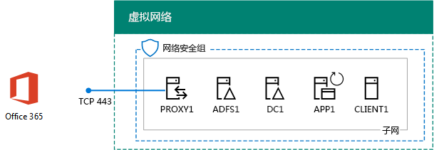
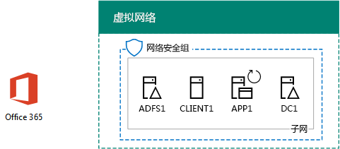

# <a name="federated-identity-for-your-office-365-devtest-environment"></a><span data-ttu-id="39d3f-103">用于 Office 365 开发/测试环境的联合身份</span><span class="sxs-lookup"><span data-stu-id="39d3f-103">Federated identity for your Office 365 dev/test environment</span></span>

 <span data-ttu-id="39d3f-104">**摘要：**配置联合身份验证为您的 Office 365 开发/测试环境。</span><span class="sxs-lookup"><span data-stu-id="39d3f-104">**Summary:** Configure federated authentication for your Office 365 dev/test environment.</span></span>
  
<span data-ttu-id="39d3f-p101">Office 365 支持联合的身份。这意味着，而不是执行本身的凭据验证，Office 365 指连接用户 Office 365 提供信任的联合身份验证服务器。如果用户的凭据正确无误，联合身份验证服务器颁发安全令牌的客户端会发送到 Office 365 作为身份验证的凭据。联合的身份允许卸载和纵深的 Office 365 订阅和高级身份验证和安全方案的身份验证。</span><span class="sxs-lookup"><span data-stu-id="39d3f-p101">Office 365 supports federated identity. This means that instead of performing the validation of credentials itself, Office 365 refers the connecting user to a federated authentication server that Office 365 trusts. If the user's credentials are correct, the federated authentication server issues a security token that the client then sends to Office 365 as proof of authentication. Federated identity allows for the offloading and scaling up of authentication for an Office 365 subscription and advanced authentication and security scenarios.</span></span>
  
<span data-ttu-id="39d3f-109">本文介绍了如何为 Office 365 开发/测试环境配置联合身份验证，从而实现以下配置：</span><span class="sxs-lookup"><span data-stu-id="39d3f-109">This article describes how you can configure federated authentication for the Office 365 dev/test environment, resulting in the following:</span></span>
  
<span data-ttu-id="39d3f-110">**图 1: 联合身份验证为 Office 365 的开发/测试环境的**</span><span class="sxs-lookup"><span data-stu-id="39d3f-110">**Figure 1: The federated authentication for Office 365 dev/test environment**</span></span>


  
<span data-ttu-id="39d3f-112">图 1 中的配置包括： </span><span class="sxs-lookup"><span data-stu-id="39d3f-112">The configuration shown in Figure 1 consists of:</span></span> 
  
- <span data-ttu-id="39d3f-113">Office 365 E5 试用订阅，从你创建它起 30 天内过期。</span><span class="sxs-lookup"><span data-stu-id="39d3f-113">An Office 365 E5 Trial Subscription, which expires 30 days from when you create it.</span></span>
    
- <span data-ttu-id="39d3f-p102">连接 Internet 的简化组织 Intranet，由 Azure 虚拟网络子网中的五个虚拟机（DC1、APP1、CLIENT1、ADFS1 和 PROXY1）组成。Azure AD Connect 在 APP1 上运行，以便将 Windows Server AD 域中的帐户列表同步到 Office 365。PROXY1 接收传入的身份验证请求。ADFS1 使用 DC1 验证凭据并颁发安全令牌。</span><span class="sxs-lookup"><span data-stu-id="39d3f-p102">A simplified organization intranet connected to the Internet, consisting of five virtual machines on a subnet of an Azure virtual network (DC1, APP1, CLIENT1, ADFS1, and PROXY1). Azure AD Connect runs on APP1 to synchronize the list of accounts in the Windows Server AD domain to Office 365. PROXY1 receives the incoming authentication requests. ADFS1 validates credentials with DC1 and issues security tokens.</span></span>
    
<span data-ttu-id="39d3f-118">设置此开发/测试环境分为五个阶段：</span><span class="sxs-lookup"><span data-stu-id="39d3f-118">There are five phases to setting up this dev/test environment:</span></span>
  
1. <span data-ttu-id="39d3f-119">创建包含 DirSync 的模拟企业 Office 365 开发/测试环境。</span><span class="sxs-lookup"><span data-stu-id="39d3f-119">Create the simulated enterprise Office 365 dev/test environment with DirSync.</span></span>
    
2. <span data-ttu-id="39d3f-120">创建 AD FS 服务器 (ADFS1)。</span><span class="sxs-lookup"><span data-stu-id="39d3f-120">Create the AD FS server (ADFS1).</span></span>
    
3. <span data-ttu-id="39d3f-121">创建 Web 代理服务器 (PROXY1)。</span><span class="sxs-lookup"><span data-stu-id="39d3f-121">Create the web proxy server (PROXY1).</span></span>
    
4. <span data-ttu-id="39d3f-122">创建自签名证书并配置 ADFS1 和 PROXY1。</span><span class="sxs-lookup"><span data-stu-id="39d3f-122">Create a self-signed certificate and configure ADFS1 and PROXY1.</span></span>
    
5. <span data-ttu-id="39d3f-123">为 Office 365 配置联合身份。</span><span class="sxs-lookup"><span data-stu-id="39d3f-123">Configure Office 365 for federated identity.</span></span>
    
<span data-ttu-id="39d3f-124">若要单步执行生产环境中部署 Office 365 Azure 中的联合身份验证，请参阅[Office 365 Azure 中部署高可用性联合身份验证](deploy-high-availability-federated-authentication-for-office-365-in-azure.md)。</span><span class="sxs-lookup"><span data-stu-id="39d3f-124">To step through a production deployment of federated authentication for Office 365 in Azure, see [Deploy high availability federated authentication for Office 365 in Azure](deploy-high-availability-federated-authentication-for-office-365-in-azure.md).</span></span>
  
> [!NOTE]
> <span data-ttu-id="39d3f-125">无法使用 Azure 试用订阅配置此开发/测试环境。</span><span class="sxs-lookup"><span data-stu-id="39d3f-125">You cannot configure this dev/test environment with an Azure Trial subscription.</span></span> 
  
> [!TIP]
> <span data-ttu-id="39d3f-126">单击[此处](http://aka.ms/catlgstack)为可视化映射到一个 Microsoft 云测试实验室指南堆栈中的所有项目。</span><span class="sxs-lookup"><span data-stu-id="39d3f-126">Click [here](http://aka.ms/catlgstack) for a visual map to all the articles in the One Microsoft Cloud Test Lab Guide stack.</span></span>
  
## <a name="phase-1-create-the-simulated-enterprise-office-365-devtest-environment-with-dirsync"></a><span data-ttu-id="39d3f-127">阶段 1：创建包含 DirSync 的模拟企业 Office 365 开发/测试环境</span><span class="sxs-lookup"><span data-stu-id="39d3f-127">Phase 1: Create the simulated enterprise Office 365 dev/test environment with DirSync</span></span>

<span data-ttu-id="39d3f-128">按照[您 Office 365 的开发/测试环境的目录同步](dirsync-for-your-office-365-dev-test-environment.md)过程中的说明创建与目录同步服务器以 APP1 模拟的企业 Office 365 的开发/测试环境，并且同步之间 Office 365 的标识和在 DC1 上的 Windows 服务器 AD 帐户。</span><span class="sxs-lookup"><span data-stu-id="39d3f-128">Follow the instructions in [Directory synchronization for your Office 365 dev/test environment](dirsync-for-your-office-365-dev-test-environment.md) to create the simulated enterprise Office 365 dev/test environment with APP1 as the DirSync server and synchronized identity between Office 365 and the Windows Server AD accounts on DC1.</span></span>
  
<span data-ttu-id="39d3f-p103">接下来，创建新公共 DNS 域的名称基于您当前域的名称并将其添加到您的 Office 365 订购。我们建议使用名称**测试实验室。**\<公共域 >。例如，如果 contoso.com 公共域名，则添加公共域的名称 testlab.contoso.com。</span><span class="sxs-lookup"><span data-stu-id="39d3f-p103">Next, create a new public DNS domain name based on your current domain name and add it to your Office 365 subscription. We recommend using the name **testlab.**\<your public domain>. For example, if your public domain name is contoso.com, add the public domain name testlab.contoso.com.</span></span>
  
<span data-ttu-id="39d3f-132">有关如何在您的 DNS 提供商创建了正确的 DNS 记录和域添加到 Office 365 的试用订阅的说明，请参阅[添加用户和域添加到 Office 365](https://support.office.com/article/Add-users-and-domain-to-Office-365-6383f56d-3d09-4dcb-9b41-b5f5a5efd611)。</span><span class="sxs-lookup"><span data-stu-id="39d3f-132">For instructions on how to create the correct DNS records in your DNS provider and add the domain to your Office 365 trial subscription, see [Add users and domain to Office 365](https://support.office.com/article/Add-users-and-domain-to-Office-365-6383f56d-3d09-4dcb-9b41-b5f5a5efd611).</span></span> 
  
<span data-ttu-id="39d3f-133">下面是生成的配置。</span><span class="sxs-lookup"><span data-stu-id="39d3f-133">Here is your resulting configuration.</span></span>
  
<span data-ttu-id="39d3f-134">**图 2： 为 Office 365 的开发/测试环境的的目录同步**</span><span class="sxs-lookup"><span data-stu-id="39d3f-134">**Figure 2: Directory synchronization for the Office 365 dev/test environment**</span></span>


  
<span data-ttu-id="39d3f-136">图 2 显示了对于 Office 365 开发/测试环境，其中包括 Office 365 和客户端 1，APP1，并且 DC1 虚拟机在 Azure 的虚拟网络目录 synchronizationc。</span><span class="sxs-lookup"><span data-stu-id="39d3f-136">Figure 2 shows the directory synchronizationc for Office 365 dev/test environment, which includes Office 365 and CLIENT1, APP1, and DC1 virtual machines in an Azure virtual network.</span></span>
  
## <a name="phase-2-create-the-ad-fs-server"></a><span data-ttu-id="39d3f-137">阶段 2：创建 AD FS 服务器</span><span class="sxs-lookup"><span data-stu-id="39d3f-137">Phase 2: Create the AD FS server</span></span>

<span data-ttu-id="39d3f-138">AD FS 服务器在 Office 365 和 DC1 上托管的 corp.contoso.com 域中的帐户之间提供联合身份验证。</span><span class="sxs-lookup"><span data-stu-id="39d3f-138">An AD FS server provides federated authentication between Office 365 and the accounts in the corp.contoso.com domain hosted on DC1.</span></span>
  
<span data-ttu-id="39d3f-139">要创建为 ADFS1 Azure 的虚拟机，请填入您的订购的资源组和 Azure 位置您的基本配置，然后在 Azure PowerShell 命令提示符下运行这些命令，您的本地计算机上。</span><span class="sxs-lookup"><span data-stu-id="39d3f-139">To create an Azure virtual machine for ADFS1, fill in the name of your subscription and the resource group and Azure location for your Base Configuration, and then run these commands at the Azure PowerShell command prompt on your local computer.</span></span>
  
```
$subscr="<your Azure subscription name>"
$rgName="<the resource group name of your Base Configuration>"
Login-AzureRMAccount
Get-AzureRmSubscription -SubscriptionName $subscr | Select-AzureRmSubscription
$staticIP="10.0.0.100"
$locName=(Get-AzureRmResourceGroup -Name $rgName).Location
$vnet=Get-AzureRMVirtualNetwork -Name TestLab -ResourceGroupName $rgName
$pip = New-AzureRMPublicIpAddress -Name ADFS1-PIP -ResourceGroupName $rgName -Location $locName -AllocationMethod Dynamic
$nic = New-AzureRMNetworkInterface -Name ADFS1-NIC -ResourceGroupName $rgName -Location $locName -SubnetId $vnet.Subnets[0].Id -PublicIpAddressId $pip.Id -PrivateIpAddress $staticIP
$vm=New-AzureRMVMConfig -VMName ADFS1 -VMSize Standard_D2_v2
$cred=Get-Credential -Message "Type the name and password of the local administrator account for ADFS1."
$vm=Set-AzureRMVMOperatingSystem -VM $vm -Windows -ComputerName ADFS1 -Credential $cred -ProvisionVMAgent -EnableAutoUpdate
$vm=Set-AzureRMVMSourceImage -VM $vm -PublisherName MicrosoftWindowsServer -Offer WindowsServer -Skus 2016-Datacenter -Version "latest"
$vm=Add-AzureRMVMNetworkInterface -VM $vm -Id $nic.Id
$vm=Set-AzureRmVMOSDisk -VM $vm -Name "ADFS-OS" -DiskSizeInGB 128 -CreateOption FromImage -StorageAccountType "StandardLRS"
New-AzureRMVM -ResourceGroupName $rgName -Location $locName -VM $vm
```

> [!TIP]
> <span data-ttu-id="39d3f-140">单击[此处](https://gallery.technet.microsoft.com/PowerShell-commands-for-f79bc2c2?redir=0)为包含本文中的所有 PowerShell 命令的文本文件。</span><span class="sxs-lookup"><span data-stu-id="39d3f-140">Click [here](https://gallery.technet.microsoft.com/PowerShell-commands-for-f79bc2c2?redir=0) for a text file that contains all the PowerShell commands in this article.</span></span>
  
<span data-ttu-id="39d3f-141">接下来，使用[Azure 门户](http://portal.azure.com)连接到 ADFS1 虚拟机使用 ADFS1 本地管理员帐户名和密码，然后再打开 Windows PowerShell 命令提示符。</span><span class="sxs-lookup"><span data-stu-id="39d3f-141">Next, use the [Azure portal](http://portal.azure.com) to connect to the ADFS1 virtual machine using the ADFS1 local administrator account name and password, and then open a Windows PowerShell command prompt.</span></span>
  
<span data-ttu-id="39d3f-142">若要检查 ADFS1 和 DC1 之间的名称解析和网络通信，请运行**ping dc1.corp.contoso.com**命令，验证存在四个答复。</span><span class="sxs-lookup"><span data-stu-id="39d3f-142">To check name resolution and network communication between ADFS1 and DC1, run the **ping dc1.corp.contoso.com** command and verify that there are four replies.</span></span>
  
<span data-ttu-id="39d3f-143">接下来，在 ADFS1 上的 Windows PowerShell 提示符处运行下面这些命令，将 ADFS1 虚拟机加入 CORP 域。</span><span class="sxs-lookup"><span data-stu-id="39d3f-143">Next, join the ADFS1 virtual machine to the CORP domain with these commands at the Windows PowerShell prompt on ADFS1.</span></span>
  
```
$cred=Get-Credential -UserName "CORP\User1" -Message "Type the User1 account password."
Add-Computer -DomainName corp.contoso.com -Credential $cred
Restart-Computer
```

<span data-ttu-id="39d3f-144">下面是生成的配置。</span><span class="sxs-lookup"><span data-stu-id="39d3f-144">Here is your resulting configuration.</span></span>
  
<span data-ttu-id="39d3f-145">**图 3： 添加 AD FS 服务器**</span><span class="sxs-lookup"><span data-stu-id="39d3f-145">**Figure 3: Adding the AD FS server**</span></span>


  
<span data-ttu-id="39d3f-147">图 3 展示了如何将 ADFS1 服务器添加到用于 Office 365 开发/测试环境的 DirSync 中。</span><span class="sxs-lookup"><span data-stu-id="39d3f-147">Figure 3 shows the addition of the ADFS1 server to the DirSync for Office 365 dev/test environment.</span></span>
  
## <a name="phase-3-create-the-web-proxy-server"></a><span data-ttu-id="39d3f-148">阶段 3：创建 Web 代理服务器</span><span class="sxs-lookup"><span data-stu-id="39d3f-148">Phase 3: Create the web proxy server</span></span>

<span data-ttu-id="39d3f-149">PROXY1 在尝试进行身份验证的用户和 ADFS1 之间提供身份验证消息代理。</span><span class="sxs-lookup"><span data-stu-id="39d3f-149">PROXY1 provides proxying of authentication messages between users attempting to authenticate and ADFS1.</span></span>
  
<span data-ttu-id="39d3f-150">若要为 PROXY1 创建 Azure 虚拟机，请填写资源组名称和 Azure 位置，然后在本地计算机上的 Azure PowerShell 命令提示符处运行下面这些命令。</span><span class="sxs-lookup"><span data-stu-id="39d3f-150">To create an Azure virtual machine for PROXY1, fill in the name of your resource group and Azure location, and then run these commands at the Azure PowerShell command prompt on your local computer.</span></span>
  
```
$rgName="<the resource group name of your Base Configuration>"
$staticIP="10.0.0.101"
$locName=(Get-AzureRmResourceGroup -Name $rgName).Location
$vnet=Get-AzureRMVirtualNetwork -Name TestLab -ResourceGroupName $rgName
$pip = New-AzureRMPublicIpAddress -Name PROXY1-PIP -ResourceGroupName $rgName -Location $locName -AllocationMethod Static
$nic = New-AzureRMNetworkInterface -Name PROXY1-NIC -ResourceGroupName $rgName -Location $locName -SubnetId $vnet.Subnets[0].Id -PublicIpAddressId $pip.Id -PrivateIpAddress $staticIP
$vm=New-AzureRMVMConfig -VMName PROXY1 -VMSize Standard_D2_v2
$cred=Get-Credential -Message "Type the name and password of the local administrator account for PROXY1."
$vm=Set-AzureRMVMOperatingSystem -VM $vm -Windows -ComputerName PROXY1 -Credential $cred -ProvisionVMAgent -EnableAutoUpdate
$vm=Set-AzureRMVMSourceImage -VM $vm -PublisherName MicrosoftWindowsServer -Offer WindowsServer -Skus 2016-Datacenter -Version "latest"
$vm=Add-AzureRMVMNetworkInterface -VM $vm -Id $nic.Id
$vm=Set-AzureRmVMOSDisk -VM $vm -Name "PROXY1-OS" -DiskSizeInGB 128 -CreateOption FromImage -StorageAccountType "StandardLRS"
New-AzureRMVM -ResourceGroupName $rgName -Location $locName -VM $vm
```

> [!NOTE]
> <span data-ttu-id="39d3f-151">PROXY1 分配有一个静态公共 IP 地址，因为将创建一个指向它的公共 DNS 记录，并且它不得在 PROXY1 虚拟机重启时有变化。</span><span class="sxs-lookup"><span data-stu-id="39d3f-151">PROXY1 is assigned a static public IP address because you will create a public DNS record that points to it and it must not change when you restart the PROXY1 virtual machine.</span></span> 
  
<span data-ttu-id="39d3f-p104">接下来，添加一个规则，为企业网络子网的网络安全组允许未经请求的入站的通信从互联网 PROXY1 的专用 IP 地址和 TCP 端口 443。在 Azure PowerShell 命令提示符下运行这些命令，您的本地计算机上。</span><span class="sxs-lookup"><span data-stu-id="39d3f-p104">Next, add a rule to the network security group for the CorpNet subnet to allow unsolicited inbound traffic from the Internet to PROXY1's private IP address and TCP port 443. Run these commands at the Azure PowerShell command prompt on your local computer.</span></span>
  
```
$rgName="<the resource group name of your Base Configuration>"
Get-AzureRmNetworkSecurityGroup -Name CorpNet -ResourceGroupName $rgName | Add-AzureRmNetworkSecurityRuleConfig -Name "HTTPS-to-PROXY1" -Description "Allow TCP 443 to PROXY1" -Access "Allow" -Protocol "Tcp" -Direction "Inbound" -Priority 101 -SourceAddressPrefix "Internet" -SourcePortRange "*" -DestinationAddressPrefix "10.0.0.101" -DestinationPortRange "443" | Set-AzureRmNetworkSecurityGroup
```

<span data-ttu-id="39d3f-154">接下来，使用[Azure 门户](http://portal.azure.com)连接到 PROXY1 虚拟机使用 PROXY1 本地管理员帐户名和密码，然后再打开 Windows PowerShell 命令提示符上 PROXY1。</span><span class="sxs-lookup"><span data-stu-id="39d3f-154">Next, use the [Azure portal](http://portal.azure.com) to connect to the PROXY1 virtual machine using the PROXY1 local administrator account name and password, and then open a Windows PowerShell command prompt on PROXY1.</span></span>
  
<span data-ttu-id="39d3f-155">若要检查 PROXY1 和 DC1 之间的名称解析和网络通信，请运行**ping dc1.corp.contoso.com**命令，验证存在四个答复。</span><span class="sxs-lookup"><span data-stu-id="39d3f-155">To check name resolution and network communication between PROXY1 and DC1, run the **ping dc1.corp.contoso.com** command and verify that there are four replies.</span></span>
  
<span data-ttu-id="39d3f-156">接下来，在 PROXY1 上的 Windows PowerShell 提示符处运行下面这些命令，将 PROXY1 虚拟机加入 CORP 域。</span><span class="sxs-lookup"><span data-stu-id="39d3f-156">Next, join the PROXY1 virtual machine to the CORP domain with these commands at the Windows PowerShell prompt on PROXY1.</span></span>
  
```
$cred=Get-Credential -UserName "CORP\User1" -Message "Type the User1 account password."
Add-Computer -DomainName corp.contoso.com -Credential $cred
Restart-Computer
```

<span data-ttu-id="39d3f-157">在本地计算机上运行以下 Azure PowerShell 命令，显示 PROXY1 的公共 IP 地址：</span><span class="sxs-lookup"><span data-stu-id="39d3f-157">Display the public IP address of PROXY1 with these Azure PowerShell commands on your local computer:</span></span>
  
```
Write-Host (Get-AzureRMPublicIpaddress -Name "PROXY1-PIP" -ResourceGroup $rgName).IPAddress
```

<span data-ttu-id="39d3f-p105">接下来，使用公用 DNS 提供程序并创建新的公用 DNS A 记录的**fs.testlab。**\<您的 DNS 域名 >**写主机**命令所显示的 IP 地址解析。**Fs.testlab。**\<您的 DNS 域名 > 此后称为*联合身份验证服务 FQDN* 。</span><span class="sxs-lookup"><span data-stu-id="39d3f-p105">Next, work with your public DNS provider and create a new public DNS A record for **fs.testlab.**\<your DNS domain name> that resolves to the IP address displayed by the **Write-Host** command. The **fs.testlab.**\<your DNS domain name> is hereafter referred to as the  *federation service FQDN*  .</span></span>
  
<span data-ttu-id="39d3f-160">接下来，使用[Azure 门户](http://portal.azure.com)连接到 DC1 虚拟机使用 CORP\\在管理员级别的 Windows PowerShell 命令提示符的 User1 凭据，然后运行以下命令：</span><span class="sxs-lookup"><span data-stu-id="39d3f-160">Next, use the [Azure portal](http://portal.azure.com) to connect to the DC1 virtual machine using the CORP\\User1 credentials, and then run the following commands at an administrator-level Windows PowerShell command prompt:</span></span>
  
```
$testZone="<the FQDN of your testlab domain from phase 1, example: testlab.contoso.com>"
$testZoneFile= $testZone + ".dns"
Add-DnsServerPrimaryZone -Name $testZone -ZoneFile $testZoneFile
Add-DnsServerResourceRecordA -Name "fs" -ZoneName $testZone -AllowUpdateAny -IPv4Address "10.0.0.100" -TimeToLive 01:00:00
```

<span data-ttu-id="39d3f-161">这些命令可为 Azure 虚拟网络上的虚拟机能够解析为 ADFS1 专用 IP 地址的联合身份验证服务 FQDN 创建 DNS A 记录。</span><span class="sxs-lookup"><span data-stu-id="39d3f-161">These commands create a DNS A record for your federation service FQDN that virtual machines on the Azure virtual network can resolve to ADFS1's private IP address.</span></span>
  
<span data-ttu-id="39d3f-162">下面是生成的配置。</span><span class="sxs-lookup"><span data-stu-id="39d3f-162">Here is your resulting configuration.</span></span>
  
<span data-ttu-id="39d3f-163">**图 4： 添加 web 应用程序代理服务器**</span><span class="sxs-lookup"><span data-stu-id="39d3f-163">**Figure 4: Adding the web application proxy server**</span></span>


  
<span data-ttu-id="39d3f-165">图 4 展示了如何添加 PROXY1 服务器。</span><span class="sxs-lookup"><span data-stu-id="39d3f-165">Figure 4 shows the addition of the PROXY1 server.</span></span>
  
## <a name="phase-4-create-a-self-signed-certificate-and-configure-adfs1-and-proxy1"></a><span data-ttu-id="39d3f-166">阶段 4：创建自签名证书并配置 ADFS1 和 PROXY1</span><span class="sxs-lookup"><span data-stu-id="39d3f-166">Phase 4: Create a self-signed certificate and configure ADFS1 and PROXY1</span></span>

<span data-ttu-id="39d3f-167">在此阶段，将为联合身份验证服务 FQDN 创建自签名数字证书，并将 ADFS1 和 PROXY1 配置为 AD FS 场。</span><span class="sxs-lookup"><span data-stu-id="39d3f-167">In this phase, you create a self-signed digital certificate for your federation service FQDN and configure ADFS1 and PROXY1 as an AD FS farm.</span></span>
  
<span data-ttu-id="39d3f-168">首先，使用[Azure 门户](http://portal.azure.com)连接到 DC1 虚拟机使用 CORP\\User1 凭据，然后打开管理员级 Windows PowerShell 命令提示符。</span><span class="sxs-lookup"><span data-stu-id="39d3f-168">First, use the [Azure portal](http://portal.azure.com) to connect to the DC1 virtual machine using the CORP\\User1 credentials, and then open an administrator-level Windows PowerShell command prompt.</span></span>
  
<span data-ttu-id="39d3f-169">接下来，在 DC1 上的 Windows PowerShell 命令提示符处运行以下命令，创建 AD FS 服务帐户：</span><span class="sxs-lookup"><span data-stu-id="39d3f-169">Next, create AD FS service account with this command at the Windows PowerShell command prompt on DC1:</span></span>
  
```
New-ADUser -SamAccountName ADFS-Service -AccountPassword (read-host "Set user password" -assecurestring) -name "ADFS-Service" -enabled $true -PasswordNeverExpires $true -ChangePasswordAtLogon $false
```

<span data-ttu-id="39d3f-p106">请注意，此命令会提示你提供帐户密码。选择强密码，然后在安全位置记录此密码。此阶段和阶段 5 都要用到它。</span><span class="sxs-lookup"><span data-stu-id="39d3f-p106">Note that this command prompts you to supply the account password. Choose a strong password and record it in a secured location. You will need it for this phase and Phase 5.</span></span>
  
<span data-ttu-id="39d3f-p107">使用[Azure 门户](http://portal.azure.com)连接到 ADFS1 虚拟机使用 CORP\\User1 凭据。打开管理员级别的 Windows PowerShell 命令提示符上 ADFS1，填写您的联合身份验证服务 FQDN，然后运行以下命令以创建一个自签名的证书：</span><span class="sxs-lookup"><span data-stu-id="39d3f-p107">Use the [Azure portal](http://portal.azure.com) to connect to the ADFS1 virtual machine using the CORP\\User1 credentials. Open an administrator-level Windows PowerShell command prompt on ADFS1, fill in your federation service FQDN, and then run these commands to create a self-signed certificate:</span></span>
  
```
$fedServiceFQDN="<federation service FQDN>"
New-SelfSignedCertificate -DnsName $fedServiceFQDN -CertStoreLocation "cert:\LocalMachine\My"
New-Item -path c:\Certs -type directory
New-SmbShare -name Certs -path c:\Certs -changeaccess CORP\User1
```

<span data-ttu-id="39d3f-175">接下来，按下面这些步骤操作，将新建的自签名证书保存为文件。</span><span class="sxs-lookup"><span data-stu-id="39d3f-175">Next, use these steps to save the new self-signed certificate as a file.</span></span>
  
1. <span data-ttu-id="39d3f-176">单击**开始**，键入**mmc.exe**，，然后按**enter 键**。</span><span class="sxs-lookup"><span data-stu-id="39d3f-176">Click **Start**, type **mmc.exe**, and then press **Enter**.</span></span>
    
2. <span data-ttu-id="39d3f-177">单击**文件 > 添加/删除管理单元**。</span><span class="sxs-lookup"><span data-stu-id="39d3f-177">Click **File > Add/Remove Snap-in**.</span></span>
    
3. <span data-ttu-id="39d3f-178">在中**添加或删除管理单元**，可用的管理单元的列表中双击**证书**、 单击**计算机帐户**，然后单击**下一步**。</span><span class="sxs-lookup"><span data-stu-id="39d3f-178">In **Add or Remove Snap-ins**, double-click **Certificates** in the list of available snap-ins, click **Computer account**, and then click **Next**.</span></span>
    
4. <span data-ttu-id="39d3f-179">在**选择计算机**，单击**完成**，然后单击**确定**。</span><span class="sxs-lookup"><span data-stu-id="39d3f-179">In **Select Computer**, click **Finish**, and then click **OK**.</span></span>
    
5. <span data-ttu-id="39d3f-180">在树窗格中，打开**证书 （本地计算机） > 个人 > 证书**。</span><span class="sxs-lookup"><span data-stu-id="39d3f-180">In the tree pane, open **Certificates (Local Computer) > Personal > Certificates**.</span></span>
    
6. <span data-ttu-id="39d3f-181">用鼠标右键单击带有您联合身份验证服务 FQDN 的证书，单击**所有任务**，然后单击**导出**。</span><span class="sxs-lookup"><span data-stu-id="39d3f-181">Right-click the certificate with your federation service FQDN, click **All tasks**, and then click **Export**.</span></span>
    
7. <span data-ttu-id="39d3f-182">在**欢迎**页上，单击**下一步**。</span><span class="sxs-lookup"><span data-stu-id="39d3f-182">On the **Welcome** page, click **Next**.</span></span>
    
8. <span data-ttu-id="39d3f-183">在**导出私钥**页中，单击**是**，，然后单击**下一步**。</span><span class="sxs-lookup"><span data-stu-id="39d3f-183">On the **Export Private Key** page, click **Yes**, and then click **Next**.</span></span>
    
9. <span data-ttu-id="39d3f-184">在**导出文件格式**页中，单击**导出所有扩展的属性**，然后单击**下一步**。</span><span class="sxs-lookup"><span data-stu-id="39d3f-184">On the **Export File Format** page, click **Export all extended properties**, and then click **Next**.</span></span>
    
10. <span data-ttu-id="39d3f-185">在**安全**页中，单击**密码**并在**密码**中键入的密码和**确认密码。**</span><span class="sxs-lookup"><span data-stu-id="39d3f-185">On the **Security** page, click **Password** and type a password in **Password** and **Confirm password.**</span></span>
    
11. <span data-ttu-id="39d3f-186">在**导出文件**页中，单击**浏览**。</span><span class="sxs-lookup"><span data-stu-id="39d3f-186">On the **File to Export** page, click **Browse**.</span></span>
    
12. <span data-ttu-id="39d3f-187">浏览到**c:\\证书**文件夹中，在**文件名**中键入**SSL** ，然后单击**保存。**</span><span class="sxs-lookup"><span data-stu-id="39d3f-187">Browse to the **C:\\Certs** folder, type **SSL** in **File name**, and then click **Save.**</span></span>
    
13. <span data-ttu-id="39d3f-188">在**导出文件**页中，单击**下一步**。</span><span class="sxs-lookup"><span data-stu-id="39d3f-188">On the **File to Export** page, click **Next**.</span></span>
    
14. <span data-ttu-id="39d3f-p108">在**正在完成证书导出向导**页上，单击**完成**。出现提示时，单击**确定**。</span><span class="sxs-lookup"><span data-stu-id="39d3f-p108">On the **Completing the Certificate Export Wizard** page, click **Finish**. When prompted, click **OK**.</span></span>
    
<span data-ttu-id="39d3f-191">接下来，在 ADFS1 上的 Windows PowerShell 命令提示符处运行以下命令，安装 AD FS 服务：</span><span class="sxs-lookup"><span data-stu-id="39d3f-191">Next, install the AD FS service with this command at the Windows PowerShell command prompt on ADFS1:</span></span>
  
```
Install-WindowsFeature ADFS-Federation -IncludeManagementTools
```

<span data-ttu-id="39d3f-192">等待安装完成。</span><span class="sxs-lookup"><span data-stu-id="39d3f-192">Wait for the installation to complete.</span></span>
  
<span data-ttu-id="39d3f-193">接下来，按下面这些步骤操作，配置 AD FS 服务：</span><span class="sxs-lookup"><span data-stu-id="39d3f-193">Next, configure the AD FS service with these steps:</span></span>
  
1. <span data-ttu-id="39d3f-194">单击**开始**，然后单击**服务器管理器**图标。</span><span class="sxs-lookup"><span data-stu-id="39d3f-194">Click **Start**, and then click the **Server Manager** icon.</span></span>
    
2. <span data-ttu-id="39d3f-195">在树窗格中的服务器管理器中，单击**AD FS**。</span><span class="sxs-lookup"><span data-stu-id="39d3f-195">In the tree pane of Server Manager, click **AD FS**.</span></span>
    
3. <span data-ttu-id="39d3f-196">在顶部的工具栏，橙色警告符号，请单击，然后单击**配置联合身份验证服务在此服务器上**。</span><span class="sxs-lookup"><span data-stu-id="39d3f-196">In the tool bar at the top, click the orange caution symbol, and then click **Configure the federation service on this server**.</span></span>
    
4. <span data-ttu-id="39d3f-197">在 Active Directory 联合身份验证服务配置向导的**欢迎**页上，单击**下一步**。</span><span class="sxs-lookup"><span data-stu-id="39d3f-197">On the **Welcome** page of the Active Directory Federation Services Configuration Wizard, click **Next**.</span></span>
    
5. <span data-ttu-id="39d3f-198">在**连接到 AD DS**页上，单击**下一步**。</span><span class="sxs-lookup"><span data-stu-id="39d3f-198">On the **Connect to AD DS** page, click **Next**.</span></span>
    
6. <span data-ttu-id="39d3f-199">在**指定服务属性**页上：</span><span class="sxs-lookup"><span data-stu-id="39d3f-199">On the **Specify Service Properties** page:</span></span>
    
  - <span data-ttu-id="39d3f-200">**SSL 证书**，请单击向下箭头，然后单击具有您联合身份验证服务 FQDN 名称的证书。</span><span class="sxs-lookup"><span data-stu-id="39d3f-200">For **SSL Certificate**, click the down arrow, and then click the certificate with the name of your federation service FQDN.</span></span>
    
  - <span data-ttu-id="39d3f-201">在**联合身份验证服务显示名称**中，键入虚拟组织的名称。</span><span class="sxs-lookup"><span data-stu-id="39d3f-201">In **Federation Service Display Name**, type the name of your fictional organization.</span></span>
    
  - <span data-ttu-id="39d3f-202">单击"下一步"。</span><span class="sxs-lookup"><span data-stu-id="39d3f-202">Click **Next**.</span></span>
    
7. <span data-ttu-id="39d3f-203">在**指定服务帐户**页上的**帐户名称**单击**选择**。</span><span class="sxs-lookup"><span data-stu-id="39d3f-203">On the **Specify Service Account** page, click **Select** for **Account name**.</span></span>
    
8. <span data-ttu-id="39d3f-204">在中**选择的用户或服务帐户**，键入**ADFS 服务**，单击**检查名称**，然后单击**确定**。</span><span class="sxs-lookup"><span data-stu-id="39d3f-204">In **Select User or Service Account**, type **ADFS-Service**, click **Check Names**, and then click **OK**.</span></span>
    
9. <span data-ttu-id="39d3f-205">在**帐户密码**，键入 ADFS 服务帐户的密码，然后单击**下一步**。</span><span class="sxs-lookup"><span data-stu-id="39d3f-205">In **Account Password**, type the password for the ADFS-Service account, and then click **Next**.</span></span>
    
10. <span data-ttu-id="39d3f-206">在**指定配置数据库**页上，单击**下一步**。</span><span class="sxs-lookup"><span data-stu-id="39d3f-206">On the **Specify Configuration Database** page, click **Next**.</span></span>
    
11. <span data-ttu-id="39d3f-207">在**查看选项**页中，单击**下一步**。</span><span class="sxs-lookup"><span data-stu-id="39d3f-207">On the **Review Options** page, click **Next**.</span></span>
    
12. <span data-ttu-id="39d3f-208">在**先决条件检查**页上，单击**配置**。</span><span class="sxs-lookup"><span data-stu-id="39d3f-208">On the **Pre-requisite Checks** page, click **Configure**.</span></span>
    
13. <span data-ttu-id="39d3f-209">在**结果**页上，单击**关闭**。</span><span class="sxs-lookup"><span data-stu-id="39d3f-209">On the **Results** page, click **Close**.</span></span>
    
14. <span data-ttu-id="39d3f-210">单击**开始**，单击该电源图标，**请重新启动**，请单击，然后单击**继续**。</span><span class="sxs-lookup"><span data-stu-id="39d3f-210">Click **Start**, click the power icon, click **Restart**, and then click **Continue**.</span></span>
    
<span data-ttu-id="39d3f-211">从[Azure 的门户](http://portal.azure.com)，连接到 PROXY1 公司与\\User1 帐户凭据。</span><span class="sxs-lookup"><span data-stu-id="39d3f-211">From the [Azure portal](http://portal.azure.com), connect to PROXY1 with the CORP\\User1 account credentials.</span></span>
  
<span data-ttu-id="39d3f-212">接下来，按下面这些步骤操作，安装自签名证书并配置 PROXY1。</span><span class="sxs-lookup"><span data-stu-id="39d3f-212">Next, use these steps to install the self-signed certificate and configure PROXY1.</span></span>
  
1. <span data-ttu-id="39d3f-213">单击**开始**，键入**mmc.exe**，，然后按**enter 键**。</span><span class="sxs-lookup"><span data-stu-id="39d3f-213">Click **Start**, type **mmc.exe**, and then press **Enter**.</span></span>
    
2. <span data-ttu-id="39d3f-214">单击**文件 > 添加/删除管理单元**。</span><span class="sxs-lookup"><span data-stu-id="39d3f-214">Click **File > Add/Remove Snap-in**.</span></span>
    
3. <span data-ttu-id="39d3f-215">在中**添加或删除管理单元**，可用的管理单元的列表中双击**证书**、 单击**计算机帐户**，然后单击**下一步**。</span><span class="sxs-lookup"><span data-stu-id="39d3f-215">In **Add or Remove Snap-ins**, double-click **Certificates** in the list of available snap-ins, click **Computer account**, and then click **Next**.</span></span>
    
4. <span data-ttu-id="39d3f-216">在**选择计算机**，单击**完成**，然后单击**确定**。</span><span class="sxs-lookup"><span data-stu-id="39d3f-216">In **Select Computer**, click **Finish**, and then click **OK**.</span></span>
    
5. <span data-ttu-id="39d3f-217">在树窗格中，打开**证书 （本地计算机） > 个人 > 证书**。</span><span class="sxs-lookup"><span data-stu-id="39d3f-217">In the tree pane, open **Certificates (Local Computer) > Personal > Certificates**.</span></span>
    
6. <span data-ttu-id="39d3f-218">右键单击**个人**，单击**所有任务**，然后单击**导入**。</span><span class="sxs-lookup"><span data-stu-id="39d3f-218">Right-click **Personal**, click **All tasks**, and then click **Import**.</span></span>
    
7. <span data-ttu-id="39d3f-219">在**欢迎**页上，单击**下一步**。</span><span class="sxs-lookup"><span data-stu-id="39d3f-219">On the **Welcome** page, click **Next**.</span></span>
    
8. <span data-ttu-id="39d3f-220">在**导入的文件**页中，键入**\\ \\adfs1\\证书\\ssl.pfx**，然后单击**下一步**。</span><span class="sxs-lookup"><span data-stu-id="39d3f-220">On the **File to Import** page, type **\\\\adfs1\\certs\\ssl.pfx**, and then click **Next**.</span></span>
    
9. <span data-ttu-id="39d3f-221">在**私钥保护**页上，在**密码**框中，键入证书密码，然后单击**下一步。**</span><span class="sxs-lookup"><span data-stu-id="39d3f-221">On the **Private key protection** page, type the certificate password in **Password**, and then click **Next.**</span></span>
    
10. <span data-ttu-id="39d3f-222">在**证书存储**页上，单击**下一步。**</span><span class="sxs-lookup"><span data-stu-id="39d3f-222">On the **Certificate store** page, click **Next.**</span></span>
    
11. <span data-ttu-id="39d3f-223">在**完成**页上，单击**完成**。</span><span class="sxs-lookup"><span data-stu-id="39d3f-223">On the **Completing** page, click **Finish**.</span></span>
    
12. <span data-ttu-id="39d3f-224">在**证书存储**页上，单击**下一步**。</span><span class="sxs-lookup"><span data-stu-id="39d3f-224">On the **Certificate Store** page, click **Next**.</span></span>
    
13. <span data-ttu-id="39d3f-225">出现提示时，单击**确定**。</span><span class="sxs-lookup"><span data-stu-id="39d3f-225">When prompted, click **OK**.</span></span>
    
14. <span data-ttu-id="39d3f-226">在树窗格中，单击**证书**。</span><span class="sxs-lookup"><span data-stu-id="39d3f-226">Click **Certificates** in the tree pane.</span></span>
    
15. <span data-ttu-id="39d3f-227">用鼠标右键单击证书，然后单击**复制**。</span><span class="sxs-lookup"><span data-stu-id="39d3f-227">Right-click the certificate, and then click **Copy**.</span></span>
    
16. <span data-ttu-id="39d3f-228">在树窗格中，打开**受信任的根证书颁发机构 > 证书**。</span><span class="sxs-lookup"><span data-stu-id="39d3f-228">In the tree pane, open **Trusted Root Certification Authorities > Certificates**.</span></span>
    
17. <span data-ttu-id="39d3f-229">移动鼠标指针下方列表中的已安装的证书，单击鼠标右键，然后单击**粘贴**。</span><span class="sxs-lookup"><span data-stu-id="39d3f-229">Move your mouse pointer below the list of installed certificates, right-click, and then click **Paste**.</span></span>
    
<span data-ttu-id="39d3f-230">打开管理员级 PowerShell 命令提示符，然后运行以下命令：</span><span class="sxs-lookup"><span data-stu-id="39d3f-230">Open an administrator-level PowerShell command prompt and run the following command:</span></span>
  
```
Install-WindowsFeature Web-Application-Proxy -IncludeManagementTools
```

<span data-ttu-id="39d3f-231">等待安装完成。</span><span class="sxs-lookup"><span data-stu-id="39d3f-231">Wait for the installation to complete.</span></span>
  
<span data-ttu-id="39d3f-232">按下面这些步骤操作，将 Web 应用程序代理服务配置为使用 ADFS1 作为其联合服务器：</span><span class="sxs-lookup"><span data-stu-id="39d3f-232">Use these steps to configure the web application proxy service to use ADFS1 as its federation server:</span></span>
  
1. <span data-ttu-id="39d3f-233">单击**开始**，然后单击**服务器管理器**。</span><span class="sxs-lookup"><span data-stu-id="39d3f-233">Click **Start**, and then click **Server Manager**.</span></span>
    
2. <span data-ttu-id="39d3f-234">在树窗格中，单击**远程访问**。</span><span class="sxs-lookup"><span data-stu-id="39d3f-234">In the tree pane, click **Remote Access**.</span></span>
    
3. <span data-ttu-id="39d3f-235">在顶部的工具栏，橙色警告符号，请单击，然后单击**打开 Web 应用程序代理服务器向导**。</span><span class="sxs-lookup"><span data-stu-id="39d3f-235">In the tool bar at the top, click the orange caution symbol, and then click **Open the Web Application Proxy Wizard**.</span></span>
    
4. <span data-ttu-id="39d3f-236">在 Web 应用程序代理服务器配置向导的**欢迎**页上，单击**下一步**。</span><span class="sxs-lookup"><span data-stu-id="39d3f-236">On the **Welcome** page of the Web Application Proxy Configuration Wizard, click **Next**.</span></span>
    
5. <span data-ttu-id="39d3f-237">在**联合身份验证服务器**页上：</span><span class="sxs-lookup"><span data-stu-id="39d3f-237">On the **Federation Server** page:</span></span>
    
  - <span data-ttu-id="39d3f-238">在**联合身份验证服务名称**中键入联合身份验证服务 FQDN。</span><span class="sxs-lookup"><span data-stu-id="39d3f-238">Type your federation service FQDN in **Federation service name**.</span></span>
    
  - <span data-ttu-id="39d3f-239">类型**CORP\\User1**中**的用户名**。</span><span class="sxs-lookup"><span data-stu-id="39d3f-239">Type **CORP\\User1** in **User name**.</span></span>
    
  - <span data-ttu-id="39d3f-240">在**密码**中键入 User1 帐户的密码。</span><span class="sxs-lookup"><span data-stu-id="39d3f-240">Type the password for the User1 account in **Password**.</span></span>
    
  - <span data-ttu-id="39d3f-241">单击"下一步"。</span><span class="sxs-lookup"><span data-stu-id="39d3f-241">Click **Next**.</span></span>
    
6. <span data-ttu-id="39d3f-242">在**AD FS 代理证书**页面上，单击向下箭头，单击证书与联合身份验证服务 FQDN，然后单击**下一步**。</span><span class="sxs-lookup"><span data-stu-id="39d3f-242">On the **AD FS Proxy Certificate** page, click the down arrow, click the certificate with your federation service FQDN, and then click **Next**.</span></span>
    
7. <span data-ttu-id="39d3f-243">在**确认**页上，单击**配置**。</span><span class="sxs-lookup"><span data-stu-id="39d3f-243">On the **Confirmation** page, click **Configure**.</span></span>
    
8. <span data-ttu-id="39d3f-244">在**结果**页上，单击**关闭**。</span><span class="sxs-lookup"><span data-stu-id="39d3f-244">On the **Results** page, click **Close**.</span></span>
    
## <a name="phase-5-configure-office-365-for-federated-identity"></a><span data-ttu-id="39d3f-245">阶段 5：为 Office 365 配置联合身份</span><span class="sxs-lookup"><span data-stu-id="39d3f-245">Phase 5: Configure Office 365 for federated identity</span></span>

<span data-ttu-id="39d3f-246">CORP app1 发出虚拟机连接使用[Azure 的门户网站](http://portal.azure.com)\\User1 帐户凭据。</span><span class="sxs-lookup"><span data-stu-id="39d3f-246">Use the [Azure portal](http://portal.azure.com) to connect to the APP1 virtual machine with the CORP\\User1 account credentials.</span></span>
  
<span data-ttu-id="39d3f-247">按下面这些步骤操作，为 Azure AD Connect 和 Office 365 订阅配置联合身份验证：</span><span class="sxs-lookup"><span data-stu-id="39d3f-247">Use these steps to configure Azure AD Connect and your Office 365 subscription for federated authentication:</span></span>
  
1. <span data-ttu-id="39d3f-248">在桌面上，双击**Azure AD 连接**。</span><span class="sxs-lookup"><span data-stu-id="39d3f-248">From the desktop, double-click **Azure AD Connect**.</span></span>
    
2. <span data-ttu-id="39d3f-249">在**欢迎使用 Azure AD 连接**页面上，单击**配置**。</span><span class="sxs-lookup"><span data-stu-id="39d3f-249">On the **Welcome to Azure AD Connect** page, click **Configure**.</span></span>
    
3. <span data-ttu-id="39d3f-250">在**附加任务**页中，单击**更改用户登录**，，然后单击**下一步**。</span><span class="sxs-lookup"><span data-stu-id="39d3f-250">On the **Additional tasks** page, click **Change user sign-in**, and then click **Next**.</span></span>
    
4. <span data-ttu-id="39d3f-251">在**连接到 Azure 的广告**页上，您 Office 365 提供全局管理员帐户名和密码，键入，然后单击**下一步**。</span><span class="sxs-lookup"><span data-stu-id="39d3f-251">On the **Connect to Azure AD** page, type your Office 365 global administrator account name and password, and then click **Next**.</span></span>
    
5. <span data-ttu-id="39d3f-252">在"用户登录"页上，依次单击"使用 AD FS 进行联合身份验证"和"下一步"。</span><span class="sxs-lookup"><span data-stu-id="39d3f-252">On the **User sign-in** page, click **Federation with AD FS**, and then click **Next**.</span></span>
    
6. <span data-ttu-id="39d3f-253">在**AD FS 服务器场**页上，单击**使用现有 AD FS 场**，在**服务器名称**中键入**ADFS1** ，然后单击**下一步**。</span><span class="sxs-lookup"><span data-stu-id="39d3f-253">On the **AD FS farm** page, click **Use an existing AD FS farm**, type **ADFS1** in **Server Name**, and then click **Next**.</span></span>
    
7. <span data-ttu-id="39d3f-254">当系统提示您输入服务器凭据，输入的凭据 CORP\\User1 帐户，然后再单击**确定**。</span><span class="sxs-lookup"><span data-stu-id="39d3f-254">When prompted for server credentials, enter the credentials of the CORP\\User1 account, and then click **OK**.</span></span>
    
8. <span data-ttu-id="39d3f-255">在**域管理员**凭据页上，键入**CORP\\User1**中**的用户名**和**密码**，该帐户密码，然后单击**下一步**。</span><span class="sxs-lookup"><span data-stu-id="39d3f-255">On the **Domain Administrator** credentials page, type **CORP\\User1** in **Username** and the account password in **Password**, and then click **Next**.</span></span>
    
9. <span data-ttu-id="39d3f-256">在**AD FS 服务帐户**页上，键入**CORP\\ADFS 服务**中**域用户名**和帐户密码在**域用户的密码**，然后单击**下一步**。</span><span class="sxs-lookup"><span data-stu-id="39d3f-256">On the **AD FS service account** page, type **CORP\\ADFS-Service** in **Domain Username** and the account password in **Domain User Password**, and then click **Next**.</span></span>
    
10. <span data-ttu-id="39d3f-257">在**Azure AD 域**页面上，在**域**中，选择以前创建并添加到 Office 365 订阅在阶段 1 中的域的名称，然后单击**下一步**。</span><span class="sxs-lookup"><span data-stu-id="39d3f-257">On the **Azure AD Domain** page, in **Domain**, select the name of the domain you previously created and added to your Office 365 subscription in Phase 1, and then click **Next**.</span></span>
    
11. <span data-ttu-id="39d3f-258">在**开始配置**页上，单击**配置**。</span><span class="sxs-lookup"><span data-stu-id="39d3f-258">On the **Ready to configure** page, click **Configure**.</span></span>
    
12. <span data-ttu-id="39d3f-259">在**安装完成**页面中，单击**验证**。</span><span class="sxs-lookup"><span data-stu-id="39d3f-259">On the **Installation complete** page, click **Verify**.</span></span>
    
    <span data-ttu-id="39d3f-260">应该可以看到指明 Intranet 和 Internet 配置均已验证的消息。</span><span class="sxs-lookup"><span data-stu-id="39d3f-260">You should see messages indicating that both the intranet and Internet configuration was verified.</span></span>
    
13. <span data-ttu-id="39d3f-261">在"安装完成"页上，单击"退出"。</span><span class="sxs-lookup"><span data-stu-id="39d3f-261">On the **Installation complete** page, click **Exit**.</span></span>
    
<span data-ttu-id="39d3f-262">若要证明联合身份验证能够正常运行，请执行以下操作：</span><span class="sxs-lookup"><span data-stu-id="39d3f-262">To demonstrate that federated authentication is working, do the following:</span></span>
  
1. <span data-ttu-id="39d3f-263">打开一个新的专用实例的您在您的本地计算机上的浏览器并转到[https://portal.office.com](https://portal.office.com)。</span><span class="sxs-lookup"><span data-stu-id="39d3f-263">Open a new private instance of your browser on your local computer and go to [https://portal.office.com](https://portal.office.com).</span></span>
    
2. <span data-ttu-id="39d3f-264">在登录凭据中，键入**用户 1 @**\<在阶段 1 中创建的域 >。</span><span class="sxs-lookup"><span data-stu-id="39d3f-264">For the sign-in credentials, type **user1@**\<the domain created in Phase 1>.</span></span> 
    
    <span data-ttu-id="39d3f-265">例如，如果测试域是**testlab.contoso.com**，则应键入**user1@testlab.contoso.com**。按 tab 键，或者允许 Office 365 可以自动将您重定向。</span><span class="sxs-lookup"><span data-stu-id="39d3f-265">For example, if your test domain is **testlab.contoso.com**, you would type **user1@testlab.contoso.com**. Press TAB or allow Office 365 to automatically redirect you.</span></span>
    
    <span data-ttu-id="39d3f-p109">您现在应该看到**您的连接是没有专用**页面。因为 ADFS1 不能验证您的桌面计算机上安装自签名的证书程序出现此错误。在生产部署中的联合身份验证，您将使用来自受信任的证书颁发机构的证书，您的用户不会看到此页。</span><span class="sxs-lookup"><span data-stu-id="39d3f-p109">You should now see a **Your connection is not private** page. You are seeing this because you installed a self-signed certificate on ADFS1 that your desktop computer cannot validate. In a production deployment of federated authentication, you would use a certificate from a trusted certification authority and your users would not see this page.</span></span>
    
3. <span data-ttu-id="39d3f-269">在**您的连接是没有专用的**页面上，单击**高级**，然后单击**进入\<联合身份验证服务 FQDN >**。</span><span class="sxs-lookup"><span data-stu-id="39d3f-269">On the **Your connection is not private** page, click **Advanced**, and then click **Proceed to \<your federation service FQDN>**.</span></span> 
    
4. <span data-ttu-id="39d3f-270">在包含虚构组织名称的页上，使用以下凭据登录：</span><span class="sxs-lookup"><span data-stu-id="39d3f-270">On the page with the name of your fictional organization, sign in with the following:</span></span>
    
  - <span data-ttu-id="39d3f-271">**CORP\\用户 1**的名称</span><span class="sxs-lookup"><span data-stu-id="39d3f-271">**CORP\\User1** for the name</span></span>
    
  - <span data-ttu-id="39d3f-272">User1 帐户密码</span><span class="sxs-lookup"><span data-stu-id="39d3f-272">The password for the User1 account</span></span>
    
    <span data-ttu-id="39d3f-273">您应该看到**Microsoft Office**主页。</span><span class="sxs-lookup"><span data-stu-id="39d3f-273">You should see the **Microsoft Office Home** page.</span></span>
    
<span data-ttu-id="39d3f-p110">此过程演示 Office 365 的试用订阅与 Windows 服务器 AD corp.contoso.com 域承载在 DC1 上的联盟。这是基本的身份验证过程：</span><span class="sxs-lookup"><span data-stu-id="39d3f-p110">This procedure demonstrates that your Office 365 trial subscription is federated with the Windows Server AD corp.contoso.com domain hosted on DC1. Here are the basics of the authentication process:</span></span>
  
1. <span data-ttu-id="39d3f-276">在登录帐户名称中使用在阶段 1 创建的联盟域后，Office 365 将浏览器重定向到联合身份验证服务 FQDN 和 PROXY1。</span><span class="sxs-lookup"><span data-stu-id="39d3f-276">When you use the federated domain that you created in Phase 1 within the sign-in account name, Office 365 redirects your browser to your federation service FQDN and PROXY1.</span></span>
    
2. <span data-ttu-id="39d3f-277">PROXY1 向本地计算机发送虚构的公司登录页。</span><span class="sxs-lookup"><span data-stu-id="39d3f-277">PROXY1 sends your local computer the fictional company sign-in page.</span></span>
    
3. <span data-ttu-id="39d3f-278">当您发送 CORP\\User1 和 PROXY1 的密码，它将它们转发到 ADFS1。</span><span class="sxs-lookup"><span data-stu-id="39d3f-278">When you send CORP\\User1 and the password to PROXY1, it forwards them to ADFS1.</span></span>
    
4. <span data-ttu-id="39d3f-279">ADFS1 验证 CORP\\User1 和 DC1 的密码并发送您的本地计算机的安全令牌。</span><span class="sxs-lookup"><span data-stu-id="39d3f-279">ADFS1 validates CORP\\User1 and the password with DC1 and sends your local computer a security token.</span></span>
    
5. <span data-ttu-id="39d3f-280">本地计算机向 Office 365 发送安全令牌。</span><span class="sxs-lookup"><span data-stu-id="39d3f-280">Your local computer sends the security token to Office 365.</span></span>
    
6. <span data-ttu-id="39d3f-281">Office 365 验证安全令牌是否由 ADFS1 创建，通过验证后允许访问。</span><span class="sxs-lookup"><span data-stu-id="39d3f-281">Office 365 validates that the security token was created by ADFS1 and allows access.</span></span>
    
<span data-ttu-id="39d3f-p111">现在，Office 365 试用订阅已配置了联合身份验证。可以将此开发/测试环境用于高级身份验证方案。</span><span class="sxs-lookup"><span data-stu-id="39d3f-p111">Your Office 365 trial subscription is now configured with federated authentication. You can use this dev/test environment for advanced authentication scenarios.</span></span>
  
## <a name="next-step"></a><span data-ttu-id="39d3f-284">下一步</span><span class="sxs-lookup"><span data-stu-id="39d3f-284">Next Step</span></span>

<span data-ttu-id="39d3f-285">当准备好部署生产就绪后时，针对在 Azure，Office 365 提供高可用性联合身份验证请参见[Office 365 Azure 中部署高可用性联合身份验证](deploy-high-availability-federated-authentication-for-office-365-in-azure.md)。</span><span class="sxs-lookup"><span data-stu-id="39d3f-285">When you are ready to deploy production-ready, high availability federated authentication for Office 365 in Azure, see [Deploy high availability federated authentication for Office 365 in Azure](deploy-high-availability-federated-authentication-for-office-365-in-azure.md).</span></span>
  
## <a name="see-also"></a><span data-ttu-id="39d3f-286">另请参阅</span><span class="sxs-lookup"><span data-stu-id="39d3f-286">See Also</span></span>

[<span data-ttu-id="39d3f-287">云采用测试实验室指南 (TLG)</span><span class="sxs-lookup"><span data-stu-id="39d3f-287">Cloud adoption Test Lab Guides (TLGs)</span></span>](cloud-adoption-test-lab-guides-tlgs.md)
  
[<span data-ttu-id="39d3f-288">基础配置开发/测试环境</span><span class="sxs-lookup"><span data-stu-id="39d3f-288">Base Configuration dev/test environment</span></span>](base-configuration-dev-test-environment.md)
  
[<span data-ttu-id="39d3f-289">Office 365 开发/测试环境</span><span class="sxs-lookup"><span data-stu-id="39d3f-289">Office 365 dev/test environment</span></span>](office-365-dev-test-environment.md)
  
[<span data-ttu-id="39d3f-290">云应用和混合解决方案</span><span class="sxs-lookup"><span data-stu-id="39d3f-290">Cloud adoption and hybrid solutions</span></span>](cloud-adoption-and-hybrid-solutions.md)
  
[<span data-ttu-id="39d3f-291">在 Azure 中部署 Office 365 的高可用性联合身份验证</span><span class="sxs-lookup"><span data-stu-id="39d3f-291">Deploy high availability federated authentication for Office 365 in Azure</span></span>](deploy-high-availability-federated-authentication-for-office-365-in-azure.md)


