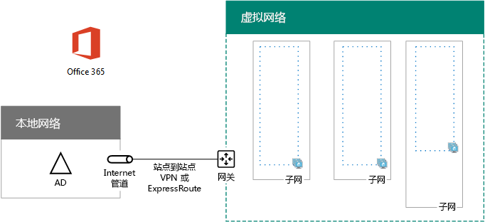

# <a name="high-availability-federated-authentication-phase-1-configure-azure"></a>高可用性联合身份验证阶段 1:配置 Azure

 **摘要：**配置 Microsoft Azure 基础结构主机为 Office 365 的高可用性，联合身份验证。
  
在此阶段中，您可以创建资源组，存储帐户，Azure 将承载在阶段 2、 3 和 4 中的虚拟机中的虚拟网络 (VNet) 和可用性设置。您必须先完成这一阶段之前移动到[高可用性联合身份验证阶段 2： 配置域控制器](high-availability-federated-authentication-phase-2-configure-domain-controllers.md)。请参阅[Office 365 Azure 中部署高可用性联合身份验证](deploy-high-availability-federated-authentication-for-office-365-in-azure.md)所有阶段。
  
这些基本组件，必须设置 azure:
  
- 资源组
    
- 使用子网托管 Azure 虚拟机的跨界 Azure 虚拟网络 (VNet)
    
- 执行子网隔离的网络安全组
    
- 可用性集
    
## <a name="configure-azure-components"></a>配置 Azure 组件

配置 Azure 的组件之前，请填写下表。为了帮助您配置 Azure 的过程中，打印此部分并记下所需的信息或复制到文档的此部分并填写。VNet 的设置，请填写表格 V。
  
|**项**|**配置设置**|**说明**|**值**|
|:-----|:-----|:-----|:-----|
|1.  <br/> |VNet 名称  <br/> |要分配给 VNet 的名称（示例 FedAuthNet）。  <br/> |_______________________________  <br/> |
|2.  <br/> |VNet 的位置  <br/> |将包含虚拟网络的区域 Azure 数据中心。  <br/> |_______________________________  <br/> |
|3.  <br/> |VPN 设备 IP 地址  <br/> |Internet 上 VPN 设备接口的公共 IPv4 地址。   <br/> |_______________________________  <br/> |
|4.  <br/> |VNet 地址空间  <br/> |虚拟网络的地址空间。与 IT 部门协作，以确定该地址空间。  <br/> |_______________________________  <br/> |
|5.  <br/> |IPsec 共享的密钥  <br/> |32 个字符随机的字母数字字符串，用于进行身份验证的站点到站点 VPN 连接的两端。使用您的 IT 或安全部门来确定此项的值。另外，请参阅[创建 IPsec 预共享密钥的随机字符串](http://social.technet.microsoft.com/wiki/contents/articles/32330.create-a-random-string-for-an-ipsec-preshared-key.aspx)。<br/> |_______________________________  <br/> |
   
 **表 V：跨部署虚拟网络配置**
  
接下来，填写针对此解决方案的子网的表 S。所有地址空间应为无类别域际路由选择 (CIDR) 格式，也称为网络前缀格式。例如，10.24.64.0/20。
  
对于前三个子网，请指定名称和基于虚拟网络地址空间的单个 IP 地址空间。对于网关子网，请通过以下过程为 Azure 网关子网确定 27 位地址空间（带有 /27 前缀长度）：
  
1. 将 VNet 地址空间的可变位设置为 1，直到用于网关子网的位，然后将剩余位设置为 0。
    
2. 将生成位转换为十进制并表示为一个地址空间，其中将前缀长度设置为网关子网的大小。
    
请参阅[Azure 的网关的子网的地址空间计算器](https://gallery.technet.microsoft.com/scriptcenter/Address-prefix-calculator-a94b6eed)PowerShell 命令块和 C# 或 Python 控制台应用程序为您执行此计算。
  
与 IT 部门协作以确定这些虚拟网络地址空间中的地址空间。
  
|**项目**|**子网名称**|**子网地址空间**|**目的**|
|:-----|:-----|:-----|:-----|
|1.  <br/> |_______________________________  <br/> |_______________________________  <br/> |Windows Server Active Directory (AD) 域控制器和目录同步服务器虚拟机 (VM) 使用的子网。  <br/> |
|2.  <br/> |_______________________________  <br/> |_______________________________  <br/> |AD FS VM 使用的子网。  <br/> |
|3.  <br/> |_______________________________  <br/> |_______________________________  <br/> |Web 应用程序代理 VM 使用的子网。  <br/> |
|4.  <br/> |GatewaySubnet  <br/> |_______________________________  <br/> |Azure 网关 VM 使用的子网。  <br/> |
   
 **表 S：虚拟网络中的子网**
  
下一步，针对分配给虚拟机和负载平衡器实例的静态 IP 地址填写表 I。
  
|**项**|**用途**|**在子网的 IP 地址**|**值**|
|:-----|:-----|:-----|:-----|
|1.  <br/> |第一个域控制器的静态 IP 地址  <br/> |在表 S 的项目 1 中定义的子网地址空间的第四个可能的 IP 地址。  <br/> |_______________________________  <br/> |
|2.  <br/> |第二个域控制器的静态 IP 地址  <br/> |在表 S 的项目 1 中定义的子网地址空间的第五个可能的 IP 地址。  <br/> |_______________________________  <br/> |
|3.  <br/> |目录同步服务器的静态 IP 地址  <br/> |在表 S 的第 1 项中定义的子网地址空间的第六个可能的 IP 地址。  <br/> |_______________________________  <br/> |
|4.  <br/> |AD FS 服务器内部负载均衡器的静态 IP 地址  <br/> |在表 S 的项目 2 中定义的子网地址空间的第四个可能的 IP 地址。  <br/> |_______________________________  <br/> |
|5.  <br/> |第一个 AD FS 服务器的静态 IP 地址  <br/> |在表 S 的项目 2 中定义的子网地址空间的第五个可能的 IP 地址。  <br/> |_______________________________  <br/> |
|6.  <br/> |第二个 AD FS 服务器的静态 IP 地址  <br/> |在表 S 的项目 2 中定义的子网地址空间的第六个可能的 IP 地址。  <br/> |_______________________________  <br/> |
|7.  <br/> |第一个 Web 应用程序代理服务器的静态 IP 地址  <br/> |在表 S 的项目 3 中定义的子网地址空间的第四个可能的 IP 地址。  <br/> |_______________________________  <br/> |
|8。  <br/> |第二个 Web 应用程序代理服务器的静态 IP 地址  <br/> |在表 S 的项目 3 中定义的子网地址空间的第五个可能的 IP 地址。  <br/> |_______________________________  <br/> |
   
 **在虚拟网络中的表格 i： 静态 IP 地址**
  
对于本地网络中你最初在虚拟网络中设置域控制器时想要使用的两个域名系统 (DNS) 服务器，请填写表 D。与 IT 部门协作，以确定该列表。
  
|**项目**|**DNS 服务器的友好名称**|**DNS 服务器的 IP 地址**|
|:-----|:-----|:-----|
|1.  <br/> |_______________________________  <br/> |_______________________________  <br/> |
|2.  <br/> |_______________________________  <br/> |_______________________________  <br/> |
   
 **表 D：本地 DNS 服务器**
  
要通过站点间 VPN 连接将数据包从跨界网络传输到组织网络，你必须使用本地网络配置虚拟网络。此本地网络包含组织的本地网络上所有可访问位置的地址空间列表（使用 CIDR 表示法）。用于定义本地网络的地址空间列表必须是唯一的，并且不得与用于其他虚拟网络或其他本地网络的地址空间重叠。
  
对于本地网络地址空间集，请填写表 L。请注意已列出三个空白条目，但通常需要更多。与 IT 部门协作，以确定该地址空间列表。
  
|**项目**|**本地网络地址空间**|
|:-----|:-----|
|1.  <br/> |_______________________________  <br/> |
|2.  <br/> |_______________________________  <br/> |
|3.  <br/> |_______________________________  <br/> |
   
 **表 L：本地网络的地址前缀**
  
现在让我们开始构建 Azure 基础结构来托管你的 Office 365 联合身份验证。
  
> [!NOTE]
> 下面的命令设置使用 Azure PowerShell 的最新版本。请参阅[开始使用 Azure PowerShell cmdlet](https://docs.microsoft.com/en-us/powershell/azureps-cmdlets-docs/)。 
  
首先，启动 Azure PowerShell 提示符并登录到你的帐户。
  
```
Login-AzureRMAccount
```

> [!TIP]
> 对于包含所有这篇文章并生成基于您的自定义设置的现成 PowerShell 命令块的 Microsoft Excel 配置工作簿中的 PowerShell 命令的文本文件，请参阅[Office 365 的联合身份验证中的Azure 部署工具包](https://gallery.technet.microsoft.com/Federated-Authentication-8a9f1664)。 
  
使用以下命令获得订阅名称。
  
```
Get-AzureRMSubscription | Sort Name | Select Name
```

对于 Azure PowerShell 的旧版本，而是使用此命令。
  
```
Get-AzureRMSubscription | Sort Name | Select SubscriptionName
```

设置 Azure 订购。引号，包括的所有内容替换\<和 > 字符，用正确的名称。
  
```
$subscr="<subscription name>"
Get-AzureRmSubscription -SubscriptionName $subscr | Select-AzureRmSubscription
```

接下来，创建新的资源组。要确定唯一的一组资源组名称，请使用此命令列出现有的资源组。
  
```
Get-AzureRMResourceGroup | Sort ResourceGroupName | Select ResourceGroupName
```

为一组唯一资源组名称填写下表。
  
|**项**|**资源组名称**|**目的**|
|:-----|:-----|:-----|
|1.  <br/> |_______________________________  <br/> |域控制器  <br/> |
|2.  <br/> |_______________________________  <br/> |AD FS 服务器  <br/> |
|3.  <br/> |_______________________________  <br/> |Web 应用程序代理服务器  <br/> |
|4.  <br/> |_______________________________  <br/> |基础结构元素  <br/> |
   
 **： 表资源组**
  
使用这些命令创建新的资源组。
  
```
$locName="<an Azure location, such as West US>"
$rgName="<Table R - Item 1 - Name column>"
New-AzureRMResourceGroup -Name $rgName -Location $locName
$rgName="<Table R - Item 2 - Name column>"
New-AzureRMResourceGroup -Name $rgName -Location $locName
$rgName="<Table R - Item 3 - Name column>"
New-AzureRMResourceGroup -Name $rgName -Location $locName
$rgName="<Table R - Item 4 - Name column>"
New-AzureRMResourceGroup -Name $rgName -Location $locName
```

接下来，请创建 Azure 虚拟网络及其子网。
  
```
$rgName="<Table R - Item 4 - Resource group name column>"
$locName="<your Azure location>"
$vnetName="<Table V - Item 1 - Value column>"
$vnetAddrPrefix="<Table V - Item 4 - Value column>"
$dnsServers=@( "<Table D - Item 1 - DNS server IP address column>", "<Table D - Item 2 - DNS server IP address column>" )
# Get the shortened version of the location
$locShortName=(Get-AzureRmResourceGroup -Name $rgName).Location

# Create the subnets
$subnet1Name="<Table S - Item 1 - Subnet name column>"
$subnet1Prefix="<Table S - Item 1 - Subnet address space column>"
$subnet1=New-AzureRMVirtualNetworkSubnetConfig -Name $subnet1Name -AddressPrefix $subnet1Prefix
$subnet2Name="<Table S - Item 2 - Subnet name column>"
$subnet2Prefix="<Table S - Item 2 - Subnet address space column>"
$subnet2=New-AzureRMVirtualNetworkSubnetConfig -Name $subnet2Name -AddressPrefix $subnet2Prefix
$subnet3Name="<Table S - Item 3 - Subnet name column>"
$subnet3Prefix="<Table S - Item 3 - Subnet address space column>"
$subnet3=New-AzureRMVirtualNetworkSubnetConfig -Name $subnet3Name -AddressPrefix $subnet3Prefix
$gwSubnet4Prefix="<Table S - Item 4 - Subnet address space column>"
$gwSubnet=New-AzureRMVirtualNetworkSubnetConfig -Name "GatewaySubnet" -AddressPrefix $gwSubnet4Prefix

# Create the virtual network
New-AzureRMVirtualNetwork -Name $vnetName -ResourceGroupName $rgName -Location $locName -AddressPrefix $vnetAddrPrefix -Subnet $gwSubnet,$subnet1,$subnet2,$subnet3 -DNSServer $dnsServers

```

接下来，创建网络安全组的每个子网包含的虚拟机。若要执行的子网隔离，可以允许或拒绝的子网的网络安全组通信的特定类型的规则。
  
```
# Create network security groups
$vnet=Get-AzureRMVirtualNetwork -ResourceGroupName $rgName -Name $vnetName

New-AzureRMNetworkSecurityGroup -Name $subnet1Name -ResourceGroupName $rgName -Location $locShortName
$nsg=Get-AzureRMNetworkSecurityGroup -Name $subnet1Name -ResourceGroupName $rgName
Set-AzureRMVirtualNetworkSubnetConfig -VirtualNetwork $vnet -Name $subnet1Name -AddressPrefix $subnet1Prefix -NetworkSecurityGroup $nsg

New-AzureRMNetworkSecurityGroup -Name $subnet2Name -ResourceGroupName $rgName -Location $locShortName
$nsg=Get-AzureRMNetworkSecurityGroup -Name $subnet2Name -ResourceGroupName $rgName
Set-AzureRMVirtualNetworkSubnetConfig -VirtualNetwork $vnet -Name $subnet2Name -AddressPrefix $subnet2Prefix -NetworkSecurityGroup $nsg

New-AzureRMNetworkSecurityGroup -Name $subnet3Name -ResourceGroupName $rgName -Location $locShortName
$nsg=Get-AzureRMNetworkSecurityGroup -Name $subnet3Name -ResourceGroupName $rgName
Set-AzureRMVirtualNetworkSubnetConfig -VirtualNetwork $vnet -Name $subnet3Name -AddressPrefix $subnet3Prefix -NetworkSecurityGroup $nsg
```

下一步，请使用这些命令来创建站点间 VPN 连接的网关。
  
```
$rgName="<Table R - Item 4 - Resource group name column>"
$locName="<Azure location>"
$vnetName="<Table V - Item 1 - Value column>"
$vnet=Get-AzureRMVirtualNetwork -Name $vnetName -ResourceGroupName $rgName
$subnet=Get-AzureRmVirtualNetworkSubnetConfig -VirtualNetwork $vnet -Name "GatewaySubnet"

# Attach a virtual network gateway to a public IP address and the gateway subnet
$publicGatewayVipName="PublicIPAddress"
$vnetGatewayIpConfigName="PublicIPConfig"
New-AzureRMPublicIpAddress -Name $vnetGatewayIpConfigName -ResourceGroupName $rgName -Location $locName -AllocationMethod Dynamic
$publicGatewayVip=Get-AzureRMPublicIpAddress -Name $vnetGatewayIpConfigName -ResourceGroupName $rgName
$vnetGatewayIpConfig=New-AzureRMVirtualNetworkGatewayIpConfig -Name $vnetGatewayIpConfigName -PublicIpAddressId $publicGatewayVip.Id -Subnet $subnet

# Create the Azure gateway
$vnetGatewayName="AzureGateway"
$vnetGateway=New-AzureRMVirtualNetworkGateway -Name $vnetGatewayName -ResourceGroupName $rgName -Location $locName -GatewayType Vpn -VpnType RouteBased -IpConfigurations $vnetGatewayIpConfig

# Create the gateway for the local network
$localGatewayName="LocalNetGateway"
$localGatewayIP="<Table V - Item 3 - Value column>"
$localNetworkPrefix=@( <comma-separated, double-quote enclosed list of the local network address prefixes from Table L, example: "10.1.0.0/24", "10.2.0.0/24"> )
$localGateway=New-AzureRMLocalNetworkGateway -Name $localGatewayName -ResourceGroupName $rgName -Location $locName -GatewayIpAddress $localGatewayIP -AddressPrefix $localNetworkPrefix

# Define the Azure virtual network VPN connection
$vnetConnectionName="S2SConnection"
$vnetConnectionKey="<Table V - Item 5 - Value column>"
$vnetConnection=New-AzureRMVirtualNetworkGatewayConnection -Name $vnetConnectionName -ResourceGroupName $rgName -Location $locName -ConnectionType IPsec -SharedKey $vnetConnectionKey -VirtualNetworkGateway1 $vnetGateway -LocalNetworkGateway2 $localGateway

```

> [!NOTE]
> 联合身份验证单个用户的不依赖于任何内部资源。但是，如果此站点到站点 VPN 连接不可用，在 VNet 中的域控制器不会收到用户帐户和组在内部部署 Windows 服务器 AD 中所做的更新。为确保这不会发生，可以为站点到站点 VPN 连接配置高可用性。有关详细信息，请参阅[高度可跨内部和 VNet 到 VNet 的连接](https://docs.microsoft.com/azure/vpn-gateway/vpn-gateway-highlyavailable)
  
接下来，从此命令的显示内容中，记录用于虚拟网络的 Azure VPN 网关的公用 IPv4 地址。
  
```
Get-AzureRMPublicIpAddress -Name $publicGatewayVipName -ResourceGroupName $rgName
```

接下来，配置内部部署 VPN 设备连接到 Azure VPN 网关。有关详细信息，请参阅[配置 VPN 设备](https://docs.microsoft.com/azure/vpn-gateway/vpn-gateway-about-vpn-devices)。
  
若要配置本地 VPN 设备，需要以下各项：
  
- Azure VPN 网关的公用 IPv4 地址。
    
- 站点到站点 VPN 连接 （表 V-项目 5-值列） IPsec 预共享的密钥。
    
接下来，请确保虚拟网络的地址空间是可以从本地网络访问。这通常是通过以下操作完成：将对应于虚拟网络地址空间的路由添加到 VPN 设备中，然后将该路由公布到组织网络中其余的路由基础结构。与 IT 部门协作，以确定如何完成上述操作。
  
接下来，定义三个可用性集的名称。填写表 A。 
  
|**项**|**用途**|**可用性设置名称**|
|:-----|:-----|:-----|
|1.  <br/> |域控制器  <br/> |_______________________________  <br/> |
|2.  <br/> |AD FS 服务器  <br/> |_______________________________  <br/> |
|3.  <br/> |Web 应用程序代理服务器  <br/> |_______________________________  <br/> |
   
 **表 a： 可用性设置**
  
在第 2、3 和 4 阶段中创建虚拟机时，将需要这些名称。
  
通过这些 Azure PowerShell 命令创建新的可用性集。
  
```
$locName="<the Azure location for your new resource group>"
$rgName="<Table R - Item 1 - Resource group name column>"
$avName="<Table A - Item 1 - Availability set name column>"
New-AzureRMAvailabilitySet -Name $avName -ResourceGroupName $rgName -Location $locName
$rgName="<Table R - Item 2 - Resource group name column>"
$avName="<Table A - Item 2 - Availability set name column>"
New-AzureRMAvailabilitySet -Name $avName -ResourceGroupName $rgName -Location $locName
$rgName="<Table R - Item 3 - Resource group name column>"
$avName="<Table A - Item 3 - Availability set name column>"
New-AzureRMAvailabilitySet -Name $avName -ResourceGroupName $rgName -Location $locName
```

这是该阶段成功完成后生成的配置。
  
**第 1 阶段： Azure 基础结构以实现高可用性的 Office 365 的联合身份验证**


  
## <a name="next-step"></a>后续步骤

使用[高可用性联合身份验证阶段 2： 配置域控制器](high-availability-federated-authentication-phase-2-configure-domain-controllers.md)要继续进行此工作负载的配置。
  
## <a name="see-also"></a>See Also

[在 Azure 中部署 Office 365 的高可用性联合身份验证](deploy-high-availability-federated-authentication-for-office-365-in-azure.md)
  
[用于 Office 365 开发/测试环境的联合身份](federated-identity-for-your-office-365-dev-test-environment.md)
  
[云应用和混合解决方案](cloud-adoption-and-hybrid-solutions.md)

[Office 365 的联合标识](https://support.office.com/article/Understanding-Office-365-identity-and-Azure-Active-Directory-06a189e7-5ec6-4af2-94bf-a22ea225a7a9#bk_federated)


