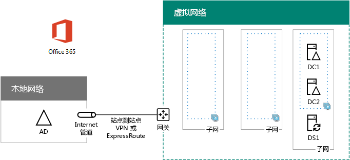

# <a name="high-availability-federated-authentication-phase-2-configure-domain-controllers"></a>高可用性联合身份验证阶段 2：配置域控制器

 **摘要：**在 Microsoft Azure 中配置域控制器和 Office 365 提供您的高可用性联合身份验证的目录同步服务器。
  
在为 Azure 基础结构服务中的 Office 365 联合身份验证部署高可用性的这一阶段中，可以在 Azure 虚拟网络中配置两个域控制器和目录同步服务器。然后用于身份验证的客户端 Web 请求可以在 Azure 虚拟网络中进行身份验证，而不是将通过站点到站点 VPN 连接的该身份验证流量发送到本地网络。
  
> [!NOTE]
> Active Directory 联合身份验证服务 (AD FS) 不能用 Azure Active Directory 域服务代替 Windows Server AD 域控制器。 
  
您必须先完成这一阶段之前移动到[高可用性联合身份验证阶段 3： 配置 AD FS 服务器](high-availability-federated-authentication-phase-3-configure-ad-fs-servers.md)。请参阅[Office 365 Azure 中部署高可用性联合身份验证](deploy-high-availability-federated-authentication-for-office-365-in-azure.md)所有阶段。
  
## <a name="create-the-domain-controller-virtual-machines-in-azure"></a>在 Azure 中创建域控制器虚拟机

首先，您需要填写表格 M 的**虚拟机名称**列中，根据需要在**最小大小**列中修改虚拟机大小。
  
|**项**|**虚拟机的名称**|**插图**|**存储类型**|**最小大小**|
|:-----|:-----|:-----|:-----|:-----|
|1.  <br/> |______________（第一个域控制器，例如 DC1）  <br/> |Windows Server 2016 数据中心  <br/> |StandardLRS  <br/> |Standard_D2  <br/> |
|2.  <br/> |______________（第二个域控制器，例如 DC2）  <br/> |Windows Server 2016 数据中心  <br/> |StandardLRS  <br/> |Standard_D2  <br/> |
|3.  <br/> |______________ （目录同步服务器，示例 DS1）  <br/> |Windows Server 2016 数据中心  <br/> |StandardLRS  <br/> |Standard_D2  <br/> |
|4.  <br/> |______________ （第一个 AD FS 服务器，示例 ADFS1）  <br/> |Windows Server 2016 数据中心  <br/> |StandardLRS  <br/> |Standard_D2  <br/> |
|5.  <br/> |______________ （第二个 AD FS 服务器，示例 ADFS2）  <br/> |Windows Server 2016 数据中心  <br/> |StandardLRS  <br/> |Standard_D2  <br/> |
|6.  <br/> |______________ （第一个 Web 应用程序代理服务器，示例 WEB1）  <br/> |Windows Server 2016 数据中心  <br/> |StandardLRS  <br/> |Standard_D2  <br/> |
|7.  <br/> |______________ （第二个 Web 应用程序代理服务器，示例 WEB2）  <br/> |Windows Server 2016 数据中心  <br/> |StandardLRS  <br/> |Standard_D2  <br/> |
   
 **表 M-Azure 中的 Office 365 的高可用性联合身份验证的虚拟机**
  
虚拟机大小的完整列表，请参阅[虚拟机大小](https://docs.microsoft.com/azure/virtual-machines/virtual-machines-windows-sizes)。
  
下面的 Azure PowerShell 命令块创建的两个域控制器虚拟机。为指定的值的变量，删除\<和 > 字符。请注意此 Azure PowerShell 命令块，使用下表中的值：
  
- 表 M，用于虚拟机
    
- 表 R，用于资源组
    
- 表 V，用于虚拟网络设置
    
- 表 S，用于子网
    
- 表 I，用于静态 IP 地址
    
- 表 A（针对可用性集）
    
记得您定义表 R、 V、 S、 I、 和中的[高可用性联合身份验证阶段 1： 配置 Azure](high-availability-federated-authentication-phase-1-configure-azure.md)。
  
> [!NOTE]
> 下面的命令设置使用 Azure PowerShell 的最新版本。请参阅[开始使用 Azure PowerShell cmdlet](https://docs.microsoft.com/en-us/powershell/azureps-cmdlets-docs/)。 
  
提供所有正确值后，在 Azure PowerShell 提示符处或本地计算机的 PowerShell 集成脚本环境 (ISE) 上运行生成块。
  
> [!TIP]
> 对于包含所有这篇文章并生成基于您的自定义设置的现成 PowerShell 命令块的 Microsoft Excel 配置工作簿中的 PowerShell 命令的文本文件，请参阅[Office 365 的联合身份验证中的Azure 部署工具包](https://gallery.technet.microsoft.com/Federated-Authentication-8a9f1664)。 
  
```
# Set up variables common to both virtual machines
$locName="<your Azure location>"
$vnetName="<Table V - Item 1 - Value column>"
$subnetName="<Table S - Item 1 - Value column>"
$avName="<Table A - Item 1 - Availability set name column>"
$rgNameTier="<Table R - Item 1 - Resource group name column>"
$rgNameInfra="<Table R - Item 4 - Resource group name column>"

$rgName=$rgNameInfra
$vnet=Get-AzureRMVirtualNetwork -Name $vnetName -ResourceGroupName $rgName
$subnet=Get-AzureRmVirtualNetworkSubnetConfig -VirtualNetwork $vnet -Name $subnetName

$rgName=$rgNameTier
$avSet=Get-AzureRMAvailabilitySet -Name $avName -ResourceGroupName $rgName 

# Create the first domain controller
$vmName="<Table M - Item 1 - Virtual machine name column>"
$vmSize="<Table M - Item 1 - Minimum size column>"
$staticIP="<Table I - Item 1 - Value column>"
$diskStorageType="<Table M - Item 1 - Storage type column>"
$diskSize=<size of the extra disk for Windows Server AD data in GB>

$nic=New-AzureRMNetworkInterface -Name ($vmName +"-NIC") -ResourceGroupName $rgName -Location $locName -Subnet $subnet -PrivateIpAddress $staticIP
$vm=New-AzureRMVMConfig -VMName $vmName -VMSize $vmSize -AvailabilitySetId $avset.Id
$vm=Set-AzureRmVMOSDisk -VM $vm -Name ($vmName +"-OS") -DiskSizeInGB 128 -CreateOption FromImage -StorageAccountType $diskStorageType
$diskConfig=New-AzureRmDiskConfig -AccountType $diskStorageType -Location $locName -CreateOption Empty -DiskSizeGB $diskSize
$dataDisk1=New-AzureRmDisk -DiskName ($vmName + "-DataDisk1") -Disk $diskConfig -ResourceGroupName $rgName
$vm=Add-AzureRmVMDataDisk -VM $vm -Name ($vmName + "-DataDisk1") -CreateOption Attach -ManagedDiskId $dataDisk1.Id -Lun 1
$cred=Get-Credential -Message "Type the name and password of the local administrator account for the first domain controller." 
$vm=Set-AzureRMVMOperatingSystem -VM $vm -Windows -ComputerName $vmName -Credential $cred -ProvisionVMAgent -EnableAutoUpdate
$vm=Set-AzureRMVMSourceImage -VM $vm -PublisherName MicrosoftWindowsServer -Offer WindowsServer -Skus 2016-Datacenter -Version "latest"
$vm=Add-AzureRMVMNetworkInterface -VM $vm -Id $nic.Id
New-AzureRMVM -ResourceGroupName $rgName -Location $locName -VM $vm

# Create the second domain controller
$vmName="<Table M - Item 2 - Virtual machine name column>"
$vmSize="<Table M - Item 2 - Minimum size column>"
$staticIP="<Table I - Item 2 - Value column>"
$diskStorageType="<Table M - Item 2 - Storage type column>"
$diskSize=<size of the extra disk for Windows Server AD data in GB>

$nic=New-AzureRMNetworkInterface -Name ($vmName +"-NIC") -ResourceGroupName $rgName -Location $locName -Subnet $subnet -PrivateIpAddress $staticIP
$vm=New-AzureRMVMConfig -VMName $vmName -VMSize $vmSize -AvailabilitySetId $avset.Id
$vm=Set-AzureRmVMOSDisk -VM $vm -Name ($vmName +"-OS") -DiskSizeInGB 128 -CreateOption FromImage -StorageAccountType $diskStorageType
$diskConfig=New-AzureRmDiskConfig -AccountType $diskStorageType -Location $locName -CreateOption Empty -DiskSizeGB $diskSize
$dataDisk1=New-AzureRmDisk -DiskName ($vmName + "-DataDisk1") -Disk $diskConfig -ResourceGroupName $rgName
$vm=Add-AzureRmVMDataDisk -VM $vm -Name ($vmName + "-DataDisk1") -CreateOption Attach -ManagedDiskId $dataDisk1.Id -Lun 1
$cred=Get-Credential -Message "Type the name and password of the local administrator account for the second domain controller." 
$vm=Set-AzureRMVMOperatingSystem -VM $vm -Windows -ComputerName $vmName -Credential $cred -ProvisionVMAgent -EnableAutoUpdate
$vm=Set-AzureRMVMSourceImage -VM $vm -PublisherName MicrosoftWindowsServer -Offer WindowsServer -Skus 2016-Datacenter -Version "latest"
$vm=Add-AzureRMVMNetworkInterface -VM $vm -Id $nic.Id
New-AzureRMVM -ResourceGroupName $rgName -Location $locName -VM $vm

# Create the DirSync server
$vmName="<Table M - Item 3 - Virtual machine name column>"
$vmSize="<Table M - Item 3 - Minimum size column>"
$staticIP="<Table I - Item 3 - Value column>"
$diskStorageType="<Table M - Item 3 - Storage type column>"

$nic=New-AzureRMNetworkInterface -Name ($vmName +"-NIC") -ResourceGroupName $rgName -Location $locName -Subnet $subnet -PrivateIpAddress $staticIP
$vm=New-AzureRMVMConfig -VMName $vmName -VMSize $vmSize

$cred=Get-Credential -Message "Type the name and password of the local administrator account for the DirSync server." 
$vm=Set-AzureRMVMOperatingSystem -VM $vm -Windows -ComputerName $vmName -Credential $cred -ProvisionVMAgent -EnableAutoUpdate
$vm=Set-AzureRMVMSourceImage -VM $vm -PublisherName MicrosoftWindowsServer -Offer WindowsServer -Skus 2016-Datacenter -Version "latest"
$vm=Add-AzureRMVMNetworkInterface -VM $vm -Id $nic.Id
$vm=Set-AzureRmVMOSDisk -VM $vm -Name ($vmName +"-OS") -DiskSizeInGB 128 -CreateOption FromImage -StorageAccountType $diskStorageType
New-AzureRMVM -ResourceGroupName $rgName -Location $locName -VM $vm
```

> [!NOTE]
> 由于这些虚拟机的内部网应用程序，它们不是分配的公共 IP 地址或 DNS 域名称标签，暴露给 Internet。但是，这也意味着您不能从 Azure 门户连接到它们。查看虚拟机的属性时，**连接**选项不可用。使用远程桌面连接附件或另一个远程桌面的工具连接到虚拟机使用其专用的 IP 地址或 intranet DNS 名称。
  
## <a name="configure-the-first-domain-controller"></a>配置第一个域控制器

使用你选择的远程桌面客户端并创建到第一个域控制器虚拟机的远程桌面连接。使用其 Intranet DNS 或计算机名称以及本地管理员帐户的凭据。
  
接下来，添加额外的数据磁盘使用此命令的第一个域控制器从 Windows PowerShell 命令提示符**上第一个域控制器虚拟机**：
  
```
Get-Disk | Where PartitionStyle -eq "RAW" | Initialize-Disk -PartitionStyle MBR -PassThru | New-Partition -AssignDriveLetter -UseMaximumSize | Format-Volume -FileSystem NTFS -NewFileSystemLabel "WSAD Data"
```

接下来，使用**ping**命令名称和您组织的网络上的资源的 IP 地址执行 ping 测试的第一个域控制器连接到组织网络上的位置。
  
此过程确保 DNS 名称解析正常进行（已为该虚拟机正确配置本地 DNS 服务器），并可以向/从跨本地虚拟网络发送数据。如果这个基本测试失败，请与你的 IT 部门联系，来解决 DNS 名称解析和数据包传递问题。
  
接下来，从第一个域控制器的 Windows PowerShell 命令提示符处运行以下命令：
  
```
$domname="<DNS domain name of the domain for which this computer will be a domain controller, such as corp.contoso.com>"
$cred = Get-Credential -Message "Enter credentials of an account with permission to join a new domain controller to the domain"
Install-WindowsFeature AD-Domain-Services -IncludeManagementTools
Install-ADDSDomainController -InstallDns -DomainName $domname  -DatabasePath "F:\\NTDS" -SysvolPath "F:\\SYSVOL" -LogPath "F:\\Logs" -Credential $cred
```

系统将提示你提供域管理员帐户的凭据。计算机将重新启动。
  
## <a name="configure-the-second-domain-controller"></a>配置第二个域控制器

使用你选择的远程桌面客户端并创建到第二个域控制器虚拟机的远程桌面连接。使用其 Intranet DNS 或计算机名称以及本地管理员帐户的凭据。
  
接下来，您需要从 Windows PowerShell 命令提示符**上第二个域控制器虚拟机**向具有此命令的第二个域控制器中添加额外的数据磁盘：
  
```
Get-Disk | Where PartitionStyle -eq "RAW" | Initialize-Disk -PartitionStyle MBR -PassThru | New-Partition -AssignDriveLetter -UseMaximumSize | Format-Volume -FileSystem NTFS -NewFileSystemLabel "WSAD Data"
```

接下来，请运行以下命令：
  
```
$domname="<DNS domain name of the domain for which this computer will be a domain controller, such as corp.contoso.com>"
$cred = Get-Credential -Message "Enter credentials of an account with permission to join a new domain controller to the domain"
Install-WindowsFeature AD-Domain-Services -IncludeManagementTools
Install-ADDSDomainController -InstallDns -DomainName $domname  -DatabasePath "F:\\NTDS" -SysvolPath "F:\\SYSVOL" -LogPath "F:\\Logs" -Credential $cred

```

系统将提示你提供域管理员帐户的凭据。计算机将重新启动。
  
接下来，您需要更新的 DNS 服务器的虚拟网络，以便该 Azure 将虚拟机分配了两个新的域控制器用作其 DNS 服务器的 IP 地址。填充的变量中，然后从 Windows PowerShell 命令提示符运行这些命令，您的本地计算机上：
  
```
$rgName="<Table R - Item 4 - Resource group name column>"
$adrgName="<Table R - Item 1 - Resource group name column>"
$locName="<your Azure location>"
$vnetName="<Table V - Item 1 - Value column>"
$onpremDNSIP1="<Table D - Item 1 - DNS server IP address column>"
$onpremDNSIP2="<Table D - Item 2 - DNS server IP address column>"
$staticIP1="<Table I - Item 1 - Value column>"
$staticIP2="<Table I - Item 2 - Value column>"
$firstDCName="<Table M - Item 1 - Virtual machine name column>"
$secondDCName="<Table M - Item 2 - Virtual machine name column>"

$vnet=Get-AzureRMVirtualNetwork -ResourceGroupName $rgName -Name $vnetName
$vnet.DhcpOptions.DnsServers.Add($staticIP1)
$vnet.DhcpOptions.DnsServers.Add($staticIP2) 
$vnet.DhcpOptions.DnsServers.Remove($onpremDNSIP1)
$vnet.DhcpOptions.DnsServers.Remove($onpremDNSIP2) 
Set-AzureRMVirtualNetwork -VirtualNetwork $vnet
Restart-AzureRMVM -ResourceGroupName $adrgName -Name $firstDCName
Restart-AzureRMVM -ResourceGroupName $adrgName -Name $secondDCName
```

请注意，我们重新启动两个域控制器，这样不会为它们配置本地 DNS 服务器作为 DNS 服务器。因为这两个控制器本身就是 DNS 服务器，因此在升级为域控制器后会自动为它们配置本地 DNS 服务器作为 DNS 转发器。
  
接下来，我们需要创建一个 Active Directory 复制站点以确保 Azure 虚拟网络中的服务器使用本地域控制器。使用域管理员帐户连接到任一域控制器，从管理员级 Windows PowerShell 提示符处运行以下命令：
  
```
$vnet="<Table V - Item 1 - Value column>"
$vnetSpace="<Table V - Item 4 - Value column>"
New-ADReplicationSite -Name $vnet 
New-ADReplicationSubnet -Name $vnetSpace -Site $vnet
```

## <a name="configure-the-dirsync-server"></a>配置目录同步服务器

使用您所选的远程桌面客户端，并创建与目录同步服务器虚拟机的远程桌面连接。使用内联网 DNS 或计算机名称和本地管理员帐户的凭据。
  
接下来，通过 Windows PowerShell 提示符下的这些命令将其加入相应的 Windows Server AD 域。
  
```
$domName="<Windows Server AD domain name to join, such as corp.contoso.com>"
$cred=Get-Credential -Message "Type the name and password of a domain acccount."
Add-Computer -DomainName $domName -Credential $cred
Restart-Computer
```

以下是因成功完成这一阶段后生成的配置，包含占位符计算机名称。
  
**第 2 阶段： 域控制器，您的高可用性 Azure 中的联合身份验证基础结构的目录同步服务器**


  
## <a name="next-step"></a>后续步骤

使用[高可用性联合身份验证阶段 3： 配置 AD FS 服务器](high-availability-federated-authentication-phase-3-configure-ad-fs-servers.md)继续配置此工作负载。
  
## <a name="see-also"></a>See Also

[在 Azure 中部署 Office 365 的高可用性联合身份验证](deploy-high-availability-federated-authentication-for-office-365-in-azure.md)
  
[用于 Office 365 开发/测试环境的联合身份](federated-identity-for-your-office-365-dev-test-environment.md)
  
[云应用和混合解决方案](cloud-adoption-and-hybrid-solutions.md)

[Office 365 的联合标识](https://support.office.com/article/Understanding-Office-365-identity-and-Azure-Active-Directory-06a189e7-5ec6-4af2-94bf-a22ea225a7a9#bk_federated)


