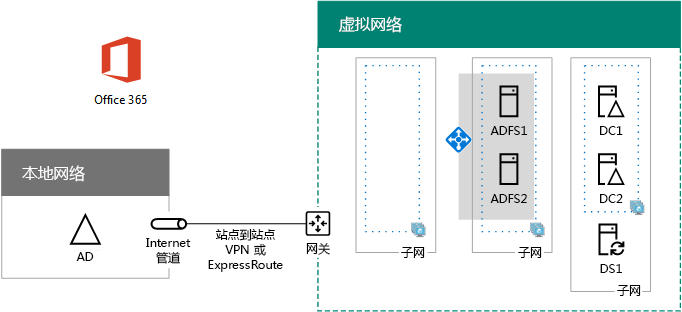

# <a name="high-availability-federated-authentication-phase-3-configure-ad-fs-servers"></a><span data-ttu-id="318e3-103">高可用性联合身份验证阶段 3：配置 AD FS 服务器</span><span class="sxs-lookup"><span data-stu-id="318e3-103">High availability federated authentication Phase 3: Configure AD FS servers</span></span>

 <span data-ttu-id="318e3-104">**摘要：**创建和配置 Microsoft Azure 中的 Active Directory 联合身份验证服务 (AD FS) Office 365 提供您的高可用性联合身份验证服务器。</span><span class="sxs-lookup"><span data-stu-id="318e3-104">**Summary:** Create and configure the Active Directory Federation Services (AD FS) servers for your high availability federated authentication for Office 365 in Microsoft Azure.</span></span>
  
<span data-ttu-id="318e3-105">在为 Azure 基础结构服务中的 Office 365 联合身份验证部署高可用性的这一阶段中，创建一个内部负载均衡器和两个 AD FS 服务器。</span><span class="sxs-lookup"><span data-stu-id="318e3-105">In this phase of deploying high availability for Office 365 federated authentication in Azure infrastructure services, you create an internal load balancer and two AD FS servers.</span></span>
  
<span data-ttu-id="318e3-p101">您必须先完成这一阶段之前移动到[高可用性联合身份验证阶段 4： 配置 web 应用程序代理服务器](high-availability-federated-authentication-phase-4-configure-web-application-pro.md)。请参阅[Office 365 Azure 中部署高可用性联合身份验证](deploy-high-availability-federated-authentication-for-office-365-in-azure.md)所有阶段。</span><span class="sxs-lookup"><span data-stu-id="318e3-p101">You must complete this phase before moving on to [High availability federated authentication Phase 4: Configure web application proxies](high-availability-federated-authentication-phase-4-configure-web-application-pro.md). See [Deploy high availability federated authentication for Office 365 in Azure](deploy-high-availability-federated-authentication-for-office-365-in-azure.md) for all of the phases.</span></span>
  
## <a name="create-the-ad-fs-server-virtual-machines-in-azure"></a><span data-ttu-id="318e3-108">在 Azure 中创建 AD FS 服务器虚拟机</span><span class="sxs-lookup"><span data-stu-id="318e3-108">Create the AD FS server virtual machines in Azure</span></span>

<span data-ttu-id="318e3-p102">使用以下 PowerShell 命令块创建两个 AD FS 服务器的虚拟机。此 PowerShell 命令集使用下表中的值：</span><span class="sxs-lookup"><span data-stu-id="318e3-p102">Use the following block of PowerShell commands to create the virtual machines for the two AD FS servers. This PowerShell command set uses values from the following tables:</span></span>
  
- <span data-ttu-id="318e3-111">表 M，用于虚拟机</span><span class="sxs-lookup"><span data-stu-id="318e3-111">Table M, for your virtual machines</span></span>
    
- <span data-ttu-id="318e3-112">表 R，用于资源组</span><span class="sxs-lookup"><span data-stu-id="318e3-112">Table R, for your resource groups</span></span>
    
- <span data-ttu-id="318e3-113">表 V，用于虚拟网络设置</span><span class="sxs-lookup"><span data-stu-id="318e3-113">Table V, for your virtual network settings</span></span>
    
- <span data-ttu-id="318e3-114">表 S，用于子网</span><span class="sxs-lookup"><span data-stu-id="318e3-114">Table S, for your subnets</span></span>
    
- <span data-ttu-id="318e3-115">表 I，用于静态 IP 地址</span><span class="sxs-lookup"><span data-stu-id="318e3-115">Table I, for your static IP addresses</span></span>
    
- <span data-ttu-id="318e3-116">表 A（针对可用性集）</span><span class="sxs-lookup"><span data-stu-id="318e3-116">Table A, for your availability sets</span></span>
    
<span data-ttu-id="318e3-117">记得您定义表中的 M[高可用性联合身份验证阶段 2： 配置域控制器](high-availability-federated-authentication-phase-2-configure-domain-controllers.md)和表 R、 V、 S、 I、 和中的[高可用性联合身份验证阶段 1： 配置 Azure](high-availability-federated-authentication-phase-1-configure-azure.md)。</span><span class="sxs-lookup"><span data-stu-id="318e3-117">Recall that you defined Table M in [High availability federated authentication Phase 2: Configure domain controllers](high-availability-federated-authentication-phase-2-configure-domain-controllers.md) and Tables R, V, S, I, and A in [High availability federated authentication Phase 1: Configure Azure](high-availability-federated-authentication-phase-1-configure-azure.md).</span></span>
  
> [!NOTE]
> <span data-ttu-id="318e3-p103">下面的命令设置使用 Azure PowerShell 的最新版本。请参阅[开始使用 Azure PowerShell cmdlet](https://docs.microsoft.com/en-us/powershell/azureps-cmdlets-docs/)。</span><span class="sxs-lookup"><span data-stu-id="318e3-p103">The following command sets use the latest version of Azure PowerShell. See [Get started with Azure PowerShell cmdlets](https://docs.microsoft.com/en-us/powershell/azureps-cmdlets-docs/).</span></span> 
  
<span data-ttu-id="318e3-p104">首先，创建 Azure 内部负载平衡器的两个 AD FS 服务器。为指定的值的变量，删除\<和 > 字符。当您提供了所有正确的值时，在 Azure PowerShell 命令提示符或 PowerShell ISE 运行产生的块。</span><span class="sxs-lookup"><span data-stu-id="318e3-p104">First, you create an Azure internal load balancer for the two AD FS servers. Specify the values for the variables, removing the \< and > characters. When you have supplied all the proper values, run the resulting block at the Azure PowerShell command prompt or in the PowerShell ISE.</span></span>
  
> [!TIP]
> <span data-ttu-id="318e3-123">对于包含所有这篇文章并生成基于您的自定义设置的现成 PowerShell 命令块的 Microsoft Excel 配置工作簿中的 PowerShell 命令的文本文件，请参阅[Office 365 的联合身份验证中的Azure 部署工具包](https://gallery.technet.microsoft.com/Federated-Authentication-8a9f1664)。</span><span class="sxs-lookup"><span data-stu-id="318e3-123">For a text file that contains all of the PowerShell commands in this article and a Microsoft Excel configuration workbook that generates ready-to-run PowerShell command blocks based on your custom settings, see the [Federated Authentication for Office 365 in Azure Deployment Kit](https://gallery.technet.microsoft.com/Federated-Authentication-8a9f1664).</span></span> 
  
```
# Set up key variables
$locName="<your Azure location>"
$vnetName="<Table V - Item 1 - Value column>"
$subnetName="<Table R - Item 2 - Subnet name column>"
$privIP="<Table I - Item 4 - Value column>"
$rgName=<Table R - Item 4 - Resource group name column>"

$vnet=Get-AzureRMVirtualNetwork -Name $vnetName -ResourceGroupName $rgName
$subnet=Get-AzureRmVirtualNetworkSubnetConfig -VirtualNetwork $vnet -Name $subnetName

$frontendIP=New-AzureRMLoadBalancerFrontendIpConfig -Name "ADFSServers-LBFE" -PrivateIPAddress $privIP -Subnet $subnet
$beAddressPool=New-AzureRMLoadBalancerBackendAddressPoolConfig -Name "ADFSServers-LBBE"

$healthProbe=New-AzureRMLoadBalancerProbeConfig -Name WebServersProbe -Protocol "TCP" -Port 443 -IntervalInSeconds 15 -ProbeCount 2
$lbrule=New-AzureRMLoadBalancerRuleConfig -Name "HTTPSTraffic" -FrontendIpConfiguration $frontendIP -BackendAddressPool $beAddressPool -Probe $healthProbe -Protocol "TCP" -FrontendPort 443 -BackendPort 443
New-AzureRMLoadBalancer -ResourceGroupName $rgName -Name "ADFSServers" -Location $locName -LoadBalancingRule $lbrule -BackendAddressPool $beAddressPool -Probe $healthProbe -FrontendIpConfiguration $frontendIP
```

<span data-ttu-id="318e3-124">接下来，创建 AD FS 服务器虚拟机。</span><span class="sxs-lookup"><span data-stu-id="318e3-124">Next, create the AD FS server virtual machines.</span></span>
  
<span data-ttu-id="318e3-125">提供所有正确值后，在 Azure PowerShell 命令提示符处或 PowerShell ISE 上运行生成块。</span><span class="sxs-lookup"><span data-stu-id="318e3-125">When you have supplied all the proper values, run the resulting block at the Azure PowerShell command prompt or in the PowerShell ISE.</span></span>
  
```
# Set up variables common to both virtual machines
$locName="<your Azure location>"
$vnetName="<Table V - Item 1 - Value column>"
$subnetName="<Table R - Item 2 - Subnet name column>"
$avName="<Table A - Item 2 - Availability set name column>"
$rgNameTier="<Table R - Item 2 - Resource group name column>"
$rgNameInfra="<Table R - Item 4 - Resource group name column>"

$rgName=$rgNameInfra
$vnet=Get-AzureRMVirtualNetwork -Name $vnetName -ResourceGroupName $rgName
$subnet=Get-AzureRmVirtualNetworkSubnetConfig -VirtualNetwork $vnet -Name $subnetName
$backendSubnet=Get-AzureRMVirtualNetworkSubnetConfig -Name $subnetName -VirtualNetwork $vnet
$webLB=Get-AzureRMLoadBalancer -ResourceGroupName $rgName -Name "ADFSServers"

$rgName=$rgNameTier
$avSet=Get-AzureRMAvailabilitySet -Name $avName -ResourceGroupName $rgName

# Create the first ADFS server virtual machine
$vmName="<Table M - Item 4 - Virtual machine name column>"
$vmSize="<Table M - Item 4 - Minimum size column>"
$staticIP="<Table I - Item 5 - Value column>"
$diskStorageType="<Table M - Item 4 - Storage type column>"

$nic=New-AzureRMNetworkInterface -Name ($vmName +"-NIC") -ResourceGroupName $rgName -Location $locName -Subnet $backendSubnet -LoadBalancerBackendAddressPool $webLB.BackendAddressPools[0] -PrivateIpAddress $staticIP
$vm=New-AzureRMVMConfig -VMName $vmName -VMSize $vmSize -AvailabilitySetId $avset.Id

$cred=Get-Credential -Message "Type the name and password of the local administrator account for the first AD FS server." 
$vm=Set-AzureRMVMOperatingSystem -VM $vm -Windows -ComputerName $vmName -Credential $cred -ProvisionVMAgent -EnableAutoUpdate
$vm=Set-AzureRMVMSourceImage -VM $vm -PublisherName MicrosoftWindowsServer -Offer WindowsServer -Skus 2016-Datacenter -Version "latest"
$vm=Add-AzureRMVMNetworkInterface -VM $vm -Id $nic.Id
$vm=Set-AzureRmVMOSDisk -VM $vm -Name ($vmName +"-OS") -DiskSizeInGB 128 -CreateOption FromImage -StorageAccountType $diskStorageType
New-AzureRMVM -ResourceGroupName $rgName -Location $locName -VM $vm

# Create the second AD FS virtual machine
$vmName="<Table M - Item 5 - Virtual machine name column>"
$vmSize="<Table M - Item 5 - Minimum size column>"
$staticIP="<Table I - Item 6 - Value column>"
$diskStorageType="<Table M - Item 5 - Storage type column>"

$nic=New-AzureRMNetworkInterface -Name ($vmName +"-NIC") -ResourceGroupName $rgName -Location $locName  -Subnet $backendSubnet -LoadBalancerBackendAddressPool $webLB.BackendAddressPools[0] -PrivateIpAddress $staticIP
$vm=New-AzureRMVMConfig -VMName $vmName -VMSize $vmSize -AvailabilitySetId $avset.Id

$cred=Get-Credential -Message "Type the name and password of the local administrator account for the second AD FS server." 
$vm=Set-AzureRMVMOperatingSystem -VM $vm -Windows -ComputerName $vmName -Credential $cred -ProvisionVMAgent -EnableAutoUpdate
$vm=Set-AzureRMVMSourceImage -VM $vm -PublisherName MicrosoftWindowsServer -Offer WindowsServer -Skus 2016-Datacenter -Version "latest"
$vm=Add-AzureRMVMNetworkInterface -VM $vm -Id $nic.Id
$vm=Set-AzureRmVMOSDisk -VM $vm -Name ($vmName +"-OS") -DiskSizeInGB 128 -CreateOption FromImage -StorageAccountType $diskStorageType
New-AzureRMVM -ResourceGroupName $rgName -Location $locName -VM $vm

```

> [!NOTE]
> <span data-ttu-id="318e3-p105">由于这些虚拟机的内部网应用程序，它们不是分配的公共 IP 地址或 DNS 域名称标签，暴露给 Internet。但是，这也意味着您不能从 Azure 门户连接到它们。查看虚拟机的属性时，**连接**选项不可用。使用远程桌面连接附件或另一个远程桌面的工具连接到虚拟机使用其专用的 IP 地址或 intranet DNS 名称。</span><span class="sxs-lookup"><span data-stu-id="318e3-p105">Because these virtual machines are for an intranet application, they are not assigned a public IP address or a DNS domain name label and exposed to the Internet. However, this also means that you cannot connect to them from the Azure portal. The **Connect** option is unavailable when you view the properties of the virtual machine. Use the Remote Desktop Connection accessory or another Remote Desktop tool to connect to the virtual machine using its private IP address or intranet DNS name.</span></span>
  
<span data-ttu-id="318e3-p106">对于每个虚拟机，请使用所选择的远程桌面客户端并创建远程桌面连接。使用其 Intranet DNS 或计算机名称以及本地管理员帐户的凭据。</span><span class="sxs-lookup"><span data-stu-id="318e3-p106">For each virtual machine, use the remote desktop client of your choice and create a remote desktop connection. Use its intranet DNS or computer name and the credentials of the local administrator account.</span></span>
  
<span data-ttu-id="318e3-132">对于每个虚拟机，请通过在 Windows PowerShell 提示符处输入这些命令将它们加入相应的 Windows Server AD 域。</span><span class="sxs-lookup"><span data-stu-id="318e3-132">For each virtual machine, join them to the appropriate Windows Server AD domain with these commands at the Windows PowerShell prompt.</span></span>
  
```
$domName="<Windows Server AD domain name to join, such as corp.contoso.com>"
$cred=Get-Credential -Message "Type the name and password of a domain acccount."
Add-Computer -DomainName $domName -Credential $cred
Restart-Computer
```

<span data-ttu-id="318e3-133">以下是因成功完成这一阶段后生成的配置，包含占位符计算机名称。</span><span class="sxs-lookup"><span data-stu-id="318e3-133">Here is the configuration resulting from the successful completion of this phase, with placeholder computer names.</span></span>
  
<span data-ttu-id="318e3-134">**阶段 3: AD FS 服务器和 Azure 中联合身份验证高可用性基础结构内部负载平衡器**</span><span class="sxs-lookup"><span data-stu-id="318e3-134">**Phase 3: The AD FS servers and internal load balancer for your high availability federated authentication infrastructure in Azure**</span></span>


  
## <a name="next-step"></a><span data-ttu-id="318e3-136">后续步骤</span><span class="sxs-lookup"><span data-stu-id="318e3-136">Next step</span></span>

<span data-ttu-id="318e3-137">使用[高可用性联合身份验证阶段 4： 配置 web 应用程序代理](high-availability-federated-authentication-phase-4-configure-web-application-pro.md)继续配置此工作负载。</span><span class="sxs-lookup"><span data-stu-id="318e3-137">Use [High availability federated authentication Phase 4: Configure web application proxies](high-availability-federated-authentication-phase-4-configure-web-application-pro.md) to continue configuring this workload.</span></span>
  
## <a name="see-also"></a><span data-ttu-id="318e3-138">另请参阅</span><span class="sxs-lookup"><span data-stu-id="318e3-138">See Also</span></span>

[<span data-ttu-id="318e3-139">在 Azure 中部署 Office 365 的高可用性联合身份验证</span><span class="sxs-lookup"><span data-stu-id="318e3-139">Deploy high availability federated authentication for Office 365 in Azure</span></span>](deploy-high-availability-federated-authentication-for-office-365-in-azure.md)
  
[<span data-ttu-id="318e3-140">用于 Office 365 开发/测试环境的联合身份</span><span class="sxs-lookup"><span data-stu-id="318e3-140">Federated identity for your Office 365 dev/test environment</span></span>](federated-identity-for-your-office-365-dev-test-environment.md)


