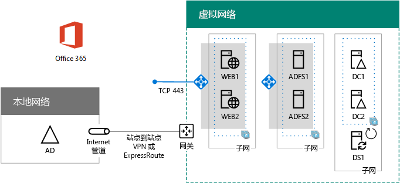

# <a name="high-availability-federated-authentication-phase-4-configure-web-application-proxies"></a>高可用性联合身份验证阶段 4:配置 Web 应用程序代理

 **摘要：**在 Microsoft Azure 中配置 Office 365 提供您的高可用性联合身份验证的 web 应用程序代理服务器。
  
在为 Azure 基础结构服务中的 Office 365 联合身份验证部署高可用性的这一阶段中，创建一个内部负载均衡器和两个 AD FS 服务器。
  
您必须先完成这一阶段之前移动到[高可用性联合身份验证阶段 5： 配置联合身份验证针对 Office 365 提供](high-availability-federated-authentication-phase-5-configure-federated-authentic.md)。请参阅[Office 365 Azure 中部署高可用性联合身份验证](deploy-high-availability-federated-authentication-for-office-365-in-azure.md)所有阶段。
  
## <a name="create-the-internet-facing-load-balancer-in-azure"></a>在 Azure 中创建面向 Internet 的负载均衡器

必须创建面向 Internet 的负载均衡器，以便 Azure 在两个 Web 应用程序代理服务器之间平均分发来自 Internet 的传入客户端身份验证通信。
  
> [!NOTE]
> 下面的命令设置使用 Azure PowerShell 的最新版本。请参阅[开始使用 Azure PowerShell cmdlet](https://docs.microsoft.com/en-us/powershell/azureps-cmdlets-docs/)。 
  
提供位置和资源组值后，在 Azure PowerShell 命令提示符处或 PowerShell ISE 中运行生成块。
  
> [!TIP]
> 对于包含所有这篇文章并生成基于您的自定义设置的现成 PowerShell 命令块的 Microsoft Excel 配置工作簿中的 PowerShell 命令的文本文件，请参阅[Office 365 的联合身份验证中的Azure 部署工具包](https://gallery.technet.microsoft.com/Federated-Authentication-8a9f1664)。 
  
```
# Set up key variables
$locName="<your Azure location>"
$rgName="<Table R - Item 4 - Resource group name column>"

$publicIP=New-AzureRmPublicIpAddress -ResourceGroupName $rgName -Name "WebProxyPublicIP" -Location $LocName -AllocationMethod "Static"
$frontendIP=New-AzureRmLoadBalancerFrontendIpConfig -Name "WebAppProxyServers-LBFE" -PublicIpAddress $publicIP
$beAddressPool=New-AzureRMLoadBalancerBackendAddressPoolConfig -Name "WebAppProxyServers-LBBE"
$healthProbe=New-AzureRMLoadBalancerProbeConfig -Name "WebServersProbe" -Protocol "TCP" -Port 443 -IntervalInSeconds 15 -ProbeCount 2
$lbrule=New-AzureRMLoadBalancerRuleConfig -Name "WebTraffic" -FrontendIpConfiguration $frontendIP -BackendAddressPool $beAddressPool -Probe $healthProbe -Protocol "TCP" -FrontendPort 443 -BackendPort 443
New-AzureRMLoadBalancer -ResourceGroupName $rgName -Name "WebAppProxyServers" -Location $locName -LoadBalancingRule $lbrule -BackendAddressPool $beAddressPool -Probe $healthProbe -FrontendIpConfiguration $frontendIP
```

若要显示分配给面向 Internet 的负载均衡器的公用 IP 地址，请在本地计算机上的 Azure PowerShell 命令提示符处运行以下命令：
  
```
Write-Host (Get-AzureRMPublicIpaddress -Name "WebProxyPublicIP" -ResourceGroup $rgName).IPAddress
```

## <a name="determine-your-federation-service-fqdn-and-create-dns-records"></a>确定联合身份验证服务 FQDN 并创建 DNS 记录

需要确定 DNS 名称以在 Internet 上标识联合身份验证服务名称。Azure AD Connect 将在阶段 5 中使用此名称来配置 Office 365，该名称将成为 Office 365 发送到连接客户端以获取安全令牌的 URL 的一部分。例如，fs.contoso.com（fs 代表联合身份验证服务）。
  
在拥有联合身份验证服务 FDQN 之后，创建联合身份验证服务 FDQN 的公用 DNS 域 A 记录，该完全限定的域名可解析为面向 Internet 的 Azure 负载均衡器的公用 IP 地址。
  
|**Name**|**Type**|**TTL**|**值**|
|:-----|:-----|:-----|:-----|
|联合身份验证服务 FDQN  <br/> |A  <br/> |3600  <br/> |公共 IP 地址 （通过在前一节中的**写入主机**命令显示） 的面向 Azure Internet 负载平衡器 <br/> |
   
下面是一个示例：
  
|**Name**|**Type**|**TTL**|**值**|
|:-----|:-----|:-----|:-----|
|fs.contoso.com  <br/> |A  <br/> |3600  <br/> |131.107.249.117  <br/> |
   
接下来，将一个 DNS 地址记录添加到组织的专用 DNS 命名空间，以将联合身份验证服务 FQDN 解析为分配给 AD FS 服务器（表 I，第 4 项，值列）的内部负载均衡器的专用 IP 地址。
  
## <a name="create-the-web-application-proxy-server-virtual-machines-in-azure"></a>在 Azure 中创建 Web 应用程序代理服务器虚拟机

使用下面的 Azure PowerShell 命令块为两个 Web 应用程序代理服务器创建虚拟机。  
  
请注意，以下 Azure PowerShell 命令集使用下表中的值：
  
- 表 M，用于虚拟机
    
- 表 R，用于资源组
    
- 表 V，用于虚拟网络设置
    
- 表 S，用于子网
    
- 表 I，用于静态 IP 地址
    
- 表 A（针对可用性集）
    
记得您定义表中的 M[高可用性联合身份验证阶段 2： 配置域控制器](high-availability-federated-authentication-phase-2-configure-domain-controllers.md)和表 R、 V、 S、 I、 和中的[高可用性联合身份验证阶段 1： 配置 Azure](high-availability-federated-authentication-phase-1-configure-azure.md)。
  
提供所有正确值后，在 Azure PowerShell 命令提示符处或 PowerShell ISE 上运行生成块。
  
```
# Set up variables common to both virtual machines
$locName="<your Azure location>"
$vnetName="<Table V - Item 1 - Value column>"
$subnetName="<Table R - Item 3 - Subnet name column>"
$avName="<Table A - Item 3 - Availability set name column>"
$rgNameTier="<Table R - Item 3 - Resource group name column>"
$rgNameInfra="<Table R - Item 4 - Resource group name column>"

$rgName=$rgNameInfra
$vnet=Get-AzureRMVirtualNetwork -Name $vnetName -ResourceGroupName $rgName
$subnet=Get-AzureRmVirtualNetworkSubnetConfig -VirtualNetwork $vnet -Name $subnetName
$backendSubnet=Get-AzureRMVirtualNetworkSubnetConfig -Name $subnetName -VirtualNetwork $vnet
$webLB=Get-AzureRMLoadBalancer -ResourceGroupName $rgName -Name "WebAppProxyServers"

$rgName=$rgNameTier
$avSet=Get-AzureRMAvailabilitySet -Name $avName -ResourceGroupName $rgName

# Create the first web application proxy server virtual machine
$vmName="<Table M - Item 6 - Virtual machine name column>"
$vmSize="<Table M - Item 6 - Minimum size column>"
$staticIP="<Table I - Item 7 - Value column>"
$diskStorageType="<Table M - Item 6 - Storage type column>"

$nic=New-AzureRMNetworkInterface -Name ($vmName +"-NIC") -ResourceGroupName $rgName -Location $locName -Subnet $backendSubnet -LoadBalancerBackendAddressPool $webLB.BackendAddressPools[0] -PrivateIpAddress $staticIP
$vm=New-AzureRMVMConfig -VMName $vmName -VMSize $vmSize -AvailabilitySetId $avset.Id

$cred=Get-Credential -Message "Type the name and password of the local administrator account for the first web application proxy server." 
$vm=Set-AzureRMVMOperatingSystem -VM $vm -Windows -ComputerName $vmName -Credential $cred -ProvisionVMAgent -EnableAutoUpdate
$vm=Set-AzureRMVMSourceImage -VM $vm -PublisherName MicrosoftWindowsServer -Offer WindowsServer -Skus 2016-Datacenter -Version "latest"
$vm=Add-AzureRMVMNetworkInterface -VM $vm -Id $nic.Id
$vm=Set-AzureRmVMOSDisk -VM $vm -Name ($vmName +"-OS") -DiskSizeInGB 128 -CreateOption FromImage -StorageAccountType $diskStorageType
New-AzureRMVM -ResourceGroupName $rgName -Location $locName -VM $vm

# Create the second web application proxy virtual machine
$vmName="<Table M - Item 7 - Virtual machine name column>"
$vmSize="<Table M - Item 7 - Minimum size column>"
$staticIP="<Table I - Item 8 - Value column>"
$diskStorageType="<Table M - Item 7 - Storage type column>"

$nic=New-AzureRMNetworkInterface -Name ($vmName +"-NIC") -ResourceGroupName $rgName -Location $locName  -Subnet $backendSubnet -LoadBalancerBackendAddressPool $webLB.BackendAddressPools[0] -PrivateIpAddress $staticIP
$vm=New-AzureRMVMConfig -VMName $vmName -VMSize $vmSize -AvailabilitySetId $avset.Id

$cred=Get-Credential -Message "Type the name and password of the local administrator account for the second web application proxy server." 
$vm=Set-AzureRMVMOperatingSystem -VM $vm -Windows -ComputerName $vmName -Credential $cred -ProvisionVMAgent -EnableAutoUpdate
$vm=Set-AzureRMVMSourceImage -VM $vm -PublisherName MicrosoftWindowsServer -Offer WindowsServer -Skus 2016-Datacenter -Version "latest"
$vm=Add-AzureRMVMNetworkInterface -VM $vm -Id $nic.Id
$vm=Set-AzureRmVMOSDisk -VM $vm -Name ($vmName +"-OS") -DiskSizeInGB 128 -CreateOption FromImage -StorageAccountType $diskStorageType
New-AzureRMVM -ResourceGroupName $rgName -Location $locName -VM $vm
```

> [!NOTE]
> 由于这些虚拟机的内部网应用程序，它们不是分配的公共 IP 地址或 DNS 域名称标签，暴露给 Internet。但是，这也意味着您不能从 Azure 门户连接到它们。查看虚拟机的属性时，**连接**选项不可用。使用远程桌面连接附件或另一个远程桌面的工具连接到虚拟机使用其专用的 IP 地址或 intranet DNS 名称和本地管理员帐户的凭据。
  
以下是因成功完成这一阶段后生成的配置，包含占位符计算机名称。
  
**阶段 4： 面向 Internet 的负载平衡器和 web 应用程序代理服务器对您的高可用性 Azure 中的联合身份验证基础结构**


  
## <a name="next-step"></a>后续步骤

使用[高可用性联合身份验证阶段 5： 配置联合身份验证 Office 365](high-availability-federated-authentication-phase-5-configure-federated-authentic.md)继续配置此工作负载。
  
## <a name="see-also"></a>另请参阅

[在 Azure 中部署 Office 365 的高可用性联合身份验证](deploy-high-availability-federated-authentication-for-office-365-in-azure.md)
  
[用于 Office 365 开发/测试环境的联合身份](federated-identity-for-your-office-365-dev-test-environment.md)
  
[云应用和混合解决方案](cloud-adoption-and-hybrid-solutions.md)

[Office 365 的联合标识](https://support.office.com/article/Understanding-Office-365-identity-and-Azure-Active-Directory-06a189e7-5ec6-4af2-94bf-a22ea225a7a9#bk_federated)


