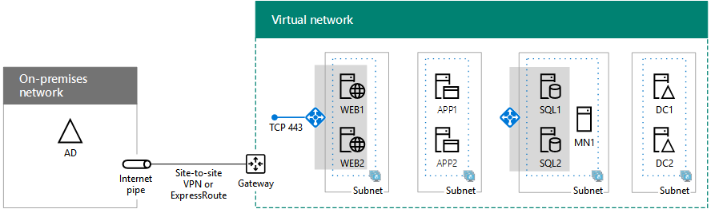

# 适用于 Azure IaaS 的混合云方案Hybrid cloud scenarios for Azure IaaS

 **摘要：**了解 Microsoft 的基础结构即服务 (IaaS) 混合体系结构和方案-基于在 Azure 的云服务。**Summary:** Understand the hybrid architecture and scenarios for Microsoft's Infrastructure as a Service (IaaS)-based cloud offerings in Azure.
  
通过托管在跨内部 Azure 虚拟网络 (VNet) 中运行的 IT 工作负荷，将本地计算和标识基础结构扩展到云。 Extend your on-premises computing and identity infrastructure into the cloud by hosting IT workloads running in cross-premises Azure virtual networks (VNets). 
  
## Azure IaaS 混合方案体系结构Azure IaaS hybrid scenario architecture

图 1 显示了 Azure 中基于 Microsoft laaS 的混合方案的体系结构。Figure 1 shows the architecture of Microsoft IaaS-based hybrid scenarios in Azure.
  
**图 1： 在 Azure 中的 Microsoft IaaS 基于混合方案****Figure 1: Microsoft IaaS-based hybrid scenarios in Azure**

  
针对体系结构的每一层：For each layer of the architecture:
  
- 应用和方案Apps and scenarios
    
    IT 工作负荷通常为多层的高可用性应用程序，由 Azure 虚拟机 (VM) 构成。An IT workload is typically a multi-tier, highly-available application composed of Azure virtual machines (VMs).
    
- 标识Identity
    
    将标识服务器（如 Windows Sever AD 域控制器）添加到一组在 Azure VNet 中运行的服务器，以进行本地身份验证。Add identity servers, such as Windows Server AD domain controllers, to the set of servers running in Azure VNets for local authentication.
    
- 网络Network
    
    使用通过 Internet 建立的站点到站点 VPN 连接，或使用通过到 Azure IaaS 的专用对等建立的 ExpressRoute 连接。Use either a site-to-site VPN connection over the Internet or an ExpressRoute connection with private peering to Azure IaaS.
    
- 本地On-premises
    
    包含与在 Azure 中运行的标识服务器同步的标识服务器。此外还包含在 Azure 中运行的 VM 可访问的资源，如存储和系统管理基础结构。Contains identity servers that are synchronized with the identity servers running in Azure. Can also contain resources that VMs running in Azure can access, such as storage and systems management infrastructure.
    
## 适用于 Office 365 的 DirSync 服务器DirSync server for Office 365

如图 2 中所示，从 Azure VNet 运行目录同步 (DirSync) 服务器是一个将计算和标识基础结构扩展到云的示例。Running your directory synchronization (DirSync) server from an Azure VNet, as shown in Figure 2, is an example of extending your computing and identity infrastructure to the cloud.
  
**图 2： 针对 Office 365 提供在 Azure IaaS 的目录同步服务器****Figure 2: DirSync server for Office 365 in Azure IaaS**

  
在图 2 中，内部网络承载 Windows 服务器 AD 基础结构，使用代理服务器，并在其边缘路由器。路由器连接到 Azure 边沿的站点到站点 VPN 或 ExpressRoute 连接 Azure VNet 网关。在 VNet，一个目录同步服务器运行 Azure AD 连接。In Figure 2, an on-premises network hosts a Windows Server AD infrastructure, with a proxy server and a router at its edge. The router connects to an Azure gateway at the edge of an Azure VNet with a site-to-site VPN or ExpressRoute connection. Inside the VNet, a DirSync server runs Azure AD Connect.
  
Office 365 的 DirSync 服务器将 Windows Server AD 中的帐户列表与 Office 365 订阅的 Azure AD 租户进行同步。A DirSync server for Office 365 synchronizes the list of accounts in Windows Server AD with the Azure AD tenant of an Office 365 subscription.
  
DirSync 服务器是运行 Azure AD Connect 的基于 Windows 的服务器。为了实现更迅速的预配或减少组织中本地服务器的数量，请在 Azure IaaS 的虚拟网络 (VNet) 中部署 DirSync 服务器。A DirSync server is a Windows-based server that runs Azure AD Connect. For faster provisioning or to reduce the number of on-premises servers in your organization, deploy your DirSync server in a virtual network (VNet) in Azure IaaS.
  
DirSync 服务器轮询 Windows Server AD 的更改，然后将它们与 Office 365 订阅同步。The DirSync server polls Windows Server AD for changes and then synchronizes them with the Office 365 subscription.
  
有关详细信息，请参阅[部署 Office 365 目录同步在 Azure 中](https://technet.microsoft.com/library/dn635310.aspx)。For more information, see [Deploy Office 365 DirSync in Azure](https://technet.microsoft.com/library/dn635310.aspx).
  
## 业务线 (LOB) 应用程序Line of business (LOB) application

图 3 显示了在 Azure IaaS 中运行的基于服务器的 LOB 应用程序的配置。Figure 3 shows the configuration of a server-based LOB application running in Azure IaaS.
  
**图 3： 在 Azure IaaS 的 LOB 应用程序****Figure 3: LOB application in Azure IaaS**

  
在图 3 中，本地网络托管标识基础结构和用户。它通过站点到站点 VPN 或 ExpressRoute 连接来连接到 Azure IaaS 网关。Azure IaaS 托管包含 LOB 应用程序服务器的虚拟网络。In Figure 3, an on-premises network hosts an identity infrastructure and users. It is connected to an Azure IaaS gateway with a site-to-site VPN or ExpressRoute connection. Azure IaaS hosts a virtual network containing the servers of the LOB application.
  
您还可以在 Azure Vm，位于子网的 Azure VNet Azure 数据中心 （也称为位置） 上运行的 LOB 应用程序。You can create LOB applications running on Azure VMs, which reside on subnets of an Azure VNet in an Azure datacenter (also known as a location).
  
因为实际上要将本地基础结构扩展到 Azure，则必须将唯一的专用地址空间分配给 VNet，并更新本地路由表，以确保对每个 VNet 的可访问性。Because you are essentially extending your on-premises infrastructure to Azure, you must assign unique private address space to your VNets and update your on-premises routing tables to ensure reachability to each VNet.
  
连接后，可通过远程桌面连接或使用系统管理软件对 VM 进行管理，就像对本地服务器进行管理一样。Once connected, these VMs can be managed with remote desktop connections or with your systems management software, just like your on-premises servers.
  
通过配置公开的端口，移动或远程用户还可以从 Internet 对这些 VM 进行访问。By configuring publically-exposed ports, these VMs can also be accessed from the Internet by mobile or remote users.
  
概念验证的配置，请参阅[Simulated 跨内部 Azure 中的虚拟网络](simulated-cross-premises-virtual-network-in-azure.md)。For a proof-of-concept configuration, see [Simulated cross-premises virtual network in Azure](simulated-cross-premises-virtual-network-in-azure.md).
  
以下为在 Azure VM 上托管的 LOB 应用的属性：Attributes of LOB applications hosted on Azure VMs are the following:
  
- 多层Multiple tiers
    
    典型的 LOB 应用使用分层方法。服务器集提供标识、数据库处理、应用程序和逻辑处理以及前端 Web 服务器，以供员工或客户访问。 Typical LOB applications use a tiered approach. Sets of servers provide identity, database processing, application and logic processing, and front-end web servers for employee or customer access. 
    
- 高可用性High availability
    
    典型的 LOB 应用通过在每一层中使用多个服务器来提供高可用性。Azure IaaS 为 Azure 可用集内的服务器提供高达 99.9% 的运行时间 SLA。 Typical LOB applications provide high availability by using multiple servers in each tier. Azure IaaS provides a 99.9% uptime SLA for servers in Azure availability sets. 
    
- 负载分布Load distribution
    
    若要在一个层的多个服务器之间分布网络流量负载，可以使用面向 Internet 的或内部的 Azure 负载均衡器。或者，可以使用 Azure 应用商店提供的专用负载均衡器应用程序。To distribute the load of network traffic among multiple servers in a tier, you can use an Internet-facing or internal Azure load balancer. Or, you can use a dedicated load balancer appliance available from the Azure marketplace.
    
- 安全性Security
    
    若要保护服务器避免接收来自 Internet 的未经请求的传入流量，可以使用 Azure 网络安全组。可以为单个虚拟机的子网或网络接口定义允许或拒绝的流量。To protect servers from unsolicited incoming traffic from the Internet, you can use Azure network security groups. You can define allowed or denied traffic for a subnet or the network interface of an individual virtual machine.
    
## Azure 中的 SharePoint Server 2016 场SharePoint Server 2016 farm in Azure

Azure 中一个多层、高可用性 LOB 应用程序的示例是 SharePoint Server 2016 场，如图 4 中所示。An example of a multi-tier, highly-available LOB application in Azure is a SharePoint Server 2016 farm, as shown in Figure 4.
  
**图 4： 一个高可用性 SharePoint 服务器 2016年场在 Azure IaaS****Figure 4: A high-availability SharePoint Server 2016 farm in Azure IaaS**

  
在图 4 中，本地网络托管标识基础结构和用户。它通过站点到站点 VPN 或 ExpressRoute 连接来连接到 Azure IaaS 网关。Azure VNet 包含 SharePoint Server 2016 场的多个服务器，该场包括前端服务器的单独层、应用程序服务器，SQL Server 群集，以及域控制器。In Figure 4, an on-premises network hosts an identity infrastructure and users. It is connected to an Azure IaaS gateway with a site-to-site VPN or ExpressRoute connection. The Azure VNet contains the servers of the SharePoint Server 2016 farm, which includes separate tiers for the front-end servers, the application servers, the SQL Server cluster, and the domain controllers.
  
此配置具有 Azure 中 LOB 应用程序的以下属性： This configuration has the following attributes of LOB applications in Azure: 
  
- 层Tiers
    
    服务器场中运行不同的角色创建多层，每层都有其自己的子网。Servers running different roles within the farm create the tiers and each tier has its own subnet.
    
- 高可用性High-availability
    
    通过在每一层中使用多个服务器，并将一层的所有服务器置于同一个可用性集中来实现高可用性。Achieved by using more than one server in each tier and placing all the servers of a tier in the same availability set.
    
- 负载分布Load distribution
    
    内部 Azure 负载均衡器将传入客户端 Web 流量分布到前端服务器（WEB1 和 WEB2）以及分布到 SQL Server 群集（SQL1、SQL2 和 MN1）的侦听器 IP 地址。Internal Azure load balancers distribute the incoming client web traffic to the front-end servers (WEB1 and WEB2) and to the listener IP address of the SQL Server cluster (SQL1, SQL2, and MN1).
    
- 安全性Security
    
    通过每个子网的网络安全组，可以配置允许的入站和出站流量。Network security groups for each subnet let you to configure allowed inbound and outbound traffic.
    
按照此方法实现成功的应用：Follow this path for successful adoption:
  
1. 计算和试验Evaluate and experiment
    
    请参阅[Microsoft Azure 中的 SharePoint 服务器 2016年](https://technet.microsoft.com/library/mt779107%28v=office.16%29.aspx)了解运行 SharePoint 服务器 2016 Azure 中的好处。See [SharePoint Server 2016 in Microsoft Azure](https://technet.microsoft.com/library/mt779107%28v=office.16%29.aspx) to understand the benefits of running SharePoint Server 2016 in Azure.
    
    请参阅[Intranet SharePoint 服务器 2016 Azure 开发/测试环境中](https://technet.microsoft.com/library/mt806351%28v=office.16%29.aspx)生成模拟的开发测试环境See [Intranet SharePoint Server 2016 in Azure dev/test environment](https://technet.microsoft.com/library/mt806351%28v=office.16%29.aspx) to build a simulated dev/test environment
    
2. 设计Design
    
    请参阅[设计在 Azure 中的 SharePoint 服务器 2016年场](https://technet.microsoft.com/library/mt779108%28v=office.16%29.aspx)来完成整个过程，以确定的 Azure IaaS 网络、 计算和存储元素来承载您的服务器场和它们的设置的集合。See [Designing a SharePoint Server 2016 farm in Azure](https://technet.microsoft.com/library/mt779108%28v=office.16%29.aspx) to step through a process to determine the set of Azure IaaS networking, compute, and storage elements to host your farm and their settings.
    
3. 部署Deploy
    
    请参见[部署 SharePoint 服务器 2016 Azure 中的 SQL Server AlwaysOn 可用性组与](https://technet.microsoft.com/library/mt793552%28v=office.16%29.aspx)单步执行端到端配置的高可用性服务器场分五个阶段。See [Deploying SharePoint Server 2016 with SQL Server AlwaysOn Availability Groups in Azure](https://technet.microsoft.com/library/mt793552%28v=office.16%29.aspx) to step through the end-to-end configuration of the high-availability farm in five phases.
    
## 对于 Office 365 Azure 中的联合的身份Federated identity for Office 365 in Azure

在 Azure 中的多层、 高可用性的 LOB 应用程序的另一个例子是针对 Office 365 提供联合的身份。Another example of a multi-tier, highly-available LOB application in Azure is federated identity for Office 365.
  
**图 5： 一个高可用性联合的身份的基础架构在 Azure IaaS 的 Office 365****Figure 5: A high-availability federated identity infrastructure for Office 365 in Azure IaaS**

  
在图 5 中，内部网络托管身份基础结构和用户。它被连接到 Azure IaaS 网关与一个站点到站点 VPN 或 ExpressRoute 连接。Azure VNet 包含 web 代理服务器、 Active Directory 联合身份验证服务 (AD FS) 服务器和 Windows 服务器活动目录 (AD) 的域控制器。In Figure 5, an on-premises network hosts an identity infrastructure and users. It is connected to an Azure IaaS gateway with a site-to-site VPN or ExpressRoute connection. The Azure VNet contains web proxy servers, Active Directory Federation Services (AD FS) servers, and Windows Server Active Directory (AD) domain controllers.
  
此配置具有 Azure 中 LOB 应用程序的以下属性： This configuration has the following attributes of LOB applications in Azure:
  
- **层：**有不同层次的 web 代理服务器、 AD FS 服务器和 Windows 服务器 AD 域控制器。**Tiers:** There are tiers for web proxy servers, AD FS servers, and Windows Server AD domain controllers.
    
- **负载分布：**外部的 Azure 负载平衡器分发传入的客户端身份验证请求到 web 代理服务器和内部的 Azure 负载平衡器将分发到 AD FS 服务器的身份验证请求。**Load distribution:** An external Azure load balancer distributes the incoming client authentication requests to the web proxies and an internal Azure load balancer distributes authentication requests to the AD FS servers.
    
按照此方法实现成功的应用：Follow this path for successful adoption:
  
1. 计算和试验Evaluate and experiment
    
    请参阅[您 Office 365 的开发/测试环境的联合身份](federated-identity-for-your-office-365-dev-test-environment.md)建立联合身份验证与 Office 365 的模拟的开发/测试环境。See [Federated identity for your Office 365 dev/test environment](federated-identity-for-your-office-365-dev-test-environment.md) to build a simulated dev/test environment for federated authentication with Office 365.
    
2. 部署Deploy
    
    请参阅[Office 365 Azure 中部署高可用性联合身份验证](deploy-high-availability-federated-authentication-for-office-365-in-azure.md)以逐句通过 AD FS 基础结构的高可用性的端到端配置分五个阶段。See [Deploy high availability federated authentication for Office 365 in Azure](deploy-high-availability-federated-authentication-for-office-365-in-azure.md) to step through the end-to-end configuration of the high availability AD FS infrastructure in five phases.
    
请参阅其他资源：See these additional resources:
  
- [混合云环境的构建Architecting Hybrid Cloud Environments](https://gallery.technet.microsoft.com/Architecting-Hybrid-Cloud-a7dc9f24/file/147475/1/Architecting%20Hybrid%20Cloud%20Environments%20V1.docx)
    
- [设计和构建 Azure 中的 LOB 应用程序Design and Build an LOB application in Azure ](https://techcommunity.microsoft.com/t5/CAAB-Cloud-Adoption-Advisory/EXTRA-November-2016-Webinar/m-p/30058#M41)
    
## 另请参阅See Also

[面向企业架构师的 Microsoft 混合云Microsoft Hybrid Cloud for Enterprise Architects](microsoft-hybrid-cloud-for-enterprise-architects.md)
  
[Microsoft 云 IT 体系结构资源Microsoft Cloud IT architecture resources](microsoft-cloud-it-architecture-resources.md)

[Microsoft 企业云路线图：IT 决策者的资源Microsoft's Enterprise Cloud Roadmap: Resources for IT Decision Makers](https://sway.com/FJ2xsyWtkJc2taRD)

