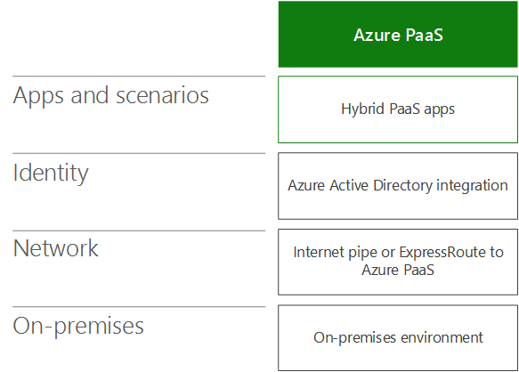
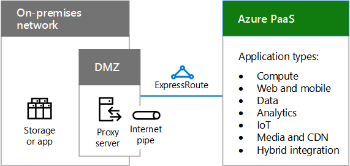

# Azure PaaS 的混合云方案Hybrid cloud scenarios for Azure PaaS

 **摘要：** 了解在 Azure 中基于 Microsoft 平台即服务 (PaaS) 云产品的混合体系结构和方案。**Summary:** Understand the hybrid architecture and scenarios for Microsoft's Platform as a Service (PaaS)-based cloud offerings in Azure.
  
将本地数据或计算资源与在 Azure PaaS 中运行的新的或已转换的应用程序结合使用，可以充分利用云的性能、可靠性和规模，为移动用户提供更好的支持。Combine on-premises data or computing resources with new or converted applications running in Azure PaaS, which can take advantage of cloud performance, reliability, and scale and provide better support for mobile users. 
  
## Azure PaaS 混合方案体系结构Azure PaaS hybrid scenario architecture

图 1 显示了适用于 Azure 的 基于 Microsoft PaaS 的混合方案的体系结构。Figure 1 shows the architecture of Microsoft PaaS-based hybrid scenarios in Azure.
  
**图 1：Azure 中基于 Microsoft PaaS 的混合方案****Figure 1: Microsoft PaaS-based hybrid scenarios in Azure**

  
针对体系结构的每一层：For each layer of the architecture:
  
- 应用和方案Apps and scenarios
    
    混合 PaaS 应用程序在 Azure 中运行，并使用本地计算或存储资源。A hybrid PaaS application runs in Azure and uses on-premises compute or storage resources.
    
- 标识Identity
    
    由目录同步或与第三方标识提供程序的联合组成。Consists of either directory synchronization or federation with a third-party identity provider.
    
- 网络Network
    
    由现有的 Internet 管道或通过到 Azure PaaS 的公共对等建立的 ExpressRoute 连接组成。必须包括 Azure PaaS 应用程序访问本地计算或存储资源的方法。Consists of either your existing Internet pipe or an ExpressRoute connection with public peering to Azure PaaS. You must include a way for the Azure PaaS application to access the on-premises compute or storage resource.
    
- 本地On-premises
    
    由标识和安全基础结构及现有的业务线 (LOB) 应用程序或数据库服务器组成，Azure PaaS 应用程序可以对其进行安全访问。Consists of identity and security infrastructure and existing line of business (LOB) applications or database servers, which an Azure PaaS application can securely access.
    
## Azure PaaS 混合应用程序Azure PaaS hybrid application

图 2 显示了在 Azure 中运行的混合应用程序的配置。Figure 2 shows the configuration of a hybrid application running in Azure.
  
**图 2：基于 Azure PaaS 的混合应用程序****Figure 2: Azure PaaS-based hybrid application**

  
在图 2 中，本地网络在服务器上承载存储或应用程序以及包含代理服务器的 DMZ。它通过 Internet 或使用 ExpressRoute 连接来连接到 Azure PaaS 服务。In Figure 2, an on-premises network hosts storage or apps on servers and a DMZ containing a proxy server. It is connected to Azure PaaS services either over the Internet or with an ExpressRoute connection.
  
组织可以通过以下方式使其计算或存储资源对 Azure PaaS 混合应用程序可用：An organization can make its compute or storage resources available to the Azure PaaS hybrid application by:
  
- 托管 DMZ 中服务器上的资源。Hosting the resource on servers in the DMZ.
    
- 在 DMZ 中托管反向代理服务器，这将允许对位于本地的资源执行经身份验证的请求、入站请求和基于 HTTPS 的请求。Hosting a reverse proxy server in the DMZ, which allows authenticated, inbound, HTTPS-based requests to the resource that is located on-premises.
    
Azure 应用可以使用以下程序提供的凭据：The Azure app can use credentials from:
  
- Azure AD，它可以与本地标识提供程序（如 Windows Server AD）同步。Azure AD, which can be synchronized with your on-premises identity provider, such as Windows Server AD.
    
- 第三方标识提供程序。A third-party identity provider.
    
### 示例 Azure PaaS 混合应用程序Example Azure PaaS hybrid application

图 3 显示了在 Azure 中运行的混合应用程序的示例。Figure 3 shows an example hybrid application running in Azure.
  
**图 3：基于 Azure PaaS 的混合应用程序示例****Figure 3: An example Azure PaaS-based hybrid application**

  
在图 3 中，本地网络承载 LOB 应用程序。Azure PaaS 承载自定义的移动应用。Internet 上的智能电话访问 Azure 中的自定义移动应用，它将数据请求发送到本地 LOB 应用程序。In Figure 3, an on-premises network hosts an LOB app. Azure PaaS hosts a custom mobile app. A smartphone on the Internet accesses the custom mobile app in Azure, which sends data requests to the on-premises LOB app.
  
本示例中的 Azure PaaS 混合应用程序是提供有关员工最新联系信息的自定义移动应用。端到端的混合方案由以下各项组成：This example Azure PaaS hybrid application is a custom mobile app that provides up-to-date contact information on employees. The end-to-end hybrid scenario consists of:
  
- 需要经验证的本地凭据才能运行的智能电话应用。A smartphone app that requires validated, on-premises credentials to run.
    
- 在 Azure PaaS 中运行的自定义移动应用，它根据用户智能电话应用的查询，请求有关特定员工的信息。A custom mobile app running in Azure PaaS, which requests information about specific employees based on queries from a user's smartphone app.
    
- DMZ 中的反向代理服务器，验证自定义移动应用，并将转发该请求。A reverse proxy server in the DMZ that validates the custom mobile app and forwards the request.
    
- LOB 应用程序服务器场，根据用户帐户的权限，为联系人请求提供服务。An LOB application server farm that services the contact request, subject to the permissions of the user's account.
    
由于本地标识提供程序已与 Azure AD 同步，自定义移动应用和 LOB 应用都可以验证请求用户的帐户名称。Because the on-premises identity provider has been synchronized with Azure AD, both the custom mobile app and the LOB app can validate the requesting user's account name.
  
## 另请参阅See Also

[面向企业架构师的 Microsoft 混合云Microsoft Hybrid Cloud for Enterprise Architects](microsoft-hybrid-cloud-for-enterprise-architects.md)
  
[Microsoft 云 IT 体系结构资源Microsoft Cloud IT architecture resources](microsoft-cloud-it-architecture-resources.md)

