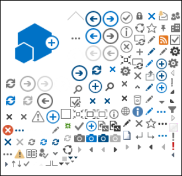

# SharePoint Online 的图像优化

网页加载速度取决于呈现页面包括图像、 HTML、 JavaScript、 和 CSS 所需的所有组件的总计大小。图像的好方法使您的网站更具吸引力，但其大小会影响性能。通过优化您的图像压缩和调整大小，以及使用动画层，您可以偏移非常大的图像的效果。使用 SharePoint 图像呈现形式，可以上载单个大型图像，并显示这使它被重用而不是重新加载的图像部分。
  
## 使用子画面以加快 SharePoint Online 中的图像加载速度

|||
|:-----|:-----|
| 图像画面包含多个较小的图像。使用 CSS 您选择绝对定位的页面的特定部分显示的复合图像的部件。一般情况下，您移动单个环绕而不是加载多个图像、 页面图像并将该图像的一小部分可见通过在其中显示动画层图像所需的部件的小窗口为最终用户。SharePoint Online 使用子画面画面 spcommon.png 中显示其各种图标。     什么是此处介绍：     图像压缩     图像优化     SharePoint 图像呈现形式    ||
   
这可以提高性能，因为下载而不是多个只有一个图像，然后缓存并重用该图像。即使图像不会保留缓存，通过单个图像而不是多个图像，此方法将减少页面加载时间的服务器到减少 HTTP 请求的总数。这真的是一种形式的图像捆绑。上面提供的 SharePoint 示例中所示，这是了如果图像不会更改经常，例如图标的非常有用的技术。您可以如何使用[Web Essentials](http://vswebessentials.com/)，第三方、 开放源代码、 社区基于项目在 Microsoft Visual Studio 中轻松地完成此任务。有关详细信息，请参阅[缩小和 SharePoint Online 中绑定](https://go.microsoft.com/fwlink/?LinkId=708698)。
  
## 使用图像压缩和优化以加快 SharePoint 中的页面加载速度

图像压缩和优化用于降低在您的网站上使用的图像的文件大小。通常，减小图像大小的最佳方法是将图像调整到在网站上查看的最大尺寸。如果图像大于其将被查看的大小，则没有任何意义。使用图像编辑器确保图像尺寸正确是减少页面大小的快速、方便的方法。
  
右大小图像后下, 一步是优化的这些图像压缩。没有可用于压缩和优化，包括照片库和第三方工具的各种工具。压缩的关键是文件的大小尽可能减少而不会明显的任何质量丢失面向最终用户。请确保测试以确保它们仍美观高清晰度显示屏上的压缩的文件。
  
## 使用 SharePoint 图像再现加快页面下载速度

图像呈现形式是中 SharePoint Online，从而可以提供基于预定义的图像维度的图像的不同版本的功能。没有用户生成图像内容或网站上的 CSS 已解决的图像如宽度和高度尺寸时，这一点尤其重要。即使图像所修复的 CSS 中，也仍然加载高分辨率图像。在这种情况下可以通过使用图像呈现形式减小文件大小。
  
> [!NOTE]
> 启用了发布时仅适用于 SharePoint 呈现形式。您可以启用设置下的发布\>网站设置\>管理网站功能\>SharePoint Server 发布。否则，该选项将不会出现。 
  
调整图像再现大小的工作原理是，采用您定义的最小尺寸（宽度或高度），然后调整图像大小，以便其他尺寸根据锁定纵横比自动调整。默认情况下，它将从中心裁剪图像的剩余尺寸。例如，如果您定义的再现尺寸为 100 像素宽和 50 像素高，原始图像为 1000 像素宽和 800 像素高，它将重新调整，使 800 像素的高度现在为 50 像素，并从图像中心剪裁 1000 像素（现在为 62.5 像素）。
  
这些步骤相对比较简单，但要使图像使用呈现形式，在添加图像之前呈现形式需位于 SharePoint 网站上。此外，还需要已经启用 SharePoint Server 发布基础结构（网站集级别）和 SharePoint Server 发布（站点级别）功能。
  
 **添加图像呈现形式来加快页面加载**
  
1. 请验证执行此过程的用户帐户，至少指向首要网站的网站集的设计权限网站正在发布到网页。
    
2. 在 Web 浏览器中，转到发布网站集的顶级站点。
    
3. 选择“设置”**** 图标。 
    
4. 在“网站设置”**** 页面上的“外观和感觉”**** 部分中，您将看到内置图像呈现形式。 
    
    您可以使用开箱即用的呈现形式，或选择“图像呈现形式”**** 创建一个新的。 
    
    
  
5. 在“图像呈现形式”**** 页面上，选择“添加新项”****。
    
    
  
6. 在“新建图像呈现形式”**** 页面上的“名称”**** 框中，输入呈现形式的名称。 
    
7. 在“宽度”**** 和“高度”**** 文本框中，输入呈现形式的宽度和高度（以像素为单位），然后选择“保存”****。
    
    
  
## 在 SharePoint 中使用图像呈现形式进行自定义裁剪

默认情况下，从图像的中心生成图像呈现形式。您可以通过裁剪的图像的您想要使用的部分调整各个图像呈现的形式的图像。您可以裁剪上逐个，每呈现形式的图像。裁剪图像加快页面加载通过使用 SharePoint 的 blob 缓存创建的每个呈现形式的图像版本。因为图像只调整大小时一次，然后已准备好为最终用户提供服务多次，减少了这样的服务器负载。有关如何裁剪图像呈现形式的详细信息，请参阅[裁剪图像呈现形式](https://go.microsoft.com/fwlink/p/?LinkId=525626)。
  

