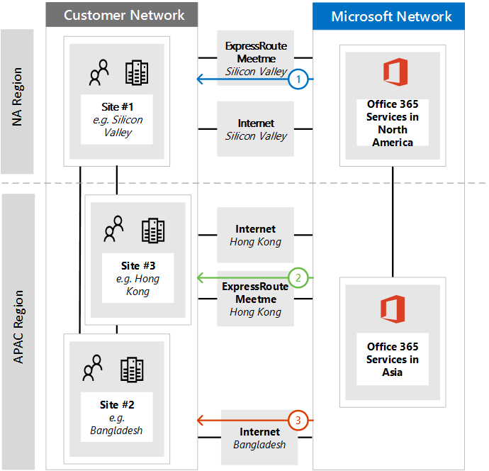

# <a name="implementing-expressroute-for-office-365"></a>实现 ExpressRoute for Office 365

Office 365 ExpressRoute 提供备用路由路径许多 internet 面向 Office 365 服务。Office 365 ExpressRoute 的体系结构基于广告已可访问 internet 的后续重新发布到这些 IP 前缀您已设置 ExpressRoute 电路到的 Office 365 服务的公共 IP 前缀您的网络。与 ExpressRoute 有效地启用多个不同的路由路径，通过 internet 和 ExpressRoute，许多 Office 365 服务。此状态的路由网络上可能表示重大更改至设计您的内部网络拓扑的方式。
  
 **状态：** 完整的指南 v2
  
您必须仔细规划 Office 365 实现您 ExpressRoute 以适应还体现出路由可通过两个专线获得与插入到核心网络与 internet 的路由的网络复杂性。如果您和您的团队不执行详细的规划和测试本指南中，没有高风险会遇到间歇性或总断开连接到 Office 365 服务启用 ExpressRoute 电路后。
  
若要成功实施，您将需要分析基础结构要求、 穿过详细的网络评估和设计、 仔细规划以暂存、 控制更严格的方式，推出和生成详细的验证和测试计划。对于大型、 分布式环境不经常跨越几个月内实现。本指南旨在帮助您做好计划。
  
大型成功部署可能规划执行六个月，它通常包括包括网络、 防火墙和代理服务器管理员、 Office 365 管理员、 安全、 最终用户支持、 项目在组织中的从多个区域的工作组成员管理和管理层的支持。您在规划过程中的投资将降低将遇到停机时间或复杂和昂贵疑难解答中产生的部署故障的可能性。
  
我们期望以下必备启动此实施指南之前完成。
  
1. 您已完成的网络评估，以确定是否建议并批准 ExpressRoute。

2. 您已选择 ExpressRoute 网络服务提供商。查找有关[ExpressRoute 合作伙伴和对等位置](https://azure.microsoft.com/documentation/articles/expressroute-locations/)的详细信息。

3. 您已经已阅读并了解[ExpressRoute 文档](https://azure.microsoft.com/documentation/services/expressroute/)，并能够满足 ExpressRoute 必备端到端内部网络。

4. 您的团队具有读取的所有公共指南和文档，网址为[https://aka.ms/expressrouteoffice365](https://aka.ms/expressrouteoffice365)， [https://aka.ms/ert](https://aka.ms/ert)，并监视若要了解的重要技术详细信息，包括第 9 频道上的[Office 365 培训的 Azure ExpressRoute](https://channel9.msdn.com/series/aer)系列：

      - Saas 与服务的 internet 依赖项。

      - 如何避免非对称的路由和处理复杂路由。

      - 如何合并外围安全、 可用性和应用程序级别控制。

## <a name="begin-by-gathering-requirements"></a>首先收集要求
<a name="requirements"> </a>

首先确定哪些功能您打算采用贵组织中的服务。您需要确定将使用不同的 Office 365 服务的功能和在您的网络位置将承载使用这些功能的人员。使用方案的目录，您需要添加网络属性的每个这些方案要求;如入站和出站网络通信流和 Office 365 终结点是否可通过 ExpressRoute。
  
要收集组织的要求：
  
- 目录使用您的组织的 Office 365 服务的入站和出站网络流量。有关不同的 Office 365 方案需要的流的说明，请参阅 Office 365 Url 和 IP 地址范围页。

- 收集现有显示您的内部 WAN 中枢和拓扑的详细信息，卫星站点，最后一个英里的用户连接，路由到网络外围出口点，并代理服务的连接的网络拓扑的文档。

  - 确定在 Office 365 和其他 Microsoft 服务将连接到，显示 internet 和建议的 ExpressRoute 连接路径的网络图表上的入站的服务终结点。

  - 标识所有用户地理位置和以及哪些位置当前具有到 internet 出口和建议的哪些位置存在出口 ExpressRoute 对等位置的位置之间的 WAN 连接。

  - 标识所有边缘设备，如代理、 防火墙、 等并目录排列通过 Internet 和 ExpressRoute 转到其关系。

  - 文档是否最终用户将访问 Office 365 服务通过直接路由或间接应用程序代理的 Internet 和 ExpressRoute 流。

- 添加您的租户的位置并且满足-我网络图中的位置。

- 估计的预期和观察到网络性能和延迟特性从主要用户位置到 Office 365。请记住，Office 365 是一全局和分布式的服务，用户将连接到可能不同于其租户的位置的位置。因此，建议衡量和优化通过 ExpressRoute 和 Internet 连接用户和最近 Microsoft 全局网络边缘之间的延迟。从网络评估您的发现可用于帮助完成此任务。

- 列出公司网络安全和高可用性要求所需满足新 ExpressRoute 连接。例如，如何用户继续获取发生的 Internet 出站或 ExpressRoute 电路失败到 Office 365 的访问权限。

- 文档的入站和出站 Office 365 网络流将使用的 Internet 路径，其中将使用 ExpressRoute。地理位置的用户和您的本地网络拓扑的详细信息的具体情况可能需要为到另一个用户位置不同的计划。

### <a name="catalog-your-outbound-and-inbound-network-traffic"></a>目录出站和入站网络流量
<a name="trafficCatalog"> </a>

大程度地减少路由和其他网络的复杂性，我们建议您仅使用 ExpressRoute for Office 365 的复习由于法规要求或网络评估的结果的专用连接所需的网络通信流。此外，我们建议您为项目的实施不同的不同阶段阶段 ExpressRoute 路由和方法的出站和入站网络通信流的范围。Office 365 部署 ExpressRoute 的只是用户发起出站网络通信流和离开通过 Internet 的入站的网络通信流可帮助控制增加的拓扑的复杂性和风险的简介 （英文） 的其他非对称路由的可能性。
  
您的网络流量目录应包含您必须在本地网络与 Microsoft 之间的所有入站和出站网络连接的列表。
  
- 出站网络通信流是任何方案，其中启动一个连接从本地环境，如从内部客户端或服务器，与 Microsoft 服务的目标。这些连接可能到 Office 365 直接或间接，例如当连接前往通过代理服务器、 防火墙或其他网络设备路径上 Office 365。

- 入站的网络通信流是在其中启动一个连接从 Microsoft 云到本地主机任何方案。这些连接通常需要穿过防火墙和客户安全策略要求的外部起源于流其他安全基础结构。

阅读此文章[与 Office 365 ExpressRoute 路由](https://support.office.com/article/Routing-with-ExpressRoute-for-Office-365-e1da26c6-2d39-4379-af6f-4da213218408)来确定哪些服务将发送的入站的通信并查找**Office 365 ExpressRoute**标记[Office 365 中的列的**确保路由对称**部分终结点](https://support.office.com/article/Office-365-URLs-and-IP-address-ranges-8548a211-3fe7-47cb-abb1-355ea5aa88a2)篇参考文章，以确定连接信息的其余部分。
  
对于每个服务所需的出站连接，您需要描述包括网络路由、 代理服务器配置、 检查数据包来，该服务的计划的连接和带宽需求。
  
为每个服务所需的入站的连接，您将需要某些其他信息。Microsoft 云中的服务器将建立到本地网络连接。若要确保正确进行连接，您需要描述包括; 此连接的所有方面将接受这些入站的连接的服务的公共 DNS 条目，CIDR 格式 IPv4 IP 地址，涉及哪些 ISP 设备，则和如何入站的 NAT 或源 NAT 处理这些连接。
  
入站的连接应检查无论是否要通过 internet 连接或 ExpressRoute 以确保非对称路由尚未引入。在某些情况下，在本地终结点的 Office 365 服务启动 5 月到入站的连接还需要由其他 Microsoft 和非 Microsoft 服务来访问。启用 ExpressRoute 路由到 Office 365 为了这些服务不断开其他方案至关重要。在许多情况下，客户可能需要实现特定更改其内部网络，如基于 NAT，以确保启用 ExpressRoute 后从 Microsoft 的入站的流保持对称的源。
  
下面是详细的所需程度的示例。在这种情况下 Exchange 混合部署将路由到内部部署系统通过 ExpressRoute。

|**Connection 属性**|**值**|
|:-----|:-----|
|**网络流量方向** <br/> |入站  <br/> |
|**服务** <br/> |Exchange 混合  <br/> |
|**公共 Office 365 终结点 （源）** <br/> |Exchange Online （IP 地址）  <br/> |
|**公共本地终结点 （目标）** <br/> |5.5.5.5  <br/> |
|**公共 (Internet) DNS 条目** <br/> |Autodiscover.contoso.com  <br/> |
|**将此本地终结点使用的其他 (非-Office 365) Microsoft 服务** <br/> |否  <br/> |
|**将此本地终结点系统使用的用户/Internet 上** <br/> |是  <br/> |
|**内部发布通过公用终结点的系统** <br/> |Exchange Server 客户端访问角色 （本地） 192.168.101 192.168.102、 192.168.103  <br/> |
|**公用终结点的 IP advertisement** <br/> |**到 Internet**: 5.5.0.0/16  <br/> **到 ExpressRoute**: 5.5.5.0/24  <br/> |
|**安全/外围控件** <br/> |**Internet 路径**： DeviceID_002  <br/> **ExpressRoute 路径**： DeviceID_003  <br/> |
|**高可用性** <br/> |主动/主动跨 2 地理位置冗余  <br/> ExpressRoute 电路-芝加哥和达拉斯  <br/> |
|**路径对称控件** <br/> |**方法**： 源 NAT  <br/> **Internet 路径**： 源 NAT 入站连接到 192.168.5.5  <br/> |**ExpressRoute 路径**： 源 NAT 连接到 192.168.1.0 （芝加哥） 和 192.168.2.0 （达拉斯）  <br/> |

下面是一种服务，仅出站的示例：
|**Connection 属性**|**值**|
|:-----|:-----|
|**网络流量方向** <br/> |出站  <br/> |
|**服务** <br/> |SharePoint Online  <br/> |
|**本地终结点 （源）** <br/> |用户工作站  <br/> |
|**公共 Office 365 终结点 （目标）** <br/> |SharePoint Online （IP 地址）  <br/> |
|**公共 (Internet) DNS 条目** <br/> |\*。 sharepoint.com （和其他 Fqdn）  <br/> |
|**CDN 引用** <br/> |cdn.sharepointonline.com （和其他 Fqdn）-CDN 提供商维护的 IP 地址)  <br/> |
|**IP 广告和使用 NAT** <br/> |**Internet 路径/源 NAT**: 1.1.1.0/24  <br/> **ExpressRoute 路径/源 NAT**: 1.1.2.0/24 （芝加哥） 和 1.1.3.0/24 （达拉斯）  <br/> |
|**连接方法** <br/> |**Internet**： 通过第 7 层代理 （.pac 文件）  <br/> **ExpressRoute**： 直接路由 （没有代理）  <br/> |
|**安全/外围控件** <br/> |**Internet 路径**： DeviceID_002  <br/> **ExpressRoute 路径**： DeviceID_003  <br/> |
|**高可用性** <br/> |**Internet 路径**： 冗余的 internet 出站  <br/> **ExpressRoute 路径**： 主动/主动 ' 作用硬刷跨 2 地理位置冗余 ExpressRoute 电路-芝加哥和达拉斯路由  <br/> |
|**路径对称控件** <br/> |**方法**： 源的所有连接的 NAT  <br/> |

### <a name="your-network-topology-design-with-regional-connectivity"></a>网络拓扑设计区域的连接
<a name="topology"> </a>

了解服务和其关联的网络通信流之后，您可以创建包含这些新连接要求并阐述所做的将使用 Office 365 ExpressRoute 的网络图表。图表应包括：
  
1. 从访问 Office 365 和其他服务的所有用户位置。

2. 所有 internet 和 ExpressRoute 出口点。

3. 出站和入站的所有设备管理网络，包括路由器、 防火墙、 应用程序代理服务器，以及入侵检测/防护注销的连接。

4. 对于所有入站流量，例如接受来自 ADFS web 应用程序代理服务器的连接的内部 ADFS 服务器的内部目标。

5. 将播发的所有 IP 子网的目录

6. 确定每个位置人员将在其中访问从 Office 365 并列出 meet-我用于 ExpressRoute 的位置。

7. 位置和您的内部网络拓扑，其中将接受从 ExpressRoute 获知 Microsoft IP 前缀，部分筛选并传播到。

8. 网络拓扑应说明的每个网络段的地理位置和如何与 Microsoft 网络连接通过 ExpressRoute 和/或 Internet。

下图显示了其中的人将使用从 Office 365 到 Office 365 的入站和出站路由广告以及每个位置。
  

  
为出站通信，人员访问 Office 365 中三种方式之一：
  
1. 通过开会会议-我在北美加利福尼亚州内的人员的位置。

2. 通过开会会议-我 （香港特别行政区） 中的人员 （香港特别行政区） 中的位置。

3. 通过在孟加拉国其中有较少的人员，没有 ExpressRoute 电路设置 internet。


  
同样，从 Office 365 的入站的网络流量返回三种方式之一：
  
1. 通过开会会议-我在北美加利福尼亚州内的人员的位置。

2. 通过开会会议-我 （香港特别行政区） 中的人员 （香港特别行政区） 中的位置。

3. 通过在孟加拉国其中有较少的人员，没有 ExpressRoute 电路设置 internet。


  
### <a name="determine-the-appropriate-meet-me-location"></a>确定适当的 meet-我位置

所选内容的 meet-我的位置，它们是其中 ExpressRoute 电路将您的网络连接到 Microsoft 网络的物理位置，受人员将在其中访问 Office 365 中的位置。提供 SaaS，作为 Office 365 无法工作 IaaS 或 PaaS 区域模型下与 Azure 执行相同的方式。相反，Office 365 是一分布式的协作服务，用户可能需要连接到终结点跨多个数据中心和区域，这可能不一定是在同一位置或承载用户的租户的区域。
  
这意味着您需要做出选择开会会议时最重要的考虑因素-我的 ExpressRoute for Office 365 的位置是将从哪里连接您的组织中的人员。常规建议的最佳的 Office 365 连接是实现路由，以使用户对 Office 365 服务的请求移交关闭到 Microsoft 网络的最短的网络路径，这还通常被称为热硬刷路由。例如，如果大多数 Office 365 用户在一个或两个位置，选择开会会议-我中这些用户的位置最接近的邻近度的位置将创建最佳的设计。如果您的公司具有许多不同的区域中的大量用户，您可能要考虑具有多个 ExpressRoute 电路并且满足-我的位置。对于某些用户位置时，Microsoft 网络和 Office 365 的最短/最优路径可能不是通过内部的 WAN 和 ExpressRoute 开会-我点，但通过 Internet。
  
通常情况下，有多个的满足-我无法选择与您的用户的相对接近区域内的位置。填写下表可指导您做出的决定。

|**计划的 ExpressRoute meet-我中加利福尼亚和纽约位置**||
|:-----|:-----|
|位置  <br/> |人员数量  <br/> |通过 Internet 出口预期与 Microsoft 网络延迟  <br/> |与通过 ExpressRoute Microsoft 网络的预期的延迟  <br/> |
|洛杉矶  <br/> |10,000  <br/> |~ 时间  <br/> |~ 10ms （通过硅谷）  <br/> |
|华盛顿  <br/> |15,000  <br/> |~ 20 毫秒  <br/> |~ 10ms （通过纽约）  <br/> |
|达拉斯  <br/> |5,000  <br/> |~ 时间  <br/> |~ 为 40 毫秒 （通过纽约）  <br/> |

后显示的 Office 365 区域的全局网络体系结构，ExpressRoute 网络服务提供商满足-我已开发位置和位置的人的数量，所以可以用来标识如果可以进行任何优化。它还可以显示全局发夹网络连接其中流量路由到远处以便听到 meet-我的位置。如果在全局网络发夹发现它应修正才能继续执行。之一查找另一个 meet-我的位置或使用选择性 Internet 临时出口点以避免发夹。
  
第一个图表中，在北美显示具有两个物理位置客户的示例。您可以看到有关办公地点、 Office 365 租户位置信息和多个选择 ExpressRoute 满足-我的位置。客户在此示例中，选择开会会议-我位置基于两个原则，顺序：
  
1. 组织中的人员的最接近邻近度。

2. 在 Microsoft 数据中心承载 Office 365 接近最接近。


  
稍有扩展此概念进一步示例跨国客户面对类似的信息和决策制定第二个图表显示。此客户具有仅重点增长区域中的其占用的十个人员小型工作组 （孟加拉国） 中的小型办公室。没有 meet-我马德拉斯和 Office 365 与 Microsoft 数据中心中的位置中承载马德拉斯，以便 meet-我位置意义;但是，对于十个人员的其他电路费用是繁重。如查看您的网络时，您需要确定是否比花费资金以获取其他 ExpressRoute 电路更有效参与跨网络发送您的网络通信的延迟。
  
此外，（孟加拉国） 中的十个人员可能会遇到更好的性能，与通过 internet 发送到 Microsoft 网络比他们将上的路由其内部网络，我们介绍性图表中显示，并且重现其网络流量下方。
  

  
## <a name="create-your-expressroute-for-office-365-implementation-plan"></a>创建 Office 365 实施计划您 ExpressRoute
<a name="implementation"> </a>

实施计划应包含配置为在您的网络，如下所示配置所有其他基础结构的详细信息或 ExpressRoute 这两个的技术详细的信息。
  
- 规划 ExpressRoute 和 Internet 之间拆分的服务。

- 规划带宽、 安全、 高可用性和故障转移。

- 设计入站和出站路由，包括正确的不同位置的路由路径优化

- 决定最 ExpressRoute 路由将播发到您的网络和 what's 选择 Internet 或 ExpressRoute 路径; 客户端的机制例如，直接路由或应用程序代理。

- 规划 DNS 记录的更改，其中包括[发件人策略框架](https://technet.microsoft.com/library/dn789058%28v=exchg.150%29.aspx)条目。

- 规划 NAT 策略包括出站和入站源 nat。

### <a name="plan-your-routing-with-both-internet-and-expressroute-network-paths"></a>规划 internet 和 ExpressRoute 网络路径与您路由
<a name="paths"> </a>

- 在初始部署的所有入站的服务，例如入站电子邮件或混合连接性，建议使用 internet。

- 规划最终用户客户端 LAN 路由，如[配置 PAC/WPAD 文件](https://aka.ms/manageo365endpoints)、 的默认路由、 代理服务器和 BGP 路由广告。

- 规划外围路由，包括代理服务器、 防火墙和云代理。

### <a name="plan-your-bandwidth-security-high-availability-and-failover"></a>规划带宽、 安全性、 高可用性和故障转移
<a name="availability"> </a>

创建规划所需的每个主要的 Office 365 工作负载的带宽。单独估计业务联机带宽要求 Exchange Online、 SharePoint Online 和 Skype。您可以使用我们提供的 Exchange Online 和 Skype for Business 作为起点; 估计计算器但是，与用户配置文件和位置的代表性样本试验性测试，需要全面了解您的组织的带宽需求。
  
添加安全在每个 internet 和您计划 ExpressRoute 出口位置的处理方式，请记住所有 ExpressRoute 连接到 Office 365 使用公共对等和仍必须采用安全按照连接到外部您公司的安全策略网络。
  
添加到有关哪些人员将受哪些类型的中断和如何，这些人将能够在最简单的方式执行其工作全容量计划的详细信息。
  
#### <a name="plan-bandwidth-requirements-including-skype-for-business-requirements-on-jitter-latency-congestion-and-headroom"></a>规划包括 Skype 的抖动、 延迟、 拥塞现象，和预留的业务要求的带宽要求
  
Skype 业务 online 还具有特定的其他网络要求[媒体质量和 Skype 业务 online 中的网络连接性能](https://support.office.com/article/Media-Quality-and-Network-Connectivity-Performance-in-Skype-for-Business-Online-5fe3e01b-34cf-44e0-b897-b0b2a83f0917)一文中将详细陈述。
  
阅读[与 Office 365 ExpressRoute](https://support.office.com/article/Network-planning-with-ExpressRoute-for-Office-365-103208f1-e788-4601-aa45-504f896511cd)规划网络**带宽规划 Azure ExpressRoute**部分。
  
当执行与您的试生产用户的带宽评估，您可以使用我们的指南;[Office 365 性能调整使用比较基准和性能历史记录](https://support.office.com/article/Office-365-performance-tuning-using-baselines-and-performance-history-1492cb94-bd62-43e6-b8d0-2a61ed88ebae)。
  
#### <a name="plan-for-high-availability-requirements"></a>规划高可用性要求
  
创建规划高可用性，以满足您的需求并将此并入您更新的网络拓扑图。阅读**高可用性和故障转移与 Azure ExpressRoute** [网络规划与 Office 365 ExpressRoute](https://support.office.com/article/Network-planning-with-ExpressRoute-for-Office-365-103208f1-e788-4601-aa45-504f896511cd)部分。
  
#### <a name="plan-for-network-security-requirements"></a>有关网络安全要求的计划
  
创建规划，以满足您的网络安全要求和这合并更新的网络拓扑关系图。阅读一节中[网络规划与 Office 365 ExpressRoute](https://support.office.com/article/Network-planning-with-ExpressRoute-for-Office-365-103208f1-e788-4601-aa45-504f896511cd)**应用到 Office 365 方案的 Azure ExpressRoute 的安全控件**。
  
### <a name="design-outbound-service-connectivity"></a>设计出站服务连接
<a name="outbound"> </a>

Office 365 ExpressRoute 具有可能不熟悉的*出站*网络要求。具体而言，IP 地址的 Office 365 表示您的用户和网络，并用作出站的网络连接到 Microsoft 源终结点必须遵循下面列出的特定要求。
  
1. 终结点必须是公共 IP 地址，注册到您的公司或向您提供 ExpressRoute 连接的运营商。

2. 终结点向 Microsoft 播发和验证接受通过必须 ExpressRoute。

3. 终结点必须不被播发到 Internet 具有相同或更多首选路由跃点数。

4. 终结点不必须用于连接到未通过 ExpressRoute 配置的 Microsoft 服务。

如果您的网络设计不满足这些要求，则您的用户将体验到 Office 365 和由于路由黑色 holing 或非对称路由其他 Microsoft 服务的连接失败高风险。对 Microsoft 服务请求路由通过 ExpressRoute，但后通过 internet，反之亦然，路由响应的数目和响应都将被状态的网络设备，如防火墙丢弃时，将发生这种情况。
  
可以使用满足上述要求的最常用方法是网络的使用源 NAT，实现作为您的一部分或您 ExpressRoute 运营商提供。源 NAT 可以提取的详细信息和专用 IP 寻址的 internet 网络从 ExpressRoute 和;再加适当的 IP 路由广告，提供一个简便的方法，以确保路径对称。如果您使用的特定于 ExpressRoute 对等位置的状态的网络设备，您必须为每个对等以确保路径对称 ExpressRoute 实现单独的 NAT 池。
  
阅读有关[ExpressRoute NAT 要求](https://azure.microsoft.com/documentation/articles/expressroute-nat/)的详细信息。
  
向网络拓扑图添加出站连接的更改。
  
### <a name="design-inbound-service-connectivity"></a>设计入站的服务连接
<a name="inbound"> </a>

Office 365 企业部署大多数假设某种形式的从 Office 365 的入站连接到内部部署服务，如 Exchange、 SharePoint 和 Skype 业务混合方案、 邮箱迁移和使用 ADFS 身份验证基础结构。当启用您的本地网络与 Microsoft 之间的出站连接的附加路由路径的 ExpressRoute，这些入站的连接可能无意中会受到非对称路由，即使您打算将这些流将继续使用 Internet。建议使用如下所述的一些预防措施以确保没有 internet 不会影响基于从 Office 365 的入站的流到内部部署系统。
  
要最小化的非对称路由入站的网络通信流风险的所有入站连接应它们路由到此路由的可见性 ExpressRoute 的网络段之前使用源 NAT。如果没有源 NAT 路由到 ExpressRoute 的可见性允许传入连接到网络段，来自 Office 365 的请求将输入从 internet，但返回转到 Office 365 的响应将更喜欢使用 ExpressRoute返回到 Microsoft 网络，导致非对称路由的网络路径。
  
您可能会考虑以下的实现模式，以满足此要求之一：
  
1. 请求路由到内部网络使用如防火墙的网络设备之前执行源 NAT 或从 Internet 到本地系统的负载路径上的平衡。

2. 确保 ExpressRoute 路由不会传播到网络段入站的服务，例如前端结束服务器或反向代理系统处理的 Internet 连接驻留的位置。

显式考虑您的网络中的这些方案和保留所有入站的网络流量排列通过 Internet 有助于减少部署和操作的非对称路由的风险。
  
可能有的情况，您可以选择通过 ExpressRoute 连接定向某些入站的流。有关这些方案，需要考虑以下其他注意事项。
  
1. Office 365 可以仅目标本地端点使用公用 Ip 的。这意味着，即使本地入站终结点仅通过 ExpressRoute 公开到 Office 365，它仍然需要有与之关联的公共 IP。

2. Office 365 服务执行来解析内部部署终结点的所有 DNS 名称解析都发生使用公共 DNS。这意味着您必须注册到 Internet 上的 IP 映射的入站的服务终结点的 FQDN。

3. 为了通过 ExpressRoute 接收的入站的网络连接，这些终结点的公共 IP 子网必须通过 ExpressRoute 播发到 Microsoft。

4. 仔细评估这些入站的网络通信流，以确保该适当的安全性和网络控件按照您的公司安全和网络策略应用于它们。

5. 一次在本地入站终结点通过 ExpressRoute 公布到 Microsoft，ExpressRoute 将有效地成为的所有 Microsoft 服务，包括 Office 365 这些终结点的首选路由路径。这意味着，这些终结点子网必须仅用于与 Office 365 服务和 Microsoft 网络上的任何其他服务的通信。否则，您的设计将导致其中来自其他 Microsoft 服务首选路由入站的连接的入站邮件通过 ExpressRoute，同时返回路径将使用 Internet 非对称路由。

6. 在事件 ExpressRoute 电路或满足-我位置已关闭，您需要确保本地入站终结点仍将通过单独的网络路径接受请求。为多个 ExpressRoute 电路通过这些终结点，这可能意味着广告子网。

7. 我们建议应用输入您的网络通过 ExpressRoute，尤其是当这些流程跨状态的网络设备，如防火墙的所有入站的网络通信流源 NAT。

8. 某些内部部署服务，例如 ADFS 代理或 Exchange 自动发现，可能会收到从 Office 365 服务和来自 Internet 的用户的入站的请求。这些请求的 Office 365 将通过 Internet 目标用户请求相同 FQDN。允许入站的用户连接从 internet 到内部部署这些终结点，时强制 Office 365 连接使用 ExpressRoute，表示重要路由的复杂性。对于绝大多数客户通过 ExpressRoute 实现此类复杂的方案不建议由于运营考虑事项。此额外开销包括，管理风险的非对称路由，并将要求您仔细跨多个维度管理路由广告和策略。

### <a name="update-your-network-topology-plan-to-show-how-you-would-avoid-asymmetric-routes"></a>更新您的网络拓扑计划，以显示如何将避免非对称的路由
<a name="asymmetric"> </a>

您想要避免非对称的路由，以确保您的组织中的人员可以无缝使用 Office 365，以及其他重要服务在 internet 上。有两种导致非对称路由的常见配置客户可以。现在是查看您计划使用以及检查可能存在这些非对称的路由方案之一的网络配置的良机。
  
若要开始，我们将检查几个不同的情况下网络图与关联。在此图中，所有服务器接收的入站的请求，如 ADFS 或内部部署混合服务器位于新泽西数据中心和播发到 internet。
  
1. 安全外围网络时，没有任何源 NAT 可用的传入请求。

2. 新泽西数据中心中的服务器能够看到 internet 和 ExpressRoute 路由。


  
我们还具有如何修复这些建议。
  
#### <a name="problem-1-cloud-to-on-premises-connection-over-the-internet"></a>问题 1： 云到 Internet 上的本地连接
  
下图说明了您的网络配置不通过 internet 的入站请求从 Microsoft 云提供 NAT 时所采用非对称的网络路径。
  
1. 来自 Office 365 的入站的请求从公共 DNS 检索本地终结点的 IP 地址，并将请求发送到外围网络。

2. 在此出错的配置，还有配置源 NAT 或可在其中流量是外围网络发送产生的实际源 IP 地址被用作返回目标。

  - 您的网络上的服务器路由到 Office 365 返回流量通过任何可用的 ExpressRoute 网络连接。

  - 结果是 Office 365，从而导致断开连接到该流非对称路径。


  
##### <a name="solution-1a-source-nat"></a>解决方案 1a： 源 NAT
  
只将源 NAT 向入站请求解析此配置不正确的网络。在此图示中：
  
1. 传入请求将继续通过新泽西数据中心外围网络中输入。此源 NAT 时才可用。

2. 向源 NAT 而不是原始的 IP 地址，相同的网络路径沿着返回的响应中产生相关联的 IP 备份来自服务器路由的响应。


  
##### <a name="solution-1b-route-scoping"></a>解决方案 1b： 路由范围
  
此外，您可以选择不允许 ExpressRoute BGP 前缀要公布删除这些计算机的备用网络路径。在此图示中：
  
1. 传入请求将继续通过新泽西数据中心外围网络中输入。这次从 Microsoft 广告通过 ExpressRoute 电路前缀不可用到新泽西数据中心。

2. 来自后向 IP 超过可用，唯一的路由相关联的原始的 IP 地址相同的网络路径沿着返回的响应中产生的服务器路由的响应。


  
#### <a name="problem-2-cloud-to-on-premises-connection-over-expressroute"></a>问题 2： 云到本地连接，通过 ExpressRoute
  
下图说明了您的网络配置不通过 ExpressRoute 的入站请求从 Microsoft 云提供 NAT 时所采用非对称的网络路径。
  
1. 来自 Office 365 的入站的请求从 DNS 中检索的 IP 地址，并将请求发送到外围网络。

2. 在此出错的配置，还有配置源 NAT 或可在其中流量是外围网络发送产生的实际源 IP 地址被用作返回目标。

  - 在您的网络的计算机通过任何可用的 ExpressRoute 网络连接到 Office 365 路由返回流量。

  - 结果是指向 Office 365 的非对称的连接。


  
##### <a name="solution-2-source-nat"></a>解决方案 2： 源 NAT
  
只将源 NAT 向入站请求解析此配置不正确的网络。在此图示中：
  
1. 传入请求将继续通过纽约数据中心外围网络中输入。此源 NAT 时才可用。

2. 向源 NAT 而不是原始的 IP 地址，相同的网络路径沿着返回的响应中产生相关联的 IP 备份来自服务器路由的响应。


  
### <a name="paper-verify-that-the-network-design-has-path-symmetry"></a>纸张确认网络设计具有路径对称

此时，您需要验证纸张上实施计划，提供要在其中使用 Office 365 的不同方案的路由对称。将标识预期人员使用的服务的不同功能时要采取的特定的网络路由。从本地网络和 WAN 路由，外围设备，连接路径;ExpressRoute 或 internet 和到与联机终结点的连接。
  
您需要这样做的所有 Office 365 网络服务以前所作为您的组织将采用的服务标识。
  
它有助于执行另一个人使用路由通过此纸张审核。向他们每个网络跃点的地方以获取从其下一步路由，并确保您熟悉的路由路径的说明。请记住 ExpressRoute 始终将提供指向 Microsoft 服务器 IP 地址为其提供比 Internet 默认路由的路由成本更低的更多范围的路由。
  
### <a name="design-client-connectivity-configuration"></a>设计客户端连接配置
<a name="asymmetric"> </a>


  
如果您使用代理服务器的 internet 绑定流量则您需要调整任何 PAC 或正确配置客户端配置文件，以确保您的网络上的客户端计算机发送到 Office 365 的所需的 ExpressRoute 流量，而不 transiting您的代理服务器和剩余的通信，包括一些 Office 365 的通信，发送到相关代理服务器。阅读有关[管理 Office 365 终结点](https://aka.ms/manageo365endpoints)我们指南例如 PAC 文件。
  
> [!NOTE]
> 终结点更改经常、 根据每周的频率。您只应进行更改基于服务和您的组织已采用减少更改您将需要进行保持当前数目的功能。密切注意其中宣布所做的更改和记录保留的所有过去更改，IP 地址来公布的 RSS 源中的**有效日期**无法公布，或从广告，直到到达生效的日期。
  
## <a name="build-your-deployment-and-testing-procedures"></a>构建您的部署和测试过程
<a name="testing"> </a>

实施计划应包括测试和回滚规划。如果您的实现未按预期运行，应设计计划来影响最小数人员之前在发现问题。以下是一些您计划应考虑的高级别原则。
  
1. 阶段网络段和用户服务入职培训大程度地减少中断。

2. 规划测试使用 traceroute 路由和 TCP 连接从单独 internet 连接的主机。

3. 最好的入站和出站服务测试应与测试 Office 365 租户独立的测试网络上。

      - 或者，可以执行测试生产网络如果客户尚未不使用 Office 365 或中试验。

      - 此外，测试只能执行测试留出的生产中断期间和监控。

      - 此外，通过检查路由上第三层路由器的每个节点的每个服务来完成测试。无其他测试是否可能是因为缺少物理测试带来了风险，应仅使用此回退。

### <a name="build-your-deployment-procedures"></a>构建您的部署过程

部署过程应推出的人员的小型组分阶段部署到的人员更大的组之前，测试允许。以下是几种方法可以 ExpressRoute 部署阶段。
  
1. 使用 Microsoft 对等设置 ExpressRoute 和已转发到单个主机仅路由广告暂存测试的目的。

2. 公布到单个网络段最初 ExpressRoute 网络的路由，展开路由广告网段或地区。

3. 如果首次部署 Office 365，用作试验 ExpressRoute 网络部署少量的人员。

4. 如果使用代理服务器，或者可以配置测试 PAC 文件定向之前添加更多人加入 ExpressRoute 测试与反馈一个小数字。

实施计划应列出每个必须执行的部署过程或需要用于部署的网络配置的命令。网络中断时间时到达的所有更改从它们已事先编写编写的部署计划和对等方应进行都审阅。在技术 ExpressRoute 的配置，请参阅我们指南。
  
- 如果您已经更改发送电子邮件将继续任何本地服务器的 IP 地址，更新您的 SPF TXT 记录。

- 如果您已经更改 IP 地址，以容纳新的 NAT 配置，更新的内部服务器的任何 DNS 条目。

- 确保您已订阅 RSS 源获取 Office 365 终结点通知，以维护任何路由或代理的配置。

ExpressRoute 部署完毕后应执行的测试计划中的过程。应记录的每个步骤的结果。您必须包含在事件的测试计划结果指示实现未成功回滚到原始生产环境的过程。
  
### <a name="build-your-test-procedures"></a>构建您的测试过程

您的测试过程应包括用于 Office 365 的每个将使用 ExpressRoute 的出站和入站网络服务和那些将不会测试。这些过程应包括测试从包括用户不是内部企业 LAN 中每个唯一的网络位置。
  
测试活动的一些示例包括以下。
  
1. 从本地路由器 ping 到网络运算符路由器。

2. 验证 500 + Office 365 和 CRM Online IP 地址广告都会收到您的本地路由器的。

3. 验证您入站和出站 NAT 操作系统 ExpressRoute 与内部网络之间。

4. 验证正在从路由器公布路由到您的 NAT。

5. 验证 ExpressRoute 已接受您播发的前缀。

      - 使用以下 cmdlet 来验证对等广告：

      ```PowerShell
      Get-AzureRmExpressRouteCircuitRouteTable -DevicePath Primary -ExpressRouteCircuitName TestER -ResourceGroupName RG -PeeringType MicrosoftPeering
      ```

6. 验证您公共的 NAT IP 范围不播发到任何其他 ExpressRoute 或公共 Internet 网络电路通过 Microsoft，除非它是特定与前面的示例更大范围的子集。

7. ExpressRoute 电路配对，验证这两个 BGP 会话正在运行。

8. 设置您的 NAT 内部的单个主机，并使用 ping、 tracert 和 tcpping 跨主机 outlook.office365.com 使新电路测试连接。或者，您可以使用 Wireshark 之类的工具或 MSEE 来验证您为镜像端口上的 Microsoft 网络监视器 3.4 是能够连接到与 outlook.office365.com 关联的 IP 地址。

9. Exchange Online 的测试应用程序级别功能。

  - 测试 Outlook 是能够连接到 Exchange Online 和发送/接收电子邮件。

  - 测试 Outlook 是能够使用联机模式。

  - 测试智能手机连接和发送/接收功能。

10. SharePoint online 测试应用程序级别功能

  - 测试 OneDrive for Business 同步客户端。

  - 测试 SharePoint Online web 访问。

11. 测试应用程序级别功能的 Skype 商业调用应用场景：

  - 作为经过身份验证的用户 [由最终用户的邀请] 加入电话会议。

  - 邀请用户加入电话会议 [从 MCU 发送邀请]。

  - 为业务 web 应用程序使用 Skype 的匿名用户加入会议。

  - 加入从有线的 PC 连接、 IP 电话和移动设备的呼叫。

  - 对联盟的用户呼叫 PSTN 验证 o 调用： 完成呼叫，呼叫质量是可接受，是可接受的连接时间。

  - 验证联系人的状态更新租户的两个成员和联盟用户。

### <a name="common-problems"></a>常见问题

不对称路由是最常见的实现问题。下面是一些常见的源，以查找：
  
- 使用源就地 NAT 的情况下打开或平面网络路由拓扑。

- 未使用 SNAT 可将路由到入站服务通过 internet 和 ExpressRoute 连接。

- 不测试 ExpressRoute 在广泛部署之前测试网络上的入站的服务。

## <a name="deploying-expressroute-connectivity-through-your-network"></a>通过您的网络的部署 ExpressRoute 连接
<a name="testing"> </a>

阶段部署到一个网络段逐渐推出连接到提供计划，可以回滚的每个新的网络段网络的其他部分，一次。如果您的部署与 Office 365 部署，首先部署到您的 Office 365 试生产用户，并从那里扩展。
  
首先为测试然后对生产的：
  
- 运行启用 ExpressRoute 的部署步骤。

- 测试您看到的网络路由符合预期。

- 执行测试在每个入站和出站服务。

- 回滚： 如果您发现任何问题。

### <a name="set-up-a-test-connection-to-expressroute-with-a-test-network-segment"></a>设置与 ExpressRoute 带测试网络段的测试连接

既然您已经纸张上的已完成的 plan 就可以在小型测试。在此测试将您的本地网络上建立与 Microsoft Peering 到测试子网的单个 ExpressRoute 连接。可连接到测试子网与配置[试用 Office 365 租户](https://go.microsoft.com/fwlink/p/?LinkID=403802)和生产环境中测试子网中包含您将使用的所有出站和入站服务。设置 DNS 的测试网络段，并建立所有入站和出站服务。执行测试计划，并确保您熟悉的每个服务和路由传播路由。
  
### <a name="execute-the-deployment-and-test-plans"></a>执行部署和测试计划

在完成上述的项目，检查关闭区域已完成并确保您和您的团队检查它们之前执行您的部署和测试计划。
  
- 出站和入站网络更改所涉及的服务列表。

- 显示 internet 出口和 ExpressRoute 开会全局网络体系结构图示-我的位置。

- 网络路由图演示用于部署每个服务的不同的网络路径。

- 如果需要实现的更改和回滚步骤部署计划。

- 测试每个 Office 365 和网络服务测试计划。

- 完成的入站和出站服务的生产路由的纸张验证。

- 已完成的测试跨测试网络段，包括可用性测试。

选择中断窗口足够长，若要运行的整个部署规划和测试计划，有一些时间可用于故障排除和滚动回去所需的时间。
  
> [!CAUTION]
> 由于路由通过 internet 和 ExpressRoute 的复杂性质，建议您使用其他缓冲区时间被添加到此窗口以处理复杂路由的疑难解答。
  
### <a name="configure-qos-for-skype-for-business-online"></a>配置 QoS 的 Skype for Business Online

QoS 所需业务 online Skype 获取语音和会议的好处。确保，ExpressRoute 网络连接不会阻止您其他 Office 365 服务访问的任何后，您可以配置 QoS。[ExpressRoute 和 Skype 业务 online 中的 QoS](https://support.office.com/article/ExpressRoute-and-QoS-in-Skype-for-Business-Online-20c654da-30ee-4e4f-a764-8b7d8844431d)一文中介绍了 QoS 的配置。
  
## <a name="troubleshooting-your-implementation"></a>有关您实现的疑难解答
<a name="troubleshooting"> </a>

查找的第一个位置是实现此指南中的步骤在任何已实施计划中的已错过？返回并运行进一步测试如果可能，以复制错误并对其进行调试的小型网络。
  
确定哪些入站或出站测试过程中失败的服务。失败的服务的每个获取专门的 IP 地址和子网。继续操作和引导纸张上的网络拓扑图，并验证路由。验证专门其中 ExpressRoute 路由播发到、 测试该路由中断期间如果可能与跟踪。
  
运行 PSPing 网络跟踪向每个客户终结点和评估验证它们按预期的源和目标 IP 地址。运行任何邮件主机端口 25 上公开并确认 SNAT 隐藏的原始源 IP 地址，是否这预期的 telnet。
  
请记住，您需要确保 ExpressRoute 的网络配置的 ExpressRoute 连接部署 Office 365 时优化设计和您已也优化网络如客户端计算机上的其他组件。除了使用本规划指南解决您可能错过的步骤，我们还具有写入[性能疑难解答 for Office 365 的计划](https://support.office.com/article/Performance-troubleshooting-plan-for-Office-365-e241e5d9-b1d8-4f1d-a5c8-4106b7325f8c)。
  
这是一个简短的链接，您可以使用回来：[https://aka.ms/implementexpressroute365](https://aka.ms/implementexpressroute365)
  
## <a name="related-topics"></a>相关主题

[与 Office 365 的网络连接](network-connectivity.md)
  
[适用于 Office 365 的 Azure ExpressRoute](azure-expressroute.md)
  
[管理 ExpressRoute for Office 365 连接](managing-expressroute-for-connectivity.md)
  
[ExpressRoute for Office 365 路由](routing-with-expressroute.md)
  
[ExpressRoute for Office 365 网络规划](network-planning-with-expressroute.md)
  
[使用 Office 365 方案 (preview) 中 ExpressRoute BGP 社区 （英文）](bgp-communities-in-expressroute.md)
  
[媒体质量和 Skype 中的网络连接性能 for Business 联机](https://support.office.com/article/5fe3e01b-34cf-44e0-b897-b0b2a83f0917)
  
[为业务 Online 的 Skype 优化您的网络](https://support.office.com/article/b363bdca-b00d-4150-96c3-ec7eab5a8a43)
  
[ExpressRoute 和 Skype for Business Online 中的 QoS](https://support.office.com/article/20c654da-30ee-4e4f-a764-8b7d8844431d)
  
[使用 ExpressRoute 呼叫流](https://support.office.com/article/413acb29-ad83-4393-9402-51d88e7561ab)
  
[使用基线和性能历史记录优化 Office 365 性能](performance-tuning-using-baselines-and-history.md)
  
[Office 365 的性能疑难解答计划](performance-troubleshooting-plan.md)
  
[Office 365 URL 和 IP 地址范围](https://support.office.com/article/8548a211-3fe7-47cb-abb1-355ea5aa88a2)
  
[Office 365 网络和性能优化](network-planning-and-performance.md)
