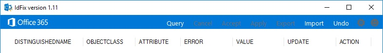

# 下载并运行 Office 365 IdFix 工具

*此文章适用于 Office 365 企业版和 Microsoft 365 企业版。*

IdFix 在同步到 Office 365 之前识别您的 Active Directory 域服务（AD DS）域中的错误（如重复和格式问题）。 
  
若要成功完成此任务，您应该能够轻松处理 AD DS 中的用户、组和联系人对象。
  
如果无法完成此任务，您还可以执行几个其他操作。 这些方法可能更简单，但它们可能会花费更长或其他缺点。 具体包括：
  
- **在不运行 IdFix 的情况下运行目录同步** 

  您可以在不使用 IdFix 工具的情况下同步目录，但我们不建议这样做。 在同步之前修复错误需要较少的时间，并且通常会使到云的过渡更平稳。 

- **雇用顾问** 

  获取专家帮助可以让你的用户快速启动并运行，你的目录将同步。 
    
## 运行 IdFix 所需的操作

获取 IdFix 的最简单方法是将其下载到已加入 AD DS 域的计算机上。 如果需要，可以在域控制器上运行它，但这并不是必需的。
  
### IdFix 硬件要求

您在其中下载 IdFix 的计算机需要满足以下最低硬件要求：
  
- 4 GB RAM
- 2 GB 的硬盘空间
   
### IdFix 软件要求

需要将 IdFix 下载到的计算机连接到要将用户同步到 Office 365 的同一 AD DS 域。 

计算机还需要安装 .NET Framework 4.0。 如果您运行的是 Windows Server 2008 或更高版本，则可能已安装 .NET Framework。 如果不是，则可以从下载中心或 Windows Update[下载 .net 4.0](https://go.microsoft.com/fwlink/p/?LinkId=400475) 。 
  
### IdFix 权限要求

您用于运行 IdFix 的用户帐户必须具有对 AD DS 域的读取和写入权限。
  
如果您不确定您的用户帐户是否满足这些要求，并且不确定如何进行检查，您仍可以下载并运行 IdFix。 如果您的用户帐户没有适当的权限，则 IdFix 将在您尝试运行它时只显示错误。
  
## 下载并解压缩 IdFix

请按照以下说明操作。 
  
1. 登录到您要在其中运行 IdFix 工具的计算机。
    
2. 请转到 Microsoft 下载中心网站，获取[IdFix DirSync 错误修正工具](https://go.microsoft.com/fwlink/?linkid=867219)。
    
3. 下载并打开 zip 文件。
    
3. 在 " **IdFix** " 窗口中，选择 "**提取**"，然后 "**全部提取**"。 默认情况下，IdFix 被提取`C:\Users\<your user name>\Documents\IdFix`到。 
    
6. 选择“**提取**”。

这些说明是通过运行 Windows Server 2016 的服务器上的 Internet Explorer 完成的。 如果您使用的是其他版本的 Windows 或不同的浏览器，则您的步骤可能会有所不同。
    
## 运行 IdFix 工具

下载并解压缩 IdFix 后，运行它以搜索 AD DS 域中的问题。
  
1. 使用具有对 AD DS 域的读/写访问权限的帐户登录到已下载 IdFix 的计算机。
    
2. 在文件资源管理器中，转到您在其中提取 IdFix 的位置。 如果在提取过程中选择了默认文件夹，请`C:\Users\<your user name>\Documents\IdFix`转到。 
    
3. 双击 " **IdFix**"。 
  
4. 默认情况下，IdFix 使用多租户规则集测试目录中的条目。 这是大多数 Office 365 客户的正确规则集。 但是，如果您是一种 Office 365 专用或国际流量（在 Arm 规章（ITAR））客户，则可以将 IdFix 配置为改用专用规则集。 如果您不确定您是哪种类型的客户，则可以安全地跳过此步骤。 若要将规则集设置为专用，请单击菜单栏中的齿轮图标，然后选择 "**专用**"。
    
5. 选择 "**查询**"。
    
    
  
6. 默认情况下，IdFix 会搜索整个目录中是否有错误。
    
    运行查询可能需要一段时间，具体取决于目录的大小。 您可以在该工具的主窗口的底部观看进度。 如果单击 "**取消**"，则需要从头开始重新启动。
  
7. 在 IdFix 完成查询后，如果没有任何错误，则可以同步您的目录。 如果目录中有错误，建议您在同步之前对其进行修复。 有关详细信息，请参阅[准备用于与 Office 365 同步的目录属性](prepare-directory-attributes-for-synch-with-idfix.md)。
    
    虽然不强制在同步之前修复这些错误，但强烈建议您至少查看 IdFix 返回的所有错误。
    
    每个错误都显示在该工具的主窗口中的单独行中。 
    
8. 如果您同意 "**更新**" 列中的 "建议的更改"，则在 "**操作**" 列中选择您希望 IdFix 实现更改所要执行的操作，然后单击 "**应用**"。 当您单击 "**应用**" 时，该工具会在目录中进行更改。
    
    无需在每次更新后单击 "**应用**"。 相反，您可以先修复几个错误，然后再单击 "**应用**"，IdFix 将同时更改所有这些错误。 您可以通过单击列出错误类型的列顶部的 "**错误**"，按错误类型对错误进行排序。 
    
    一种策略是修复相同类型的所有错误;例如，先修复所有重复项，并应用它们。 接下来，修复字符格式错误，等等。 每次应用更改时，IdFix 工具都会创建一个单独的日志文件，您可以使用该文件来撤消所做的更改，以防您犯错误。 [事务日志](idfix-transaction-log.md)存储在提取 IdFix 的文件夹中，这是默认情况下_C:\Users\<您的用户名> \documents\idfix_中的名称。 
    
    
  
9. 对目录进行所有更改后，再次运行 IdFix 以确保您所做的修补程序未引入新的错误。 您可以根据需要多次重复这些步骤。 在同步之前，最好先完成几次此过程。
    
## IdFix 上的其他资源 

- [IdFix 排除和支持的对象和属性](idfix-excluded-and-supported-objects-and-attributes.md)  
- [Office 365 IdFix 事务日志](idfix-transaction-log.md)
    
## 视频培训

有关详细信息，请参阅 LinkedIn[安装和使用 IdFix 工具，此](https://support.office.com/article/install-and-use-the-idfix-tool-4d81d73c-f172-4fd5-8542-f601c0c96aa9?ui=en-US&rs=en-US&ad=US)课程由 LinkedIn 学习版提供。
  

