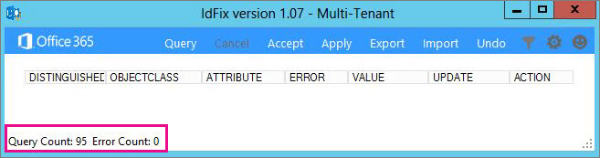

# 安装和运行 Office 365 IdFix 工具Install and run the Office 365 IdFix tool

IdFix 在同步到 Office 365 之前识别目录中的错误 (如复制和格式问题)。IdFix identifies errors such as duplicates and formatting problems in your directory before you synchronize to Office 365. 
  
若要成功完成此任务, 您应该能够轻松处理 Active Directory 中的用户、组和联系人对象。To finish this task successfully, you should be comfortable working with user, group, and contact objects in Active Directory.
  
如果无法完成此任务, 您还可以执行几个其他操作。If you can't complete this task, there are a couple of other things you can do. 这些方法可能更简单, 但它们可能会花费更长或其他缺点。These methods might be easier, but they might also take longer or have other drawbacks. 具体包括：They are:
  
- **在不运行 IdFix 的情况下运行目录同步。****Run directory synchronization without running IdFix.** 您可以在不运行 IdFix 工具的情况下同步目录, 但我们不建议这样做。You can synchronize your directory without running the IdFix tool, but we don't recommend it. 在同步之前修复错误需要较少的时间, 并且通常会使到云的过渡更平稳。Fixing errors before you synchronize takes less time and often provides a smoother transition to the cloud. 
- **雇用顾问。****Hire a consultant.** 获取专家帮助可以让你的用户快速启动并运行, 你的目录将同步。Getting expert help can get your users up and running quickly and your directory synchronized. 
    
## 运行 IdFix 所需的操作What you need to run IdFix

获取和运行 IdFix 的最简单方法是将其安装在加入您的域的计算机上。The easiest way to get IdFix up and running is to install it on a computer that is joined to your domain. 如果需要, 可以在域控制器上运行它, 但这并不是必需的。You can run it on the domain controller if you want, but it's not necessary.
  
### IdFix 硬件要求IdFix hardware requirements

您在其上安装 IdFix 的计算机需要满足以下最低硬件要求:The computer where you install IdFix needs to meet these minimum hardware requirements:
  
- 4 GB RAM4 GB RAM
- 2 GB 的硬盘空间2 GB of hard disk space
    
### IdFix 软件要求IdFix software requirements

需要将 IdFix 安装到的计算机连接到要将用户同步到 Office 365 的同一 Active Directory 域。The computer where you install IdFix needs to be joined to the same Active Directory domain from which you want to synchronize users to Office 365. 计算机还需要安装 .NET Framework 4.0。The computer also needs to have .NET Framework 4.0 installed. 
  
如果您运行的是 Windows Server 2008 或 Windows Server 2012, 则可能已安装 .NET Framework。If you are running Windows Server 2008 or Windows Server 2012, then .NET Framework is probably already installed. 如果不是, 则可以从下载中心或通过 Windows Update[下载 .net 4.0](https://go.microsoft.com/fwlink/p/?LinkId=400475) 。If not, you can [download .NET 4.0 from the download center](https://go.microsoft.com/fwlink/p/?LinkId=400475) or via Windows Update. 
  
### IdFix 权限要求IdFix permissions requirements

您用于运行 IdFix 的用户帐户需要具有对该目录的读/写访问权限。The user account that you use to run IdFix needs to have read/write access to the directory.
  
如果您不确定您的用户帐户是否满足这些要求, 并且不确定如何进行检查, 则仍可以安装和运行 IdFix。If you aren't sure if your user account meets these requirements, and you're not sure how to check, you can still install and run IdFix. 如果您的用户帐户没有适当的权限, 则 IdFix 将在您尝试运行它时只显示错误。If your user account doesn't have the right permissions, IdFix will simply display an error when you try to run it.
  
## 安装 IdFixInstall IdFix

若要安装 IdFix, 请下载并解压缩**IdFix**:To install IdFix, download and unzip **IdFix.exe**: 
  
1. 登录到要安装 IdFix 工具的计算机。Log on to the computer where you want to install the IdFix tool.
    
2. 请转到 Microsoft 下载中心网站, 获取[IdFix DirSync 错误修正工具](https://go.microsoft.com/fwlink/?linkid=867219)。Go to the Microsoft download site for the [IdFix DirSync Error Remediation Tool](https://go.microsoft.com/fwlink/?linkid=867219).
    
3. 选择“下载”\*\*\*\*。Choose **Download**.
    
4. 出现提示时, 选择 "**运行**"。When prompted, choose **Run**.
    
5. 在 " **WinZip 自动解压缩程序**" 对话框的 "**解压缩到文件夹**" 文本框中, 键入或浏览到要安装 IdFix 工具的位置。On the **WinZip Self-Extractor** dialog box, in the **Unzip to folder** text box, type or browse to the location where you want to install the IdFix tool. 默认情况下, IdFix 安装到`C:\Deployment Tools\`。By default, IdFix is installed into `C:\Deployment Tools\`. 
    
6. 选择 "**解压缩**"。Choose **Unzip**.
    
## 运行 IdFix 工具Run the IdFix tool

安装 IdFix 后, 运行该工具以搜索目录中的问题:After you install IdFix, run the tool to search for problems in your directory:
  
1. 使用具有对目录的读/写访问权限的帐户登录到安装了 IdFix 的计算机。Using an account that has read/write access to the directory, log on to the computer where you installed IdFix.
    
2. 在文件资源管理器中, 转到安装 IdFix 的位置。In File Explorer, go to the location where you installed IdFix. 如果您在安装过程中选择了默认文件夹, `C:\Deployment Tools\IdFix`请转到。If you chose the default folder during installation, go to `C:\Deployment Tools\IdFix`.
    
3. 双击 " **IdFix**"。Double-click **IdFix.exe**. 
    
    
  
4. 默认情况下, IdFix 使用多租户规则集测试目录中的条目。By default, IdFix uses the Multi-Tenant rule set to test the entries in your directory. 这是大多数 Office 365 客户的正确规则集。This is the right rule set for most Office 365 customers. 但是, 如果您是 Office 365 专用或 ITAR (Arm 规章中的国际流量) 客户, 则可以将 IdFix 配置为改用专用规则集。However, if you are an Office 365 Dedicated or ITAR (International Traffic in Arms Regulations) customer, you can configure IdFix to use the Dedicated rule set instead. 如果您不确定您是哪种类型的客户, 则可以安全地跳过此步骤。If you aren't sure what type of customer you are, you can safely skip this step. 若要将规则集设置为专用, 请单击菜单栏中的齿轮图标, 然后选择 "**专用**"。To set the rule set to Dedicated, click the gear icon in the menu bar and then choose **Dedicated**.
    
5. 选择 "**查询**"。Choose **Query**.
    
    
  
6. 默认情况下, IdFix 会搜索整个目录中是否有错误。By default, IdFix searches the entire directory for errors.
    
    运行查询可能需要一段时间, 具体取决于目录的大小。Depending on the size of your directory, running the query can take a while. 您可以在该工具的主窗口的底部观看进度。You can watch the progress at the bottom of the tool's main window. 如果单击 "**取消**", 则需要从头开始重新启动。If you click **Cancel**, you'll need to restart from the beginning.
    
    
  
7. 完成查询后, 如果没有任何错误, 则可以继续并同步您的目录。After IdFix completes the query, you can go ahead and synchronize your directory if there are no errors. 如果目录中有错误, 建议您在同步之前对其进行修复。If there are errors in your directory, it is recommended that you fix them before you synchronize. 如果您需要有关错误类型的更多具体信息, 以及有关修复每个错误的最佳方法的建议, 请参阅本主题末尾的链接。If you want more specific information about types of errors and recommendations about the best way to fix each of them, see the links at the end of this topic. 
    
    虽然不强制在同步之前修复这些错误, 但强烈建议您至少查看 IdFix 返回的所有错误。While it is not mandatory to fix the errors before you synchronize, we strongly recommend that you at least review all the errors returned by IdFix.
    
    每个错误都显示在该工具的主窗口中的单独行中。Each error is displayed in a separate row in the tool's main window . 
    
8. 如果您同意 "**更新**" 列中的 "建议的更改", 则在 "**操作**" 列中选择您希望 IdFix 实现更改所要执行的操作, 然后单击 "**应用**"。If you agree with the suggested change in the **UPDATE** column, in the **ACTION** column select what you want IdFix to do to implement the change and then click **Apply**. 当您单击 "**应用**" 时, 该工具会在目录中进行更改。When you click **Apply**, the tool makes the changes in the directory.
    
    无需在每次更新后单击 "**应用**"。You don't have to click **Apply** after each update. 相反, 您可以先修复几个错误, 然后再单击 "**应用**", IdFix 将同时更改所有这些错误。Instead, you can fix several errors before you click **Apply** and IdFix will change them all at the same time. 您可以通过单击列出错误类型的列顶部的 "**错误**", 按错误类型对错误进行排序。You can sort the errors by error type by clicking **ERROR** at the top of the column that lists the error types. 
    
    一种策略是修复相同类型的所有错误;例如, 先修复所有重复项, 并应用它们。One strategy is to fix all the errors of the same type; for example, fix all the duplicates first, and apply them. 接下来, 修复字符格式错误, 等等。Next, fix the character format errors, and so on. 每次应用更改时, IdFix 工具都会创建一个单独的日志文件, 您可以使用该文件来撤消所做的更改, 以防您犯错误。Each time you apply the changes, the IdFix tool creates a separate log file that you can use to undo your changes in case you make a mistake. [事务日志](idfix-transaction-log.md)存储在 IdFix 中安装的文件夹中。The [transaction log](idfix-transaction-log.md) is stored in the folder that you installed IdFix in.  默认情况下, _C:\Deployment Tools\IdFix_ 。_C:\Deployment Tools\IdFix_ by default. 
    
    
  
9. 对目录进行所有更改后, 再次运行 IdFix 以确保您所做的修补程序未引入新的错误。After all of your changes are made to the directory, run IdFix again to ensure that the fixes you made didn't introduce new errors. 您可以根据需要多次重复这些步骤。You can repeat these steps as many times as you need to. 在同步之前, 最好先完成几次此过程。It's a good idea to go through the process a few times before you synchronize.
    
## 我想要精简我的搜索或深入研究错误, 我还可以使用 IdFix 进行哪些操作？I want to refine my search or dig deeper into the errors, what else can I do with IdFix?

以下主题提供了更深入的信息:More in-depth information is available from these topics:
  
- [使用 IdFix 工具准备要与 Office 365 同步的目录属性](prepare-directory-attributes-for-synch-with-idfix.md)。[Prepare directory attributes for synchronization with Office 365 by using the IdFix tool](prepare-directory-attributes-for-synch-with-idfix.md) . 安装该工具后, 请跳转到本主题, 以获取有关运行该工具的更多详细说明、您将遇到的常见错误、建议的修补程序、示例和最佳做法, 以了解在遇到大量错误时应采取的操作。After you have installed the tool, jump to this topic for more detailed instructions about running the tool, common errors you will encounter, suggested fixes, examples, and best practices for what to do when you have a large number of errors. 
- [参考：IdFix 排除和支持的对象和属性Reference: IdFix excluded and supported objects and attributes](idfix-excluded-and-supported-objects-and-attributes.md)  
- [参考：Office 365 IdFix 事务日志Reference: Office 365 IdFix transaction log](idfix-transaction-log.md)
    
## 视频培训Video training

有关详细信息, 请参阅 LinkedIn[安装和使用 IDFix 工具, 此](https://support.office.com/article/install-and-use-the-idfix-tool-4d81d73c-f172-4fd5-8542-f601c0c96aa9?ui=en-US&rs=en-US&ad=US)课程由 LinkedIn 学习版提供。For more information, see the lesson [Install and use the IDFix tool](https://support.office.com/article/install-and-use-the-idfix-tool-4d81d73c-f172-4fd5-8542-f601c0c96aa9?ui=en-US&rs=en-US&ad=US), brought to you by LinkedIn Learning.
  

