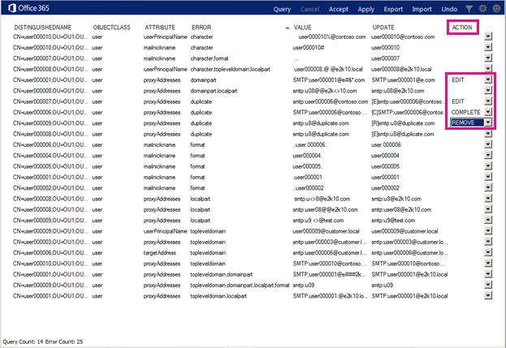

# 安装和运行 Office 365 IdFix 工具

IdFix 在同步到 Office 365 之前识别目录中的错误 (如复制和格式问题)。 
  
若要成功完成此任务, 您应该能够轻松处理 Active Directory 中的用户、组和联系人对象。
  
如果无法完成此任务, 您还可以执行几个其他操作。 这些方法可能更简单, 但它们可能会花费更长或其他缺点。 具体包括：
  
- **在不运行 IdFix 的情况下运行目录同步。** 您可以在不运行 IdFix 工具的情况下同步目录, 但我们不建议这样做。 在同步之前修复错误需要较少的时间, 并且通常会使到云的过渡更平稳。 
- **雇用顾问。** 获取专家帮助可以让你的用户快速启动并运行, 你的目录将同步。 
    
## 运行 IdFix 所需的操作

获取和运行 IdFix 的最简单方法是将其安装在加入您的域的计算机上。 如果需要, 可以在域控制器上运行它, 但这并不是必需的。
  
### IdFix 硬件要求

您在其上安装 IdFix 的计算机需要满足以下最低硬件要求:
  
- 4 GB RAM
- 2 GB 的硬盘空间
    
### IdFix 软件要求

需要将 IdFix 安装到的计算机连接到要将用户同步到 Office 365 的同一 Active Directory 域。 计算机还需要安装 .NET Framework 4.0。 
  
如果您运行的是 Windows Server 2008 或 Windows Server 2012, 则可能已安装 .NET Framework。 如果不是, 则可以从下载中心或通过 Windows Update[下载 .net 4.0](https://go.microsoft.com/fwlink/p/?LinkId=400475) 。 
  
### IdFix 权限要求

您用于运行 IdFix 的用户帐户需要具有对该目录的读/写访问权限。
  
如果您不确定您的用户帐户是否满足这些要求, 并且不确定如何进行检查, 则仍可以安装和运行 IdFix。 如果您的用户帐户没有适当的权限, 则 IdFix 将在您尝试运行它时只显示错误。
  
## 安装 IdFix

若要安装 IdFix, 请下载并解压缩**IdFix**: 
  
1. 登录到要安装 IdFix 工具的计算机。
    
2. 请转到 Microsoft 下载中心网站, 获取[IdFix DirSync 错误修正工具](https://go.microsoft.com/fwlink/?linkid=867219)。
    
3. 选择“下载”****。
    
4. 出现提示时, 选择 "**运行**"。
    
5. 在 " **WinZip 自动解压缩程序**" 对话框的 "**解压缩到文件夹**" 文本框中, 键入或浏览到要安装 IdFix 工具的位置。 默认情况下, IdFix 安装到`C:\Deployment Tools\`。 
    
6. 选择 "**解压缩**"。
    
## 运行 IdFix 工具

安装 IdFix 后, 运行该工具以搜索目录中的问题:
  
1. 使用具有对目录的读/写访问权限的帐户登录到安装了 IdFix 的计算机。
    
2. 在文件资源管理器中, 转到安装 IdFix 的位置。 如果您在安装过程中选择了默认文件夹, `C:\Deployment Tools\IdFix`请转到。
    
3. 双击 " **IdFix**"。 
    
    
  
4. 默认情况下, IdFix 使用多租户规则集测试目录中的条目。 这是大多数 Office 365 客户的正确规则集。 但是, 如果您是 Office 365 专用或 ITAR (Arm 规章中的国际流量) 客户, 则可以将 IdFix 配置为改用专用规则集。 如果您不确定您是哪种类型的客户, 则可以安全地跳过此步骤。 若要将规则集设置为专用, 请单击菜单栏中的齿轮图标, 然后选择 "**专用**"。
    
5. 选择 "**查询**"。
    
    
  
6. 默认情况下, IdFix 会搜索整个目录中是否有错误。
    
    运行查询可能需要一段时间, 具体取决于目录的大小。 您可以在该工具的主窗口的底部观看进度。 如果单击 "**取消**", 则需要从头开始重新启动。
    
    
  
7. 完成查询后, 如果没有任何错误, 则可以继续并同步您的目录。 如果目录中有错误, 建议您在同步之前对其进行修复。 如果您需要有关错误类型的更多具体信息, 以及有关修复每个错误的最佳方法的建议, 请参阅本主题末尾的链接。 
    
    虽然不强制在同步之前修复这些错误, 但强烈建议您至少查看 IdFix 返回的所有错误。
    
    每个错误都显示在该工具的主窗口中的单独行中。 
    
8. 如果您同意 "**更新**" 列中的 "建议的更改", 则在 "**操作**" 列中选择您希望 IdFix 实现更改所要执行的操作, 然后单击 "**应用**"。 当您单击 "**应用**" 时, 该工具会在目录中进行更改。
    
    无需在每次更新后单击 "**应用**"。 相反, 您可以先修复几个错误, 然后再单击 "**应用**", IdFix 将同时更改所有这些错误。 您可以通过单击列出错误类型的列顶部的 "**错误**", 按错误类型对错误进行排序。 
    
    一种策略是修复相同类型的所有错误;例如, 先修复所有重复项, 并应用它们。 接下来, 修复字符格式错误, 等等。 每次应用更改时, IdFix 工具都会创建一个单独的日志文件, 您可以使用该文件来撤消所做的更改, 以防您犯错误。 [事务日志](idfix-transaction-log.md)存储在 IdFix 中安装的文件夹中。  默认情况下, _C:\Deployment Tools\IdFix_ 。 
    
    
  
9. 对目录进行所有更改后, 再次运行 IdFix 以确保您所做的修补程序未引入新的错误。 您可以根据需要多次重复这些步骤。 在同步之前, 最好先完成几次此过程。
    
## 我想要精简我的搜索或深入研究错误, 我还可以使用 IdFix 进行哪些操作？

以下主题提供了更深入的信息:
  
- [使用 IdFix 工具准备要与 Office 365 同步的目录属性](prepare-directory-attributes-for-synch-with-idfix.md)。 安装该工具后, 请跳转到本主题, 以获取有关运行该工具的更多详细说明、您将遇到的常见错误、建议的修补程序、示例和最佳做法, 以了解在遇到大量错误时应采取的操作。 
- [参考：IdFix 排除和支持的对象和属性](idfix-excluded-and-supported-objects-and-attributes.md)  
- [参考：Office 365 IdFix 事务日志](idfix-transaction-log.md)
    
## 视频培训

有关详细信息, 请参阅 LinkedIn[安装和使用 IDFix 工具, 此](https://support.office.com/article/install-and-use-the-idfix-tool-4d81d73c-f172-4fd5-8542-f601c0c96aa9?ui=en-US&rs=en-US&ad=US)课程由 LinkedIn 学习版提供。
  

