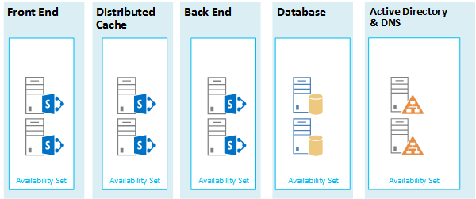

# SharePoint 2013 的 Microsoft Azure 体系结构

Azure 是用于托管 SharePoint Server 2013 解决方案的绝佳环境。 在大多数情况下，我们建议使用 Microsoft 365，但托管在 Azure 中的 SharePoint Server 场可以为特定解决方案提供一个不错的选择。 本文介绍如何构建 SharePoint 解决方案，使它们适合 Azure 平台。 我们将以下面两个特定解决方案为例进行说明：
  
- [Microsoft Azure 中的 SharePoint Server 2013 灾难恢复](sharepoint-server-2013-disaster-recovery-in-microsoft-azure.md)
    
- [Microsoft Azure 中使用 SharePoint Server 2013 的 Internet 站点](internet-sites-in-microsoft-azure-using-sharepoint-server-2013.md)
    
## 用于 Azure 基础结构服务的建议 SharePoint 解决方案

Azure infrastructure services is a compelling option for hosting SharePoint solutions. Some solutions are a better fit for this platform than others. The following table shows recommended solutions.
  
|**解决方案**|**为何建议将此解决方案用于 Azure**|
|:-----|:-----|
|开发和测试环境    |创建和管理这些环境非常容易。    |
|将内部部署 SharePoint 服务器场灾难恢复到 Azure    |**承载的辅助数据中心** 使用 Azure，而不是在其他地区投资建设辅助数据中心。   **Lower-cost disaster-recovery environments** Maintain and pay for fewer resources than an on-premises disaster recovery environment. The number of resources depends on the disaster recovery environment you choose: cold standby, warm standby, or hot standby.   **More elastic platform** In the event of a disaster, easily scale-out your recovery SharePoint farm to meet load requirements. Scale in when you no longer need the resources.   请参阅[Microsoft Azure 中的 SharePoint Server 2013 灾难恢复](sharepoint-server-2013-disaster-recovery-in-microsoft-azure.md)。    |
|使用 Microsoft 365 中不提供的功能和规模的面向 Internet 的网站    |**集中精力** 构建一个很棒的网站，而不是构建基础结构。   **Take advantage of elasticity in Azure** Size the farm for the demand by adding new servers, and pay only for resources you need. Dynamic machine allocation is not supported (auto scale).   **使用 Azure Active Directory (AD)** 利用客户帐户的 Azure AD。   **添加 Microsoft 365 中不可用的 SharePoint 功能**添加深入报告和 web 分析。   请参阅[Microsoft Azure 中使用 SharePoint Server 2013 的 Internet 站点](internet-sites-in-microsoft-azure-using-sharepoint-server-2013.md)。    |
|支持 Microsoft 365 或本地环境的应用程序场    |在 Azure 中构建、测试和承载应用程序，以支持内部部署和云环境。   在 Azure 中承载此角色，而无需为内部部署环境购买新硬件。   |
   
对于 Intranet 以及协作解决方案和工作负载，请考虑下列选项：
  
- 确定 Microsoft 365 是否满足你的业务要求，或是否可以成为解决方案的一部分。 Microsoft 365 提供了一个始终处于最新状态的丰富功能集。
    
- 如果 Microsoft 365 不符合你的所有业务要求，请考虑从 Microsoft 咨询服务（MCS）的本地部署 SharePoint 2013 的标准实现。 相比自定义体系结构而言，标准体系结构的支持更快速、便宜和简单。 
    
- 如果标准实现不满足您的业务需求，请考虑使用自定义的内部部署解决方案。
    
- If using a cloud platform is important for your business requirements, consider a standard or customized implementation of SharePoint 2013 hosted in Azure infrastructure services. SharePoint solutions are much easier to support in Azure than other non-native Microsoft public cloud platforms.
    
## 设计 Azure 环境之前

While this article uses example SharePoint topologies, you can use these design concepts with any SharePoint farm topology. Before you design the Azure environment, use the following topology, architecture, capacity, and performance guidance to design the SharePoint farm:
  
- [面向 SharePoint 2013 IT 专业人员的体系结构设计](https://technet.microsoft.com/sharepoint/fp123594.aspx)
    
- [Plan for performance and capacity management in SharePoint Server 2013](https://technet.microsoft.com/library/8dd52916-f77d-4444-b593-1f7d6f330e5f.aspx)
    
## 确定 Active Directory 域类型

Each SharePoint Server farm relies on Active Directory to provide administrative accounts for farm setup. At this time, there are two options for SharePoint solutions in Azure. These are described in the following table.
  
|**选项**|**说明**|
|:-----|:-----|
|专用域    |You can deploy a dedicated and isolated Active Directory domain to Azure to support your SharePoint farm. This is a good choice for public-facing Internet sites.    |
|通过跨界连接扩展本地域    |When you extend the on-premises domain through a cross-premises connection, users access the SharePoint farm via your intranet as if it were hosted on-premises. You can take advantage of your on-premises Active Directory and DNS implementation.    在 Azure 中构建灾难恢复环境以便从本地服务器场进行故障转移时，将需要跨界连接。    |
   
This article includes design concepts for extending the on-premises domain through a cross-premises connection. If your solution uses a dedicated domain, you don't need a cross-premises connection.
  
## 设计虚拟网络

First you need a virtual network in Azure, which includes subnets on which you will place your virtual machines. The virtual network needs a private IP address space, portions of which you assign to the subnets.
  
如果要通过（灾难恢复环境所必需的）跨域连接将本地网络扩展到 Azure，则必须选择一个未在组织网络中的任何位置使用的专用地址空间，其中可以包括您的本地环境和其他 Azure 虚拟网络。 
  
**图 1：本地环境和 Azure 中的虚拟网络。**

  
在此图中：
  
- A virtual network in Azure is illustrated side-by-side to the on-premises environment. The two environments are not yet connected by a cross-premises connection, which can be a site-to-site VPN connection or ExpressRoute.
    
- At this point, the virtual network just includes the subnets and no other architectural elements. One subnet will host the Azure gateway and other subnets host the tiers of the SharePoint farm, with an additional one for Active Directory and DNS.
    
## 添加跨界连接

The next deployment step is to create the cross-premises connection (if this applies to your solution). For cross-premises connections, a Azure gateway resides in a separate gateway subnet, which you must create and assign an address space. 
  
在计划跨界连接时，您将定义并创建 Azure 网关和到本地网关设备的连接。
  
**图 2：使用 Azure 网关和本地网关设备提供本地环境和 Azure 之间的站点到站点连接**

  
在此图中：
  
- 添加到上图中时，本地环境将通过跨界连接（可以是站点到站点 VPN 连接，也可以是 ExpressRoute）来连接到 Azure 虚拟网络。
    
- Azure 网关位于网关子网上。
    
- 本地环境包括网关设备，如路由器或 VPN 服务器。
    
有关规划和创建跨界虚拟网络的其他信息，请参阅[将本地网络连接到 Microsoft Azure 虚拟网络](connect-an-on-premises-network-to-a-microsoft-azure-virtual-network.md)。
  
## 添加 Active Directory 域服务（AD DS）和 DNS

在 Azure 中进行灾难恢复时，您在混合方案中部署 Windows Server AD 和 DNS，其中 Windows Server AD 部署在本地和 Azure 虚拟机上。
  
**图 3：混合 Active Directory 域配置**

  
This diagram builds on the previous diagrams by adding two virtual machines to a Windows Server AD and DNS subnet. These virtual machines are replica domain controllers and DNS servers. They are an extension of the on-premises Windows Server AD environment. 
  
The following table provides configuration recommendations for these virtual machines in Azure. Use these as a starting point for designing your own environment—even for a dedicated domain where your Azure environment doesn't communicate with your on-premises environment.
  
|**项**|**配置**|
|:-----|:-----|
|Azure 中的虚拟机大小    |标准层中的 A1 或 A2 大小    |
|操作系统    |Windows Server 2012 R2    |
|Active Directory 角色    |AD DS domain controller designated as a global catalog server. This configuration reduces egress traffic across the cross-premises connection.    在高更改率（这并不常见）多域环境中，将内部部署域控制器配置为不与 Azure 中的全局目录服务器同步，以减少复制流量。    |
|DNS 角色    |在域控制器上安装和配置 DNS 服务器服务。    |
|数据磁盘    |Place the Active Directory database, logs, and SYSVOL on additional Azure data disks. Do not place these on the operating system disk or the temporary disks provided by Azure.    |
|IP 地址    |使用静态 IP 地址，并在域控制器配置完毕后，将虚拟机网络配置为将这些地址分配到虚拟网络中的虚拟机。    |
   
> [!IMPORTANT]
> Before you deploy Active Directory in Azure, read [Guidelines for Deploying Windows Server Active Directory on Azure Virtual Machines](https://go.microsoft.com/fwlink/p/?linkid=392681). These help you determine if a different architecture or different configuration settings are needed for your solution. 
  
## 添加 SharePoint 服务器场

将 SharePoint 服务器场虚拟机置于适当的子网的层级中。
  
**图 4：SharePoint 虚拟机的位置**

  
此图构建在上一张图的基础之上，它将 SharePoint 服务器场服务器角色添加到了相应的层级中。
  
- 运行 SQL Server 的两个数据库虚拟机创建数据库层。
    
- 运行以下每个层级的 SharePoint Server 2013 的两个虚拟机：前端服务器、分布式缓存服务器和后端服务器。
    
## 设计和优化可用性集和错误域的服务器角色

A fault domain is a grouping of hardware in which role instances run. Virtual machines within the same fault domain can be updated by the Azure infrastructure at the same time. Or, they can fail at the same time because they share the same rack. To avoid the risk of having two virtual machines on the same fault domain, you can configure your virtual machines as an availability set, which ensures that each virtual machine is in a different fault domain. If three virtual machines are configured as an availability set, Azure guarantees that no more than two of the virtual machines are located in the same fault domain.
  
When you design the Azure architecture for a SharePoint farm, configure identical server roles to be part of an availability set. This ensures that your virtual machines are spread across multiple fault domains.
  
**图 5：使用 Azure 可用性集为 SharePoint 服务器层级提供高可用性**

  
This diagram calls out the configuration of availability sets within the Azure infrastructure. Each of the following roles share a separate availability set:
  
- Active Directory 和 DNS
    
- 数据库
    
- 后端
    
- 分布式缓存
    
- 前端
    
The SharePoint farm might need to be fine tuned in the Azure platform. To ensure high availability of all components, ensure that the server roles are all configured identically.
  
Here is an example that shows a standard Internet Sites architecture that meets specific capacity and performance goals. This example is featured in the following architecture model: [Internet Sites Search Architectures for SharePoint Server 2013](https://go.microsoft.com/fwlink/p/?LinkId=261519).
  
**图 6：三层服务器场的容量和性能目标规划示例**

  
在此图中：
  
- 显示了三层服务器场：Web 服务器、应用程序服务器和数据库服务器。
    
- 三个 Web 服务器配置相同，均具有多个组件。
    
- 两个数据库服务器的配置相同。
    
- The three application servers are not configured identically. These server roles require fine tuning for availability sets in Azure.
    
让我们进一步了解一下应用程序服务器层。
  
**图 7：优化之前的应用程序服务器层**

  
在此图中：
  
- 三个服务器都包含在应用程序层中。
    
- 第一个服务器包含四个组件。
    
- 第二个服务器包括三个组件。
    
- 第三个服务器包含两个组件。
    
You determine the number of components by the performance and capacity targets for the farm. To adapt this architecture for Azure, we'll replicate the four components across all three servers. This increases the number of components beyond what is necessary for performance and capacity. The tradeoff is that this design ensures high availability of all four components in the Azure platform when these three virtual machines are assigned to an availability set.
  
**图 8：优化之后的应用程序服务器层**

  
此图显示了使用相同的四个组件进行相同配置的所有三个应用程序服务器。
  
将可用性集添加到 SharePoint 场层后，即完成实现过程。
  
**图 9：Azure 基础结构服务中已完成的 SharePoint 服务器场**

  
此图显示在 Azure 基础结构服务中实现的 SharePoint 服务器场，以及为每个层级中的服务器提供故障域的可用性集。
  
## 另请参阅

[云应用和混合解决方案](cloud-adoption-and-hybrid-solutions.yml)
  
[Microsoft Azure 中使用 SharePoint Server 2013 的 Internet 站点](internet-sites-in-microsoft-azure-using-sharepoint-server-2013.md)
  
[Microsoft Azure 中的 SharePoint Server 2013 灾难恢复](sharepoint-server-2013-disaster-recovery-in-microsoft-azure.md)

