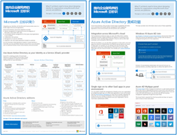
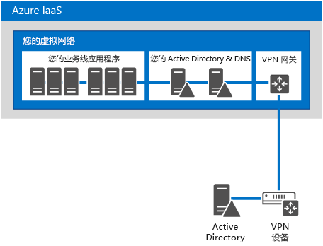
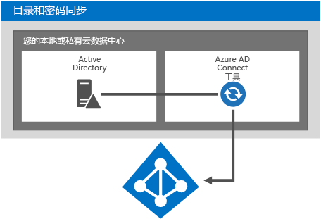
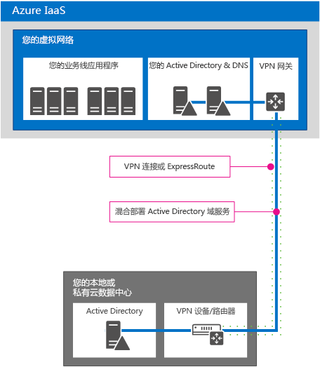

# 企业级结构设计版的 Microsoft 云标识

 **摘要：** 设计用于 Microsoft 云服务和平台的标识解决方案。
  
本文介绍 IT 架构师为使用 Microsoft 云服务和平台的组织设计标识所需要了解的内容。此外，你还可以使用 5 页海报的形式浏览本文，以文摘格式进行打印（也称为分类帐，11 x 17 或 A3)。
  

  
[PDF](https://go.microsoft.com/fwlink/p/?LinkId=524586) | [Visio](https://download.microsoft.com/download/2/3/8/238228E6-9017-4F6C-BD3C-5559E6708F82/MSFT_cloud_architecture_identity.vsd) | [更多语言](https://www.microsoft.com/download/details.aspx?id=54431)
  
还可以查看 [Microsoft 云 IT 体系结构资源](microsoft-cloud-it-architecture-resources.md)中的所有模型，逐一浏览 [Microsoft 企业云路线图：IT 决策者的资源](https://aka.ms/cloudarchitecture)。
  
> [!NOTE]
> 本文涵盖了 2016 年 1 月版**面向企业架构师的 Microsoft 云标识**海报。它不包含 2016 年 4 月或之后版本海报的更改。
  
## 设计 Microsoft 云标识

通过将你的标识与 Microsoft 云进行集成，你将能够访问广泛的服务和云平台选项。有两个主要选项：
  
- 你可以与 Microsoft Azure Active Directory (AD) 集成。这涉及将你的本地帐户同步到 Azure AD，这是适用于 Microsoft 云的标识提供程序。
    
- 你可以将本地 Active Directory 域服务 (AD DS) 环境扩展到在 Microsoft Azure 基础结构服务中运行的虚拟机。
    

  
 **图 1：用于在云中设计您的标识的选项**
  
图 1 显示了 Azure AD 如何成为 Microsoft 服务型软件 (SaaS) 服务和 Azure 平台即服务 (PaaS) 应用程序的标识提供程序，以及业务线应用程序如何使用本地 AD DS。 
  
### Azure Active Directory

Microsoft Azure AD 是 Microsoft 云托管标识并且可以访问管理服务。它位于 Microsoft 云服务和平台的中心。通过与 Azure AD 进行集成，你将能够使用当前帐户和密码集访问所有 Microsoft SaaS 服务。该集成还为 Azure PaaS 应用程序提供基于云的标识。 
  
> [!NOTE]
> Azure AD 不能替代企业组织或在 Azure 服务架构 (IaaS) 中运行的基于 Windows 的虚拟机对本地 AD DS 的需求。 
  
有三个版本的 Azure AD:免费版、基本版和高级版。 
  
||||
|:-----|:-----|:-----|
|**免费**   |**基本**   |**高级**   |
| 	管理用户帐户    与本地目录同步    跨 Azure、Office 365 和数以千计的其他流行 SaaS 应用程序（如 Salesforce、Workday、Concur、DocuSign、Google Apps、Box、ServiceNow、Dropbox 等）单一登录   | 包括免费版的所有功能，外加：    公司品牌    基于组的应用程序访问    自助服务密码重置    99.9% 的企业 SLA   | 包括免费版和基本版的所有功能，外加:    自助服务组管理    	高级安全报告和警报    	多重身份验证    通过回写到本地 AD DS 重置密码    Azure AD Connect 工具双向同步    Azure AD 应用程序代理    	Microsoft Forefront Identity Manager (MIM)   |
   
有关这些版本的详细信息，请参阅 [Azure Active Directory 版本](https://go.microsoft.com/fwlink/p/?LinkId=524280)。
  
### 选项 1：与 Azure Active Directory 集成

大多数组织将一组标准对象和属性同步到他们的 Azure AD 租户。Azure AD Connect 工具在本地 AD DS 和 Azure AD 租户之间同步你的帐户。
  

  
 **图 2：与 Azure AD 集成**
  
图 2 显示了 Azure AD Connect 工具如何获取 AD DS 更改，并将这些更改发送到 Azure AD 租户。在这种情况下，Azure AD 租户是基本本地目录内容的云托管副本。
  
许多组织使用 AD DS 作为其本地标识提供程序。你可以使用不同类型的本地标识提供程序（例如，使用 LDAP 的本地标识提供程序），并将它们同步到 Azure AD。
  
### 选项 2：将 AD DS 扩展到 Azure

将 AD DS 扩展到在 Azure 基础结构服务中运行的虚拟机，这一操作可支持一组与同步到 Azure AD 不同的解决方案和应用程序。有两种支持方式：
  
- 支持基于云的解决方案，这些解决方案需要 NTLM 或 Kerberos 身份验证或加入 AD DS 域的虚拟机。
    
- 为跨 Microsoft 云服务和平台的云服务和应用程序添加其他潜在的集成。
    

  
 **图 3：将 AD DS 扩展到 Azure**
  
图 3 显示了通过本地 VPN 设备和 Azure VPN 网关将 AD DS 域控制器连接到 Azure 虚拟网络。Azure 虚拟网络包含业务线应用程序及其自己的一组 AD DS 域控制器的服务器。
  
### 详细信息

- [通过 Office 365 同步目录简单易行](https://go.microsoft.com/fwlink/p/?LinkId=524281)
    
- [信息图：云标识和访问管理](https://go.microsoft.com/fwlink/p/?LinkId=524282)
    
- [Azure Active Directory](https://go.microsoft.com/fwlink/p/?LinkId=524283)
    
## 使用 Microsoft Azure AD 集成您的本地 AD DS 帐户

通过将您的本地 AD DS 帐户与 Azure AD 同步，您的用户可以使用他们的本地 AD DS 帐户访问以下内容：
  
- 所有 Microsoft SaaS 服务（Office 365、Microsoft Intune 和 Dynamics CRM Online）
    
- 在 Azure PaaS 中运行的应用程序
    
配置此集成的方法有两种：
  
- 目录和密码同步
    
- 联合身份验证和单一登录
    
从满足你需求的最简单选项入手。如果需要，你可以在这些选项之间切换。
  
> [!NOTE]
> 不建议企业规模组织使用云专用帐户（即，不与您的本地 AD DS 集成）。 
  
### 目录和密码同步

这是最简单的选项，仅需要一台运行 Azure AD Connect 工具的服务器。 
  

  
 **图 4：目录和密码同步配置**
  
图 4 显示了带有 AD DS 域控制器的本地或私有云数据中心。运行 Azure AD Connect 工具的服务器会将帐户名称列表与 Azure AD 同步。
  
使用此选项，你可以实现以下功能：
  
- 将用户帐户从你的本地 AD DS（或其他标识提供程序）同步到你的 Azure AD 租户。本地目录仍是帐户的权威来源，并且你可以从中管理所有帐户更改。
    
- Azure AD 为基于 Microsoft SaaS 的服务和 Azure PaaS 应用程序执行所有的身份验证。
    
- 您还可以为多个 AD DS 林配置同步。
    
使用密码同步，您可以实现以下功能：
  
- 在用户访问云服务时将提示用户输入密码，该密码为他们访问本地资源所用的相同密码。
    
- 用户密码永远不会以明文形式发送到 Azure AD，而会使用密码的哈希形式。从加密的角度而言，对密码哈希进行解密或反向工程处理并获取明文密码是不可能的。 
    
使用多重身份验证 (MFA)，您可以实现以下功能：
  
- 利用 Office 365 提供的基本 MFA 功能。
    
- Azure PaaS 应用程序开发人员可以利用 Azure Multi-Factor Authentication 服务。
    
目录同步不提供与本地 MFA 解决方案的集成。
  
### 联合身份验证和单一登录

此选项需要其他服务器和基础架构。 
  

  
 **图 5： 执行联合身份验证所需的服务器**
  
图 5 显示了执行联合身份验证所需的组件集。Azure AD 联系 Web 应用程序代理，该代理将身份验证请求转发到 Active Directory 联合身份验证服务 (AD FS) 服务器，后者将请求转发到 AD DS 域控制器以进行评估和响应。运行 Azure AD Connect 工具的服务器会将帐户名称列表从 AD DS 同步到 Azure AD。
  
联合身份验证提供这些额外的企业级功能：
  
- 将发送到 Azure AD 的所有身份验证请求转发到本地标识提供程序，并通过 AD FS 对本地标识提供程序执行这些请求。
    
- 使用非 Microsoft 标识提供程序。
    
- 密码哈希同步可作为联合登录的登录备份（例如，如果联合身份验证失败）。
    
如果出现以下情况，则使用联合身份验证：
  
- 需要单一登录。使用单一登录，在访问云服务时，将不提示用户输入任何凭据（用户名或密码）。
    
- 已部署 AD FS。
    
- 使用第三方标识提供程序。
    
- 使用 Forefront Identity Manager 2010 R2（不支持密码哈希同步）。
    
- 有本地集成的智能卡或其他 MFA 解决方案。
    
- 您需要登录审核和/或禁用帐户。
    
- 贵组织需要按网络位置或工作时间限制客户端登录。
    
- 您必须遵守联邦信息处理标准 (FIPS)。
    
联合身份验证需要在本地基础结构上进行更大的投资。
  
- 本地服务器必须可通过公司防火墙访问 Internet。Microsoft 建议使用在外围网络中部署的 Web 应用程序代理服务器。
    
- 需要硬件和许可证，且要求 AD FS 服务器、AD FS 代理服务器或 Web 应用程序代理服务器、防火墙和负载平衡器处于运行状态。 
    
- 可用性和性能对于确保用户能够访问 Office 365 和其他云应用程序非常重要。
    
### 详细信息

- [通过 Office 365 同步目录简单易行](https://go.microsoft.com/fwlink/p/?LinkId=524281)
    
- [准备通过到 Office 365 的目录同步来设置用户](https://go.microsoft.com/fwlink/p/?LinkId=524284)
    
- [适用于 Office 365 的 Multi-Factor Authentication](https://go.microsoft.com/fwlink/p/?LinkID=392012)
    
- [Azure Multi-Factor Authentication](https://go.microsoft.com/fwlink/p/?LinkId=524285)
    
- [TechEd 2014：目录集成：创建一个包含 Active Directory 和 Azure Active Directory 的目录](https://go.microsoft.com/fwlink/p/?LinkId=524286)
    
## 将 AD DS 扩展到 Azure

将 AD DS 扩展到 Azure 是支持在 Azure 基础结构服务的虚拟机上运行业务线应用程序的第一步，提供以下功能:
  
- 支持基于云的解决方案，这些解决方案需要 NTLM 或 Kerberos 身份验证或加入 AD DS 域的虚拟机。
    
- 云服务和应用程序的其他潜在集成，并且可以随时添加集成。
    

  
 **图 6： 将 AD DS 扩展到 Azure 虚拟网络**
  
图 6 显示了一个本地或私有云数据中心，其中 AD DS 已通过站点到站点 VPN 或 ExpressRoute 连接已连接到 Azure 虚拟网络。Azure 虚拟网络包含业务线应用程序的服务器及其自己的一组 AD DS 域控制器。此配置是本地 AD DS 的混合部署，位于 Azure 基础结构服务中。它需要：
  
- Azure 虚拟网络。
    
- 本地虚拟专用网络 (VPN) 设备或路由器与 Azure VPN 网关之间的连接。
    
- 在虚拟网络中为虚拟机使用本地 IP 地址空间的一部分。
    
- 在指定为全局编录服务器的虚拟网络中部署一个或多个域控制器（通过 VPN 连接减少出口通信量）。
    
与和 Azure AD 同步相比，这一标识体系结构支持一组不同的解决方案和应用程序。
  
### 本地到 Azure 的连接选项

若要将您的本地网络连接到 Azure 虚拟网络，您可以使用以下方式：
  
- 站点到站点 VPN 连接，此连接可以将 1-10 个站点（包括其他 Azure 虚拟网络）连接到单个 Azure 虚拟网络。
    
- ExpressRoute，这是通过合作伙伴网络和数据中心服务提供商建立的一个到 Azure 的专用安全 WAN 链接。ExpressRoute 连接可以提供更高的可靠性、更高的带宽和更低的延迟时间。
    
### 详细信息

- [适用于虚拟网络的跨界连接](https://go.microsoft.com/fwlink/p/?LinkId=524293)
    
- [ExpressRoute 技术概述](https://go.microsoft.com/fwlink/?LinkID=392081)
    
- [在 Azure 虚拟机上部署 Windows Server Active Directory 的准则](https://go.microsoft.com/fwlink/p/?LinkId=524295)
    
## 将应用程序与云标识进行集成

当设计和开发在云中运行的应用程序时，你应力求实现身份验证过程用户体验的一致性，包括所需的凭据集。例如，在使用 Windows 凭据时，无论针对的是 Azure AD 还是扩展的 AD DS，都要确保用户可以快速进行验证并专注于他们的任务。
  

  
 **图 7：将应用程序与云标识进行集成**
  
图 7 显示了用于将应用程序与云标识进行集成的三个选项。
  
1. 通过 Azure AD 注册云托管的应用程序。
    
    请参阅 MSDN 文章[将应用程序与 Azure Active Directory 集成](https://go.microsoft.com/fwlink/p/?LinkId=524303)。这允许你使用 Azure AD 来验证对 PaaS 应用程序的访问，并允许用户或管理员授予对你的应用程序的权限以便代表他们访问来自其他云服务（如 Office 365）的内容。更多详细信息和代码示例可在 MSDN 文章 [Azure Active Directory 的身份验证方案](https://go.microsoft.com/fwlink/p/?LinkId=524304)中找到。 
    
2. 需要以编程方式进行身份验证来获取通过 AD SD、Windows Server 2012 R2 上的 AD SD 或 Azure AD 保护的应用程序访问权限的应用程序可以使用：
    
  - [Azure AD 图形 API](https://go.microsoft.com/fwlink/p/?LinkId=524305)
    
  - [Active Directory Authentication Library (ADAL)](https://go.microsoft.com/fwlink/p/?LinkID=524297)
    
    Azure AD 图形 API 支持 OAuth 和 OpenID Connect。它还适用于 PaaS 应用程序。
    
3. 将在 Azure 虚拟网络的虚拟机上运行的本地应用程序或业务线应用程序配置为直接使用 Windows 身份验证（NTLM 或 Kerberos）。这是最佳的用户体验，需要为服务器应用程序开发人员进行的配置最少。
    
### 应用程序集成示例

组织构建公开 REST 终结点的 ASP.NET 应用程序，其他应用程序可以通过此终结点获取最新的销售数据。使用 Azure AD 确保对该 REST 终结点的访问安全。在 ASP.NET 应用程序发送请求的数据之前，应用程序必须提供可以通过 Azure AD 进行身份验证的凭据。然后，组织中的其他开发人员可以编写他们自己的、使用 REST 终结点中销售数据的应用程序。
  
若要对 Azure AD 进行身份验证并检索数据，ADAL 管理用户身份验证过程，并将访问令牌递交给应用程序，以便使用访问令牌来获取对销售数据的访问权限。ADAL 通过抽象大大降低了获取和分析令牌、OAuth 流和其他元素的复杂性。ADAL 是另一种迅速变化的技术解决方案，因此开发人员应在 NuGet 上查找最新版本。
  
## 在 Azure 中部署目录组件

你可以在 Azure 虚拟网络而不是本地数据中心中部署目录组件，如用于密码同步或联合身份验证的服务器。考虑其优点，尤其是当你计划将 AD DS 扩展到 Azure 时。
  
下面是可以置于 Azure 虚拟网络中的目录组件：
  
- Azure AD Connect 工具
    
- 联合身份验证组件
    
- 独立 AD DS 环境
    
### AD Connect 工具

可以在 Azure 虚拟网络的云中托管的 Azure AD Connect 工具。考虑将此工作负载部署到 Azure 的以下这些优点：
  
- 有可能更快地进行设置，且操作成本更低
    
- 增加了可用性
    

  
 **图 8：在 Azure 中运行的 AD Connect 工具**
  
图 8 显示了在 Azure 虚拟网络的虚拟机上运行的 AD Connect 工具，此工具查询本地 AD DS 域控制器的帐户更改，然后将这些更改发送到 Office 365。此解决方案适用于：
  
- Office 365 服务。
    
- 通过 Internet 提供的 Azure PaaS 应用程序。
    
- 通过站点到站点 VPN 或 ExpressRoute 连接在本地环境中提供的 Azure 业务线应用程序。
    
有关详细信息，请参阅[将您的本地标识与 Azure Active Directory 集成](https://go.microsoft.com/fwlink/p/?LinkId=524307)。
  
### 联合身份验证基础结构

如果您尚未部署本地 AD FS，考虑将此工作负载部署到 Azure 的以下这些优点：
  
- 提供对云服务（没有本地依赖项）进行身份验证的自主权
    
- 减少本地托管的服务器和工具
    
- 在两个节点的故障转移群集上使用站点到站点 VPN 网关连接到 Azure（新）
    
- 使用 ACL 以确保 Web 应用程序代理服务器仅与 AD FS 进行通信，而不是直接与域控制器或其他服务器通信
    

  
 **图 9：在 Azure 中部署您的联合身份验证基础结构**
  
图 9 显示了复制 AD DS 信息的一组本地域控制器和 Azure 虚拟网络中的一组域控制器。在 Azure 虚拟网络中的服务器上运行的 Azure AD Connect 工具查询本地域控制器的更改，然后将这些更改发送到 Azure AD。将从 Microsoft SaaS 服务、Azure PaaS 应用程序和其他云应用程序到 Azure AD 的传入身份验证请求转发到外部负载平衡器，此平衡器将请求转发到一组 Web 应用程序代理服务器。Web 应用程序代理服务器将请求转发到内部负载平衡器，此平衡器将请求转发到一组 AD FS 服务器。然后，AD FS 服务器将请求转发到域控制器以验证发送凭据。
  
 此解决方案适用于:
  
- 需要 Kerberos 的应用程序
    
- 所有 Microsoft SaaS 服务
    
- Azure 中面向 Internet 的应用程序
    
- Azure IaaS 或 PaaS 中要求使用组织的一组 AD DS 帐户进行身份验证的应用程序
    
有关详细信息，请参阅[将您的本地标识与 Azure Active Directory 集成](https://go.microsoft.com/fwlink/p/?LinkId=524307)。
  
### Azure 虚拟网络中的独立 AD DS 环境

并非总是需要将云应用程序与本地环境集成。例如，Azure 虚拟网络中的独立 AD DS 域支持面向公众的应用程序，如 Internet 站点。
  

  
 **图 10：适用于基于服务器的应用程序的独立 AD DS 环境**
  
图 10 显示了托管一组 AD DS 服务器，并且同时提供 AD DS 服务和 DNS 服务的 Azure 虚拟网络，以及一组托管应用程序的服务器。此解决方案适用于：
  
- 面向 Internet 的 Web 站点和应用程序
    
- 需要 NTLM 或 Kerberos 身份验证的应用程序
    
- 在需要 AD DS 的基于 Windows 的服务器上运行的应用程序
    
有关详细信息，请参阅[将您的本地标识与 Azure Active Directory 集成](https://go.microsoft.com/fwlink/p/?LinkId=524307)。
  
## 另请参阅

[Microsoft 云 IT 体系结构资源](microsoft-cloud-it-architecture-resources.md)

[Microsoft 企业云路线图：IT 决策者的资源](https://sway.com/FJ2xsyWtkJc2taRD)

