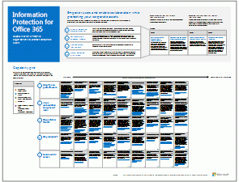

# Microsoft 云 IT 体系结构资源

 **摘要：**了解有关 Microsoft 云服务和平台的信息。查看我们的企业云路线图，探讨云体系结构系列等等。
  
这些体系结构工具和海报提供有关 Microsoft 云服务和平台的信息，其中包括 Office 365、Microsoft Azure、Microsoft Intune、Microsoft Dynamics 365、私有云数据中心以及本地混合和云解决方案。IT 决策者和架构师可以使用这些资源来确定其工作负载的理想解决方案，并做出有关核心基础结构组件的决策，如标识和安全性。
  
- **[Microsoft 企业云路线图](microsoft-cloud-it-architecture-resources.md#roadmap)** (Sway)
    
- **[面向企业架构师的 Microsoft 云系列](microsoft-cloud-it-architecture-resources.md#cloudarch)** 包括[Microsoft 云服务和平台选项](microsoft-cloud-it-architecture-resources.md#platformoptions)[企业级结构设计版的 Microsoft 云标识](microsoft-cloud-it-architecture-resources.md#identity)、[企业级结构设计版的 Microsoft 云安全性](microsoft-cloud-it-architecture-resources.md#security)、[面向企业架构师的 Microsoft 云网络](microsoft-cloud-it-architecture-resources.md#networking)、[面向企业架构师的 Microsoft 移动性和安全性](microsoft-cloud-it-architecture-resources.md#mobility)、[企业级结构设计版的 Microsoft 云存储](microsoft-cloud-it-architecture-resources.md#storage)[面向企业架构师的 Microsoft 混合云](microsoft-cloud-it-architecture-resources.md#hybrid)以及[Microsoft 云中的 Contoso](microsoft-cloud-it-architecture-resources.md#contoso) 海报。
    
- **[Office 365 企业版解决方案系列](microsoft-cloud-it-architecture-resources.md#BKMK_o365solutions)** ，包括[Information Protection for Office 365](microsoft-cloud-it-architecture-resources.md#BKMK_infoprotect)、[Office 365 的标识和设备保护](microsoft-cloud-it-architecture-resources.md#BKMK_O365IDP)、[Office 365 中的文件保护解决方案](microsoft-cloud-it-architecture-resources.md#BKMK_O365fileprotect)、[Office 365 客户端的变更管理](microsoft-cloud-it-architecture-resources.md#changemgmt)以及[通过 Microsoft 部署新式安全桌面](microsoft-cloud-it-architecture-resources.md#msd)。
    
> [!TIP]
> 此页上的大多数海报都有多种语言，包括中文、英语、法语、德语、意大利语、日语、朝鲜语、葡萄牙语、俄语和西班牙语。若要下载其中一种语言的海报，请单击相应海报的 **更多语言**链接。
  
请将你的想法告诉我们！向我们发送电子邮件，地址为 [cloudadopt@microsoft.com](mailto:cloudadopt@microsoft.com)。 
  
## Microsoft 企业云路线图

请参阅海报、图标集、社区场所以及介绍业界最完整的云解决方案的其他资源。
  
|**项目**|**说明**|
|:-----|:-----|
|[          ](https://aka.ms/cloudarchitecture)   [Microsoft 的企业云路线图](https://aka.ms/cloudarchitecture) (https://aka.ms/cloudarchitecture)   |轻扫此 Sway 体验，获取介绍业界最完整的云解决方案的资源。    |
   
## 面向企业架构师的 Microsoft 云系列

这些云体系结构海报提供有关 Microsoft 云服务和平台的信息，其中包括 Office 365、Microsoft Azure、Microsoft Intune、Microsoft Dynamics CRM Online、私有云数据中心以及本地混合和云解决方案。IT 决策者和架构师可以使用这些资源来确定其工作负载的理想解决方案，并做出有关核心基础结构组件的决策，如标识和安全性。
  
### Microsoft 云服务和平台选项

了解 Microsoft 云服务与平台产品/服务之间的关键差异。找到最适合您的解决方案。
  
|**项目**|**说明**|
|:-----|:-----|
|[          ](https://www.microsoft.com/download/details.aspx?id=54432)   [PDF](https://go.microsoft.com/fwlink/p/?LinkId=524731) |[Visio](https://go.microsoft.com/fwlink/p/?LinkId=524732) |[更多语言](https://www.microsoft.com/download/details.aspx?id=54432)   | 此模型描述：    服务型软件 (SaaS) 产品，包括 Office 365    Microsoft Azure 中的平台即服务 (PaaS) 功能    Microsoft Azure 中的服务架构 (IaaS) 功能    使用 Windows Server 和 System Center 的私有云数据中心功能    了解 Microsoft 拥有的 IT 部门如何迁移到这些云服务及构建混合云。   |
   
### 企业级结构设计版的 Microsoft 云标识

IT 架构师需要了解有关为使用 Microsoft 云服务和平台的组织设计标识的哪些知识。
  
|**项目**|**说明**|
|:-----|:-----|
|[          ](https://www.microsoft.com/download/details.aspx?id=54431)   [PDF](https://go.microsoft.com/fwlink/p/?LinkId=524586) |[Visio](https://download.microsoft.com/download/2/3/8/238228E6-9017-4F6C-BD3C-5559E6708F82/MSFT_cloud_architecture_identity.vsd)          [文章](https://technet.microsoft.com/library/mt613459.aspx) |[更多语言](https://www.microsoft.com/download/details.aspx?id=54431)   | 此模型包含：    使用 Azure AD 作为你的身份即服务 (IDaaS) 提供商    Azure AD IDaaS 功能    将本地 Active Directory 域服务帐户与 Microsoft Azure Active Directory 集成    将目录组件放入 Azure    Azure IaaS 中适用于工作负荷的域服务选项    查看文章窗体中的信息：[企业级结构设计版的 Microsoft 云标识](microsoft-cloud-identity-for-enterprise-architects.md)。    |
   
### 企业级结构设计版的 Microsoft 云安全性

IT 架构师需要了解有关 Microsoft 云服务和平台安全性的哪些知识。
  
|**项目**|**说明**|
|:-----|:-----|
|[          ](https://www.microsoft.com/download/details.aspx?id=48121)   [PDF](https://go.microsoft.com/fwlink/p/?linkid=842070) |[Visio](https://go.microsoft.com/fwlink/p/?LinkId=842071) |[更多语言](https://www.microsoft.com/download/details.aspx?id=48121)   | 此模型包含：    Microsoft 在提供安全服务和平台方面的作用    客户在降低安全风险上肩负的责任    顶级安全认证    Microsoft 咨询服务提供的安全产品    学习此体系结构海报宣传的 Microsoft Virtual Academy 课程[启用云的环境中的安全性](https://aka.ms/securecustomermva)。    |
   
### 面向企业架构师的 Microsoft 云网络

IT 架构师需要了解的有关 Microsoft 云服务和平台网络的知识。
  
|**项目**|**说明**|
|:-----|:-----|
|[          ](https://www.microsoft.com/download/details.aspx?id=54425)   [PDF](https://go.microsoft.com/fwlink/p/?linkid=842073) |[Visio](https://go.microsoft.com/fwlink/p/?linkid=842074)          [文章](https://technet.microsoft.com/library/mt733214.aspx) |[更多语言](https://www.microsoft.com/download/details.aspx?id=54425)   | 此模型包含以下页面:   **发展您的云连接网络** 云迁移更改公司网络内部和外部通信量的卷和性质。它还会影响降低安全风险的方法。   **Microsoft 云连接的常见元素** 将您的网络与 Microsoft 云进行集成可提供对范围更为广泛的服务的最佳访问。   **Microsoft 云连接的 ExpressRoute** ExpressRoute 提供了到 Microsoft 云的单独、专用、高吞吐量的网络连接。   **设计适用于 Microsoft SaaS（Office 365、Microsoft Intune 和 Dynamics CRM Online）的网络** 优化您的 Microsoft SaaS 服务网络需要仔细分析 Internet 边缘、您的客户端设备和典型的 IT 运营状况。   **设计适用于 Azure PaaS 的网络** 优化 Azure PaaS 应用程序网络需要有足够的 Internet 带宽，并可以要求网络流量跨多个站点或应用程序分布。   **设计 Azure IaaS 的网络** 逐步调试设计过程以创建最佳的 Azure 虚拟网络 (VNet)，以便托管基于服务器的 IT 负载，包括子网、地址空间、路由、DNS、负载平衡以及本地网络的连接性、其他 VNet 和 Internet。    学习此体系结构海报宣传的新 Microsoft Virtual Academy 课程[让网络更适合 Microsoft 云产品](https://aka.ms/optimizecloudnetworkingmva)。    |
   
### 面向企业架构师的 Microsoft 移动性和安全性

IT 架构师需要了解有关 Microsoft 云服务和平台移动性的哪些知识。
  
|**项目**|**说明**|
|:-----|:-----|
|[          ](https://www.microsoft.com/download/details.aspx?id=55023)   [PDF](https://go.microsoft.com/fwlink/p/?linkid=842076) |[Visio](https://go.microsoft.com/fwlink/p/?linkid=842077) |[更多语言](https://www.microsoft.com/download/details.aspx?id=55023)   | Microsoft 通过用于保护数据和应用程序的管理控件为移动办公效率提供广泛的支持。    用于业务的 Microsoft 移动应用。    用于开发移动应用的平台、服务和资源。    通过移动设备管理对基于云的应用程序和数据的访问权限。    比较 Office 365 MDM、Azure Active Directory Premium 和 Intune 的功能和平台支持。   |
   
### 企业级结构设计版的 Microsoft 云存储

IT 架构师需要了解有关 Microsoft 云服务和平台存储选项的哪些知识。
  
|**项目**|**说明**|
|:-----|:-----|
|[          ](https://www.microsoft.com/download/details.aspx?id=49552)   [PDF](https://go.microsoft.com/fwlink/p/?linkid=842079) |[Visio](https://go.microsoft.com/fwlink/p/?linkid=842080)          [文章](hhttps://technet.microsoft.com/library/mt842597.aspx) |[更多语言](https://www.microsoft.com/download/details.aspx?id=49552)   | 此模型包含：    使用云存储和主要方案的原因。    "移入已准备就绪"云存储选项，与现有服务捆绑在一起，可立即使用，所需配置为最简。    "需要某程序集"存储选项，可以此为起点创建解决方案存储，需要执行其他配置或编码，以实现量身定制。    "从零开始构建"存储选项，包含存储构建基块，可用于从头开始为应用创建用户自己的存储解决方案或存储。   |
   
### 面向企业架构师的 Microsoft 混合云

IT 架构师需要了解的有关适用于 Microsoft 服务和平台的混合云的知识。
  
|**项目**|**说明**|
|:-----|:-----|
|[          ](https://www.microsoft.com/download/details.aspx?id=54424)   [PDF](https://go.microsoft.com/fwlink/p/?linkid=842082) |[Visio](https://go.microsoft.com/fwlink/p/?linkid=842083)          [文章](https://technet.microsoft.com/library/mt750500.aspx) |[更多语言](https://www.microsoft.com/download/details.aspx?id=54424)   | 此模型包含以下页面:   **混合云概述** Microsoft 的云产品（SaaS、Azure PaaS 和 Azure IaaS）及它们的常用元素。   **Microsoft 混合云方案体系结构** 适用于 Microsoft 云产品的混合云体系结构图，显示内部部署基础结构、网络和标识的公用层。   **适用于 Microsoft SaaS (Office 365) 的混合云方案** 适用于 Skype for Business、SharePoint Server 和 Exchange Server 的 SaaS 混合方案体系结构和关键混合配置说明。   **适用于 Azure PaaS 的混合云方案** Azure PaaS 混合方案体系结构、Azure PaaS 混合应用程序说明（包含示例）以及 SQL Server 2016 Stretch Database 说明。   **适用于 Azure IaaS 的混合云方案** Azure IaaS 混合方案体系结构和托管在 Azure IaaS 中的业务线 (LOB) 应用程序的说明。   |
   
### Microsoft 云中的 Contoso

虚构但具有代表性的全局组织如何实现 Microsoft 的云服务，包括 Office 365、Azure、Dynamics 365 和 Intune。
  
|**项目**|**说明**|
|:-----|:-----|
|[          ](https://www.microsoft.com/download/details.aspx?id=54427)   [PDF](https://go.microsoft.com/fwlink/p/?linkid=842085) |[Visio](https://go.microsoft.com/fwlink/p/?linkid=842086)          [文章](https://technet.microsoft.com/library/mt775341.aspx) |[更多语言](https://www.microsoft.com/download/details.aspx?id=54427)   |了解总部位于巴黎的全球制造业巨头 Contoso 公司如何实施包含云的 IT 基础结构并制定有关网络、身份以及安全性的主要设计决策。    |
   
### 圣诞云

圣诞老人和他的小精灵们如何使用 Microsoft 云产品来进行一年一度的圣诞礼物派送。
  
|**项**|**说明**|
|:-----|:-----|
|[          ](https://www.microsoft.com/download/details.aspx?id=55039)   [PDF](https://go.microsoft.com/fwlink/p/?linkid=842088)   |圣诞老人和他的小精灵们（即 IT 部门）使用 Office 365、Azure、Dynamics 365 和 Intune 来确定谁最淘气谁最可爱，以及要在 12 月 24 日派送的礼物。    |
   
## Office 365 企业版解决方案系列

Office 365 企业版解决方案系列提供实现 Office 365 功能的指导，尤其是其中一些跨技术的功能。
  
### Information Protection for Office 365

企业组织用于保护企业资产的功能。
  
|**项目**|**说明**|
|:-----|:-----|
|[          ](https://www.microsoft.com/download/details.aspx?id=54429)   [PDF](http://download.microsoft.com/download/2/3/D/23D91386-8349-4F7A-9470-FD5AED861F16/MSFT_cloud_architecture_informationprotection.pdf) |[Visio](http://download.microsoft.com/download/2/3/D/23D91386-8349-4F7A-9470-FD5AED861F16/MSFT_cloud_architecture_informationprotection.vsd) |[更多语言](https://www.microsoft.com/download/details.aspx?id=54429)   |Microsoft 提供最完整的功能集以保护您的企业资产。此模型帮助组织采用有条不紊的方法来计划要实现的功能。    |
   
### Office 365 的标识和设备保护

用于保护访问 Office 365 设备、其他 SaaS 服务以及使用 Azure AD 应用程序代理发布的本地应用程序的标识和设备的推荐功能。
  
|**项目**|**说明**|
|:-----|:-----|
|[          ](https://www.microsoft.com/download/details.aspx?id=55032)   [PDF](https://go.microsoft.com/fwlink/p/?linkid=841656) |[Visio](https://go.microsoft.com/fwlink/p/?linkid=841657) |[更多语言](https://www.microsoft.com/download/details.aspx?id=55032)   |请务必在数据、标识和设备中使用一致的保护级别。本文档介绍可与保护标识和设备功能相媲美的功能的详细信息。    |
   
### Office 365 中的文件保护解决方案

在 Office 365 中基于三种不同的敏感度级别来保护文件的推荐功能。
  
|**项目**|**说明**|
|:-----|:-----|
|[          ](https://www.microsoft.com/download/details.aspx?id=55523)   [PDF](http://download.microsoft.com/download/7/8/9/789645A5-BD10-4541-BC33-F8D1EFF5E911/MSFT_cloud_architecture_O365 file protection.pdf) |[Visio](http://download.microsoft.com/download/7/8/9/789645A5-BD10-4541-BC33-F8D1EFF5E911/MSFT_cloud_architecture_O365%20file%20protection.vsdx)   |请务必在数据、标识和设备中使用一致的保护级别。本文档介绍可与保护 Office 365 中的文件功能相媲美的功能的详细信息。    |
   
### Office 365 客户端的变更管理

IT 架构师需要了解的有关管理 Office 365 客户端应用程序和 Windows 10 分支版本的知识。 
  
|**项目**|**说明**|
|:-----|:-----|
|[          ](https://www.microsoft.com/download/details.aspx?id=49141)   [PDF](https://go.microsoft.com/fwlink/p/?LinkId=626681) |[Visio](https://go.microsoft.com/fwlink/p/?LinkId=626680)          [文章](https://technet.microsoft.com/library/mt584223.aspx) |[更多语言](https://www.microsoft.com/download/details.aspx?id=49141)   | Windows 10 和 Office 365 客户端应用程序的服务模型    版本选项    Cadences 版本    更改类型    角色和责任    管理更新部署    查看文章窗体中的信息：[Change management for Office 365 clients](http://technet.microsoft.com/library/815fa1aa-0355-40b5-b7bc-cdf7d4610062.aspx)。    |
   
### 通过 Microsoft 部署新式安全桌面

在 Windows 10 上部署和管理 Office 365 专业增强版的更新时，IT 架构师需要了解的信息。
  
|**项目**|**说明**|
|:-----|:-----|
|[          ](https://www.microsoft.com/download/details.aspx?id=55987)   [PDF](http://download.microsoft.com/download/4/E/9/4E90E227-770A-41D1-99FE-925A64D81A55/MSFT_modern_secure_desktop.pdf) |[Visio](http://download.microsoft.com/download/4/E/9/4E90E227-770A-41D1-99FE-925A64D81A55/MSFT_modern_secure_desktop.vsdx)   | 此模型包含：    从 Microsoft 云部署 Windows 10 和 Office 专业增强版    使用 System Center Configuration Manager 部署 Windows 10 和 Office 365 专业增强版    从 Microsoft 云管理 Windows 10 和 Office 专业增强版的更新    使用 System Center Configuration Manager 管理 Windows 10 和 Office 365 专业增强版的更新    Windows 10 现成的其他保护功能   |
   