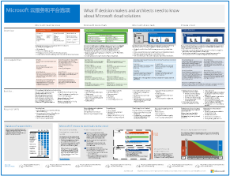
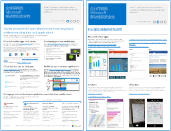
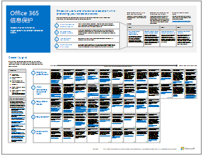
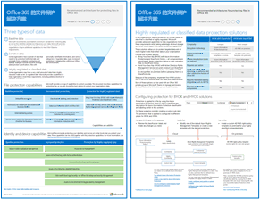
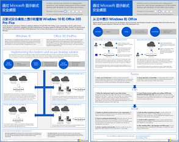

# Microsoft 云 IT 体系结构资源

 **摘要：** 了解 Microsoft 云服务和平台。查看我们的企业云路线图，探索云体系结构系列等。
  
这些体系结构工具和海报为你提供了有关 Microsoft 云服务和平台的信息，包括 Office 365、Microsoft Azure、Microsoft Intune、Microsoft Dynamics 365、私有云数据中心，以及混合本地和云的解决方案。IT 决策者和架构师可以使用这些资源，以确定工作负载的理想解决方案并做出有关标识和安全等核心基础结构组件的决策。 
  
- **[Microsoft 企业云路线图](microsoft-cloud-it-architecture-resources.md#roadmap)** (Sway)
    
- **[面向企业架构师的 Microsoft 云系列](microsoft-cloud-it-architecture-resources.md#cloudarch)** 
    - [Microsoft 云服务和平台选项](microsoft-cloud-it-architecture-resources.md#platformoptions)
    - [面向企业架构师的 Microsoft 云标识](microsoft-cloud-it-architecture-resources.md#identity)
    - [面向企业架构师的 Microsoft 云安全性](microsoft-cloud-it-architecture-resources.md#security)
    - [面向企业架构师的 Microsoft 云网络](microsoft-cloud-it-architecture-resources.md#networking)
    - [面向企业架构师的 Microsoft 移动性和安全性](microsoft-cloud-it-architecture-resources.md#mobility)
    - [面向企业架构师的 Microsoft 云存储](microsoft-cloud-it-architecture-resources.md#storage)
    - [面向企业架构师的 Microsoft 混合云](microsoft-cloud-it-architecture-resources.md#hybrid)
    - [Microsoft 云中的 Contoso](microsoft-cloud-it-architecture-resources.md#contoso)
    - [常见攻击和保护组织的 Microsoft 功能](#common-attacks-and-microsoft-capabilities-that-protect-your-organization)
    
- **[Office 365 企业版解决方案系列](microsoft-cloud-it-architecture-resources.md#BKMK_o365solutions)**：
    - [Office 365 信息保护](microsoft-cloud-it-architecture-resources.md#BKMK_infoprotect)
    - [Office 365 的标识和设备保护](microsoft-cloud-it-architecture-resources.md#BKMK_O365IDP)
    - [Office 365 中的文件保护解决方案](microsoft-cloud-it-architecture-resources.md#BKMK_O365fileprotect)
    - [Office 365 客户端的变更管理](microsoft-cloud-it-architecture-resources.md#changemgmt)
    - [通过 Microsoft 部署新式安全桌面](microsoft-cloud-it-architecture-resources.md#msd)
    
> [!TIP]
> 此页上的大多数海报都有多种语言，包括中文、英语、法语、德语、意大利语、日语、朝鲜语、葡萄牙语、俄语和西班牙语。若要下载其中一种语言的海报，请单击相应海报的**更多语言**链接。
  
请将想法告诉我们！向我们 ([cloudadopt@microsoft.com](mailto:cloudadopt@microsoft.com)) 发送电子邮件。 
  

## Microsoft 企业云路线图

请参阅海报、图标集、社区以及介绍业界最完整云解决方案的其他资源。
  
|**项**|**说明**|
|:-----|:-----|
|[          ](https://aka.ms/cloudarchitecture)   [Microsoft 企业云路线图](https://aka.ms/cloudarchitecture) (https://aka.ms/cloudarchitecture)   |逐一浏览此 Sway 体验，获取介绍业界最完整云解决方案的资源。    |
   

## 面向企业架构师的 Microsoft 云系列

这些云体系结构海报介绍了 Microsoft 云服务和平台，包括 Office 365、Microsoft Azure、Microsoft Intune、Microsoft Dynamics CRM Online、私有云数据中心，以及混合本地和云解决方案。IT 决策者和架构师可以使用这些资源，以确定最适合工作负载的解决方案，并就核心基础结构组件（如标识和安全性等）做出决策。
  

### Microsoft 云服务和平台选项

了解 Microsoft 云服务和平台产品/服务的关键区别。确定最适合解决方案的选项。
  
|**项**|**说明**|
|:-----|:-----|
|[          ](https://www.microsoft.com/download/details.aspx?id=54432)   [PDF](https://go.microsoft.com/fwlink/p/?LinkId=524731)  \| [Visio](https://go.microsoft.com/fwlink/p/?LinkId=524732)  \| [更多语言](https://www.microsoft.com/download/details.aspx?id=54432)   | 此模型描述： <ul><li>  服务型软件 (SaaS) 产品/服务，包括 Office 365 </li><li>  Microsoft Azure 中的平台即服务 (PaaS) 功能 </li><li>  Microsoft Azure 中的服务架构 (IaaS) 功能 </li><li>  使用 Windows Server 和 System Center 的私有云数据中心功能 </li><li>  了解 Microsoft 拥有的 IT 部门如何迁移到这些云服务并生成混合云。 </li></ul> |
   

### 面向企业架构师的 Microsoft 云标识

关于使用 Microsoft 云服务和平台为组织设计标识，IT 架构师需要了解的信息。
  
|**项**|**说明**|
|:-----|:-----|
|[          ](https://www.microsoft.com/download/details.aspx?id=54431)   [PDF](https://go.microsoft.com/fwlink/p/?LinkId=524586)  \| [Visio](https://download.microsoft.com/download/2/3/8/238228E6-9017-4F6C-BD3C-5559E6708F82/MSFT_cloud_architecture_identity.vsd)           \| [更多语言](https://www.microsoft.com/download/details.aspx?id=54431)   | 此模型包含： <ul><li>Microsoft 云标识简介 </li> <li>Azure AD IDaaS 功能 </li><li>将本地 Active Directory 域服务帐户与 Microsoft Azure Active Directory 集成 </li> <li>将目录组件放入 Azure </li><li>Azure IaaS 中适用于工作负载的域服务选项 </li></ul>  |
   

### 面向企业架构师的 Microsoft 云安全性

关于 Microsoft 云服务和平台的安全性，IT 架构师需要了解的信息。
  
|**项**|**说明**|
|:-----|:-----|
|[          ](https://www.microsoft.com/download/details.aspx?id=48121)   [PDF](https://go.microsoft.com/fwlink/p/?linkid=842070)  \| [Visio](https://go.microsoft.com/fwlink/p/?LinkId=842071)  \| [更多语言](https://www.microsoft.com/download/details.aspx?id=48121)   | 此模型包含： <ul><li>Microsoft 在提供安全服务和平台方面的作用</li><li>客户在降低安全风险上肩负的责任</li><li>顶级安全认证 </li><li>Microsoft 咨询服务提供的安全产品/服务 </ul></li>学习此体系结构海报宣传的 Microsoft Virtual Academy 课程：[云启用环境中的安全性](https://mva.microsoft.com/training-courses/security-in-a-cloudenabled-world-12725?l=CfLHobAcB_3904300474)。  |
   

### 面向企业架构师的 Microsoft 云网络

关于 Microsoft 云服务和平台的网络，IT 架构师需要了解的信息。
  
|**项**|**说明**|
|:-----|:-----|
|[          ](https://www.microsoft.com/download/details.aspx?id=54425)   [PDF](https://go.microsoft.com/fwlink/p/?linkid=842073)  \| [Visio](https://go.microsoft.com/fwlink/p/?linkid=842074)           \| [文章](https://technet.microsoft.com/library/mt733214.aspx)  [更多语言](https://www.microsoft.com/download/details.aspx?id=54425)   | 此模型包含以下页面： <ul><li> **发展云连接网络**：云迁移更改了公司网络内外通信的流量和性质。它还影响了降低安全风险的方法。</li><li> **Microsoft 云连接的常见元素**：将网络与 Microsoft 云进行集成可提供对广泛服务的最佳访问。 </li><li> **Microsoft 云连接的 ExpressRoute**：ExpressRoute 可用于与 Microsoft 云建立私有、专用、高吞吐量的网络连接。 </li><li> **设计 Microsoft SaaS（Office 365、Microsoft Intune 和 Dynamics CRM Online）网络**：优化 Microsoft SaaS 服务网络需要仔细分析 Internet 边缘、客户端设备和典型 IT 运营状况。 </li><li> **设计 Azure PaaS 网络**：优化 Azure PaaS 应用网络需要有足够的 Internet 带宽，并可以要求网络流量跨多个网站或应用分布。 </li><li> **设计 Azure IaaS 网络**：逐步调试设计流程，以创建最佳的 Azure 虚拟网络 (VNet)，以便托管基于服务器的 IT 工作负载，包括子网、地址空间、路由、DNS、负载均衡、本地网络连接性、其他 VNet 和 Internet。 </li></ul>   学习此体系结构海报宣传的新 Microsoft Virtual Academy 课程：[让网络更适合 Microsoft 云产品/服务](https://aka.ms/optimizecloudnetworkingmva)。   |
   

### 面向企业架构师的 Microsoft 移动性和安全性

关于 Microsoft 云服务和平台的移动性，IT 架构师需要了解的信息。
  
|**项**|**说明**|
|:-----|:-----|
|[          ](https://www.microsoft.com/download/details.aspx?id=55023)   [PDF](https://go.microsoft.com/fwlink/p/?linkid=842076)  \| [Visio](https://go.microsoft.com/fwlink/p/?linkid=842077)  \| [更多语言](https://www.microsoft.com/download/details.aspx?id=55023)   | 此模型包含： <ul><li>热门商业移动应用。 </li><li>用于开发移动应用的平台、服务和资源 </li><li>通过移动设备管理对基于云的应用和数据的访问权限 </li><li>比较 Office 365 MDM、Azure Active Directory Premium 和 Intune 的功能和平台支持 </li></ul>  |
   

### 面向企业架构师的 Microsoft 云存储

关于 Microsoft 云服务和平台的存储选项，IT 架构师需要了解的信息。
  
|**项**|**说明**|
|:-----|:-----|
|[          ](https://www.microsoft.com/download/details.aspx?id=49552)   [PDF](https://go.microsoft.com/fwlink/p/?linkid=842079)  \| [Visio](https://go.microsoft.com/fwlink/p/?linkid=842080)           \| [文章](hhttps://technet.microsoft.com/library/mt842597.aspx)  [更多语言](https://www.microsoft.com/download/details.aspx?id=49552)   | 此模型包含： <ul><li>使用云存储和主要方案的原因 </li><li>与现有服务捆绑的云存储选项 </li><li>可用作存储解决方案入门点的存储选项 </li><li>用于为应用创建用户自己的存储解决方案或存储的存储构建基块</li></ul> |
   

### 面向企业架构师的 Microsoft 混合云

关于 Microsoft 服务和平台的混合云，IT 架构师需要了解的信息。
  
|**项**|**说明**|
|:-----|:-----|
|[          ](https://www.microsoft.com/download/details.aspx?id=54424)   [PDF](https://go.microsoft.com/fwlink/p/?linkid=842082)  \| [Visio](https://go.microsoft.com/fwlink/p/?linkid=842083)           \| [文章](https://technet.microsoft.com/library/mt750500.aspx)  [更多语言](https://www.microsoft.com/download/details.aspx?id=54424)   | 此模型包含以下页面： <ul><li> **混合云概述**：Microsoft 云产品/服务（SaaS、Azure PaaS 和 Azure IaaS）及其常见元素。 </li><li> **Microsoft 混合云方案体系结构**：Microsoft 云产品/服务的混合云体系结构图，显示本地基础结构、网络和标识的公用层。 </li><li> **Microsoft SaaS (Office 365) 混合云方案**：Skype for Business、SharePoint Server 和 Exchange Server 的 SaaS 混合方案体系结构和关键混合配置说明。 </li><li> **Azure PaaS 混合云方案**：Azure PaaS 混合方案体系结构、Azure PaaS 混合应用说明（包含示例）以及 SQL Server 2016 Stretch Database 说明。 </li><li> **Azure IaaS 混合云方案**：Azure IaaS 混合方案体系结构和托管在 Azure IaaS 中的业务线 (LOB) 应用的说明。 </li></ul> |
   

### Microsoft 云中的 Contoso

虚构但具有代表性的全局组织如何实现 Microsoft 的云产品/服务，包括 Office 365、Azure、Dynamics 365 和 Intune。
  
|**项**|**说明**|
|:-----|:-----|
|[          ](https://www.microsoft.com/download/details.aspx?id=54427)   [PDF](https://go.microsoft.com/fwlink/p/?linkid=842085)  \| [Visio](https://go.microsoft.com/fwlink/p/?linkid=842086)           \| [文章](https://technet.microsoft.com/library/mt775341.aspx)  [更多语言](https://www.microsoft.com/download/details.aspx?id=54427)   |此模型包含： <ul><li>Contoso Corporation 概述 </li><li>Contoso 的 IT 基础结构和需求 </li><li>Contoso 的云网络</li><li>Contoso 的云标识</li><li>Contoso 的订阅、许可证和用户帐户</li><li>Contoso 的云安全性</li><li>Contoso 的企业云方案</li></ul>  |
   

### 常见攻击和保护组织的 Microsoft 功能
了解最常见的网络攻击以及 Microsoft 在攻击的每个阶段如何帮助组织。 

|**项**|**说明**|
|:-----|:-----|
|   [PDF](http://download.microsoft.com/download/F/A/C/FACFC1E9-FA35-4DF1-943C-8D4237B4275B/MSFT_Cloud_architecture_security_commonattacks.pdf) \| [Visio](http://download.microsoft.com/download/F/A/C/FACFC1E9-FA35-4DF1-943C-8D4237B4275B/MSFT_Cloud_architecture_security_commonattacks.vsdx)   | 该海报展示了常见攻击的路径，并说明了哪些功能有助于在攻击的每个阶段阻止攻击者。  |

### 圣诞云

圣诞老人和他的小精灵们如何使用 Microsoft 云产品/服务进行一年一度的圣诞礼物派送。
  
|**项**|**说明**|
|:-----|:-----|
|[          ](https://www.microsoft.com/download/details.aspx?id=55039)   [PDF](https://go.microsoft.com/fwlink/p/?linkid=842088)   |圣诞老人和他的小精灵们（即 IT 部门）使用 Office 365、Azure、Dynamics 365 和 Intune 来确定谁最淘气谁最可爱，以及要在 12 月 24 日派送的礼物。   |
   

## Office 365 企业版解决方案系列

Office 365 企业版解决方案系列介绍了如何实现 Office 365 功能，尤其是其中一些跨技术的功能。
  

### Office 365 信息保护

企业组织用于保护企业资产的功能。
  
|**项**|**说明**|
|:-----|:-----|
|[          ](https://www.microsoft.com/download/details.aspx?id=54429)   [PDF](http://download.microsoft.com/download/2/3/D/23D91386-8349-4F7A-9470-FD5AED861F16/MSFT_cloud_architecture_informationprotection.pdf)  \| [Visio](http://download.microsoft.com/download/2/3/D/23D91386-8349-4F7A-9470-FD5AED861F16/MSFT_cloud_architecture_informationprotection.vsd)  \| [更多语言](https://www.microsoft.com/download/details.aspx?id=54429)   |Microsoft 提供最完整的功能集以保护您的企业资产。此模型帮助组织采用有条不紊的方法来计划要实现的功能。   |
   

### Office 365 的标识和设备保护

用于保护访问 Office 365 设备、其他 SaaS 服务以及使用 Azure AD 应用代理发布的本地应用的标识和设备的推荐功能。
  
|**项**|**说明**|
|:-----|:-----|
|[          ](https://www.microsoft.com/download/details.aspx?id=55032)   [PDF](https://go.microsoft.com/fwlink/p/?linkid=841656)  \| [Visio](https://go.microsoft.com/fwlink/p/?linkid=841657)  \| [更多语言](https://www.microsoft.com/download/details.aspx?id=55032)   |请务必在数据、标识和设备中使用一致的保护级别。本文档介绍可与保护标识和设备功能相媲美的功能的详细信息。    |
   

### Office 365 中的文件保护解决方案

在 Office 365 中基于三种不同的敏感度级别来保护文件的推荐功能。
  
|**项**|**说明**|
|:-----|:-----|
|[          ](https://www.microsoft.com/download/details.aspx?id=55523)   [PDF](https://go.microsoft.com/fwlink/?linkid=2004320)  \| [Visio](http://download.microsoft.com/download/7/8/9/789645A5-BD10-4541-BC33-F8D1EFF5E911/MSFT_cloud_architecture_O365%20file%20protection.vsdx)   |请务必在数据、标识和设备中使用一致的保护级别。本文档介绍可与保护 Office 365 中的文件功能相媲美的功能的详细信息。    |
   

### Office 365 客户端的变更管理

关于管理 Office 365 客户端应用和 Windows 10 版本，IT 架构师需要了解的信息。 
  
|**项**|**说明**|
|:-----|:-----|
|[          ](https://www.microsoft.com/download/details.aspx?id=49141)   [PDF](https://go.microsoft.com/fwlink/p/?LinkId=626681)  \| [Visio](https://go.microsoft.com/fwlink/p/?LinkId=626680)           \| [文章](https://technet.microsoft.com/library/mt584223.aspx)  [更多语言](https://www.microsoft.com/download/details.aspx?id=49141)   | 此模型包含： <ul><li>Windows 10 和 Office 365 客户端应用的服务模型 </li><li>  发布选项 </li><li>  Cadences 版本 </li><li>  更改类型 </li><li>  角色和责任 </li><li>  管理更新部署 </li></ul>   请查看文章表单中的信息：[Office 365 客户端的变更管理](http://technet.microsoft.com/library/815fa1aa-0355-40b5-b7bc-cdf7d4610062.aspx)。    |
   

### 通过 Microsoft 部署新式安全桌面

关于在 Windows 10 上部署和管理 Office 365 专业增强版更新，IT 架构师需要了解的信息。
  
|**项**|**说明**|
|:-----|:-----|
|[          ](https://www.microsoft.com/download/details.aspx?id=55987)   [PDF](http://download.microsoft.com/download/4/E/9/4E90E227-770A-41D1-99FE-925A64D81A55/MSFT_modern_secure_desktop.pdf)  \| [Visio](http://download.microsoft.com/download/4/E/9/4E90E227-770A-41D1-99FE-925A64D81A55/MSFT_modern_secure_desktop.vsdx)   | 此模型包含： <ul><li>  从 Microsoft 云部署 Windows 10 和 Office 专业增强版 </li><li>  使用 System Center Configuration Manager 部署 Windows 10 和 Office 365 专业增强版 </li><li>  从 Microsoft 云管理 Windows 10 和 Office 专业增强版的更新 </li><li>  使用 System Center Configuration Manager 管理 Windows 10 和 Office 365 专业增强版的更新 </li><li>  Windows 10 现成的其他保护功能 </li></ul>  |
   
## 另请参阅

[SharePoint、Exchange、Skype for Business 和 Lync 的体系结构模型](architectural-models-for-sharepoint-exchange-skype-for-business-and-lync.md)
  
[云采用测试实验室指南 (TLG)](cloud-adoption-test-lab-guides-tlgs.md)
  
[安全解决方案](security-solutions.md)
  
[混合解决方案](hybrid-solutions.md)

