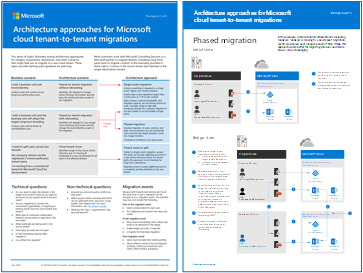

# Microsoft 云 IT 体系结构资源Microsoft cloud IT architecture resources

这些体系结构工具和发布者可为您提供有关 Microsoft 云服务的信息，包括 Microsoft 365、Windows 10、Azure Active Directory、Microsoft Intune、Microsoft Dynamics 365 以及混合本地和云解决方案。These architecture tools and posters give you information about Microsoft cloud services, including Microsoft 365, Windows 10, Azure Active Directory, Microsoft Intune, Microsoft Dynamics 365, and hybrid on-premises and cloud solutions. IT 决策者和架构师可以使用这些资源来确定工作负载的理想解决方案，并做出有关标识和安全等核心基础结构组件的决策。IT decision makers and architects can use these resources to determine the ideal solutions for their workloads and to make decisions about core infrastructure components such as identity and security. 
  
<!--**[Microsoft's Enterprise Cloud Roadmap](microsoft-cloud-it-architecture-resources.md#roadmap)** (Sway) -->
    
- **[面向企业架构师的 Microsoft 云系列](microsoft-cloud-it-architecture-resources.md#cloudarch)** 
    **[Microsoft cloud for enterprise architects series](microsoft-cloud-it-architecture-resources.md#cloudarch)** 
  <!-- [Microsoft Cloud Services and Platform Options](microsoft-cloud-it-architecture-resources.md#platformoptions) -->
    - [面向企业架构师的 Microsoft 云标识Microsoft cloud identity for enterprise architects](microsoft-cloud-it-architecture-resources.md#identity)
    - [面向企业架构师的 Microsoft 云安全性Microsoft cloud security for enterprise architects](microsoft-cloud-it-architecture-resources.md#security)
    - [面向企业架构师的 Microsoft 云网络Microsoft cloud networking for enterprise architects](microsoft-cloud-it-architecture-resources.md#networking)
    - [面向企业架构师的 Microsoft 混合云Microsoft hybrid cloud for enterprise architects](microsoft-cloud-it-architecture-resources.md#hybrid)
    - [常见攻击和保护组织的 Microsoft 功能Common attacks and Microsoft capabilities that protect your organization](#common-attacks-and-microsoft-capabilities-that-protect-your-organization)
    - [Microsoft 365 企业版底层基础结构Microsoft 365 Enterprise Foundation Infrastructure](#m365foundationinfra)
    - [Microsoft 云租户到租户迁移的体系结构方法Architecture approaches for Microsoft cloud tenant-to-tenant migrations](#architecture-approaches-for-microsoft-cloud-tenant-to-tenant-migrations)
    
- **[Microsoft 365 企业版解决方案系列](microsoft-cloud-it-architecture-resources.md#BKMK_o365solutions)**：**[Microsoft 365 enterprise solution series](microsoft-cloud-it-architecture-resources.md#BKMK_o365solutions)**:
    - [面向 IT 架构师的 Microsoft 365 中的 Microsoft Teams 和相关生产力服务Microsoft Teams and related productivity services in Microsoft 365 for IT architects](#microsoft-teams-and-related-productivity-services-in-microsoft-365-for-it-architects)
    - [面向 IT 架构师的 Microsoft 365 中的组Groups in Microsoft 365 for IT architects](#groups-in-microsoft-365-for-it-architects)
    - [多区域组织安全和信息保护Security and Information Protection for Multi-Region Organizations](#security-and-information-protection-for-multi-region-organizations)
    - [Office 365 的标识和设备保护Identity and device protection for Office 365](microsoft-cloud-it-architecture-resources.md#BKMK_O365IDP)
    - [Office 365 中的文件保护解决方案File protection solutions in Office 365](microsoft-cloud-it-architecture-resources.md#BKMK_O365fileprotect)
    - [符合 GDPR 的 Office 365 信息保护Office 365 Information Protection for GDPR](#office-365-information-protection-for-gdpr)
    - [Microsoft 针对政治宣传活动、非营利组织和其他敏捷性组织的安全指南Microsoft Security Guidance for Political Campaigns, Nonprofits, and Other Agile Organizations](#microsoft-security-guidance-for-political-campaigns-nonprofits-and-other-agile-organizations)
    - [Microsoft 电话解决方案Microsoft Telephony Solutions](#microsoft-telephony-solutions) 
    
请将你的想法告诉我们！向我们 ([cloudadopt@microsoft.com](mailto:cloudadopt@microsoft.com)) 发送电子邮件。Let us know what you think! Send us email at [cloudadopt@microsoft.com](mailto:cloudadopt@microsoft.com). 

<!--

## Microsoft's Enterprise Cloud Roadmap

See the posters, icon sets, community venues, and other resources that describe the industry's most complete cloud solution.
  
|**Item**|**Description**|
|:-----|:-----|
|[          ](https://aka.ms/cloudarchitecture)   [Microsoft's Enterprise Cloud Roadmap](https://aka.ms/cloudarchitecture) (https://aka.ms/cloudarchitecture)   |Swipe through this Sway experience for the resources that describe the industry's most complete cloud solution.    |
-->
  

##面向企业架构师的 Microsoft 云系列## Microsoft cloud for enterprise architects series

这些云体系结构海报介绍了 Microsoft 云服务，包括 Microsoft 365、Azure Active Directory、Microsoft Intune、Microsoft Dynamics CRM Online 以及混合本地和云解决方案。These cloud architecture posters give you information about Microsoft cloud services, including Microsoft 365, Azure Active Directory, Microsoft Intune, Microsoft Dynamics CRM Online, and hybrid on-premises and cloud solutions. IT 决策者和架构师可以使用这些资源来确定工作负载的理想解决方案，并做出有关标识和安全等核心基础结构组件的决策。IT decision makers and architects can use these resources to determine the ideal solutions for their workloads and to make decisions about core infrastructure components such as identity and security.

<!--  

### Microsoft Cloud Services and Platform Options

Learn key differences between Microsoft cloud services and platform offerings. Find the best fit for your solution.
  
|**Item**|**Description**|
|:-----|:-----|
|[          ](https://www.microsoft.com/download/details.aspx?id=54432)   [PDF](https://go.microsoft.com/fwlink/p/?LinkId=524731)  \| [Visio](https://go.microsoft.com/fwlink/p/?LinkId=524732)  \| [More languages](https://www.microsoft.com/download/details.aspx?id=54432)   | This model describes: <ul><li>  Software as a Service (SaaS) offerings, including Microsoft 365 </li><li>  Platform as a Service (PaaS) features in Microsoft Azure </li><li>  Infrastructure as a Service (IaaS) features in Microsoft Azure </li><li>  Private cloud datacenter capabilities using Windows Server and System Center </li><li>  Learn how Microsoft's own IT department is migrating to these cloud services and building its hybrid cloud. </li></ul> |
-->

   

###面向企业架构师的 Microsoft 云标识### Microsoft cloud identity for enterprise architects

关于使用 Microsoft 云服务和平台为组织设计标识，IT 架构师需要了解的信息。What IT architects need to know about designing identity for organizations using Microsoft cloud services and platforms.
  
|**项****Item**|**说明****Description**|
|:-----|:-----|
|[          ](https://www.microsoft.com/download/details.aspx?id=54431)[          ](https://www.microsoft.com/download/details.aspx?id=54431)   [PDF](https://go.microsoft.com/fwlink/p/?LinkId=524586)  \| [Visio](https://download.microsoft.com/download/2/3/8/238228E6-9017-4F6C-BD3C-5559E6708F82/MSFT_cloud_architecture_identity.vsd)           \| [更多语言](https://www.microsoft.com/download/details.aspx?id=54431)[PDF](https://go.microsoft.com/fwlink/p/?LinkId=524586)  \| [Visio](https://download.microsoft.com/download/2/3/8/238228E6-9017-4F6C-BD3C-5559E6708F82/MSFT_cloud_architecture_identity.vsd)           \| [More languages](https://www.microsoft.com/download/details.aspx?id=54431)   | 此模型包含：This model contains: <ul><li>Microsoft 云标识简介Introduction to identity with Microsoft's cloud </li><li>Azure AD IDaaS 功能Azure AD IDaaS capabilities </li><li>将本地 Active Directory 域服务帐户与 Microsoft Azure Active Directory 集成Integrating on-premises Active Directory Domain Services accounts with Microsoft Azure Active Directory </li><li>将目录组件放入 AzurePutting directory components in Azure </li><li>Azure IaaS 中适用于工作负载的域服务选项Domain services options for workloads in Azure IaaS </li></ul> |
   

### 面向企业架构师的 Microsoft 云安全性Microsoft cloud security for enterprise architects

关于 Microsoft 云服务和平台的安全性，IT 架构师需要了解的信息。What IT architects need to know about security in Microsoft cloud services and platforms.
  
|**项****Item**|**说明****Description**|
|:-----|:-----|
|[          ](https://www.microsoft.com/download/details.aspx?id=48121)[          ](https://www.microsoft.com/download/details.aspx?id=48121)   [PDF](https://go.microsoft.com/fwlink/p/?linkid=842070)  \| [Visio](https://go.microsoft.com/fwlink/p/?LinkId=842071)  \| [更多语言](https://www.microsoft.com/download/details.aspx?id=48121)[PDF](https://go.microsoft.com/fwlink/p/?linkid=842070)  \| [Visio](https://go.microsoft.com/fwlink/p/?LinkId=842071)  \| [More languages](https://www.microsoft.com/download/details.aspx?id=48121)   | 此模型包含：This model contains: <ul><li>Microsoft 在提供安全服务和平台方面的作用Microsoft's role in providing secure services and platforms</li><li>客户在降低安全风险上肩负的责任Customer responsibilities to mitigate security risks</li><li>顶级安全认证Top security certifications </li><li>Microsoft 咨询服务提供的安全产品/服务Security offerings provided by Microsoft consulting services </ul> |
   

### 面向企业架构师的 Microsoft 云网络Microsoft cloud networking for enterprise architects

关于 Microsoft 云服务和平台的网络，IT 架构师需要了解的信息。What IT architects need to know about networking for Microsoft cloud services and platforms.
  
|**项****Item**|**说明****Description**|
|:-----|:-----|
|   [PDF](downloads/MSFT_cloud_architecture_networking.pdf)  \| [Visio](https://github.com/MicrosoftDocs/OfficeDocs-Enterprise/raw/live/Enterprise/downloads/MSFT_cloud_architecture_networking.vsdx)[PDF](downloads/MSFT_cloud_architecture_networking.pdf)  \| [Visio](https://github.com/MicrosoftDocs/OfficeDocs-Enterprise/raw/live/Enterprise/downloads/MSFT_cloud_architecture_networking.vsdx)   | 此模型包含：This model contains: <ul><li> 发展你的云连接网络Evolving your network for cloud connectivity </li><li> Microsoft 云连接的常见元素Common elements of Microsoft cloud connectivity </li><li> 面向 Microsoft 云连接的 ExpressRouteExpressRoute for Microsoft cloud connectivity </li><li> 为 Microsoft SaaS、Azure PaaS 和 Azure IaaS 设计网络Designing networking for Microsoft SaaS, Azure PaaS, and  Azure IaaS </li></ul>    |

### 面向企业架构师的 Microsoft 混合云Microsoft hybrid cloud for enterprise architects

关于 Microsoft 服务和平台的混合云，IT 架构师需要了解的信息。What IT architects need to know about hybrid cloud for Microsoft services and platforms.
  
|**项****Item**|**说明****Description**|
|:-----|:-----|
|   [PDF](downloads/MSFT_cloud_architecture_hybrid.pdf)  \| [Visio](https://github.com/MicrosoftDocs/OfficeDocs-Enterprise/raw/live/Enterprise/downloads/MSFT_cloud_architecture_hybrid.vsdx)[PDF](downloads/MSFT_cloud_architecture_hybrid.pdf)  \| [Visio](https://github.com/MicrosoftDocs/OfficeDocs-Enterprise/raw/live/Enterprise/downloads/MSFT_cloud_architecture_hybrid.vsdx)  | 此模型包含：This model contains: <ul><li> Microsoft 的云产品（SaaS、Azure PaaS 和 Azure IaaS）及它们的常用元素Microsoft's cloud offerings (SaaS, Azure PaaS, and Azure IaaS) and their common elements </li><li> Microsoft 云产品的混合云体系结构Hybrid cloud architecture for Microsoft's cloud offerings </li><li> Microsoft SaaS (Microsoft 365)、Azure PaaS 和 Azure IaaS 的混合云方案Hybrid cloud scenarios for Microsoft SaaS (Microsoft 365), Azure PaaS, and Azure IaaS </li></ul> |
   

### 常见攻击和保护组织的 Microsoft 功能Common attacks and Microsoft capabilities that protect your organization
了解最常见的网络攻击以及 Microsoft 在攻击的每个阶段如何帮助组织。Learn about the most common cyber attacks and how Microsoft can help your organization at every stage of an attack. 

|**项****Item**|**说明****Description**|
|:-----|:-----|
|   [PDF](https://download.microsoft.com/download/F/A/C/FACFC1E9-FA35-4DF1-943C-8D4237B4275B/MSFT_Cloud_architecture_security_commonattacks.pdf) \| [Visio](https://download.microsoft.com/download/F/A/C/FACFC1E9-FA35-4DF1-943C-8D4237B4275B/MSFT_Cloud_architecture_security_commonattacks.vsdx)[PDF](https://download.microsoft.com/download/F/A/C/FACFC1E9-FA35-4DF1-943C-8D4237B4275B/MSFT_Cloud_architecture_security_commonattacks.pdf) \| [Visio](https://download.microsoft.com/download/F/A/C/FACFC1E9-FA35-4DF1-943C-8D4237B4275B/MSFT_Cloud_architecture_security_commonattacks.vsdx)   | 该海报展示了常见攻击的路径，并说明了哪些功能有助于在攻击的每个阶段阻止攻击者。This poster illustrates the path of common attacks and describes which capabilities help stop attackers at each stage of an attack.  |

### Microsoft 365 企业版底层基础结构Microsoft 365 Enterprise Foundation Infrastructure

快速了解 Microsoft 365 Enterprise 的[底层基础结构](https://docs.microsoft.com/microsoft-365/enterprise/deploy-foundation-infrastructure)以开始部署。Get an at-a-glance view of the [foundation infrastructure](https://docs.microsoft.com/microsoft-365/enterprise/deploy-foundation-infrastructure) for Microsoft 365 Enterprise to begin your deployment.
  
|**Item****Item**|**说明****Description**|
|:-----|:-----|
|   [联机查看](https://aka.ms/m365efoundinfraposter) \| [PDF](https://github.com/MicrosoftDocs/microsoft-365-docs/raw/public/microsoft-365/media/deploy-foundation-infrastructure/Microsoft365EnterpriseFoundInfra.pdf)[View online](https://aka.ms/m365efoundinfraposter) \| [PDF](https://github.com/MicrosoftDocs/microsoft-365-docs/raw/public/microsoft-365/media/deploy-foundation-infrastructure/Microsoft365EnterpriseFoundInfra.pdf)   | 此海报概述了底层基础结构的各个阶段，包括目标、功能和工具、设计决策、配置结果、载入及持续监视和更新。This poster summarizes each phase of the foundation infrastructure in terms of goals, features and tools, design decisions, configuration results, onboarding, and ongoing monitoring and updates.  | 

### Microsoft 云租户到租户迁移的体系结构方法Architecture approaches for Microsoft cloud tenant-to-tenant migrations 
本系列主题阐述了合并、收购、剥离和其他可能会导致你迁移到新云租户的方案的几种体系结构方法。This series of topics illustrates several architecture approaches for mergers, acquisitions, divestitures, and other scenarios that might lead you to migrate to a new cloud tenant. 这些主题提供了有关规划的起点指南。These topics provide starting-point guidance for planning.

|**Item****Item**|**说明****Description**|
|:-----|:-----|
|   [PDF](downloads/Microsoft-365-tenant-to-tenant-migration.pdf) \| [Visio](https://github.com/MicrosoftDocs/OfficeDocs-Enterprise/raw/live/Enterprise/downloads/Microsoft-365-tenant-to-tenant-migration.vsdx)[PDF](downloads/Microsoft-365-tenant-to-tenant-migration.pdf) \| [Visio](https://github.com/MicrosoftDocs/OfficeDocs-Enterprise/raw/live/Enterprise/downloads/Microsoft-365-tenant-to-tenant-migration.vsdx)     |此模型包含：This model contains: <ul><li>商业方案到体系结构方法的映射A mapping of business scenarios to architecture approaches</li><li>设计注意事项Design considerations</li><li>单事件迁移流Single event migration flow</li><li>分阶段迁移流Phased migration flow</li><li>租户移动或拆分流Tenant move or split flow</li></ul>|

## Microsoft 365 企业版解决方案系列Microsoft 365 enterprise solution series

Microsoft 365 企业版解决方案系列介绍了如何实现 Microsoft 365 功能，尤其是其中一些跨技术的功能。The Microsoft 365 enterprise solution series provides guidance for implementing Microsoft 365 capabilities, especially where capabilities cross technologies.

### 面向 IT 架构师的 Microsoft 365 中的 Microsoft Teams 和相关生产力服务Microsoft Teams and related productivity services in Microsoft 365 for IT architects
Microsoft 365 中生产力服务的逻辑体系结构，以 Microsoft Teams 为主导。The logical architecture of productivity services in Microsoft 365, leading with Microsoft Teams.

|**项****Item**|**说明****Description**|
|:-----|:-----|
|   [PDF](downloads/msft-m365-teams-logical-architecture.pdf) \| [Visio](https://github.com/MicrosoftDocs/OfficeDocs-Enterprise/raw/live/Enterprise/downloads/msft-m365-teams-logical-architecture.vsdx)[PDF](downloads/msft-m365-teams-logical-architecture.pdf) \| [Visio](https://github.com/MicrosoftDocs/OfficeDocs-Enterprise/raw/live/Enterprise/downloads/msft-m365-teams-logical-architecture.vsdx)     |Microsoft 提供了一系列生产力服务，这些服务协同工作，提供数据治理、安全性和符合性相关功能的协作体验。Microsoft provides a suite of productivity services that work together to provide collaboration experiences with data governance, security, and compliance capabilities.    此系列图示展示了企业架构师生产力服务的逻辑体系结构，以 Microsoft Teams 为主导。This series of illustrations provides a view into the logical architecture of productivity services for enterprise architects, leading with Microsoft Teams.|

### 面向 IT 架构师的 Microsoft 365 中的组Groups in Microsoft 365 for IT Architects
对于 Microsoft 365 中的组，IT 架构师需要了解的信息What IT architects need to know about groups in Microsoft 365

|**项****Item**|**说明****Description**|
|:-----|:-----|
|   [PDF](downloads/msft-m365-groups.pdf) \| [Visio](https://github.com/MicrosoftDocs/OfficeDocs-Enterprise/raw/live/Enterprise/downloads/msft-m365-groups.vsdx)[PDF](downloads/msft-m365-groups.pdf) \| [Visio](https://github.com/MicrosoftDocs/OfficeDocs-Enterprise/raw/live/Enterprise/downloads/msft-m365-groups.vsdx) |这些图示详细介绍了不同类型的组，如何创建和管理这些组，以及一些治理建议。These illustrations detail the different types of groups, how these are created and managed, and a few governance recommendations.|

### 多区域组织安全和信息保护Security and Information Protection for Multi-Region Organizations
拥有单一 microsoft 365 租户的多区域组织安全和信息保护Security and information protection for multi-region organizations with a single microsoft 365 tenant

|**项目****Item**|**说明****Description**|
|:-----|:-----|
|   [PDF](https://github.com/MicrosoftDocs/microsoft-365-docs/raw/public/microsoft-365/downloads/msft-security-info-protect-multi-region.pdf) \| [Visio](https://github.com/MicrosoftDocs/microsoft-365-docs/raw/public/microsoft-365/downloads/msft-security-info-protect-multi-region.vsdx)[PDF](https://github.com/MicrosoftDocs/microsoft-365-docs/raw/public/microsoft-365/downloads/msft-security-info-protect-multi-region.pdf) \| [Visio](https://github.com/MicrosoftDocs/microsoft-365-docs/raw/public/microsoft-365/downloads/msft-security-info-protect-multi-region.vsdx) |出于多种原因，使用单一 Microsoft 365 租户，为全球组织提供最佳选择和体验。Using a single Microsoft 365 tenant for your global organization is the best choice and experience for many reasons. 但是，许多架构师都在为如何满足不同地区的安全性和信息保护目标而苦恼。However, many architects wrestle with how to meet security and information protection objectives across different regions. 这组主题提供了建议。This set of topics provides recommendations. |

   

### Office 365 的标识和设备保护Identity and device protection for Office 365

用于保护访问 Office 365 设备、其他 SaaS 服务以及使用 Azure AD 应用代理发布的本地应用的标识和设备的推荐功能。Recommended capabilities for protecting identities and devices that access Office 365, other SaaS services, and on-premises applications published with Azure AD Application Proxy.
  
|**项****Item**|**说明****Description**|
|:-----|:-----|
|[          ](https://www.microsoft.com/download/details.aspx?id=55032)[          ](https://www.microsoft.com/download/details.aspx?id=55032)   [PDF](https://go.microsoft.com/fwlink/p/?linkid=841656)  \| [Visio](https://go.microsoft.com/fwlink/p/?linkid=841657)  \| [更多语言](https://www.microsoft.com/download/details.aspx?id=55032)[PDF](https://go.microsoft.com/fwlink/p/?linkid=841656)  \| [Visio](https://go.microsoft.com/fwlink/p/?linkid=841657)  \| [More languages](https://www.microsoft.com/download/details.aspx?id=55032)   |请务必在数据、标识和设备中使用一致的保护级别。本文档介绍可与保护标识和设备功能相媲美的功能的详细信息。It's important to use consistent levels of protection across your data, identities, and devices. This document shows you which capabilities are comparable with more information on capabilities to protect identities and devices.    |
   

### Office 365 中的文件保护解决方案File protection solutions in Office 365

在 Office 365 中基于三种不同的敏感度级别来保护文件的推荐功能。Recommended capabilities for protecting files in Office 365 based on three different sensitivity levels.
  
|**项****Item**|**说明****Description**|
|:-----|:-----|
|[          ](https://www.microsoft.com/download/details.aspx?id=55523)[          ](https://www.microsoft.com/download/details.aspx?id=55523)   [PDF](https://go.microsoft.com/fwlink/?linkid=2004320)  \| [Visio](https://download.microsoft.com/download/7/8/9/789645A5-BD10-4541-BC33-F8D1EFF5E911/MSFT_cloud_architecture_O365%20file%20protection.vsdx)[PDF](https://go.microsoft.com/fwlink/?linkid=2004320)  \| [Visio](https://download.microsoft.com/download/7/8/9/789645A5-BD10-4541-BC33-F8D1EFF5E911/MSFT_cloud_architecture_O365%20file%20protection.vsdx)   |请务必在数据、标识和设备中使用一致的保护级别。本文档介绍可与保护 Office 365 中的文件功能相媲美的功能的详细信息。It's important to use consistent levels of protection across your data, identities, and devices. This document shows you which capabilities are comparable with more information on capabilities to protect files in Office 365.    |
   

### 针对 GDPR 的 Office 365 信息保护Office 365 Information Protection for GDPR

针对发现、分类、保护和监视个人数据的指导性建议。该解决方案以一般数据保护条例 (GDPR) 为例，但用户可以采用同一流程实现对许多其他条例的符合性。Prescriptive recommendations for discovering, classifying, protecting, and monitoring personal data. This solution uses General Data Protection Regulation (GDPR) as an example, but you can apply the same process to achieve compliance with many other regulations.

|**项目****Item**|**说明****Description**|
|:-----|:-----|
|    [PDF](https://download.microsoft.com/download/E/C/D/ECD5A339-EF10-4420-B3A9-99098884D716/MSFT_Cloud_architecture_information%20protection%20for%20GDPR.pdf) \| [Visio](https://download.microsoft.com/download/E/C/D/ECD5A339-EF10-4420-B3A9-99098884D716/MSFT_Cloud_architecture_information%20protection%20for%20GDPR.vsdx)[PDF](https://download.microsoft.com/download/E/C/D/ECD5A339-EF10-4420-B3A9-99098884D716/MSFT_Cloud_architecture_information%20protection%20for%20GDPR.pdf) \| [Visio](https://download.microsoft.com/download/E/C/D/ECD5A339-EF10-4420-B3A9-99098884D716/MSFT_Cloud_architecture_information%20protection%20for%20GDPR.vsdx)    |若要以文章格式查看此内容，请参阅[符合 GDPR 的 Office 365 信息保护](https://docs.microsoft.com/Office365/SecurityCompliance/office-365-information-protection-for-gdpr)。To see this content in article format, see [Office 365 Information Protection for GDPR](https://docs.microsoft.com/Office365/SecurityCompliance/office-365-information-protection-for-gdpr).      |

### Microsoft 针对政治宣传活动、非营利组织和其他敏捷型组织的安全指南Microsoft Security Guidance for Political Campaigns, Nonprofits, and Other Agile Organizations 

本指南介绍了如何实现安全的云环境。该解决方案指南可供任何组织使用。并且对带有 BYOD 访问权限和来宾帐户的敏捷型组织提供了更多帮助。可使用本指南作为设计自己环境的起点。This guidance describes how to implement a secure cloud environment. The solution guidance can be used by any organization. It includes extra help for agile organizations with BYOD access and guest accounts. You can use this guidance as a starting-point for designing your own environment.

|**项目****Item**|**描述****Description**|
|:-----|:-----|
|**Microsoft 针对政治宣传活动的安全指南****Microsoft Security Guidance for Political Campaigns**   [          ](https://download.microsoft.com/download/B/4/D/B4D520C3-4D0C-4B4D-BFB9-09F0651C2775/MSFT_Cloud_architecture_security%20for%20political%20campaigns.pdf)[          ](https://download.microsoft.com/download/B/4/D/B4D520C3-4D0C-4B4D-BFB9-09F0651C2775/MSFT_Cloud_architecture_security%20for%20political%20campaigns.pdf)   [PDF](https://download.microsoft.com/download/B/4/D/B4D520C3-4D0C-4B4D-BFB9-09F0651C2775/MSFT_Cloud_architecture_security%20for%20political%20campaigns.pdf)  \| [Visio](https://download.microsoft.com/download/B/4/D/B4D520C3-4D0C-4B4D-BFB9-09F0651C2775/MSFT_Cloud_architecture_security%20for%20political%20campaigns.vsdx)[PDF](https://download.microsoft.com/download/B/4/D/B4D520C3-4D0C-4B4D-BFB9-09F0651C2775/MSFT_Cloud_architecture_security%20for%20political%20campaigns.pdf)  \| [Visio](https://download.microsoft.com/download/B/4/D/B4D520C3-4D0C-4B4D-BFB9-09F0651C2775/MSFT_Cloud_architecture_security%20for%20political%20campaigns.vsdx)   |本指南以政治宣传活动的组织为例，可将本指南用作任何环境的起点。This guidance uses a political campaign organization as an example. Use this guidance as a starting point for any environment.    |
|**Microsoft 针对非营利组织的安全指南****Microsoft Security Guidance for Nonprofits**   [          ](https://download.microsoft.com/download/9/4/3/94389612-C679-4061-8DF2-D9A15D72B65F/Microsoft_Cloud%20Architecture_Security%20for%20Nonprofits.pdf)[          ](https://download.microsoft.com/download/9/4/3/94389612-C679-4061-8DF2-D9A15D72B65F/Microsoft_Cloud%20Architecture_Security%20for%20Nonprofits.pdf)   [PDF](https://download.microsoft.com/download/9/4/3/94389612-C679-4061-8DF2-D9A15D72B65F/Microsoft_Cloud%20Architecture_Security%20for%20Nonprofits.pdf)  \| [Visio](https://download.microsoft.com/download/9/4/3/94389612-C679-4061-8DF2-D9A15D72B65F/Microsoft_Cloud%20Architecture_Security%20for%20Nonprofits.vsdx)[PDF](https://download.microsoft.com/download/9/4/3/94389612-C679-4061-8DF2-D9A15D72B65F/Microsoft_Cloud%20Architecture_Security%20for%20Nonprofits.pdf)  \| [Visio](https://download.microsoft.com/download/9/4/3/94389612-C679-4061-8DF2-D9A15D72B65F/Microsoft_Cloud%20Architecture_Security%20for%20Nonprofits.vsdx)   |本指南经过略微修订，适用于非盈利组织。例如，引入了 Office 365 非盈利组织版计划。该技术指南与政治宣传活动解决方案指南相同。This guide is slightly revised for nonprofit organizations. For example, it references Office 365 Nonprofit plans. The technical guidance is the same as the political campaign solution guide.    |

本指南包括测试实验室指南。有关详细信息，请参阅 [Microsoft 针对政治宣传活动、非营利组织和其他敏捷型组织的安全指南](https://docs.microsoft.com/Office365/SecurityCompliance/microsoft-security-guidance-for-political-campaigns-nonprofits-and-other-agile-o)。This guidance includes Test Lab Guides. For more information, see [Microsoft Security Guidance for Political Campaigns, Nonprofits, and Other Agile Organizations](https://docs.microsoft.com/Office365/SecurityCompliance/microsoft-security-guidance-for-political-campaigns-nonprofits-and-other-agile-o).

### Microsoft 电话解决方案Microsoft Telephony Solutions

当你开始在 Microsoft 云中使用 Teams 时，Microsoft 支持多种选项。此海报可帮助你确定哪种 Microsoft 电话解决方案（云端的电话系统或本地企业语音）适合你组织中的用户，以及你的组织如何连接到公用电话交换网 (PSTN)。Microsoft supports several options as you begin your journey to Teams in the Microsoft cloud. This poster helps you decide which Microsoft telephony solution (Phone System in the cloud or Enterprise Voice on-premises) is right for users in your organization, and how your organization can connect to the Public Switched Telephone Network (PSTN).

  
[PDF](https://github.com/MicrosoftDocs/OfficeDocs-SkypeForBusiness/blob/live/Teams/downloads/telephony-solutions/microsoft-telephony-solutions-12-18.pdf) | [Visio](https://github.com/MicrosoftDocs/OfficeDocs-SkypeForBusiness/blob/live/Teams/downloads/telephony-solutions/microsoft-telephony-solutions-12-18.vsdx)[PDF](https://github.com/MicrosoftDocs/OfficeDocs-SkypeForBusiness/blob/live/Teams/downloads/telephony-solutions/microsoft-telephony-solutions-12-18.pdf) | [Visio](https://github.com/MicrosoftDocs/OfficeDocs-SkypeForBusiness/blob/live/Teams/downloads/telephony-solutions/microsoft-telephony-solutions-12-18.vsdx) 

有关详细信息，请参阅此海报文章：[Microsoft 电话解决方案](https://docs.microsoft.com/SkypeForBusiness/hybrid/msft-telephony-solutions)。For more information, see the article for this poster: [Microsoft Telephony Solutions](https://docs.microsoft.com/SkypeForBusiness/hybrid/msft-telephony-solutions).
  
## 另请参阅See Also

[SharePoint、Exchange、Skype for Business 和 Lync 的体系结构模型Architectural models for SharePoint, Exchange, Skype for Business, and Lync](architectural-models-for-sharepoint-exchange-skype-for-business-and-lync.md)
  
[Microsoft 365 企业版测试实验室指南Microsoft 365 for enterprise Test Lab Guides](https://docs.microsoft.com/microsoft-365/enterprise/m365-enterprise-test-lab-guides)
  
[混合解决方案Hybrid solutions](hybrid-solutions.md)

