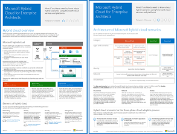

# Microsoft 云 IT 体系结构资源

 **摘要：** 了解 Microsoft 标识、安全性、网络和混合的核心云体系结构概念。查看使用 Microsoft 云时保护文件、标识和设备的指导建议。了解如何使用 Windows 10 和 Office 专业增强版部署新式安全桌面。
  
这些体系结构工具和海报提供有关 Microsoft 云服务的信息，其中包括 Office 365、Windows 10、Microsoft Intune、Microsoft Dynamics 365 以及本地混合和云解决方案。IT 决策者和架构师可以使用这些资源来确定其工作负载的理想解决方案，并做出有关核心基础结构组件的决策，如标识和安全性。 
  
<!--**[Microsoft's Enterprise Cloud Roadmap](microsoft-cloud-it-architecture-resources.md#roadmap)** (Sway) -->
    
- **[面向企业架构师的 Microsoft 云系列](microsoft-cloud-it-architecture-resources.md#cloudarch)** 
    <!-- [Microsoft Cloud Services and Platform Options](microsoft-cloud-it-architecture-resources.md#platformoptions) -->
    - [面向企业架构师的 Microsoft 云标识](microsoft-cloud-it-architecture-resources.md#identity)
    - [面向企业架构师的 Microsoft 云安全性](microsoft-cloud-it-architecture-resources.md#security)
    - [面向企业架构师的 Microsoft 云网络](microsoft-cloud-it-architecture-resources.md#networking)
    - [面向企业架构师的 Microsoft 混合云](microsoft-cloud-it-architecture-resources.md#hybrid)
    - [常见攻击和保护组织的 Microsoft 功能](#common-attacks-and-microsoft-capabilities-that-protect-your-organization)
    - [Microsoft 365 企业版底层基础结构](#m365foundationinfra)
    - [Microsoft 云租户到租户迁移的体系结构方法](#architecture-approaches-for-microsoft-cloud-tenant-to-tenant-migrations)
    
- **[Microsoft 365 企业版解决方案系列](microsoft-cloud-it-architecture-resources.md#BKMK_o365solutions)**：
    - [面向 IT 架构师的 Microsoft 365 中的 Microsoft Teams 和相关生产力服务](#microsoft-teams-and-related-productivity-services-in-microsoft-365-for-it-architects)
    - [面向 IT 架构师的 Microsoft 365 中的组](#groups-in-microsoft-365-for-it-architects)
    - [Office 365 的标识和设备保护](microsoft-cloud-it-architecture-resources.md#BKMK_O365IDP)
    - [Office 365 中的文件保护解决方案](microsoft-cloud-it-architecture-resources.md#BKMK_O365fileprotect)
    - [符合 GDPR 的 Office 365 信息保护](#office-365-information-protection-for-gdpr)
    - [Microsoft 针对政治宣传活动、非营利组织和其他敏捷性组织的安全指南](#microsoft-security-guidance-for-political-campaigns-nonprofits-and-other-agile-organizations)
    - [Microsoft 电话解决方案](#microsoft-telephony-solutions) 
    - [通过 Microsoft 部署新式安全桌面](microsoft-cloud-it-architecture-resources.md#msd)
    
请将你的想法告诉我们！向我们 ([cloudadopt@microsoft.com](mailto:cloudadopt@microsoft.com)) 发送电子邮件。 

<!--

## Microsoft's Enterprise Cloud Roadmap

See the posters, icon sets, community venues, and other resources that describe the industry's most complete cloud solution.
  
|**Item**|**Description**|
|:-----|:-----|
|[          ](https://aka.ms/cloudarchitecture)   [Microsoft's Enterprise Cloud Roadmap](https://aka.ms/cloudarchitecture) (https://aka.ms/cloudarchitecture)   |Swipe through this Sway experience for the resources that describe the industry's most complete cloud solution.    |
-->
  

##面向企业架构师的 Microsoft 云系列

这些云体系结构海报提供有关 Microsoft 云服务的信息，其中包括 Office 365、Azure Active Directory、Microsoft Intune、Microsoft Dynamics CRM Online 以及本地混合和云解决方案。IT 决策者和架构师可以使用这些资源来确定其工作负载的理想解决方案，并做出有关核心基础结构组件的决策，如标识和安全性。

<!--  

### Microsoft Cloud Services and Platform Options

Learn key differences between Microsoft cloud services and platform offerings. Find the best fit for your solution.
  
|**Item**|**Description**|
|:-----|:-----|
|[          ](https://www.microsoft.com/download/details.aspx?id=54432)   [PDF](https://go.microsoft.com/fwlink/p/?LinkId=524731)  \| [Visio](https://go.microsoft.com/fwlink/p/?LinkId=524732)  \| [More languages](https://www.microsoft.com/download/details.aspx?id=54432)   | This model describes: <ul><li>  Software as a Service (SaaS) offerings, including Office 365 </li><li>  Platform as a Service (PaaS) features in Microsoft Azure </li><li>  Infrastructure as a Service (IaaS) features in Microsoft Azure </li><li>  Private cloud datacenter capabilities using Windows Server and System Center </li><li>  Learn how Microsoft's own IT department is migrating to these cloud services and building its hybrid cloud. </li></ul> |
-->

   

###面向企业架构师的 Microsoft 云标识

关于使用 Microsoft 云服务和平台为组织设计标识，IT 架构师需要了解的信息。
  
|**项**|**说明**|
|:-----|:-----|
|[          ](https://www.microsoft.com/download/details.aspx?id=54431)   [PDF](https://go.microsoft.com/fwlink/p/?LinkId=524586)  \| [Visio](https://download.microsoft.com/download/2/3/8/238228E6-9017-4F6C-BD3C-5559E6708F82/MSFT_cloud_architecture_identity.vsd)           \| [更多语言](https://www.microsoft.com/download/details.aspx?id=54431)   | 此模型包含： <ul><li>Microsoft 云标识简介 </li><li>Azure AD IDaaS 功能 </li><li>将本地 Active Directory 域服务帐户与 Microsoft Azure Active Directory 集成 </li><li>将目录组件放入 Azure </li><li>Azure IaaS 中适用于工作负载的域服务选项 </li></ul> |
   

### 面向企业架构师的 Microsoft 云安全性

关于 Microsoft 云服务和平台的安全性，IT 架构师需要了解的信息。
  
|**项**|**说明**|
|:-----|:-----|
|[          ](https://www.microsoft.com/download/details.aspx?id=48121)   [PDF](https://go.microsoft.com/fwlink/p/?linkid=842070)  \| [Visio](https://go.microsoft.com/fwlink/p/?LinkId=842071)  \| [更多语言](https://www.microsoft.com/download/details.aspx?id=48121)   | 此模型包含： <ul><li>Microsoft 在提供安全服务和平台方面的作用</li><li>客户在降低安全风险上肩负的责任</li><li>顶级安全认证 </li><li>Microsoft 咨询服务提供的安全产品/服务 </ul> |
   

### 面向企业架构师的 Microsoft 云网络

关于 Microsoft 云服务和平台的网络，IT 架构师需要了解的信息。
  
|**项**|**说明**|
|:-----|:-----|
|[          ](https://www.microsoft.com/download/details.aspx?id=54425)   [PDF](https://go.microsoft.com/fwlink/p/?linkid=842073)  \| [Visio](https://go.microsoft.com/fwlink/p/?linkid=842074)           \| [更多语言](https://www.microsoft.com/download/details.aspx?id=54425)   | 此模型包含： <ul><li> 发展你的云连接网络 </li><li> Microsoft 云连接的常见元素 </li><li> 面向 Microsoft 云连接的 ExpressRoute </li><li> 为 Microsoft SaaS、Azure PaaS 和 Azure IaaS 设计网络 </li></ul>    |
   

### 面向企业架构师的 Microsoft 混合云

关于 Microsoft 服务和平台的混合云，IT 架构师需要了解的信息。
  
|**项**|**说明**|
|:-----|:-----|
|[          ](https://www.microsoft.com/download/details.aspx?id=54424)   [PDF](https://go.microsoft.com/fwlink/p/?linkid=842082)  \| [Visio](https://go.microsoft.com/fwlink/p/?linkid=842083)           \| [更多语言](https://www.microsoft.com/download/details.aspx?id=54424)   | 此模型包含： <ul><li> Microsoft 的云产品（SaaS、Azure PaaS 和 Azure IaaS）及它们的常用元素 </li><li> Microsoft 云产品的混合云体系结构 </li><li> Microsoft SaaS (Office 365)、Azure PaaS 和 Azure IaaS 的混合云方案 </li></ul> |
   

### 常见攻击和保护组织的 Microsoft 功能
了解最常见的网络攻击以及 Microsoft 在攻击的每个阶段如何帮助组织。 

|**项**|**说明**|
|:-----|:-----|
|   [PDF](https://download.microsoft.com/download/F/A/C/FACFC1E9-FA35-4DF1-943C-8D4237B4275B/MSFT_Cloud_architecture_security_commonattacks.pdf) \| [Visio](https://download.microsoft.com/download/F/A/C/FACFC1E9-FA35-4DF1-943C-8D4237B4275B/MSFT_Cloud_architecture_security_commonattacks.vsdx)   | 该海报展示了常见攻击的路径，并说明了哪些功能有助于在攻击的每个阶段阻止攻击者。  |

### Microsoft 365 企业版底层基础结构

快速了解 Microsoft 365 Enterprise 的[底层基础结构](https://docs.microsoft.com/microsoft-365/enterprise/deploy-foundation-infrastructure)以开始部署。
  
|**Item**|**说明**|
|:-----|:-----|
|   [联机查看](https://aka.ms/m365efoundinfraposter) \| [PDF](https://github.com/MicrosoftDocs/microsoft-365-docs/raw/public/microsoft-365/enterprise/media/deploy-foundation-infrastructure/Microsoft365EnterpriseFoundInfra.pdf)   | 此海报概述了底层基础结构的各个阶段，包括目标、功能和工具、设计决策、配置结果、载入及持续监视和更新。  | 

### Microsoft 云租户到租户迁移的体系结构方法 
本系列主题阐述了合并、收购、剥离和其他可能会导致你迁移到新云租户的方案的几种体系结构方法。 这些主题提供了有关规划的起点指南。

|**Item**|**说明**|
|:-----|:-----|
|   [PDF](downloads/Microsoft-365-tenant-to-tenant-migration.pdf) \| [Visio](https://github.com/MicrosoftDocs/OfficeDocs-Enterprise/raw/live/Enterprise/downloads/Microsoft-365-tenant-to-tenant-migration.vsdx)     |此模型包含： <ul><li>商业方案到体系结构方法的映射</li><li>设计注意事项</li><li>单事件迁移流</li><li>分阶段迁移流</li><li>租户移动或拆分流</li></ul>|

## Microsoft 365 企业版解决方案系列

Microsoft 365 企业版解决方案系列介绍了如何实现 Microsoft 365 功能，尤其是其中一些跨技术的功能。

### 面向 IT 架构师的 Microsoft 365 中的 Microsoft Teams 和相关生产力服务
Microsoft 365 中生产力服务的逻辑体系结构，以 Microsoft Teams 为主导。

|**项**|**说明**|
|:-----|:-----|
|   [PDF](downloads/msft-m365-teams-logical-architecture.pdf) \| [Visio](https://github.com/MicrosoftDocs/OfficeDocs-Enterprise/raw/live/Enterprise/downloads/msft-m365-teams-logical-architecture.vsdx)     |Microsoft 提供了一系列生产力服务，这些服务协同工作，提供数据治理、安全性和符合性相关功能的协作体验。    此系列图示展示了企业架构师生产力服务的逻辑体系结构，以 Microsoft Teams 为主导。|

### 面向 IT 架构师的 Microsoft 365 中的组
对于 Microsoft 365 中的组，IT 架构师需要了解的信息

|**项**|**说明**|
|:-----|:-----|
|   [PDF](downloads/msft-m365-groups.pdf) \| [Visio](https://github.com/MicrosoftDocs/OfficeDocs-Enterprise/raw/live/Enterprise/downloads/msft-m365-groups.vsdx) |这些图示详细介绍了不同类型的组，如何创建和管理这些组，以及一些治理建议。|

   

### Office 365 的标识和设备保护

用于保护访问 Office 365 设备、其他 SaaS 服务以及使用 Azure AD 应用代理发布的本地应用的标识和设备的推荐功能。
  
|**项**|**说明**|
|:-----|:-----|
|[          ](https://www.microsoft.com/download/details.aspx?id=55032)   [PDF](https://go.microsoft.com/fwlink/p/?linkid=841656)  \| [Visio](https://go.microsoft.com/fwlink/p/?linkid=841657)  \| [更多语言](https://www.microsoft.com/download/details.aspx?id=55032)   |请务必在数据、标识和设备中使用一致的保护级别。本文档介绍可与保护标识和设备功能相媲美的功能的详细信息。    |
   

### Office 365 中的文件保护解决方案

在 Office 365 中基于三种不同的敏感度级别来保护文件的推荐功能。
  
|**项**|**说明**|
|:-----|:-----|
|[          ](https://www.microsoft.com/download/details.aspx?id=55523)   [PDF](https://go.microsoft.com/fwlink/?linkid=2004320)  \| [Visio](https://download.microsoft.com/download/7/8/9/789645A5-BD10-4541-BC33-F8D1EFF5E911/MSFT_cloud_architecture_O365%20file%20protection.vsdx)   |请务必在数据、标识和设备中使用一致的保护级别。本文档介绍可与保护 Office 365 中的文件功能相媲美的功能的详细信息。    |
   

### 针对 GDPR 的 Office 365 信息保护

针对发现、分类、保护和监视个人数据的指导性建议。该解决方案以一般数据保护条例 (GDPR) 为例，但用户可以采用同一流程实现对许多其他条例的符合性。

|**项目**|**说明**|
|:-----|:-----|
|    [PDF](https://download.microsoft.com/download/E/C/D/ECD5A339-EF10-4420-B3A9-99098884D716/MSFT_Cloud_architecture_information%20protection%20for%20GDPR.pdf) \| [Visio](https://download.microsoft.com/download/E/C/D/ECD5A339-EF10-4420-B3A9-99098884D716/MSFT_Cloud_architecture_information%20protection%20for%20GDPR.vsdx)    |若要以文章格式查看此内容，请参阅[符合 GDPR 的 Office 365 信息保护](https://docs.microsoft.com/Office365/SecurityCompliance/office-365-information-protection-for-gdpr)。      |

### Microsoft 针对政治宣传活动、非营利组织和其他敏捷型组织的安全指南 

本指南介绍了如何实现安全的云环境。该解决方案指南可供任何组织使用。并且对带有 BYOD 访问权限和来宾帐户的敏捷型组织提供了更多帮助。可使用本指南作为设计自己环境的起点。

|**项目**|**描述**|
|:-----|:-----|
|**Microsoft 针对政治宣传活动的安全指南**   [          ](https://download.microsoft.com/download/B/4/D/B4D520C3-4D0C-4B4D-BFB9-09F0651C2775/MSFT_Cloud_architecture_security%20for%20political%20campaigns.pdf)   [PDF](https://download.microsoft.com/download/B/4/D/B4D520C3-4D0C-4B4D-BFB9-09F0651C2775/MSFT_Cloud_architecture_security%20for%20political%20campaigns.pdf)  \| [Visio](https://download.microsoft.com/download/B/4/D/B4D520C3-4D0C-4B4D-BFB9-09F0651C2775/MSFT_Cloud_architecture_security%20for%20political%20campaigns.vsdx)   |本指南以政治宣传活动的组织为例，可将本指南用作任何环境的起点。    |
|**Microsoft 针对非营利组织的安全指南**   [          ](https://download.microsoft.com/download/9/4/3/94389612-C679-4061-8DF2-D9A15D72B65F/Microsoft_Cloud%20Architecture_Security%20for%20Nonprofits.pdf)   [PDF](https://download.microsoft.com/download/9/4/3/94389612-C679-4061-8DF2-D9A15D72B65F/Microsoft_Cloud%20Architecture_Security%20for%20Nonprofits.pdf)  \| [Visio](https://download.microsoft.com/download/9/4/3/94389612-C679-4061-8DF2-D9A15D72B65F/Microsoft_Cloud%20Architecture_Security%20for%20Nonprofits.vsdx)   |本指南经过略微修订，适用于非盈利组织。例如，引入了 Office 365 非盈利组织版计划。该技术指南与政治宣传活动解决方案指南相同。    |

本指南包括测试实验室指南。有关详细信息，请参阅 [Microsoft 针对政治宣传活动、非营利组织和其他敏捷型组织的安全指南](https://docs.microsoft.com/Office365/SecurityCompliance/microsoft-security-guidance-for-political-campaigns-nonprofits-and-other-agile-o)。

### Microsoft 电话解决方案

当你开始在 Microsoft 云中使用 Teams 时，Microsoft 支持多种选项。此海报可帮助你确定哪种 Microsoft 电话解决方案（云端的电话系统或本地企业语音）适合你组织中的用户，以及你的组织如何连接到公用电话交换网 (PSTN)。

  
[PDF](https://github.com/MicrosoftDocs/OfficeDocs-SkypeForBusiness/blob/live/Teams/downloads/telephony-solutions/microsoft-telephony-solutions-12-18.pdf) | [Visio](https://github.com/MicrosoftDocs/OfficeDocs-SkypeForBusiness/blob/live/Teams/downloads/telephony-solutions/microsoft-telephony-solutions-12-18.vsdx) 

有关详细信息，请参阅此海报文章：[Microsoft 电话解决方案](https://docs.microsoft.com/SkypeForBusiness/hybrid/msft-telephony-solutions)。
  

### 通过 Microsoft 部署新式安全桌面

关于在 Windows 10 上部署和管理 Office 365 专业增强版更新，IT 架构师需要了解的信息。
  
|**项**|**说明**|
|:-----|:-----|
|[          ](https://www.microsoft.com/download/details.aspx?id=55987)   [PDF](https://download.microsoft.com/download/4/E/9/4E90E227-770A-41D1-99FE-925A64D81A55/MSFT_modern_secure_desktop.pdf)  \| [Visio](https://download.microsoft.com/download/4/E/9/4E90E227-770A-41D1-99FE-925A64D81A55/MSFT_modern_secure_desktop.vsdx)   | 此模型包含： <ul><li>  从 Microsoft 云部署 Windows 10 和 Office 专业增强版 </li><li>  使用 System Center Configuration Manager 部署 Windows 10 和 Office 365 专业增强版 </li><li>  从 Microsoft 云管理 Windows 10 和 Office 专业增强版的更新 </li><li>  使用 System Center Configuration Manager 管理 Windows 10 和 Office 365 专业增强版的更新 </li><li>  Windows 10 现成的其他保护功能 </li></ul>  |
   
## 另请参阅

[SharePoint、Exchange、Skype for Business 和 Lync 的体系结构模型](architectural-models-for-sharepoint-exchange-skype-for-business-and-lync.md)
  
[云采用测试实验室指南 (TLG)](cloud-adoption-test-lab-guides-tlgs.md)
  
[安全解决方案](security-solutions.md)
  
[混合解决方案](hybrid-solutions.md)

