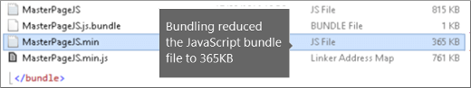

# SharePoint Online 中的缩小和捆绑Minification and bundling in SharePoint Online

本文介绍如何使用缩小和捆绑与 Web Essentials 方法，以降低的 HTTP 请求数并减少加载 SharePoint Online 中的页面所花费的时间。This article describes how to use minification and bundling techniques with Web Essentials to reduce the number of HTTP requests and to reduce the time it takes to load pages in SharePoint Online.
  
当您自定义您的网站时，最终会将大量的额外文件添加到服务器以支持自定义。添加额外的 JavaScript、CSS 和图像会增加服务器收到的 HTTP 请求数，这反过来又会增加网页显示所需的时间。如果您具有多个相同类型的文件，您可以捆绑这些文件，以更快地下载这些文件。When you customize your website you can end up adding a large number of extra files to the server to support the customization. Adding extra JavaScript, CSS, and images increases the number of HTTP requests to the server which in turn increases the time it takes to display a web page. If you have multiple files of the same type, you can bundle these files to make downloading these files faster.
  
对于 JavaScript 和 CSS 文件，您还可以使用调用缩小，其中通过删除空格和其他字符不必要的减少文件的总大小的方法。For JavaScript and CSS files, you can also use an approach called minification, where you reduce the total size of files by removing whitespace and other characters that aren't necessary.
  
## 缩小以及将 JavaScript 和 CSS 文件与 Web Essentials 捆绑Minification and bundling JavaScript and CSS files with Web Essentials

您可以使用第三方软件（如 Web Essentials）来捆绑 CSS 和 JavaScript 文件。You can use third-party software such as Web Essentials to bundle CSS and JavaScript files.
  
> [!IMPORTANT]
> Web Essentials 是第三方、 开放源代码、 社区基于项目。本软件是一种扩展到 Visual Studio 2012 和 Visual Studio 2013 和 Microsoft 不支持。若要下载 Web Essentials，访问的网站： [http://vswebessentials.com/download](https://go.microsoft.com/fwlink/p/?LinkId=525629)。Web Essentials is a third-party, open-source, community-based project. The software is an extension to Visual Studio 2012 and Visual Studio 2013 and is not supported by Microsoft. To download Web Essentials, visit the website at [http://vswebessentials.com/download](https://go.microsoft.com/fwlink/p/?LinkId=525629). 
  
Web Essentials 提供两种捆绑格式：Web Essentials offers two forms of bundling:
  
- .bundle：用于 CSS 和 JavaScript 文件.bundle: for CSS and JavaScript files
    
- .sprite：用于图像（仅适用于 Visual Studio 2013）.sprite: for images (only available in Visual Studio 2013)
    
如果您的现有功能具有一些在自定义母版页内引用的品牌元素，您可以使用 Web Essentials，例如：You can use Web Essentials if you have an existing feature with some branding elements that are referenced inside a custom master page, such as:
  

  
 **在 Web Essentials 中创建 TE000127218 和 CSS 绑定****To create a TE000127218 and CSS bundle in Web Essentials**
  
1. 在 Visual Studio 中的解决方案资源管理器中，选择您想要在捆绑中包含的文件。In Visual Studio, in Solution Explorer, select the files that you want to include in the bundle.
    
2. 右键单击选定的文件，然后选择**Web Essentials** \> **创建 JavaScript 资源包文件**从上下文菜单。例如：Right-click the selected files and then select **Web Essentials** \> **Create JavaScript bundle file** from the context menu. For example: 
    
    
  
## 查看捆绑 JavaScript 和 CSS 文件的结果Viewing the results of bundling JavaScript and CSS files

当您创建 JavaScript 和 CSS 捆绑时，Web Essentials 将创建名为脚本文件的 XML 文件，用于标识 JavaScript 和 CSS 文件及其他配置信息：When you create a JavaScript and CSS bundle, Web Essentials creates an XML file called a recipe file that identifies the JavaScript and CSS files as well as some other configuration information: 
  

  
此外，如果 minify 标志在捆绑脚本中设置为 true，则文件大小会减小并捆绑在一起。这意味着创建了新的缩小版 JavaScript 文件，您可以在母版页中进行引用。In addition, if the minify flag is set to true in the bundling recipe the files are reduced in size as well as bundled together. This means that new, minified versions of the JavaScript files were created that you can reference in your master page.
  

  
当您从您的网站加载页面时，可以使用 Web 浏览器（如 Internet Explorer 11）中的开发人员工具来查看发送到服务器的请求数以及每个文件加载所用的时间。When you load a page from your web site, you can use the developer tools from your web browser, such as Internet Explorer 11, to see the number of requests sent to the server and how long each file took to load.
  
下图是在缩小之前加载 JavaScript 和 CSS 文件的结果。The following figure is the result of loading the JavaScript and CSS files before minification.
  

  
将 CSS 和 JavaScript 文件捆绑在一起之后，请求数减少到 74，并且每个文件仅需比原始文件稍长的时间来单独下载：After bundling the CSS and JavaScript files together, the number of requests dropped to 74 and each file took only slightly longer than the original files to download individually:
  

  
捆绑后，JavaScript 捆绑文件从 815 KB 明显减少至 365 KB：After bundling, the JavaScript bundle file is reduced significantly from 815KB to 365KB:
  

  
## 通过创建图像子画面来捆绑图像Bundling images by creating an image sprite

类似于捆绑 JavaScript 和 CSS 文件的方式，您可以将多个小图标和其他常见图像合并到更大的画面工作表，然后使用 CSS 以显示单个图像。而不是下载每个单独的图像，用户的 web 浏览器一次下载画面工作表，然后将其缓存在本地计算机上。这将通过下载和 web 服务器的往返行程数降低提高页面加载性能。Similar to how you bundle JavaScript and CSS files, you can combine many small icons and other common images into a larger sprite sheet and then use CSS to reveal the individual images. Instead of downloading each individual image, the user's web browser downloads the sprite sheet once and then caches it on the local computer. This improves page load performance by cutting down on the number of downloads and round trips to the web server.
  
 **在 Web Essentials 中创建图像子画面****To create an image sprite in Web Essentials**
  
1. 在 Visual Studio 中的解决方案资源管理器中，选择您想要在捆绑中包含的文件。In Visual Studio, in Solution Explorer, select the files that you want to include in the bundle.
    
2. 右键单击选定的文件，然后选择**Web Essentials** \>从上下文菜单的**创建图像画面**。例如：Right-click the selected files and then select **Web Essentials** \> **Create image sprite** from the context menu. For example: 
    
    
  
3. 选择保存子画面文件的位置。.sprite 文件是描述子画面中设置和文件的 XML 文件。下图显示了子画面 PNG 文件及其相应的 .sprite XML 文件的示例。Choose a location to save the sprite file. The .sprite file is an XML file that describes the settings and files in the sprite. The following figures show an example of a sprite PNG file and its corresponding .sprite XML file.
    
    
  
    
  

