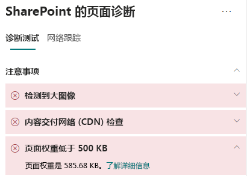
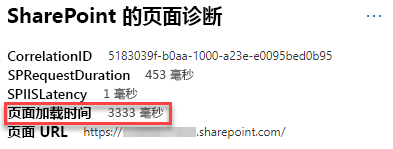

# 在 SharePoint Online 新式网页上优化页面权重Optimize page weight in SharePoint Online modern site pages

SharePoint Online 新式网页包括呈现导航/命令栏下内容区域中的图像、文本和对象等页面内容所需的序列化代码，还包括形成页面框架的其他 HTML 代码。SharePoint Online modern site pages contain serialized code that is required to render page content of the page, including images, text, objects in the content area underneath navigation/command bars and other HTML code that forms the framework of the page. 页面权重是此 HTML 代码的一种度量，且应限制来确保最佳页面加载时间。Page weight is a measurement of this HTML code, and should be limited to ensure optimal page load times.

本文将帮助你了解如何减少新式页面中的页面权重。This article will help you understand how to reduce page weight in your modern site pages.

>[!NOTE]
>要详细了解 SharePoint Online 新式门户中的性能，请参阅[新式 SharePoint 体验中的性能](https://docs.microsoft.com/sharepoint/modern-experience-performance)。For more information about performance in SharePoint Online modern portals, see [Performance in the modern SharePoint experience](https://docs.microsoft.com/sharepoint/modern-experience-performance).

## 使用适用于 SharePoint 的页面诊断工具分析页面权重Use the Page Diagnostics for SharePoint tool to analyze page weight

**适用于 SharePoint 的页面诊断工具**是一款面向 Chrome 和 [Microsoft Edge 版本 77 或更高版本](https://www.microsoftedgeinsider.com/download?form=MI13E8&OCID=MI13E8)的浏览器扩展，可用于分析发布 SharePoint 新式发布网页和经典发布网页。The **Page Diagnostics for SharePoint tool** is a browser extension for Chrome and [Microsoft Edge version 77 or later](https://www.microsoftedgeinsider.com/download?form=MI13E8&OCID=MI13E8) you can use to analyze SharePoint both modern and classic publishing site pages. 该工具对已分配的每个页面提供一个报告，其中显示根据一组定义的性能条件得出的页面性能情况。The tool provides a report for each analyzed page showing how the page performs against a defined set of performance criteria. 要安装和了解适用于 SharePoint 的页面诊断工具，请访问[使用适用于 SharePoint Online 的页面诊断工具](page-diagnostics-for-spo.md)。To install and learn about the Page Diagnostics for SharePoint tool, visit [Use the Page Diagnostics tool for SharePoint Online](page-diagnostics-for-spo.md).

通过适用于 SharePoint 的页面诊断工具分析 SharePoint 网页时，可在“_诊断测试_”窗格的“\*\*页面权重小于 500KB \*\*”结果中查看页面相关信息。When you analyze a SharePoint site page with the Page Diagnostics for SharePoint tool, you can see information about page in the **Page weight under 500KB** result of the _Diagnostic tests_ pane. 如果页面权重低于基线值，则结果将显示为绿色；如果页面权重大于基线值，则结果显示为红色。The result will appear in green if the page weight is under the baseline value, and red if the page weight exceeds the baseline value.

可能的结果包括：Possible results include:

- **需要注意**（红色）：页面权重大于 500KB**Attention required** (red): Page weight exceeds 500KB
- **无需操作**（绿色）：页面权重小于 500KB**No action required** (green): Page weight is under 500KB

如果“**需要注意**”部分中显示“**页面权重小于 500KB**”结果，则可单击结果了解详细信息。If the **Page weight under 500KB** result appears in the **Attention required** section, you can click the result for details.

## 修正页面权重问题Remediate page weight issues

如果页面权重大于 500KB，可通过减少 Web 部件数量并将页面内容限制到适当程度，缩短整体页面加载时间。If page weight exceeds 500KB, you can improve overall page load time by reducing the number of web parts and limiting page content to an appropriate degree.

有关减少页面权重的一般指南包括：General guidance for reducing page weight includes:

- 将页面内容限制到适当的量，并使用多个页面显示相关内容。Limit the page content to a reasonable amount and use multiple pages for related content.
- 尽可能少地使用具有大量属性包的 Web 部件。Minimize the use of web parts that have large property bags.
- 尽可能地使用非交互式汇总视图。Use non-interactive rollup views when possible.
- 通过适当设置图像大小、使用压缩后的图像格式并确保其下载自 CDN，优化图像大小。Optimize image sizes by sizing images appropriately, using compressed image formats and ensuring that they are downloaded from a CDN.

可在以下文章中找到有关限制权重的其他指南：You can find additional guidance for limiting page weight in the following article:

- [优化 SharePoint 中的页面性能Optimize page performance in SharePoint](https://docs.microsoft.com/sharepoint/dev/general-development/optimize-page-performance-in-sharepoint)

在修改页面来修正性能问题之前，请在分析结果中记下页面加载时间。Before you make page revisions to remediate performance issues, make a note of the page load time in the analysis results. 修改后再次运行工具，查看新结果是否在基线标准范围内，同时检查新的页面加载时间，查看是否有提升。Run the tool again after your revision to see if the new result is within the baseline standard, and check the new page load time to see if there was an improvement.

>[!NOTE]
>页面加载时间可能由于网络加载、具体时间和其他暂时条件等各种因素而有所不同。Page load time can vary based on a variety of factors such as network load, time of day, and other transient conditions. 应在更改前后多次测试页面加载时间，以帮助求出结果平均值。You should test page load time a few times before and after making changes to help you average the results.

## 相关主题Related topics

[优化 SharePoint Online 性能Tune SharePoint Online performance](tune-sharepoint-online-performance.md)

[优化 Office 365 性能Tune Office 365 performance](tune-office-365-performance.md)

[新式 SharePoint 体验中的性能Performance in the modern SharePoint experience](https://docs.microsoft.com/sharepoint/modern-experience-performance)

[内容分发网络Content delivery networks](content-delivery-networks.md)

[结合使用 Office 365 内容分发网络和 SharePoint OnlineUse the Office 365 Content Delivery Network (CDN) with SharePoint Online](use-office-365-cdn-with-spo.md)
