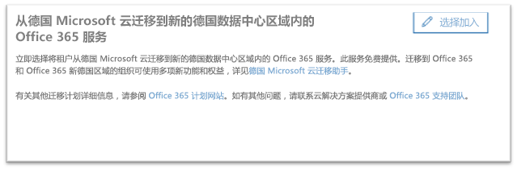
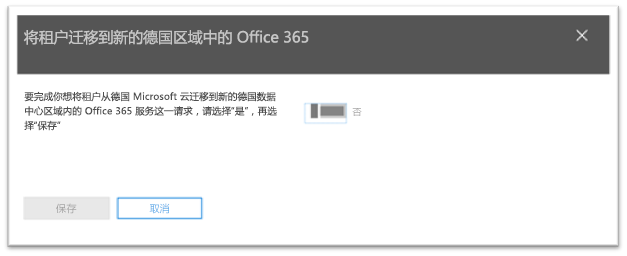
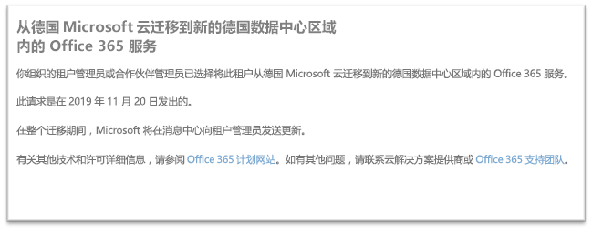

# 如何选择从德国 Microsoft 云（Microsoft Cloud Deutschland）迁移到新的德国数据中心区域内的 Office 365 服务How to opt-in for migration from Microsoft Cloud Germany (Microsoft Cloud Deutschland) to Office 365 services in the new German datacenter regions

>[!Note]
>本文仅适用于符合条件的 德国 Microsoft 云客户。This article only applies to eligible Microsoft Cloud Germany/Deutschland customers.
>

## 如何请求迁移How to request migration

在德国 Microsoft 云中预配了服务的合格客户将在 Microsoft 365 管理中心看到一个页面，客户租户管理员可在此页面中选择进行迁移。Eligible customers with service provisioned in Microsoft Cloud Germany will see a page in the Microsoft 365 admin center that will allow a customer tenant administrator to opt-in for migration.

要访问 Microsoft 365 管理中心的此页面，请在左侧的导航窗格中展开“**设置**”，然后单击“**组织档案**”。To access the page in the Microsoft 365 admin center, in the navigation pane on the left, expand **Settings** and then click **Organization Profile**.

在“**组织档案**”页面上，向下滚动到“**从德国 Microsoft 云迁移到新的德国数据中心区域内的 Office 365 服务**”部分。On the **Organization Profile** page, scroll down to the **Migrate from Microsoft Cloud Germany (Microsoft Cloud Deutschland) to Office 365 services in the new German datacenter regions** section.

如果你的组织希望将你的服务从德国 Microsoft 云迁移到新的德国数据中心区域内的 Office 365 服务，请单击“**选择加入**”。If your organization wishes to migrate your service from Microsoft Cloud Germany (Microsoft Cloud Deutschland) to Office 365 services in the new German datacenter regions, click **Opt-in**.
 

屏幕右侧将显示一个新分区，可在此处接受确认信息。A new section will appear on the right side of your screen to accept your confirmation. 将切换按钮设置为“**是**”，然后单击“**保存**”。Select the toggle button to **Yes**, and then click **Save**.
 

一旦管理员代表你的租户选择加入，所有管理员将立即在“**从德国 Microsoft 云迁移到新的德国数据中心区域内的 Office 365 服务**”部分中看到确认信息，包括选择加入的日期。Once an administrator has opted-in on behalf of your tenant then all administrators will see the confirmation in **Migrate from Microsoft Cloud Germany (Microsoft Cloud Deutschland) to Office 365 services in the new German datacenter regions** section, including the date of opt-in. 管理员还将在 Microsoft 365 管理中心的消息中心内收到确认信息。Administrators will also receive a confirmation in Message Center of the Microsoft 365 admin center. 
 

## 选择进行迁移后，会发生什么情况？What happens after opting-in for migration?

对于选择采用 Microsoft 提出的方法的组织，预计在 2020 年进行迁移。Migrations are expected to take place in 2020 for organizations that opt-in to the Microsoft-driven approach.  迁移后，核心客户数据和订阅会迁移到新的德国区域。As a result of the migration, core customer data and subscriptions are moved to the new German regions.  在整个迁移期间，Microsoft 将在消息中心发送更新动态。Microsoft will send updates throughout the migration process in Message Center.

## 更多信息More information

- [德国 Microsoft 云迁移助手Microsoft Cloud Deutschland Migration Assistance](https://aka.ms/germanymigrateassist)
- [Office 365 德国 Microsoft 云客户迁移计划Office 365 migration program for Microsoft Cloud Deutschland customers](https://aka.ms/office365germanymove)
- [Dynamics 365 德国 Microsoft 云客户迁移计划Dynamics 365 migration program for Microsoft Cloud Deutschland customers](https://aka.ms/d365ceoptin)
- [Power BI 德国 Microsoft 云客户迁移计划Power BI migration program for Microsoft Cloud Deutschland customers](https://aka.ms/pbioptin)
- 使用“需要帮助?”提交问题Submit questions using the “Need Help?” [Microsoft 365 管理中心](https://portal.office.de/)的链接link of the [Microsoft 365 admin center](https://portal.office.de/)
