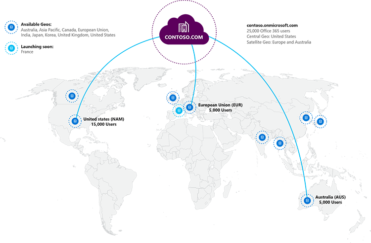

# 在 OneDrive 和在线 Office 365 中的 SharePoint 多地区功能Multi-Geo Capabilities in OneDrive and SharePoint Online in Office 365

使用 OneDrive 和 SharePoint Online 中多地区功能，组织可以扩展到多个地理区域和/或国家/地区内您现有租户的其 Office 365 的存在。动身去找您的 Microsoft 客户小组注册多国家公司 OneDrive 业务多的地区。With multi-geo capabilities in OneDrive and SharePoint Online, your organization can expand its Office 365 presence to multiple geographic regions and/or countries within your existing tenant. Reach out to your Microsoft Account Team to sign up your Multi-National Company for OneDrive for Business Multi-Geo.
  
与 OneDrive 多的地区，可以预置和存放的数据存储在您选择满足派驻的数据要求，地理位置和在同一时间为人员解锁您全球推出现代生产力的经验。With OneDrive Multi-Geo, you can provision and store data at rest in the geo locations that you've chosen to meet data residency requirements, and at the same time unlock your global roll out of modern productivity experiences to your workforce.
  
下面是多地区功能如何使您的组织受益：Here's how multi-geo features can benefit your organization:
  
- 作为一个全局连接组织运行单个 Office 365 承租人跨越多个地理位置的程序。Operate as one global connected organization with a single Office 365 tenant spanning multiple geo locations.
    
- 通过创建和承载内指定的地理位置静态数据满足数据派驻服务要求。Meet data residency requirements by creating and hosting data-at-rest within a specified geo location.
    
- 与享受的中心位置用户的同一现代生产效率经验使卫星用户。Empower your satellite users with the same modern productivity experiences enjoyed by your central location users.
    
- 使用户能够跨地理位置随着其角色的变化，而访问其内容保持不变。Enable your users to move across geo locations as their role changes, while access to their content is kept intact.
    
- 调整每个地理位置您共享策略和每个站点的数据丢失防护策略。Tailor your sharing policies per geo location and data loss prevention policies per site.
    
- 指定每个地理位置的经理的 eDiscovery 并允许管理定制到地理位置的情况。Designate eDiscovery managers per geo location and allow governing cases tailored to your geo location.
    
- 对于其他地理位置选择唯一的 URL 命名空间 (例如，ContosoEUR.sharepoint.com)。Choose unique URL namespaces (for example, ContosoEUR.sharepoint.com) for your additional geo locations.
    
- 将区域的内部部署数据整合到您的 Office 365 多地区租户。Consolidate your regional on-premises data into your Office 365 multi-geo tenant.
    
在多个地区配置中，Office 365 租户组成一个集中的位置 （也称为默认位置） 和一个或多个卫星地理位置。多个地区的关键概念是，单个组织将跨越一个跨多个地理位置。多地区承租人，在地理位置、 组和用户信息，信息被掌握在 Azure 活动目录 (AAD)。因为承租人信息是集中掌握，同步到每个地理位置共享和经验涉及从贵公司的任何人都将包含全局意识。In a multi-geo configuration, your Office 365 tenant consists of a central location (also known as the default location) and one or more satellite geo locations. The key concept of multi-geo is that a single tenancy will span across one multiple geo locations. In a multi-geo tenant, the information about geo locations, groups, and user information, is mastered in Azure Active Directory (AAD). Because your tenant information is mastered centrally and synchronized into each geo location, sharing and experiences involving anyone from your company contain global awareness.
  
## 多地区租户配置示例Sample multi-geo tenant configuration

通过使用多地区租户，Contoso，北美地区的中心位置可以展开到卫星的 Contoso.com 单个组织伞下的在欧洲和澳大利亚地理位置。设置为欧洲及其首选的数据位置的用户将具有在欧洲他们 OneDrive，而其首选的数据位置为北美地区的用户都将具有其 OneDrive 在美国。By using a multi-geo tenant, Contoso, with a central location of North America, can expand to satellite geo locations in Europe, and Australia under the single organization umbrella of Contoso.com. Users with their preferred data location set to Europe will have their OneDrive in Europe while users with their preferred data location in North America will have their OneDrive in the US.
  

  
## 三个简单步骤中获得多个地理特征Get multi-geo features in three simple steps

配置多地理方法非常简单：Configuring multi-geo is easy:
  
1. 使用您的帐户小组要添加_Office 365 中的多个地区功能_服务计划。他们将引导您添加需要的许可证数量。Work with your account team to add the _Multi-Geo Capabilities in Office 365_ service plan. They will guide you to add the number of licenses needed.
    
2. 添加您的附属位置。Add your satellite locations.
    
3. 配置您的用户帐户的适当位置。Configure your user accounts for the appropriate location.
    
## 多地理状态和可用性Multi-Geo status and availability

OneDrive 多地区目前提供这些地区和国家/地区：OneDrive Multi-Geo is currently offered in these regions and countries:
  
- 亚太Asia-Pacific
    
- 澳大利亚Australia
    
- 加拿大Canada
    
- 欧洲联盟 (EMEA)European Union (EMEA)
    
- 日本Japan
    
- 英国United Kingdom
    
- 美国 （北美）United States (North America)
    
- 韩国Korea
      
即将到来的地理位置：Upcoming geo locations:
  
- 法国France
- 印度India
    
## 开始使用Getting started

若要开始使用 OneDrive 业务多的地区，第一步是[规划业务多地理环境为您 OneDrive](plan-for-multi-geo.md)。下一步，[了解有关管理多地理环境](administering-a-multi-geo-environment.md)和[您的用户会多地理环境](multi-geo-user-experience.md)。当您准备将 OneDrive 设置为业务多的地区，[配置您的多个地区的租户](multi-geo-tenant-configuration.md)，然后[移到其新的地理位置的任何现有 OneDrive 站点](move-onedrive-between-geo-locations.md)并[设置搜索](configure-search-for-multi-geo.md)。To get started with OneDrive for Business Multi-Geo, the first step is to [plan your OneDrive for Business Multi-Geo environment](plan-for-multi-geo.md). Next, [learn about administering a multi-geo environment](administering-a-multi-geo-environment.md) and [how your users will experience a multi-geo environment](multi-geo-user-experience.md). When you are ready to set up OneDrive for Business Multi-Geo, [configure your tenant for multi-geo](multi-geo-tenant-configuration.md), then [move any existing OneDrive sites to thier new geo-locations](move-onedrive-between-geo-locations.md) and [set up search](configure-search-for-multi-geo.md).
