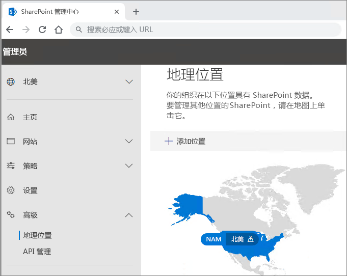

# Microsoft 365 多地理位置租户配置

配置 Microsoft 365 多地理位置租户前，请务必先阅读[计划使用 Microsoft 365 多地理位置](plan-for-multi-geo.md)。 若要执行本文中的步骤，需要列出要作为附属位置启用的地理位置，以及要为这些位置预配的测试用户。

## 将“Microsoft 365 中的多地理位置功能”计划添加到租户

若要使用 Microsoft 365 多地理位置，需要有“_Microsoft 365 中的多地理位置功能_”计划。 与帐户团队合作，以向租户添加此计划。 帐户团队会让你与相应的许可专家联系，并配置你的租户。

Note that the _Multi-Geo Capabilities in Microsoft 365_ plan are a user-level service plan. You need a license for each user that you want to host in a satellite location. You can add more licenses over time as you add users in satellite locations.

在为租户预配了“_Microsoft 365 中的多地理位置功能_”计划后，便能在 OneDrive 和 SharePoint 管理中心内使用“**地理位置**”选项卡。

## 向租户添加附属位置

必须为要存储数据的每个地理位置添加附属位置。 下表列出了可用的地理位置：

[!INCLUDE [Microsoft 365 Multi-Geo locations](includes/office-365-multi-geo-locations.md)]

添加附属位置的具体步骤

1. 打开 SharePoint 管理中心。

2. 导航到“地理位置”**** 选项卡。

3. 单击“添加位置”****。

4. 选择要添加的位置，然后单击“下一步”****。

5. 键入想要与地理位置一同使用的域，然后单击“添加”****。

6. 单击“关闭”****。

Provisioning may take from a few hours up to 72 hours, depending on the size of your tenant. Once provisioning of a satellite location has completed, you will receive an email confirmation. When the new geo location appears in blue on the map on the **Geo locations** tab in the OneDrive admin center, you can proceed to set users' preferred data location to that geo location. 

> [!IMPORTANT]
> Your new satellite location will be set up with default settings. This will allow you to configure that satellite location as appropriate for your local compliance needs.

## 设置用户的首选数据位置
 

Once you enable the needed satellite locations, you can update your user accounts to use the appropriate preferred data location. We recommend that you set a preferred data location for every user, even if that user is staying in the central location.

> [!IMPORTANT]
> 如果用户的首选数据位置设置为未配置为附属位置或中心位置的位置，系统会在预配 OneDrive 和 SharePoint 网站以及组邮箱时，默认使用中心位置。

> [!TIP]
> 建议先使用测试用户或少量用户进行验证，再在组织内更广泛地推出多地理位置功能。

在 Azure Active Directory (Azure AD) 中，有以下两种类型的用户对象：仅限云用户和同步用户。 请按照用户类型对应的说明操作。

### 使用 Azure AD Connect 同步用户的首选数据位置 

如果公司的用户是从本地 Active Directory 系统同步到 Azure AD 的，则其 PreferredDataLocation 必须填充在 AD 中并同步到 Azure AD。

请按照 [Azure Active Directory Connect 同步：配置 Microsoft 365 资源的首选数据位置](/azure/active-directory/hybrid/how-to-connect-sync-feature-preferreddatalocation)中的流程配置从本地 Active Directory 域服务 (AD DS) 到 Azure AD 的首选数据位置同步。

建议在标准用户创建工作流中设置用户的首选数据位置。

> [!IMPORTANT]
> 对于未预配 OneDrive 的新用户，请在将用户的 PDL 同步到 Azure AD 之后至少等待 24 小时，以便在用户登录 OneDrive for Business 之前传播更改。 （在用户登录预配 OneDrive for Business 前设置首选数据位置，可确保在正确的位置中预配用户的新 OneDrive。）

### 设置仅限云用户的首选数据位置 

如果公司的用户不是从本地 Active Directory 系统同步到 Azure Active Directory 的，这意味着他们是在 Microsoft 365 或 Azure AD 中创建的，必须使用用于 Windows PowerShell 的 Microsoft Azure Active Directory 模块设置 PDL。

完成本部分的程序需要使用[用于 Windows PowerShell 的 Microsoft Azure Active Directory 模块](https://www.powershellgallery.com/packages/MSOnline/1.1.166.0)。 如果已安装此模块，请确保更新到最新版本。

1.  使用针对你的租户的一组全局管理员凭据进行[连接并登录](/powershell/connect-to-office-365-powershell.md#connect-with-the-microsoft-azure-active-directory-module-for-windows-powershell)。

2.  Use the [Set-MsolUser](https://docs.microsoft.com/powershell/msonline/v1/set-msoluser) cmdlet to set the preferred data location for each of your users. For example:

    `Set-MsolUser -userprincipalName Robyn.Buckley@Contoso.com -PreferredDatalocation EUR`

    You can check to confirm that the preferred data location was updated properly by using the Get-MsolUser cmdlet. For example:

    `(Get-MsolUser -userprincipalName Robyn.Buckley@Contoso.com).PreferredDatalocation`

建议在标准用户创建工作流中设置用户的首选数据位置。

> [!IMPORTANT]
> 对于未预配 OneDrive 的新用户，请在设置用户的 PDL 之后至少等待 24 小时，以便在用户登录 OneDrive 之前传播更改。 （在用户登录预配 OneDrive for Business 前设置首选数据位置，可确保在正确的位置中预配用户的新 OneDrive。）

## OneDrive 设置和 PDL 效果

如果用户已有在租户中创建的 OneDrive 网站，设置用户 PDL 不会自动移动他们的现有 OneDrive。 若要移动用户的 OneDrive，请参阅 [OneDrive for Business 异地移动](move-onedrive-between-geo-locations.md)，并按照“在地理位置之间移动 OneDrive”中的说明操作。 （请注意，用户的 Exchange 邮箱不会在你设置用户的 PDL 后自动移动。）

如果用户在租户内没有 OneDrive 网站，将会根据用户的 PDL 值为他们预配 OneDrive，假定用户的 PDL 与公司的附属位置之一匹配。

## 配置多地理位置搜索

你的多地理位置租户将具有聚合搜索功能，允许搜索查询从租户中的任何位置返回结果。

默认情况下，即使每个搜索索引位于其相关地理位置中，这些入口点的搜索也会返回聚合结果：

- OneDrive for Business

- Delve

- SharePoint 主页

- 搜索中心

此外，可为使用 SharePoint 搜索 API 的自定义搜索应用程序配置多地理位置搜索功能。

有关说明（包括任何限制和差异），请查看[为 OneDrive for Business 多地理位置配置搜索](configure-search-for-multi-geo.md)。

## 验证 Microsoft 365 多地理位置配置

下面是建议在公司中更广泛地推出 Microsoft 365 多地理位置前，在验证计划中添加的一些基本用例。 完成这些测试以及与公司相关的其他任何用例后，可以选择继续在初始试点组中添加用户。

**OneDrive for Business**

从 Microsoft 365 应用启动器中选择“OneDrive”，并确认是否自动定向到用户的相应地理位置（以用户 PDL 为依据）。 OneDrive for Business 现在应该开始在相应位置进行预配。 预配后，立即尝试上传并下载一些文档。

**OneDrive 移动应用**

使用测试帐户凭据登录到 OneDrive 移动应用。 确认你可以看到 OneDrive for Business 文件，并可以通过移动设备与它们进行交互。

**OneDrive 同步客户端**

Confirm that the OneDrive sync client automatically detects your OneDrive for Business geo location upon login. If you need to download the sync client, you can click **Sync** in the OneDrive library.

**Office 应用程序**

Confirm that you can access OneDrive for Business by logging in from an Office application, such as Word. Open the Office application and select "OneDrive – <TenantName>". Office will detect your OneDrive location and show you the files that you can open.

**共享**

Try sharing OneDrive files. Confirm that the people picker shows you all your SharePoint online users regardless of their geo location.
