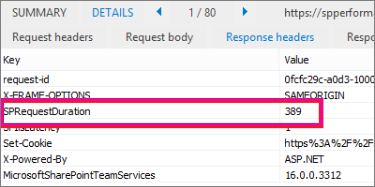
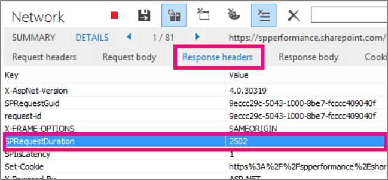

# <a name="navigation-options-for-sharepoint-online"></a>SharePoint Online 的导航选项

本文介绍 SharePoint Online 中启用了 SharePoint 发布的导航选项网站。 导航的选择和配置会显著影响 SharePoint Online 中的网站的性能和可伸缩性。

## <a name="overview"></a>概述

导航提供程序配置会显著影响整个网站的性能, 并且必须仔细考虑选择一个导航提供程序和配置, 以便有效地扩展以满足 SharePoint 网站的要求。 有两个现成的导航提供程序, 以及自定义导航实现。

建议使用第一个选项 "[**托管 (元数据) 导航**](#using-managed-navigation-and-metadata-in-sharepoint-online)", 这是 SharePoint Online 中的默认选项之一;但是, 建议禁用安全修整, 除非需要。 将安全修整启用为此导航提供程序的默认安全设置;但是, 许多网站不需要安全修整的开销, 因为导航元素通常对网站的所有用户都是一致的。 使用建议的配置禁用安全修整后, 此导航提供程序不需要枚举网站结构, 且高度可扩展, 性能影响可接受。

第二个选项是[**结构导航**](#using-structural-navigation-in-sharepoint-online),**在 SHAREPOINT Online 中不是一个推荐的导航选项**。 此导航提供程序是为本地拓扑设计的, 在 SharePoint Online 中支持有限。 虽然它提供了一些额外的功能集, 而不是其他导航选项, 但这些功能 (包括安全修整和网站结构枚举) 的成本是过多的服务器调用, 并且会在使用时影响可伸缩性和性能。 使用占用过多资源的 structed 导航的网站可能会受到限制。

除了现成的导航提供程序之外, 许多客户还成功实现了替代的自定义导航实现。 自定义导航实现的一个常见类涵盖了用于存储导航节点的本地缓存的客户端呈现的设计模式。 (请参阅本文中的**[搜索驱动的客户端脚本](#using-search-driven-client-side-scripting)**。)

这些导航提供程序具有以下几个主要优势: 
- 它们通常适用于响应页面设计。
- 它们的可伸缩性和性能极高, 因为它们在呈现时无需资源成本 (并在超时后在后台进行刷新)。 
- 这些导航提供程序可以使用各种策略检索导航数据, 范围从简单静态配置到各种动态数据提供程序。 

数据提供程序的一个示例是使用**搜索驱动的导航**, 这样可以灵活地枚举导航节点和有效处理安全修整。 

有其他常用选项可用于生成**自定义导航提供程序**。 请查看[SharePoint Online 门户导航解决方案](https://docs.microsoft.com/sharepoint/dev/solution-guidance/portal-navigation), 以获取有关构建自定义导航提供程序的详细指南。
  
## <a name="pros-and-cons-of-sharepoint-online-navigation-options"></a>SharePoint Online 导航选项的优点和缺点

下表总结了每个选项的优点和缺点。 


|托管导航  |结构导航  |搜索驱动的导航  |自定义导航提供程序  |
|---------|---------|---------|---------|
|供<br/><br/>易于维护<br/>推荐选项<br/>     |供<br/><br/>易于配置<br/>安全修整<br/>添加内容时自动更新<br/>|供<br/><br/>安全修整<br/>添加网站时自动更新<br/>快速加载时间和本地缓存导航结构<br/>|供<br/><br/>可用选项的更宽选择<br/>正确使用缓存时的快速加载<br/>许多选项在使用快速响应页面设计时非常有效<br/>|
|消耗<br/><br/>不会自动更新以反映网站结构<br/>如果启用了安全修整, 则会影响性能<br/>|消耗<br/><br/>**不建议**<br/>**影响性能和可伸缩性**<br/>**受限制的主题**<br/>|消耗<br/><br/>无法轻松订购网站<br/>需要自定义母版页 (需要技术技能)<br/>|消耗<br/><br/>需要进行自定义开发<br/>需要存储外部数据源/缓存, 例如 Azure<br/>|

最适合您的网站的选项取决于您的网站要求和您的技术能力。 如果您需要一个可扩展的现成导航提供程序, 则禁用安全修整的托管导航是一个非常不错的选择。 

托管导航选项可通过配置进行维护, 不涉及代码自定义文件, 并且比结构导航快得多。 如果您需要安全修整并且能够使用自定义母版页, 并且组织中有一些功能来维护在 SharePoint Online 的默认母版页中可能发生的更改, 则搜索驱动的选项可能会产生更好的效果用户体验。 如果您具有更复杂的要求, 则自定义导航提供程序可能是正确的选择。 不建议使用结构导航。

最后, 请务必注意, SharePoint 正在为新式 SharePoint 网站体系结构添加更多导航提供程序和功能, 以利用更平展的网站层次结构和包含 SharePoint 中心网站的中心辐射型模型。 这允许实现许多不需要使用 SharePoint 发布功能的方案, 并且这些导航配置针对 SharePoint Online 中的可伸缩性和延迟进行了优化。 请注意, 应用相同的原则-将 SharePoint 发布网站的整体结构简化为更简单的结构, 通常也有助于整体性能和规模的扩展。 这意味着, 它不是拥有数百个网站 (子网站) 的单个网站集, 更好的方法是拥有很少子网站 (子网站) 的多个网站集。


## <a name="using-managed-navigation-and-metadata-in-sharepoint-online"></a>在 SharePoint Online 中使用托管导航和元数据

托管导航是另一个现成的选项, 您可以使用它来重新创建大部分与结构导航相同的功能。 可将托管元数据配置为启用或禁用安全修整。 在禁用安全修整的情况下进行配置时, 托管导航相当高效, 因为它会加载具有固定数量的服务器调用的所有导航链接。 但是, 启用安全修整会对托管导航的一些优势产生否定, 客户可以选择浏览其中一个自定义导航解决方案, 以实现最佳性能和可伸缩性。

许多网站不需要安全修整, 因为导航结构通常对网站的所有用户都是一致的。 如果禁用安全修整并向导航添加了一个不是所有用户都有权访问的链接, 则该链接仍将显示, 但会导致访问被拒绝消息。 对内容的意外访问没有风险。

### <a name="how-to-implement-managed-navigation-and-the-results"></a>如何实现托管导航和结果

有关托管导航的详细信息, 请参阅 Docs.Microsoft.com 的几篇文章, 例如, 请参阅[SharePoint Server 中的托管导航概述](https://docs.microsoft.com/sharepoint/administration/overview-of-managed-navigation)。

为了实现托管导航, 请使用与网站的导航结构相对应的 Url 设置术语。 在许多情况下, 甚至可以手动 curated 托管导航以替换结构导航。 例如：


下面的示例展示了使用托管导航的复杂导航的性能。



与结构导航方法相比, 使用托管导航可一致地提高性能。
  
## <a name="using-structural-navigation-in-sharepoint-online"></a>在 SharePoint Online 中使用结构导航

这是默认情况下使用的现成导航, 它是最简单的解决方案, 但这是一种昂贵的性能平衡。 它不需要任何自定义设置, 非技术性用户也可以轻松地添加项目、隐藏项目以及从 "设置" 页面管理导航。 这也适用于托管导航, 因此建议使用托管导航, 因为也可以轻松地管理和控制这些功能, 并提高性能。


  
### <a name="turning-on-structural-navigation-in-sharepoint-online"></a>在 SharePoint Online 中打开结构导航

演示如何在结构化导航和 "显示子网站" 选项处于打开状态的标准 SharePoint Online 解决方案中进行性能。 下面是在 "页面**网站设置** \> "**导航**中找到的设置的屏幕截图。
  

  
### <a name="analyzing-structural-navigation-performance-in-sharepoint-online"></a>在 SharePoint Online 中分析结构导航性能

若要分析 SharePoint 页面的性能, 请使用 Internet Explorer 中的 F12 开发人员工具的 "**网络**" 选项卡。 
  

  
1. 在 "**网络**" 选项卡上, 单击要加载的 .aspx 页面, 然后单击 "**详细信息**" 选项卡。<br/> <br/>
2. 单击 "**响应头**"。 <br/><br/>SharePoint 在其响应标头中返回一些有用的诊断信息。 
3. 最有用的信息片段之一是**SPRequestDuration** , 这是在服务器上处理请求所需时间的值 (以毫秒为单位)。 在以下屏幕截图中, 将取消选中结构导航的**子网站**。 这意味着全局导航中只有 "网站集" 链接:<br/><br/>
4. **SPRequestDuration**项的值为245毫秒。 这表示返回请求所花的时间。 由于网站上只有一个导航项, 因此这是在不进行大量导航的情况下, SharePoint Online 执行方式的一个很好的基准。 下一个屏幕截图显示了如何将子网站中的添加影响此项。<br/><br/>
  
添加子网站会显著增加为此相对简单的示例网站返回页面请求所需的时间。 复杂的网站层次结构 (包括导航中的页面) 和其他配置和拓扑选项可能会显著增加此影响。

## <a name="using-search-driven-client-side-scripting"></a>使用搜索驱动的客户端脚本

使用搜索可以利用连续爬网在后台中构建的索引。 搜索结果从搜索索引中提取, 结果将进行安全修整。 当需要安全修整时, 这通常比现成的导航提供程序更快。 使用搜索结构导航, 尤其是在您有复杂的网站结构时, 将会显著加快页面加载时间。 此优先于托管导航的主要优势是, 您可以从安全修整中获益。

此方法涉及到创建自定义母版页并将现成的导航代码替换为自定义 HTML。 按照以下示例中概述的此过程操作, 以替换文件`seattle.html`中的导航代码。 在此示例中, 将打开`seattle.html`文件, 并将整个元素`id=”DeltaTopNavigation”`替换为自定义 HTML 代码。

### <a name="example-replace-the-out-of-the-box-navigation-code-in-a-master-page"></a>示例: 将现成的导航代码替换为母版页

1.  导航到 "网站设置" 页。
2.  通过单击 "**母版页**" 打开母版页样式库。
3.  从这里, 您可以在库中导航并下载该`seattle.master`文件。
4.  使用文本编辑器编辑代码, 并删除以下屏幕截图中的代码块。<br/><br/>
5. 删除`<SharePoint:AjaxDelta id=”DeltaTopNavigation”>`和`<\SharePoint:AjaxDelta>`标记之间的代码, 并将其替换为以下代码段:<br/>

```
<div id="loading">
  <!--Replace with path to loading image.-->
  <div style="background-image: url(''); height: 22px; width: 22px; ">
  </div>
</div>
<!-- Main Content-->
<div id="navContainer" style="display:none">
    <div data-bind="foreach: hierarchy" class="noindex ms-core-listMenu-horizontalBox">
        <a class="dynamic menu-item ms-core-listMenu-item ms-displayInline ms-navedit-linkNode" data-bind="attr: { href: item.Url, title: item.Title }">
            <span class="menu-item-text" data-bind="text: item.Title">
            </span>
        </a>
        <ul id="menu" data-bind="foreach: $data.children" style="padding-left:20px">
            <li class="static dynamic-children level1">
                <a class="static dynamic-children menu-item ms-core-listMenu-item ms-displayInline ms-navedit-linkNode" data-bind="attr: { href: item.Url, title: item.Title }">
               
                 <!-- ko if: children.length > 0-->
                    <span aria-haspopup="true" class="additional-background ms-navedit-flyoutArrow dynamic-children">
                        <span class="menu-item-text" data-bind="text: item.Title">
                        </span>
                    </span>
                <!-- /ko -->
                <!-- ko if: children.length == 0-->   
                    <span aria-haspopup="true" class="ms-navedit-flyoutArrow dynamic-children">
                        <span class="menu-item-text" data-bind="text: item.Title">
                        </span>
                    </span>
                <!-- /ko -->   
                </a>
               
                <!-- ko if: children.length > 0-->                                                       
                <ul id="menu"  data-bind="foreach: children;" class="dynamic  level2" >
                    <li class="dynamic level2">
                        <a class="dynamic menu-item ms-core-listMenu-item ms-displayInline  ms-navedit-linkNode" data-bind="attr: { href: item.Url, title: item.Title }">
         
          <!-- ko if: children.length > 0-->
          <span aria-haspopup="true" class="additional-background ms-navedit-flyoutArrow dynamic-children">
           <span class="menu-item-text" data-bind="text: item.Title">
           </span>
          </span>
           <!-- /ko -->
          <!-- ko if: children.length == 0-->
          <span aria-haspopup="true" class="ms-navedit-flyoutArrow dynamic-children">
           <span class="menu-item-text" data-bind="text: item.Title">
           </span>
          </span>                 
          <!-- /ko -->   
                        </a>
          <!-- ko if: children.length > 0-->
         <ul id="menu" data-bind="foreach: children;" class="dynamic level3" >
          <li class="dynamic level3">
           <a class="dynamic menu-item ms-core-listMenu-item ms-displayInline ms-navedit-linkNode" data-bind="attr: { href: item.Url, title: item.Title }">
            <span class="menu-item-text" data-bind="text: item.Title">
            </span>
           </a>
          </li>
         </ul>
           <!-- /ko -->
                    </li>
                </ul>
                <!-- /ko -->
            </li>
        </ul>
    </div>
</div>
```
<br/>
6. 使用网站集中加载图像的链接替换开头的加载图像定位标记中的 URL。 进行更改后, 请重命名该文件, 然后将其上传到母版页样式库。 这将生成一个新的 .master 文件。<br/>
7. 此 HTML 是由 JavaScript 代码返回的搜索结果将填充的基本标记。 您需要编辑代码以更改 var root = "网站集 URL" 的值, 如以下代码段所示:<br/>

```
var root = “https://spperformance.sharepoint.com/sites/NavigationBySearch”;
```
<br/>
8. 将结果分配给 self。节点数组, 并使用使用 linq 将输出分配给数组 self 层次结构的对象生成层次结构。 此数组是绑定到 HTML 的对象。 这是通过将 self 对象传递给 applyBinding () 函数在 toggleView () 函数中完成的。<br/>然后, 这会将层次结构数组绑定到以下 HTML:<br/>

```
<div data-bind=”foreach: hierarchy” class=”noindex ms-core-listMenu-horizontalBox”>
```

和的事件处理程序将被添加到顶级导航中, 以处理在`addEventsToElements()`函数中完成的子网站下拉菜单。 `mouseexit` `mouseenter`

在复杂的导航示例中, 没有本地缓存的新页面加载将显示服务器上所用的时间已从基准结构导航中减少, 以获取与托管导航方法类似的结果。

### <a name="about-the-javascript-file"></a>有关 JavaScript 文件 .。。

整个 JavaScript 文件如下所示:

```
//Models and Namespaces
var SPOCustom = SPOCustom || {};
SPOCustom.Models = SPOCustom.Models || {}
SPOCustom.Models.NavigationNode = function () {

    this.Url = ko.observable("");
    this.Title = ko.observable("");
    this.Parent = ko.observable("");

};

var root = "https://spperformance.sharepoint.com/sites/NavigationBySearch";
var baseUrl = root + "/_api/search/query?querytext=";
var query = baseUrl + "'contentClass=\"STS_Web\"+path:" + root + "'&trimduplicates=false&rowlimit=300";

var baseRequest = {
    url: "",
    type: ""
};


//Parses a local object from JSON search result.
function getNavigationFromDto(dto) {
    var item = new SPOCustom.Models.NavigationNode();
    if (dto != undefined) {

        var webTemplate = getSearchResultsValue(dto.Cells.results, 'WebTemplate');

        if (webTemplate != "APP") {
            item.Title(getSearchResultsValue(dto.Cells.results, 'Title')); //Key = Title
            item.Url(getSearchResultsValue(dto.Cells.results, 'Path')); //Key = Path
            item.Parent(getSearchResultsValue(dto.Cells.results, 'ParentLink')); //Key = ParentLink
        }

    }
    return item;
}

function getSearchResultsValue(results, key) {

    for (i = 0; i < results.length; i++) {
        if (results[i].Key == key) {
            return results[i].Value;
        }
    }
    return null;
}

//Parse a local object from the serialized cache.
function getNavigationFromCache(dto) {
    var item = new SPOCustom.Models.NavigationNode();

    if (dto != undefined) {

        item.Title(dto.Title);
        item.Url(dto.Url);
        item.Parent(dto.Parent);
    }

    return item;
}

/* create a new OData request for JSON response */
function getRequest(endpoint) {
    var request = baseRequest;
    request.type = "GET";
    request.url = endpoint;
    request.headers = { ACCEPT: "application/json;odata=verbose" };
    return request;
};

/* Navigation Module*/
function NavigationViewModel() {
    "use strict";
    var self = this;
    self.nodes = ko.observableArray([]);
    self.hierarchy = ko.observableArray([]);;
    self.loadNavigatioNodes = function () {
        //Check local storage for cached navigation datasource.
        var fromStorage = localStorage["nodesCache"];
        if (false) {
            var cachedNodes = JSON.parse(localStorage["nodesCache"]);

            if (cachedNodes && timeStamp) {
                //Check for cache expiration. Currently set to 3 hrs.
                var now = new Date();
                var diff = now.getTime() - timeStamp;
                if (Math.round(diff / (1000 * 60 * 60)) < 3) {

                    //return from cache.
                    var cacheResults = [];
                    $.each(cachedNodes, function (i, item) {
                        var nodeitem = getNavigationFromCache(item, true);
                        cacheResults.push(nodeitem);
                    });

                    self.buildHierarchy(cacheResults);
                    self.toggleView();
                    addEventsToElements();
                    return;
                }
            }
        }
        //No cache hit, REST call required.
        self.queryRemoteInterface();
    };

    //Executes a REST call and builds the navigation hierarchy.
    self.queryRemoteInterface = function () {
        var oDataRequest = getRequest(query);
        $.ajax(oDataRequest).done(function (data) {
            var results = [];
            $.each(data.d.query.PrimaryQueryResult.RelevantResults.Table.Rows.results, function (i, item) {

                if (i == 0) {
                    //Add root element.
                    var rootItem = new SPOCustom.Models.NavigationNode();
                    rootItem.Title("Root");
                    rootItem.Url(root);
                    rootItem.Parent(null);
                    results.push(rootItem);
                }
                var navItem = getNavigationFromDto(item);
                results.push(navItem);
            });
            //Add to local cache
            localStorage["nodesCache"] = ko.toJSON(results);

            localStorage["nodesCachedAt"] = new Date().getTime();
            self.nodes(results);
            if (self.nodes().length > 0) {
                var unsortedArray = self.nodes();
                var sortedArray = unsortedArray.sort(self.sortObjectsInArray);

                self.buildHierarchy(sortedArray);
                self.toggleView();
                addEventsToElements();
            }
        }).fail(function () {
            //Handle error here!!
            $("#loading").hide();
            $("#error").show();
        });
    };
    self.toggleView = function () {
        var navContainer = document.getElementById("navContainer");
        ko.applyBindings(self, navContainer);
        $("#loading").hide();
        $("#navContainer").show();

    };
    //Uses linq.js to build the navigation tree.
    self.buildHierarchy = function (enumerable) {
        self.hierarchy(Enumerable.From(enumerable).ByHierarchy(function (d) {
            return d.Parent() == null;
        }, function (parent, child) {
            if (parent.Url() == null || child.Parent() == null)
                return false;
            return parent.Url().toUpperCase() == child.Parent().toUpperCase();
        }).ToArray());

        self.sortChildren(self.hierarchy()[0]);
    };


    self.sortChildren = function (parent) {

        // sjip processing if no children
        if (!parent || !parent.children || parent.children.length === 0) {
            return;
        }

        parent.children = parent.children.sort(self.sortObjectsInArray2);

        for (var i = 0; i < parent.children.length; i++) {
            var elem = parent.children[i];

            if (elem.children && elem.children.length > 0) {
                self.sortChildren(elem);
            }
        }
    };

    // ByHierarchy method breaks the sorting in chrome and firefix 
    // we need to resort  as ascending
    self.sortObjectsInArray2 = function (a, b) {
        if (a.item.Title() > b.item.Title())
            return 1;
        if (a.item.Title() < b.item.Title())
            return -1;
        return 0;
    };


    self.sortObjectsInArray = function (a, b) {
        if (a.Title() > b.Title())
            return -1;
        if (a.Title() < b.Title())
            return 1;
        return 0;
    }
}

//Loads the navigation on load and binds the event handlers for mouse interaction.
function InitCustomNav() {
    var viewModel = new NavigationViewModel();
    viewModel.loadNavigatioNodes();
}

function addEventsToElements() {
    //events.
      $("li.level1").mouseover(function () {
          var position = $(this).position();
          $(this).find("ul.level2").css({ width: 100, left: position.left + 10, top: 50 });
      })
   .mouseout(function () {
     $(this).find("ul.level2").css({  left: -99999, top: 0 });
   
    });
   
     $("li.level2").mouseover(function () {
          var position = $(this).position();
          console.log(JSON.stringify(position));
          $(this).find("ul.level3").css({ width: 100, left: position.left + 95, top:  position.top});
      })
   .mouseout(function () {
     $(this).find("ul.level3").css({  left: -99999, top: 0 });
    });
} _spBodyOnLoadFunctionNames.push("InitCustomNav");

``` 

若要汇总上面的`jQuery $(document).ready`函数中显示的`viewModel object`代码, 则表示已创建, `loadNavigationNodes()`然后调用该对象上的函数。 此函数会加载以前在客户端浏览器的 HTML5 本地存储中存储的导航层次结构, 或者调用该`queryRemoteInterface()`函数。

`QueryRemoteInterface()`生成一个请求, 并`getRequest()`将该函数与脚本中先前定义的查询参数一起使用, 然后从服务器返回数据。 此数据实质上是网站集中所有网站的数组, 这些网站表示为具有各种属性的数据传输对象。 

然后, 将此数据解析为之前定义`SPO.Models.NavigationNode`的对象, `Knockout.js`这些对象使用创建可观察到的属性以供将值绑定到我们之前定义的 HTML 中的数据。 

然后, 将这些对象放入结果数组中。 使用挖空将此数组解析为 JSON, 并将其存储在本地浏览器存储中, 以改进将来页面加载的性能。

### <a name="benefits-of-this-approach"></a>此方法的优点

[此方法](#example-replace-the-out-of-the-box-navigation-code-in-a-master-page)的一个主要优点是, 通过使用 HTML5 本地存储, 在下次加载页面时, 将为用户本地存储导航。 我们从使用搜索 API 进行结构导航中获得重大性能改进;但是, 它需要一些技术功能来执行和自定义此功能。 

在[示例实现](#example-replace-the-out-of-the-box-navigation-code-in-a-master-page)中, 网站的排序方式与开箱即用的结构导航相同;字母顺序。 如果您想要与此订单有偏离之处, 则开发和维护会更复杂。 此外, 此方法还需要您从受支持的母版页中偏离。 如果不维护自定义母版页, 则网站将错过 Microsoft 对母版页所做的更新和改进。

[上面的代码](#about-the-javascript-file)具有以下依赖项:

- jQueryhttp://jquery.com/
- KnockoutJS -http://knockoutjs.com/
- http://linqjs.codeplex.com/Linq 或 github.com/neuecc/linq.js

当前版本的 LinqJS 不包含在上面的代码中使用的 ByHierarchy 方法, 将断开导航代码。 若要解决此问题, 请将以下方法添加到行`Flatten: function ()`之前的 Linq 文件中。

```
ByHierarchy: function(firstLevel, connectBy, orderBy, ascending, parent) {
     ascending = ascending == undefined ? true : ascending;
     var orderMethod = ascending == true ? 'OrderBy' : 'OrderByDescending';
     var source = this;
     firstLevel = Utils.CreateLambda(firstLevel);
     connectBy = Utils.CreateLambda(connectBy);
     orderBy = Utils.CreateLambda(orderBy);
    
     //Initiate or increase level
     var level = parent === undefined ? 1 : parent.level + 1;

    return new Enumerable(function() {
         var enumerator;
         var index = 0;

        var createLevel = function() {
                 var obj = {
                     item: enumerator.Current(),
                     level : level
                 };
                 obj.children = Enumerable.From(source).ByHierarchy(firstLevel, connectBy, orderBy, ascending, obj);
                 if (orderBy !== undefined) {
                     obj.children = obj.children[orderMethod](function(d) {
                         return orderBy(d.item); //unwrap the actual item for sort to work
                     });
                 }
                 obj.children = obj.children.ToArray();
                 Enumerable.From(obj.children).ForEach(function(child) {
                     child.getParent = function() {
                         return obj;
                     };
                 });
                 return obj;
             };

        return new IEnumerator(

        function() {
             enumerator = source.GetEnumerator();
         }, function() {
             while (enumerator.MoveNext()) {
                 var returnArr;
                 if (!parent) {
                     if (firstLevel(enumerator.Current(), index++)) {
                         return this.Yield(createLevel());
                     }

                } else {
                     if (connectBy(parent.item, enumerator.Current(), index++)) {
                         return this.Yield(createLevel());
                     }
                 }
             }
             return false;
         }, function() {
             Utils.Dispose(enumerator);
         })
     });
 },

```
  
## <a name="related-topics"></a>相关主题

[SharePoint Server 中的托管导航概述](https://docs.microsoft.com/sharepoint/administration/overview-of-managed-navigation)

