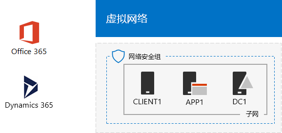

# Office 365 和 Dynamics 365 开发/测试环境Office 365 and Dynamics 365 dev/test environment

 **摘要：** 使用此测试实验室指南 Dynamics 365 添加到 Office 365 开发/测试环境。**Summary:** Use this Test Lab Guide to add Dynamics 365 to your Office 365 dev/test environment.
  
使用本文中的说明进行操作，将 Dynamics 365 试用订阅作为 Office 365 开发/测试环境添加到同一个组织，创建一个 Office 365 和 Dynamics 365 开发/测试环境。With the instructions in this article, you add a Dynamics 365 trial subscription to the same organization as your Office 365 dev/test environment, creating an Office 365 and Dynamics 365 dev/test environment.

  
  
可将 Dynamics 365 试用订阅用于演示 Dynamics 365 的功能和特性。Dynamics 365 计划 1（企业版试用）包括以下解决方案：You can use a Dynamics 365 trial subscription to demonstrate features and capabilities of Dynamics 365. The following solutions are included with a Dynamics 365 Plan 1, Enterprise Edition trial:
  
- [Microsoft Dynamics 365 销售的](https://www.microsoft.com/dynamics365/sales)。增加自动化和数字智能帮助您保持重点和工作效率的销售人员与销售。[Microsoft Dynamics 365 for Sales](https://www.microsoft.com/dynamics365/sales). Increase your sales with automation and digital intelligence helping your salespeople stay focused and work smarter.
    
- [Microsoft Dynamics 365 客户服务](https://www.microsoft.com/dynamics365/customer-service)。通过授予您的代理的完整信息和提供无缝服务所需的数字智能获得会员。[Microsoft Dynamics 365 for Customer Service](https://www.microsoft.com/dynamics365/customer-service). Earn loyalty by giving your agents the complete information and digital intelligence they need to provide seamless service.
    
- [Microsoft Dynamics 365 域服务](https://www.microsoft.com/dynamics365/field-service)。通过优化您计划、 安装您的员工，以及使用预测工具来提高利润主机服务呼叫。[Microsoft Dynamics 365 for Field Service](https://www.microsoft.com/dynamics365/field-service). Master the service call by optimizing your schedules, equipping your workforce, and using predictive tools to increase profit.
    
- [Microsoft Dynamics 365 项目服务自动化](https://www.microsoft.com/en-us/dynamics365/project-service-automation)。成功完成项目并与提高生产效率的员工和智能工具创建利润关系。[Microsoft Dynamics 365 for Project Service Automation](https://www.microsoft.com/en-us/dynamics365/project-service-automation). Complete your projects successfully and create profitable relationships with productive employees and intelligent tools.
    
可以浏览上述一个或多个网站以获取 Dynamics 365 试用订阅。You can explore one or more of the above for your Dynamics 365 trial subscription.
  

  
> [!TIP]
> 单击[此处](http://aka.ms/catlgstack)可直观映射到 One Microsoft 云测试实验室指南堆栈中的所有文章。Click [here](http://aka.ms/catlgstack) for a visual map to all the articles in the One Microsoft Cloud Test Lab Guide stack.
  
## 第 1 阶段：构建轻型或模拟的企业 Office 365 开发/测试环境Phase 1: Build out your lightweight or simulated enterprise Office 365 dev/test environment

如果您只想要测试 Office 365 和 Dynamics 365 轻型方式的最低要求，请在阶段 2 和 3 的[Office 365 开发/测试环境](office-365-dev-test-environment.md)按照的说明。If you just want to test Office 365 and Dynamics 365 in a lightweight way with the minimum requirements, follow the instructions in phases 2 and 3 of [Office 365 dev/test environment](office-365-dev-test-environment.md).
  
如果您想要用于模拟企业测试 Office 365 和 Dynamics 365，请按照[目录同步的 Office 365 开发/测试环境](dirsync-for-your-office-365-dev-test-environment.md)中的说明。If you want to test Office 365 and Dynamics 365 for a simulated enterprise, follow the instructions in [DirSync for your Office 365 dev/test environment](dirsync-for-your-office-365-dev-test-environment.md).

  
> [!NOTE]
> 本文中的配置不需要模拟的企业开发/测试环境，该环境中包括连接到 Internet 的模拟内部网和 Windows Server AD 林的目录同步。它在此处作为一个选项提供，以便你可以测试 Office 365 和 Dynamics 365，并在代表典型组织的环境中对其进行试验。The configuration in this article does not require the simulated enterprise dev/test environment, which includes a simulated intranet connected to the Internet and directory synchronization for a Windows Server AD forest. It is provided here as an option so that you can experiment with Office 365 and Dynamics 365 in an environment that represents a typical organization. 
  
## 第 2 阶段：添加 Dynamics 365 试用订阅Phase 2: Add a Dynamics 365 trial subscription

在此阶段，注册 Dynamics 365 试用订阅，并将其作为 Office 365 试用订阅添加到同一组织。In this phase, you sign up for the Dynamics 365 trial subscription and add it to the same organization as your Office 365 trial subscription.
  
### 注册 Dynamics 365 试用订阅Sign up for a Dynamics 365 trial subscription

1. 在台式计算机 （轻型） 使用浏览器或从 CLIENT1 （模拟企业），登录到 Office 365 门户[https://portal.office.com](https://portal.office.com)的全局管理员帐户凭据。Using a browser on either your desktop computer (lightweight) or from CLIENT1 (simulated enterprise), sign in to the Office 365 portal at [https://portal.office.com](https://portal.office.com) with the credentials of your global administrator account.
    
2. 单击“管理”磁贴。Click the **Admin** tile.
    
3. 在**Office 管理中心**选项卡的的左侧窗格中，单击**帐单 > 购买服务**。On the **Office admin center** tab, in the left navigation, click **Billing > Purchase services**.
    
4. 在**购买服务**页上，找到**Dynamics 365 规划 1 Enterprise Edition**项目。将鼠标指针悬停在其上，单击**启动免费试用版**。On the **Purchase services** page, find the **Dynamics 365 Plan 1 Enterprise Edition** item. Hover your mouse pointer over it and click **Start free trial**.
    
5. 在“确认订单”页中，单击“立即试用”。On the **Confirm your order** page, click **Try now**.
    
6. 在“订单签收”页中，单击“继续”。On the **Order receipt** page, click **Continue**.

    
> [!NOTE]
> Dynamics 365 计划 1 企业版订阅试用期是 30 天。可以轻松地将该订阅的试用期再延长 30 天。对于永久性开发/测试环境，请使用少量许可证创建新的付费订阅。The Dynamics 365 Plan 1 Enterprise Edition trial subscription is 30 days. You can easily extend the trail subscription for another 30 days. For a permanent dev/test environment, create a new paid subscription with a small number of licenses. 
  
## 第 3 阶段：分配 Dynamics 365 许可证和系统管理员Phase 3: Assign Dynamics 365 licenses and system administrators

在此阶段中，将 Dynamics 365 许可证分配给全局管理员、用户 2 和用户 3 的帐户并使之成为系统管理员。In this phase, you assign Dynamics 365 licenses to the global administrator, User 2, and User 3 accounts and make them system administrators.
  
使用下列步骤分配 Dynamics 365 许可证。Use these steps to assign Dynamics 365 licenses.
  
1. 在**Office 管理中心**选项卡上单击**用户 > 活动用户**。On the **Office admin center** tab, click **Users > Active users**.
    
2. 在活动用户的列表中，单击您的全局管理员帐户，然后单击**产品**许可证的**编辑**。In the list of active users, click your global administrator account, and then click **Edit** for **Product licenses**.
    
3. **产品许可证**窗格中，打开产品许可证**Dynamics 365 规划 1 Enterprise Edition**到**上**，单击**保存**，然后单击**关闭**两次。On the **Product licenses** pane, turn the product license for **Dynamics 365 Plan 1 Enterprise Edition** to **On**, click **Save,** and then click **Close** twice.
    
4. 为用户 2 和用户 3 的帐户执行步骤 2 和步骤 3。Perform steps 2 and 3 for the User 2 and User 3 accounts.
    
5. 关闭**Office 管理中心**选项卡。Close the **Office admin center** tab.
    
使用以下步骤将用户 2 和用户 3 的帐户配置为 Dynamics 365 系统管理员。Use these steps to configure the User 2 and User 3 accounts as Dynamics 365 system administrators.
  
1. 从**Microsoft Office Home**选项卡，单击**管理**。From the **Microsoft Office Home** tab, click **Admin**.
    
2. **Office Admin center**选项卡上的的左侧窗格中，单击**管理中心**，，然后单击**Dynamics 365**。On the **Office Admin center** tab, in the left navigation, click **Admin centers**, and then click **Dynamics 365**.
    
    可能需要等到 Dynamics 365 完成预配后，菜单中才会显示 Dynamics 365。You may need to wait for Dynamics 365 to finish provisioning before Dynamics 365 appears in the menu.
    
3. 在 Dynamics 365 选项卡上，单击**所有这些**，，然后单击**完成安装。**On the Dynamics 365 tab, click **All of these**, and then click **Complete Setup.**
    
    等待设置完成。Wait for setup to complete.
    
    安装完成后，它会显示基于示例数据的一部分的线索订阅销售活动仪表板。花一些时间，以查看**欢迎您的试用版**视频。关闭视频窗口完成后。When setup completes, it displays a Sales Activity Dashboard based on sample data that is part of the trail subscription. Take a few moments to view the **Welcome to your trial** video. Close the video window when complete.
    
4. 在顶部工具栏中，单击**销售**旁边的向下箭头，单击**设置**，然后单击**安全**。On the toolbar at the top, click the down arrow next to **Sales**, click **Settings**, and then click **Security**.
    
5. 在**安全性**页上，单击**用户**。On the **Security** page, click **Users**.
    
6. 在用户的列表中，单击**用户 2**。In the list of users, click **User 2**.
    
7. 在工具栏中，单击**管理角色**。In the tool bar, click **Manage Roles**.
    
8. **管理角色**中,，单击**系统管理员联系**，然后单击**确定**。In **Manage Roles**, click **System Administrator**, and then click **OK**.
    
9. 在顶部工具栏中单击**安全性**。In the tool bar at the top click **Security**.
    
10. 为用户 3 帐户重复步骤 5 到 8。Repeat steps 5-8 for the User 3 account.
    
11. 关闭**用户： User3**选项卡。Close the **User: User3** tab.
    
> [!NOTE]
> 已为 Office 365 全局管理员帐户自动分配了 Dynamics 365 系统管理员角色。Your Office 365 global administrator account was automatically assigned the Dynamics 365 system administrator role. 
  
现在，你的 Office 365 和 Dynamics 365 开发/测试环境包含：Your Office 365 and Dynamics 365 dev/test environment now has:
  
- 与你的用户帐户列表共享同一个组织和相同 Azure AD 租户的 Office 365 E5 企业版和 Dynamics 365 试用订阅。Office 365 E5 Enterprise and Dynamics 365 trial subscriptions sharing the same organization and the same Azure AD tenant with your list of user accounts.
    
- 全局企业管理员、用户 2 和用户 3 的帐户都可以使用 Office 365 E5 企业版和 Dynamics 365，并且它们都是 Dynamics 365 系统管理员。Your global enterprise administrator, User 2, and User 3 accounts are enabled to use both Office 365 E5 Enterprise and Dynamics 365 and are Dynamics 365 system administrators.
    
## 后续步骤Next step

配置，然后说明如何 Office 365 和 Dynamics 365 结合使用[Office 365 和 Dynamics 365 开发/测试环境](exchange-online-integration-for-your-office-365-and-dynamics-365-dev-test-enviro.md)的 Exchange Online 集成在 Exchange Online 邮箱。Configure and then demonstrate how Office 365 and Dynamics 365 work together in Exchange Online mailboxes with [Exchange Online integration for your Office 365 and Dynamics 365 dev/test environment](exchange-online-integration-for-your-office-365-and-dynamics-365-dev-test-enviro.md).
  
## 另请参阅See Also

[云采用测试实验室指南 (TLG)Cloud adoption Test Lab Guides (TLGs)](cloud-adoption-test-lab-guides-tlgs.md)
  
[基础配置开发/测试环境Base Configuration dev/test environment](base-configuration-dev-test-environment.md)
  
[Office 365 开发/测试环境Office 365 dev/test environment](office-365-dev-test-environment.md)
  
[用于 Office 365 开发/测试环境的 DirSyncDirSync for your Office 365 dev/test environment](dirsync-for-your-office-365-dev-test-environment.md)

[Dynamics 365（联机）的订阅管理Subscription Management for Dynamics 365 (online)](https://technet.microsoft.com/library/jj679903.aspx)
  
[管理 Dynamics 365Administering Dynamics 365](https://technet.microsoft.com/library/dn531101.aspx)

