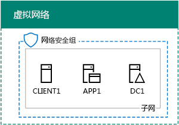

# <a name="office-365-devtest-environment"></a>Office 365 开发/测试环境

 **摘要：**此测试实验室指南用于创建 Office 365 提供试用版订购评估或开发/测试。
  
可以使用 Office 365 试用订阅并创建应用程序的 Office 365 开发/测试环境，或演示 Office 365 的特性和功能。有两个版本：
  
- 轻型 Office 365 开发/测试环境包含从你的主计算机进行访问的 Office 365 试用订阅。
    
    想在快速演示功能时使用此环境。对于轻量级的 Office 365 开发/测试环境，请完成本文中的阶段 2 和阶段 3。
    
- 模拟企业 Office 365 开发/测试环境包含一个 Office 365 试用订阅和一个连接到 Internet 的简化的组织 Intranet（托管在 Microsoft Azure 基础结构服务中）。你可以完全在云中生成此配置。
    
    在以下情况下使用此环境：演示功能，或演示类似于连接到 Internet 的典型的组织网络的环境中的应用，或演示需要此类环境的功能。对于模拟的企业 Office 365 开发/测试环境，请完成本文中的阶段 1、阶段 2 和阶段 3。
    
> [!NOTE]
> 不妨打印这篇文章，以便记录在 30 天的 Office 365 试用订阅期内需要对此环境使用的特定值。可以轻松地将该订阅的试用期再延长 30 天。对于永久性开发/测试环境，请使用少量许可证创建新的付费订阅。 
  

  
> [!TIP]
> 单击[此处](http://aka.ms/catlgstack)为可视化映射到一个 Microsoft 云测试实验室指南堆栈中的所有项目。
  
## <a name="phase-1-create-the-base-configuration-in-azure"></a>第 1 阶段：在 Azure 中创建基本配置

按照[基本配置开发/测试环境](base-configuration-dev-test-environment.md)中的说明进行操作。
  
您将需要 Azure 的订阅。对于此配置，可以使用[Azure 免费试用版](https://azure.microsoft.com/pricing/free-trial/)。如果您订阅了 MSDN 或 Visual Studio，请参见[为 Visual Studio 订户每月 Azure 信用](https://azure.microsoft.com/pricing/member-offers/msdn-benefits-details/)。
  
下面是生成的配置。
  

  
该配置包括 Azure 虚拟网络子网中的 DC1、APP1 和 CLIENT1 虚拟机。
  
## <a name="phase-2-create-an-office-365-trial-subscription"></a>第 2 阶段：创建 Office 365 试用订阅

要启动 Office 365 E5 试用订阅，你首先需要一个虚构公司名称和一个新的 Microsoft 帐户。
  
1. 我们建议，Contoso 的公司名称变量，该变量用于您公司的名称，它是 Microsoft 示例内容中使用虚构的公司，但它并不是必需。记录您的虚构公司名称: ___
    
2. 若要注册新的 Microsoft 帐户，转到[https://outlook.com](https://outlook.com)并使用新的电子邮件帐户和地址创建一个帐户。此帐户将用于注册 Office 365。
    
  - 在此记录新帐户的名字和姓氏：_______________________________
    
  - 在此记录新的电子邮件帐户地址：_____________________________@outlook.com
    
### <a name="sign-up-for-an-office-365-e5-trial-subscription"></a>注册 Office 365 E5 试用订阅

1. 轻量的 Office 365 开发/测试环境，打开互联网浏览器在您的计算机上，并转到[https://aka.ms/e5trial](https://aka.ms/e5trial)。 
    
    为模拟的企业 Office 365 的开发/测试环境：
    
  - 从[Azure 的门户](https://portal.azure.com)，连接到客户端 1 CORP 与\\User1 帐户。
    
  - 打开管理员级别的 Windows PowerShell 命令提示符，然后运行下面的命令：
    
  ```
  Set-ItemProperty -Path "HKLM:\\SOFTWARE\\Microsoft\\Active Setup\\Installed Components\\{A509B1A7-37EF-4b3f-8CFC-4F3A74704073}" -Name "IsInstalled" -Value 0
Set-ItemProperty -Path "HKLM:\\SOFTWARE\\Microsoft\\Active Setup\\Installed Components\\{A509B1A8-37EF-4b3f-8CFC-4F3A74704073}" -Name "IsInstalled" -Value 0
Stop-Process -Name Explorer -Force
  ```

    > [!TIP]
    > 单击[此处](https://gallery.technet.microsoft.com/PowerShell-commands-for-fe3d7a34)以获取包含本文中的所有 PowerShell 命令的文本文件。
  
  - 从开始屏幕中，单击**Internet Explorer** ，然后转到[https://aka.ms/e5trial](https://aka.ms/e5trial)。
    
2. 在**欢迎，让我们知道您**的页中，指定：
    
  - 你的实际位置
    
  - 你新的 Microsoft 帐户的名字和姓氏
    
  - 你新的电子邮件帐户地址
    
  - 业务电话号码
    
  - 你虚构的公司名称
    
  - 规模达 250-999 人的组织
    
3. 单击**只是一个更多的步骤**。
    
4. 在**创建您的用户 ID**页中，键入用户名称基于您新的电子邮件地址，您之后的虚构公司 @ 符号 （删除所有名称中包含空格），然后针对此新的 Office 365 提供帐户密码 （两次）。
    
    将你键入的密码记录在安全的位置。
    
    记录您的虚构的公司名称，作为该**组织名称**，此处被称为: ___
    
5. 单击**我的帐户**。
    
6. 在**上证明。你。不。答： 机器人。**页上，键入的文本功能手机的电话号码，然后单击**文本我**。
    
7. 键入接收的文本消息的验证代码，然后单击**下一步**。
    
8. 在此记录登录页面 URL（选择并复制）：___________________________________________
    
9. 在此记录用户 ID（选择并复制）：__________________________________.onmicrosoft.com
    
    此值称为**Office 365 全局管理员名称**。
    
10. 当看到**你准备就绪**时，请单击它。
    
11. 在下一页上，等待，直到 Office 365 提供了完成设置和所有拼块都可用。
    
应该可以看到 Office 365 门户主页面，你可以从该页面访问 Office Online 服务和 Office 365 管理中心。
  
在模拟的企业 Office 365 的开发/测试环境中，以下是你的结果配置。
  

  
此配置包括：  
  
- Azure 虚拟网络子网中的 DC1、APP1 和 CLIENT1 虚拟机。
    
- Office 365 E5 试用订阅。
    
## <a name="phase-3-configure-your-office-365-trial-subscription"></a>第 3 阶段：配置 Office 365 试用订阅

在这个阶段，配置包含其他用户和 SharePoint Online 团队网站的 Office 365 订阅。
  
首先，添加四个新用户并为他们分配 E5 许可证。
  
使用中的说明[连接到 Office 365 PowerShell](https://technet.microsoft.com/library/dn975125.aspx) PowerShell 模块安装并连接到您新的 Office 365 订阅：
  
- 你的计算机（对于轻量级的 Office 365 开发/测试环境）。
    
- CLIENT1 虚拟机（对于企业 Office 365 开发/测试环境）。
    
 在 Windows PowerShell 凭据请求对话框中，键入 Office 365 全局管理员名称 (示例： jdoe@contosotoycompany.onmicrosoft.com) 和密码。
  
填写组织名称（示例：contosotoycompany），你所在位置的两位字符的国家/地区代码，然后从用于 Windows PowerShell 的 Windows Azure Active Directory 模块提示符中运行以下命令：
  
```
$orgName="<organization name>"
$loc="<two-character country code, such as US>"
$licAssignment= $orgName + ":ENTERPRISEPREMIUM"
$userName= "user2@" + $orgName + ".onmicrosoft.com"
New-MsolUser -DisplayName "User 2" -FirstName User -LastName 2 -UserPrincipalName $userName -UsageLocation $loc -LicenseAssignment $licAssignment
```

从**新建 MsolUser**命令显示时，请注意用户 2 帐户生成的密码并将其记录在安全的地方。
  
从用于 Windows PowerShell 的 Windows Azure Active Directory 模块提示符中运行以下命令：
  
```
$userName= "user3@" + $orgName + ".onmicrosoft.com"
New-MsolUser -DisplayName "User 3" -FirstName User -LastName 3 -UserPrincipalName $userName -UsageLocation $loc -LicenseAssignment $licAssignment
```

从**新建 MsolUser**命令显示时，请注意用户 3 帐户生成的密码并将其记录在安全的地方。
  
从用于 Windows PowerShell 的 Windows Azure Active Directory 模块提示符中运行以下命令：
  
```
$userName= "user4@" + $orgName + ".onmicrosoft.com"
New-MsolUser -DisplayName "User 4" -FirstName User -LastName 4 -UserPrincipalName $userName -UsageLocation $loc -LicenseAssignment $licAssignment
```

从**新建 MsolUser**命令显示时，请注意用户 4 帐户生成的密码并将其记录在安全的地方。
  
从用于 Windows PowerShell 的 Windows Azure Active Directory 模块提示符中运行以下命令：
  
```
$userName= "user5@" + $orgName + ".onmicrosoft.com"
New-MsolUser -DisplayName "User 5" -FirstName User -LastName 5 -UserPrincipalName $userName -UsageLocation $loc -LicenseAssignment $licAssignment
```

从**新建 MsolUser**命令显示时，请注意用户 5 帐户生成的密码并将其记录在安全的地方。
  
接下来，为销售、生产和支持部门创建三个新的 SharePoint Online 团队网站。
  
### <a name="create-three-new-sharepoint-online-team-sites"></a>创建三个新的 SharePoint Online 团队网站

1. 安装[SharePoint 在线管理外壳](https://go.microsoft.com/fwlink/p/?LinkId=255251)(x64 版本)。
    
2. 单击**开始**，键入**sharepoint**，，然后单击**SharePoint 在线管理外壳**。
    
3. 填写你的组织名称（示例：contosotoycompany），然后从 SharePoint Online Management Shell 提示符中运行以下命令以连接到 SharePoint Online 服务
```
$orgName="<organization name>"
$spURL="https://" + $orgName + "-admin.sharepoint.com"
Connect-SPOService -Url $spURL
```

4. 在**Microsoft SharePoint 在线管理程序**对话框中，键入 Office 365 全局管理员名称 (示例： jdoe@contosotoycompany.onmicrosoft.com) 和密码，然后单击**登录**。
    
5. 创建三个新的工作组站点 （销售、 生产和支持），填入 Office 365 全局管理员名称，然后在 SharePoint 在线管理外壳提示符下运行以下命令：
    
  ```
  $owner = "<global administrator account name>"
$siteURL = "https://" + $orgName + ".sharepoint.com/sites/sales"
New-SPOSite -Url $siteURL -Owner $owner -StorageQuota 1000 -Title "Sales site collection" -Template "STS#0"
$siteURL = "https://" + $orgName + ".sharepoint.com/sites/production"
New-SPOSite -Url $siteURL -Owner $owner -StorageQuota 1000 -Title "Production site collection" -Template "STS#0"
$siteURL = "https://" + $orgName + ".sharepoint.com/sites/support"
New-SPOSite -Url $siteURL -Owner $owner -StorageQuota 1000 -Title "Support site collection" -Template "STS#0"
  ```

6. 运行此命令以列出这些新网站的 URL：
    
  ```
  Get-SPOSite | Where URL -like "*/sites/*" | Sort URL | Select URL
  ```

7. 在 Internet Explorer 中输入生产网站的 URL，以查看生产部门的默认 SharePoint Online 团队网站。
    
## <a name="record-values-for-future-reference"></a>记录值以供将来参考

记录这些值以便用于或部署此测试环境中的其他测试实验室指南：
  
- Office 365 全局管理员名称：____________________________________.onmicrosoft.com（在第 2 阶段的第 9 步中）
    
    还应将此帐户的密码记录在安全位置。
    
- 试用订阅组织名称：______________________________________________（在第 2 阶段的第 4 步中）
    
- 要列出 User 2、User 3、User 4 和 User 5 的帐户，从用于 Windows PowerShell 的 Windows Azure Active Directory 模块提示符中运行以下命令：
    
  ```
  Get-MSolUser | Sort UserPrincipalName | Select UserPrincipalName
  ```

    在此记录帐户名：
    
  - User 2 的帐户名：user2@_______________________________________________.onmicrosoft.com
    
  - User 3 的帐户名：user3@_______________________________________________.onmicrosoft.com
    
  - User 4 的帐户名：user4@_______________________________________________.onmicrosoft.com
    
  - User 5 的帐户名：user5@_______________________________________________.onmicrosoft.com
    
    还应将这些帐户的密码记录在安全位置。
    
- 若要列出销售、生产和支持团队网站的 URL，从 SharePoint Online Management Shell 提示符中运行以下命令：
    
  ```
  Get-SPOSite | Where URL -like "*/sites/*" | Sort URL | Select URL
  ```

  - 生产站点 URL: https://___.sharepoint.com/sites/production
    
  - 销售网站 URL：https://______________________________________________.sharepoint.com/sites/sales
    
  - 支持网站 URL：https://______________________________________________.sharepoint.com/sites/support
    
## <a name="next-steps"></a>后续步骤

在 Office 365 开发/测试环境中使用这些附加的文章：
  
- [用于 Office 365 开发/测试环境的 DirSync](dirsync-for-your-office-365-dev-test-environment.md)
    
- [您的 Office 365 开发/测试环境的的多因素身份验证](multi-factor-authentication-for-your-office-365-dev-test-environment.md)
    
- [用于 Office 365 开发/测试环境的联合身份](federated-identity-for-your-office-365-dev-test-environment.md)
    
- [Office 365 开发/测试环境的云应用程序安全性](cloud-app-security-for-your-office-365-dev-test-environment.md)
    
- [为您的 Office 365 开发/测试环境高级威胁防护](advanced-threat-protection-for-your-office-365-dev-test-environment.md)
    
- [高级的 eDiscovery 您 Office 365 的开发/测试环境](advanced-ediscovery-for-your-office-365-dev-test-environment.md)
    
- [在 Office 365 的开发/测试环境中的敏感文件保护](sensitive-file-protection-in-the-office-365-dev-test-environment.md)
    
- [SharePoint Online 的团队站点开发/测试环境的独立](isolated-sharepoint-online-team-site-dev-test-environment.md)
    
- [数据分类和标记在 Office 365 的开发/测试环境](data-classification-and-labeling-in-the-office-365-dev-test-environment.md)
    
扩展 Office 365 开发/测试环境，将其他 Microsoft 云产品包含在内：
  
- [Microsoft 365 企业开发/测试环境](the-microsoft-365-enterprise-dev-test-environment.md)
    
- [Office 365 和 Dynamics 365 开发/测试环境](office-365-and-dynamics-365-dev-test-environment.md)
    
## <a name="see-also"></a>See Also

[云采用测试实验室指南 (TLG)](cloud-adoption-test-lab-guides-tlgs.md)
  
[Office 365 和 Dynamics 365 开发/测试环境](office-365-and-dynamics-365-dev-test-environment.md)
  
[云应用和混合解决方案](cloud-adoption-and-hybrid-solutions.md)


