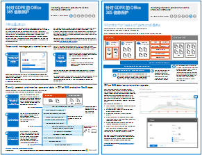

# 针对 GDPR 的 Office 365 信息保护

 **摘要：**此解决方案演示了如何保护 Office 365 服务中存储的敏感数据。
  
此解决方案包括针对发现、分类、保护和监视个人数据的指导性建议。该解决方案以一般数据保护条例 (GDPR) 为例，但用户可以采用同一流程实现对许多其他条例的符合性。

  
[PDF](http://download.microsoft.com/download/E/C/D/ECD5A339-EF10-4420-B3A9-99098884D716/MSFT_Cloud_architecture_information protection for GDPR.pdf)  | [Visio](http://download.microsoft.com/download/E/C/D/ECD5A339-EF10-4420-B3A9-99098884D716/MSFT_Cloud_architecture_information protection for GDPR.vsdx)
  

## 另请参阅

[安全解决方案](security-solutions.md)
  
[Microsoft 针对政治宣传活动、非营利组织和其他敏捷性组织的安全指南](microsoft-security-guidance-for-political-campaigns-nonprofits-and-other-agile-o.md)

